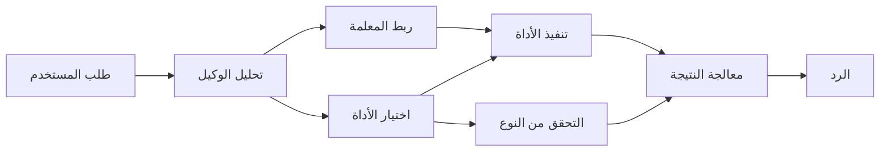

# 🛠️ الاستخدام المتقدم للأدوات مع Azure OpenAI (Responses API) (.NET)

## 📋 أهداف التعلم

يوضح هذا الدفتر أنماط تكامل الأدوات بمستوى المؤسسات باستخدام إطار عمل Microsoft Agent في .NET مع Azure OpenAI (Responses API). ستتعلم بناء وكلاء متقدمين مع أدوات متخصصة متعددة، مستفيدًا من الكتابة القوية في C# وميزات المؤسسات في .NET.

### قدرات الأدوات المتقدمة التي ستتقنها

- 🔧 **هيكلية متعددة الأدوات**: بناء وكلاء بقدرات متخصصة متعددة
- 🎯 **تنفيذ أدوات آمن نوعيًا**: الاستفادة من التحقق في وقت التجميع في C#
- 📊 **أنماط أدوات المؤسسات**: تصميم أدوات جاهزة للإنتاج وإدارة الأخطاء
- 🔗 **تركيب الأدوات**: دمج الأدوات لسير العمل التجاري المعقد

## 🎯 فوائد هيكلية أدوات .NET

### ميزات أدوات المؤسسات

- **التحقق في وقت التجميع**: تضمن الكتابة القوية صحة معلمات الأداة
- **حقن التبعيات**: تكامل حاوية IoC لإدارة الأدوات
- **أنماط Async/Await**: تنفيذ أدوات غير محُجِز مع إدارة موارد سليمة
- **التسجيل المنظم**: تكامل تسجيل مدمج لمراقبة تنفيذ الأدوات

### أنماط جاهزة للإنتاج

- **معالجة الاستثناءات**: إدارة شاملة للأخطاء باستخدام الاستثناءات المرتبطة بالنوع
- **إدارة الموارد**: أنماط التخلص السليمة وإدارة الذاكرة
- **مراقبة الأداء**: مقاييس وأجهزة عداد أداء مدمجة
- **إدارة التهيئة**: تهيئة آمنة نوعيًا مع التحقق

## 🔧 الهيكلية التقنية

### مكونات أدوات .NET الأساسية

- **Microsoft.Extensions.AI**: طبقة تجريد موحدة للأدوات
- **Microsoft.Agents.AI**: تنسيق أدوات على مستوى المؤسسات
- **Azure OpenAI (Responses API)**: عميل API عالي الأداء مع تجميع الاتصالات

### خط تنفيذ الأدوات



## 🛠️ فئات وأنماط الأدوات

### 1. **أدوات معالجة البيانات**

- **التحقق من الإدخال**: كتابة قوية مع تعليقات بيانات
- **عمليات التحويل**: تحويل وتنسيق بيانات آمن نوعيًا
- **المنطق التجاري**: أدوات حسابات وتحليلات مخصصة للمجال
- **تنسيق المخرجات**: توليد استجابات منظمة

### 2. **أدوات التكامل** 

- **موصلات API**: تكامل خدمات RESTful مع HttpClient
- **أدوات قاعدة البيانات**: تكامل Entity Framework للوصول إلى البيانات
- **عمليات الملفات**: عمليات نظام ملفات آمنة مع التحقق
- **الخدمات الخارجية**: أنماط تكامل خدمات الطرف الثالث

### 3. **أدوات المرافق**

- **معالجة النصوص**: أدوات التلاعب بالنصوص والتنسيق
- **عمليات التاريخ/الوقت**: حسابات التاريخ/الوقت الواعية للثقافة
- **الأدوات الرياضية**: حسابات دقيقة وعمليات إحصائية
- **أدوات التحقق**: التحقق من قواعد الأعمال والتحقق من البيانات

هل أنت مستعد لبناء وكلاء بمستوى المؤسسات مع أدوات قوية وآمنة نوعيًا في .NET؟ لنبني بعض الحلول المهنية! 🏢⚡

## 🚀 البداية

### المتطلبات الأساسية

- [.NET 10 SDK](https://dotnet.microsoft.com/download/dotnet/10.0) أو أعلى
- اشتراك [Azure](https://azure.microsoft.com/free/) مع مورد Azure OpenAI ونشر نموذج
- [Azure CLI](https://learn.microsoft.com/cli/azure/install-azure-cli) — سجّل الدخول باستخدام `az login`

### متغيرات البيئة المطلوبة

```bash
# zsh/bash
export AZURE_OPENAI_ENDPOINT=https://<your-resource>.openai.azure.com
export AZURE_OPENAI_DEPLOYMENT=gpt-4.1-mini
# ثم قم بتسجيل الدخول حتى يتمكن AzureCliCredential من الحصول على رمز مميز
az login
```

```powershell
# باورشيل
$env:AZURE_OPENAI_ENDPOINT = "https://<your-resource>.openai.azure.com"
$env:AZURE_OPENAI_DEPLOYMENT = "gpt-4.1-mini"
# ثم سجل الدخول حتى يتمكن AzureCliCredential من الحصول على رمز توكن
az login
```

### مثال على الكود

لتشغيل مثال الكود،

```bash
# zsh/bash
chmod +x ./04-dotnet-agent-framework.cs
./04-dotnet-agent-framework.cs
```

أو باستخدام dotnet CLI:

```bash
dotnet run ./04-dotnet-agent-framework.cs
```

راجع [`04-dotnet-agent-framework.cs`](../../../../04-tool-use/code_samples/04-dotnet-agent-framework.cs) للكود الكامل.

```csharp
#!/usr/bin/dotnet run

#:package Microsoft.Extensions.AI@10.*
#:package Microsoft.Agents.AI.OpenAI@1.*-*
#:package Azure.AI.OpenAI@2.1.0
#:package Azure.Identity@1.13.1

using System.ComponentModel;

using Microsoft.Agents.AI;
using Microsoft.Extensions.AI;

using Azure.AI.OpenAI;
using Azure.Identity;

// Tool Function: Random Destination Generator
// This static method will be available to the agent as a callable tool
// The [Description] attribute helps the AI understand when to use this function
// This demonstrates how to create custom tools for AI agents
[Description("Provides a random vacation destination.")]
static string GetRandomDestination()
{
    // List of popular vacation destinations around the world
    // The agent will randomly select from these options
    var destinations = new List<string>
    {
        "Paris, France",
        "Tokyo, Japan",
        "New York City, USA",
        "Sydney, Australia",
        "Rome, Italy",
        "Barcelona, Spain",
        "Cape Town, South Africa",
        "Rio de Janeiro, Brazil",
        "Bangkok, Thailand",
        "Vancouver, Canada"
    };

    // Generate random index and return selected destination
    // Uses System.Random for simple random selection
    var random = new Random();
    int index = random.Next(destinations.Count);
    return destinations[index];
}

// Azure OpenAI with the Responses API (stable v1 endpoint). Sign in with `az login`.
var azureEndpoint = Environment.GetEnvironmentVariable("AZURE_OPENAI_ENDPOINT")
    ?? throw new InvalidOperationException("AZURE_OPENAI_ENDPOINT is not set.");
var deployment = Environment.GetEnvironmentVariable("AZURE_OPENAI_DEPLOYMENT") ?? "gpt-4.1-mini";

var azureClient = new AzureOpenAIClient(new Uri(azureEndpoint), new AzureCliCredential());

// Define Agent Identity and Comprehensive Instructions
// Agent name for identification and logging purposes
var AGENT_NAME = "TravelAgent";

// Detailed instructions that define the agent's personality, capabilities, and behavior
// This system prompt shapes how the agent responds and interacts with users
var AGENT_INSTRUCTIONS = """
You are a helpful AI Agent that can help plan vacations for customers.

Important: When users specify a destination, always plan for that location. Only suggest random destinations when the user hasn't specified a preference.

When the conversation begins, introduce yourself with this message:
"Hello! I'm your TravelAgent assistant. I can help plan vacations and suggest interesting destinations for you. Here are some things you can ask me:
1. Plan a day trip to a specific location
2. Suggest a random vacation destination
3. Find destinations with specific features (beaches, mountains, historical sites, etc.)
4. Plan an alternative trip if you don't like my first suggestion

What kind of trip would you like me to help you plan today?"

Always prioritize user preferences. If they mention a specific destination like "Bali" or "Paris," focus your planning on that location rather than suggesting alternatives.
""";

// Create AI Agent with Advanced Travel Planning Capabilities
// Get the Responses client for the deployment and create the AI agent
// Configure agent with name, detailed instructions, and available tools
// This demonstrates the .NET agent creation pattern with full configuration
AIAgent agent = azureClient
    .GetChatClient(deployment)
    .AsAIAgent(
        name: AGENT_NAME,
        instructions: AGENT_INSTRUCTIONS,
        tools: [AIFunctionFactory.Create(GetRandomDestination)]
    );

// Create New Conversation Session for Context Management
// Initialize a new conversation session to maintain context across multiple interactions
// Sessions enable the agent to remember previous exchanges and maintain conversational state
// This is essential for multi-turn conversations and contextual understanding
await using var session = await agent.CreateSessionAsync();

// Execute Agent: First Travel Planning Request
// Run the agent with an initial request that will likely trigger the random destination tool
// The agent will analyze the request, use the GetRandomDestination tool, and create an itinerary
// Using the session parameter maintains conversation context for subsequent interactions
await foreach (var update in agent.RunStreamingAsync("Plan me a day trip", session))
{
    await Task.Delay(10);
    Console.Write(update);
}

Console.WriteLine();

// Execute Agent: Follow-up Request with Context Awareness
// Demonstrate contextual conversation by referencing the previous response
// The agent remembers the previous destination suggestion and will provide an alternative
// This showcases the power of conversation sessions and contextual understanding in .NET agents
await foreach (var update in agent.RunStreamingAsync("I don't like that destination. Plan me another vacation.", session))
{
    await Task.Delay(10);
    Console.Write(update);
}
```

---

<!-- CO-OP TRANSLATOR DISCLAIMER START -->
**تنويه**:
تمت ترجمة هذا المستند باستخدام خدمة الترجمة بالذكاء الاصطناعي [Co-op Translator](https://github.com/Azure/co-op-translator). بينما نسعى للدقة، يرجى العلم أن الترجمات الآلية قد تحتوي على أخطاء أو عدم دقة. يجب اعتبار المستند الأصلي بلغته الأصلية المصدر الرسمي والمعتمد. للمعلومات الهامة، يُنصح بالاستعانة بترجمة بشرية محترفة. نحن غير مسؤولين عن أي سوء فهم أو تفسير ناتج عن استخدام هذه الترجمة.
<!-- CO-OP TRANSLATOR DISCLAIMER END -->