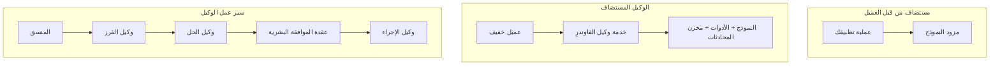
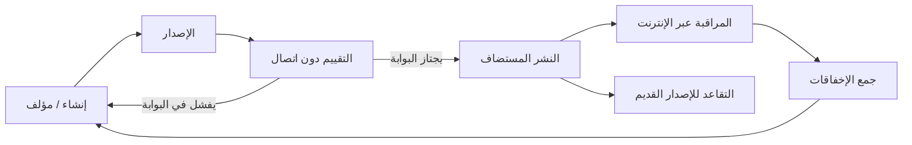
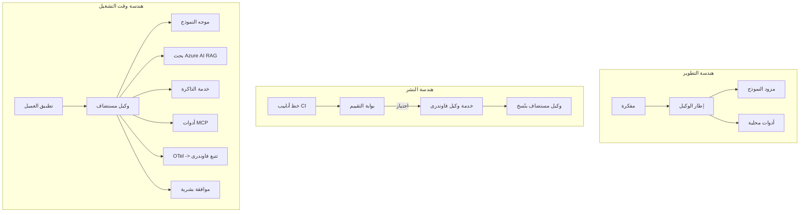

# نشر وكلاء قابلين للتوسع باستخدام Microsoft Foundry


حتى هذه النقطة في الدورة، قمت ببناء وكلاء يعملون على جهاز الكمبيوتر المحمول الخاص بك، داخل دفتر الملاحظات، مدفوعين بـ `az login` ومجموعة من متغيرات البيئة. هذه هي الطريقة الصحيحة تمامًا للتعلم. لكنها ليست الطريقة الصحيحة لتشغيل وكيل يعتمد عليه آلاف العملاء في الساعة 3 صباحًا.

هذا الدرس حول الفجوة بين "يعمل على جهازي" و "يعمل بشكل موثوق وبسعر معقول في الإنتاج." نغلق هذه الفجوة باستخدام **Microsoft Foundry** و **خدمة وكيل Microsoft Foundry**، ونقوم بذلك من خلال بناء وكيل دعم عملاء حقيقي يحتوي على أدوات، استرجاع، ذاكرة، تقييم، ومراقبة.

## مقدمة

سيغطي هذا الدرس:

- الفرق بين **وكيل نموذج أولي** و **وكيل منشور**، ولماذا الانتقال يتعلق في الغالب بكل شيء *حول* النموذج.
- **أنماط النشر** للوكلاء: مستضاف من العميل، مستضاف كخدمة (وكلاء مستضافون)، ومنسق عن طريق سير العمل.
- **دورة حياة الوكيل** على Microsoft Foundry — إنشاء، إصدار، نشر، تقييم، مراقبة، تقاعد.
- **استراتيجيات التوسع**: توجيه النموذج، التخزين المؤقت، التزامن، وتصميم بلا حالة.
- **المراقبة** باستخدام OpenTelemetry وتتبع Foundry.
- **تحسين التكلفة** من خلال اختيار النموذج، التوجيه، وبوابات التقييم.
- **اعتبارات المؤسسات**: الحوكمة، الموافقة البشرية، وتشغيل خوادم MCP بأمان في الإنتاج.

## أهداف التعلم

بعد إكمال هذا الدرس، ستعرف كيف:

- اختيار نمط النشر المناسب لحمل عمل وكيل معين.
- نشر وكيل إلى خدمة وكيل Microsoft Foundry ليصبح مُدارًا، موجَهًا، وقابل للمراقبة.
- أدوات وكيل من أجل التتبع وربط خط إنتاج التقييم الذي يعمل قبل كل إصدار.
- تطبيق توجيه النموذج والتخزين المؤقت للحفاظ على الكمون والتكلفة تحت السيطرة على نطاق واسع.
- إضافة بوابة موافقة بشرية للإجراءات عالية المخاطر ودمج خادم MCP بطريقة آمنة للإنتاج.

## المتطلبات المسبقة

يفترض هذا الدرس أنك أتممت الدروس السابقة وتشعر بالراحة مع:

- بناء الوكلاء باستخدام [إطار عمل Microsoft Agent](../14-microsoft-agent-framework/README.md) (الدرس 14).
- [استخدام الأدوات](../04-tool-use/README.md) (الدرس 4) و [Agentic RAG](../05-agentic-rag/README.md) (الدرس 5).
- [ذاكرة الوكيل](../13-agent-memory/README.md) (الدرس 13) و [بروتوكولات Agentic / MCP](../11-agentic-protocols/README.md) (الدرس 11).
- [المراقبة والتقييم](../10-ai-agents-production/README.md) (الدرس 10) — هذا الدرس يبني مباشرة عليها.

ستحتاج أيضًا إلى:

- **اشتراك Azure** ومشروع **Microsoft Foundry** به على الأقل نموذج دردشة منشور واحد.
- مصادقة **Azure CLI** (`az login`).
- بايثون 3.12+ والحزم الموجودة في مستودع [`requirements.txt`](../../../requirements.txt).

## من النموذج الأولي إلى الإنتاج: ما الذي يتغير فعليًا

يشارك وكيل النموذج الأولي ووكيل الإنتاج نفس الحلقة الأساسية — التفكير، استدعاء الأدوات، الاستجابة. ما يتغير هو كل شيء ملتف حول تلك الحلقة. النموذج يمثل ربما 20% من وكيل الإنتاج؛ والـ 80% الآخر هو الهيكل التشغيلي.

| الشاغل | نموذج أولي | الإنتاج |
| --- | --- | --- |
| **الاستضافة** | يعمل في دفتر ملاحظاتك | يعمل كخدمة مستضافة، مُدارة ونشرت تدريجيًا |
| **الهوية** | رمز دخول `az login` الخاص بك | هوية مدارة مع صلاحيات RBAC محددة |
| **الحالة** | في الذاكرة، تفقد عند إعادة التشغيل | خارجية (مخزن الخيوط، خدمة الذاكرة) |
| **الفشل** | ترى تتبع الاستدعاء | إعادة المحاولة، التراجع، رسائل الموت، التنبيهات |
| **التكلفة** | "إنها بضعة سنتات" | تتبع لكل طلب، توجيه، تخزين مؤقت، ميزانية |
| **الجودة** | تراقب المخرجات بعينيك | يُقيم تلقائيًا قبل كل إصدار |
| **الثقة** | توافق على كل إجراء بنفسك | سياسة + تدخل بشري في الحلقة للإجراءات الخطرة |

تذكر هذا الجدول. كل قسم أدناه يطابق واحدة من هذه الصفوف.

## أنماط نشر الوكيل

هناك ثلاثة أنماط ستستخدمها، غالبًا معًا.

### 1. وكلاء مستضافون على العميل

كائن الوكيل يعيش داخل *عملية* تطبيقك. يستدعي كودك مزود النموذج مباشرة؛ حلقة التفكير تعمل في خدمتك. هذا ما قام به كل درس سابق.

- **استخدمه عندما** تحتاج إلى تحكم كامل في الحلقة، وسيط مخصص، أو ما كنت تدمج الوكيل داخل خلفية موجودة.
- **المقايضة**: أنت المسؤول عن التوسع، الحالة، والمرونة بنفسك.

### 2. وكلاء مستضافون (خدمة Foundry Agent)

يُسجل الوكيل كـ *مورد* في Microsoft Foundry. تستضيف Foundry حلقة التفكير، تخزن الخيوط، تفرض سلامة المحتوى وصلاحيات RBAC، وتجعل الوكيل مرئيًا في بوابة Foundry. يصبح تطبيقك عميلًا نحيفًا ينشئ الخيوط ويقرأ الاستجابات.

- **استخدمه عندما** تريد المتانة، المراقبة المدمجة، الحوكمة، ومساحة سطح تشغيل أقل.
- **المقايضة**: تحكم أقل على مستوى منخفض مقابل بيئة تشغيل مُدارة.

### 3. سير عمل الوكيل

يتم تركيب عدة وكلاء (وأدوات) في رسم بياني مع تدفق تحكم صريح — خطوات متسلسلة، تفرعات، عقد موافقة بشرية، ونقاط تحقق دائمة يمكن أن توقف وتستأنف. هذه هي قدرة **سير العمل** لإطار عمل Microsoft Agent عند تطبيقها على نطاق النشر.

- **استخدمه عندما** تمتد مهمة واحدة عبر عدة وكلاء متخصصين أو تتطلب خطوة موافقة في المنتصف.
- **المقايضة**: المزيد من الأجزاء المتحركة؛ يحتاج إلى مراقبة على مستوى التنسيق.



## دورة حياة الوكيل على Microsoft Foundry

نشر وكيل ليس عملية `push` تتم مرة واحدة. إنها حلقة، وتشبه إلى حد كبير دورة إصدار البرمجيات لأنها في الحقيقة كذلك.



الفكرة الأساسية، المنقولة من [الدرس 10](../10-ai-agents-production/README.md): **التقييم في وضع عدم الاتصال هو بوابة، وليس تفكيرًا لاحقًا.** لا يتم شحن إصدار وكيل جديد إلا إذا اجتاز عتبات التقييم الخاصة بك. ثم تغذي المراقبة عبر الإنترنت حالات الفشل الواقعية إلى مجموعة اختبار عدم الاتصال الخاصة بك. هذه هي الحلقة بأكملها.

## استراتيجيات التوسع

توسيع وكيل يختلف عن توسيع واجهة برمجة تطبيقات ويب بلا حالة، لأن كل طلب يمكن أن يثير عدة استدعاءات مكلفة للنموذج والأدوات. أربع تقنيات تحمل معظم الحمل.

**معالجة الطلبات بلا حالة.** لا تحتفظ بأي حالة لكل مستخدم في ذاكرة العملية. قم بالحفاظ على خيوط المحادثة في مخزن الخيوط Foundry أو خدمة ذاكرة حتى يمكن لأي مثيل التعامل مع أي طلب. هذا ما يتيح التوسع أفقيًا — إضافة مثيلات، بدون جلسات لاصقة.

**توجيه النموذج.** ليس كل طلب يحتاج إلى النموذج الأكثر قدرة (والأكثر تكلفة). وجه الطلبات البسيطة — تصنيف النية، إجابات مختصرة واقعية — إلى نموذج صغير وسريع، واحتفظ بالنموذج الكبير للتفكير الحقيقي. يمكن لـ **موجه النماذج** في Foundry القيام بذلك نيابة عنك، أو يمكنك تنفيذ مصنف خفيف بنفسك. ستبني النسخة بنفسك في المختبر.

**التخزين المؤقت للاستجابات.** العديد من استفسارات الدعم هي شبه مكررة ("كيف أعيد تعيين كلمة المرور الخاصة بي؟"). خزّن الإجابات على الأسئلة الشائعة وقدمها دون الحاجة إلى الوصول إلى النموذج على الإطلاق. حتى معدل ضئيل لضرب التخزين المؤقت يقلل التكلفة والكمون بشكل ملحوظ.

**التزامن والضغط العكسي.** لمزودي النماذج حدود على المعدل. حدد مدى تزامنك، استخدم إعادة المحاولة مع تراجع أسي، وفشل بلطف (استجابة "نحن نعمل على الأمر" في الانتظار تفوق على الخطأ 500).


## المراقبة في الإنتاج

لا يمكنك تشغيل ما لا يمكنك رؤيته. كما تناولت في الدرس 10، يصدر إطار عمل Microsoft Agent أثر **OpenTelemetry** بشكل أصلي — كل استدعاء نموذج، وتنفيذ أداة، وخطوة تنسيق تتحول إلى نطاق. في الإنتاج، تصدر هذه النطاقات إلى Microsoft Foundry (أو أي جهة خلفية متوافقة مع OTel) حتى تتمكن من:

- تتبع شكوى عميل واحدة من البداية للنهاية عبر كل استدعاء نموذج وأداة.
- مراقبة الكمون للب50/الب95 وتكلفة كل طلب مع مرور الوقت.
- التنبيه على ارتفاع معدلات الخطأ وشذوذ التكاليف قبل أن يلاحظها المستخدمون (أو فريق المالية).

```python
from agent_framework.observability import get_tracer

tracer = get_tracer()

with tracer.start_as_current_span("support_request") as span:
    span.set_attribute("customer.tier", "enterprise")
    span.set_attribute("routed.model", "gpt-5-nano")
    # يتم تتبع تنفيذ الوكيل تلقائيًا داخل هذا النطاق
```

السمات مثل `customer.tier` و `routed.model` هي التي تحول جدار الأثر إلى أسئلة قابلة للإجابة ("هل يتم توجيه العملاء المؤسسيين إلى النموذج الصغير بشكل متكرر جدًا؟").

## تحسين التكلفة

تكاليف وكلاء الإنتاج تهيمن عليها الرموز. ثلاث رافعات، بترتيب التأثير:

1. **اختيار حجم النموذج المناسب.** النموذج الصغير الذي يجتاز بوابة التقييم الخاصة بك عادةً ما يكون أرخص من النموذج الكبير الذي يجتازها أيضًا. استخدم التقييم لـ *إثبات* أن النموذج الصغير جيد بما فيه الكفاية بدلاً من اختيار النموذج الأكبر من باب الحذر.
2. **التوجيه حسب التعقيد.** كما سبق — ادفع أسعار النموذج الكبير فقط للطلبات التي تحتاج تفكير النموذج الكبير.
3. **التخزين المؤقت بشكل مكثف.** أقل مكالمة نموذج تكلفة هي التي لا تقوم بها أبدًا.

بوابات التقييم والتحكم في التكلفة هي نفس الانضباط من زاويتين: التقييم يحدد *أدنى جودة*، التوجيه والتخزين المؤقت يبقيانك قريبًا من *تكلفة* ذلك الأدنى قدر المستطاع.

## اعتبارات نشر المؤسسات

**الحوكمة.** يرث وكلاء الاستضافة صلاحيات RBAC، وسلامة المحتوى، وتسجيل التدقيق من Foundry. امنح كل وكيل هوية مُدارة بأدنى صلاحيات يحتاجها — وصول قراءة فقط إلى قاعدة المعرفة، وصول محدد إلى واجهة برمجة التذاكر، لا أكثر.

**البشر في الحلقة.** بعض الإجراءات لها تبعات كبيرة جدًا بحيث لا يمكن أتمتتها بشكل مباشر — إصدار استرداد، حذف حساب، التصعيد إلى فريق قانوني. يدعم إطار عمل Microsoft Agent الأدوات التي تتطلب **الموافقة:** يقترح الوكيل الإجراء، يتوقف التنفيذ، يوافق شخص أو يرفض، ثم يستأنف سير العمل. رأيت هذه البادئة في [الدرس 6](../06-building-trustworthy-agents/README.md); هنا تنشرها.

**MCP في الإنتاج.** يتيح لك [MCP](../11-agentic-protocols/README.md) لوكيلاك استهلاك الأدوات الخارجية عبر واجهة معيارية. في الإنتاج، اعتبر كل خادم MCP كحدود غير موثوقة: ثبت إصدار الخادم، شغّله بهوية محددة، تحقق من مخرجاته، ولا تعرض له أسرارًا أبدًا. خادم MCP هو تبعية، والتبعيات يتم تصحيحها، تدقيقها، وتحديد معدلاتها.



تلك المخططات الثلاثة - التطوير، النشر، وقت التشغيل - هي نفس الوكيل في ثلاث مراحل من حياته. المختبر التالي يرشدك خلال بناءه.

## مختبر عملي: وكيل دعم العملاء جاهز للإنتاج

افتح [`code_samples/16-python-agent-framework.ipynb`](./code_samples/16-python-agent-framework.ipynb) وابدأ العمل عليه من البداية إلى النهاية. ستجمع **وكيل دعم عملاء Contoso** مع كل الاهتمامات الإنتاجية مربوطة بداخله:

1. **استدعاء الأدوات** — البحث عن حالة الطلب وفتح تذاكر الدعم.
2. **RAG** — الإجابة عن أسئلة السياسات من قاعدة المعرفة (Azure AI Search، مع بديل في الذاكرة حتى يعمل دفتر الملاحظات بدون مورد بحث).
3. **الذاكرة** — تذكر العميل عبر جولات المحادثة.
4. **توجيه النموذج** — مصنف التعقيد يوجه كل طلب إلى نموذج صغير أو كبير.
5. **التخزين المؤقت للاستجابات** — تُقدم الأسئلة المكررة من التخزين المؤقت.
6. **الموافقة البشرية** — الاستردادات فوق حد معين تتوقف للموافقة البشرية.
7. **خط تقييم** — مجموعة اختبار صغيرة غير متصلة تقيم الوكيل وتعمل كبوابة إصدار.
8. **المراقبة** — تتبع OpenTelemetry حول كل طلب.

### الشرح التفصيلي

دفتر الملاحظات منظم بحيث كل اهتمام إنتاجي هو قسم مستقل قابل للتشغيل. القلب منه هو معالج الطلبات مع التوجيه والذاكرة المؤقتة:

```python
async def handle_support_request(query: str, customer_id: str) -> str:
    # 1. قدّم من الذاكرة المؤقتة عندما نتمكن من ذلك.
    cached = response_cache.get(normalize(query))
    if cached:
        return cached

    # 2. قم بالتوجيه حسب التعقيد للتحكم في التكلفة.
    model = "gpt-5-nano" if is_simple(query) else "gpt-5-mini"

    # 3. شغّل الوكيل داخل فترة تتبع للمراقبة.
    with tracer.start_as_current_span("support_request") as span:
        span.set_attribute("routed.model", model)
        span.set_attribute("customer.id", customer_id)
        response = await support_agent.run(query, model=model)

    # 4. خزّن وأعد.
    response_cache.set(normalize(query), response.text)
    return response.text
```

بوابة التقييم التي تحرس الإصدار تبدو هكذا:

```python
async def evaluation_gate(agent, test_cases, threshold: float = 0.8) -> bool:
    passed = 0
    for case in test_cases:
        result = await agent.run(case["input"])
        if score_response(result.text, case["expected"]) >= 0.8:
            passed += 1
    pass_rate = passed / len(test_cases)
    print(f"Evaluation pass rate: {pass_rate:.0%} (gate: {threshold:.0%})")
    return pass_rate >= threshold  # انشر فقط إذا اجتاز البوابة
```

اقرأ كل سطر — يحافظ دفتر الملاحظات على البادئات صغيرة عمدًا حتى لا يُخفى شيء وراء استدعاء إطار العمل.

## التحقق من وكيل منشور عبر اختبارات التدخين

بوابة التقييم أعلاه تعمل *بدون اتصال* ضد كائن الوكيل الخاص بك. بمجرد نشر الوكيل كوكيل مستضاف، تحتاج إلى تحقق آخر، أرخص: **هل نقطة النهاية المنشورة ترد فعليًا؟**

إثبات "النشر الناجح" يثبت فقط أن مستوى التحكم قبل التعريف قُبل - لا يثبت أن الوكيل يرد. فقدان تبعية، توجيه نموذج خاطئ، أو اتصال منتهي يمكن أن يترك نشرًا أخضر لا يُرجع شيئًا. يلتقط **اختبار التدخين** ذلك في ثوانٍ، عند كل نشر، وبدون تكلفة تقييم كامل.

يوزع هذا المستودع خط أنابيب اختبار تدخين جاهز للاستخدام مبني على إجراء GitHub [AI Smoke Test](https://github.com/marketplace/actions/ai-smoke-test):

- **الكتالوج** — [`tests/lesson-16-smoke-tests.json`](../../../tests/lesson-16-smoke-tests.json) يحتوي على المطالبات والافتراضات لوكيل دعم Contoso (إجابات سياسة مؤصلة، بحث طلب، البقاء ضمن الموضوع، واستمرارية الخيط المتعددة الجولات). كتالوجات وكلاء دروس أخرى تعيش بجانبه — انظر [`tests/README.md`](../tests/README.md).
- **سير العمل** — [`.github/workflows/smoke-test.yml`](../../../.github/workflows/smoke-test.yml) يقوم بتسجيل الدخول باستخدام Azure OIDC ويرسل كل مطالبة إلى نقطة نهاية الاستجابات للوكيل، ويفشل الوظيفة عند أي فشل في الافتراض.

```yaml
- name: Smoke-test hosted agent
  uses: JFolberth/ai-smoketest@v1
  with:
    project_endpoint: ${{ inputs.project_endpoint }}
    agent_name: ContosoSupportAgent
    tests_file: tests/lesson-16-smoke-tests.json
```


قم بتشغيله من علامة التبويب **Actions** بمجرد نشر وكيلك، مع تزويد نقطة نهاية مشروع Foundry واسم الوكيل. تحتاج الهوية الموحدة إلى دور **Azure AI User** عند نطاق مشروع Foundry. فكر في الطبقات كهرم: اختبارات الدخان (هل هو متاح ويستجيب؟) تُجرى عند كل نشر، التقييم غير المتصل (هل هو جيد بما يكفي للإطلاق؟) يُجرى قبل الترقية، والتقييم عبر الإنترنت (كيف هو الأداء في الواقع؟) يُجرى بشكل مستمر.

## اختبار المعرفة

اختبر فهمك قبل الانتقال إلى التعيين.

**1. تقريبًا ما هي نسبة "النموذج" في وكيل الإنتاج، وما هو الباقي؟**

<details>
<summary>الإجابة</summary>

النموذج هو أقلية في النظام — غالبًا ما يُذكر حول 20%. الباقي هو الهيكل التشغيلي: الاستضافة والإصدار، الهوية وإدارة التحكم في الوصول (RBAC)، الحالة المعزولة، التعامل مع الأخطاء، تتبع التكاليف، التقييم، والتحكم البشري في الحلقة. الانتقال إلى الإنتاج يتعلق في الغالب ببناء كل شيء *حول* حلقة التفكير.
</details>

**2. متى تختار الوكيل المستضاف بدلاً من الوكيل المستضاف على العميل؟**

<details>
<summary>الإجابة</summary>

عندما تريد بيئة تشغيل مُدارة مع المتانة المدمجة (خيوط تستمر ويمكن استئنافها)، القابلية للمراقبة، سلامة المحتوى، وRBAC، وأنت مستعد للتخلي عن بعض التحكم على مستوى منخفض في حلقة التفكير مقابل منطقة تشغيل أقل تعقيدًا. يُفضل الوكيل المستضاف على العميل عندما تحتاج إلى تحكم كامل في الحلقة أو إذا كنت تدمج الوكيل في نظام خلفي موجود.
</details>

**3. لماذا يجب أن يكون الوكيل القابل للتوسع بلا حالة داخل ذاكرة العملية الخاصة به؟**

<details>
<summary>الإجابة</summary>

حتى يتمكن أي مثيل من التعامل مع أي طلب، وهذا ما يسمح بالتوسع الأفقي دون الجلسات المرتبطة. حالة المحادثة لكل مستخدم تُعزل إلى متجر خيوط أو خدمة ذاكرة. إذا عاشت الحالة في ذاكرة العملية، سوف تفقدها عند إعادة التشغيل ولن تتمكن من توزيع الحمل بحرية.
</details>

**4. ما المشكلة التي يحلها توجيه النموذج، وكيف يرتبط بالتقييم؟**

<details>
<summary>الإجابة</summary>

التوجيه يرسل الطلبات البسيطة إلى نموذج صغير ورخيص وسريع ويحتفظ بالنموذج الكبير للتفكير الحقيقي، مسيطرًا على كل من الكمون والتكلفة. يرتبط بالتقييم لأن التقييم هو ما *يثبت* أن النموذج الصغير جيد بما يكفي لفئة من الطلبات — التوجيه بدون تقييم هو تخمين.
</details>

**5. ما هو "بوابة التقييم" وأين تقع في دورة الحياة؟**

<details>
<summary>الإجابة</summary>

بوابة التقييم تُجرى مجموعة اختبارات غير متصلة على نسخة جديدة من الوكيل وتمنع النشر ما لم يتجاوز معدل النجاح العتبة المحددة. تقع بين "الإصدار" و"النشر" في دورة الحياة، مما يجعل الجودة شرطًا مسبقًا للإصدار بدلاً من شيء يتم التحقق منه بعد الإطلاق.
</details>

**6. لماذا يجب التعامل مع خادم MCP كحدود غير موثوق بها في الإنتاج؟**

<details>
<summary>الإجابة</summary>

لأنه اعتماد خارجي يستدعيه وكيلك. يجب تثبيت نسخته، تشغيله بهوية محدودة النطاق، التحقق من مخرجاته، تقييد معدلاته، وعدم إفشاء الأسرار له — نفس الانضباط الذي تطبقه على أي اعتماد من طرف ثالث. تدفقات مخرجاته تدخل في تفكير وكيلك، لذلك الثقة غير المحققة تشكل خطرًا أمنيًا.
</details>

**7. ما هو التغيير الوحيد الذي يؤثر عادة بأكبر قدر على تكلفة وكيل الإنتاج، ولماذا؟**

<details>
<summary>الإجابة</summary>

تحديد حجم النموذج المناسب — استخدام أصغر نموذج يمر عبر بوابة التقييم الخاصة بك. التكلفة تهيمن عليها الرموز، والنموذج الأصغر الذي يحقق معيار الجودة يكون عادة أرخص من الأكبر. التخزين المؤقت والتوجيه يقللان التكلفة أكثر، لكن اختيار النموذج الأساسي المناسب له التأثير الأكبر من الدرجة الأولى.
</details>

**8. ما الدور الذي تلعبه سمات النطاق مثل `customer.tier` و `routed.model` في القابلية للمراقبة؟**

<details>
<summary>الإجابة</summary>

تحول التتبعات الخام إلى أسئلة أعمال قابلة للإجابة. بدون السمات سيكون لديك جدار من النطاقات؛ ومعها يمكنك أن تسأل "هل يتم توجيه العملاء من المؤسسات إلى النموذج الصغير كثيرًا جدًا؟" أو "أي نموذج يعالج أبطأ طلباتنا؟" السمات هي الطريقة التي تقطع بها القياس عن طريق الأبعاد التي تهم عمليتك.
</details>

## التعيين

خذ وكيل دعم العملاء من المختبر وقم بتحصينه لسيناريو محدد: **وكيل دعم فواتير الاشتراك لشركة SaaS.**

يجب أن تتضمن إرسالك:

1. **استبدل الأدوات** بأدوات ذات صلة بالفوترة: `get_subscription_status`، `get_invoice`، و`issue_credit` (يتطلب الاعتمادات التي تزيد عن 50 دولارًا موافقة بشرية).
2. **أضف ثلاثة مستندات RAG** تغطي سياسة استرداد الشركة، دورة الفوترة، وسياسة الإلغاء.
3. **وسّع مجموعة التقييم** لتشمل ثماني حالات على الأقل، بما في ذلك حالتين *يجب* أن تُفعّل مسار الموافقة البشرية، وتأكد من أن بوابة التقييم تمرر أو تفشل بشكل صحيح.
4. **أضف تقرير تكلفة واحد**: بعد تشغيل عشر استعلامات مختلطة عبر الوكيل، اطبع عدد تلك التي ذهبت للنموذج الصغير، وعدد التي ذهبت للنموذج الكبير، وعدد التي تم خدمتها من التخزين المؤقت.

اكتب فقرة قصيرة (في خلية ماركداون) تشرح قاعدة توجيه النموذج التي اخترتها وكيف ستتحقق من صحتها باستخدام حركة مرور حقيقية. لا توجد إجابة صحيحة واحدة — سيتم تقييمك على ما إذا كانت الاعتبارات الإنتاجية موصلة بشكل متماسك.

## الملخص

في هذا الدرس، انتقلت بوكيل من النموذج الأولي إلى الإنتاج باستخدام Microsoft Foundry:

- القفز إلى الإنتاج يتعلق في الغالب بـ **الهيكل التشغيلي** حول النموذج — الاستضافة، الهوية، الحالة، التعامل مع الأخطاء، التكلفة، الجودة، والثقة.
- تعلمت ثلاثة **أنماط نشر** — استضافة على العميل، والوكلاء المستضافون، وسير عمل الوكيل — ومتى يناسب كل منها.
- مررت بـ **دورة حياة الوكيل**، حيث يعمل التقييم غير المتصل كـ **بوابة إصدار** وترجع المراقبة عبر الإنترنت الفشل إلى مجموعة الاختبار.
- طبقت **استراتيجيات التوسع** — التصميم بلا حالة، توجيه النموذج، التخزين المؤقت، والتزامن المحدود — وربطتها بـ **تحسين التكلفة**.
- ربطت **الضوابط المؤسسية**: RBAC، الموافقة البشرية، وتكامل MCP الآمن للإنتاج.
- بنيت **وكيل دعم عملاء جاهز للإنتاج** يربط كل هذه الاهتمامات في كود يمكن تشغيله.

الدرس التالي يأخذ الرحلة المعاكسة: بدلاً من توسيع الوكلاء إلى السحابة، ستنقلهم *إلى الأسفل* إلى جهاز مطور واحد وتشغلهم محليًا بالكامل.

## مصادر إضافية

- <a href="https://learn.microsoft.com/azure/ai-foundry/what-is-azure-ai-foundry" target="_blank">وثائق Microsoft Foundry</a>
- <a href="https://learn.microsoft.com/azure/ai-foundry/agents/overview" target="_blank">نظرة عامة على خدمة وكلاء Microsoft Foundry</a>
- <a href="https://aka.ms/ai-agents-beginners/agent-framework" target="_blank">إطار عمل وكلاء Microsoft</a>
- <a href="https://learn.microsoft.com/azure/ai-foundry/concepts/model-router" target="_blank">موجّه النموذج في Microsoft Foundry</a>
- <a href="https://learn.microsoft.com/azure/search/search-what-is-azure-search" target="_blank">Azure AI Search</a>
- <a href="https://opentelemetry.io/" target="_blank">OpenTelemetry</a>
- <a href="https://github.com/marketplace/actions/ai-smoke-test" target="_blank">إجراء GitHub لاختبار الدخان AI</a>
- <a href="https://modelcontextprotocol.io/" target="_blank">بروتوكول سياق النموذج (MCP)</a>

## الدرس السابق

[بناء وكلاء استخدام الحاسوب (CUA)](../15-browser-use/README.md)

## الدرس التالي

[إنشاء وكلاء AI محليين](../17-creating-local-ai-agents/README.md)

---

<!-- CO-OP TRANSLATOR DISCLAIMER START -->
**تنويه**:
تمت ترجمة هذا المستند باستخدام خدمة الترجمة بالذكاء الاصطناعي [Co-op Translator](https://github.com/Azure/co-op-translator). بينما نسعى للدقة، يرجى العلم أن الترجمات الآلية قد تحتوي على أخطاء أو عدم دقة. يجب اعتبار المستند الأصلي بلغته الأصلية المصدر الرسمي والمعتمد. للمعلومات الهامة، يُنصح بالاستعانة بترجمة بشرية محترفة. نحن غير مسؤولين عن أي سوء فهم أو تفسير ناتج عن استخدام هذه الترجمة.
<!-- CO-OP TRANSLATOR DISCLAIMER END -->