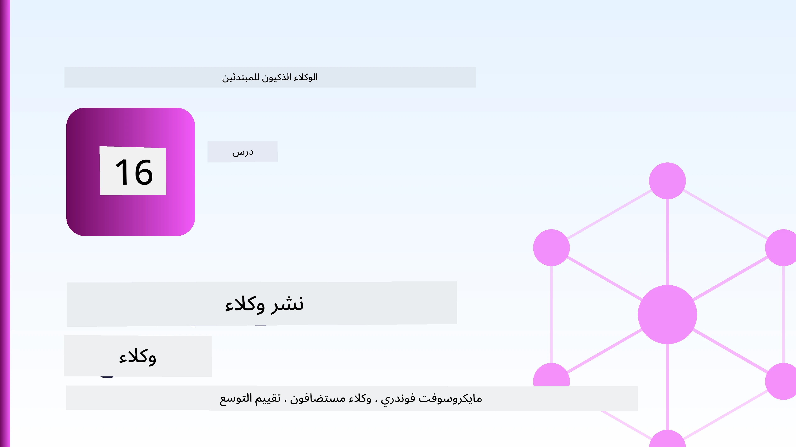
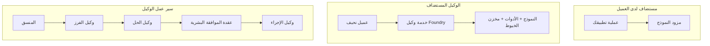
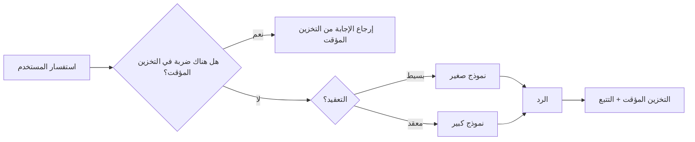
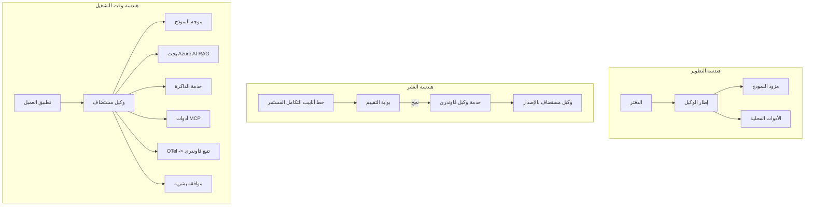

# نشر الوكلاء القابلين للتوسع باستخدام Microsoft Foundry



حتى هذه النقطة في الدورة التدريبية، قمت ببناء وكلاء يعملون على حاسوبك المحمول، داخل مفكرة، مدفوعة بأمر `az login` وعدد قليل من المتغيرات البيئية. هذه هي الطريقة المناسبة للتعلم بالضبط. لكنها ليست الطريقة المناسبة لتشغيل وكيل يعتمد عليه آلاف العملاء في الساعة 3 صباحًا.

هذا الدرس يدور حول الفجوة بين "يعمل على جهازي" و "يعمل بشكل موثوق وميسور التكلفة في الإنتاج." نحن نسد هذه الفجوة باستخدام **Microsoft Foundry** و **Microsoft Foundry Agent Service**، ونفعل ذلك ببناء وكيل دعم عملاء حقيقي يحتوي على أدوات، واسترجاع، وذاكرة، وتقييم، ومراقبة.

## المقدمة

سيغطي هذا الدرس:

- الفرق بين **وكيل النموذج الأولي** و **وكيل الإنتاج**، ولماذا الانتقال يتعلق في الغالب بكل شيء *حول* النموذج.
- **أنماط النشر** للوكلاء: استضافة العميل، استضافة الخدمة (الوكلاء المستضافون)، وتنظيم سير العمل.
- **دورة حياة الوكيل** على Microsoft Foundry — الإنشاء، الإصدار، النشر، التقييم، المراقبة، التقاعد.
- **استراتيجيات التوسع**: توجيه النموذج، التخزين المؤقت، التزامن، والتصميم بدون حالة.
- **المراقبة** باستخدام OpenTelemetry وتتبع Foundry.
- **تحسين التكلفة** من خلال اختيار النموذج، التوجيه، وبوابات التقييم.
- **اعتبارات المؤسسات**: الحوكمة، الموافقة البشرية، وتشغيل خوادم MCP بأمان في الإنتاج.

## أهداف التعلم

بعد إكمال هذا الدرس، ستعرف كيفية:

- اختيار نمط النشر المناسب لحمل عمل وكيل معين.
- نشر وكيل في خدمة Microsoft Foundry Agent بحيث يتم إصدار نسخه، وحوكمته، ومراقبته.
- تجهيز وكيل للتتبع وربط خط أنابيب التقييم الذي يعمل قبل كل إصدار.
- تطبيق توجيه النموذج والتخزين المؤقت للحفاظ على الكمون والتكلفة تحت السيطرة على نطاق واسع.
- إضافة بوابة موافقة بشرية للإجراءات عالية المخاطر ودمج خادم MCP بطريقة آمنة للإنتاج.

## المتطلبات المسبقة

يفترض هذا الدرس أنك قد أكملت الدروس السابقة وأنك مرتاح لـ:

- بناء وكلاء باستخدام [Microsoft Agent Framework](../14-microsoft-agent-framework/README.md) (الدرس 14).
- [استخدام الأدوات](../04-tool-use/README.md) (الدرس 4) و [Agentic RAG](../05-agentic-rag/README.md) (الدرس 5).
- [ذاكرة الوكيل](../13-agent-memory/README.md) (الدرس 13) و [بروتوكولات الوكيل / MCP](../11-agentic-protocols/README.md) (الدرس 11).
- [المراقبة والتقييم](../10-ai-agents-production/README.md) (الدرس 10) — هذا الدرس يبني عليه مباشرة.

ستحتاج أيضًا إلى:

- **اشتراك Azure** ومشروع **Microsoft Foundry** يحتوي على نموذج دردشة منشور واحد على الأقل.
- أداة **Azure CLI** مصادق عليها (`az login`).
- Python 3.12+ والحزم في المستودع [`requirements.txt`](../../../requirements.txt).

## من النموذج الأولي إلى الإنتاج: ما الذي يتغير فعلاً

يشارك وكيل النموذج الأولي ووكيل الإنتاج نفس الحلقة الأساسية — الاستدلال، استدعاء الأدوات، الاستجابة. ما يتغير هو كل شيء ملفوف حول تلك الحلقة. النموذج قد يكون 20% فقط من وكيل الإنتاج؛ و80% الأخرى هي الهيكل التشغيلي.

| الاعتبار | النموذج الأولي | الإنتاج |
| --- | --- | --- |
| **الاستضافة** | يعمل في مفكرتك | يعمل كخدمة مستضافة، بإصدارات وتوزيع |
| **الهوية** | رمز `az login` الخاص بك | هوية مُدارة مع RBAC مخصصة |
| **الحالة** | في الذاكرة، تُفقد عند إعادة التشغيل | خارجية (مخزن الخيوط، خدمة الذاكرة) |
| **الفشل** | ترى أثر التتبع | إعادة المحاولة، الحلول البديلة، الرسائل الميتة، التنبيهات |
| **التكلفة** | "بضع سنتات" | تم تتبعها لكل طلب، موجهة، مخزنة، مدبرة الميزانية |
| **الجودة** | تُراجع النتائج بنفسك | مُقيمة تلقائيًا قبل كل إصدار |
| **الثقة** | توافق على كل إجراء | السياسة + تدخل بشري للأفعال عالية المخاطر |

احتفظ بهذا الجدول في ذهنك. كل قسم أدناه يطابق أحد هذه الصفوف.

## أنماط نشر الوكلاء

هناك ثلاثة أنماط ستستخدمها، غالبًا معًا.

### 1. وكلاء مستضافون على العميل

كائن الوكيل يعيش داخل *عملية تطبيقك الخاصة*. يقوم رمزك بالاتصال بمزود النموذج مباشرة؛ تعمل حلقة الاستدلال في خدمتك. هذا ما قامت به كل الدروس السابقة.

- **استخدمه عندما** تحتاج إلى تحكم كامل في الحلقة، أو طبقة وسيطة مخصصة، أو تقوم بدمج الوكيل داخل الخلفية الموجودة.
- **المقابل**: أنت تدير التوسع، الحالة، والمرونة بنفسك.

### 2. الوكلاء المستضافون (خدمة وكلاء Foundry)

الوكيل *مسجل كمورد* في Microsoft Foundry. تستضيف Foundry حلقة الاستدلال، تخزن الخيوط، تفرض سلامة المحتوى وRBAC، وتجعل الوكيل مرئيًا في بوابة Foundry. يصبح تطبيقك عميلًا رقيقًا ينشئ الخيوط ويقرأ الاستجابات.

- **استخدمه عندما** تريد المتانة، الرصد المدمج، الحوكمة، ومساحة تشغيل أقل.
- **المقابل**: تحكم أقل على المستوى الأدنى مقابل بيئة تشغيل مُدارة.

### 3. سير عمل الوكيل

يتم تركيب عدة وكلاء (وأدوات) في رسم بياني مع تدفق تحكم صريح — خطوات متسلسلة، فروع، عقد موافقة بشرية، ونقاط توقف دائمة يمكن إيقافها واستئنافها. هذه هي القدرة على **سير العمل** في Microsoft Agent Framework مطبقة على مقياس النشر.

- **استخدمه عندما** تمتد مهمة واحدة عبر عدة وكلاء متخصصين أو تتطلب خطوة موافقة في المنتصف.
- **المقابل**: مزيد من الأجزاء المتحركة؛ يحتاج إلى مراقبة على مستوى التنظيم.



## دورة حياة الوكيل على Microsoft Foundry

نشر الوكيل ليس أمرًا واحدًا `push`. إنها حلقة، وتشبه كثيرًا دورة إصدار البرامج لأنها في الحقيقة كذلك.


الفكرة الأساسية، المنقولة من [الدرس 10](../10-ai-agents-production/README.md): **التقييم غير المتصل بالإنترنت هو بوابة، وليس فكرة لاحقة.** لا يتم شحن إصدار وكيل جديد إلا إذا تجاوز نقاط تقييمك. ثم تغذي المراقبة عبر الإنترنت حالات الفشل الحقيقية مرة أخرى إلى مجموعة الاختبارات غير المتصلة. هذه هي الحلقة بأكملها.

## استراتيجيات التوسع

توسعة وكيل مختلفة عن توسيع API ويب بدون حالة، لأن كل طلب قد يطلق استدعاءات متعددة للنماذج والأدوات المكلفة. أربع تقنيات تحمل معظم العبء.

**معالجة الطلبات بدون حالة.** لا تحتفظ بأي حالة لكل مستخدم في ذاكرة عمليتك. احفظ محادثات الخيوط في مخزن خيوط Foundry أو خدمة ذاكرة حتى يتمكن أي مثيل من التعامل مع أي طلب. هذا هو ما يسمح لك بالتوسع أفقيًا — إضافة مثيلات، لا جلسات لاصقة.

**توجيه النموذج.** ليست كل الطلبات تحتاج إلى النموذج الأكثر قدرة (والأكثر تكلفة). قوّم الطلبات البسيطة — تصنيف النوايا، الأجوبة القصيرة الحقيقية — إلى نموذج صغير وسريع، واحتفظ بالنموذج الكبير للاستدلال الحقيقي. يمكن لـ **Model Router** في Foundry القيام بذلك نيابة عنك، أو يمكنك تنفيذ مصنف خفيف بنفسك. ستبني النسخة اليدوية في المختبر.

**التخزين المؤقت للاستجابة.** العديد من استفسارات الدعم هي مكررات قريبة ("كيف أعيد تعيين كلمة المرور؟"). خزّن الأجوبة على الأسئلة الشائعة وقدمها دون الحاجة لاستخدام النموذج على الإطلاق. حتى معدل ضربات التخزين المؤقت المتواضع يقلل بشكل ملموس التكلفة والكمون.

**التزامن والضغط الخلفي.** لمزودي النموذج حدود على المعدل. حدد تزامنك، استخدم إعادة المحاولة مع تراجع أُسّي، وفشل بلطف (رد "نحن نعمل على ذلك" في قائمة الانتظار أفضل من خطأ 500).



## المراقبة في الإنتاج

لا يمكنك تشغيل ما لا يمكنك رؤيته. كما تم تغطيته في الدرس 10، يصدر Microsoft Agent Framework تتبعات **OpenTelemetry** بطبيعة الحال — كل استدعاء نموذج، استدعاء أداة، وخطوة تنسيق تصبح شريحة زمنية. في الإنتاج تقوم بتصدير تلك الشرائح إلى Microsoft Foundry (أو أي خلفية متوافقة مع OTel) لكي تتمكن من:

- تتبع شكوى عميل واحدة من البداية للنهاية عبر كل استدعاء نموذج وأداة.
- مراقبة الكمون p50/p95 والتكلفة لكل طلب مع مرور الوقت.
- التنبيه على ارتفاع معدلات الأخطاء وشذوذات التكلفة قبل أن يلاحظها المستخدمون (أو فريق المالية).

```python
from agent_framework.observability import get_tracer

tracer = get_tracer()

with tracer.start_as_current_span("support_request") as span:
    span.set_attribute("customer.tier", "enterprise")
    span.set_attribute("routed.model", "gpt-4.1-mini")
    # يتم تتبع تنفيذ الوكيل تلقائيًا داخل هذه الفترة الزمنية
```

سمات مثل `customer.tier` و `routed.model` هي التي تحول جدار التتبعات إلى أسئلة قابلة للإجابة ("هل يحصل العملاء المؤسسيون على توجيه إلى النموذج الصغير كثيرًا؟").

## تحسين التكلفة

يهيمن التوكنز على التكلفة في وكلاء الإنتاج. ثلاث رافعات، حسب التأثير:

1. **تحديد الحجم المناسب للنموذج.** النموذج الصغير الذي يمر ببوابة التقييم الخاصة بك أرخص تقريبًا دائمًا من النموذج الكبير الذي يمر أيضًا. استخدم التقييم لإثبات أن النموذج الصغير جيد بما فيه الكفاية بدلاً من الافتراض الافتراضي بأكبر نموذج من باب الحذر.
2. **التوجيه حسب التعقيد.** كما هو مذكور أعلاه — ادفع أسعار النموذج الكبير فقط للطلبات التي تحتاج لاستدلال نموذج كبير.
3. **التخزين المؤقت بشكل مكثف.** أرخص استدعاء للنموذج هو الذي لا تقوم به أبدًا.

بوابات التقييم والسيطرة على التكلفة هي نفس الانضباط من زاويتين: التقييم يخبرك *بأدنى جودة*، التوجيه والتخزين المؤقت يبقيانك قريبًا من *تكلفة* ذلك الحد الأدنى بقدر الإمكان.

## اعتبارات نشر المؤسسة

**الحوكمة.** يرث الوكلاء المستضافون RBAC و سلامة المحتوى وتسجيل التدقيق في Foundry. امنح كل وكيل هوية مُدارة بأدنى امتيازات يحتاجها — وصول للقراءة فقط إلى قاعدة المعرفة، وصول مخصص لواجهة برمجة تذاكر الدعم، لا شيء أكثر.

**البشر في الحلقة.** بعض الإجراءات ذات عواقب كبيرة جدًا للتنفيذ الآلي الكامل — إصدار استرداد، حذف حساب، التصعيد إلى فريق قانوني. يدعم Microsoft Agent Framework الأدوات التي **تتطلب الموافقة**: يقترح الوكيل الإجراء، يتوقف التنفيذ، يوافق إنسان أو يرفض، ثم يستأنف سير العمل. رأيت هذه البدائية في [الدرس 6](../06-building-trustworthy-agents/README.md)؛ وهنا تقوم بنشرها.

**MCP في الإنتاج.** يسمح لك [MCP](../11-agentic-protocols/README.md) باستخدام أدوات خارجية عبر واجهة معيارية. في الإنتاج، عامل كل خادم MCP كحدود غير موثوق بها: ثبت إصدار الخادم، شغله بهوية مخصصة، تحقق من مخرجاته، ولا تكشف له عن الأسرار أبدًا. خادم MCP هو تبعية، والتبعيات تُصلح، تُراجع، وتُحد من معدلاتها.



تلك المخططات الثلاثة — التطوير، النشر، وقت التشغيل — هي نفس الوكيل في ثلاث مراحل من حياته. المختبر التالي يرشدك خلال بنائه.

## مختبر تطبيقي: وكيل دعم عملاء جاهز للإنتاج

افتح [`code_samples/16-python-agent-framework.ipynb`](./code_samples/16-python-agent-framework.ipynb) واتبعه من البداية للنهاية. ستجمع **وكيل دعم عملاء كونتوسو** مع كل اعتبار للإنتاج موصول:

1. **استدعاء الأدوات** — الاطلاع على حالة الطلب وفتح تذاكر الدعم.
2. **RAG** — إجابة الأسئلة السياسية من قاعدة معرفة (Azure AI Search، مع تراجع في الذاكرة حتى تعمل المفكرة بدون مورد بحث).
3. **الذاكرة** — تذكر العميل عبر جولات المحادثة.
4. **توجيه النموذج** — مصنف التعقيد يوجه كل طلب إلى نموذج صغير أو كبير.
5. **تخزين الاستجابة مؤقتًا** — تُقدّم الأسئلة المتكررة من التخزين المؤقت.
6. **الموافقة البشرية** — استردادات فوق حد معين تتوقف انتظارًا لتوقيع بشري.
7. **خط أنابيب التقييم** — مجموعة اختبار صغيرة غير متصلة تقيم الوكيل وتعمل كبوابة إصدار.
8. **المراقبة** — تتبع OpenTelemetry حول كل طلب.

### الشرح التفصيلي

المنظمة بحيث يكون كل اعتبار إنتاجي جزءًا مستقلًا قابلًا للتشغيل. قلبها هو معالج الطلبات الذي يجمع بين التوجيه والتخزين المؤقت:

```python
async def handle_support_request(query: str, customer_id: str) -> str:
    # 1. قدم من الذاكرة المخبأة عندما نستطيع.
    cached = response_cache.get(normalize(query))
    if cached:
        return cached

    # 2. راجع حسب التعقيد للتحكم في التكلفة.
    model = "gpt-4.1-mini" if is_simple(query) else "gpt-4.1"

    # 3. شغّل الوكيل داخل فترة تعقب للمراقبة.
    with tracer.start_as_current_span("support_request") as span:
        span.set_attribute("routed.model", model)
        span.set_attribute("customer.id", customer_id)
        response = await support_agent.run(query, model=model)

    # 4. اخزن وأعد.
    response_cache.set(normalize(query), response.text)
    return response.text
```

بوابة التقييم التي تحرس الإصدار تبدو هكذا:

```python
async def evaluation_gate(agent, test_cases, threshold: float = 0.8) -> bool:
    passed = 0
    for case in test_cases:
        result = await agent.run(case["input"])
        if score_response(result.text, case["expected"]) >= 0.8:
            passed += 1
    pass_rate = passed / len(test_cases)
    print(f"Evaluation pass rate: {pass_rate:.0%} (gate: {threshold:.0%})")
    return pass_rate >= threshold  # قم بالنشر فقط إذا اجتاز البوابة
```

اقرأ كل سطر — المفكرة تبقي البدائيات صغيرة عمدًا حتى لا يُخفي شيء وراء استدعاء إطار عمل.

## التحقق من وكيل منشور باختبارات الدخان

بوابة التقييم أعلاه تعمل *غير متصل* مقابل كائن الوكيل الخاص بك. بمجرد نشر الوكيل كوكيل مستضاف، تحتاج إلى تحقق واحد إضافي، أرخص: **هل نقطة النهاية المنشورة ترد فعلاً؟**

إثبات "النشر الناجح" يثبت فقط أن طائرة التحكم قبلت التعريف — لا يثبت أن الوكيل يرد. يمكن أن تترك تبعية مفقودة، توجيه نموذج خاطئ، أو اتصال منتهي صلاحية، نشرًا أخضر لا يُرجع شيئًا. **اختبار الدخان** يكتشف ذلك في ثوانٍ، عند كل نشر، دون تكلفة تقييم كامل.

يأتي هذا المستودع مع خط أنابيب اختبار دخان جاهز للاستخدام مبني على إجراء [AI Smoke Test](https://github.com/marketplace/actions/ai-smoke-test) في GitHub:

- **الكتالوج** — يحتوي [`tests/lesson-16-smoke-tests.json`](../../../tests/lesson-16-smoke-tests.json) على مطالبات وادعاءات لوكيل دعم كونتوسو (إجابات السياسية المؤكدة، بحث الطلب، البقاء في الموضوع، واستمرارية الخيط متعدد الجولات). تعيش كتالوجات وكلاء الدروس الأخرى بجانبه — راجع [`tests/README.md`](../tests/README.md).
- **سير العمل** — يستعمل [`.github/workflows/smoke-test.yml`](../../../.github/workflows/smoke-test.yml) تسجيل الدخول بـ Azure OIDC ويرسل كل مطالبة إلى نقطة استجابة الوكيل، ويُفشل المهمة عند أي فشل بالادعاءات.

```yaml
- name: Smoke-test hosted agent
  uses: JFolberth/ai-smoketest@v1
  with:
    project_endpoint: ${{ inputs.project_endpoint }}
    agent_name: ContosoSupportAgent
    tests_file: tests/lesson-16-smoke-tests.json
```


قم بتشغيله من علامة تبويب **Actions** بمجرد نشر الوكيل الخاص بك، مع توفير نقطة نهاية مشروع Foundry واسم الوكيل. تحتاج الهوية الموحدة إلى دور **Azure AI User** على نطاق مشروع Foundry. فكّر في الطبقات كهرم: اختبارات الدخان (هل هي قابلة للوصول وتستجيب؟) تُجرى عند كل نشر، التقييم غير المتصل بالإنترنت (هل هي جيدة بما يكفي للإصدار؟) يُجرى قبل الترقية، والتقييم عبر الإنترنت (كيف تعمل في الواقع؟) يُجرى بشكل مستمر.

## اختبار المعرفة

اختبر فهمك قبل الانتقال إلى المهمة.

**1. كم تقريبا يشكل "النموذج" من وكيل الإنتاج، وما هو الباقي؟**

<details>
<summary>الإجابة</summary>

النموذج هو أقلية من النظام — غالبًا ما يُذكر بأنه حوالي 20٪. الباقي هو الهيكل التشغيلي: الاستضافة والإصدار، الهوية وإدارة الوصول (RBAC)، الحالة الخارجية، التعامل مع الفشل، تتبع التكلفة، التقييم، وضوابط المشاركة البشرية. الانتقال إلى الإنتاج يتعلق بالبناء حول حلقة التفكير.
</details>

**2. متى تختار وكيل مستضاف بدلاً من وكيل مستضاف بواسطة العميل؟**

<details>
<summary>الإجابة</summary>

عندما تريد بيئة تشغيل مُدارة مع متانة مدمجة (خيوط تستمر ويمكن استئنافها)، الرصد، أمان المحتوى، وإدارة الوصول (RBAC)، وأنت مستعد للتخلي عن بعض التحكم منخفض المستوى في حلقة التفكير مقابل تقليل العمليات التشغيلية. التمركز على العميل مفضل عندما تحتاج إلى سيطرة كاملة على الحلقة أو تضمين الوكيل في خلفية موجودة.
</details>

**3. لماذا يجب أن يكون الوكيل القابل للتوسع بلا حالة في ذاكرة العملية الخاصة به؟**

<details>
<summary>الإجابة</summary>

لكي يمكن لأي مثيل التعامل مع أي طلب، وهذا ما يسمح بالتوسع الأفقي بدون جلسات مرتبطة. حالة المحادثة لكل مستخدم تُخزن خارجيا في مخزن خيوط أو خدمة ذاكرة. إذا كانت الحالة في ذاكرة العملية، ستفقدها عند إعادة التشغيل ولن تتمكن من توزيع الحمل بحرية.
</details>

**4. ما المشكلة التي يحلها توجيه النماذج، وكيف يرتبط بالتقييم؟**

<details>
<summary>الإجابة</summary>

التوجيه يرسل الطلبات البسيطة إلى نموذج صغير ورخيص وسريع ويحتفظ بالنموذج الكبير للتفكير الحقيقي، مما يسيطر على الكمون والتكلفة. يرتبط بالتقييم لأن التقييم هو الذي *يثبت* أن النموذج الصغير جيد بما يكفي لفئة من الطلبات — التوجيه بدون تقييم هو تخمين.
</details>

**5. ما هو "بوابة التقييم" وأين تقع في دورة الحياة؟**

<details>
<summary>الإجابة</summary>

بوابة التقييم تُجري مجموعة اختبارات غير متصلة بالإنترنت على نسخة جديدة من الوكيل وتمنع النشر إلا إذا تجاوز معدل النجاح عتبة معينة. تقع بين "الإصدار" و"النشر" في دورة الحياة، مما يجعل الجودة شرطًا مسبقًا للإصدار بدلاً من أن تكون شيئًا تتحقق منه بعد الإصدار.
</details>

**6. لماذا يجب اعتبار خادم MCP كحدود غير موثوقة في الإنتاج؟**

<details>
<summary>الإجابة</summary>

لأنه اعتماد خارجي يستدعيه وكيلك. يجب تثبيت نسخته، وتشغيله بهوية محددة النطاق، والتحقق من مخرجاته، وتحديد معدلاته، وعدم كشف الأسرار له — نفس الانضباط الذي تطبقه على أي اعتماد طرف ثالث. مخرجاته تدخل في تفكير وكيلك، لذا الثقة غير الموثقة تعتبر مخاطرة أمنية.
</details>

**7. ما التغيير الواحد الذي عادة ما يكون له أكبر تأثير على تكلفة وكيل الإنتاج، ولماذا؟**

<details>
<summary>الإجابة</summary>

تحديد حجم النموذج الصحيح — استخدام أصغر نموذج لا يزال يمر عبر بوابة التقييم الخاصة بك. التكلفة تهيمن عليها الرموز، والنموذج الأصغر الذي يلبي معايير الجودة غالبًا ما يكون أرخص من النموذج الأكبر. ثم يقلل التخزين المؤقت والتوجيه التكلفة أكثر، لكن اختيار النموذج الأساسي المناسب له التأثير الأكبر من الدرجة الأولى.
</details>

**8. ما دور سمات النطاق مثل `customer.tier` و `routed.model` في الرصد؟**

<details>
<summary>الإجابة</summary>

إنها تحول التتبعات الخام إلى أسئلة عمل يمكن الإجابة عليها. بدون السمات يكون لديك جدار من النطاقات؛ ومعها يمكنك أن تسأل "هل يتم توجيه العملاء المؤسساتيين إلى النموذج الصغير كثيرًا جدًا؟" أو "أي نموذج يتعامل مع أبطأ طلباتنا؟" السمات هي كيف تقسم بيانات القياس حسب الأبعاد المهمة لعملية التشغيل الخاصة بك.
</details>

## المهمة

خذ وكيل دعم العملاء من المختبر وقم بتقويته لسيناريو معين: **وكيل دعم فواتير الاشتراك لشركة SaaS.**

يجب أن تتضمن تسليمك:

1. **استبدل الأدوات** بأدوات ذات صلة بالفوترة: `get_subscription_status`، `get_invoice`، و`issue_credit` (الاعتمادات التي تزيد عن 50 دولارًا تتطلب موافقة بشرية).
2. **أضف ثلاثة مستندات RAG** تغطي سياسة استرداد الشركة، دورة الفوترة، وسياسة الإلغاء.
3. **وسع مجموعة التقييم** إلى ما لا يقل عن ثماني حالات، بما في ذلك حالتين على الأقل يجب أن تثير مسار الموافقة البشرية، وتأكد من أن بوابة التقييم الخاصة بك تمر أو تفشل بشكل صحيح.
4. **أضف تقرير تكلفة واحد**: بعد تشغيل عشرة استفسارات مختلطة من خلال الوكيل، اطبع عدد الطلبات التي ذهبت إلى النموذج الصغير، وعدد الطلبات إلى النموذج الكبير، وعدد الطلبات التي تم خدمتها من التخزين المؤقت.

اكتب فقرة قصيرة (في خلية ماركداون) تشرح قاعدة توجيه النموذج التي اخترتها وكيف ستتحقق من صحتها مع حركة مرور حقيقية. لا توجد إجابة صحيحة واحدة — يتم تقييمك بناءً على ما إذا كانت الاعتبارات الإنتاجية مترابطة بشكل منطقي.

## ملخص

في هذا الدرس نقلت وكيل من النموذج الأولي إلى الإنتاج باستخدام Microsoft Foundry:

- القفزة إلى الإنتاج تتعلق بشكل رئيسي بـ **الهيكل التشغيلي** حول النموذج — الاستضافة، الهوية، الحالة، التعامل مع الفشل، التكلفة، الجودة، والثقة.
- تعلمت ثلاثة **أنماط النشر** — التمركز على العميل، الوكلاء المستضافون، وسير عمل الوكيل — ومتى يناسب كل منها.
- استعرضت **دورة حياة الوكيل**، حيث يعمل التقييم غير المتصل كبوابة إصدار ويغذي الرصد عبر الإنترنت حالات الفشل إلى مجموعة الاختبارات.
- طبقت **استراتيجيات التوسع** — التصميم بلا حالة، توجيه النموذج، التخزين المؤقت، والتزامن المحدود — وربطتها بـ **تحسين التكلفة**.
- ربطت ضوابط **المؤسسة**: RBAC، الموافقة البشرية في الحلقة، وتكامل MCP آمن للإنتاج.
- بنيت **وكيل دعم عملاء جاهز للإنتاج** يربط كل هذه الاعتبارات في كود قابل للتشغيل.

الدرس التالي يأخذ الرحلة المعاكسة: بدلاً من تكبير الوكلاء إلى السحابة، ستقوم بتقليلهم إلى جهاز مطور واحد وتشغيلهم محليًا بالكامل.

## موارد إضافية

- <a href="https://learn.microsoft.com/azure/ai-foundry/what-is-azure-ai-foundry" target="_blank">توثيق Microsoft Foundry</a>
- <a href="https://learn.microsoft.com/azure/ai-foundry/agents/overview" target="_blank">نظرة عامة على خدمة وكلاء Microsoft Foundry</a>
- <a href="https://aka.ms/ai-agents-beginners/agent-framework" target="_blank">إطار عمل Microsoft Agent</a>
- <a href="https://learn.microsoft.com/azure/ai-foundry/concepts/model-router" target="_blank">موجه النموذج في Microsoft Foundry</a>
- <a href="https://learn.microsoft.com/azure/search/search-what-is-azure-search" target="_blank">Azure AI Search</a>
- <a href="https://opentelemetry.io/" target="_blank">OpenTelemetry</a>
- <a href="https://github.com/marketplace/actions/ai-smoke-test" target="_blank">إجراء AI Smoke Test على GitHub</a>
- <a href="https://modelcontextprotocol.io/" target="_blank">بروتوكول سياق النموذج (MCP)</a>

## الدرس السابق

[بناء وكلاء استخدام الحاسوب (CUA)](../15-browser-use/README.md)

## الدرس التالي

[إنشاء وكلاء AI محليين](../17-creating-local-ai-agents/README.md)

---

<!-- CO-OP TRANSLATOR DISCLAIMER START -->
**تنويه**:
تمت ترجمة هذا المستند باستخدام خدمة الترجمة بالذكاء الاصطناعي [Co-op Translator](https://github.com/Azure/co-op-translator). بينما نسعى للدقة، يرجى العلم أن الترجمات الآلية قد تحتوي على أخطاء أو عدم دقة. يجب اعتبار المستند الأصلي بلغته الأصلية المصدر الرسمي والمعتمد. للمعلومات الهامة، يُنصح بالاستعانة بترجمة بشرية محترفة. نحن غير مسؤولين عن أي سوء فهم أو تفسير ناتج عن استخدام هذه الترجمة.
<!-- CO-OP TRANSLATOR DISCLAIMER END -->