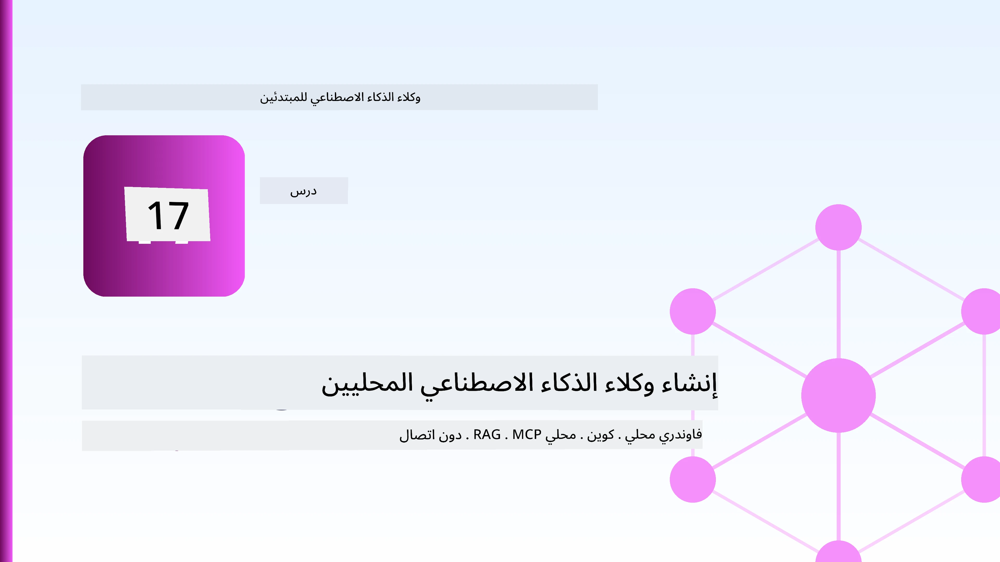
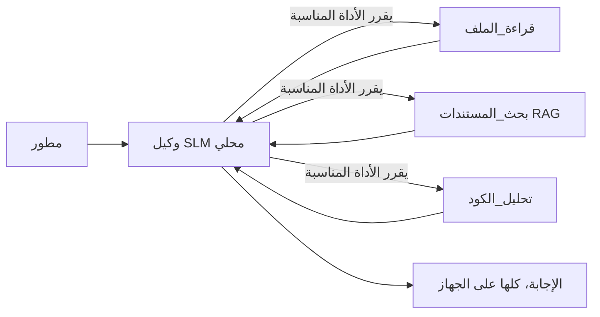
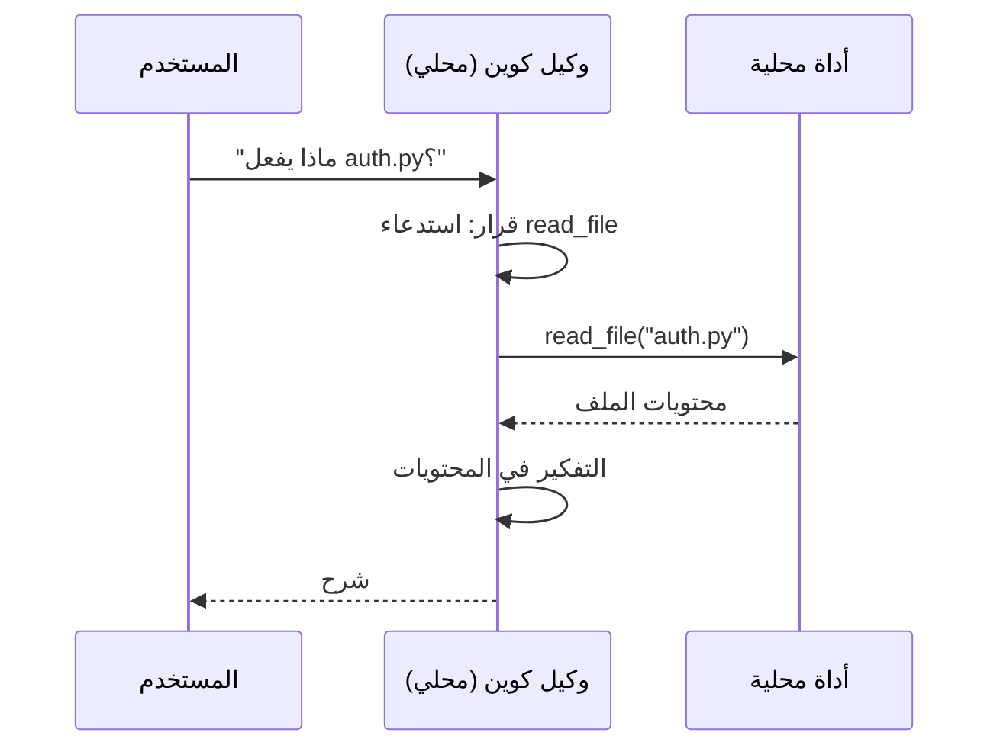
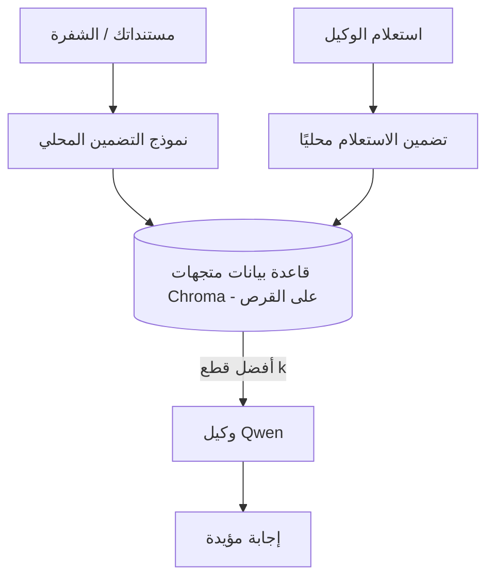
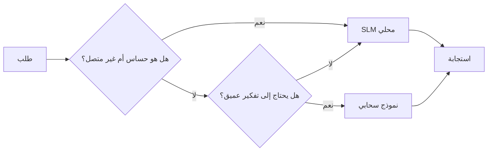

# إنشاء وكلاء ذكاء اصطناعي محليين باستخدام Microsoft Foundry Local و Qwen



الدرس السابق قام بتوسيع الوكلاء *للسحابة*. هذا الدرس يُنزلهم إلى *كمبيوتر واحد*. بنهاية هذا الدرس سيكون لديك مساعد هندسي يعمل يفكر، يستدعي الأدوات، يقرأ ملفاتك، ويبحث في توثيقاتك — **دون أي طلب استدلال للسحابة.**

لماذا تريد ذلك؟ هناك ثلاثة أسباب تتكرر باستمرار في العمل الهندسي الحقيقي:

- **الخصوصية.** الشيفرة والوثائق لا تخرج من الجهاز. لا يوجد أي طلب، أو مقطع، أو بيانات زبون تعبر حدود الشبكة.
- **التكلفة.** الاستدلال المحلي ليس له فاتورة حسب عدد الرموز. يمكنك التكرار طوال اليوم بسعر الكهرباء فقط.
- **العمل بدون اتصال.** على متن طائرة، في منشأة آمنة، أو أثناء انقطاع الخدمة، لا يزال الوكيل يعمل.

التحدي هو أنك تستبدل نموذج سحابي متقدم بـ **نموذج لغة صغير (SLM)** يعمل على معالجك المركزي، أو معالج الرسوميات، أو معالج الشبكة العصبية. هذا الدرس يركز على بناء وكلاء *جيدين* ضمن هذا القيد بدلاً من التظاهر بأن القيد غير موجود.

## مقدمة

هذا الدرس سيغطي:

- **نماذج اللغة الصغيرة (SLMs)** — ما هي، أين تتميز، وأين لا.
- **Microsoft Foundry Local** — بيئة تشغيل تقوم بتنزيل وخدمة النماذج على الجهاز عبر **واجهة برمجة تطبيقات متوافقة مع OpenAI**.
- **نماذج Qwen لاستدعاء الدوال** — نماذج SLM تنتج باستمرار استدعاءات أدوات موثوقة، وهذا ما يجعل الوكلاء المحليين (وليس فقط الدردشة المحلية) ممكنين.
- **أدوات محلية، RAG محلي، و MCP محلي** — يمنح الوكيل القدرة دون الحاجة للسحابة.
- **أنماط هجينة** — متى نحتفظ بالأمور محلية ومتى نستخدم السحابة.

## أهداف التعلم

بعد إكمال الدرس، ستعرف كيف:

- شرح التوازنات الخاصة بنماذج اللغة الصغيرة واختيار الحالات المناسبة لوكلاء محليين.
- تقديم نموذج Qwen محليًا باستخدام Foundry Local والاتصال به عبر نقطة نهاية متوافقة مع OpenAI.
- بناء وكيل يستدعي الأدوات يعمل بالكامل على محطة العمل الخاصة بك.
- إضافة RAG محلي فوق مستنداتك باستخدام قاعدة بيانات متجهات محلية (Chroma).
- ربط الوكيل بخادم MCP محلي والتفكير في تصميمات هجينة بين المحلي والسحابي.

## المتطلبات الأساسية

يفترض هذا الدرس أنك أتممت الدروس السابقة وتشعر بالراحة مع:

- [استخدام الأدوات](../04-tool-use/README.md) (الدرس 4) و [Agentic RAG](../05-agentic-rag/README.md) (الدرس 5).
- [بروتوكولات الوكيل / MCP](../11-agentic-protocols/README.md) (الدرس 11).
- [إطار عمل Microsoft Agent](../14-microsoft-agent-framework/README.md) (الدرس 14).

ستحتاج أيضًا إلى:

- محطة عمل للمطور. **8 جيجابايت رام الحد الأدنى الواقعي**؛ 16 جيجابايت أو أكثر مريحة. وجود وحدة معالجة رسومات أو وحدة معالجة عصبونية مفيد لكنه غير مطلوب.
- تثبيت **Microsoft Foundry Local** (راجع قسم الإعداد أدناه).
- بايثون 3.12+ والحزم في المستودع [`requirements.txt`](../../../requirements.txt)، بالإضافة إلى `foundry-local-sdk`، `openai`، و `chromadb` لهذا الدرس.

## نماذج اللغة الصغيرة: الأداة المناسبة للعمل المحلي

نموذج سحابي متقدم يحتوي على مئات المليارات من المعاملات ويتطلب مركز بيانات ضخم. النموذج الصغير (SLM) يحتوي على بضعة مليارات معاملات ويجب أن يتناسب مع رام الحاسوب المحمول لديك. هذا الفرق يحدد توقعات واضحة.

**نماذج SLM جيدة في:**

- المهام المنظمة والمحدودة — التصنيف، الاستخراج، التلخيص لوثيقة معروفة.
- **استدعاء الأدوات** — تحديد أي دالة تستدعي وبأي معطيات.
- تكرار سريع، رخيص، وخاص على بياناتك الخاصة.

**نماذج SLM أضعف في:**

- الاستدلال المفتوح الواسع متعدد القفزات عبر سياق كبير.
- المعرفة العامة الواسعة (فقد شاهدوا كمية أقل، وينسون أكثر).

الإستراتيجية الفائزة للوكلاء المحليين هي: **دع SLM ينسق، ودع الأدوات تقوم بالعمل الشاق.** النموذج لا يحتاج لأن *يعرف* قاعدة شيفرتك — يحتاج أن يعرف متى يستدعي `read_file` و`search_docs`. هذا يلعب مباشرة على نقاط قوة الـ SLM.



## Microsoft Foundry Local

**Microsoft Foundry Local** هو بيئة تشغيل خفيفة تقوم بتنزيل وإدارة وخدمة النماذج بالكامل على جهازك. أهم ميزته لنا أنه يفتح **نقطة نهاية HTTP متوافقة مع OpenAI** — مما يعني أن SDK الخاص بـ OpenAI وعميل OpenAI في إطار عمل Microsoft Agent يعملان ضده بتغيير بسيط في `base_url`. كل ما تعلمته حول بناء الوكلاء يُنقل مباشرة؛ فقط نقطة النهاية تنتقل من السحابة إلى `localhost`.

يقوم Foundry Local أيضًا باختيار أفضل نسخة نموذج مناسبة لهاردويرك تلقائيًا — نسخة لمعالج مركزي، أو نسخة CUDA/GPU، أو نسخة NPU — لتجنب تحسينات يدوية لكل جهاز.

### الإعداد

قم بتثبيت Foundry Local (راجع [التوثيق](https://learn.microsoft.com/azure/ai-foundry/foundry-local/) لنظام التشغيل الخاص بك)، ثم تحقق من عمله:

```bash
# التثبيت (مثال؛ اتبع المستندات الخاصة بمنصتك)
winget install Microsoft.FoundryLocal      # ويندوز
# brew install microsoft/foundrylocal/foundrylocal   # ماك أو إس

# قم بتنزيل وتشغيل نموذج Qwen، ثم ابدأ الخدمة المحلية
foundry model run qwen2.5-7b-instruct
foundry service status
```

بمجرد تشغيل الخدمة ستحصل على نقطة نهاية متوافقة مع OpenAI محليًا (عادة `http://localhost:PORT/v1`). يستخدم الكود `foundry-local-sdk` لاكتشاف نقطة النهاية تلقائياً، لذا لا تحتاج إلى ترميز المنفذ بشكل يدوي.

## استدعاء دوال Qwen: لماذا هو مهم

لا يكون الوكيل وكيلًا إلا إذا كان يستطيع استدعاء الأدوات. العديد من نماذج SLM يمكنها الدردشة لكن تنتج استدعاءات أدوات غير موثوقة أو مشوهة. نماذج **Qwen** مدرّبة لاستدعاء الدوال وتصدر بنى استدعاء أدوات صحيحة باستمرار — وهذا بالضبط ما يحول نموذج دردشة محلي إلى *وكيل* محلي.

التدفق هو حلقة استدعاء أدوات قياسية تعرفها، فقط تعمل على الجهاز:



## RAG محلي

البحث في التوثيق هو حيث يكسب الوكلاء المحليين مكانتهم. بدلاً من الاعتماد على حفظ SLM لتوثيق إطارات العمل، تقوم بتضمين هذه الوثائق في **قاعدة بيانات متجهية محلية** وتسمح للوكيل باسترجاع الأجزاء ذات الصلة عند الطلب.

نستخدم **Chroma**، مخزن متجهات مضمن يعمل ضمن العملية بدون إدارة خادم. العملية بالكامل محلية: نموذج التضمين المحلي → المتجهات المحلية → الاسترجاع المحلي → SLM محلي.



هذا هو نفس نمط Agentic RAG من الدرس 5 — التغيير الوحيد هو أن كل مكون يعمل على جهازك.

## خوادم MCP محلية

[MCP](../11-agentic-protocols/README.md) هو بروتوكول نقل، وليس خدمة سحابية. يمكن تشغيل خادم MCP كعملية محلية على `stdio`، ليكشف أدوات لوكيلك عبر البروتوكول القياسي. هذا يسمح لك بإعادة استخدام النظام البيئي المتزايد من خوادم MCP — وصول إلى نظام الملفات، عمليات git، استعلامات قواعد البيانات — بالكامل دون اتصال.

وضع الأمان يختلف عن السحابة، لكنه ليس غائبًا: خادم MCP محلي لا يزال يعمل بصلاحيات المستخدم الخاص بك، لذلك قيد ما يمكن أن يلمسه (مجلد مشروع، وليس مجلد المنزل بأكمله) وتعامل مع مخرجاته كمدخلات للتحقق منها.

## أنماط هجينة بين السحابة والمحلي

"محلي أولاً" لا يعني "محلي فقط". الأنظمة المتطورة توجه حسب الحساسية والصعوبة:

| الحالة | أين تعمل |
| --- | --- |
| شيفرة/بيانات حساسة، أو بدون اتصال | **SLM محلي** |
| مهمة بسيطة ومحدودة | **SLM محلي** (رخيص وسريع) |
| استدلال صعب متعدد القفزات على بيانات غير حساسة | **نموذج سحابي** |
| كل شيء، أثناء الانقطاع | **SLM محلي** (تدهور تدريجي مهذب) |

هذا يعكس فكرة **توجيه النموذج** من الدرس 16 — باستثناء أن أحد "النماذج" هو جهازك الخاص. تصميم قوي يعود إلى المحلي إذا كانت السحابة غير متاحة، فتتحلل جودة الوكيل بدلاً من أن يفشل تمامًا.



## المختبر العملي: مساعد هندسي محلي

افتح [`code_samples/17-local-agent-foundry-local.ipynb`](./code_samples/17-local-agent-foundry-local.ipynb) واتبعه خطوة بخطوة. ستبني **مساعد هندسي محلي** يعمل بالكامل على محطة العمل الخاصة بك ويستطيع:

1. **استدعاء الأدوات** — عبر استدعاء وظائف Qwen من خلال Foundry Local.
2. **تنفيذ عمليات ملفات محلية** — سرد وقراءة ملفات مجلد المشروع.
3. **تحليل الشيفرة** — الإبلاغ عن مقاييس أساسية لملف مصدر.
4. **البحث في التوثيق** — RAG محلي على مجلد التوثيقات باستخدام Chroma.
5. **استخدام MCP** — الاتصال بخادم MCP محلي (مع تخطي مهذب إذا لم يكن مكوّنًا).

لا يُستخدم أي استدلال سحابي في أي نقطة.

### شرح خطوة بخطوة

يتصل المساعد بـ Foundry Local عبر نقطة نهاية متوافقة مع OpenAI، لذا يبدو كود الوكيل مشابهًا جدًا لدروس السحابة — فقط يتغير العميل:

```python
from foundry_local import FoundryLocalManager
from openai import OpenAI

# يكتشف / ينزل نموذج Foundry Local ويعطينا نقطة نهاية محلية.
manager = FoundryLocalManager(\"qwen2.5-7b-instruct\")
client = OpenAI(base_url=manager.endpoint, api_key=manager.api_key)  # api_key هو عنصر نائب محلي
```

الأدوات هي دوال بايثون عادية مخصصة لمجلد مشروع:

```python
def read_file(path: str) -> str:
    \"\"\"Read a file, but only inside the sandboxed project directory.\"\"\"
    full = (PROJECT_ROOT / path).resolve()
    if PROJECT_ROOT not in full.parents and full != PROJECT_ROOT:
        return \"Access denied: path is outside the project directory.\"
    return full.read_text(encoding=\"utf-8\")
```

لاحظ التحقق من البيئة المعزولة — حتى محلياً، أداة تقرأ مسارات عشوائية تمثل خطراً. يحتفظ الدفتر بكل أداة مقيدة لجذر مشروع واحد.

## اختبار المعرفة

اختبر فهمك قبل الانتقال إلى التمرين.

**1. قدم سببين محددين لتشغيل وكيل محلي بدلاً من السحابة.**

<details>
<summary>الإجابة</summary>

أي اثنين من: **الخصوصية** (لا تخرج الشيفرة والبيانات من الجهاز)، **التكلفة** (لا توجد فاتورة استدلال لكل رمز)، و**العمل بدون اتصال** (يعمل بدون شبكة – على الطائرة، في منشأة آمنة، أو أثناء انقطاع). القيود التنظيمية/الامتثال التي تمنع إرسال البيانات خارج الجهاز هي سبب شائع للخصوصية.
</details>

**2. ما هو تقسيم العمل الموصى به بين SLM وأدواته في وكيل محلي، ولماذا؟**

<details>
<summary>الإجابة</summary>

دع SLM **ينسق** (يقرر أي أداة يستدعي وبأي معطيات) ودع **الأدوات تقوم بالعمل الشاق** (قراءة الملفات، استرجاع الوثائق، حساب النتائج). نماذج SLM قوية في القرارات المحدودة مثل اختيار الأدوات لكنها أضعف في المعرفة الواسعة والاستدلال المطول، لذا الاعتماد على الأدوات يلعب على نقاط قوتها.
</details>

**3. ما الذي يجعل من الممكن إعادة استخدام كود الوكيل السحابي مع Foundry Local؟**

<details>
<summary>الإجابة</summary>

يقوم Foundry Local بفتح **نقطة نهاية HTTP متوافقة مع OpenAI**. يعمل SDK الخاص بـ OpenAI وعميل OpenAI في إطار العمل ضدها بتغيير فقط الـ `base_url` (واستخدام مفتاح API وهمي محلي). كل شيء آخر في كود الوكيل يبقى كما هو.
</details>

**4. لماذا نستخدم تحديدًا نموذج استدعاء دوال Qwen وليس أي SLM؟**

<details>
<summary>الإجابة</summary>

لأن الوكيل يجب أن ينتج استدعاءات أدوات موثوقة وصحيحة الهيكل. العديد من نماذج SLM يمكنها الدردشة لكنها تصدر استدعاءات مشوهة أو غير متسقة. نماذج Qwen مدرّبة لاستدعاء الدوال وتنتج استدعاءات أدوات متسقة، وهو ما يحول نموذج الدردشة المحلي إلى وكيل محلي فعال.
</details>

**5. في مسار RAG المحلي، أي المكونات تعمل على الجهاز؟**

<details>
<summary>الإجابة</summary>

كلها: نموذج التضمين، قاعدة بيانات المتجهات (Chroma على القرص)، خطوة الاسترجاع، وSLM. الوثائق يتم تضمينها محليًا، تخزينها محليًا، استرجاعها محليًا، والتفكير بها بواسطة نموذج محلي — لا يلمس أي مكون السحابة.
</details>

**6. خادم MCP محلي يعمل على جهازك. هل هذا يجعله آمنًا تلقائيًا؟ ما الاحتياطات التي يجب اتخاذها؟**

<details>
<summary>الإجابة</summary>

لا. خادم MCP المحلي يعمل بصلاحيات المستخدم لديك، لذا يمكنه الوصول إلى أي شيء تستطيع الوصول إليه. حدده بما يحتاجه فقط (مثلاً، مجلد مشروع واحد وليس مجلد المنزل بأكمله) وتعامل مع مخرجاته كمدخلات للتحقق منها قبل التصرف بناءً عليها.
</details>

**7. صف قاعدة توجيه هجينة منطقية تتضمن نموذجًا محليًا.**

<details>
<summary>الإجابة</summary>

وجه الطلبات الحساسة أو بدون اتصال إلى SLM المحلي؛ وجه المهام البسيطة والمحدودة إلى SLM المحلي للسرعة والتكلفة؛ وجه الاستدلال الصعب متعدد القفزات على بيانات غير حساسة إلى نموذج سحابي؛ وعد إلى SLM المحلي إذا كانت السحابة غير متاحة حتى يتدهور الوكيل بطريقة مهذبة بدلاً من الفشل الكامل. هذه هي توجيه النموذج (الدرس 16) مع الجهاز المحلي كأحد النماذج.
</details>

**8. ما هو الحد الأدنى الواقعي للذاكرة العشوائية (RAM) لتشغيل الوكيل المحلي في هذا الدرس، وماذا تجلب لك المزيد من الذاكرة؟**

<details>
<summary>الإجابة</summary>

حوالي **8 جيجابايت** هو الحد الأدنى الواقعي؛ 16 جيجابايت أو أكثر مريحة. المزيد من الذاكرة يسمح لك بتشغيل نماذج أكبر وأكثر قدرة والحفاظ على المزيد من السياق في الذاكرة. وحدة معالجة الرسوميات أو وحدة المعالجة العصبية تسرع الاستدلال لكنها غير مطلوبة — يختار Foundry Local بناءً على المعالج المركزي إذا لم يكن هناك مسرع متاح.
</details>

## التمرين

قم بتوسيع المساعد الهندسي المحلي إلى **مراجع توثيق محلي** لمشروع صغير تختاره (يمكنك استخدام أحد مجلدات الدروس في هذا المستودع إذا أردت).

يجب أن يتضمن تسليمك:

1. **فهرسة مجلد توثيق/شيفرة حقيقي** في Chroma (خمسة ملفات على الأقل).
2. **إضافة أداة `find_todos`** تفحص المشروع عن تعليقات `TODO`/`FIXME` وتُرجعها مع اسم الملف ورقم السطر — مع الحفاظ على التحقق من البيئة المعزولة نفس `read_file`.

3. **اطرح على الوكيل ثلاثة أسئلة** تجبره على دمج الأدوات: سؤال RAG خالص، واحد يتطلب قراءة ملف محدد، وآخر يتطلب العثور على TODOs.
4. **قِس الأداء**: وقت كل من الإجابات الثلاث وسجّلها في خلية ماركداون. علّق على ما إذا كان الكمون مقبولًا لسيناريو عملك المقصود.

ثم اكتب فقرة قصيرة عن **ما الذي ستنقله إلى السحابة وما الذي ستحتفظ به محليًا** لهذا المراجع، ولماذا. يتم تقييمك بناءً على ما إذا كانت المكونات المحلية متصلة بشكل صحيح وما إذا كان استدلالك المختلط منطقيًا — وليس على جودة النموذج.

## الملخص

في هذا الدرس قمت ببناء وكيل يعمل بالكامل على جهازك الخاص:

- **نماذج اللغة الصغيرة (SLMs)** تتنازل عن الاتساع مقابل الخصوصية والتكلفة والعمل بدون اتصال — وتتألق عندما **تنظم الأدوات** بدلاً من حمل كل المعرفة بنفسها.
- **Foundry Local** يقدم النماذج محليًا خلف **نقطة نهاية متوافقة مع OpenAI**، لذا ينتقل رمز وكيل السحابة الخاص بك مع تغيير سطر واحد.
- **نماذج نداء الوظيفة من Qwen** تجعل من الممكن استدعاء أدوات محلية موثوقة — وبالتالي وكلاء محليين.
- **RAG المحلي** (Chroma) و **MCP المحلي** يمنحان الوكيل القدرة دون مغادرة الجهاز.
- **الأنماط المختلطة** تتيح لك التوجيه حسب الحساسية والصعوبة، مع اعتماد محلي كخيار احتياطي مرن.

يُكمل هذا قوس النشر: الدرس 16 وسّع الوكلاء داخل Microsoft Foundry، وهذا الدرس قلصهم إلى محطة عمل واحدة. الدرس التالي يتجه إلى الحفاظ على أمان الوكلاء المنشورين.

## موارد إضافية

- <a href="https://learn.microsoft.com/azure/ai-foundry/foundry-local/" target="_blank">توثيق Microsoft Foundry Local</a>
- <a href="https://learn.microsoft.com/azure/ai-foundry/what-is-azure-ai-foundry" target="_blank">توثيق Microsoft Foundry</a>
- <a href="https://aka.ms/ai-agents-beginners/agent-framework" target="_blank">إطار عمل وكيل Microsoft</a>
- <a href="https://qwen.readthedocs.io/en/latest/framework/function_call.html" target="_blank">توثيق نداء الوظيفة في Qwen</a>
- <a href="https://modelcontextprotocol.io/" target="_blank">بروتوكول سياق النموذج (MCP)</a>
- <a href="https://docs.trychroma.com/" target="_blank">قاعدة بيانات المتجهات Chroma</a>

## الدرس السابق

[نشر وكلاء قابلين للتوسع](../16-deploying-scalable-agents/README.md)

## الدرس التالي

[تأمين وكلاء الذكاء الاصطناعي](../18-securing-ai-agents/README.md)

---

<!-- CO-OP TRANSLATOR DISCLAIMER START -->
**تنويه**:
تمت ترجمة هذا المستند باستخدام خدمة الترجمة بالذكاء الاصطناعي [Co-op Translator](https://github.com/Azure/co-op-translator). بينما نسعى للدقة، يرجى العلم أن الترجمات الآلية قد تحتوي على أخطاء أو عدم دقة. يجب اعتبار المستند الأصلي بلغته الأصلية المصدر الرسمي والمعتمد. للمعلومات الهامة، يُنصح بالاستعانة بترجمة بشرية محترفة. نحن غير مسؤولين عن أي سوء فهم أو تفسير ناتج عن استخدام هذه الترجمة.
<!-- CO-OP TRANSLATOR DISCLAIMER END -->