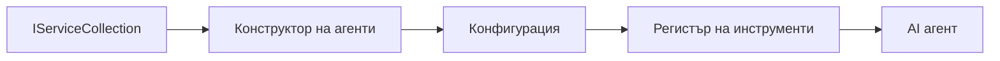

# 🎨 Агентски модели на дизайн с Azure OpenAI (Responses API) (.NET)

## 📋 Учебни цели

Този пример демонстрира корпоративни модели на дизайн за изграждане на интелигентни агенти чрез Microsoft Agent Framework в .NET с интеграция на Azure OpenAI (Responses API). Ще научите професионални модели и архитектурни подходи, които правят агентите готови за продукция, поддържани и мащабируеми.

### Корпоративни модели на дизайн

- 🏭 **Фабричен модел**: Стандартизирано създаване на агенти с инжектиране на зависимости
- 🔧 **Строителен модел**: Плавна конфигурация и настройка на агенти
- 🧵 **Потокобезопасни модели**: Управление на паралелни разговори
- 📋 **Модел на хранилището**: Организирано управление на инструменти и възможности

## 🎯 Ползи за архитектурата специфични за .NET

### Корпоративни функции

- **Строга типизация**: Валидация при компилиране и поддръжка на IntelliSense
- **Инжектиране на зависимости**: Интеграция на вграден DI контейнер
- **Управление на конфигурацията**: IConfiguration и модели за опции
- **Async/Await**: Пълна поддръжка на асинхронно програмиране

### Модели, готови за продукция

- **Интеграция на логване**: ILogger и структурирано логване
- **Проверки на здравето**: Вградено наблюдение и диагностика
- **Валидация на конфигурация**: Строга типизация с анотации за данни
- **Обработка на грешки**: Структурирано управление на изключения

## 🔧 Техническа архитектура

### Основни .NET компоненти

- **Microsoft.Extensions.AI**: Унифицирани абстракции за AI услуги
- **Microsoft.Agents.AI**: Корпоративна рамка за оркестрация на агенти
- **Azure OpenAI (Responses API)**: Високопроизводителни клиентски модели за API
- **Система за конфигурация**: appsettings.json и интеграция с околната среда

### Изпълнение на моделите на дизайн



## 🏗️ Демонстрирани корпоративни модели

### 1. **Създаващи модели**

- **Фабрика за агенти**: Централизирано създаване на агенти с последователна конфигурация
- **Строителен модел**: Плавен API за сложна конфигурация на агенти
- **Сингълтън модел**: Споделени ресурси и управление на конфигурация
- **Инжектиране на зависимости**: Слабо свързване и тестване

### 2. **Поведенчески модели**

- **Стратегически модел**: Заменяеми стратегии за изпълнение на инструменти
- **Команден модел**: Инкапсулирани операции на агенти с undo/redo
- **Наблюдателски модел**: Управление на жизнения цикъл на агента, базирано на събития
- **Шаблонен метод**: Стандартизирани работни потоци на изпълнение на агенти

### 3. **Структурни модели**

- **Адаптерен модел**: Слой за интеграция с Azure OpenAI (Responses API)
- **Декораторен модел**: Подобряване на възможностите на агента
- **Фасаден модел**: Оптимизирани интерфейси за взаимодействие с агенти
- **Прокси модел**: Лениво зареждане и кеширане за повишаване на производителността

## 📚 Принципи на дизайн в .NET

### SOLID принципи

- **Една отговорност**: Всеки компонент има една ясна цел
- **Отворен/Затворен**: Разширяем без модификация
- **Замяна на Лисков**: Имплементации на инструменти, базирани на интерфейси
- **Разделяне на интерфейса**: Фокусирани и свързани интерфейси
- **Инверсии на зависимостите**: Зависи от абстракции, не от конкретни реализации

### Чиста архитектура

- **Доменен слой**: Основни абстракции за агенти и инструменти
- **Приложенски слой**: Оркестрация и работни потоци на агенти
- **Инфраструктурен слой**: Интеграция с Azure OpenAI (Responses API) и външни услуги
- **Презентационен слой**: Взаимодействие с потребителя и форматиране на отговорите

## 🔒 Корпоративни съображения

### Сигурност

- **Управление на идентификационни данни**: Сигурно боравене с API ключове чрез IConfiguration
- **Валидация на входните данни**: Строга типизация и валидация с анотации за данни
- **Почистване на изходни данни**: Сигурна обработка и филтриране на отговорите
- **Логване за одит**: Всеобхватно проследяване на операции

### Производителност

- **Асинхронни модели**: Не блокиращи I/O операции
- **Управление на пул за връзки**: Ефективно управление на HTTP клиенти
- **Кеширане**: Кеширане на отговори за подобрена производителност
- **Управление на ресурси**: Коректно освобождаване и модели за почистване

### Мащабируемост

- **Потокобезопасност**: Поддръжка на паралелно изпълнение на агенти
- **Пул за ресурси**: Ефективно използване на ресурси
- **Управление на натоварването**: Ограничаване на скоростта и контрол на натоварването
- **Мониторинг**: Метрики за производителност и здравни проверки

## 🚀 Производствено внедряване

- **Управление на конфигурацията**: Настройки, специфични за околната среда
- **Стратегия за логване**: Структурирано логване с корелационни ID
- **Обработка на грешки**: Глобално управление на изключения с правилно възстановяване
- **Мониторинг**: Application insights и броячи за производителност
- **Тестване**: Модулни тестове, интеграционни тестове и модели за натоварващо тестване

Готови ли сте да изграждате корпоративни интелигентни агенти с .NET? Нека проектираме нещо стабилно! 🏢✨

## 🚀 Започване

### Предварителни условия

- [.NET 10 SDK](https://dotnet.microsoft.com/download/dotnet/10.0) или по-нова версия
- Абонамент в [Azure](https://azure.microsoft.com/free/) с Azure OpenAI ресурс и разгръщане на модел
- [Azure CLI](https://learn.microsoft.com/cli/azure/install-azure-cli) — влизане с `az login`

### Задължителни променливи на околната среда

```bash
# zsh/bash
export AZURE_OPENAI_ENDPOINT=https://<your-resource>.openai.azure.com
export AZURE_OPENAI_DEPLOYMENT=gpt-4.1-mini
# След това влезте, за да може AzureCliCredential да получи токен
az login
```

```powershell
# PowerShell
$env:AZURE_OPENAI_ENDPOINT = "https://<your-resource>.openai.azure.com"
$env:AZURE_OPENAI_DEPLOYMENT = "gpt-4.1-mini"
# След това влезте, за да може AzureCliCredential да получи токен
az login
```

### Примерен код

За стартиране на примерния код,

```bash
# zsh/bash
chmod +x ./03-dotnet-agent-framework.cs
./03-dotnet-agent-framework.cs
```

Или чрез dotnet CLI:

```bash
dotnet run ./03-dotnet-agent-framework.cs
```

Вижте [`03-dotnet-agent-framework.cs`](../../../../03-agentic-design-patterns/code_samples/03-dotnet-agent-framework.cs) за пълния код.

```csharp
#!/usr/bin/dotnet run

#:package Microsoft.Extensions.AI@10.*
#:package Microsoft.Agents.AI.OpenAI@1.*-*
#:package Azure.AI.OpenAI@2.1.0
#:package Azure.Identity@1.13.1

using System.ComponentModel;

using Microsoft.Agents.AI;
using Microsoft.Extensions.AI;

using Azure.AI.OpenAI;
using Azure.Identity;

// Tool Function: Random Destination Generator
// This static method will be available to the agent as a callable tool
// The [Description] attribute helps the AI understand when to use this function
// This demonstrates how to create custom tools for AI agents
[Description("Provides a random vacation destination.")]
static string GetRandomDestination()
{
    // List of popular vacation destinations around the world
    // The agent will randomly select from these options
    var destinations = new List<string>
    {
        "Paris, France",
        "Tokyo, Japan",
        "New York City, USA",
        "Sydney, Australia",
        "Rome, Italy",
        "Barcelona, Spain",
        "Cape Town, South Africa",
        "Rio de Janeiro, Brazil",
        "Bangkok, Thailand",
        "Vancouver, Canada"
    };

    // Generate random index and return selected destination
    // Uses System.Random for simple random selection
    var random = new Random();
    int index = random.Next(destinations.Count);
    return destinations[index];
}

// Azure OpenAI with the Responses API (stable v1 endpoint). Sign in with `az login`.
var azureEndpoint = Environment.GetEnvironmentVariable("AZURE_OPENAI_ENDPOINT")
    ?? throw new InvalidOperationException("AZURE_OPENAI_ENDPOINT is not set.");
var deployment = Environment.GetEnvironmentVariable("AZURE_OPENAI_DEPLOYMENT") ?? "gpt-4.1-mini";

var azureClient = new AzureOpenAIClient(new Uri(azureEndpoint), new AzureCliCredential());

// Define Agent Identity and Comprehensive Instructions
// Agent name for identification and logging purposes
var AGENT_NAME = "TravelAgent";

// Detailed instructions that define the agent's personality, capabilities, and behavior
// This system prompt shapes how the agent responds and interacts with users
var AGENT_INSTRUCTIONS = """
You are a helpful AI Agent that can help plan vacations for customers.

Important: When users specify a destination, always plan for that location. Only suggest random destinations when the user hasn't specified a preference.

When the conversation begins, introduce yourself with this message:
"Hello! I'm your TravelAgent assistant. I can help plan vacations and suggest interesting destinations for you. Here are some things you can ask me:
1. Plan a day trip to a specific location
2. Suggest a random vacation destination
3. Find destinations with specific features (beaches, mountains, historical sites, etc.)
4. Plan an alternative trip if you don't like my first suggestion

What kind of trip would you like me to help you plan today?"

Always prioritize user preferences. If they mention a specific destination like "Bali" or "Paris," focus your planning on that location rather than suggesting alternatives.
""";

// Create AI Agent with Advanced Travel Planning Capabilities
// Get the Responses client for the deployment and create the AI agent
// Configure agent with name, detailed instructions, and available tools
// This demonstrates the .NET agent creation pattern with full configuration
AIAgent agent = azureClient
    .GetChatClient(deployment)
    .AsAIAgent(
        name: AGENT_NAME,
        instructions: AGENT_INSTRUCTIONS,
        tools: [AIFunctionFactory.Create(GetRandomDestination)]
    );

// Create New Conversation Session for Context Management
// Initialize a new conversation session to maintain context across multiple interactions
// Sessions enable the agent to remember previous exchanges and maintain conversational state
// This is essential for multi-turn conversations and contextual understanding
var session = await agent.CreateSessionAsync();

// Execute Agent: First Travel Planning Request
// Run the agent with an initial request that will likely trigger the random destination tool
// The agent will analyze the request, use the GetRandomDestination tool, and create an itinerary
// Using the session parameter maintains conversation context for subsequent interactions
await foreach (var update in agent.RunStreamingAsync("Plan me a day trip", session))
{
    await Task.Delay(10);
    Console.Write(update);
}

Console.WriteLine();

// Execute Agent: Follow-up Request with Context Awareness
// Demonstrate contextual conversation by referencing the previous response
// The agent remembers the previous destination suggestion and will provide an alternative
// This showcases the power of conversation sessions and contextual understanding in .NET agents
await foreach (var update in agent.RunStreamingAsync("I don't like that destination. Plan me another vacation.", session))
{
    await Task.Delay(10);
    Console.Write(update);
}
```

---

<!-- CO-OP TRANSLATOR DISCLAIMER START -->
**Отказ от отговорност**:
Този документ е преведен с помощта на AI преводачески услуга [Co-op Translator](https://github.com/Azure/co-op-translator). Въпреки че се стремим към точност, моля имайте предвид, че автоматизираните преводи могат да съдържат грешки или неточности. Оригиналният документ на неговия роден език трябва да се счита за авторитетен източник. За критична информация се препоръчва професионален човешки превод. Ние не носим отговорност за каквито и да е недоразумения или неправилни тълкувания, произтичащи от използването на този превод.
<!-- CO-OP TRANSLATOR DISCLAIMER END -->