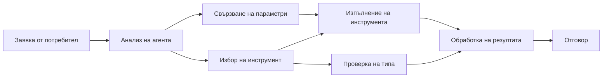

# 🛠️ Разширена употреба на инструменти с Azure OpenAI (Responses API) (.NET)

## 📋 Учебни цели

Тази тетрадка демонстрира модели за интеграция на инструменти на корпоративно ниво, използвайки Microsoft Agent Framework в .NET с Azure OpenAI (Responses API). Ще научите как да изграждате сложни агенти с множество специализирани инструменти, използвайки силната типизация на C# и корпоративните функции на .NET.

### Разширени възможности на инструментите, които ще усвоите

- 🔧 **Многоинструментална архитектура**: Изграждане на агенти с множество специализирани възможности
- 🎯 **Изпълнение на инструменти с типова безопасност**: Използване на проверка по време на компилация в C#
- 📊 **Корпоративни модели на инструменти**: Проектиране на инструменти готови за продукция и обработка на грешки
- 🔗 **Композиция на инструменти**: Комбиниране на инструменти за сложни бизнес процеси

## 🎯 Ползи от .NET архитектурата на инструментите

### Функции за корпоративни инструменти

- **Проверка по време на компилация**: Силната типизация гарантира коректност на параметрите на инструментите
- **Инжектиране на зависимости**: Интеграция с IoC контейнер за управление на инструментите
- **Async/Await модели**: Неблокиращо изпълнение на инструменти с правилно управление на ресурсите
- **Структурирано логване**: Вградена интеграция за логване и наблюдение на изпълнението на инструментите

### Модели готови за продукция

- **Обработка на изключения**: Комплексно управление на грешки с типизирани изключения
- **Управление на ресурси**: Правилни модели за освобождаване и управление на паметта
- **Мониторинг на производителността**: Вградени метрики и броячи за производителност
- **Управление на конфигурации**: Типобезопасна конфигурация с валидация

## 🔧 Техническа архитектура

### Основни .NET компоненти на инструмента

- **Microsoft.Extensions.AI**: Унифициран слой за абстракция на инструментите
- **Microsoft.Agents.AI**: Инструментална оркестрация на корпоративно ниво
- **Azure OpenAI (Responses API)**: Високопроизводителен API клиент с управление на връзки

### Канал за изпълнение на инструмента



## 🛠️ Категории и модели на инструменти

### 1. **Инструменти за обработка на данни**

- **Валидация на входни данни**: Силна типизация с анотации на данни
- **Операции за трансформация**: Типобезопасна конверсия и форматиране на данни
- **Бизнес логика**: Инструменти за специфични изчисления и анализи в домейна
- **Форматиране на изхода**: Генериране на структурирани отговори

### 2. **Интеграционни инструменти**

- **API конектори**: Интеграция на RESTful услуги с HttpClient
- **Инструменти за бази от данни**: Интеграция с Entity Framework за достъп до данни
- **Операции с файлове**: Сигурни файлови операции с валидация
- **Външни услуги**: Модели за интеграция на услуги от трети страни

### 3. **Утилити инструменти**

- **Обработка на текст**: Утилити за манипулация и форматиране на низове
- **Операции с дата/час**: Изчисления с оглед на културни особености
- **Математически инструменти**: Прецизни изчисления и статистически операции
- **Инструменти за валидация**: Проверка на бизнес правила и верификация на данни

Готови ли сте да изградите агенти на корпоративно ниво с мощни, типобезопасни възможности в .NET? Да създадем професионални решения! 🏢⚡

## 🚀 Започване

### Изисквания

- [.NET 10 SDK](https://dotnet.microsoft.com/download/dotnet/10.0) или по-нова версия
- [Абонамент за Azure](https://azure.microsoft.com/free/) с ресурс Azure OpenAI и разгръщане на модел
- [Azure CLI](https://learn.microsoft.com/cli/azure/install-azure-cli) — влезте с `az login`

### Задължителни променливи на средата

```bash
# zsh/bash
export AZURE_OPENAI_ENDPOINT=https://<your-resource>.openai.azure.com
export AZURE_OPENAI_DEPLOYMENT=gpt-4.1-mini
# Влезте, за да може AzureCliCredential да получи токен
az login
```

```powershell
# PowerShell
$env:AZURE_OPENAI_ENDPOINT = "https://<your-resource>.openai.azure.com"
$env:AZURE_OPENAI_DEPLOYMENT = "gpt-4.1-mini"
# След това влезте, за да може AzureCliCredential да получи токен
az login
```

### Примерен код

За да стартирате примера с код,

```bash
# zsh/bash
chmod +x ./04-dotnet-agent-framework.cs
./04-dotnet-agent-framework.cs
```

Или използвайте dotnet CLI:

```bash
dotnet run ./04-dotnet-agent-framework.cs
```

Вижте [`04-dotnet-agent-framework.cs`](../../../../04-tool-use/code_samples/04-dotnet-agent-framework.cs) за пълния код.

```csharp
#!/usr/bin/dotnet run

#:package Microsoft.Extensions.AI@10.*
#:package Microsoft.Agents.AI.OpenAI@1.*-*
#:package Azure.AI.OpenAI@2.1.0
#:package Azure.Identity@1.13.1

using System.ComponentModel;

using Microsoft.Agents.AI;
using Microsoft.Extensions.AI;

using Azure.AI.OpenAI;
using Azure.Identity;

// Tool Function: Random Destination Generator
// This static method will be available to the agent as a callable tool
// The [Description] attribute helps the AI understand when to use this function
// This demonstrates how to create custom tools for AI agents
[Description("Provides a random vacation destination.")]
static string GetRandomDestination()
{
    // List of popular vacation destinations around the world
    // The agent will randomly select from these options
    var destinations = new List<string>
    {
        "Paris, France",
        "Tokyo, Japan",
        "New York City, USA",
        "Sydney, Australia",
        "Rome, Italy",
        "Barcelona, Spain",
        "Cape Town, South Africa",
        "Rio de Janeiro, Brazil",
        "Bangkok, Thailand",
        "Vancouver, Canada"
    };

    // Generate random index and return selected destination
    // Uses System.Random for simple random selection
    var random = new Random();
    int index = random.Next(destinations.Count);
    return destinations[index];
}

// Azure OpenAI with the Responses API (stable v1 endpoint). Sign in with `az login`.
var azureEndpoint = Environment.GetEnvironmentVariable("AZURE_OPENAI_ENDPOINT")
    ?? throw new InvalidOperationException("AZURE_OPENAI_ENDPOINT is not set.");
var deployment = Environment.GetEnvironmentVariable("AZURE_OPENAI_DEPLOYMENT") ?? "gpt-4.1-mini";

var azureClient = new AzureOpenAIClient(new Uri(azureEndpoint), new AzureCliCredential());

// Define Agent Identity and Comprehensive Instructions
// Agent name for identification and logging purposes
var AGENT_NAME = "TravelAgent";

// Detailed instructions that define the agent's personality, capabilities, and behavior
// This system prompt shapes how the agent responds and interacts with users
var AGENT_INSTRUCTIONS = """
You are a helpful AI Agent that can help plan vacations for customers.

Important: When users specify a destination, always plan for that location. Only suggest random destinations when the user hasn't specified a preference.

When the conversation begins, introduce yourself with this message:
"Hello! I'm your TravelAgent assistant. I can help plan vacations and suggest interesting destinations for you. Here are some things you can ask me:
1. Plan a day trip to a specific location
2. Suggest a random vacation destination
3. Find destinations with specific features (beaches, mountains, historical sites, etc.)
4. Plan an alternative trip if you don't like my first suggestion

What kind of trip would you like me to help you plan today?"

Always prioritize user preferences. If they mention a specific destination like "Bali" or "Paris," focus your planning on that location rather than suggesting alternatives.
""";

// Create AI Agent with Advanced Travel Planning Capabilities
// Get the Responses client for the deployment and create the AI agent
// Configure agent with name, detailed instructions, and available tools
// This demonstrates the .NET agent creation pattern with full configuration
AIAgent agent = azureClient
    .GetChatClient(deployment)
    .AsAIAgent(
        name: AGENT_NAME,
        instructions: AGENT_INSTRUCTIONS,
        tools: [AIFunctionFactory.Create(GetRandomDestination)]
    );

// Create New Conversation Session for Context Management
// Initialize a new conversation session to maintain context across multiple interactions
// Sessions enable the agent to remember previous exchanges and maintain conversational state
// This is essential for multi-turn conversations and contextual understanding
await using var session = await agent.CreateSessionAsync();

// Execute Agent: First Travel Planning Request
// Run the agent with an initial request that will likely trigger the random destination tool
// The agent will analyze the request, use the GetRandomDestination tool, and create an itinerary
// Using the session parameter maintains conversation context for subsequent interactions
await foreach (var update in agent.RunStreamingAsync("Plan me a day trip", session))
{
    await Task.Delay(10);
    Console.Write(update);
}

Console.WriteLine();

// Execute Agent: Follow-up Request with Context Awareness
// Demonstrate contextual conversation by referencing the previous response
// The agent remembers the previous destination suggestion and will provide an alternative
// This showcases the power of conversation sessions and contextual understanding in .NET agents
await foreach (var update in agent.RunStreamingAsync("I don't like that destination. Plan me another vacation.", session))
{
    await Task.Delay(10);
    Console.Write(update);
}
```

---

<!-- CO-OP TRANSLATOR DISCLAIMER START -->
**Отказ от отговорност**:
Този документ е преведен с помощта на AI преводачески услуга [Co-op Translator](https://github.com/Azure/co-op-translator). Въпреки че се стремим към точност, моля имайте предвид, че автоматизираните преводи могат да съдържат грешки или неточности. Оригиналният документ на неговия роден език трябва да се счита за авторитетен източник. За критична информация се препоръчва професионален човешки превод. Ние не носим отговорност за каквито и да е недоразумения или неправилни тълкувания, произтичащи от използването на този превод.
<!-- CO-OP TRANSLATOR DISCLAIMER END -->