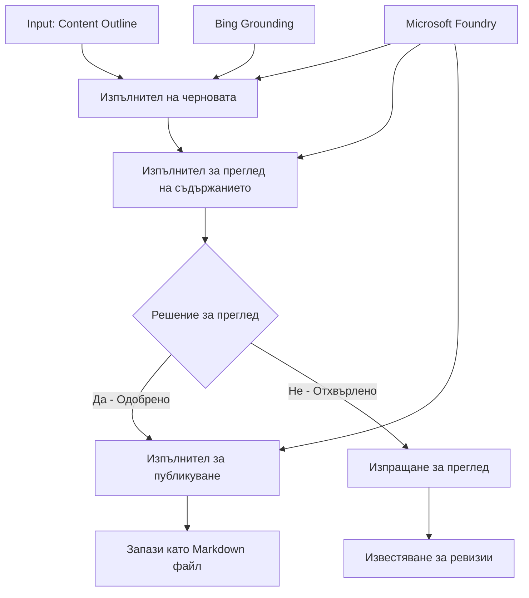

# 🔀 Условни агентски работни потоци с Microsoft Foundry (.NET)

## 📋 Урок за интелигентни работни потоци, базирани на решения

Този тетрадка демонстрира **условни модели на работни потоци** с помощта на Microsoft Foundry и Microsoft Agent Framework за .NET. Ще научите как да изградите сложни, решения-ориентирани работни потоци, които интелигентно насочват обработката въз основа на AI анализ, бизнес правила и динамични условия за автоматизация на корпоративно ниво.

## 🎯 Учебни цели

### 🧠 **Интелигентна архитектура на решенията**
- **Изпълнение на условна логика**: Изградете сложни дървета на решения с множество разклонения
- **Маршрутизиране с помощта на AI**: Използвайте модели на Microsoft Foundry за интелигентни решения за маршрутизиране
- **Динамична адаптация на работния поток**: Променяйте поведението на работния поток въз основа на анализ и условия по време на изпълнение
- **Интеграция на корпоративни правила**: Включване на бизнес логика и изисквания за съответствие в работните потоци

### 🔀 **Разширени условни модели**
- **Взимане на решения с множество критерии**: Оценка на множество фактори за решения за маршрутизиране
- **Обработка, осъзнаваща контекста**: Вземане на решения въз основа на акумулиран контекст и история на работния поток
- **Адаптивна модификация на работния поток**: Динамично регулиране на пътищата на обработка спрямо условия в реално време
- **Интеграция на двигател за правила**: Изпълнение на сложни бизнес двигатели за правила в работните потоци

### 🏢 **Корпоративни приложения с условна логика**
- **Класифициране и маршрутизиране на документи**: Автоматично класифициране и маршрутизиране на документи към подходящи работни потоци
- **Триаж на обслужване на клиенти**: Интелигентно маршрутизиране на клиентски запитвания към специализирани екипи за обслужване
- **Обработка за съответствие и риск**: Прилагане на различни процеси на валидиране и преглед въз основа на оценка на риска
- **Работни потоци за осигуряване на качество**: Маршрутизиране на съдържание през подходящи процеси на преглед въз основа на качествени показатели

## ⚙️ Предварителни изисквания и настройка

### 📦 **Необходими NuGet пакети**

Разширени пакети за обработка на условни работни потоци:

```xml
<!-- Core AI Framework -->
<PackageReference Include="Microsoft.Extensions.AI" Version="9.9.0" />

<!-- Azure AI Agents with Persistent State -->
<PackageReference Include="Azure.AI.Agents.Persistent" Version="1.2.0-beta.5" />

<!-- Azure Identity and Utilities -->
<PackageReference Include="Azure.Identity" Version="1.15.0" />
<PackageReference Include="System.Linq.Async" Version="6.0.3" />
<PackageReference Include="DotNetEnv" Version="3.1.1" />

<!-- Local Workflow Framework References -->
<!-- Microsoft.Agents.Workflows.dll - Advanced workflow orchestration -->
<!-- Microsoft.Agents.AI.AzureAI.dll - Microsoft Foundry integration -->
<!-- Microsoft.Agents.AI.dll - Core agent abstractions -->
```

### 🔑 **Конфигурация на Microsoft Foundry**

**Необходими Azure ресурси:**
- Работна среда Microsoft Foundry с модели за условна обработка
- Абонамент в Azure с подходящи изчислителни квоти и права
- Разположени AI модели за взимане на решения и анализ на съдържание
- (По избор) Връзка с Bing Search API за възможности за анализиране на реални данни

**Конфигурация на средата (.env файл):**
```env
# Microsoft Foundry Configuration
AZURE_AI_PROJECT_ENDPOINT=https://your-project.cognitiveservices.azure.com/
BING_CONNECTION_ID=your-bing-connection-id
```

**Настройка на удостоверяване:**
```csharp
// Azure CLI or Managed Identity authentication
using Azure.Identity;
var credential = new AzureCliCredential();

// Load environment configuration
DotNetEnv.Env.Load("../../../.env");
```

### 🏗️ **Архитектура на условен работен поток**



**Основни компоненти:**
- **Изпълнител на чернови**: AI агент, който създава първоначални чернови на съдържание от очертания
- **Изпълнител за преглед на съдържание**: AI агент, който оценява качеството и съответствието на черновите
- **Условно маршрутизиране**: Логика за взимане на решения, която маршрутизира въз основа на резултатите от прегледа
- **Пътища за публикуване/преглед**: Отделни пътища за обработка за одобрено спрямо отхвърлено съдържание
- **Управление на състоянието**: Поддържа контекст на съдържанието и прегледа през целия работен поток

## 🎨 **Дизайнерски модели за условни работни потоци**

### 📋 **Производство на съдържание с контрол на качеството**
```
Outline → Draft Creation → Quality Review → {Approve: Publish | Reject: Revise}
```

### 🎯 **Обработка на документи, базирана на риск**
```
Document → Risk Assessment → {Low: Standard | High: Enhanced Review}
```

### 🔍 **Интелигентно маршрутизиране на обслужване на клиенти**
```
Customer Query → Analysis → {Simple: FAQ Bot | Complex: Human Agent}
```

### 💼 **Работни потоци, управлявани от изисквания за съответствие**
```
Content → Compliance Check → {Pass: Publish | Fail: Legal Review}
```

## 🏢 **Корпоративни ползи от условните процеси**

### 🎯 **Интелигентна автоматизация**
- **Умни решения**: Резултати за маршрутизиране, базирани на AI, базирани на анализ на съдържание и контекст
- **Адаптивна обработка**: Работни потоци, които се настройват автоматично спрямо променящите се условия
- **Прилагане на бизнес правила**: Автоматично прилагане на сложна бизнес логика и политики
- **Маршрутизиране, осъзнаващо контекста**: Решения, базирани на пълната история на работния поток и акумулиран контекст

### 📈 **Оперативно съвършенство**
- **Оптимизирано разпределение на ресурси**: Насочване на работа към най-подходящите специалисти и процеси
- **Намалена човешка намеса**: Автоматизираните решения минимизират нуждата от човешко участиe в маршрутизирането
- **По-бързо разрешаване**: Директно маршрутизиране към подходяща експертиза и възможности за обработка
- **Еднородно прилагане**: Униформено прилагане на бизнес правила и критерии за решения

### 🛡️ **Управление на риска и съответствието**
- **Автоматична оценка на риска**: AI-базирана оценка на риска за съдържание и ситуация
- **Изпълнение на съответствие**: Автоматично маршрутизиране през изискваните регулаторни процеси
- **Прилагане на протоколи за сигурност**: Подобрените мерки за сигурност се прилагат въз основа на оценка на риска
- **Поддръжка на одит следи**: Пълна документация на решенията за маршрутизиране и мотивите им

### 📊 **Анализи и непрекъснато усъвършенстване**
- **Аналитика на решения**: Проследяване на ефективността и точността на решенията за маршрутизиране
- **Разпознаване на модели**: Идентифициране на тенденции и модели в решенията за маршрутизиране с времето
- **Оптимизация на представянето**: Непрекъснато усъвършенстване на критериите за решения и ефективността на маршрутизирането
- **Бизнес разузнаване**: Познания за характеристиките на съдържанието и изискванията за обработка

### 🔧 **Техническо съвършенство**
- **Постоянно управление на състоянието**: Поддържане на сложни състояния по време на изпълнението на работния поток
- **Мащабируема архитектура**: Обработка на изисквания за условна обработка с голям обем
- **Възможности за интеграция**: Безпроблемна интеграция с вече съществуващи бизнес системи и процеси
- **Мониторинг и наблюдение**: Комплексно проследяване на производителността и решенията на работния поток

Да изградим интелигентни, решения-ориентирани корпоративни работни потоци с .NET! 🚀

## 💻 Изпълнение на кода

Пълната имплементация е налична в `04.dotnet-agent-framework-workflow-aifoundry-condition.cs`. Тя демонстрира **работен поток за производство на съдържание с контрол на качеството**:

### 🏗️ **Архитектура на работния поток**

```
Content Outline → Draft Creation → Quality Review → Conditional Routing:
                                                      ├─ Approved (>200 words) → Publish
                                                      └─ Rejected (<200 words) → Review Notification
```

**Агенти в работния поток:**
1. **Агент Евангелист**: Създава чернови на уроки от очертания с Bing grounding
2. **Агент за преглед на съдържание**: Оценява качеството на черновата (брой думи, пълнота)
3. **Агент за публикуване**: Записва одобрено съдържание като маркирани файлове с времеви печат

**Персонализирани изпълнители:**
1. **DraftExecutor**: Организира създаването на черновата
2. **ContentReviewExecutor**: Извършва оценка на качеството
3. **PublishExecutor**: Отговаря за публикуване на одобрено съдържание
4. **SendReviewExecutor**: Управлява известия за отхвърлено съдържание

### 🚀 Изпълнение на примера

**Предварителни изисквания:**
- Конфигурирана работна среда Microsoft Foundry
- Аутентикация в Azure CLI (`az login`)
- (По избор) Връзка с Bing Search за grounding

```bash
# Направете скрипта изпълним (Unix/Linux/macOS)
chmod +x 04.dotnet-agent-framework-workflow-aifoundry-condition.cs

# Стартирайте условния работен процес
./04.dotnet-agent-framework-workflow-aifoundry-condition.cs
```

Или в Windows:
```powershell
dotnet run 04.dotnet-agent-framework-workflow-aifoundry-condition.cs
```

### 📝 Очакван изход

Работният поток ще:
1. **Създаде агенти**: Инициализира три специализирани агенти на Microsoft Foundry
2. **Генерира чернова**: Агент Евангелист създава урок чернова от очертание
3. **Преглед на съдържанието**: Прегледвачът оценява качеството на черновата
4. **Условно маршрутизиране**:
   - **Ако е одобрено (>200 думи)**: Изпълнителят за публикуване запазва като Markdown файл
   - **Ако е отхвърлено (<200 думи)**: Изпраща известие за преглед
5. **Показване на резултатите**: Показва крайния резултат от работния поток

### 🔧 Възможности за персонализация

**Промяна на критериите за преглед:**
```csharp
const string ContentReviewerInstructions = @"
You are a content reviewer...
1. Check if content is more than 500 words (instead of 200)
2. Verify technical accuracy
3. Ensure proper formatting
...";
```

**Добавяне на повече условни пътища:**
```csharp
var workflow = new WorkflowBuilder(draftExecutor)
    .AddEdge(draftExecutor, contentReviewerExecutor)
    .AddEdge(contentReviewerExecutor, publishExecutor, condition: GetCondition("Excellent"))
    .AddEdge(contentReviewerExecutor, editExecutor, condition: GetCondition("Good"))
    .AddEdge(contentReviewerExecutor, sendReviewerExecutor, condition: GetCondition("Poor"))
    .Build();
```

**Промяна на изискванията към съдържанието:**
```csharp
string OUTLINE_Content = @"
# Your Custom Topic
## Section 1
https://your-reference-url
## Section 2
...
";
```

### 🎯 Приложения в реалния свят

Този условен модел на работен поток е идеален за:
- **Системи за управление на съдържание**: Автоматизирани редакционни работни потоци с контрол на качеството
- **Обработка на документи**: Маршрутизиране на документи на базата на класификация и съответствие
- **Поддръжка на клиенти**: Интелигентно маршрутизиране на билети според сложност и спешност
- **Юридически преглед**: Маршрутизиране на договори според оценка на риска и стойността
- **HR процеси**: Маршрутизиране на кандидатури през подходящи работни потоци за подбор

### 🔍 Разбиране на условната логика

**Функция за условие:**
```csharp
public Func<object?, bool> GetCondition(string expectedResult) =>
    reviewResult => reviewResult is ReviewResult review && review.Result == expectedResult;
```

Тази функция създава предикат, който:
1. Проверява дали резултатът е от тип `ReviewResult`
2. Сравнява свойството `Result` с очакваната стойност
3. Връща true/false за определяне на маршрута

**Краища на работния поток с условия:**
```csharp
.AddEdge(contentReviewerExecutor, publishExecutor, condition: GetCondition("Yes"))
.AddEdge(contentReviewerExecutor, sendReviewerExecutor, condition: GetCondition("No"))
```

### 📊 Разширени функции

**Валидиране на JSON схема:**
Работният поток използва JSON схеми за осигуряване на структуриран отговор:

```csharp
// Define response structure
public class ReviewResult
{
    [JsonPropertyName("review_result")]
    public string Result { get; set; } = string.Empty;
    
    [JsonPropertyName("reason")]
    public string Reason { get; set; } = string.Empty;
    
    [JsonPropertyName("draft_content")]
    public string DraftContent { get; set; } = string.Empty;
}

// Apply to agent
ResponseFormat = ChatResponseFormat.ForJsonSchema(
    AIJsonUtilities.CreateJsonSchema(typeof(ReviewResult)), 
    "ReviewResult", 
    "Review Result From DraftContent"
)
```

**Интеграция с Bing Grounding:**
Агентът Евангелист използва Bing grounding за достъп до информация в реално време:

```csharp
var bingGroundingConfig = new BingGroundingSearchConfiguration(bing_conn_id);
BingGroundingToolDefinition bingGroundingTool = new(
    new BingGroundingSearchToolParameters([bingGroundingConfig])
);
```

Това позволява на агента да следва URL адреси в очертанието и да извлича текуща информация.

### 🛡️ Обработка на грешки

Работният поток включва надеждна обработка на грешки при отхвърлено съдържание:
- Провалите при преглед задействат алтернативен път
- Известията осигуряват ясни причини за отхвърляне
- Съдържанието се запазва за ревизия

### 🔄 Разширяване на работния поток

**Добавяне на цикъл за ревизия:**
Създайте цикъл за обратна връзка, който автоматично преработва съдържанието:

```csharp
.AddEdge(contentReviewerExecutor, publishExecutor, condition: GetCondition("Yes"))
.AddEdge(contentReviewerExecutor, draftExecutor, condition: GetCondition("No")) // Loop back
```

**Прилагане на многократно ниво на преглед:**
Добавете множество етапи на преглед с различни критерии:

```csharp
.AddEdge(draftExecutor, technicalReviewer)
.AddEdge(technicalReviewer, editorialReviewer, condition: GetCondition("TechPass"))
.AddEdge(editorialReviewer, publishExecutor, condition: GetCondition("EditPass"))
```

Този условен модел на работен поток осигурява основа за изграждане на сложни, интелигентни корпоративни автоматизационни системи! 🚀

---

<!-- CO-OP TRANSLATOR DISCLAIMER START -->
**Отказ от отговорност**:
Този документ е преведен с помощта на AI преводачески услуга [Co-op Translator](https://github.com/Azure/co-op-translator). Въпреки че се стремим към точност, моля имайте предвид, че автоматизираните преводи могат да съдържат грешки или неточности. Оригиналният документ на неговия роден език трябва да се счита за авторитетен източник. За критична информация се препоръчва професионален човешки превод. Ние не носим отговорност за каквито и да е недоразумения или неправилни тълкувания, произтичащи от използването на този превод.
<!-- CO-OP TRANSLATOR DISCLAIMER END -->