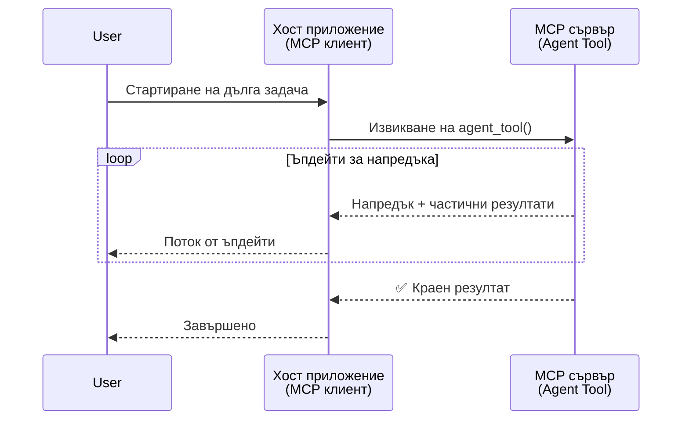
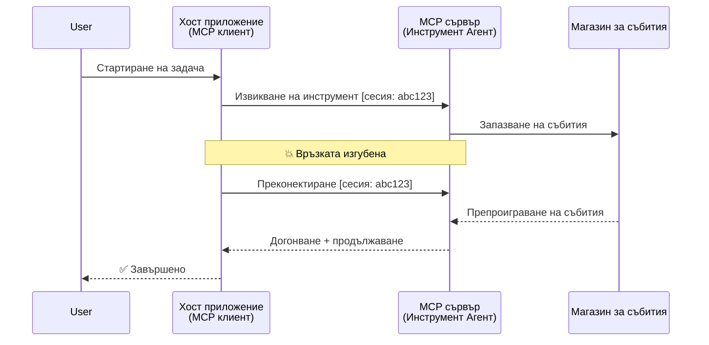
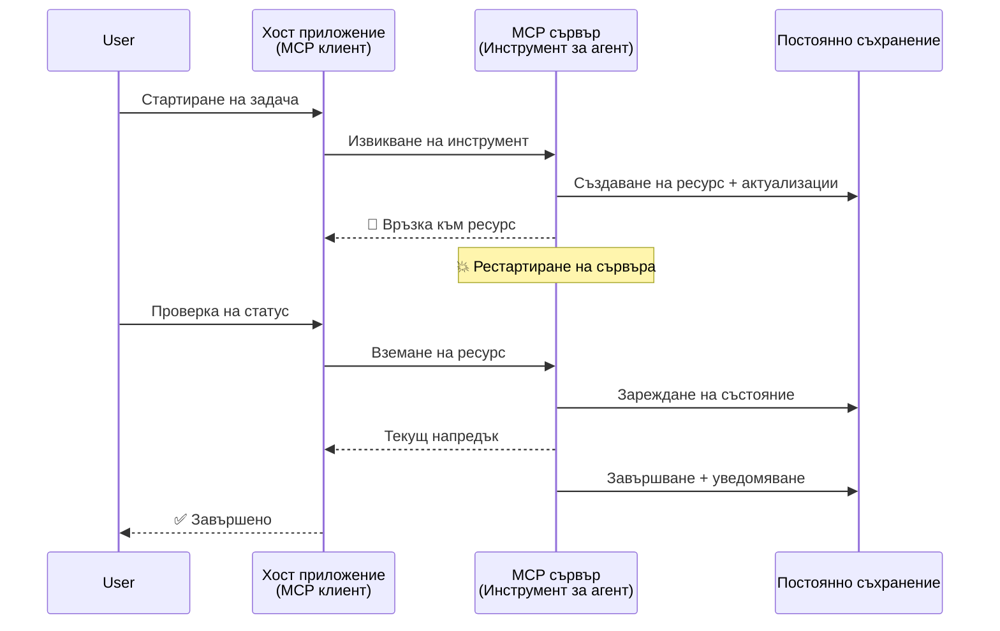
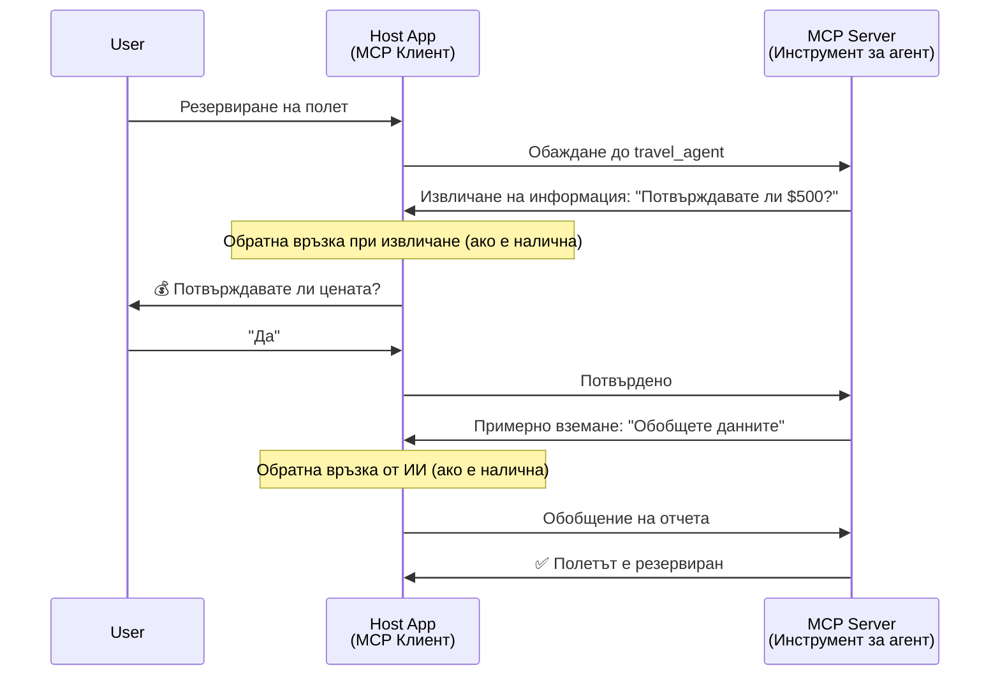

# Изграждане на комуникационни системи агенти към агенти с MCP

> Резюме - Можете ли да изградите комуникация агент2агент върху MCP? Да!

MCP се е развил значително отвъд първоначалната си цел за „предоставяне на контекст на LLM“. С последните подобрения, включително [потоци с възможност за възобновяване](https://modelcontextprotocol.io/docs/concepts/transports#resumability-and-redelivery), [извличане на информация](https://modelcontextprotocol.io/specification/2025-06-18/client/elicitation), [семплиране](https://modelcontextprotocol.io/specification/2025-06-18/client/sampling) и известия ([прогрес](https://modelcontextprotocol.io/specification/2025-06-18/basic/utilities/progress) и [ресурси](https://modelcontextprotocol.io/specification/2025-06-18/schema#resourceupdatednotification)), MCP сега предоставя стабилна основа за изграждане на сложни комуникационни системи агент към агент.

## Заблуда относно Агент/Инструмент

Докато все повече разработчици изследват инструменти с агентични поведения (работещи дълги периоди, които може да изискват допълнителен вход по време на изпълнение и др.), често срещана заблуда е, че MCP е неподходящ главно защото ранните примери за неговите прости инструменти са се фокусирали върху обикновени модели заявка-отговор.

Този възглед е остарял. Спецификацията на MCP е значително подобрена през последните няколко месеца с възможности, които запълват пропуските за изграждане на продължително работещо агентично поведение:

- **Поток и Частични резултати**: Обновления на прогреса в реално време по време на изпълнение
- **Възобновяемост**: Клиентите могат да се свързват отново и да продължат след прекъсване
- **Здравина**: Резултатите оцеляват през рестартирания на сървъра (например чрез връзки към ресурси)
- **Многообменност**: Интерактивен вход по време на изпълнение чрез извличане и семплиране

Тези функции могат да се комбинират, за да позволят сложни агентични и многоагентни приложения, всички базирани на протокола MCP.

За справка, ще наричаме агент „инструмент“, който е наличен на MCP сървър. Това предполага съществуването на хост приложение, което реализира MCP клиент, който установява сесия със MCP сървъра и може да извика агента.

## Какво прави MCP инструмент „агентичен“?

Преди да започнем с имплементацията, нека установим какви инфраструктурни възможности са необходими за поддържане на продължително работещи агенти.

> Ще дефинираме агент като същество, което може да оперира автономно през продължителни периоди, способно да изпълнява сложни задачи, изискващи множество взаимодействия или корекции базирани на обратна връзка в реално време.

### 1. Поток и Частични резултати

Традиционните модели заявка-отговор не работят за продължително изпълнявани задачи. Агентите трябва да предоставят:

- Обновления на прогреса в реално време
- Междинни резултати

**Поддръжка в MCP**: Известия за обновяване на ресурси позволяват поточно предаване на частични резултати, въпреки че това изисква внимателен дизайн, за да се избегнат конфликтите с 1:1 модела на заявка/отговор на JSON-RPC.

| Функция                  | Сценарий на използване                                                                                                                                                        | Поддръжка в MCP                                                                          |
| ------------------------ | ----------------------------------------------------------------------------------------------------------------------------------------------------------------------------- | ---------------------------------------------------------------------------------------- |
| Обновления на прогреса в реално време | Потребителят иска да изпълни задача за миграция на кодова база. Агентът предава прогреса: "10% - Анализ на зависимостите... 25% - Конвертиране на TypeScript файлове... 50% - Актуализиране на импорти..." | ✅ Известия за прогрес                                                                    |
| Частични резултати       | Задача „Създай книга“ предава частични резултати, например 1) Контура на сюжета, 2) Списък на главите, 3) Всяка глава след приключване. Хостът може да преглежда, отменя или препраща във всеки етап. | ✅ Известия могат да бъдат „разширени“, за да включват частични резултати, виж предложенията в PR 383, 776 |

<div align="center" style="font-style: italic; font-size: 0.95em; margin-bottom: 0.5em;">
<strong>Фигура 1:</strong> Тази диаграма илюстрира как MCP агентът предава в реално време обновления на прогреса и частични резултати към хост приложението по време на продължителна задача, позволявайки на потребителя да следи изпълнението в реално време.
</div>



### 2. Възобновяемост

Агентите трябва да могат да се справят гладко с мрежови прекъсвания:

- Повторно свързване след прекъсване от страна на клиента
- Продължаване от мястото, където са спрели (повторно изпращане на съобщения)

**Поддръжка в MCP**: Транспортът StreamableHTTP на MCP днес поддържа възобновяване на сесия и повторно изпращане на съобщения с идентификатори на сесии и последни идентификатори на събития. Важното е, че сървърът трябва да реализира EventStore, който позволява възпроизвеждане на събития при повторно свързване на клиента.
Обърнете внимание, че има предложение от общността (PR #975), което изследва транспортно-независими потоци с възможност за възобновяване.

| Функция     | Сценарий на използване                                                                                                                                    | Поддръжка в MCP                                                         |
| ---------- | --------------------------------------------------------------------------------------------------------------------------------------------------------- | --------------------------------------------------------------------- |
| Възобновяемост | Клиентът прекъсва по време на дълга задача. При повторно свързване, сесията се възобновява с възпроизвеждане на пропуснати събития, продължавайки безпроблемно от мястото на прекъсване. | ✅ Транспорт StreamableHTTP с идентификатори на сесии, възпроизвеждане на събития и EventStore |

<div align="center" style="font-style: italic; font-size: 0.95em; margin-bottom: 0.5em;">
<strong>Фигура 2:</strong> Тази диаграма показва как транспортът StreamableHTTP и съхранението на събития на MCP позволяват безпроблемно възобновяване на сесии: ако клиентът се прекъсне, той може да се свърже отново и да възпроизведе пропуснатите събития, продължавайки задачата без загуба на прогрес.
</div>



### 3. Здравина

Продължително работещите агенти имат нужда от постоянно състояние:

- Резултатите оцеляват през рестартирания на сървъра
- Статусът може да бъде получаван извън връзката
- Следене на прогреса през няколко сесии

**Поддръжка в MCP**: MCP вече поддържа тип връщане на връзка към ресурс за повиквания на инструменти. Днес, възможен модел е да се проектира инструмент, който създава ресурс и веднага връща връзка към ресурса. Инструментът може да продължи да изпълнява задачата във фонов режим и да обновява ресурса. Клиентът може да избере да следи състоянието на този ресурс, за да получи частични или пълни резултати (въз основа на известията за ресурс, които сървърът предоставя) или да се абонира за уведомления за обновления на ресурса.

Един лимит тук е, че следенето на ресурси или абонирането за обновления може да консумира ресурси, което има последствия в голям мащаб. Съществува отворено предложение от общността (включително #992), което изследва възможността за включване на webhooks или тригери, които сървърът може да извиква, за да уведоми клиента/хост приложението за обновления.

| Функция   | Сценарий на използване                                                                                                                           | Поддръжка в MCP                                                  |
| --------- | ----------------------------------------------------------------------------------------------------------------------------------------------- | ---------------------------------------------------------------- |
| Здравина | Сървърът се срива по време на задача за миграция на данни. Резултатите и прогресът оцеляват рестарта, клиентът може да провери статуса и да продължи от постоянния ресурс. | ✅ Връзки към ресурси с постоянно съхранение и известия за статус |

Днес често използван модел е да се проектира инструмент, който създава ресурс и веднага връща връзка към него. Инструментът във фонов режим се занимава със задачата, издава известия за ресурси, които служат като обновления на прогреса или включват частични резултати, и обновява съдържанието на ресурса при необходимост.

<div align="center" style="font-style: italic; font-size: 0.95em; margin-bottom: 0.5em;">
<strong>Фигура 3:</strong> Тази диаграма показва как MCP агентите използват постоянни ресурси и известия за статус, за да гарантират, че продължително изпълнявани задачи оцеляват през рестартирания на сървъра, позволявайки на клиентите да проверяват прогреса и да извличат резултати дори след грешки.
</div>



### 4. Многообменни Взаимодействия

Агентите често имат нужда от допълнителен вход по време на изпълнението:

- Човешко уточнение или одобрение
- AI помощ за сложни решения
- Динамично настройване на параметри

**Поддръжка в MCP**: Пълноценна чрез семплиране (за AI вход) и извличане (за човешки вход).

| Функция                 | Сценарий на използване                                                                                                                                   | Поддръжка в MCP                                           |
| ----------------------- | -------------------------------------------------------------------------------------------------------------------------------------------------------- | --------------------------------------------------------- |
| Многообменни взаимодействия | Агент за резервации на пътувания иска потвърждение на цена от потребителя, след това иска AI да обобщи данните за пътуването преди да завърши трансакцията. | ✅ Извличане за човешки вход, семплиране за AI вход        |

<div align="center" style="font-style: italic; font-size: 0.95em; margin-bottom: 0.5em;">
<strong>Фигура 4:</strong> Тази диаграма показва как MCP агентите могат интерактивно да изискват човешки вход или да поискат AI помощ по време на изпълнение, поддържайки сложни, многостъпкови работни процеси, като потвърждения и динамично вземане на решения.
</div>



## Имплементация на Продължително Работещи Агенти върху MCP - Общ преглед на кода

В рамките на тази статия предоставяме [хранилище с код](https://github.com/victordibia/ai-tutorials/tree/main/MCP%20Agents), което съдържа пълна имплементация на продължително работещи агенти, използващи MCP Python SDK с транспорт StreamableHTTP за възобновяване на сесии и повторно изпращане на съобщения. Имплементацията демонстрира как възможностите на MCP могат да се комбинират за постигане на сложни агентични поведения.

По-конкретно, имплементираме сървър с два основни агентични инструмента:

- **Агент за пътувания** - Симулира услуга за резервация на пътувания с потвърждение на цена чрез извличане
- **Агент за изследвания** - Извършва изследователски задачи с AI-помощни обобщения чрез семплиране

И двата агента демонстрират обновления на прогреса в реално време, интерактивни потвърждения и пълни възможности за възобновяване на сесии.

### Ключови концепции на имплементацията

Следващите раздели показват реализацията на агенти на сървърната страна и обработка от страна на клиента за всяка възможност:

#### Поток и обновления на прогрес - Статус на задачата в реално време

Потокът позволява на агентите да предоставят обновления на прогреса в реално време по време на продължително изпълнявани задачи, информирайки потребителите за статуса и междинните резултати.

**Имплементация на сървъра (агентът изпраща известия за прогрес):**

```python
# От server/server.py - Туристически агент, изпращащ актуализации за напредъка
for i, step in enumerate(steps):
    await ctx.session.send_progress_notification(
        progress_token=ctx.request_id,
        progress=i * 25,
        total=100,
        message=step,
        related_request_id=str(ctx.request_id)
    )
    await anyio.sleep(2)  # Симулиране на работа

# Алтернатива: Логване на съобщения за подробни стъпка по стъпка актуализации
await ctx.session.send_log_message(
    level="info",
    data=f"Processing step {current_step}/{steps} ({progress_percent}%)",
    logger="long_running_agent",
    related_request_id=ctx.request_id,
)
```

**Имплементация на клиента (хостът получава обновления на прогреса):**

```python
# От client/client.py - Клиент, който обработва известия в реално време
async def message_handler(message) -> None:
    if isinstance(message, types.ServerNotification):
        if isinstance(message.root, types.LoggingMessageNotification):
            console.print(f"📡 [dim]{message.root.params.data}[/dim]")
        elif isinstance(message.root, types.ProgressNotification):
            progress = message.root.params
            console.print(f"🔄 [yellow]{progress.message} ({progress.progress}/{progress.total})[/yellow]")

# Регистрирайте обработчик на съобщения при създаване на сесия
async with ClientSession(
    read_stream, write_stream,
    message_handler=message_handler
) as session:
```

#### Извличане - Искане на потребителски вход

Извличането позволява на агентите да изискват човешки вход по време на изпълнението. Това е от съществено значение за потвърждения, уточнения или одобрения при продължително работещи задачи.

**Имплементация на сървъра (агентът иска потвърждение):**

```python
# От server/server.py - Туристически агент, искащ потвърждение на цена
elicit_result = await ctx.session.elicit(
    message=f"Please confirm the estimated price of $1200 for your trip to {destination}",
    requestedSchema=PriceConfirmationSchema.model_json_schema(),
    related_request_id=ctx.request_id,
)

if elicit_result and elicit_result.action == "accept":
    # Продължете с резервацията
    logger.info(f"User confirmed price: {elicit_result.content}")
elif elicit_result and elicit_result.action == "decline":
    # Откажете резервацията
    booking_cancelled = True
```

**Имплементация на клиента (хостът предоставя callback за извличане):**

```python
# От client/client.py - Обработка на клиентските заявки за извличане
async def elicitation_callback(context, params):
    console.print(f"💬 Server is asking for confirmation:")
    console.print(f"   {params.message}")

    response = console.input("Do you accept? (y/n): ").strip().lower()

    if response in ['y', 'yes']:
        return types.ElicitResult(
            action="accept",
            content={"confirm": True, "notes": "Confirmed by user"}
        )
    else:
        return types.ElicitResult(
            action="decline",
            content={"confirm": False, "notes": "Declined by user"}
        )

# Регистрирайте обратното извикване при създаване на сесията
async with ClientSession(
    read_stream, write_stream,
    elicitation_callback=elicitation_callback
) as session:
```

#### Семплиране - Искане на AI помощ

Семплирането позволява на агентите да искат помощ от LLM за сложни решения или създаване на съдържание по време на изпълнение. Това позволява хибридни човеко-AI работни процеси.

**Имплементация на сървъра (агентът иска AI помощ):**

```python
# От server/server.py - Агент за изследване, заявяващ AI резюме
sampling_result = await ctx.session.create_message(
    messages=[
        SamplingMessage(
            role="user",
            content=TextContent(type="text", text=f"Please summarize the key findings for research on: {topic}")
        )
    ],
    max_tokens=100,
    related_request_id=ctx.request_id,
)

if sampling_result and sampling_result.content:
    if sampling_result.content.type == "text":
        sampling_summary = sampling_result.content.text
        logger.info(f"Received sampling summary: {sampling_summary}")
```

**Имплементация на клиента (хостът предоставя callback за семплиране):**

```python
# От client/client.py - Обработка на клиентски заявки за семплиране
async def sampling_callback(context, params):
    message_text = params.messages[0].content.text if params.messages else 'No message'
    console.print(f"🧠 Server requested sampling: {message_text}")

    # В реално приложение, това може да извиква LLM API
    # За демонстрационни цели предоставяме фиктивен отговор
    mock_response = "Based on current research, MCP has evolved significantly..."

    return types.CreateMessageResult(
        role="assistant",
        content=types.TextContent(type="text", text=mock_response),
        model="interactive-client",
        stopReason="endTurn"
    )

# Регистрирайте обратното извикване при създаване на сесия
async with ClientSession(
    read_stream, write_stream,
    sampling_callback=sampling_callback,
    elicitation_callback=elicitation_callback
) as session:
```

#### Възобновяемост - Продължителност на сесията през прекъсвания

Възобновяемостта гарантира, че продължително изпълнимите задачи на агенти могат да оцелеят прекъсвания на клиента и безпроблемно да продължат при повторно свързване. Това се реализира чрез съхранения на събития и токени за възобновяване.

**Имплементация на Event Store (сървър поддържа състоянието на сесията):**

```python
# От server/event_store.py - Прост съхранител на събития в паметта
class SimpleEventStore(EventStore):
    def __init__(self):
        self._events: list[tuple[StreamId, EventId, JSONRPCMessage]] = []
        self._event_id_counter = 0

    async def store_event(self, stream_id: StreamId, message: JSONRPCMessage) -> EventId:
        """Store an event and return its ID."""
        self._event_id_counter += 1
        event_id = str(self._event_id_counter)
        self._events.append((stream_id, event_id, message))
        return event_id

    async def replay_events_after(self, last_event_id: EventId, send_callback: EventCallback) -> StreamId | None:
        """Replay events after the specified ID for resumption."""
        # Намери събития след последното известно събитие и ги възпроизведи
        for _, event_id, message in self._events[start_index:]:
            await send_callback(EventMessage(message, event_id))

# От server/server.py - Даване на съхранител на събития към мениджъра на сесии
def create_server_app(event_store: Optional[EventStore] = None) -> Starlette:
    server = ResumableServer()

    # Създай мениджър на сесии с съхранител на събития за възобновяване
    session_manager = StreamableHTTPSessionManager(
        app=server,
        event_store=event_store,  # Съхранителят на събития позволява възобновяване на сесията
        json_response=False,
        security_settings=security_settings,
    )

    return Starlette(routes=[Mount("/mcp", app=session_manager.handle_request)])

# Използване: Инициализиране със съхранител на събития
event_store = SimpleEventStore()
app = create_server_app(event_store)
```

**Клиентски метаданни с токен за възобновяване (клиентът се свързва отново, използвайки запаметено състояние):**

```python
# От client/client.py - Възобновяване на клиента с метаданни
if existing_tokens and existing_tokens.get("resumption_token"):
    # Използвайте съществуващ токен за възобновяване, за да продължите оттам, където сме спрели
    metadata = ClientMessageMetadata(
        resumption_token=existing_tokens["resumption_token"],
    )
else:
    # Създайте обратно повикване за запазване на токена за възобновяване при получаване
    def enhanced_callback(token: str):
        protocol_version = getattr(session, 'protocol_version', None)
        token_manager.save_tokens(session_id, token, protocol_version, command, args)

    metadata = ClientMessageMetadata(
        on_resumption_token_update=enhanced_callback,
    )

# Изпратете заявка с метаданни за възобновяване
result = await session.send_request(
    types.ClientRequest(
        types.CallToolRequest(
            method="tools/call",
            params=types.CallToolRequestParams(name=command, arguments=args)
        )
    ),
    types.CallToolResult,
    metadata=metadata,
)
```

Хост приложението поддържа идентификатори на сесии и токени за възобновяване локално, позволявайки му да се свързва отново със съществуващи сесии без загуба на прогрес или състояние.

### Организация на кода

<div align="center" style="font-style: italic; font-size: 0.95em; margin-bottom: 0.5em;">
<strong>Фигура 5:</strong> Архитектура на система с агенти, базирана на MCP
</div>

```mermaid
graph LR
    User([Потребител]) -->|Задача| Host[Домакин<br/>(MCP клиент)]
    Host -->|изброява инструменти| Server[MCP сървър]
    Server -->|Излага| AgentsTools[Агенти като Инструменти]
    AgentsTools -->|Задача| AgentA[Туристически агент]
    AgentsTools -->|Задача| AgentB[Изследователски агент]

    Host -->|Наблюдава| StateUpdates[Напредък и актуализации на състоянието]
    Server -->|Публикува| StateUpdates

    class User user;
    class AgentA,AgentB agent;
    class Host,Server,StateUpdates core;
```

**Ключови файлове:**

- **`server/server.py`** - MCP сървър с възобновяваща се сесия с агенти за пътувания и изследвания, демонстриращи извличане, семплиране и обновления на прогрес
- **`client/client.py`** - Интерактивно хост приложение с поддръжка на възобновяване, обработка на callback-и и управление на токени
- **`server/event_store.py`** - Имплементация на съхранител за събития, позволяваща възобновяване на сесии и повторно изпращане на съобщения

## Разширяване към многоагентна комуникация на MCP

Имплементацията по-горе може да бъде разширена към многоагентни системи чрез подобряване на интелигентността и обхвата на хост приложението:

- **Интелигентно разчленяване на задачи**: Хостът анализира сложни потребителски заявки и ги разбива на подзадачи за различни специализирани агенти
- **Координация между няколко сървъра**: Хостът поддържа връзки с множество MCP сървъри, всеки предоставящ различни агентични възможности
- **Управление на състояние на задачи**: Хостът следи прогреса на множество конкурентни задачи на агенти, управлявайки зависимости и последователност
- **Устойчивост и повторни опити**: Хостът управлява неуспехи, изпълнява логика за повторни опити и препраща задачите при недостъпност на агенти
- **Синтез на резултати**: Хостът комбинира изхода на множество агенти в съгласувани крайни резултати

Хостът се развива от прост клиент до интелигентен оркестратор, координиращ разпределени агентични възможности, като запазва същата основа на протокола MCP.

## Заключение

Подобрените възможности на MCP - известия за ресурси, извличане/семплиране, възобновяеми потоци и постоянни ресурси - позволяват сложни взаимодействия агент към агент, като същевременно запазват простотата на протокола.

## Настройване и начало

Готови ли сте да изградите своя собствена система агент2агент? Следвайте тези стъпки:

### 1. Стартирайте демонстрацията

```bash
# Стартирайте сървъра с хранилище на събития за възобновяване
python -m server.server --port 8006

# В друг терминал стартирайте интерактивния клиент
python -m client.client --url http://127.0.0.1:8006/mcp
```

**Налични команди в интерактивен режим:**

- `travel_agent` - Резервиране на пътуване с потвърждение на цена чрез извличане
- `research_agent` - Изследване на теми с AI подпомогнати обобщения чрез семплиране
- `list` - Показване на всички налични инструменти
- `clean-tokens` - Изчистване на токените за възобновяване
- `help` - Показване на подробна помощ за командите
- `quit` - Изход от клиента

### 2. Тествайте възможностите за възобновяване

- Стартирайте продължително работещ агент (например `travel_agent`)
- Прекъснете клиента по време на изпълнение (Ctrl+C)
- Рестартирайте клиента - той автоматично ще възобнови от мястото, където е спрял

### 3. Изследвайте и разширявайте

- **Изследвайте примерите**: Разгледайте това [mcp-agents](https://github.com/victordibia/ai-tutorials/tree/main/MCP%20Agents)
- **Присъединете се към общността**: Участвайте в дискусии за MCP в GitHub
- **Експериментирайте**: Започнете със проста продължителна задача и постепенно добавяйте поток, възобновяемост и многоагентна координация

Това демонстрира как MCP позволява интелигентни агентски поведения, като същевременно запазва простотата на инструмента.

Като цяло спецификацията на протокола MCP се развива бързо; препоръчва се читателят да преглежда официалния уебсайт за документация за най-новите актуализации - https://modelcontextprotocol.io/introduction

---

<!-- CO-OP TRANSLATOR DISCLAIMER START -->
**Отказ от отговорност**:
Този документ е преведен с помощта на AI преводачески услуга [Co-op Translator](https://github.com/Azure/co-op-translator). Въпреки че се стремим към точност, моля имайте предвид, че автоматизираните преводи могат да съдържат грешки или неточности. Оригиналният документ на неговия роден език трябва да се счита за авторитетен източник. За критична информация се препоръчва професионален човешки превод. Ние не носим отговорност за каквито и да е недоразумения или неправилни тълкувания, произтичащи от използването на този превод.
<!-- CO-OP TRANSLATOR DISCLAIMER END -->