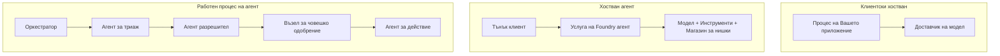
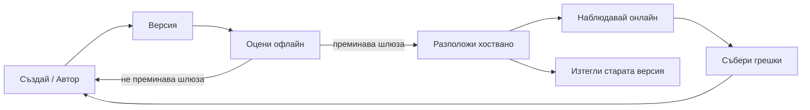
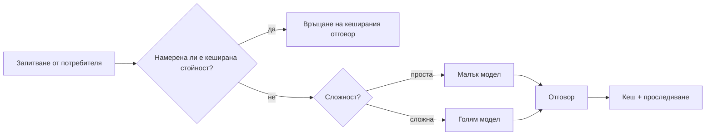
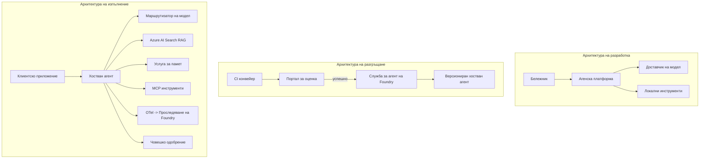

# Деплоймънт на мащабируеми агенти с Microsoft Foundry


До този момент в курса сте изграждали агенти, които работят на вашия лаптоп, в тетрадка, управлявани чрез `az login` и няколко променливи на средата. Това е точно правилният начин за учене. Но не е правилният начин за работа на агент, на когото хиляди клиенти разчитат в 3 часа през нощта.

Т този урок е за разликата между „работи на моята машина“ и „работи надеждно и на достъпна цена в продукция“. Ние затваряме тази разлика с помощта на **Microsoft Foundry** и **Microsoft Foundry Agent Service**, като изграждаме реален агент за клиентска поддръжка с инструменти, извличане, памет, оценка и мониторинг.

## Въведение

Този урок ще обхване:

- Разликата между **прототипен агент** и **деплойван агент**, и защо преходът е предимно за всичко *около* модела.
- **Патерни за деплоймънт** на агенти: хоствани от клиента, хоствани като услуга (Hosted Agents) и управлявани с работен поток.
- **Жизнен цикъл на агента** в Microsoft Foundry — създаване, версиониране, деплоймънт, оценка, наблюдение, пенсиониране.
- **Стратегии за мащабиране**: маршрутизиране на модели, кеширане, паралелизъм и дизайн без състояние.
- **Наблюдаемост** с OpenTelemetry и проследяване в Foundry.
- **Оптимизация на разходите** чрез избор на модел, маршрутизиране и оценъчни гейтове.
- **Корпоративни съображения**: управление, човешко одобрение и безопасно пускане на MCP сървъри в продукция.

## Цели на обучението

След завършване на този урок ще знаете как да:

- Изберете правилния патерн за деплоймънт за конкретна натовареност на агент.
- Деплойнете агент в Microsoft Foundry Agent Service така че да е версиониран, управляван и наблюдаем.
- Инструктирате агент за проследяване и изградите оценъчен пайплайн, който се изпълнява преди всеки релийз.
- Прилагате маршрутизиране на модели и кеширане, за да поддържате латентността и разходите под контрол при мащабиране.
- Добавите гейт за човешко одобрение при рискови действия и интегрирате MCP сървър безопасно в продукция.

## Предварителни изисквания

Този урок предполага, че сте преминали през по-ранните уроци и сте запознати със:

- Изграждане на агенти с [Microsoft Agent Framework](../14-microsoft-agent-framework/README.md) (Урок 14).
- [Използване на инструменти](../04-tool-use/README.md) (Урок 4) и [Agentic RAG](../05-agentic-rag/README.md) (Урок 5).
- [Памет на агента](../13-agent-memory/README.md) (Урок 13) и [Agentic Protocols / MCP](../11-agentic-protocols/README.md) (Урок 11).
- [Наблюдаемост и оценка](../10-ai-agents-production/README.md) (Урок 10) — този урок директно надгражда върху него.

Ще имате нужда и от:

- **Azure абонамент** и **Microsoft Foundry проект** с поне един деплойван чат модел.
- **Аутентикация в Azure CLI** (`az login`).
- Python 3.12+ и пакетите в хранилището [`requirements.txt`](../../../requirements.txt).

## От прототип към продукция: какво всъщност се променя

Прототипен агент и продукционен агент споделят същия основен цикъл — разсъждава, вика инструменти, отговаря. Променя се всичко, което е обвито около този цикъл. Моделът е може би 20% от продукционния агент; останалите 80% са оперативният скелет.

| Аспект | Прототип | Продукция |
| --- | --- | --- |
| **Хостинг** | Работи в тетрадката ви | Работи като хоствана услуга, версионирана и разпространявана |
| **Идентичност** | Вашият токен `az login` | Управлявана идентичност с обхватено RBAC |
| **Състояние** | В паметта, губи се при рестарт | Екстернализирано (съхранение на нишки, услуга за памет) |
| **Грешки** | Виждате стека с грешки | Повторни опити, резервни варианти, мъртви писма, аларми |
| **Цена** | „Няколко стотинки“ | Следи се на заявка, маршрутизира се, кешира се, бюджетират се разходи |
| **Качество** | Гледате изхода с очи | Автоматично се оценява преди всеки релийз |
| **Доверие** | Одобрявате всяко действие | Политика + човек в цикъла за рискови действия |

Запазете тази таблица в ума си. Всеки раздел по-долу съответства на един от тези редове.

## Патерни за деплоймънт на агенти

Има три патерна, които ще използвате често в комбинация.

### 1. Клиентски хоствани агенти

Агентът живее вътре в *вашия* процес на приложението. Вашият код вика директно доставчика на модел; цикълът на разсъждение работи във вашата услуга. Това е това, което правехме до момента във всеки урок.

- **Използвайте го, когато** имате нужда от пълен контрол над цикъла, потребителски middleware, или вграждане на агента в съществуващ бекенд.
- **Компромис**: вие сами отговаряте за мащабирането, състоянието и устойчивостта.

### 2. Хоствани агенти (Foundry Agent Service)

Агентът е *регистриран като ресурс* в Microsoft Foundry. Foundry хоства цикъла на разсъждение, съхранява нишки, налага сигурност на съдържание и RBAC, и прави агента видим в портала Foundry. Вашето приложение става тънък клиент, който създава нишки и чете отговори.

- **Използвайте го, когато** искате издръжливост, вградена наблюдаемост, управление и по-малка оперативна повърхност.
- **Компромис**: по-малко ниско ниво контрол в замяна на управлявана среда.

### 3. Работни потоци на агенти

Множество агенти (и инструменти) се композират в граф с изрично управление на потока — последователни стъпки, разклонения, възли с човешко одобрение и издръжливи контрольни точки, които могат да спират и продължават. Това е възможност на Microsoft Agent Framework **Workflows** приложена при мащабиране на деплоймънт.

- **Използвайте го, когато** една задача обхваща няколко специализирани агенти или изисква стъпка за одобрение.
- **Компромис**: повече движещи се части; изисква наблюдаемост на ниво оркестрация.



## Жизнен цикъл на агента в Microsoft Foundry

Деплоймънтът на агент не е еднократно „пушване“. Той е цикъл и изглежда много като софтуерен релийз цикъл, защото точно това е.



Основната идея, пренесена от [Урок 10](../10-ai-agents-production/README.md): **офлайн оценката е гейт, а не следваща мисъл.** Нова версия на агент не се пуска, освен ако не премине вашите оценъчни прагове. Онлайн наблюдаемостта след това връща реални грешки обратно към офлайн тестовете. Това е целият цикъл.

## Стратегии за мащабиране

Мащабирането на агент е различно от мащабирането на безсъстоянен уеб API, защото всяка заявка може да задейства множество скъпи повиквания към модели и инструменти. Четири техники понасят основната тежест.

**Обработка на безсъстояни заявки.** Не пазете състояние на потребител във вътрешната памет. Съхранявайте нишките от разговори във Foundry thread store или услуга за памет, така че всяка инстанция да може да обработва всяка заявка. Това позволява хоризонтално мащабиране — добавят се инстанции, без sticky сесии.

**Маршрутизиране на модели.** Не всяка заявка изисква най-мощния (и най-скъпия) ви модел. Маршрутизирайте прости заявки — класификация на намерения, кратки фактически отговори — към малък и бърз модел, а големия модел оставете за истински разсъждения. Foundry **Model Router** може да направи това вместо вас, или можете да имплементирате лек класификатор сами. В лабораторията ще изградите DIY версия.

**Кеширане на отговори.** Много запитвания за поддръжка са близнаци („как да рестартирам паролата си?“). Кеширайте отговори на често срещани въпроси и ги сервирайте без да засягате модела изобщо. Дори и умерен кеш хит намалява значително разходите и латентността.

**Паралелизъм и обратно налягане.** Доставчиците на модел имат лимити за заявките. Ограничете паралелизма, използвайте повторни опити с експоненциално забавяне и нека провалите са грациозни (чаканият отговор „работим по въпроса“ е по-добър от грешка 500).



## Наблюдаемост в продукция

Не можете да управлявате това, което не виждате. Както е описано в Урок 10, Microsoft Agent Framework излъчва **OpenTelemetry** трасета нативно — всяко повикване на модел, инструмент и стъпка от оркестрацията става span. В продукция ги експортирате към Microsoft Foundry (или какъвто и да е OTel-съвместим бекенд), за да можете:

- Да проследите един потребителски сигнал за поддръжка от край до край през всеки модел и инструмент.
- Да следите p50/p95 латентност и разход на заявка във времето.
- Да алармирате при скокове в грешки и аномалии в разходите преди потребителите (или финансовия ви екип) да ги забележат.

```python
from agent_framework.observability import get_tracer

tracer = get_tracer()

with tracer.start_as_current_span("support_request") as span:
    span.set_attribute("customer.tier", "enterprise")
    span.set_attribute("routed.model", "gpt-5-nano")
    # изпълнението на агента се проследява автоматично вътре в този интервал
```

Атрибути като `customer.tier` и `routed.model` преобразуват множество трасета във въпроси, на които може да се отговори („дали корпоративните клиенти твърде често се насочват към малкия модел?“).

## Оптимизация на разходите

Разходите в продукционните агенти са доминирани от токени. Три лоста, по степен на въздействие:

1. **Подходящ размер на модела.** Малък модел, който преминава вашия оценъчен гейт, почти винаги е по-евтин от голям, който също минава. Използвайте оценка, за да *докажете*, че малкият модел е достатъчен, вместо по умолчание да избирате най-големия от предпазливост.
2. **Маршрутизирайте по сложност.** Както горе — плащайте големи цени само за заявки, които изискват голям модел за разсъждение.
3. **Кеширайте агресивно.** Най-евтиното повикване на модел е това, което никога не правите.

Оценъчните гейтове и контролът на разходите са една и съща дисциплина, разгледана от две страни: оценката ви казва *дъното по качество*, маршрутизирането и кешът ви държат възможно най-близо до това дъно по *цена*.

## Предвидености за корпоративен деплоймънт

**Управление.** Hosted Agents наследяват RBAC, безопасност на съдържанието и одитния журнал на Foundry. Дайте на всеки агент управлявана идентичност с минималните привилегии — само четене на базата знания, обхватен достъп до API за тикети, нищо повече.

**Човек в цикъла.** Някои действия са твърде важни, за да се автоматизират напълно — издаване на възстановяване, изтриване на акаунт, ескалация към юридическия екип. Microsoft Agent Framework поддържа инструменти с **необходимо одобрение**: агентът предлага действието, изпълнението спира, човек одобрява или отказва, работният поток продължава. Виждали сте примитива в [Урок 6](../06-building-trustworthy-agents/README.md); тук го деплойвате.

**MCP в продукция.** [MCP](../11-agentic-protocols/README.md) позволява на вашия агент да използва външни инструменти чрез стандартен интерфейс. В продукция третирайте всеки MCP сървър като ненадеждна граница: фиксирайте версията на сървъра, пускайте го с обхватена идентичност, валидирайте изхода му и никога не му разкривайте тайни. MCP сървърът е зависимост, а зависимостите се създават пачове, одитират се и имат ограничение на честотата.



Тези три диаграми — разработка, деплоймънт, runtime — са един и същ агент на три етапа от живота си. Следващата лаборатория ви води през изграждането му.

## Практическа лаборатория: производство-готов агент за клиентска поддръжка

Отворете [`code_samples/16-python-agent-framework.ipynb`](./code_samples/16-python-agent-framework.ipynb) и го преминете напълно. Ще съставите **агент за клиентска поддръжка на Contoso** с всички производствени компоненти:

1. **Извикване на инструменти** — проверка на статус на поръчка и отваряне на тикети за поддръжка.
2. **RAG** — отговаряне на въпроси за политика от база знания (Azure AI Search, с резервна in-memory функция, така че тетрадката работи без Search ресурс).
3. **Памет** — помни клиента през изреченията на разговора.
4. **Маршрутизиране на модели** — класификатор по сложност насочва всяка заявка към малък или голям модел.
5. **Кеширане на отговори** — повтарящи се въпроси се обслужват от кеш.
6. **Човешко одобрение** — възстановявания над прагове спират за подписване от човек.
7. **Оценъчен пайплайн** — малък офлайн тестов сет оценява агента и служи като гейт за релийз.
8. **Наблюдаемост** — OpenTelemetry проследяване около всяка заявка.

### Преглед

Тетрадката е организирана така, че всяка производствена грижа е самостоятелен, изпълним раздел. Сърцето е хендлърът за заявки с маршрутизиране и кеширане:

```python
async def handle_support_request(query: str, customer_id: str) -> str:
    # 1. Обслужвайте от кеша, когато е възможно.
    cached = response_cache.get(normalize(query))
    if cached:
        return cached

    # 2. Насочвайте според сложността, за да контролирате разходите.
    model = "gpt-5-nano" if is_simple(query) else "gpt-5-mini"

    # 3. Стартирайте агента в рамките на трасировъчен спан за наблюдаемост.
    with tracer.start_as_current_span("support_request") as span:
        span.set_attribute("routed.model", model)
        span.set_attribute("customer.id", customer_id)
        response = await support_agent.run(query, model=model)

    # 4. Кеширайте и връщайте.
    response_cache.set(normalize(query), response.text)
    return response.text
```

Оценъчният гейт за релийз изглежда така:

```python
async def evaluation_gate(agent, test_cases, threshold: float = 0.8) -> bool:
    passed = 0
    for case in test_cases:
        result = await agent.run(case["input"])
        if score_response(result.text, case["expected"]) >= 0.8:
            passed += 1
    pass_rate = passed / len(test_cases)
    print(f"Evaluation pass rate: {pass_rate:.0%} (gate: {threshold:.0%})")
    return pass_rate >= threshold  # внедряване само ако порталът премине проверки
```

Прочетете всеки ред — тетрадката държи примитивите умишлено малки, за да не е скрито нищо зад фреймворк повикване.

## Валидация на деплойван агент със smoke тестове

Оценъчният гейт по-горе се изпълнява *офлайн* срещу вашия агент обект. След като агентът е деплойнат като Hosted Agent, трябва още една, дори по-евтина проверка: **дали деплойнатият endpoint всъщност отговаря?**

Успешното деплойване доказва само, че контролният план е приел дефиницията — не доказва, че агентът отговаря. Липсваща зависимост, неправилно маршрутизиране на модел или изтекла връзка може да остави зелено деплойване, което не връща нищо. **Smoke тест** хваща това за секунди, при всяко деплойване, без разходите на пълна оценка.

Това хранилище предлага готов за използване smoke-тест пайплайн, изградена върху GitHub Action [AI Smoke Test](https://github.com/marketplace/actions/ai-smoke-test):

- **Каталог** — [`tests/lesson-16-smoke-tests.json`](../../../tests/lesson-16-smoke-tests.json) съдържа подсказки и твърдения за агента за поддръжка на Contoso (политически базирани отговори, проверка на поръчка, оставане по темата и многоходова съгласуваност на нишка). Каталози за агенти от други уроци са заедно с него — вижте [`tests/README.md`](../tests/README.md).
- **Работен поток** — [`.github/workflows/smoke-test.yml`](../../../.github/workflows/smoke-test.yml) влиза в Azure OIDC и POST-ва всяка подсказка към endpoint-а Responses на агента, неуспех при всяко провалено твърдение.

```yaml
- name: Smoke-test hosted agent
  uses: JFolberth/ai-smoketest@v1
  with:
    project_endpoint: ${{ inputs.project_endpoint }}
    agent_name: ContosoSupportAgent
    tests_file: tests/lesson-16-smoke-tests.json
```


Стартирайте го от раздела **Actions**, след като вашият агент бъде разположен, като предоставите крайна точка на вашия Foundry проект и име на агента. Федеративната идентичност трябва да има ролята **Azure AI User** с обхват Foundry проект. Помислете за слоевете като за пирамида: тестовете за задимяване (достъпен ли е и отговаря ли?) се изпълняват при всяко разполагане, офлайн оценката (достатъчно ли е добър, за да се пусне?) се прави преди промоция, а онлайн оценката (как се представя в реална среда?) се извършва непрекъснато.

## Проверка на знанията

Тествайте разбирането си преди да преминете към задачата.

**1. Приблизително колко от един продукционен агент представлява „моделът“ и какво е останалото?**

<details>
<summary>Отговор</summary>

Моделът е малцинство от системата — често се цитира около 20%. Останалото е оперативният скелет: хостинг и версиониране, идентичност и RBAC, външно състояние, обработка на грешки, проследяване на разходите, оценка и контрол с участието на човек. Преминаването в продукция е предимно изграждане на всичко *около* цикъла на разсъждение.
</details>

**2. Кога бихте избрали Hosted Agent пред агент, хостван на клиент?**

<details>
<summary>Отговор</summary>

Когато искате управляема среда на изпълнение с вградена издръжливост (нишки, които продължават да съществуват и могат да се възобновят), наблюдаемост, безопасност на съдържанието и RBAC, и сте готови да пожертвате част от ниско ниво контрол над цикъла на разсъждение срещу по-малка оперативна сложност. Клиентският хостинг е предпочитан, когато ви е необходим пълен контрол върху цикъла или когато вграждате агента в съществуващ бекенд.
</details>

**3. Защо мащабируем агент трябва да бъде безсъстояние в паметта на своя процес?**

<details>
<summary>Отговор</summary>

За да може всеки екземпляр да обработва всяка заявка, което позволява хоризонтално мащабиране без фиксирани сесии. Състоянието на разговор с потребител се извежда извън процеса към хранилище за нишки или услуга за памет. Ако състоянието живееше в паметта на процеса, щяхте да го губите при рестарт и не бихте могли свободно да разпределяте натоварването.
</details>

**4. Какъв проблем решава маршрутизирането на модела и как е свързано с оценката?**

<details>
<summary>Отговор</summary>

Маршрутизирането изпраща прости заявки към малък, евтин и бърз модел и резервира големия модел за реално разсъждение, контролирайки както латентността, така и разходите. Това е свързано с оценката, защото именно оценката *доказва*, че малкият модел е достатъчно добър за даден клас заявки — маршрутизирането без оценка е предположение.
</details>

**5. Какво представлява „стража за оценка“ и къде в жизнения цикъл е разположен?**

<details>
<summary>Отговор</summary>

Стражът за оценка изпълнява офлайн тестов набор срещу нова версия на агента и блокира разгръщането, освен ако процентът на преминаване не достигне прага. Той е разположен между „версия“ и „разгръщане“ в жизнения цикъл, правейки качеството предпоставка за издаване, а не нещо, което се проверява след пускане.
</details>

**6. Защо MCP сървърът трябва да се третира като небезопасна граница в продукция?**

<details>
<summary>Отговор</summary>

Защото това е външна зависимост, към която вашият агент прави повиквания. Трябва да фиксирате неговата версия, да го изпълнявате с ограничена идентичност, да валидирате изходите му, да го ограничавате по честота и никога да не му излагате тайни — същата дисциплина, която прилагате към всяка трета страна. Изходите му влизат в разсъждението на вашия агент, затова неизвалидираното доверие крие риск за сигурността.
</details>

**7. Коя една промяна обикновено има най-голямо въздействие върху разходите за продукционен агент и защо?**

<details>
<summary>Отговор</summary>

Правилният избор на модела — използване на най-малкия модел, който все още преминава вашия страж за оценка. Разходите са доминирани от токените, а по-малкият модел, който отговаря на критерия за качество, почти винаги е по-евтин от по-голям. Кеширането и маршрутизирането след това намаляват разходите допълнително, но изборът на правилния базов модел има най-голям ефект от първи ред.
</details>

**8. Каква роля играят атрибутите на спанове като `customer.tier` и `routed.model` в наблюдаемостта?**

<details>
<summary>Отговор</summary>

Те превръщат суровите трасета в отговорими бизнес въпроси. Без атрибути имате стена от спанове; с тях можете да попитате „дали корпоративните клиенти биват прекомерно маршрутизирани към малкия модел?“ или „кой модел обработва най-бавните ни заявки?“ Атрибутите са как разрязвате телеметрията по измерения, които са важни за вашата операция.
</details>

## Задача

Вземете агента за клиентска поддръжка от лабораторията и го заздравете за конкретен сценарий: **агент за поддръжка на абонаментно фактуриране за SaaS компания.**

Вашето подаване трябва да:

1. **Замени инструментите** с такива, релевантни за фактуриране: `get_subscription_status`, `get_invoice` и `issue_credit` (кредити над $50 изискват одобрение от човек).
2. **Добави три RAG документа**, обхващащи политиката за възстановяване на компанията, цикъла на фактуриране и политиката за анулиране.
3. **Разшири набора за оценка** до поне осем случая, включително поне два, които *трябва* да задействат пътя за одобрение от човек, и потвърди, че стражът за оценка правилно преминава или отказва.
4. **Добави един отчет за разходите**: след изпълнение на десет смесени заявки през агента, отпечатай колко от тях отидоха към малкия модел, колко към големия модел и колко бяха обслужени от кеша.

Напиши кратък параграф (в markdown клетка), обясняващ кой модел-маршрутизиран правил сте избрали и как бихте го валидирали с истински трафик. Няма единствено правилен отговор — оценяват се дали продукционните съображения са свързани по последователен начин.

## Обобщение

В този урок преместихте агент от прототип към продукция с Microsoft Foundry:

- Преминаването към продукция е предимно заради **оперативния скелет** около модела — хостинг, идентичност, състояние, обработка на грешки, разходи, качество и доверие.
- Научихте трите **шаблона за разполагане** — клиентски хостинг, Hosted Agents и Agent Workflows — и кога всеки е подходящ.
- Прегледахте **жизнения цикъл на агента**, където офлайн **оценката действа като страж при издаване**, а онлайн наблюдаемостта връща грешките обратно в тестовия набор.
- Използвахте **стратегии за мащабиране** — безсъстояни дизайн, маршрутизиране на модели, кеширане и ограничена конкурентност — и ги свързахте с **оптимизация на разходите**.
- Внедрихте **корпоративни контролни механизми**: RBAC, одобрение с участието на човек и безопасна интеграция на MCP в продукция.
- Изградихте **агент за клиентска поддръжка, готов за продукция**, който свързва всички тези аспекти в изпълним код.

Следващият урок поема в обратната посока: вместо да мащабирате агенти към облака, ще ги изнесете *надолу* на една разработваща машина и ще ги изпълнявате изцяло локално.

## Допълнителни ресурси

- <a href="https://learn.microsoft.com/azure/ai-foundry/what-is-azure-ai-foundry" target="_blank">Документация на Microsoft Foundry</a>
- <a href="https://learn.microsoft.com/azure/ai-foundry/agents/overview" target="_blank">Обзор на Microsoft Foundry Agent Service</a>
- <a href="https://aka.ms/ai-agents-beginners/agent-framework" target="_blank">Microsoft Agent Framework</a>
- <a href="https://learn.microsoft.com/azure/ai-foundry/concepts/model-router" target="_blank">Model Router в Microsoft Foundry</a>
- <a href="https://learn.microsoft.com/azure/search/search-what-is-azure-search" target="_blank">Azure AI Search</a>
- <a href="https://opentelemetry.io/" target="_blank">OpenTelemetry</a>
- <a href="https://github.com/marketplace/actions/ai-smoke-test" target="_blank">AI Smoke Test GitHub Action</a>
- <a href="https://modelcontextprotocol.io/" target="_blank">Model Context Protocol (MCP)</a>

## Предишен урок

[Създаване на агенти за употреба на компютър (CUA)](../15-browser-use/README.md)

## Следващ урок

[Създаване на локални AI агенти](../17-creating-local-ai-agents/README.md)

---

<!-- CO-OP TRANSLATOR DISCLAIMER START -->
**Отказ от отговорност**:
Този документ е преведен с помощта на AI преводачески услуга [Co-op Translator](https://github.com/Azure/co-op-translator). Въпреки че се стремим към точност, моля имайте предвид, че автоматизираните преводи могат да съдържат грешки или неточности. Оригиналният документ на неговия роден език трябва да се счита за авторитетен източник. За критична информация се препоръчва професионален човешки превод. Ние не носим отговорност за каквито и да е недоразумения или неправилни тълкувания, произтичащи от използването на този превод.
<!-- CO-OP TRANSLATOR DISCLAIMER END -->