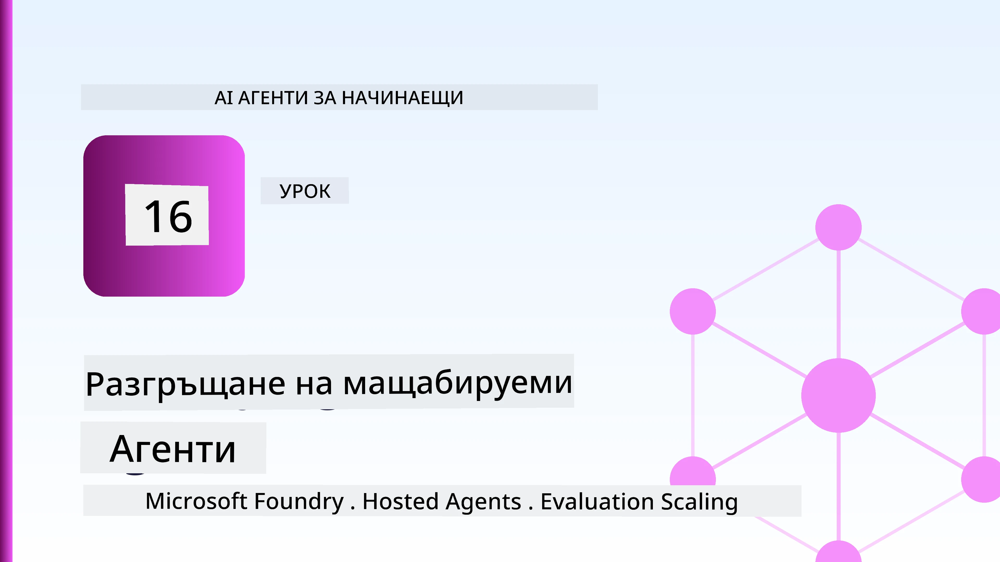
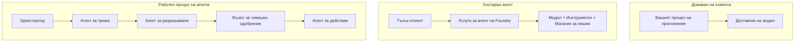
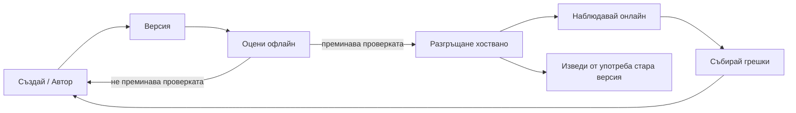
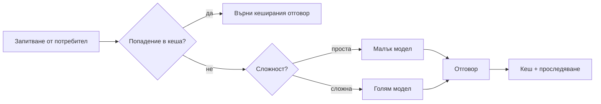
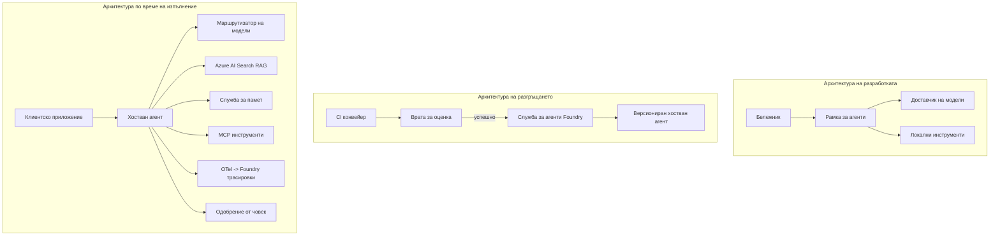

# Разгръщане на мащабируеми агенти с Microsoft Foundry



До този момент в курса сте създали агенти, които работят на вашия лаптоп, в рамките на бележник, управлявани чрез `az login` и няколко променливи на околната среда. Това е точно правилният начин за учене. Но не е правилният начин да пускате агент, на когото хиляди клиенти разчитат в 3 сутринта.

Този урок е за пропастта между "работи на моята машина" и "работи надеждно и достъпно в продукция." Запълваме тази пропаст чрез **Microsoft Foundry** и **Microsoft Foundry Agent Service**, като създаваме реален агент за клиентска поддръжка с инструменти, извличане, памет, оценка и мониторинг.

## Въведение

Този урок обхваща:

- Разликата между **прототипен агент** и **разгърнат агент** и защо преходът се отнася главно до всичко *около* модела.
- **Патерни за разгръщане** на агенти: хоствани от клиент, хоствани като услуга (Hosted Agents) и управлявани чрез работни потоци.
- **Жизнен цикъл на агента** в Microsoft Foundry — създаване, версиониране, разгръщане, оценка, наблюдение, пенсиониране.
- **Стратегии за мащабиране**: маршрутизиране на модели, кеширане, конкурентност и безсъстоячен дизайн.
- **Наблюдаемост** с OpenTelemetry и Foundry трасировка.
- **Оптимизация на разходите** чрез подбор на модел, маршрутизиране и оценъчни прагове.
- **Предприятни съображения**: управление, одобрение от хора и безопасно пускане на MCP сървъри в продукция.

## Цели за учене

След приключване на урока ще знаете как да:

- Изберете правилния модел за разгръщане за дадено натоварване на агента.
- Разгърнете агент в Microsoft Foundry Agent Service, така че да е версиониран, управляван и наблюдаем.
- Инструментирате агент за трасировка и свържете оценъчен pipeline, който се изпълнява преди всяко пускане.
- Приложите маршрутизиране на модел и кеширане, за да държите латентността и разходите под контрол при мащабиране.
- Добавите човек за одобрение при рискови действия и интегрирате MCP сървър по безопасен за продукция начин.

## Предварителни изисквания

Този урок предполага, че сте завършили по-ранните уроци и сте комфортни с:

- Създаване на агенти с [Microsoft Agent Framework](../14-microsoft-agent-framework/README.md) (Урок 14).
- [Използване на инструменти](../04-tool-use/README.md) (Урок 4) и [Agentic RAG](../05-agentic-rag/README.md) (Урок 5).
- [Памет на агента](../13-agent-memory/README.md) (Урок 13) и [Agentic Protocols / MCP](../11-agentic-protocols/README.md) (Урок 11).
- [Наблюдаемост и оценка](../10-ai-agents-production/README.md) (Урок 10) — този урок се базира директно на него.

Също така ще ви трябват:

- **Абонамент за Azure** и **Microsoft Foundry проект** с поне един разгърнат чат модел.
- **Azure CLI** с удостоверяване (`az login`).
- Python 3.12+ и пакетите в репозитория [`requirements.txt`](../../../requirements.txt).

## От прототип до продукция: Какво всъщност се променя

Прототипен агент и продукционен агент споделят същия основен цикъл — разсъждава, извиква инструменти, отговаря. Променя се всичко обвиващо този цикъл. Моделът е може би 20% от продукционния агент; останалите 80% са оперативният скелет.

| Грижа | Прототип | Продукция |
| --- | --- | --- |
| **Хостинг** | Работи във вашия бележник | Работи като хоствана услуга, с версиониране и разгръщане |
| **Идентичност** | Вашият `az login` токен | Управлявана идентичност с ограничен RBAC |
| **Състояние** | В паметта, губи се при рестарт | Външно съхранено (съхранение на нишки, служба за памет) |
| **Грешка** | Виждате трасето | Опити, резервни планове, мъртви писма, сигнали |
| **Разход** | "Струва няколко стотинки" | Следи се на заявка, маршрутизира се, кешира се, бюджетира се |
| **Качество** | Визуална проверка на изхода | Оценка автоматично преди всяко пускане |
| **Доверие** | Одобрявате всяко действие | Политика + човек в цикъла при рискови действия |

Запомнете тази таблица. Всеки раздел по-долу съответства на един от тези редове.

## Патерни за разгръщане на агенти

Има три патерна, които ще използвате, често в комбинация.

### 1. Агeнти, хоствани от клиент

Агентът живее в процеса на *вашето* приложение. Вашият код директно извиква доставчика на модели; цикълът на разсъждение работи във вашата услуга. Това е какво са правили всички предишни уроци.

- **Използвайте го когато** имате нужда от пълен контрол над цикъла, потребителски middleware или вграждане на агента във вече съществуващ backend.
- **Компромис**: вие се грижите за мащабирането, състоянието и устойчивостта сами.

### 2. Хоствани агенти (Foundry Agent Service)

Агентът е *регистриран като ресурс* в Microsoft Foundry. Foundry хоства цикъла на разсъждение, съхранява нишките, налага безопасността на съдържанието и RBAC, и прави агента видим в портала Foundry. Вашето приложение става лек клиент, който създава нишки и чете отговори.

- **Използвайте го когато** искате издържливост, вградена наблюдаемост, управление и по-малка оперативна сложност.
- **Компромис**: по-малко ниско ниво контрол в замяна на управлявана среда за изпълнение.

### 3. Работни потоци на агенти

Няколко агенти (и инструменти) се комбинират в граф с явен контрол на потока — последователни стъпки, разклоняване, възли за одобрение от човек и трайни контролни точки, които могат да поставят на пауза и да подновят процеса. Това е възможността за **Workflows** на Microsoft Agent Framework, приложена в мащаба на разгръщане.

- **Използвайте го когато** една задача изисква няколко специализирани агенти или има нужда от стъпка за одобрение в средата.
- **Компромис**: повече движещи се части; изисква наблюдаемост на ниво оркестрация.



## Жизнен цикъл на агента в Microsoft Foundry

Разгръщането на агент не е еднократно `push` действие. Това е цикъл и много наподобява цикъла на пускане на софтуер, защото това точно е.



Основната идея, пренесена от [Урок 10](../10-ai-agents-production/README.md): **оценката офлайн е праг, а не мисъл след това.** Новата версия на агента не се пуска, ако не минава вашите оценъчни прагове. Онлайн наблюдаемостта пък връща реалните грешки обратно към вашия офлайн тестов набор. Това е целият цикъл.

## Стратегии за мащабиране

Мащабирането на агент е различно от мащабиране на безсъстоячен уеб API, защото всяка заявка може да задейства множество скъпи извиквания към модели и инструменти. Четири техники поемат основния товар.

**Обработка на безсъстоячни заявки.** Не пазете състояние на потребителя в оперативната памет на процеса. Съхранявайте нишките на разговора в хранилището с нишки на Foundry или в услуга за памет, така че всеки екземпляр да може да обработва всяка заявка. Това ви позволява хоризонтално мащабиране — добавяте екземпляри, без “лепкави” сесии.

**Маршрутизиране на модел.** Не всяка заявка изисква най-мощния (и най-скъп) ви модел. Насочвайте прости заявки — класификация на намерения, кратки фактически отговори — към малък, бърз модел и запазвайте големия модел за истинско разсъждение. Foundry-ят **Model Router** може да го направи вместо вас, или можете сами да имплементирате лек класификатор. Ще построите DIY версията в лабораторията.

**Кеширане на отговори.** Много запитвания към поддръжка са почти дублирани ("как да сменя паролата?"). Кеширайте отговори на често задавани въпроси и ги връщайте без изобщо да ударите модела. Дори скромен процент кеш попадения значително намалява разходи и латентност.

**Конкурентност и натиск обратно.** Доставчиците на модели имат ограничения по скорост. Ограничете конкурентността си, използвайте опити с експоненциално забавяне и се проваляйте елегантно (отговор в опашка “работим по въпроса” бие 500).



## Наблюдаемост в продукция

Не можете да управлявате, което не можете да видите. Както беше разгледано в Урок 10, Microsoft Agent Framework излъчва **OpenTelemetry** следи нативно — всяко извикване на модел, команда към инструмент и стъпка в оркестрацията става span. В продукция експортирате тези spans към Microsoft Foundry (или всяка друга OTel-съвместима бекенд система), за да можете:

- Да проследите жалбата на един клиент от край до край през всяко извикване на модел и инструмент.
- Да наблюдавате p50/p95 латентност и разходи на заявка с течение на времето.
- Да получавате сигнали при скокове в честотата на грешките и аномалии в разходите преди вашите потребители (или финансисти) да го забележат.

```python
from agent_framework.observability import get_tracer

tracer = get_tracer()

with tracer.start_as_current_span("support_request") as span:
    span.set_attribute("customer.tier", "enterprise")
    span.set_attribute("routed.model", "gpt-4.1-mini")
    # изпълнението на агента се проследява автоматично вътре в този интервал
```

Атрибути като `customer.tier` и `routed.model` превръщат масив от трасета във въпроси, на които може да се отговори („маршрутират ли често корпоративни клиенти към малкия модел?“).

## Оптимизация на разходите

В продукционните агенти разходите се доминират от токените. Три лоста, по степен на влияние:

1. **Правилен размер на модела.** Малък модел, който преминава вашия оценъчен праг, почти винаги е по-евтин от голям, който също преминава. Използвайте оценяване, за да *доказвате* че малкият модел е достатъчно добър, вместо да избирате най-големия от предпазливост.
2. **Маршрутизиране според сложността.** Както по-горе — плащате големия модел само за заявки, които изискват голямо разсъждение.
3. **Агресивно кеширане.** Най-евтиното извикване на модел е това, което не правите.

Оценъчните прагове и контролът на разходите са една и съща дисциплина гледана от две страни: оценката ви казва *подовото качество*, маршрутирането и кеширането ви държат възможно най-близо до *разходния* праг.

## Предприятни съображения при разгръщане

**Управление.** Хостваните агенти наследяват Foundry RBAC, безопасност на съдържанието и одитно регистриране. Дайте на всеки агент управлявана идентичност с най-малките нужни привилегии — само четене на базата знания, ограничен достъп до API за тикети, нищо повече.

**Човек в цикъла.** Някои действия са твърде последствени, за да бъдат автоматизирани изцяло — издаване на възстановяване, изтриване на акаунт, ескалация към юридически екип. Microsoft Agent Framework поддържа **инструменти изискващи одобрение**: агентът предлага действие, изпълнението спира, човек одобрява или отказва и работният поток продължава. Видяхте тази примитивност в [Урок 6](../06-building-trustworthy-agents/README.md); тук я разгърнахте.

**MCP в продукция.** [MCP](../11-agentic-protocols/README.md) позволява на вашия агент да използва външни инструменти чрез стандартен интерфейс. В продукция третирайте всеки MCP сървър като ненадеждна граница: фиксирайте версията на сървъра, стартирайте го с ограничена идентичност, валидирайте изходите му и никога не разкривайте тайни пред него. MCP сървърът е зависимост, а зависимостите се подлагат на ъпдейти, одит и ограничение на скоростта.



Тези три диаграми — разработка, разгръщане, работа — показват един и същ агент в три етапа от живота му. Следващата лаборатория ви въвежда в създаването му.

## Практическа лаборатория: Продукционно готов агент за клиентска поддръжка

Отворете [`code_samples/16-python-agent-framework.ipynb`](./code_samples/16-python-agent-framework.ipynb) и го изпълнете от начало до край. Ще сглобите **агент за клиентска поддръжка на Contoso** с всички важни производствени функционалности:

1. **Извикване на инструменти** — проверка на статус на поръчка и отваряне на заявки за поддръжка.
2. **RAG** — отговори на въпроси за политики от база знания (Azure AI Search, с бекъп в памет, за да работи бележникът и без Search ресурс).
3. **Памет** — запомняне на клиента през въртенията на разговора.
4. **Маршрутизиране на модел** — класификатор на сложност насочва всяка заявка към малък или голям модел.
5. **Кеширане на отговори** — повтарящите се въпроси се обслужват от кеша.
6. **Човешко одобрение** — върнати суми над праг изискват човешко потвърждение.
7. **Оценъчен pipeline** — малък офлайн тестов набор оценява агента и служи като праг за пускане.
8. **Наблюдаемост** — OpenTelemetry трасировка около всяка заявка.

### Преглед

Бележникът е организиран така, че всяка производствена грижа е самостоятелен, изпълним раздел. Сърцето му е обработчикът за заявки с маршрутизиране и кеширане:

```python
async def handle_support_request(query: str, customer_id: str) -> str:
    # 1. Обслужване от кеш, когато можем.
    cached = response_cache.get(normalize(query))
    if cached:
        return cached

    # 2. Маршрутизиране според сложността за контролиране на разходите.
    model = "gpt-4.1-mini" if is_simple(query) else "gpt-4.1"

    # 3. Стартиране на агента вътре в проследяващ отрязък за наблюдаемост.
    with tracer.start_as_current_span("support_request") as span:
        span.set_attribute("routed.model", model)
        span.set_attribute("customer.id", customer_id)
        response = await support_agent.run(query, model=model)

    # 4. Кеширане и връщане.
    response_cache.set(normalize(query), response.text)
    return response.text
```

Оценъчният праг, който пази пускането, изглежда така:

```python
async def evaluation_gate(agent, test_cases, threshold: float = 0.8) -> bool:
    passed = 0
    for case in test_cases:
        result = await agent.run(case["input"])
        if score_response(result.text, case["expected"]) >= 0.8:
            passed += 1
    pass_rate = passed / len(test_cases)
    print(f"Evaluation pass rate: {pass_rate:.0%} (gate: {threshold:.0%})")
    return pass_rate >= threshold  # разгръщайте само ако пропускателят е успешен
```

Прочетете всеки ред — бележникът държи примитивите умишлено малки, за да не се крие нищо зад повикване на framework.

## Валидиране на разгърнат агент с тестове за задимяване

Оценъчният праг по-горе се изпълнява *офлайн* спрямо вашия агент обект. След като агентът е разгърнат като Hosted Agent, ви трябва още една, дори по-евтина проверка: **дали разгърнатата точка за достъп всъщност отговаря?**

Разгръщането „успешно“ само доказва, че контролната площ е приела дефиницията — не доказва, че агентът отговаря. Липсваща зависимост, грешно маршрутизиране на модел или изтекла връзка могат да оставят зелено разгъване, което не връща нищо. **Тестът за задимяване** хваща това за секунди, при всяко разгръщане, без разходите на пълна оценка.

Този репозитория предлага готов pipeline за тест за задимяване, базиран на [AI Smoke Test](https://github.com/marketplace/actions/ai-smoke-test) GitHub Action:

- **Каталог** — [`tests/lesson-16-smoke-tests.json`](../../../tests/lesson-16-smoke-tests.json) съдържа подсказки и твърдения за агента за поддръжка на Contoso (отворени отговори за политики, проверка на поръчки, оставане в темата и многоредова консистенция на нишката). Каталози за агенти на други уроци са в същата директория — вижте [`tests/README.md`](../tests/README.md).
- **Работен поток** — [`.github/workflows/smoke-test.yml`](../../../.github/workflows/smoke-test.yml) влиза с Azure OIDC и изпраща всяка подсказка до Responses endpoint на агента, проваляйки джоба при всяко пропускане на твърдение.

```yaml
- name: Smoke-test hosted agent
  uses: JFolberth/ai-smoketest@v1
  with:
    project_endpoint: ${{ inputs.project_endpoint }}
    agent_name: ContosoSupportAgent
    tests_file: tests/lesson-16-smoke-tests.json
```


Стартирайте го от раздела **Actions**, след като агентът ви бъде разположен, като предоставите крайния адрес на вашия Foundry проект и името на агента. Федеративната идентичност се нуждае от ролята **Azure AI User** в обхвата на Foundry проекта. Мислете за слоевете като за пирамида: тестовете за дим (достъпни ли са и отговарят ли?) се изпълняват при всяко разполагане, офлайн оценката (достатъчно добра ли е за пускане?) се изпълнява преди промоция, а онлайн оценката (как се справя на живо?) се изпълнява непрекъснато.

## Проверка на знанията

Тествайте разбирането си преди да преминете към задачата.

**1. Приблизително колко голяма част от продукционен агент е "моделът" и какво е останалото?**

<details>
<summary>Отговор</summary>

Моделът е малцинство от системата — често се споменава около 20%. Останалото е оперативният скелет: хостинг и версииране, идентичност и RBAC, екстернализирано състояние, управление на грешки, проследяване на разходи, оценка и контрол с участието на човек. Преминаването в продукция е главно въпрос на изграждане на всичко *около* цикъла на разсъждение.
</details>

**2. Кога бихте избрали Хостван Агент пред клиент-хостиран агент?**

<details>
<summary>Отговор</summary>

Когато искате управлявана среда за изпълнение с вградена издръжливост (нишки, които персистират и могат да се възобновят), наблюдаемост, безопасност на съдържанието и RBAC, и сте склонни да жертвате част от ниско-нивовия контрол върху цикъла на разсъждение за по-малко оперативна повърхност. Клиент-хостиран е предпочитан, когато имате нужда от пълен контрол върху цикъла или вграждате агента в съществуващ бекенд.
</details>

**3. Защо мащабируемият агент трябва да бъде безсъстоянието в собствената си процесна памет?**

<details>
<summary>Отговор</summary>

За да може всяка инстанция да може да обработва всяка заявка, което позволява хоризонтално мащабиране без залепващи сесии. Състоянието на разговорите на потребителите е екстернализирано към store за нишки или сервиз за памет. Ако състоянието се пазеше в процесната памет, щеше да се загуби при рестарт и нямаше да можете свободно да разпределяте натоварването.
</details>

**4. Какъв проблем решава маршрутизирането на моделите и как се свързва с оценката?**

<details>
<summary>Отговор</summary>

Маршрутизирането изпраща прости заявки към малък, евтин и бърз модел и резервира големия модел за истинско разсъждение, като управлява както латентността, така и разходите. Свързва се с оценката, защото оценката е това, което *доказва*, че малкият модел е достатъчно добър за клас заявки — маршрутизирането без оценка е просто предположение.
</details>

**5. Какво е „оцeнителна врата“ и къде се намира в жизнения цикъл?**

<details>
<summary>Отговор</summary>

Оценителната врата изпълнява офлайн тестове срещу нова версия на агента и спира разполагането, освен ако процентът на преминаване не преодолее прага. Тя се намира между „версия“ и „разполагане“ в жизнения цикъл, правейки качеството предпоставка за пускане, вместо нещо, което проверявате след пускането.
</details>

**6. Защо MCP сървърът трябва да се третира като ненадеждно ограничение в продукция?**

<details>
<summary>Отговор</summary>

Защото е външна зависимост, към която вашият агент прави повиквания. Трябва да фиксирате версията му, да го стартирате с ограничена идентичност, да валидирате неговите изходи, да ограничавате честотата му и никога да не излагате тайни на него — същата дисциплина, която прилагате към всяка трета страна зависимост. Неговите изходи влизат в разсъжденията на вашия агент, затова невалидираното доверие е рисков фактор за сигурността.
</details>

**7. Коя една промяна обикновено има най-голямо влияние върху разходите на продукционен агент и защо?**

<details>
<summary>Отговор</summary>

Правилният избор на размер на модела — използването на най-малкия модел, който все още преминава през вашата оценителна врата. Разходите се доминират от токени, а по-малкият модел, който достига качествения праг, почти винаги е по-евтин от по-големия. Кеширането и маршрутизирането допълнително намаляват разходите, но изборът на правилния базов модел има най-голям ефект от първи ред.
</details>

**8. Каква роля играят атрибутите на спана като `customer.tier` и `routed.model` в наблюдаемостта?**

<details>
<summary>Отговор</summary>

Те превръщат суровите трасета в отговарящи на бизнес въпроси. Без атрибути имате стена от спанове; с тях можете да питате „дали корпоративните клиенти се маршрутизират към малкия модел твърде често?“ или „кой модел обработва нашите най-бавни заявки?“ Атрибутите са начинът, по който сегментирате телеметрията по измеренията, които са важни за вашата дейност.
</details>

## Задача

Вземете агента за клиентска поддръжка от лабораторията и го подсилете за конкретен сценарий: **агент за поддръжка на абонаментното фактуриране за SaaS компания.**

Вашето предаване трябва да:

1. **Замените инструментите** с такива, свързани с фактуриране: `get_subscription_status`, `get_invoice` и `issue_credit` (кредити над 50 долара изискват човешко одобрение).
2. **Добавите три RAG документа**, обхващащи политиката за възстановяване на сумите на компанията, цикъла на фактуриране и политиката за отказване.
3. **Разширите оценителния набор** до поне осем случая, включително поне два, които *трябва* да задействат пътя с човешко одобрение, и потвърдите правилното преминаване или провал на оценителната врата.
4. **Добавите един доклад за разходите**: след изпълнение на десет смесени заявки през агента, отпечатайте колко са преминали към малкия модел, колко към големия модел и колко са обслужени от кеша.

Напишете кратък параграф (в markdown клетка), обясняващ коя правило за маршрутизиране на модели сте избрали и как бихте го валидирали с реален трафик. Няма единствен правилен отговор — оценяват ви по това дали продукционните съображения са свързани по последователен начин.

## Резюме

В този урок преместихте агент от прототип към продукция с Microsoft Foundry:

- Скокът към продукция е предимно заради **оперативния скелет** около модела — хостинг, идентичност, състояние, управление на грешки, разходи, качество и доверие.
- Научихте трите **модела на разполагане** — клиент-хостиран, Хоствани агенти и Agent Workflows — и кога всеки от тях е подходящ.
- Разгледахте **жизнения цикъл на агента**, където офлайн **оценката действа като врата за пускане**, а онлайн наблюдаемостта връща грешките към тестовия набор.
- Приложихте **стратегии за мащабиране** — безсъстояни дизайн, маршрутизиране на модели, кеширане и ограничена паралелност — и ги свързахте с **оптимизация на разходите**.
- Включихте **корпоративни контроли**: RBAC, одобрение с човешко участие и интеграция с MCP безопасна за продукция.
- Изградихте **агент за клиентска поддръжка готов за продукция**, който свързва всички тези съображения в изпълним код.

Следващият урок прави обратния път: вместо да мащабирате агенти към облака, ще ги спуснете *надолу* на един разработващ компютър и ще ги стартирате изцяло локално.

## Допълнителни ресурси

- <a href="https://learn.microsoft.com/azure/ai-foundry/what-is-azure-ai-foundry" target="_blank">Документация на Microsoft Foundry</a>
- <a href="https://learn.microsoft.com/azure/ai-foundry/agents/overview" target="_blank">Обзор на Microsoft Foundry Agent Service</a>
- <a href="https://aka.ms/ai-agents-beginners/agent-framework" target="_blank">Microsoft Agent Framework</a>
- <a href="https://learn.microsoft.com/azure/ai-foundry/concepts/model-router" target="_blank">Model Router в Microsoft Foundry</a>
- <a href="https://learn.microsoft.com/azure/search/search-what-is-azure-search" target="_blank">Azure AI Search</a>
- <a href="https://opentelemetry.io/" target="_blank">OpenTelemetry</a>
- <a href="https://github.com/marketplace/actions/ai-smoke-test" target="_blank">AI Smoke Test GitHub Action</a>
- <a href="https://modelcontextprotocol.io/" target="_blank">Model Context Protocol (MCP)</a>

## Предишен урок

[Създаване на агенти за компютърна употреба (CUA)](../15-browser-use/README.md)

## Следващ урок

[Създаване на локални AI агенти](../17-creating-local-ai-agents/README.md)

---

<!-- CO-OP TRANSLATOR DISCLAIMER START -->
**Отказ от отговорност**:
Този документ е преведен с помощта на AI преводачески услуга [Co-op Translator](https://github.com/Azure/co-op-translator). Въпреки че се стремим към точност, моля имайте предвид, че автоматизираните преводи могат да съдържат грешки или неточности. Оригиналният документ на неговия роден език трябва да се счита за авторитетен източник. За критична информация се препоръчва професионален човешки превод. Ние не носим отговорност за каквито и да е недоразумения или неправилни тълкувания, произтичащи от използването на този превод.
<!-- CO-OP TRANSLATOR DISCLAIMER END -->