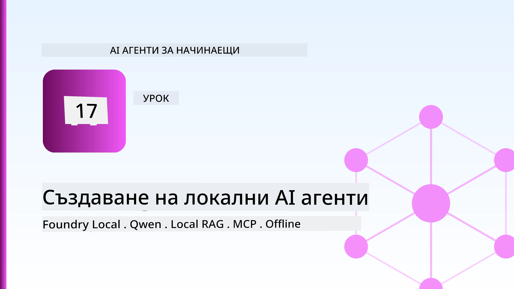
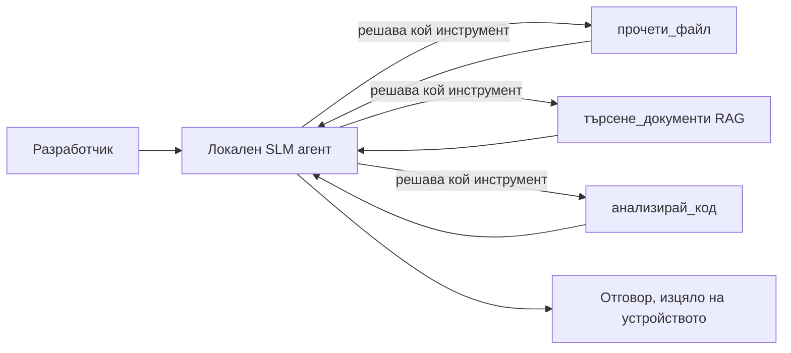
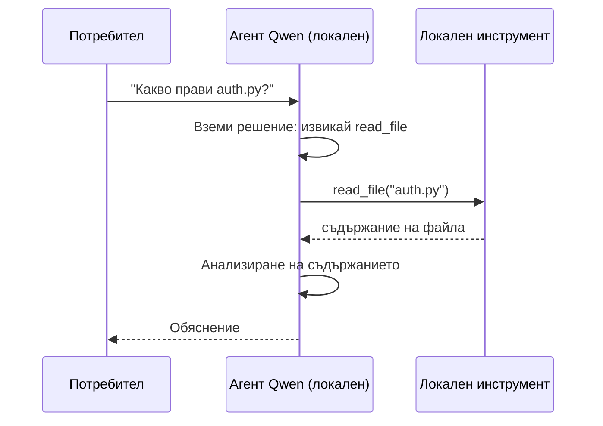
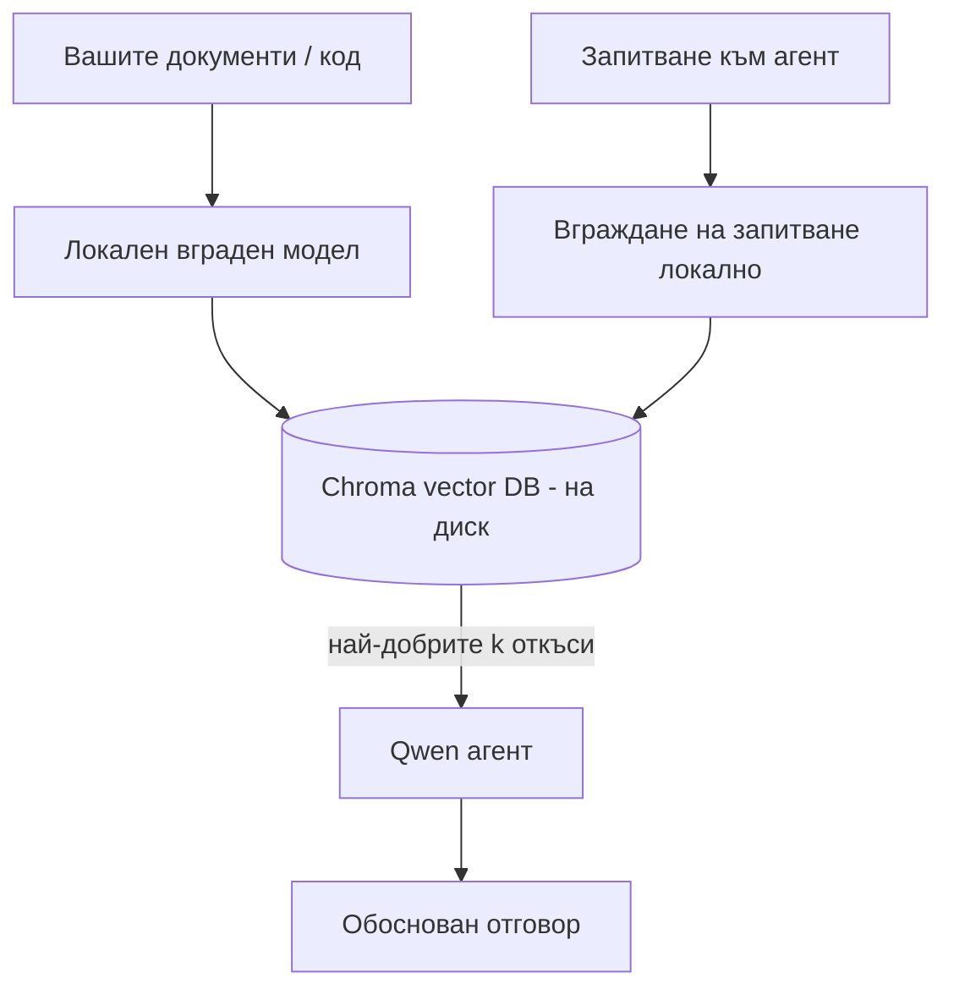
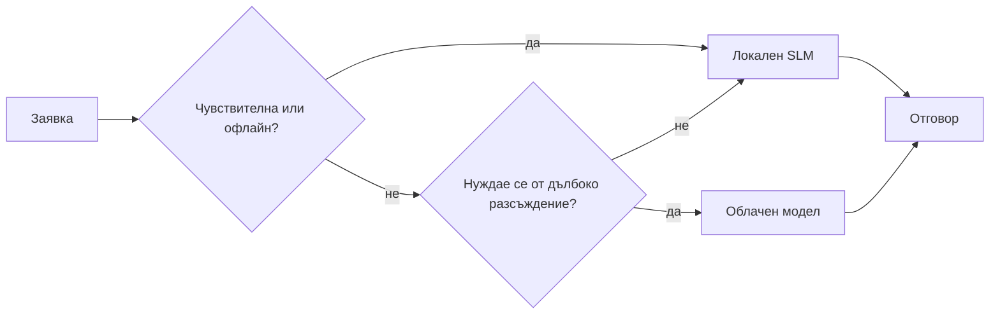

# Създаване на локални AI агенти с Microsoft Foundry Local и Qwen



Предходният урок мащабира агентите *нагоре* в облака. Този ги сваля *надолу* на една машина. В края ще имате работещ инженеринг асистент, който взема решения, извиква инструменти, чете файловете ви и търси в документацията — **без нито едно облачно извикване за извод.**

Защо бихте искали това? Три причини, които винаги изникват при истинска инженерна работа:

- **Поверителност.** Кодът и документите никога не напускат машината. Няма подаване на заявки, откъси или клиентски данни, които да преминават през мрежовата граница.
- **Цена.** Локалният извод няма такса за токени. Можете да итерирате цял ден на цена за електричество.
- **Офлайн.** В самолет, в охраняван обект или при прекъсване, агентът все още работи.

За сметка на това заменяте елитен облачен модел с **Малък езиков модел (SLM)**, работещ на вашия CPU, GPU или NPU. Този урок е за изграждане на агенти, които са *добри* при това ограничение, а не да се правим, че няма ограничение.

## Въведение

Този урок ще разгледа:

- **Малки езикови модели (SLM)** — какво са, къде блестят и къде не.
- **Microsoft Foundry Local** — runtime среда, която изтегля и обслужва модели на устройството чрез **OpenAI-съвместим API**.
- **Qwen модели с извикване на функции** — SLM, които надеждно правят извиквания на инструменти, което прави възможни локалните *агенти* (не само локален чат).
- **Локални инструменти, локален RAG и локален MCP** — даване на възможности на агента без облак.
- **Хибридни модели** — кога да се държи нещата локално и кога да се тегли към облака.

## Цели за учене

След като завършите този урок, ще знаете как да:

- Обяснявате компромисите на SLM и избирате подходящи случаи на употреба за локални агенти.
- Обслужвате Qwen модел локално с Foundry Local и се свързвате с него чрез OpenAI-съвместимия endpoint.
- Създадете агент, който извиква инструменти и работи изцяло на вашата работна станция.
- Добавите локален RAG върху собствени документи чрез локална векторна база данни (Chroma).
- Свържете агента с локален MCP сървър и обмислите хибридни локални/облачни дизайни.

## Предварителни изисквания

Този урок предполага, че сте завършили предишните уроци и сте уверени с:

- [Използване на инструменти](../04-tool-use/README.md) (Урок 4) и [Agentic RAG](../05-agentic-rag/README.md) (Урок 5).
- [Agentic протоколи / MCP](../11-agentic-protocols/README.md) (Урок 11).
- [Microsoft Agent Framework](../14-microsoft-agent-framework/README.md) (Урок 14).

Ще ви трябват също:

- Работна станция за разработчици. **Реалистично минимално количество RAM е 8 GB**; 16 GB+ е комфортно. GPU или NPU помага, но не е задължително.
- Инсталиран **Microsoft Foundry Local** (вижте секцията за настройка по-долу).
- Python 3.12+ и пакетите в репозитория [`requirements.txt`](../../../requirements.txt), плюс `foundry-local-sdk`, `openai` и `chromadb` за този урок.

## Малки езикови модели: правилният инструмент за локална работа

Модел от водещо ниво в облака има стотици милиарди параметри и зад него стои център за данни. Един SLM има няколко милиарда параметри и трябва да се побере в RAM паметта на вашия лаптоп. Тази разлика поставя ясни очаквания.

**SLM са добри в:**

- Структурирани, ограничени задачи — класификация, извличане, обобщение на известен документ.
- **Извикване на инструменти** — решение кой инструмент да се извика и с какви аргументи.
- Бърза, евтина, поверителна итерация върху собствените ви данни.

**SLM са по-слаби в:**

- Отворени, многостепенни разсъждения върху голям контекст.
- Обширни световни знания (виждали са по-малко и забравят повече).

Следователно печелившата стратегия за локални агенти е: **нека SLM да организира, а инструментите да вършат тежката работа.** Моделът не трябва да *знае* вашия код — трябва да знае кога да извика `read_file` и `search_docs`. Това точно играе на силните страни на SLM.



## Microsoft Foundry Local

**Microsoft Foundry Local** е лека runtime среда, която изтегля, управлява и обслужва модели изцяло на вашата машина. Най-важната ни функция е, че предоставя **OpenAI-съвместим HTTP endpoint** — което означава, че OpenAI SDK и OpenAI клиентът на Microsoft Agent Framework работят с него само с промяна на `base_url`. Всичко научено за създаване на агенти се пренася директно; само endpoint се премества от облака към `localhost`.

Foundry Local също избира най-подходящата компилация на модел за вашия хардуер автоматично — CPU билд, CUDA/GPU билд или NPU билд — така че не оптимизирате ръчно за всяка машина.

### Настройка

Инсталирайте Foundry Local (вижте [документацията](https://learn.microsoft.com/azure/ai-foundry/foundry-local/) за вашата ОС), после проверете дали работи:

```bash
# Инсталирайте (пример; следвайте документацията за вашата платформа)
winget install Microsoft.FoundryLocal      # Windows
# brew install microsoft/foundrylocal/foundrylocal   # macOS

# Изтеглете и стартирайте Qwen модел, след това стартирайте локалната услуга
foundry model run qwen2.5-7b-instruct
foundry service status
```

След като услугата стартира, имате локален, OpenAI-съвместим endpoint (обикновено `http://localhost:PORT/v1`). Тетрадката използва `foundry-local-sdk`, за да открива endpoint автоматично, така че не е нужно да фиксирате порт.

## Qwen извикване на функции: защо е важно

Агентът е агент само ако може да извиква инструменти. Много SLM могат да си чатят, но правят ненадеждни, неправилно оформени извиквания на инструменти. **Qwen** моделите са обучени за извикване на функции и излъчват стабилно добре оформени структури за извикване — което превръща локален чат модел в локален *агент*.

Потокът е стандартният цикъл за извикване на инструменти, който вече знаете, само че върви на устройството:



## Локален RAG

Търсенето в документацията е мястото, където локалните агенти печелят. Вместо да се надявате SLM да е запомнил документация на вашия фреймуърк, вграждате тези документи в **локална векторна база данни** и позволявате на агента да извлича съответните парчета по заявка.

Използваме **Chroma**, вградена векторна база, която работи в процеса без да изисква сървър. Целият поток е локален: локален embedding модел → локални вектори → локално извличане → локален SLM.



Това е същият Agentic RAG модел от Урок 5 — единствената промяна е, че всичко тече на вашата машина.

## Локални MCP сървъри

[MCP](../11-agentic-protocols/README.md) е транспортен протокол, а не облачна услуга. MCP сървър може да работи локално като процес на `stdio`, като предоставя инструменти на вашия агент чрез стандартизирания протокол. Това ви позволява да използвате все повече MCP сървъри — достъп до файловата система, git операции, заявки към база данни — изцяло офлайн.

Сигурността е различна от облака, но не е отсъстваща: локален MCP сървър пак работи с вашите потребителски права, затова ограничете обхвата му (например директория на проект, а не цялата ви домашна папка) и проверявайте изходните му данни като входни преди да действа.

## Хибридни облачни и локални модели

Локално първо не означава само локално. Зрелите системи пренасочват заявките по чувствителност и трудност:

| Ситуация | Къде се изпълнява |
| --- | --- |
| Чувствителен код / данни, или офлайн | **Локален SLM** |
| Проста, ограничена задача | **Локален SLM** (евтин, бърз) |
| Трудно многостепенно разсъждение върху нечувствителни данни | **Облачен модел** |
| Всичко при прекъсване | **Локален SLM** (грейсфул деградация) |

Това отразява идеята за **маршрутизиране на модели** от Урок 16 — с изключение, че един от "моделите" вече е вашата машина. Здравият дизайн се връща на локалното, когато облакът не е наличен, така че агентът деградира по качество, вместо да се проваля напълно.



## Практически лабораторен урок: Локален инженеринг асистент

Отворете [`code_samples/17-local-agent-foundry-local.ipynb`](./code_samples/17-local-agent-foundry-local.ipynb) и го разгледайте. Ще създадете **локален инженеринг асистент**, който работи изцяло на вашата работна станция и може:

1. **Да извиква инструменти** — чрез Qwen извикване на функции през Foundry Local.
2. **Да изпълнява локални файлови операции** — листиране и четене на файлове в директорията на проект.
3. **Да анализира код** — отчита основни метрики на изходен файл.
4. **Да търси в документация** — локален RAG върху папка с документи чрез Chroma.
5. **Да използва MCP** — свързване с локален MCP сървър (с мек пропуск, ако не е конфигуриран).

Не се използва облачен извод по никакъв начин.

### Разглеждане стъпка по стъпка

Асистентът се свързва към Foundry Local през OpenAI-съвместимия endpoint, така че кодът на агента изглежда почти идентичен с тези от облачните уроци — само клиентът се променя:

```python
from foundry_local import FoundryLocalManager
from openai import OpenAI

# Foundry Local открива/изтегля модела и ни предоставя локален крайна точка.
manager = FoundryLocalManager(\"qwen2.5-7b-instruct\")
client = OpenAI(base_url=manager.endpoint, api_key=manager.api_key)  # api_key е локален заместител
```

Инструментите са обикновени Python функции, ограничени до директория на проект:

```python
def read_file(path: str) -> str:
    \"\"\"Read a file, but only inside the sandboxed project directory.\"\"\"
    full = (PROJECT_ROOT / path).resolve()
    if PROJECT_ROOT not in full.parents and full != PROJECT_ROOT:
        return \"Access denied: path is outside the project directory.\"
    return full.read_text(encoding=\"utf-8\")
```

Обърнете внимание на проверката на песъчника — дори и локално, инструмент, който чете произволни пътища, е опасен. Тетрадката държи всеки инструмент ограничен до един проектен корен.

## Проверка на знанията

Тествайте разбирането си преди да преминете към заданието.

**1. Дайте две конкретни причини да пуснете агент локално, вместо в облака.**

<details>
<summary>Отговор</summary>

Две от следните: **поверителност** (кодът и данните никога не напускат машината), **цена** (няма такса за токени при извода) и **възможност за офлайн работа** (работи без мрежа — в самолет, охраняван обект или при прекъсване). Регулаторни/съвместимостни ограничения, които забраняват изпращането на данни извън устройството, често движат причината за поверителност.
</details>

**2. Какво е препоръчителното разпределение на труда между SLM и неговите инструменти в локален агент и защо?**

<details>
<summary>Отговор</summary>

Нека SLM **организира** (решава кой инструмент да използва и с какви аргументи), а **инструментите да вършат тежката работа** (четене на файлове, извличане на документи, изчисляване на резултати). SLM са силни във взимането на ограничени решения като избор на инструмент, но по-слаби в обширни знания и дълги многостепенни разсъждения, затова опирането на инструменти играе на техните силни страни.
</details>

**3. Какво прави възможно повторното използване на облачен агентен код с Foundry Local?**

<details>
<summary>Отговор</summary>

Foundry Local предоставя **OpenAI-съвместим HTTP endpoint**. OpenAI SDK и OpenAI клиентът на Agent Framework работят с него само с промяна на `base_url` (и използване на локален API ключ-запълнител). Всичко друго в кода на агента остава същото.
</details>

**4. Защо използваме конкретно Qwen модел с извикване на функции, а не произволен SLM?**

<details>
<summary>Отговор</summary>

Защото агентът трябва да произвежда надеждни, добре оформени **извиквания на инструменти**. Много SLM могат да чатят, но излъчват неправилни или непоследователни структури за извикване. Qwen моделите са обучени за извикване на функции и произвеждат последователни извиквания, което превръща локален чат модел в работещ локален агент.
</details>

**5. В локалния RAG поток, кои компоненти работят на машината?**

<details>
<summary>Отговор</summary>

Всички: embedding моделът, векторната база данни (Chroma, на диск), стъпката за извличане и SLM. Документите се вграждат локално, съхраняват локално, извличат локално и се обработват от локален модел — никой компонент не докосва облака.
</details>

**6. Локален MCP сървър работи на вашата машина. Прави ли го това автоматично безопасен? Каква предпазна мярка все пак трябва да вземете?**

<details>
<summary>Отговор</summary>

Не. Локален MCP сървър работи с правата на вашия потребител, така че има достъп до всичко, до което и вие имате. Ограничете го само до необходимото (например една проектна директория, а не цялата домашна папка) и третирайте изходните му данни като входни, подлежащи на проверка, преди да работите с тях.
</details>

**7. Опишете разумно хибридно правило за маршрутизиране, което включва локален модел.**

<details>
<summary>Отговор</summary>

Насочвайте чувствителни или офлайн заявки към локалния SLM; насочвайте прости ограничени задачи към локалния SLM за бързина и евтино; насочвайте тежки многостепенни разсъждения върху нечувствителни данни към облачен модел; и се връщайте към локалния SLM ако облакът е недостъпен, така че агентът да деградира постепенно, вместо да спира работа. Това е маршрутизиране на модели (Урок 16) с локалната машина като един от моделите.
</details>

**8. Какво е реалистичното минимално количество RAM за работа на локалния агент в този урок и какво ви дава повече RAM?**

<details>
<summary>Отговор</summary>

Около **8 GB** е реалистичното минимално количество; 16 GB+ е комфортно. Повече RAM позволява работа с по-големи, по-способни модели и съхраняване на повече контекст в паметта. GPU или NPU ускорява изводите, но не е задължителен — Foundry Local избира CPU билд, ако няма ускорител.
</details>

## Задание

Разширете локалния инженеринг асистент до **локален прегледач на документация** за малък избран от вас проект (може да използвате една от папките на уроците в това хранилище).

Вашето решение трябва:

1. **Индексира реална папка с документация/код** в Chroma (поне пет файла).
2. **Добави инструмент `find_todos`**, който сканира проекта за коментари `TODO`/`FIXME` и ги връща с файл и номер на ред — като поддържа същата проверка на песъчника като `read_file`.

3. **Задайте на агента три въпроса**, които го заставят да комбинира инструменти: един чист RAG въпрос, един, който изисква прочитане на конкретен файл, и един, който изисква намиране на TODO-та.
4. **Измерете го**: запишете времето за всеки от трите отговора и ги отбележете в markdown клетка. Коментирайте дали латентността е приемлива за желания от вас работен процес.

След това напишете кратък параграф за **какво бихте прехвърлили в облака и какво бихте запазили локално** за този прегледач, и защо. Оценявате се по това дали локалните компоненти са правилно свързани и дали вашето хибридно разсъждение е здраво — не по качеството на модела.

## Обобщение

В този урок създадохте агент, който работи изцяло на вашата собствена машина:

- **SLM-ите** жертват обхвата в полза на поверителността, разходите и офлайн работата — и блестят, когато **оркестрират инструменти**, вместо да носят цялото знание сами.
- **Foundry Local** обслужва модели на устройството зад **OpenAI-съвместима крайна точка**, така че вашият облачен агентен код се прехвърля с една промяна в реда.
- **Qwen моделите с повикване на функции** правят надеждното локално извикване на инструменти — и следователно локални *агенти* — възможно.
- **Локален RAG** (Chroma) и **локален MCP** дават на агента възможност без да напуска машината.
- **Хибридни модели** ви позволяват да маршрутизирате по чувствителност и сложност, като местното е елегантен резервен вариант.

Това завършва арката на внедряване: Урок 16 мащабира агентите в Microsoft Foundry, а този урок ги мащабира надолу на една работна станция. Следващият урок се обръща към осигуряването на безопасност на внедрените агенти.

## Допълнителни ресурси

- <a href="https://learn.microsoft.com/azure/ai-foundry/foundry-local/" target="_blank">Документация за Microsoft Foundry Local</a>
- <a href="https://learn.microsoft.com/azure/ai-foundry/what-is-azure-ai-foundry" target="_blank">Документация за Microsoft Foundry</a>
- <a href="https://aka.ms/ai-agents-beginners/agent-framework" target="_blank">Microsoft Agent Framework</a>
- <a href="https://qwen.readthedocs.io/en/latest/framework/function_call.html" target="_blank">Документация за повикване на функции на Qwen</a>
- <a href="https://modelcontextprotocol.io/" target="_blank">Model Context Protocol (MCP)</a>
- <a href="https://docs.trychroma.com/" target="_blank">Chroma векторна база данни</a>

## Предишен урок

[Внедряване на мащабируеми агенти](../16-deploying-scalable-agents/README.md)

## Следващ урок

[Осигуряване на AI агенти](../18-securing-ai-agents/README.md)

---

<!-- CO-OP TRANSLATOR DISCLAIMER START -->
**Отказ от отговорност**:
Този документ е преведен с помощта на AI преводачески услуга [Co-op Translator](https://github.com/Azure/co-op-translator). Въпреки че се стремим към точност, моля имайте предвид, че автоматизираните преводи могат да съдържат грешки или неточности. Оригиналният документ на неговия роден език трябва да се счита за авторитетен източник. За критична информация се препоръчва професионален човешки превод. Ние не носим отговорност за каквито и да е недоразумения или неправилни тълкувания, произтичащи от използването на този превод.
<!-- CO-OP TRANSLATOR DISCLAIMER END -->