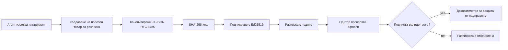
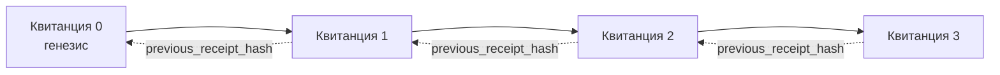

[Гледайте видео урока: Осигуряване на AI агенти с криптографски разписки](https://youtu.be/PLACEHOLDER_VIDEO_ID)

> _(Видео урок и миниатюра ще бъдат добавени от екипа за съдържание на Microsoft след сливането, съответстващо на модела на урок 14 / 15.)_

# Осигуряване на AI агенти с криптографски разписки

## Въведение

Този урок ще разгледа:

- Защо са важни следите за одит на AI агенти за съответствие, отстраняване на грешки и доверие.
- Какво е криптографска разписка и как се различава от незапазена лог линия.
- Как да се произведе подписана разписка за повикване на инструмент от агент в чист Python.
- Как да се провери разписка офлайн и да се открие манипулация.
- Как да се свържат разписки така, че премахването или преподреждането на една да нарушава веригата.
- Какво доказват разписките и какво явно не доказват.

## Цели на ученето

След приключване на този урок ще знаете как да:

- Идентифицирате режимите на неизпълнение, които мотивират криптографската проследимост на действията на агентите.
- Произведете разписка, подписана с Ed25519, върху каноничен JSON товар.
- Проверите разписка независимо само с публичния ключ на подписващия.
- Откриете манипулация чрез повторно стартиране на проверката на променена разписка.
- Изградите хеш-свързана последователност от разписки и да обясните защо веригата е важна.
- Разпознаете границата между това, което разписките доказват (приписване, цялост, поредност) и това, което не доказват (коректност на действието, здравина на политиката).

## Проблемът: Следата за одит на вашия агент

Представете си, че сте разположили AI агент за Contoso Travel. Агентът чете заявки от клиенти, извиква API за полети, за да търси опции, и резервира места от името на клиента. През последното тримесечие агентът е обработил 50 000 резервации.

Днес пристига одитор. Той задава прост въпрос: „Покажете ми какво е направил вашият агент.“

Вие предавате лог файловете си. Одиторът ги преглежда и задава по-трудния въпрос: „Как да знам, че тези лога не са били редактирани?“

Това е проблемът със следата за одит. Повечето разгръщания на агенти днес разчитат на:

- **Приложенчески логове**: написани от самия агент, редактирани от всеки с достъп до файловата система.
- **Облачни лог услуги**: виждащи нарушения на платформено ниво, но само ако одиторът се доверява на оператора на платформата.
- **Логове на транзакции в базата данни**: подходящи за промени в базата, но не за произволни повиквания на инструменти.

Нито един от тези не може да отговори на въпроса на одитора без да изисква той да се довери на някого (вас, вашия облачен доставчик, вашия доставчик на база данни). За вътрешна употреба това доверие често е приемливо. За регулирани товарове (финанси, здравеопазване, всичко подчинено на Законa за AI на ЕС), не е.

Криптографските разписки решават това, като правят всяко действие на агента независимо проверимо. Одиторът не трябва да ви се доверява. Той се нуждае само от вашия публичен ключ и самата разписка.

## Какво е криптографска разписка?

Разписката е JSON обект, който записва какво е направил агентът, подписан с цифров подпис.



Минималната разписка изглежда така:

```json
{
  "type": "agent.tool_call.v1",
  "agent_id": "contoso-travel-bot",
  "tool_name": "lookup_flights",
  "tool_args_hash": "sha256:a3f9c1...",
  "result_hash": "sha256:7b2e1d...",
  "policy_id": "contoso-travel-policy-v3",
  "timestamp": "2026-04-25T14:30:00Z",
  "sequence": 47,
  "previous_receipt_hash": "sha256:9d4e6a...",
  "signature": {
    "alg": "EdDSA",
    "sig": "c5af83...",
    "public_key": "8f3b2c..."
  }
}
```

Три свойства извършват работата:

1. **Подписът**. Разписката е подписана от шлюза на агента с Ed25519 частен ключ. Всеки с отговарящия публичен ключ може да провери подписа офлайн. Манипулация с което и да е поле прави подписа невалиден.

2. **Канонично кодиране**. Преди подписване разписката се сериализира с JSON Canonicalization Scheme (JCS, RFC 8785). Това гарантира, че две имплементации, произвеждащи една и съща логическа разписка, произвеждат идентичен по байтове изход. Без канонизация, различните JSON сериализатори биха произвели различни подписи за едно и също съдържание.

3. **Хеш вериги**. Полето `previous_receipt_hash` свързва всяка разписка с предходната. Премахването или преподреждането на разписка нарушава всички разписки след нея. Манипулацията става видима на ниво верига, дори ако се заобиколят индивидуалните подписи.

Заедно тези свойства осигуряват три гаранции:

- **Приписване**: този ключ е подписал това съдържание.
- **Цялост**: съдържанието не се е променяло след подписването.
- **Поредност**: тази разписка идва след онази в веригата.

## Създаване на разписка в Python

Не ви е нужна специална библиотека за създаване на разписка. Криптографските примитиви са широко достъпни, а логиката е няколко десетки реда Python.

Практическите упражнения в `code_samples/18-signed-receipts.ipynb` преминават през целия процес. Резюме:

```python
import json
import hashlib
import base64
from nacl import signing
from jcs import canonicalize  # RFC 8785 каноничен JSON

def b64url_nopad(data: bytes) -> str:
    return base64.urlsafe_b64encode(data).decode("ascii").rstrip("=")

def sha256_canonical(obj) -> str:
    """SHA-256 of a Python object's JCS-canonical JSON form."""
    return f"sha256:{hashlib.sha256(canonicalize(obj)).hexdigest()}"

# Генерирайте или заредете подписващ ключ (на живо го съхранявайте в хранилище за ключове)
signing_key = signing.SigningKey.generate()
verify_key = signing_key.verify_key

# Изградете полезния товар на разписката (все още без подпис)
tool_args = {"origin": "SYD", "destination": "LAX"}
tool_result = [{"flight": "QF11", "price": 1850, "stops": 0}]

payload = {
    "type": "agent.tool_call.v1",
    "agent_id": "contoso-travel-bot",
    "tool_name": "lookup_flights",
    "tool_args_hash": sha256_canonical(tool_args),
    "result_hash": sha256_canonical(tool_result),
    "policy_id": "contoso-travel-policy-v3",
    "timestamp": "2026-04-25T14:30:00Z",
    "sequence": 0,
    "previous_receipt_hash": None,
}

# Канонизирайте, хеширайте, подпишете.
canonical_bytes = canonicalize(payload)
message_hash = hashlib.sha256(canonical_bytes).digest()
signature_bytes = signing_key.sign(message_hash).signature

# Прикрепете структурен обект за подпис.
receipt = {
    **payload,
    "signature": {
        "alg": "EdDSA",
        "sig": b64url_nopad(signature_bytes),
        "public_key": b64url_nopad(bytes(verify_key)),
    },
}
```

Това е цялата подписваща последователност. Упражненията в тетрадката разглеждат всяка стъпка.

## Проверка на разписка и откриване на манипулации

Проверката е обратната операция:

```python
import base64
import hashlib
from nacl import signing
from nacl.exceptions import BadSignatureError
from jcs import canonicalize

def b64url_decode(s: str) -> bytes:
    padding = "=" * ((4 - len(s) % 4) % 4)
    return base64.urlsafe_b64decode(s + padding)

def verify_receipt(receipt: dict) -> bool:
    # Подписът е структуриран обект: {"alg", "sig", "public_key"}.
    sig_obj = receipt.get("signature")
    if not sig_obj or sig_obj.get("alg") != "EdDSA":
        return False

    # Възстановете полезния товар, който всъщност е бил подписан (всичко освен подписа).
    payload = {k: v for k, v in receipt.items() if k != "signature"}

    canonical_bytes = canonicalize(payload)
    message_hash = hashlib.sha256(canonical_bytes).digest()

    try:
        verify_key = signing.VerifyKey(b64url_decode(sig_obj["public_key"]))
        verify_key.verify(message_hash, b64url_decode(sig_obj["sig"]))
        return True
    except BadSignatureError:
        return False
```

Тази функция приема разписка и връща `True`, ако подписът е валиден, `False` в противен случай. Без мрежови повиквания, без зависимост от услуга, без нужда от доверие в трети страни.

За да видите откриването на манипулации в действие, тетрадката разглежда:

1. Създаване на валидна разписка и потвърждаване, че тя се проверява.
2. Промяна на един байт в полето `tool_args_hash`.
3. Повторно стартиране на проверката и виждане на неуспех.

Това е практическата демонстрация, че разписките са доказателство за непокътнатост: всяка промяна, колкото и малка, разваля подписа.

## Свързване на разписки за многократни стъпки при агенти

Една подписана разписка защитава едно действие. Верига от разписки защитава поредица.



Всяка разписка записва хеша на предишната. За да се премахне разгледаната разписка 2 без следа, нападателят трябва или:

- Да модифицира полето `previous_receipt_hash` на разписка 3 (нарушава подписа на разписка 3), ИЛИ
- Да изфабрикува нов подпис върху променена разписка 3 (изисква частния ключ на агента).

Ако частният ключ е в хардуерен ключов склад и публикувате публичния ключ с всяка разписка, нито една от тези атаки не е възможна без да бъде открита.

Тетрадката преминава през:

1. Изграждане на верига от три разписки.
2. Проверка дали полето `previous_receipt_hash` на всяка разписка съвпада с истинския хеш на предишната разписка.
3. Манипулиране на една разписка в средата и наблюдаване на прекъсването на веригата точно на това място.

Това е начинът да произведете следа за одит, която външен одитор може да провери без да ви се доверява.

## Какво доказват разписките (и какво не)

Това е най-важният раздел на този урок. Разписките са мощни, но тяхната сила е ограничена.

**Разписките доказват три неща:**

1. **Приписване**: конкретен ключ е подписал конкретен товар.
2. **Цялост**: товарът не се е променял след подписа.
3. **Поредност**: тази разписка е следвала друга в хеш-веригата.

**Разписките не доказват:**

1. **Коректност**: че действието на агента е било правилното действие. Разписка може да бъде подписана за неправилен отговор също толкова чисто, колкото и за правилния.
2. **Съответствие с политика**: че политиката, посочена в `policy_id`, действително е била оценена, или че би разрешила това действие, ако е била проверена. Разписката записва какво е било твърдено, не какво е било наложено.
3. **Идентичност отвъд ключа**: разписката казва "този ключ е подписал това съдържание." Не казва "този човек е одобрил това." Свързването на ключ с човек или организация изисква отделна идентификационна инфраструктура (директория, регистър на публични ключове и др.).
4. **Истинност на входовете**: ако агентът получи манипулиран подтик и действа по него, разписката записва действието вярно. Разписките са следвала на валидирането на входовете, не заместител на него.

Тази граница е важна по две причини:

- Тя ви казва за какво са полезни разписките: правят поведението на агента одитируемо и доказуемо против манипулации, дори през организационни граници.
- Тя ви казва какви допълнителни слоеве още са необходими: валидиране на входове (Урок 6), прилагане на политика (накратко разгледано по-долу) и идентификационна инфраструктура (извън обхвата на този урок).

Честа грешка е да се предполага, че „имаме разписки“ означава „ние сме управлявани“. Не. Разписките са основа. Управлението е системата, която изграждате върху тях.

## Доказване, че човека е одобрил точното действие

Точка 3 по-горе заслужава собствен раздел: разписката за действие казва „този ключ е подписал това съдържание“, но никога „човек е одобрил това.“ За действия с висок риск (връщания на пари, изтривания, банкови преводи) рамките за управление все повече изискват именно това липсващо изявление, което може да се произведе с помощта на същите примитиви, които вече сте изградили в този урок.

Следващата тетрадка `code_samples/human-authorization-receipts.ipynb` добавя втори тип разписка, `human.approval.v1`, със същата форма на конверта като разписките в урока (типизиран товар, подписан с Ed25519 върху каноничния му SHA-256, като обектът `signature` е извън подписаните байтове). Именуван одобряващ подписва **пълното канонично действие и неговия хеш** преди изпълнението; разписката на действието на агента носи **същия хеш на действие** и `parent_approval_ref`, `receipt_hash` на одобрението, същия конвенционален подход като `previous_receipt_hash` в горната верига. Една функция `verify_chain` проверява двата артефакта под **отделни регистри на фиксирани ключове** (ключове на одобряващите срещу ключове на агентите), така че пътят на кода е споделен, но властите никога не са.

Свойството, което това осигурява, е формулирано внимателно: *човекът е одобрил точно това действие, и агентът е изпълнил точно това одобрено действие.* Откривателите за отказ в тетрадката притежават това свойство като реално, а не просто декларация:

- класическият набор: манипулация, объркан заместник, повторно възпроизвеждане, подправени ключове от някоя страна, неправилен вход;
- **изтекла власт**: подписът все още се проверява, отказва се обаче, защото версията на политиката се е променила, ключът на одобряващия е премахнат от фиксирания регистър или одобрението е изтекло преди изпълнението;
- **заместване на хеш**: валидно подписана разписка за действие, сочеща към *реално* одобрение, обвързващо *различно* канонично действие.

Всеки отказ връща различна причина, така че одитор, прочитащ отказа, може да разпознае дали властта е изтекла или изпълненото действие се е променило. Правилото, което тетрадката учи: подписаното одобрение само по себе си не е власт. Властта съществува само ако двете разписки все още са свързани с едно и също канонично действие към момента на изпълнение. Пътят с коподписване в същия Internet-Draft, върху който се базира този урок (`draft-farley-acta-signed-receipts`), е стандартизираната форма на този модел.

## Препратки за производство

Python кодът в този урок е умишлено минимален, за да можете да четете всеки ред и да разберете точно какво се случва. В продукция имате два варианта:

1. **Строите директно върху криптографските примитиви.** 50-те реда, които видяхте по-горе, са достатъчни за много случаи. PyNaCl (Ed25519) и пакетът `jcs` (каноничен JSON) са добре поддържани и проверени библиотеки.

2. **Използвате библиотека за разписки в продукция.** Няколко проекта с отворен код прилагат същия модел с допълнителни функции (ротация на ключ, пакетна проверка, разпространение на JWK набор, интеграция с двигатели за политиките):
   - Форматът за разписка, използван в този урок, следва IETF Internet-Draft ([`draft-farley-acta-signed-receipts`](https://datatracker.ietf.org/doc/draft-farley-acta-signed-receipts/), версия 02), в процес на стандартизация, с общ набор от тестове за съответствието ([agent-governance-testvectors](https://github.com/ScopeBlind/agent-governance-testvectors)), който независими реализации кръстосано проверяват за идентичен байтов изход.
   - Microsoft Agent Governance Toolkit комбинира разписки с решения на политика, базирани на Cedar; вижте Урок 33 в това хранилище за пример от край до край.
   - Пакетите `protect-mcp` (npm) и `@veritasacta/verify` (npm) предоставят Node-реализация на подписване и офлайн проверка на разписки, предназначена за обвиване на всеки MCP сървър с доказуема следа за одит, включително поток с държане за коподпис, в който спряно действие издава одобрителна разписка, обвързана с хеша на действието (подкрепена с WebAuthn в настолната версия), същият модел за одобрителна разписка като човешкия авторизационен пример по-горе.
   - **[nobulex](https://github.com/arian-gogani/nobulex)** Python SDK (`pip install nobulex`) предоставя същия модел за подписване Ed25519 + JCS в Python с интеграции за LangChain и CrewAI, включително публикувани тестови вектори за кръстосана проверка и карта за съответствие, дарена чрез [OWASP PR #2210](https://github.com/OWASP/CheatSheetSeries/pull/2210).

Изборът между създаване на собствено решение и използване на библиотека отразява избора между писане на собствен JWT софтуер и използване на тестван: и двете са разумни; библиотеката икономисва време и намалява повърхността за одит; написването от нулата ви принуждава да разберете всеки примитив. Този урок учи пътя от нулата, за да имате основата за всеки избор.

## Проверка на знанията

Тествайте разбирането си преди да преминете към практическото упражнение.

**1. Разписката е подписана с частния Ed25519 ключ на агента. Одиторът разполага само с публичния ключ. Може ли одиторът да провери разписката офлайн?**

<details>
<summary>Отговор</summary>

Да. Проверката на Ed25519 изисква само публичния ключ и подписаните байтове. Без мрежови повиквания, без зависимост от услуга. Това е свойството, което прави разписките полезни в среди с изолирани мрежи, многорганизационен одит или ниско доверие.
</details>

**2. Нападател модифицира полето `policy_id` в разписка, за да заяви, че е била управлявана от по-либерална политика. Подписът беше върху оригиналния товар. Какво се случва при проверката?**

<details>
<summary>Отговор</summary>


Проверката неуспешна. Подписът е изчислен върху каноничните байтове на оригиналното натоварване; промяната на всяко поле променя каноничните байтове, което променя SHA-256 хеша и прави подписа невалиден. Нападателят би имал нужда от частния ключ, за да създаде нов валиден подпис, което той няма.
</details>

**3. Защо разписката включва `tool_args_hash` и `result_hash`, а не суровите аргументи и резултата?**

<details>
<summary>Отговор</summary>

Два са основните причини. Първо, може да се наложи разписката да се архивира или предаде в среди, където разкриването на сурово съдържание (лични данни, бизнес данни) е проблем. Хеширането прави разписката компактна и съдържанието поверително; одиторът проверява дали хешът съвпада с отделно съхранено копие на действителното съдържание. Второ, хешовете имат фиксиран размер; разписка с хешове е с ограничен размер независимо колко големи са входните и изходните данни.
</details>

**4. Полето `previous_receipt_hash` свързва всяка разписка с предшественика й. Ако нападател тихомълком изтрие една разписка от средата на веригата, какво става невалидно?**

<details>
<summary>Отговор</summary>

Всяка разписка, идваща след изтритата. Техните полета `previous_receipt_hash` вече не съвпадат с действителната верига (защото разписката, към която препращат, вече не съществува, или веригата сочи към друг предшественик). За да скрие изтриването, нападателят трябва да преподпише всяка по-късна разписка, което изисква частния ключ.
</details>

**5. Разписката се проверява успешно. Дали това доказва, че действието на агента е било правилно, надеждно или съобразено с политиката?**

<details>
<summary>Отговор</summary>

Не. Валидната разписка доказва три неща: приписване (този ключ е подписал това съдържание), цялост (съдържанието не е променено) и подредба (тази разписка е след друга). Тя НЕ доказва, че действието е било правилно, че политиката в `policy_id` е действително изпълнена или че агентът е следвал всички правила. Разписките правят поведението на агента подлежащ на одит, но не задължително правилно. Това е най-важната граница в урока.
</details>

## Практическо упражнение

Отворете `code_samples/18-signed-receipts.ipynb` и завършете всички четири секции:

1. **Секция 1**: Подпишете първата си разписка и я проверете.
2. **Секция 2**: Манипулирайте разписката и наблюдавайте провала на проверката.
3. **Секция 3**: Създайте верига с три разписки и проверете целостта на веригата.
4. **Секция 4**: Прилагайте модела към агент, създаден с Microsoft Agent Framework: обгърнете извикване на инструмент в подписване на разписка, след това проверете разписката независимо.

**Изискване за разширение 1:** разширете схемата на разписката с допълнително избрано от вас поле (например, идентификатор на заявка за проследяване), актуализирайте каноничната логика за подписване, за да го включва, и потвърдете, че разписката все още преминава през проверката. След това променете полето след подписване и потвърдете, че проверката се проваля. Това ви научава как всеки байт от каноничното кодиране влияе на подписа.

**Изискване за разширение 2:** SHA-256 хеширайте два от вашите подписи заедно (конкатенирайте техните канонични байтове в детерминиран ред) и вградете получения дайджест като ново поле в трета разписка преди да я подпишете. Проверете, че всички три разписки все още преминават през проверката. Току-що сте създали доказателство за включване в една стъпка: всеки, който държи третата разписка, може да докаже, че първите две са съществували в момента на подписване, без да разкрива съдържанието им. Това е моделът, който селективните разписки за разкриване използват мащабно (Меркъл ангажименти, RFC 6962).

## Заключение

Криптографските разписки дават на AI агентите следа за одит, която е:

- **Независимо проверима**: всяка страна с публичния ключ може да проверява, без зависимост от услуга.
- **Откриваща манипулация**: всяка промяна прави подписа невалиден.
- **Преносима**: разписката е малък JSON файл; може да се архивира, предава и проверява навсякъде.
- **Съобразена със стандартите**: базирана на Ed25519 (RFC 8032), JCS (RFC 8785) и SHA-256, всички широко използвани примитиви.

Те не заместват валидирането на входа, прилагането на политики или инфраструктурата за идентичност. Те са основа за тези слоеве. Когато пускате агенти в регламентирани среди, мултиорганизационни работни потоци или среди, където бъдещ одитор не може да ви се довери, разписките правят следата за одит честна.

Най-важният извод: разписките доказват кой е казал какво и кога. Те не доказват дали казаното е вярно или правилно. Дръжте тази разлика строго. Това е разликата между честна система за произход и подвеждаща такава.

## Контролен списък за продукция

Когато сте готови да преминете към внедряване на агенти с подписани разписки в реална среда:

- [ ] **Преместете ключа за подписване извън лаптопа на разработчика.** Използвайте Azure Key Vault, AWS KMS или хардуерен модул за сигурност. Частният ключ, който подписва разписките ви, никога не трябва да се съхранява в контрол на изходния код или в незашифрован вид на машините за приложения.
- [ ] **Публикувайте публичния ключ за проверка.** Одиторите го нуждаят за офлайн проверка. Стандартният модел е JWK Set на добре известен URL адрес (RFC 7517), например `https://your-org.example.com/.well-known/agent-keys.json`.
- [ ] **Якорете веригата външно.** Периодично записвайте хеша на последния връх на веригата в журнал за прозрачност (Sigstore Rekor, RFC 3161 timestamp authority или вторична вътрешна система), така че външна страна да може да потвърди "тази верига е съществувала в това време."
- [ ] **Съхранявайте разписките неизменяемо.** Съхранение в режим само добавяне (Azure Storage с правила за неизменяемост, AWS S3 Object Lock) предотвратява вътрешно пренаписване на историята на слоя за съхранение.
- [ ] **Определете политика за задържане.** Много регулации изискват многогодишно съхранение. Планирайте растеж на разписките (всяка разписка е примерно 500 байта; агент с 10K извиквания на ден произвежда приблизително 1.8 GB на година).
- [ ] **Документирайте какво НЕ обхващат разписките.** Разписките доказват приписването, цялостта и подредбата. Вашият план за работа трябва ясно да посочва какви допълнителни контроли (валидация на вход, прилагане на политика, ограничаване на скоростта, инфраструктура за идентичност) стоят заедно с разписките в вашата управленска рамка.

### Имате още въпроси за защитата на AI агенти?

Присъединете се към [Microsoft Foundry Discord](https://aka.ms/ai-agents/discord), за да се срещнете с други учащи, да посетите офис часове и да получите отговори на въпросите си за AI агенти.

## След този урок

Този урок покрива подписване на единична разписка и хеш-верижни последователности. Същите примитиви се комбинират в няколко по-напреднали модела, които може да срещнете с напредване на управленската рамка:

- **Селективно разкриване.** Когато полетата на разписка се ангажират независимо (Меркъл дърво по RFC 6962), можете да разкриете конкретни полета на конкретни одитори и да докажете, че останалите не са променени без да ги излагате. Полезно, когато една разписка трябва да удовлетворява както комплексен одит (който иска пълнота), така и изисквания за минимизиране на данните като GDPR (който иска одиторът да вижда колкото може по-малко).
- **Анулиране на разписки.** Ако ключ за подписване беше компрометиран, трябва начин да маркирате всички разписки, подписани с него, като ненадеждни от даден момент нататък. Стандартни модели: краткотрайни подписи с публикуван списък за анулиране, или журнал за прозрачност с анулиращи записи.
- **Дву- или разделен-подпис разписки.** Някои реализации разделят подписаното натоварване на половинки преди изпълнение (`authorization_*`) и след изпълнение (`result_*`) с независими подписи, полезно когато решението за оторизация и наблюдаваният резултат се произвеждат от различни актьори или в различно време. Това се наслагва върху формата на разписката, обучен в този урок.
- **Композиция на натоварването.** Разписка опечата каквито байтове сложите в `result_hash`. Реалните натоварвания често са по-богати от един резултат на инструмент: предварително обмисляне (прогноза на модел, разглеждани опции, доказателства и тяхната пълнота, рискова позиция, верига на отговорност, резултат на врата) могат всички да живеят в натоварването, опечатани само от една разписка. Това държи формата на разписката минимален, позволявайки схеми на натоварването да се развиват домейн по домейн.
- **Съвместимост между реализации.** Множество независими реализации на един и същ формат на разписка (Python, TypeScript, Rust, Go) проверяват кръстосано срещу споделени тестови вектори. Ако изграждате собствена реализация, валидирането срещу публикувани вектори потвърждава съвместимост на протокола.
- **Миграция към пост-квантови алгоритми.** Ed25519 е широко използван днес, но не е квантово устойчив. Форматът на разписката е алгоритъм-гъвкав: полето `signature.alg` може да носи `ML-DSA-65` (стандарта на NIST за пост-квантови подписи), когато е нужно мигриране. Планирайте преходен период с двойно подписване на разписките.

## Допълнителни ресурси

- <a href="https://datatracker.ietf.org/doc/draft-farley-acta-signed-receipts/" target="_blank">IETF Internet-Draft: Подписани разписки за решение за контрол на достъп машина към машина</a>
- <a href="https://learn.microsoft.com/azure/ai-studio/responsible-use-of-ai-overview" target="_blank">Преглед на отговорното използване на AI (Azure AI)</a>
- <a href="https://datatracker.ietf.org/doc/html/rfc8032" target="_blank">RFC 8032: Алгоритъм за цифров подпис със стойка на Едуардс (EdDSA)</a>
- <a href="https://datatracker.ietf.org/doc/html/rfc8785" target="_blank">RFC 8785: Схема за канонизация на JSON (JCS)</a>
- <a href="https://datatracker.ietf.org/doc/html/rfc6962" target="_blank">RFC 6962: Прозрачност на сертификати</a> (Меркъл дървена конструкция, използвана от селективни разписки)
- <a href="https://github.com/microsoft/agent-governance-toolkit/blob/main/docs/tutorials/33-offline-verifiable-receipts.md" target="_blank">Microsoft Agent Governance Toolkit, Урок 33: Офлайн проверими разписки за решение</a>
- <a href="https://github.com/ScopeBlind/agent-governance-testvectors" target="_blank">Реални тестови вектори за съвместимост между реализации</a> за формата на разписки в този урок (Apache-2.0)
- <a href="https://pynacl.readthedocs.io/" target="_blank">PyNaCl документация</a> (Ed25519 в Python)

## Предишен урок

[Създаване на локални AI агенти](../17-creating-local-ai-agents/README.md)

---

<!-- CO-OP TRANSLATOR DISCLAIMER START -->
**Отказ от отговорност**:
Този документ е преведен с помощта на AI преводачески услуга [Co-op Translator](https://github.com/Azure/co-op-translator). Въпреки че се стремим към точност, моля имайте предвид, че автоматизираните преводи могат да съдържат грешки или неточности. Оригиналният документ на неговия роден език трябва да се счита за авторитетен източник. За критична информация се препоръчва професионален човешки превод. Ние не носим отговорност за каквито и да е недоразумения или неправилни тълкувания, произтичащи от използването на този превод.
<!-- CO-OP TRANSLATOR DISCLAIMER END -->