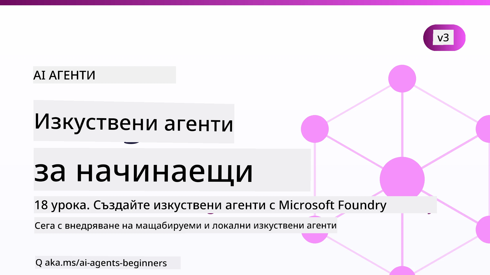

# AI Агенти за начинаещи - Курс



## Курс, който ви учи на всичко необходимо за започване на изграждане на AI агенти

[](https://github.com/microsoft/ai-agents-for-beginners/blob/master/LICENSE?WT.mc_id=academic-105485-koreyst)
[](https://GitHub.com/microsoft/ai-agents-for-beginners/graphs/contributors/?WT.mc_id=academic-105485-koreyst)
[](https://GitHub.com/microsoft/ai-agents-for-beginners/issues/?WT.mc_id=academic-105485-koreyst)
[](https://GitHub.com/microsoft/ai-agents-for-beginners/pulls/?WT.mc_id=academic-105485-koreyst)
[](http://makeapullrequest.com?WT.mc_id=academic-105485-koreyst)

### 🌐 Поддръжка на няколко езика

#### Поддържано чрез GitHub Action (Автоматизирано и винаги актуално)

<!-- CO-OP TRANSLATOR LANGUAGES TABLE START -->
[Arabic](../ar/README.md) | [Bengali](../bn/README.md) | [Bulgarian](./README.md) | [Burmese (Myanmar)](../my/README.md) | [Chinese (Simplified)](../zh-CN/README.md) | [Chinese (Traditional, Hong Kong)](../zh-HK/README.md) | [Chinese (Traditional, Macau)](../zh-MO/README.md) | [Chinese (Traditional, Taiwan)](../zh-TW/README.md) | [Croatian](../hr/README.md) | [Czech](../cs/README.md) | [Danish](../da/README.md) | [Dutch](../nl/README.md) | [Estonian](../et/README.md) | [Finnish](../fi/README.md) | [French](../fr/README.md) | [German](../de/README.md) | [Greek](../el/README.md) | [Hebrew](../he/README.md) | [Hindi](../hi/README.md) | [Hungarian](../hu/README.md) | [Indonesian](../id/README.md) | [Italian](../it/README.md) | [Japanese](../ja/README.md) | [Kannada](../kn/README.md) | [Khmer](../km/README.md) | [Korean](../ko/README.md) | [Lithuanian](../lt/README.md) | [Malay](../ms/README.md) | [Malayalam](../ml/README.md) | [Marathi](../mr/README.md) | [Nepali](../ne/README.md) | [Nigerian Pidgin](../pcm/README.md) | [Norwegian](../no/README.md) | [Persian (Farsi)](../fa/README.md) | [Polish](../pl/README.md) | [Portuguese (Brazil)](../pt-BR/README.md) | [Portuguese (Portugal)](../pt-PT/README.md) | [Punjabi (Gurmukhi)](../pa/README.md) | [Romanian](../ro/README.md) | [Russian](../ru/README.md) | [Serbian (Cyrillic)](../sr/README.md) | [Slovak](../sk/README.md) | [Slovenian](../sl/README.md) | [Spanish](../es/README.md) | [Swahili](../sw/README.md) | [Swedish](../sv/README.md) | [Tagalog (Filipino)](../tl/README.md) | [Tamil](../ta/README.md) | [Telugu](../te/README.md) | [Thai](../th/README.md) | [Turkish](../tr/README.md) | [Ukrainian](../uk/README.md) | [Urdu](../ur/README.md) | [Vietnamese](../vi/README.md)

> **Предпочитате да клонирате локално?**
>
> Това хранилище включва повече от 50 езикови превода, което значително увеличава размера на изтеглянето. За да клонирате без преводи, използвайте sparse checkout:
>
> **Bash / macOS / Linux:**
> ```bash
> git clone --filter=blob:none --sparse https://github.com/microsoft/ai-agents-for-beginners.git
> cd ai-agents-for-beginners
> git sparse-checkout set --no-cone '/*' '!translations' '!translated_images'
> ```
>
> **CMD (Windows):**
> ```cmd
> git clone --filter=blob:none --sparse https://github.com/microsoft/ai-agents-for-beginners.git
> cd ai-agents-for-beginners
> git sparse-checkout set --no-cone "/*" "!translations" "!translated_images"
> ```
>
> Това ви дава всичко необходимо за завършване на курса с много по-бързо изтегляне.
<!-- CO-OP TRANSLATOR LANGUAGES TABLE END -->

**Ако желаете да подкрепим допълнителни езици за превод, те са изброени [тук](https://github.com/Azure/co-op-translator/blob/main/getting_started/supported-languages.md).**

[](https://GitHub.com/microsoft/ai-agents-for-beginners/watchers/?WT.mc_id=academic-105485-koreyst)
[](https://GitHub.com/microsoft/ai-agents-for-beginners/network/?WT.mc_id=academic-105485-koreyst)
[](https://GitHub.com/microsoft/ai-agents-for-beginners/stargazers/?WT.mc_id=academic-105485-koreyst)

[](https://discord.com/invite/ATgtXmAS5D)


## 🌱 Първи стъпки

Този курс съдържа уроци, обхващащи основите на изграждане на AI агенти. Всеки урок разглежда собствена тема, така че започнете откъдето искате!

Има поддръжка на няколко езика за този курс. Вижте [наличните езици тук](#-multi-language-support). 

Ако е първият ви път да изграждате с генеративни AI модели, разгледайте нашия курс [Generative AI For Beginners](https://aka.ms/genai-beginners), който включва 21 урока за изграждане с GenAI.

Не забравяйте да [отметнете с "звезда" (🌟) това хранилище](https://docs.github.com/en/get-started/exploring-projects-on-github/saving-repositories-with-stars?WT.mc_id=academic-105485-koreyst) и да [форкнете това хранилище](https://github.com/microsoft/ai-agents-for-beginners/fork), за да стартирате кода.

### Срещнете други учащи се, получете отговори на въпросите си

Ако се затрудните или имате въпроси относно изграждането на AI агенти, присъединете се към нашия специализиран Discord канал в [Microsoft Foundry Discord](https://aka.ms/ai-agents/discord).

### Какво ви е необходимо

Всеки урок в този курс включва примери с код, които можете да намерите в папката code_samples. Можете да [форкнете това хранилище](https://github.com/microsoft/ai-agents-for-beginners/fork), за да създадете свое копие.  

Примерите с код в тези упражнения използват Microsoft Agent Framework с Microsoft Foundry Agent Service V2:

- [Microsoft Foundry](https://aka.ms/ai-agents-beginners/ai-foundry) - Необходим е Azure акаунт

Този курс използва следните AI агент рамки и услуги от Microsoft:

- [Microsoft Agent Framework (MAF)](https://aka.ms/ai-agents-beginners/agent-framework)
- [Microsoft Foundry Agent Service V2](https://aka.ms/ai-agents-beginners/ai-agent-service)

Някои примери с код поддържат и алтернативни доставчици, съвместими с OpenAI, като [MiniMax](https://platform.minimaxi.com/), който предлага модели с голям контекст (до 204K токена). Вижте [Настройката на курса](./00-course-setup/README.md) за подробности за конфигурацията.

За повече информация относно изпълнението на кода за този курс, посетете [Настройката на курса](./00-course-setup/README.md).

## 🙏 Искате ли да помогнете?

Имате ли предложения или сте открили грешки в правописа или кода? [Подайте проблем](https://github.com/microsoft/ai-agents-for-beginners/issues?WT.mc_id=academic-105485-koreyst) или [Създайте pull request](https://github.com/microsoft/ai-agents-for-beginners/pulls?WT.mc_id=academic-105485-koreyst)


## 📂 Всеки урок включва

- Писмен урок, намиращ се в README и кратко видео
- Примери с Python код, използващи Microsoft Agent Framework с Microsoft Foundry
- Линкове към допълнителни ресурси за продължаване на обучението


## 🗃️ Уроци

| **Урок**                                    | **Текст & Код**                                      | **Видео**                                                  | **Допълнително обучение**                                                            |
|----------------------------------------------|-------------------------------------------------------|-------------------------------------------------------------|---------------------------------------------------------------------------------------|
| Въведение в AI агенти и случаи на използване | [Линк](./01-intro-to-ai-agents/README.md)             | [Видео](https://youtu.be/3zgm60bXmQk?si=z8QygFvYQv-9WtO1)  | [Линк](https://aka.ms/ai-agents-beginners/collection?WT.mc_id=academic-105485-koreyst) |
| Проучване на AI агенти рамки                   | [Линк](./02-explore-agentic-frameworks/README.md)     | [Видео](https://youtu.be/ODwF-EZo_O8?si=Vawth4hzVaHv-u0H)  | [Линк](https://aka.ms/ai-agents-beginners/collection?WT.mc_id=academic-105485-koreyst) |
| Разбиране на AI агенти дизайн модели           | [Линк](./03-agentic-design-patterns/README.md)        | [Видео](https://youtu.be/m9lM8qqoOEA?si=BIzHwzstTPL8o9GF)  | [Линк](https://aka.ms/ai-agents-beginners/collection?WT.mc_id=academic-105485-koreyst) |
| Дизайн модел за използване на инструменти      | [Линк](./04-tool-use/README.md)                       | [Видео](https://youtu.be/vieRiPRx-gI?si=2z6O2Xu2cu_Jz46N)  | [Линк](https://aka.ms/ai-agents-beginners/collection?WT.mc_id=academic-105485-koreyst) |
| Агентен RAG                                    | [Линк](./05-agentic-rag/README.md)                    | [Видео](https://youtu.be/WcjAARvdL7I?si=gKPWsQpKiIlDH9A3)  | [Линк](https://aka.ms/ai-agents-beginners/collection?WT.mc_id=academic-105485-koreyst) |
| Създаване на доверени AI агенти                 | [Линк](./06-building-trustworthy-agents/README.md)    | [Видео](https://youtu.be/iZKkMEGBCUQ?si=jZjpiMnGFOE9L8OK ) | [Линк](https://aka.ms/ai-agents-beginners/collection?WT.mc_id=academic-105485-koreyst) |
| Дизайн модел за планиране                        | [Линк](./07-planning-design/README.md)                | [Видео](https://youtu.be/kPfJ2BrBCMY?si=6SC_iv_E5-mzucnC)  | [Линк](https://aka.ms/ai-agents-beginners/collection?WT.mc_id=academic-105485-koreyst) |
| Дизайн модел за мулти-агенти                     | [Линк](./08-multi-agent/README.md)                    | [Видео](https://youtu.be/V6HpE9hZEx0?si=rMgDhEu7wXo2uo6g)  | [Линк](https://aka.ms/ai-agents-beginners/collection?WT.mc_id=academic-105485-koreyst) |

| Дизайнерски шаблон за метакогниция               | [Връзка](./09-metacognition/README.md)               | [Видео](https://youtu.be/His9R6gw6Ec?si=8gck6vvdSNCt6OcF)  | [Връзка](https://aka.ms/ai-agents-beginners/collection?WT.mc_id=academic-105485-koreyst) |
| AI агенти в продукция                             | [Връзка](./10-ai-agents-production/README.md)        | [Видео](https://youtu.be/l4TP6IyJxmQ?si=31dnhexRo6yLRJDl)  | [Връзка](https://aka.ms/ai-agents-beginners/collection?WT.mc_id=academic-105485-koreyst) |
| Използване на агентни протоколи (MCP, A2A и NLWeb) | [Връзка](./11-agentic-protocols/README.md)           | [Видео](https://youtu.be/X-Dh9R3Opn8)                                 | [Връзка](https://aka.ms/ai-agents-beginners/collection?WT.mc_id=academic-105485-koreyst) |
| Контекстно проектиране за AI агенти               | [Връзка](./12-context-engineering/README.md)         | [Видео](https://youtu.be/F5zqRV7gEag)                                 | [Връзка](https://aka.ms/ai-agents-beginners/collection?WT.mc_id=academic-105485-koreyst) |
| Управление на агентна памет                         | [Връзка](./13-agent-memory/README.md)     |      [Видео](https://youtu.be/QrYbHesIxpw?si=vZkVwKrQ4ieCcIPx)                                                      |                                                                                        |
| Изследване на Microsoft Agent Framework            | [Връзка](./14-microsoft-agent-framework/README.md)                            |                                                            |                                                                                        |
| Създаване на агенти за използване на компютър (CUA) | [Връзка](./15-browser-use/README.md)     |                                                            | [Връзка](https://docs.browser-use.com/examples/templates/playwright-integration)         |
| Разгръщане на мащабируеми агенти                   | [Връзка](./16-deploying-scalable-agents/README.md) |                                                    | [Връзка](https://learn.microsoft.com/azure/ai-foundry/agents/overview)                   |
| Създаване на локални AI агенти                      | [Връзка](./17-creating-local-ai-agents/README.md)  |                                                    | [Връзка](https://learn.microsoft.com/azure/ai-foundry/foundry-local/)                    |
| Осигуряване на AI агенти                            | [Връзка](./18-securing-ai-agents/README.md)  |                                                            | [Връзка](https://aka.ms/ai-agents-beginners/collection?WT.mc_id=academic-105485-koreyst) |

## 🎒 Други курсове

Нашият екип произвежда и други курсове! Вижте:

<!-- CO-OP TRANSLATOR OTHER COURSES START -->
### LangChain
[](https://aka.ms/langchain4j-for-beginners)
[](https://aka.ms/langchainjs-for-beginners?WT.mc_id=m365-94501-dwahlin)
[](https://github.com/microsoft/langchain-for-beginners?WT.mc_id=m365-94501-dwahlin)
---

### Azure / Edge / MCP / Агенти
[](https://github.com/microsoft/AZD-for-beginners?WT.mc_id=academic-105485-koreyst)
[](https://github.com/microsoft/edgeai-for-beginners?WT.mc_id=academic-105485-koreyst)
[](https://github.com/microsoft/mcp-for-beginners?WT.mc_id=academic-105485-koreyst)
[](https://github.com/microsoft/ai-agents-for-beginners?WT.mc_id=academic-105485-koreyst)

---
 
### Поредицата за Генеративен AI
[](https://github.com/microsoft/generative-ai-for-beginners?WT.mc_id=academic-105485-koreyst)
[-9333EA?style=for-the-badge&labelColor=E5E7EB&color=9333EA)](https://github.com/microsoft/Generative-AI-for-beginners-dotnet?WT.mc_id=academic-105485-koreyst)
[-C084FC?style=for-the-badge&labelColor=E5E7EB&color=C084FC)](https://github.com/microsoft/generative-ai-for-beginners-java?WT.mc_id=academic-105485-koreyst)
[-E879F9?style=for-the-badge&labelColor=E5E7EB&color=E879F9)](https://github.com/microsoft/generative-ai-with-javascript?WT.mc_id=academic-105485-koreyst)

---
 
### Основно обучение
[](https://aka.ms/ml-beginners?WT.mc_id=academic-105485-koreyst)
[](https://aka.ms/datascience-beginners?WT.mc_id=academic-105485-koreyst)
[](https://aka.ms/ai-beginners?WT.mc_id=academic-105485-koreyst)
[](https://github.com/microsoft/Security-101?WT.mc_id=academic-96948-sayoung)
[](https://aka.ms/webdev-beginners?WT.mc_id=academic-105485-koreyst)
[](https://aka.ms/iot-beginners?WT.mc_id=academic-105485-koreyst)
[](https://github.com/microsoft/xr-development-for-beginners?WT.mc_id=academic-105485-koreyst)

---
 
### Поредицата Copilot
[](https://aka.ms/GitHubCopilotAI?WT.mc_id=academic-105485-koreyst)
[](https://github.com/microsoft/mastering-github-copilot-for-dotnet-csharp-developers?WT.mc_id=academic-105485-koreyst)
[](https://github.com/microsoft/CopilotAdventures?WT.mc_id=academic-105485-koreyst)
<!-- CO-OP TRANSLATOR OTHER COURSES END -->

## 🌟 Благодарности към общността

Благодарим на [Shivam Goyal](https://www.linkedin.com/in/shivam2003/) за приноса му с важни примерни кодове, демонстриращи Agentic RAG.

## Принос

Този проект приема приноси и предложения. Повечето приноси изискват да се съгласите с
Договор за лицензиране на приноси (CLA), в който заявявате, че имате право и действително предоставяте
правата за използване на вашия принос. За подробности посетете <https://cla.opensource.microsoft.com>.

Когато изпратите заявка за сливане, бот за CLA автоматично ще определи дали трябва да предоставите
CLA и ще отбележи заявката подходящо (например проверка на състоянието, коментар). Просто следвайте инструкциите,
предоставени от бота. Ще трябва да го направите само веднъж за всички хранилища, използващи нашия CLA.

Този проект е приел [Кодекса за поведение за отворен код на Microsoft](https://opensource.microsoft.com/codeofconduct/).
За повече информация вижте [Често задавани въпроси относно Кодекса за поведение](https://opensource.microsoft.com/codeofconduct/faq/) или
се свържете с [opencode@microsoft.com](mailto:opencode@microsoft.com) при допълнителни въпроси или коментари.

## Търговски марки

Този проект може да съдържа търговски марки или лога на проекти, продукти или услуги. Упълномощеното използване на търговски марки или лога на Microsoft
подлежи на и трябва да спазва
[Правилата за търговски марки и бранд на Microsoft](https://www.microsoft.com/legal/intellectualproperty/trademarks/usage/general).
Използването на търговски марки или лога на Microsoft в модифицирани версии на този проект не бива да причинява объркване или да предполага спонсорство от Microsoft.
Каквото и да е използване на търговски марки или лога на трети страни се подчинява на политиките на тези трети страни.

## Получаване на помощ


Ако се затрудните или имате въпроси относно създаването на AI приложения, присъединете се към:

[](https://aka.ms/foundry/discord)

Ако имате обратна връзка за продукта или грешки при създаването, посетете:

[](https://aka.ms/foundry/forum)

---

<!-- CO-OP TRANSLATOR DISCLAIMER START -->
**Отказ от отговорност**:
Този документ е преведен с помощта на AI преводачески услуга [Co-op Translator](https://github.com/Azure/co-op-translator). Въпреки че се стремим към точност, моля имайте предвид, че автоматизираните преводи могат да съдържат грешки или неточности. Оригиналният документ на неговия роден език трябва да се счита за авторитетен източник. За критична информация се препоръчва професионален човешки превод. Ние не носим отговорност за каквито и да е недоразумения или неправилни тълкувания, произтичащи от използването на този превод.
<!-- CO-OP TRANSLATOR DISCLAIMER END -->