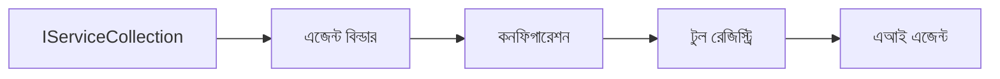

# 🎨 Azure OpenAI (Responses API) (.NET) সহ এজেন্টিক ডিজাইন প্যাটার্ন

## 📋 শেখার লক্ষ্য

এই উদাহরণটি .NET এ Microsoft Agent Framework ব্যবহার করে এবং Azure OpenAI (Responses API) একীভূতকরণের মাধ্যমে বুদ্ধিমান এজেন্ট তৈরি করার জন্য এন্টারপ্রাইজ-গ্রেড ডিজাইন প্যাটার্নগুলি প্রদর্শন করে। আপনি পেশাদার প্যাটার্ন এবং স্থাপত্যগত পন্থা শিখবেন যা এজেন্টকে উৎপাদন-পর্যায়যোগ্য, রক্ষণাবেক্ষণযোগ্য এবং স্কেলযোগ্য করে তোলে।

### এন্টারপ্রাইজ ডিজাইন প্যাটার্ন

- 🏭 **ফ্যাক্টরি প্যাটার্ন**: নির্ভরতা ইঞ্জেকশনের মাধ্যমে মানসম্মত এজেন্ট সৃষ্টিকরণ
- 🔧 **বিল্ডার প্যাটার্ন**: ফ্লুয়েন্ট এজেন্ট কনফিগারেশন এবং সেটআপ
- 🧵 **থ্রেড-সেফ প্যাটার্ন**: সমান্তরাল কথোপকথনের ব্যবস্থাপনা
- 📋 **রিপোজিটরি প্যাটার্ন**: সুগঠিত টুল এবং সক্ষমতা ব্যবস্থাপনা

## 🎯 .NET-নির্দিষ্ট স্থাপত্যগত সুবিধা

### এন্টারপ্রাইজ বৈশিষ্ট্য

- **মজবুত টাইপিং**: কম্পাইল-টাইম যাচাই এবং IntelliSense সমর্থন
- **নির্ভরতা ইঞ্জেকশন**: অন্তর্নির্মিত DI কন্টেইনার ইন্টিগ্রেশন
- **কনফিগারেশন ব্যবস্থাপনা**: IConfiguration এবং অপশন প্যাটার্ন
- **Async/Await**: প্রথম-শ্রেণীর অ্যাসিঙ্ক্রোনাস প্রোগ্রামিং সমর্থন

### উৎপাদন-পর্যায় প্যাটার্নগুলো

- **লগিং ইন্টিগ্রেশন**: ILogger এবং গঠনমূলক লগিং সমর্থন
- **স্বাস্থ্য পরীক্ষা**: অন্তর্নির্মিত মনিটরিং এবং ডায়াগনস্টিক্স
- **কনফিগারেশন যাচাই**: ডেটা অ্যানোটেশনের সাথে মজবুত টাইপিং
- **ত্রুটি পরিচালনা**: কাঠামোবদ্ধ ব্যতিক্রম ব্যবস্থাপনা

## 🔧 প্রযুক্তিগত স্থাপত্য

### মূল .NET উপাদানসমূহ

- **Microsoft.Extensions.AI**: একীভূত AI সেবা বিমূর্ততা
- **Microsoft.Agents.AI**: এন্টারপ্রাইজ এজেন্ট অর্কেস্ট্রেশন ফ্রেমওয়ার্ক
- **Azure OpenAI (Responses API)**: উচ্চ-পদক্ষেপ API ক্লায়েন্ট প্যাটার্ন
- **কনফিগারেশন সিস্টেম**: appsettings.json এবং পরিবেশ ইন্টিগ্রেশন

### ডিজাইন প্যাটার্ন বাস্তবায়ন



## 🏗️ প্রদর্শিত এন্টারপ্রাইজ প্যাটার্ন

### ১. **সৃষ্টিগত প্যাটার্ন**

- **এজেন্ট ফ্যাক্টরি**: সঙ্গতিপূর্ণ কনফিগারেশনসহ কেন্দ্রীভূত এজেন্ট সৃষ্টিকরণ
- **বিল্ডার প্যাটার্ন**: জটিল এজেন্ট কনফিগারেশনের জন্য ফ্লুয়েন্ট API
- **সিঙ্গলটন প্যাটার্ন**: ভাগ করা সম্পদ এবং কনফিগারেশন ব্যবস্থাপনা
- **নির্ভরতা ইঞ্জেকশন**: ডিপ্ল হ্রাস এবং টেস্টেবিলিটি

### ২. **আচরণগত প্যাটার্ন**

- **স্ট্র্যাটেজি প্যাটার্ন**: পরিবর্তনযোগ্য টুল কার্যকর করার কৌশল
- **কমান্ড প্যাটার্ন**: আনডু/রিডো সহ এজেন্ট অপারেশন এনক্যাপসুলেশন
- **অবজারভার প্যাটার্ন**: ইভেন্ট-চালিত এজেন্ট লাইফসাইকেল ব্যবস্থাপনা
- **টেমপ্লেট মেথড**: মানসম্মত এজেন্ট কার্য সম্পাদন কর্মপ্রবাহ

### ৩. **গঠনগত প্যাটার্ন**

- **অ্যাডাপ্টার প্যাটার্ন**: Azure OpenAI (Responses API) ইন্টিগ্রেশন স্তর
- **ডেকোরেটর প্যাটার্ন**: এজেন্ট সক্ষমতার উন্নয়ন
- **ফ্যাসাদ প্যাটার্ন**: সরলীকৃত এজেন্ট ইন্টারঅ্যাকশন ইন্টারফেস
- **প্রক্সি প্যাটার্ন**: কর্মক্ষমতার জন্য অলস লোডিং এবং ক্যাশিং

## 📚 .NET ডিজাইন নীতিমালা

### SOLID নীতিমালা

- **একক দায়িত্ব**: প্রতিটি উপাদানের একটি স্পষ্ট উদ্দেশ্য
- **ওপেন/ক্লোজড**: পরিবর্তন ছাড়াই বিস্তারযোগ্য
- **লিসকভ স্থানাপন্নতা**: ইন্টারফেস-ভিত্তিক টুল বাস্তবায়ন
- **ইন্টারফেস পৃথকীকরণ**: ফোকাসকৃত, মিলিত ইন্টারফেস
- **নির্ভরতা ইনভার্সন**: বাস্তবতার পরিবর্তে বিমূর্ততার উপর নির্ভরশীল

### ক্লিন আর্কিটেকচার

- **ডোমেইন লেয়ার**: প্রধান এজেন্ট এবং টুল বিমূর্ততা
- **অ্যাপ্লিকেশন লেয়ার**: এজেন্ট অর্কেস্ট্রেশন এবং কর্মপ্রবাহ
- **ইনফ্রাস্ট্রাকচার লেয়ার**: Azure OpenAI (Responses API) ইন্টিগ্রেশন এবং বাহ্যিক সেবা
- **প্রেজেন্টেশন লেয়ার**: ব্যবহারকারী ইন্টারঅ্যাকশন এবং প্রতিক্রিয়া বিন্যাস

## 🔒 এন্টারপ্রাইজ বিবেচনা

### সিকিউরিটি

- **ক্রেডেনশিয়াল ব্যবস্থাপনা**: IConfiguration এর সাহায্যে নিরাপদ API কী পরিচালনা
- **ইনপুট যাচাই**: মজবুত টাইপিং এবং ডেটা অ্যানোটেশন যাচাই
- **আউটপুট স্যানিটাইজেশন**: নিরাপদ প্রতিক্রিয়া প্রক্রিয়াকরণ এবং ফিল্টারিং
- **অডিট লগিং**: ব্যাপক অপারেশন ট্র্যাকিং

### কর্মক্ষমতা

- **অ্যাসিঙ্ক প্যাটার্ন**: অবরোধহীন I/O অপারেশন
- **কনেকশন পুলিং**: দক্ষ HTTP ক্লায়েন্ট ব্যবস্থাপনা
- **ক্যাচিং**: উন্নত কর্মক্ষমতার জন্য প্রতিক্রিয়া ক্যাশিং
- **সম্পদ ব্যবস্থাপনা**: উপযুক্ত ব্যবহার ও পরিস্কারের প্যাটার্ন

### স্কেলযোগ্যতা

- **থ্রেড সেফটি**: সমান্তরাল এজেন্ট কার্য সম্পাদনের সমর্থন
- **সম্পদ পুলিং**: দক্ষ সম্পদ ব্যবহার
- **লোড ম্যানেজমেন্ট**: রেট সীমাবদ্ধতা এবং ব্যাকপ্রেশার পরিচালনা
- **মনিটরিং**: কর্মক্ষমতা পরিমাপ এবং স্বাস্থ্য পরীক্ষা

## 🚀 উৎপাদন স্থাপন

- **কনফিগারেশন ব্যবস্থাপনা**: পরিবেশ-নির্দিষ্ট সেটিংস
- **লগিং কৌশল**: সম্পর্ক আইডি সহ গঠনমূলক লগিং
- **ত্রুটি পরিচালনা**: সঠিক পুনরুদ্ধারের সঙ্গে গ্লোবাল এক্সসেপশন হ্যান্ডলিং
- **মনিটরিং**: অ্যাপ্লিকেশন ইনসাইটস এবং কর্মক্ষমতা কাউন্টার
- **পরীক্ষা**: ইউনিট টেস্ট, ইন্টিগ্রেশন টেস্ট, এবং লোড টেস্টিং প্যাটার্ন

.NET ব্যবহার করে এন্টারপ্রাইজ-গ্রেড বুদ্ধিমান এজেন্ট তৈরি করতে প্রস্তুত? চলুন কিছু শক্তিশালী স্থাপত্য তৈরি করি! 🏢✨

## 🚀 শুরু করা

### পূর্বশর্ত

- [.NET 10 SDK](https://dotnet.microsoft.com/download/dotnet/10.0) বা তার উপরে
- একটি [Azure সাবস্ক্রিপশন](https://azure.microsoft.com/free/) যার সাথে Azure OpenAI রিসোর্স এবং মডেল ডিপ্লয়মেন্ট আছে
- [Azure CLI](https://learn.microsoft.com/cli/azure/install-azure-cli) — `az login` দিয়ে সাইন ইন করুন

### প্রয়োজনীয় পরিবেশ ভেরিয়েবল

```bash
# zsh/bash
export AZURE_OPENAI_ENDPOINT=https://<your-resource>.openai.azure.com
export AZURE_OPENAI_DEPLOYMENT=gpt-5-mini
# তারপর সাইন ইন করুন যাতে AzureCliCredential একটি টোকেন পেতে পারে
az login
```

```powershell
# পাওয়ারশেল
$env:AZURE_OPENAI_ENDPOINT = "https://<your-resource>.openai.azure.com"
$env:AZURE_OPENAI_DEPLOYMENT = "gpt-5-mini"
# তারপর সাইন ইন করুন যাতে AzureCliCredential একটি টোকেন পেতে পারে
az login
```

### নমুনা কোড

কোড উদাহরণ চালাতে,

```bash
# জেডশ/ব্যাশ
chmod +x ./03-dotnet-agent-framework.cs
./03-dotnet-agent-framework.cs
```

অথবা dotnet CLI ব্যবহার করুন:

```bash
dotnet run ./03-dotnet-agent-framework.cs
```

সম্পূর্ণ কোডের জন্য দেখুন [`03-dotnet-agent-framework.cs`](../../../../03-agentic-design-patterns/code_samples/03-dotnet-agent-framework.cs)।

```csharp
#!/usr/bin/dotnet run

#:package Microsoft.Extensions.AI@10.*
#:package Microsoft.Agents.AI.OpenAI@1.*-*
#:package Azure.AI.OpenAI@2.1.0
#:package Azure.Identity@1.13.1

using System.ComponentModel;

using Microsoft.Agents.AI;
using Microsoft.Extensions.AI;

using Azure.AI.OpenAI;
using Azure.Identity;

// Tool Function: Random Destination Generator
// This static method will be available to the agent as a callable tool
// The [Description] attribute helps the AI understand when to use this function
// This demonstrates how to create custom tools for AI agents
[Description("Provides a random vacation destination.")]
static string GetRandomDestination()
{
    // List of popular vacation destinations around the world
    // The agent will randomly select from these options
    var destinations = new List<string>
    {
        "Paris, France",
        "Tokyo, Japan",
        "New York City, USA",
        "Sydney, Australia",
        "Rome, Italy",
        "Barcelona, Spain",
        "Cape Town, South Africa",
        "Rio de Janeiro, Brazil",
        "Bangkok, Thailand",
        "Vancouver, Canada"
    };

    // Generate random index and return selected destination
    // Uses System.Random for simple random selection
    var random = new Random();
    int index = random.Next(destinations.Count);
    return destinations[index];
}

// Azure OpenAI with the Responses API (stable v1 endpoint). Sign in with `az login`.
var azureEndpoint = Environment.GetEnvironmentVariable("AZURE_OPENAI_ENDPOINT")
    ?? throw new InvalidOperationException("AZURE_OPENAI_ENDPOINT is not set.");
var deployment = Environment.GetEnvironmentVariable("AZURE_OPENAI_DEPLOYMENT") ?? "gpt-5-mini";

var azureClient = new AzureOpenAIClient(new Uri(azureEndpoint), new AzureCliCredential());

// Define Agent Identity and Comprehensive Instructions
// Agent name for identification and logging purposes
var AGENT_NAME = "TravelAgent";

// Detailed instructions that define the agent's personality, capabilities, and behavior
// This system prompt shapes how the agent responds and interacts with users
var AGENT_INSTRUCTIONS = """
You are a helpful AI Agent that can help plan vacations for customers.

Important: When users specify a destination, always plan for that location. Only suggest random destinations when the user hasn't specified a preference.

When the conversation begins, introduce yourself with this message:
"Hello! I'm your TravelAgent assistant. I can help plan vacations and suggest interesting destinations for you. Here are some things you can ask me:
1. Plan a day trip to a specific location
2. Suggest a random vacation destination
3. Find destinations with specific features (beaches, mountains, historical sites, etc.)
4. Plan an alternative trip if you don't like my first suggestion

What kind of trip would you like me to help you plan today?"

Always prioritize user preferences. If they mention a specific destination like "Bali" or "Paris," focus your planning on that location rather than suggesting alternatives.
""";

// Create AI Agent with Advanced Travel Planning Capabilities
// Get the Responses client for the deployment and create the AI agent
// Configure agent with name, detailed instructions, and available tools
// This demonstrates the .NET agent creation pattern with full configuration
AIAgent agent = azureClient
    .GetChatClient(deployment)
    .AsAIAgent(
        name: AGENT_NAME,
        instructions: AGENT_INSTRUCTIONS,
        tools: [AIFunctionFactory.Create(GetRandomDestination)]
    );

// Create New Conversation Session for Context Management
// Initialize a new conversation session to maintain context across multiple interactions
// Sessions enable the agent to remember previous exchanges and maintain conversational state
// This is essential for multi-turn conversations and contextual understanding
var session = await agent.CreateSessionAsync();

// Execute Agent: First Travel Planning Request
// Run the agent with an initial request that will likely trigger the random destination tool
// The agent will analyze the request, use the GetRandomDestination tool, and create an itinerary
// Using the session parameter maintains conversation context for subsequent interactions
await foreach (var update in agent.RunStreamingAsync("Plan me a day trip", session))
{
    await Task.Delay(10);
    Console.Write(update);
}

Console.WriteLine();

// Execute Agent: Follow-up Request with Context Awareness
// Demonstrate contextual conversation by referencing the previous response
// The agent remembers the previous destination suggestion and will provide an alternative
// This showcases the power of conversation sessions and contextual understanding in .NET agents
await foreach (var update in agent.RunStreamingAsync("I don't like that destination. Plan me another vacation.", session))
{
    await Task.Delay(10);
    Console.Write(update);
}
```

---

<!-- CO-OP TRANSLATOR DISCLAIMER START -->
**অস্বীকৃতি**:
এই নথিটি AI অনুবাদ পরিষেবা [Co-op Translator](https://github.com/Azure/co-op-translator) ব্যবহার করে অনূদিত হয়েছে। যদিও আমরা শুদ্ধতার জন্য চেষ্টা করি, অনুগ্রহ করে মনে রাখবেন যে স্বয়ংক্রিয় অনুবাদে ত্রুটি বা অসঙ্গতি থাকতে পারে। মূল নথিটি তার স্বভাষায় কর্তৃত্বপূর্ণ উৎস হিসেবে বিবেচিত হওয়া উচিত। গুরুত্বপূর্ণ তথ্যের জন্য পেশাদার মানব অনুবাদ সুপারিশ করা হয়। এই অনুবাদের ব্যবহারে প্রয়োজনীয় ভুল বোঝাবুঝি বা ভুল ব্যাখ্যার জন্য আমরা দায়বদ্ধ নই।
<!-- CO-OP TRANSLATOR DISCLAIMER END -->