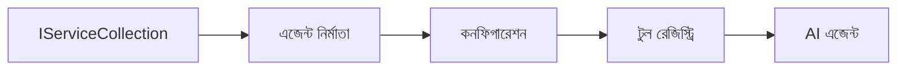

# 🎨 Azure OpenAI (Responses API) এর সাথে Agentic ডিজাইন প্যাটার্নগুলি (.NET)

## 📋 শেখার উদ্দেশ্য

এই উদাহরণটি .NET-এ Microsoft Agent Framework ব্যবহার করে Azure OpenAI (Responses API) ইন্টিগ্রেশনের মাধ্যমে বুদ্ধিমান এজেন্ট তৈরি করার জন্য এন্টারপ্রাইজ-গ্রেড ডিজাইন প্যাটার্নগুলি প্রদর্শন করে। আপনি পেশাদার প্যাটার্ন এবং স্থাপত্যগত পদ্ধতিগুলি শিখবেন যা এজেন্টদের প্রোডাকশন-রেডি, মেইনটেইনেবল এবং স্কেলএবল করে।

### এন্টারপ্রাইজ ডিজাইন প্যাটার্নগুলি

- 🏭 **ফ্যাক্টরি প্যাটার্ন**: ডিপেনডেন্সি ইনজেকশনের সাথে স্ট্যান্ডার্ডাইজড এজেন্ট নির্মাণ
- 🔧 **বিল্ডার প্যাটার্ন**: ফ্লুয়েন্ট এজেন্ট কনফিগারেশন এবং সেটআপ
- 🧵 **থ্রেড-সেফ প্যাটার্নগুলি**: একযোগে কথোপকথন পরিচালনা
- 📋 **রিপোজিটরি প্যাটার্ন**: সংগঠিত টুল এবং সক্ষমতা ব্যবস্থাপনা

## 🎯 .NET-বিশেষ স্থাপত্যগত সুবিধাসমূহ

### এন্টারপ্রাইজ বৈশিষ্ট্যসমূহ

- **স্ট্রং টাইপিং**: কম্পাইল-টাইম ভ্যালিডেশন এবং IntelliSense সমর্থন
- **ডিপেনডেন্সি ইনজেকশন**: বিল্ট-ইন DI কনটেইনার ইন্টিগ্রেশন
- **কনফিগারেশন ম্যানেজমেন্ট**: IConfiguration এবং Options প্যাটার্ন
- **Async/Await**: প্রথম-শ্রেণীর অ্যাসিঙ্ক্রোনাস প্রোগ্রামিং সমর্থন

### প্রোডাকশন-রেডি প্যাটার্নগুলি

- **লগিং ইন্টিগ্রেশন**: ILogger এবং স্ট্রাকচার্ড লগিং সমর্থন
- **হেলথ চেকস**: বিল্ট-ইন মনিটরিং এবং ডায়াগনস্টিক্স
- **কনফিগারেশন ভ্যালিডেশন**: ডেটা অ্যানোটেশনের সাথে স্ট্রং টাইপিং
- **এরর হ্যান্ডলিং**: স্ট্রাকচার্ড এক্সেপশন ম্যানেজমেন্ট

## 🔧 টেকনিক্যাল আর্কিটেকচার

### মূল .NET কম্পোনেন্টসমূহ

- **Microsoft.Extensions.AI**: এককৃত AI সার্ভিস বিমূর্ততা
- **Microsoft.Agents.AI**: এন্টারপ্রাইজ এজেন্ট অর্কেস্ট্রেশন ফ্রেমওয়ার্ক
- **Azure OpenAI (Responses API)**: উচ্চ-ক্ষমতাসম্পন্ন API ক্লায়েন্ট প্যাটার্নগুলি
- **কনফিগারেশন সিস্টেম**: appsettings.json এবং পরিবেশ ইন্টিগ্রেশন

### ডিজাইন প্যাটার্ন ইমপ্লিমেন্টেশন



## 🏗️ প্রদর্শিত এন্টারপ্রাইজ প্যাটার্নসমূহ

### 1. **সৃষ্টিমূলক প্যাটার্ন**

- **এজেন্ট ফ্যাক্টরি**: কেন্দ্রীভূত এজেন্ট নির্মাণ সঙ্গতিপূর্ণ কনফিগারেশনের সাথে
- **বিল্ডার প্যাটার্ন**: জটিল এজেন্ট কনফিগারেশনের জন্য ফ্লুয়েন্ট API
- **সিঙ্গলটন প্যাটার্ন**: শেয়ারকৃত রিসোর্স এবং কনফিগারেশন ম্যানেজমেন্ট
- **ডিপেনডেন্সি ইনজেকশন**: নমনীয় coupling এবং পরীক্ষাযোগ্যতা

### 2. **ব্যবহারকৃত প্যাটার্ন**

- **স্ট্র্যাটেজি প্যাটার্ন**: প্রতিস্থাপনযোগ্য টুল এক্সিকিউশন কৌশল
- **কমান্ড প্যাটার্ন**: আংশিকভাবে মোড়ককৃত এজেন্ট অপারেশন সাধারণ undo/redo সহ
- **অবজারভার প্যাটার্ন**: ইভেন্ট-চালিত এজেন্ট লাইফসাইকেল ম্যানেজমেন্ট
- **টেমপ্লেট মেথড**: স্ট্যান্ডার্ডাইজড এজেন্ট এক্সিকিউশন ওয়ার্কফ্লোসমূহ

### 3. **স্ট্রাকচারাল প্যাটার্ন**

- **অ্যাডাপ্টার প্যাটার্ন**: Azure OpenAI (Responses API) ইন্টিগ্রেশন লেয়ার
- **ডেকোরেটর প্যাটার্ন**: এজেন্ট সক্ষমতা বৃদ্ধিকরণ
- **ফাসাদ প্যাটার্ন**: সরলীকৃত এজেন্ট ইন্টারঅ্যাকশন ইন্টারফেসসমূহ
- **প্রক্সি প্যাটার্ন**: পারফরম্যান্সের জন্য অলস লোডিং এবং ক্যাশিং

## 📚 .NET ডিজাইন নীতিমালা

### SOLID নীতিমালা

- **সিঙ্গল রেস্পন্সিবিলিটি**: প্রতিটি কম্পোনেন্টের একটি স্পষ্ট উদ্দেশ্য থাকে
- **ওপেন/ক্লোজড**: পরিবর্তন ছাড়াই বর্ধনযোগ্য
- **লিসকভ সাবস্টিটিউশন**: ইন্টারফেস-ভিত্তিক টুল ইমপ্লিমেন্টেশন
- **ইন্টারফেস সেগ্রিগেশন**: ফোকাসড, সঙ্গতিপূর্ণ ইন্টারফেসসমূহ
- **ডিপেনডেন্সি ইনভার্শন**: বিমূর্ততার উপর নির্ভরশীল, বাস্তবতার নয়

### পরিষ্কার স্থাপত্য

- **ডোমেন লেয়ার**: প্রধান এজেন্ট এবং টুল বিমূর্ততা
- **অ্যাপ্লিকেশন লেয়ার**: এজেন্ট অর্কেস্ট্রেশন এবং ওয়ার্কফ্লোসমূহ
- **ইনফ্রাস্ট্রাকচার লেয়ার**: Azure OpenAI (Responses API) ইন্টিগ্রেশন এবং বাহ্যিক সার্ভিসসমূহ
- **প্রেজেন্টেশন লেয়ার**: ব্যবহারকারী ইন্টারঅ্যাকশন এবং রেসপন্স ফরম্যাটিং

## 🔒 এন্টারপ্রাইজ বিবেচনাসমূহ

### নিরাপত্তা

- **ক্রেডেনশিয়াল ম্যানেজমেন্ট**: IConfiguration সহ নিরাপদ API কী পরিচালনা
- **ইনপুট ভ্যালিডেশন**: স্ট্রং টাইপিং এবং ডেটা অ্যানোটেশন ভ্যালিডেশন
- **আউটপুট স্যানিটাইজেশন**: নিরাপদ রেসপন্স প্রক্রিয়াকরণ এবং ফিল্টারিং
- **অডিট লগিং**: ব্যাপক অপারেশন ট্র্যাকিং

### কর্মক্ষমতা

- **অ্যাসিঙ্ক প্যাটার্ন**: নন-ব্লকিং I/O অপারেশন
- **কানেকশন পুলিং**: দক্ষ HTTP ক্লায়েন্ট ব্যবস্থাপনা
- **ক্যাশিং**: উন্নত পারফরম্যান্সের জন্য রেসপন্স ক্যাশিং
- **রিসোর্স ম্যানেজমেন্ট**: যথাযথ ডিসপোজাল এবং ক্লিনআপ প্যাটার্নসমূহ

### স্কেলএবিলিটি

- **থ্রেড সেফটি**: সমান্তরাল এজেন্ট এক্সিকিউশন সমর্থন
- **রিসোর্স পুলিং**: দক্ষ রিসোর্স ব্যবহার
- **লোড ম্যানেজমেন্ট**: রেট লিমিটিং এবং ব্যাকপ্রেশার হ্যান্ডলিং
- **মনিটরিং**: পারফরম্যান্স মেট্রিক্স এবং হেলথ চেকস

## 🚀 প্রোডাকশন ডিপ্লয়মেন্ট

- **কনফিগারেশন ম্যানেজমেন্ট**: পরিবেশ-নির্দিষ্ট সেটিংস
- **লগিং স্ট্রাটেজি**: করিলেশন আইডি সহ স্ট্রাকচার্ড লগিং
- **এরর হ্যান্ডলিং**: উপযুক্ত পুনরুদ্ধারের সাথে গ্লোবাল এক্সেপশন হ্যান্ডলিং
- **মনিটরিং**: অ্যাপ্লিকেশন ইনসাইটস এবং পারফরম্যান্স কাউন্টারসমূহ
- **টেস্টিং**: ইউনিট টেস্ট, ইন্টিগ্রেশন টেস্ট এবং লোড টেস্টিং প্যাটার্ন

.NET দিয়ে এন্টারপ্রাইজ-গ্রেড বুদ্ধিমান এজেন্ট তৈরি করতে প্রস্তুত? চলুন কিছু দৃঢ় স্থাপত্য করি! 🏢✨

## 🚀 শুরু করা

### প্রয়োজনীয়তাসমূহ

- [.NET 10 SDK](https://dotnet.microsoft.com/download/dotnet/10.0) বা তার উপরে
- [Azure সাবস্ক্রিপশন](https://azure.microsoft.com/free/) যার সঙ্গে Azure OpenAI রিসোর্স এবং একটি মডেল ডিপ্লয়মেন্ট রয়েছে
- [Azure CLI](https://learn.microsoft.com/cli/azure/install-azure-cli) — `az login` দিয়ে সাইন ইন করুন

### প্রয়োজনীয় পরিবেশ ভেরিয়েবলসমূহ

```bash
# zsh/bash
export AZURE_OPENAI_ENDPOINT=https://<your-resource>.openai.azure.com
export AZURE_OPENAI_DEPLOYMENT=gpt-4.1-mini
# তারপর সাইন ইন করুন যাতে AzureCliCredential একটি টোকেন পেতে পারে
az login
```

```powershell
# পাওয়ারশেল
$env:AZURE_OPENAI_ENDPOINT = "https://<your-resource>.openai.azure.com"
$env:AZURE_OPENAI_DEPLOYMENT = "gpt-4.1-mini"
# তারপর সাইন ইন করুন যাতে AzureCliCredential একটি টোকেন পেতে পারে
az login
```

### নমুনা কোড

উদাহরণ কোড চালানোর জন্য,

```bash
# zsh/bash
chmod +x ./03-dotnet-agent-framework.cs
./03-dotnet-agent-framework.cs
```

অথবা dotnet CLI ব্যবহার করে:

```bash
dotnet run ./03-dotnet-agent-framework.cs
```

পূর্ণ কোডের জন্য দেখুন [`03-dotnet-agent-framework.cs`](../../../../03-agentic-design-patterns/code_samples/03-dotnet-agent-framework.cs)।

```csharp
#!/usr/bin/dotnet run

#:package Microsoft.Extensions.AI@10.*
#:package Microsoft.Agents.AI.OpenAI@1.*-*
#:package Azure.AI.OpenAI@2.1.0
#:package Azure.Identity@1.13.1

using System.ComponentModel;

using Microsoft.Agents.AI;
using Microsoft.Extensions.AI;

using Azure.AI.OpenAI;
using Azure.Identity;

// Tool Function: Random Destination Generator
// This static method will be available to the agent as a callable tool
// The [Description] attribute helps the AI understand when to use this function
// This demonstrates how to create custom tools for AI agents
[Description("Provides a random vacation destination.")]
static string GetRandomDestination()
{
    // List of popular vacation destinations around the world
    // The agent will randomly select from these options
    var destinations = new List<string>
    {
        "Paris, France",
        "Tokyo, Japan",
        "New York City, USA",
        "Sydney, Australia",
        "Rome, Italy",
        "Barcelona, Spain",
        "Cape Town, South Africa",
        "Rio de Janeiro, Brazil",
        "Bangkok, Thailand",
        "Vancouver, Canada"
    };

    // Generate random index and return selected destination
    // Uses System.Random for simple random selection
    var random = new Random();
    int index = random.Next(destinations.Count);
    return destinations[index];
}

// Azure OpenAI with the Responses API (stable v1 endpoint). Sign in with `az login`.
var azureEndpoint = Environment.GetEnvironmentVariable("AZURE_OPENAI_ENDPOINT")
    ?? throw new InvalidOperationException("AZURE_OPENAI_ENDPOINT is not set.");
var deployment = Environment.GetEnvironmentVariable("AZURE_OPENAI_DEPLOYMENT") ?? "gpt-4.1-mini";

var azureClient = new AzureOpenAIClient(new Uri(azureEndpoint), new AzureCliCredential());

// Define Agent Identity and Comprehensive Instructions
// Agent name for identification and logging purposes
var AGENT_NAME = "TravelAgent";

// Detailed instructions that define the agent's personality, capabilities, and behavior
// This system prompt shapes how the agent responds and interacts with users
var AGENT_INSTRUCTIONS = """
You are a helpful AI Agent that can help plan vacations for customers.

Important: When users specify a destination, always plan for that location. Only suggest random destinations when the user hasn't specified a preference.

When the conversation begins, introduce yourself with this message:
"Hello! I'm your TravelAgent assistant. I can help plan vacations and suggest interesting destinations for you. Here are some things you can ask me:
1. Plan a day trip to a specific location
2. Suggest a random vacation destination
3. Find destinations with specific features (beaches, mountains, historical sites, etc.)
4. Plan an alternative trip if you don't like my first suggestion

What kind of trip would you like me to help you plan today?"

Always prioritize user preferences. If they mention a specific destination like "Bali" or "Paris," focus your planning on that location rather than suggesting alternatives.
""";

// Create AI Agent with Advanced Travel Planning Capabilities
// Get the Responses client for the deployment and create the AI agent
// Configure agent with name, detailed instructions, and available tools
// This demonstrates the .NET agent creation pattern with full configuration
AIAgent agent = azureClient
    .GetChatClient(deployment)
    .AsAIAgent(
        name: AGENT_NAME,
        instructions: AGENT_INSTRUCTIONS,
        tools: [AIFunctionFactory.Create(GetRandomDestination)]
    );

// Create New Conversation Session for Context Management
// Initialize a new conversation session to maintain context across multiple interactions
// Sessions enable the agent to remember previous exchanges and maintain conversational state
// This is essential for multi-turn conversations and contextual understanding
var session = await agent.CreateSessionAsync();

// Execute Agent: First Travel Planning Request
// Run the agent with an initial request that will likely trigger the random destination tool
// The agent will analyze the request, use the GetRandomDestination tool, and create an itinerary
// Using the session parameter maintains conversation context for subsequent interactions
await foreach (var update in agent.RunStreamingAsync("Plan me a day trip", session))
{
    await Task.Delay(10);
    Console.Write(update);
}

Console.WriteLine();

// Execute Agent: Follow-up Request with Context Awareness
// Demonstrate contextual conversation by referencing the previous response
// The agent remembers the previous destination suggestion and will provide an alternative
// This showcases the power of conversation sessions and contextual understanding in .NET agents
await foreach (var update in agent.RunStreamingAsync("I don't like that destination. Plan me another vacation.", session))
{
    await Task.Delay(10);
    Console.Write(update);
}
```

---

<!-- CO-OP TRANSLATOR DISCLAIMER START -->
**অস্বীকৃতি**:
এই নথিটি AI অনুবাদ পরিষেবা [Co-op Translator](https://github.com/Azure/co-op-translator) ব্যবহার করে অনূদিত হয়েছে। যদিও আমরা শুদ্ধতার জন্য চেষ্টা করি, অনুগ্রহ করে মনে রাখবেন যে স্বয়ংক্রিয় অনুবাদে ত্রুটি বা অসঙ্গতি থাকতে পারে। মূল নথিটি তার স্বভাষায় কর্তৃত্বপূর্ণ উৎস হিসেবে বিবেচিত হওয়া উচিত। গুরুত্বপূর্ণ তথ্যের জন্য পেশাদার মানব অনুবাদ সুপারিশ করা হয়। এই অনুবাদের ব্যবহারে প্রয়োজনীয় ভুল বোঝাবুঝি বা ভুল ব্যাখ্যার জন্য আমরা দায়বদ্ধ নই।
<!-- CO-OP TRANSLATOR DISCLAIMER END -->