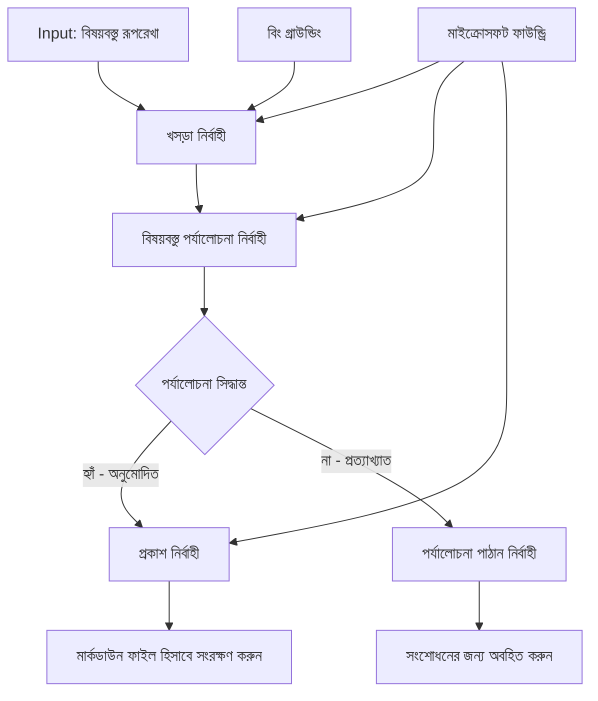

# 🔀 মাইক্রোসফ্ট ফাউন্ড্রি (.NET) সহ শর্তাধীন এজেন্ট কর্মপ্রবাহ

## 📋 বুদ্ধিমত্তা ভিত্তিক সিদ্ধান্ত-ভিত্তিক কর্মপ্রবাহ টিউটোরিয়াল

এই নোটবুকটি মাইক্রোসফ্ট ফাউন্ড্রি এবং মাইক্রোসফ্ট এজেন্ট ফ্রেমওয়ার্ক ফর .NET ব্যবহার করে **শর্তাধীন কর্মপ্রবাহ প্যাটার্নগুলি** প্রদর্শন করে। আপনি শিখবেন কীভাবে জটিল, সিদ্ধান্ত-চালিত কর্মপ্রবাহগুলি নির্মাণ করতে হয় যা বুদ্ধিমত্তার সাথে AI বিশ্লেষণ, ব্যবসায়িক নিয়ম এবং গতিশীল শর্তাবলীর উপর ভিত্তি করে প্রক্রিয়াকরণ সঠিকভাবে রুট করে এন্টারপ্রাইজ-গ্রেড অটোমেশন জন্য।

## 🎯 শেখার উদ্দেশ্যসমূহ

### 🧠 **বুদ্ধিমান সিদ্ধান্ত আর্কিটেকচার**
- **শর্তাধীন লজিক বাস্তবায়ন**: একাধিক শাখার সাথে জটিল সিদ্ধান্ত গাছ তৈরি করা
- **AI-চালিত রাউটিং**: মাইক্রোসফ্ট ফাউন্ড্রি মডেলগুলি ব্যবহার করে বুদ্ধিমত্তা সম্পন্ন রাউটিং সিদ্ধান্ত গ্রহণ
- **গতিশীল কর্মপ্রবাহ মানিয়ে নেওয়া**: রানটাইম বিশ্লেষণ এবং শর্তের উপর ভিত্তি করে কর্মপ্রবাহ আচরণ পরিবর্তন করা
- **এন্টারপ্রাইজ নিয়ম ইন্টিগ্রেশন**: ব্যবসায়িক লজিক এবং সম্মতি নিয়মাবলী কর্মপ্রবাহে অন্তর্ভুক্ত করা

### 🔀 **উন্নত শর্তাধীন প্যাটার্নসমূহ**
- **বহুমুখী সিদ্ধান্ত গ্রহণ**: রাউটিং সিদ্ধান্তের জন্য একাধিক ফ্যাক্টর মূল্যায়ন
- **পরিপ্রেক্ষিত-সচেতন প্রক্রিয়াকরণ**: সংগৃহীত কর্মপ্রবাহ প্রসঙ্গ এবং ইতিহাসের উপর ভিত্তি করে সিদ্ধান্ত নেওয়া
- **সাংগঠনিক কর্মপ্রবাহ পরিবর্তন**: বাস্তব-সময়ে শর্তের উপর ভিত্তি করে প্রক্রিয়াকরণ পথ স্বয়ংক্রিয় পরিবর্তন
- **নিয়ম ইঞ্জিন ইন্টিগ্রেশন**: কর্মপ্রবাহে জটিল ব্যবসায়িক নিয়ম ইঞ্জিন বাস্তবায়ন

### 🏢 **এন্টারপ্রাইজ শর্তাধীন অ্যাপ্লিকেশনসমূহ**
- **ডকুমেন্ট শ্রেণীবিভাগ ও রাউটিং**: স্বয়ংক্রিয়ভাবে ডকুমেন্ট শ্রেণীবিভাগ ও উপযুক্ত কর্মপ্রবাহে রাউট করা
- **কাস্টমার সার্ভিস ট্রায়াজ**: গ্রাহক অনুসন্ধানগুলোকে বিশেষায়িত হ্যান্ডলিং টিমে বুদ্ধিমান রাউটিং
- **সম্মতি ও ঝুঁকি প্রক্রিয়াকরণ**: ঝুঁকি মূল্যায়নের ভিত্তিতে বিভিন্ন যাচাইকরণ ও পর্যালোচনা প্রক্রিয়া প্রয়োগ
- **গুণগত মান নিশ্চয়তা কর্মপ্রবাহ**: গুণগত মান সূচকের উপর ভিত্তি করে উপযুক্ত পর্যালোচনা প্রক্রিয়ায় বিষয়বস্তু রাউট করা

## ⚙️ প্রয়োজনীয়তা ও সজ্জা

### 📦 **প্রয়োজনীয় NuGet প্যাকেজসমূহ**

শর্তাধীন কর্মপ্রবাহ প্রক্রিয়াকরণের জন্য উন্নত প্যাকেজসমূহ:

```xml
<!-- Core AI Framework -->
<PackageReference Include="Microsoft.Extensions.AI" Version="9.9.0" />

<!-- Azure AI Agents with Persistent State -->
<PackageReference Include="Azure.AI.Agents.Persistent" Version="1.2.0-beta.5" />

<!-- Azure Identity and Utilities -->
<PackageReference Include="Azure.Identity" Version="1.15.0" />
<PackageReference Include="System.Linq.Async" Version="6.0.3" />
<PackageReference Include="DotNetEnv" Version="3.1.1" />

<!-- Local Workflow Framework References -->
<!-- Microsoft.Agents.Workflows.dll - Advanced workflow orchestration -->
<!-- Microsoft.Agents.AI.AzureAI.dll - Microsoft Foundry integration -->
<!-- Microsoft.Agents.AI.dll - Core agent abstractions -->
```

### 🔑 **মাইক্রোসফ্ট ফাউন্ড্রি কনফিগারেশন**

**প্রয়োজনীয় Azure রিসোর্সসমূহ:**
- শর্তাধীন প্রক্রিয়াকরণ মডেল সহ মাইক্রোসফ্ট ফাউন্ড্রি ওয়ার্কস্পেস
- প্রাসঙ্গিক কম্পিউট কোটা এবং অনুমতিসহ Azure সাবস্ক্রিপশন
- সিদ্ধান্ত গ্রহণ এবং বিষয়বস্তু বিশ্লেষণের জন্য স্থাপিত AI মডেলসমূহ
- (ঐচ্ছিক) গ্রাউন্ডিং সক্ষমতার জন্য Bing সার্চ API সংযোগ

**পরিবেশ কনফিগারেশন (.env ফাইল):**
```env
# Microsoft Foundry Configuration
AZURE_AI_PROJECT_ENDPOINT=https://your-project.cognitiveservices.azure.com/
BING_CONNECTION_ID=your-bing-connection-id
```

**প্রমাণীকরণ সেটআপ:**
```csharp
// Azure CLI or Managed Identity authentication
using Azure.Identity;
var credential = new AzureCliCredential();

// Load environment configuration
DotNetEnv.Env.Load("../../../.env");
```

### 🏗️ **শর্তাধীন কর্মপ্রবাহ আর্কিটেকচার**



**মূল উপাদানসমূহ:**
- **ড্রাফ্ট এক্সিকিউটর**: খসড়া তৈরির জন্য ওটলাইন থেকে কনটেন্ট তৈরিকারী AI এজেন্ট
- **কনটেন্ট রিভিউ এক্সিকিউটর**: খসড়ার গুণগতমান এবং সম্মতি মূল্যায়নকারী AI এজেন্ট
- **শর্তাধীন রাউটিং**: রিভিউ ফলাফলের ভিত্তিতে রাউটিং সিদ্ধান্ত গ্রহণের লজিক
- **প্রকাশ/পর্যালোচনা পথ**: অনুমোদিত ও প্রত্যাখ্যাত বিষয়বস্তুর জন্য পৃথক প্রক্রিয়াকরণ পথ
- **স্টেট ম্যানেজমেন্ট**: কর্মপ্রবাহ জুড়ে বিষয়বস্তু ও পর্যালোচনা প্রসঙ্গ রক্ষা করা

## 🎨 **শর্তাধীন কর্মপ্রবাহ ডিজাইন প্যাটার্নসমূহ**

### 📋 **গুণগত মান গেট সহ বিষয়বস্তু উৎপাদন**
```
Outline → Draft Creation → Quality Review → {Approve: Publish | Reject: Revise}
```

### 🎯 **ঝুঁকি নির্ভর ডকুমেন্ট প্রক্রিয়াকরণ**
```
Document → Risk Assessment → {Low: Standard | High: Enhanced Review}
```

### 🔍 **বুদ্ধিমান কাস্টমার সার্ভিস রাউটিং**
```
Customer Query → Analysis → {Simple: FAQ Bot | Complex: Human Agent}
```

### 💼 **সম্মতি চালিত কর্মপ্রবাহ**
```
Content → Compliance Check → {Pass: Publish | Fail: Legal Review}
```

## 🏢 **এন্টারপ্রাইজ শর্তাধীন সুবিধাসমূহ**

### 🎯 **বুদ্ধিমান অটোমেশন**
- **স্মার্ট সিদ্ধান্ত গ্রহণ**: বিষয়বস্তু বিশ্লেষণ এবং প্রসঙ্গের উপর ভিত্তি করে AI-চালিত রাউটিং সিদ্ধান্ত
- **অ্যাডাপটিভ প্রক্রিয়াকরণ**: পরিবর্তনশীল শর্তের উপর ভিত্তি করে স্বয়ংক্রিয়ভাবে মানিয়ে নেওয়া কর্মপ্রবাহ
- **ব্যবসায়িক নিয়ম কার্যকরকরণ**: জটিল ব্যবসায়িক লজিক ও নীতিমালা স্বয়ংক্রিয়ভাবে প্রয়োগ
- **পরিপ্রেক্ষিত-সচেতন রাউটিং**: পুরো কর্মপ্রবাহ ইতিহাস ও সংগৃহীত প্রসঙ্গের ভিত্তিতে সিদ্ধান্ত

### 📈 **অপারেশনাল উৎকর্ষতা**
- **সদৃশ সম্পদ বরাদ্দ**: সর্বাধিক উপযুক্ত বিশেষজ্ঞ এবং প্রক্রিয়ায় কাজ রাউট করা
- **মানব হস্তক্ষেপ হ্রাস**: স্বয়ংক্রিয় সিদ্ধান্ত গ্রহণ মানব রাউটিং কমায়
- **দ্রুত সমাধান সময়**: উপযুক্ত দক্ষতা এবং প্রক্রিয়াকরণ ক্ষমতার সরাসরি রাউটিং
- **সঙ্গত প্রয়োগ**: ব্যবসায়িক নিয়ম ও সিদ্ধান্ত মানদণ্ডের সাদৃশ্যপূর্ণ প্রয়োগ

### 🛡️ **ঝুঁকি ব্যবস্থাপনা ও সম্মতি**
- **স্বয়ংক্রিয় ঝুঁকি মূল্যায়ন**: বিষয়বস্তু এবং পরিস্থিতির ঝুঁকি স্তরের AI-চালিত মূল্যায়ন
- **সম্মতি কার্যকরকরণ**: প্রয়োজনীয় নিয়ন্ত্রক প্রক্রিয়াগুলির মধ্য দিয়ে স্বয়ংক্রিয় রাউটিং
- **নিরাপত্তা প্রোটোকল প্রয়োগ**: ঝুঁকি মূল্যায়নের ভিত্তিতে উন্নত নিরাপত্তা ব্যবস্থা
- **অডিট ট্রেইল রক্ষণাবেক্ষণ**: রাউটিং সিদ্ধান্ত ও যুক্তির পূর্ণ নথিভুক্তকরণ

### 📊 **বিশ্লেষণ এবং অবিচ্ছিন্ন উন্নতি**
- **সিদ্ধান্ত বিশ্লেষণ**: রাউটিং সিদ্ধান্তের কার্যকারিতা এবং সঠিকতা অনুসরণ করা
- **প্যাটার্ন সনাক্তকরণ**: সময়ের সাথে রাউটিং সিদ্ধান্তগুলোর প্রবণতা ও প্যাটার্ন চিনহিত করা
- **পারফরম্যান্স অপ্টিমাইজেশন**: সিদ্ধান্ত মানদণ্ড ও রাউটিং দক্ষতার অবিরত উন্নয়ন
- **ব্যবসায়িক বুদ্ধিমত্তা**: বিষয়বস্তুর বৈশিষ্ট্য এবং প্রক্রিয়াকরণ প্রয়োজনীয়তা সম্পর্কে অন্তর্দৃষ্টি

### 🔧 **প্রযুক্তিগত উৎকর্ষতা**
- **অবিচ্ছিন্ন স্টেট ম্যানেজমেন্ট**: কর্মপ্রবাহ নির্বাহজুড়ে জটিল স্টেট রক্ষা
- **স্কেলযোগ্য আর্কিটেকচার**: উচ্চ-পরিমাণ শর্তাধীন প্রক্রিয়াকরণ চাহিদা পরিচালনা
- **ইন্টিগ্রেশন সক্ষমতা**: বিদ্যমান ব্যবসায়িক সিস্টেম ও প্রক্রিয়ার সঙ্গে সেতুবন্ধন
- **পর্যবেক্ষণ ও পর্যবেক্ষণযোগ্যতা**: কর্মপ্রবাহ কার্যক্ষমতা ও সিদ্ধান্তের ব্যাপক ট্র্যাকিং

আসুন .NET দিয়ে বুদ্ধিমান, সিদ্ধান্ত-চালিত এন্টারপ্রাইজ কর্মপ্রবাহ তৈরি করি! 🚀

## 💻 কোড চালানো

সম্পূর্ণ বাস্তবায়নটি `04.dotnet-agent-framework-workflow-aifoundry-condition.cs` এ উপলব্ধ। এখানে একটি **গুণগত মান গেট সহ বিষয়বস্তু উৎপাদন কর্মপ্রবাহ** প্রদর্শিত হয়েছে:

### 🏗️ **কর্মপ্রবাহ আর্কিটেকচার**

```
Content Outline → Draft Creation → Quality Review → Conditional Routing:
                                                      ├─ Approved (>200 words) → Publish
                                                      └─ Rejected (<200 words) → Review Notification
```

**কর্মপ্রবাহের এজেন্টরা:**
1. **ইভাঞ্জেলিস্ট এজেন্ট**: ওটলাইন থেকে টিউটোরিয়াল ড্রাফ্ট তৈরি করে Bing গ্রাউন্ডিং সহ
2. **কনটেন্ট রিভিউয়ার এজেন্ট**: খসড়ার গুণগত মান মূল্যায়ন করে (শব্দ সংখ্যা, সম্পূর্ণতা)
3. **পাবলিশার এজেন্ট**: অনুমোদিত বিষয়বস্তু টাইমস্ট্যাম্পড Markdown ফাইলে সংরক্ষণ করে

**কাস্টম এক্সিকিউটরসমূহ:**
1. **DraftExecutor**: খসড়া তৈরির সমন্বয়ক
2. **ContentReviewExecutor**: গুণগত মান যাচাই করে
3. **PublishExecutor**: অনুমোদিত বিষয়বস্তু প্রকাশ দেখভাল করে
4. **SendReviewExecutor**: প্রত্যাখ্যাত বিষয়বস্তু বিজ্ঞপ্তি পরিচালনা করে

### 🚀 উদাহরণ চালানো

**প্রয়োজনীয়তা:**
- মাইক্রোসফ্ট ফাউন্ড্রি ওয়ার্কস্পেস কনফিগার করা
- Azure CLI প্রমাণীকরণ (`az login`)
- (ঐচ্ছিক) গ্রাউন্ডিংয়ের জন্য Bing সার্চ সংযোগ

```bash
# স্ক্রিপ্টটি executable করুন (Unix/Linux/macOS)
chmod +x 04.dotnet-agent-framework-workflow-aifoundry-condition.cs

# শর্তাধীন workflow চালান
./04.dotnet-agent-framework-workflow-aifoundry-condition.cs
```

অথবা Windows-এ:
```powershell
dotnet run 04.dotnet-agent-framework-workflow-aifoundry-condition.cs
```

### 📝 প্রত্যাশিত আউটপুট

কর্মপ্রবাহটি:
1. **এজেন্ট তৈরি করবে**: তিনটি বিশেষায়িত মাইক্রোসফ্ট ফাউন্ড্রি এজেন্ট ইনিশিয়ালাইজ করবে
2. **ড্রাফ্ট তৈরি করবে**: ইভাঞ্জেলিস্ট এজেন্ট ওটলাইন থেকে টিউটোরিয়াল ড্রাফ্ট তৈরি করবে
3. **বিষয়বস্তু পর্যালোচনা করবে**: কনটেন্ট রিভিউয়ার ড্রাফ্টের গুণগত মান মূল্যায়ন করবে
4. **শর্তাধীন রাউটিং**:
   - **যদি অনুমোদিত হয় (>200 শব্দ)**: পাবলিশ এক্সিকিউটর Markdown ফাইলে সংরক্ষণ করবে
   - **যদি প্রত্যাখ্যাত হয় (<200 শব্দ)**: পর্যালোচনা বিজ্ঞপ্তি পাঠানো হবে
5. **ফলাফল প্রদর্শন করবে**: চূড়ান্ত কর্মপ্রবাহ ফলাফল দেখাবে

### 🔧 কাস্টমাইজেশন অপশনসমূহ

**রিভিউ মানদণ্ড পরিবর্তন করুন:**
```csharp
const string ContentReviewerInstructions = @"
You are a content reviewer...
1. Check if content is more than 500 words (instead of 200)
2. Verify technical accuracy
3. Ensure proper formatting
...";
```

**আরো শর্তাধীন পথ যোগ করুন:**
```csharp
var workflow = new WorkflowBuilder(draftExecutor)
    .AddEdge(draftExecutor, contentReviewerExecutor)
    .AddEdge(contentReviewerExecutor, publishExecutor, condition: GetCondition("Excellent"))
    .AddEdge(contentReviewerExecutor, editExecutor, condition: GetCondition("Good"))
    .AddEdge(contentReviewerExecutor, sendReviewerExecutor, condition: GetCondition("Poor"))
    .Build();
```

**বিষয়বস্তু প্রয়োজনীয়তা পরিবর্তন করুন:**
```csharp
string OUTLINE_Content = @"
# Your Custom Topic
## Section 1
https://your-reference-url
## Section 2
...
";
```

### 🎯 বাস্তব-বিশ্বের অ্যাপ্লিকেশনসমূহ

এই শর্তাধীন কর্মপ্রবাহ প্যাটার্ন উপযুক্ত:
- **বিষয়বস্তু ব্যবস্থাপনা সিস্টেম**: গুণগত মান গেট সহ স্বয়ংক্রিয় সম্পাদকীয় কর্মপ্রবাহ
- **ডকুমেন্ট প্রক্রিয়াকরণ**: শ্রেণীবিভাগ ও সম্মতির ভিত্তিতে রাউটিং
- **কাস্টমার সাপোর্ট**: জটিলতা ও জরুরীতার ভিত্তিতে বুদ্ধিমান টিকিট রাউটিং
- **আইনি পর্যালোচনা**: ঝুঁকি মূল্যায়ন ও মূল্যের ভিত্তিতে চুক্তি রাউটিং
- **এইচআর প্রক্রিয়া**: উপযুক্ত স্ক্রীনিং কর্মপ্রবাহের মাধ্যমে আবেদন রাউটিং

### 🔍 শর্তাধীন লজিক বোঝা

**শর্ত ফাংশন:**
```csharp
public Func<object?, bool> GetCondition(string expectedResult) =>
    reviewResult => reviewResult is ReviewResult review && review.Result == expectedResult;
```

এই ফাংশন একটি প্রেডিকেট তৈরি করে যা:
1. চেক করে ফলাফল `ReviewResult` টাইপের কিনা
2. `Result` প্রপার্টিকে প্রত্যাশিত মানের সাথে তুলনা করে
3. রাউটিং নির্ধারণ করার জন্য true/false রিটার্ন করে

**শর্ত সহ কর্মপ্রবাহ ধারসমূহ:**
```csharp
.AddEdge(contentReviewerExecutor, publishExecutor, condition: GetCondition("Yes"))
.AddEdge(contentReviewerExecutor, sendReviewerExecutor, condition: GetCondition("No"))
```

### 📊 উন্নত বৈশিষ্ট্যসমূহ

**JSON Schema যাচাইকরণ:**
কর্মপ্রবাহ কাঠামোগত প্রতিক্রিয়া নিশ্চিত করতে JSON schema ব্যবহার করে:

```csharp
// Define response structure
public class ReviewResult
{
    [JsonPropertyName("review_result")]
    public string Result { get; set; } = string.Empty;
    
    [JsonPropertyName("reason")]
    public string Reason { get; set; } = string.Empty;
    
    [JsonPropertyName("draft_content")]
    public string DraftContent { get; set; } = string.Empty;
}

// Apply to agent
ResponseFormat = ChatResponseFormat.ForJsonSchema(
    AIJsonUtilities.CreateJsonSchema(typeof(ReviewResult)), 
    "ReviewResult", 
    "Review Result From DraftContent"
)
```

**Bing গ্রাউন্ডিং ইন্টিগ্রেশন:**
ইভাঞ্জেলিস্ট এজেন্ট Bing গ্রাউন্ডিং ব্যবহার করে বাস্তব-সময়ের তথ্য অ্যাক্সেস করে:

```csharp
var bingGroundingConfig = new BingGroundingSearchConfiguration(bing_conn_id);
BingGroundingToolDefinition bingGroundingTool = new(
    new BingGroundingSearchToolParameters([bingGroundingConfig])
);
```

এটি এজেন্টকে ওটলাইনে URL অনুসরণ ও বর্তমান তথ্য আহরণ করতে সক্ষম করে।

### 🛡️ ত্রুটি পরিচালনা

কর্মপ্রবাহ প্রত্যাখ্যাত বিষয়বস্তুর জন্য দৃঢ় ত্রুটি পরিচালনা অন্তর্ভুক্ত করে:
- পর্যালোচনা ব্যর্থ হলে বিকল্প পথ সক্রিয় হয়
- বিজ্ঞপ্তিগুলো স্পষ্ট প্রত্যাখ্যান কারণ প্রদান করে
- বিষয়বস্তু সংশোধনের জন্য সংরক্ষিত থাকে

### 🔄 কর্মপ্রবাহ সম্প্রসারণ

**সংশোধন লুপ যোগ করুন:**
স্বয়ংক্রিয়ভাবে বিষয়বস্তু পুনঃখসড়া তৈরি করে একটি প্রতিক্রিয়া লুপ তৈরি করুন:

```csharp
.AddEdge(contentReviewerExecutor, publishExecutor, condition: GetCondition("Yes"))
.AddEdge(contentReviewerExecutor, draftExecutor, condition: GetCondition("No")) // Loop back
```

**বহু-স্তরের পর্যালোচনা বাস্তবায়ন করুন:**
বিভিন্ন মানদণ্ড সহ একাধিক পর্যালোচনা পর্যায় যোগ করুন:

```csharp
.AddEdge(draftExecutor, technicalReviewer)
.AddEdge(technicalReviewer, editorialReviewer, condition: GetCondition("TechPass"))
.AddEdge(editorialReviewer, publishExecutor, condition: GetCondition("EditPass"))
```

এই শর্তাধীন কর্মপ্রবাহ প্যাটার্ন উন্নত, বুদ্ধিমান এন্টারপ্রাইজ অটোমেশন সিস্টেম নির্মাণের ভিত্তি প্রদান করে! 🚀

---

<!-- CO-OP TRANSLATOR DISCLAIMER START -->
**অস্বীকৃতি**:
এই নথিটি AI অনুবাদ পরিষেবা [Co-op Translator](https://github.com/Azure/co-op-translator) ব্যবহার করে অনূদিত হয়েছে। যদিও আমরা শুদ্ধতার জন্য চেষ্টা করি, অনুগ্রহ করে মনে রাখবেন যে স্বয়ংক্রিয় অনুবাদে ত্রুটি বা অসঙ্গতি থাকতে পারে। মূল নথিটি তার স্বভাষায় কর্তৃত্বপূর্ণ উৎস হিসেবে বিবেচিত হওয়া উচিত। গুরুত্বপূর্ণ তথ্যের জন্য পেশাদার মানব অনুবাদ সুপারিশ করা হয়। এই অনুবাদের ব্যবহারে প্রয়োজনীয় ভুল বোঝাবুঝি বা ভুল ব্যাখ্যার জন্য আমরা দায়বদ্ধ নই।
<!-- CO-OP TRANSLATOR DISCLAIMER END -->