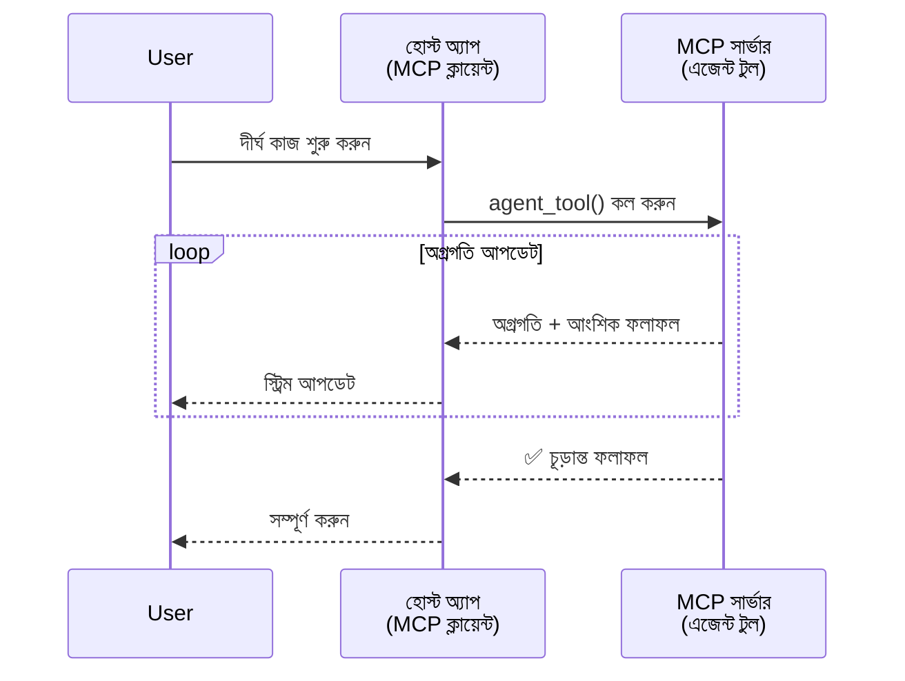
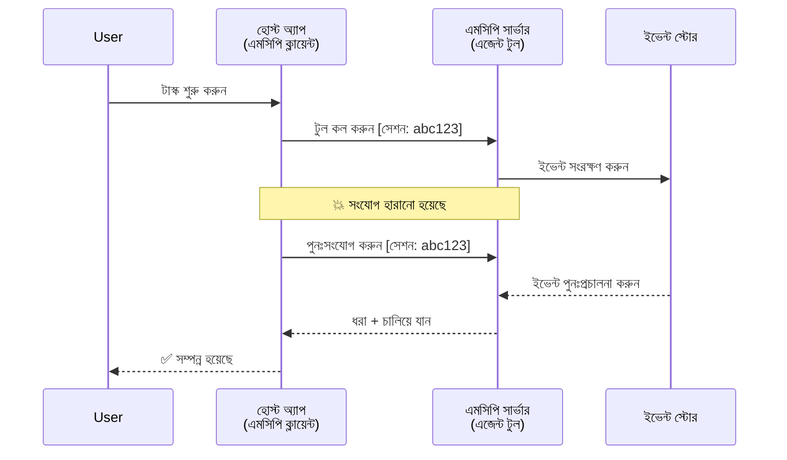
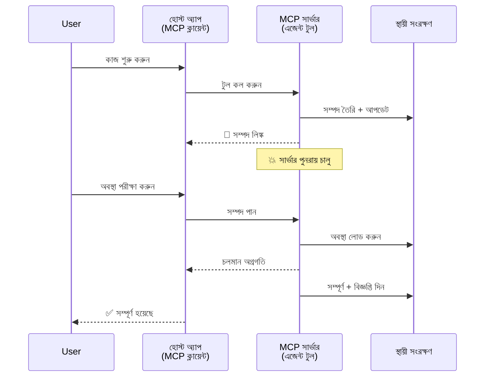
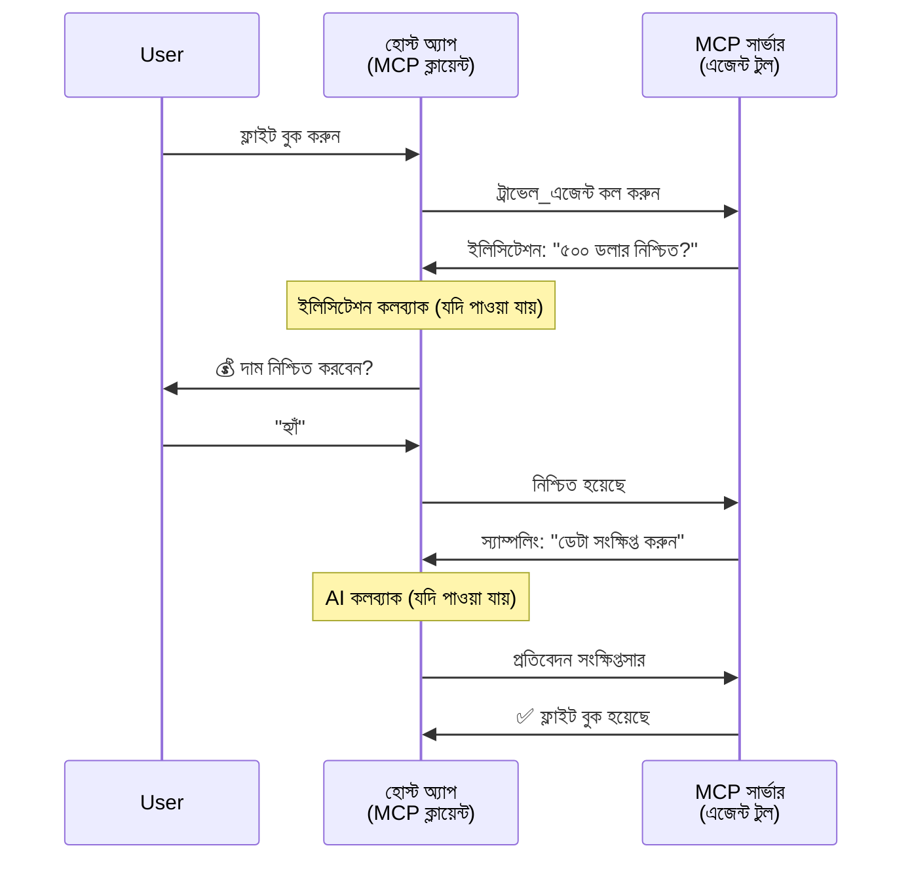
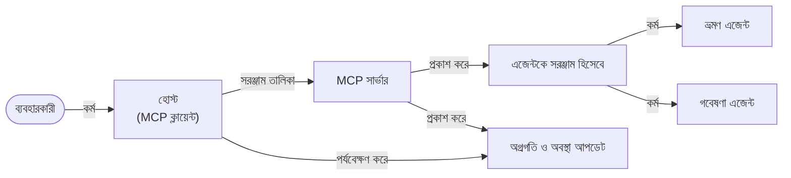

# MCP দিয়ে এজেন্ট-টু-এজেন্ট যোগাযোগ সিস্টেম তৈরি করা

> সারসংক্ষেপ - আপনি কি MCP তে Agent2Agent যোগাযোগ নির্মাণ করতে পারেন? হ্যাঁ!

MCP তার মূল লক্ষ্য "LLM-এ প্রসঙ্গ প্রদান" থেকে বহুগুণে উন্নত হয়েছে। সাম্প্রতিক উন্নতিগুলোর মধ্যে রয়েছে [পুনরায় চালু করার যোগ্য স্ট্রিম](https://modelcontextprotocol.io/docs/concepts/transports#resumability-and-redelivery), [উত্তোলন](https://modelcontextprotocol.io/specification/2025-06-18/client/elicitation), [নমুনা সংগ্রহ](https://modelcontextprotocol.io/specification/2025-06-18/client/sampling), এবং বিজ্ঞপ্তি ([প্রগতি](https://modelcontextprotocol.io/specification/2025-06-18/basic/utilities/progress) এবং [সম্পদ](https://modelcontextprotocol.io/specification/2025-06-18/schema#resourceupdatednotification))। MCP এখন জটিল এজেন্ট-টু-এজেন্ট যোগাযোগ সিস্টেম তৈরি করার জন্য একটি শক্তিশালী ভিত্তি প্রদান করে।

## এজেন্ট/টুল ভুল ধারণা

আরও বেশি ডেভেলপার এজেন্টিক আচরণযুক্ত (দীর্ঘ সময় রান করে, মাঝে মাঝে অতিরিক্ত ইনপুট প্রয়োজন হতে পারে ইত্যাদি) টুলস অন্বেষণ করার সাথে সাথে, একটি সাধারণ ভুল ধারণা হল MCP অযোগ্য কারণ এর প্রাথমিক টুল উদাহরণগুলি সাধারণ অনুরোধ-উত্তর প্যাটার্নে কেন্দ্রিত ছিল।

এই ধারণা এখন পুরনো। MCP স্পেসিফিকেশন সম্প্রতি উল্লেখযোগ্যভাবে উন্নত হয়েছে দীর্ঘমেয়াদী এজেন্টিক আচরণ গড়ে তোলার জন্য উপযুক্ত ক্ষমতাসমূহ নিয়ে:

- **স্ট্রিমিং ও আংশিক ফলাফল**: বাস্তব সময়ে কার্যপ্রগতি আপডেট
- **পুনরায় চালু করার সক্ষমতা**: ক্লায়েন্ট সংযোগ বিচ্ছিন্ন হলে পুনরায় সংযোগ এবং অব্যাহত রাখা যায়
- **টেকসইতা**: ফলাফল সার্ভার রিস্টার্ট সত্ত্বেও বাঁচে (উদাহরণস্বরূপ, রিসোর্স লিঙ্কের মাধ্যমে)
- **মাল্টি-টার্ন**: উত্তোলন ও নমুনা সংগ্রহের মাধ্যমে মধ্যবর্তী ইনপুট

এই বৈশিষ্ট্যগুলো একত্রিত করে জটিল এজেন্টিক ও মাল্টি-এজেন্ট অ্যাপ্লিকেশন তৈরি করা সম্ভব, যা MCP প্রোটোকলের উপর ভিত্তি করে।

রেফারেন্স হিসেবে, আমরা একটি এজেন্টকে "টুল" হিসেবে উল্লেখ করব যা একটি MCP সার্ভারে উপলব্ধ। এর অর্থ একটি হোস্ট অ্যাপ্লিকেশন আছে যা MCP ক্লায়েন্ট হিসেবে কাজ করে, MCP সার্ভারের সাথে সেশন স্থাপন করে এবং এজেন্টকে কল করতে পারে।

## MCP টুলকে "এজেন্টিক" কী করে?

বাস্তবায়নের আগে, চলুন নির্ধারণ করি দীর্ঘমেয়াদী এজেন্ট সমর্থনের জন্য কী অবকাঠামো ক্ষমতা প্রয়োজন।

> আমরা একটি এজেন্টকে এমন একটি সত্তা হিসেবে সংজ্ঞায়িত করব যা স্বায়ত্তশাসিতভাবে দীর্ঘ সময় কাজ করতে পারে, জটিল কাজ পরিচালনা করতে সক্ষম যা একাধিক ইন্টারঅ্যাকশন বা বাস্তব সময়ের মতামতের ভিত্তিতে সমন্বয় প্রয়োজন হতে পারে।

### ১। স্ট্রিমিং ও আংশিক ফলাফল

প্রচলিত অনুরোধ-উত্তর প্যাটার্ন দীর্ঘ সময়ের কাজের জন্য কার্যকর নয়। এজেন্টদের যা প্রয়োজন তা হল:

- বাস্তব সময়ে কার্যপ্রগতি আপডেট
- মধ্যবর্তী ফলাফল

**MCP সাপোর্ট**: রিসোর্স আপডেট বিজ্ঞপ্তি আংশিক ফলাফল স্ট্রিমিং সমর্থন করে, যদিও এটি JSON-RPC এর 1:1 অনুরোধ/উত্তর মডেলের সাথে সংঘর্ষ এড়াতে সাবধানতার সঙ্গে ডিজাইন করা উচিত।

| বৈশিষ্ট্য                    | ব্যবহার কেস                                                                                                                                                                                | MCP সাপোর্ট                                                                                  |
| -------------------------- | ----------------------------------------------------------------------------------------------------------------------------------------------------------------------------------------- | -------------------------------------------------------------------------------------------- |
| বাস্তব সময়ের কার্যপ্রগতি আপডেট | ব্যবহারকারী একটি কোডবেস মাইগ্রেশন টাস্ক অনুরোধ করেন। এজেন্ট স্ট্রিম করে: "১০% - ডিপেন্ডেন্সি বিশ্লেষণ... ২৫% - টাইপস্ক্রিপ্ট ফাইল রূপান্তর... ৫০% - ইম্পোর্ট আপডেট..."                   | ✅ প্রগতি বিজ্ঞপ্তি                                                                          |
| আংশিক ফলাফল            | "একটি বই তৈরি করুন" কাজের আংশিক ফলাফল স্ট্রিম করে, যেমন ১) স্টোরি আর্ক আউটলাইন, ২) অধ্যায় তালিকা, ৩) প্রতিটি অধ্যায় সম্পন্ন হওয়ার সাথে সাথে। হোস্ট যেকোনো সময় পরিদর্শন, বাতিল বা পুনঃনির্দেশ করতে পারে। | ✅ বিজ্ঞপ্তি "বর্ধিত" করা যেতে পারে আংশিক ফলাফল সহ, PR ৩৮৩, ৭৭৬ প্রস্তাবনা দেখুন                  |

<div align="center" style="font-style: italic; font-size: 0.95em; margin-bottom: 0.5em;">
<strong>চিত্র ১:</strong> এই চিত্রটি দেখায় কীভাবে একটি MCP এজেন্ট দীর্ঘমেয়াদী কাজের সময় হোস্ট অ্যাপ্লিকেশনে বাস্তব সময়ে প্রগতি আপডেট এবং আংশিক ফলাফল স্ট্রিম করে, ব্যবহারকারীকে কার্যসম্পাদন পর্যবেক্ষণে সক্ষম করে।
</div>



### ২। পুনরায় চালু করার সক্ষমতা

এজেন্টদের নেটওয়ার্ক বিভ্রাট সহজভাবে মোকাবেলা করতে হবে:

- (ক্লায়েন্ট) সংযোগ বিচ্ছিন্ন হওয়ার পর পুনরায় সংযোগ
- যেখানে থেমে গেছে সেখান থেকে অব্যাহত রাখা (বার্তা পুনরায় বিতরণ)

**MCP সাপোর্ট**: MCP StreamableHTTP ট্রান্সপোর্ট বর্তমানে সেশন পুনরায় শুরু এবং বার্তা পুনঃবিতরণ সাপোর্ট করে সেশন আইডি ও শেষ ইভেন্ট আইডি সহ। সার্ভারকে অবশ্যই এমন একটি ইভেন্টস্টোর বাস্তবায়ন করতে হবে যা ক্লায়েন্ট পুনরায় সংযোগের সময় ইভেন্ট পুনঃনির্বাহ নিশ্চিত করে।  
উল্লেখ্য, সম্প্রদায়ের একটি প্রস্তাব (PR #975) রয়েছে যা পরিবহনের উপর নির্ভর নয় এমন পুনরায় চালু স্ট্রিমের সম্ভাবনা অনুসন্ধান করে।

| বৈশিষ্ট্য      | ব্যবহার কেস                                                                                                                                                           | MCP সাপোর্ট                                                          |
| ------------ | -------------------------------------------------------------------------------------------------------------------------------------------------------------------- | -------------------------------------------------------------------- |
| পুনরায় চালু করা (Resumability) | ক্লায়েন্ট দীর্ঘমেয়াদী কাজ চলাকালীন সংযোগ বিচ্ছিন্ন হয়। পুনরায় সংযোগে সেশন পূর্ববর্তী ঘটনাসমূহ পুনরায় চালিয়ে seamless অব্যাহত থাকে। | ✅ StreamableHTTP পরিবহন সেশন আইডি, ইভেন্ট পুনঃনির্বাহ, এবং EventStore সহ |

<div align="center" style="font-style: italic; font-size: 0.95em; margin-bottom: 0.5em;">
<strong>চিত্র ২:</strong> MCP এর StreamableHTTP পরিবহন এবং ইভেন্ট স্টোর কিভাবে seamless সেশন পুনরায় শুরু নিশ্চিত করে দেখানো হয়েছে: ক্লায়েন্ট সংযোগ বিচ্ছিন্ন হলে পুনরায় সংযোগ করে মিস হওয়া ইভেন্ট পুনরায় চালানোর মাধ্যমে কাজ অব্যাহত রাখা যায়।
</div>



### ৩। টেকসইতা

দীর্ঘমেয়াদী এজেন্টদের স্থায়ী অবস্থা দরকার:

- সার্ভার রিস্টার্ট সত্ত্বেও ফলাফল বাঁচে
- অবস্থা বহিঃস্থানে থেকে উদ্ধার করা যায়
- সেশন জুড়ে প্রগতি অনুসরণ

**MCP সাপোর্ট**: MCP এখন টুল কলের জন্য রিসোর্স লিঙ্ক রিটার্ন টাইপ সাপোর্ট করে। বর্তমানে একটি সম্ভাব্য প্যাটার্ন হল এমন একটি টুল ডিজাইন করা যা একটি রিসোর্স তৈরি করে এবং তাৎক্ষণিক রিসোর্স লিঙ্ক রিটার্ন করে। টুল পটভূমিতে কাজ চালিয়ে যেতে পারে এবং রিসোর্স আপডেট করতে পারে। ক্লায়েন্ট ওই রিসোর্সের অবস্থা চেক করতে পারে আংশিক বা সম্পূর্ণ ফলাফল পেতে (যেমন সার্ভার আপডেট করে) অথবা রিসোর্সের আপডেট বিজ্ঞপ্তির জন্য সাবস্ক্রাইব করতে পারে।

একটি সীমাবদ্ধতা হল পোলিং বা আপডেটের জন্য সাবস্ক্রিপশন করতে গেলে বড় পরিসরে রিসোর্স ব্যবহারে প্রভাব পড়তে পারে। সম্প্রদায়ে একটি প্রস্তাব (সহ #992) রয়েছে যা ওয়েব হুক বা ট্রিগার যোগ করার সম্ভাবনা অনুসন্ধান করছে যা সার্ভার ক্লায়েন্ট/হোস্ট অ্যাপ্লিকেশনকে আপডেট জানাতে পারে।

| বৈশিষ্ট্য    | ব্যবহার কেস                                                                                                                                    | MCP সাপোর্ট                                                      |
| ---------- | --------------------------------------------------------------------------------------------------------------------------------------------- | ---------------------------------------------------------------- |
| টেকসইতা    | ডেটা মাইগ্রেশন কাজ চলাকালীন সার্ভার ক্র্যাশ। ফলাফল ও প্রগতি রিস্টার্ট বাঁচে, ক্লায়েন্ট অবস্থা চেক করে টেকসই রিসোর্স থেকে পুনরায় চালিয়ে যেতে পারে। | ✅ রিসোর্স লিঙ্ক ও টেকসই স্টোরেজ সহ অবস্থা বিজ্ঞপ্তি              |

বর্তমানে একটি সাধারণ প্যাটার্ন হল এমন একটি টুল তৈরি করা যা একটি রিসোর্স তৈরি করে এবং অবিলম্বে রিসোর্স লিঙ্ক প্রদান করে। টুল পটভূমিতে কাজ করে, রিসোর্স বিজ্ঞপ্তি (যা প্রগতি আপডেট বা আংশিক ফলাফল হতে পারে) প্রেরণ করে, এবং দরকারে রিসোর্সের কন্টেন্ট আপডেট করে।

<div align="center" style="font-style: italic; font-size: 0.95em; margin-bottom: 0.5em;">
<strong>চিত্র ৩:</strong> এই চিত্রটি দেখায় কিভাবে MCP এজেন্ট দীর্ঘমেয়াদি কাজ সার্ভার রিস্টার্টের পরেও টেকসই রিসোর্স এবং অবস্থা বিজ্ঞপ্তির মাধ্যমে বেঁচে থাকে, ক্লায়েন্টকে প্রগতি পরীক্ষা ও ফলাফল পুনরুদ্ধারে সক্ষম করে।
</div>



### ৪। মাল্টি-টার্ন ইন্টারঅ্যাকশন

এজেন্টদের মাঝে মাঝে মধ্যবর্তী ইনপুট দরকার হয়:

- মানুষের ব্যাখ্যা বা অনুমোদন
- জটিল সিদ্ধান্তের জন্য AI সহায়তা
- গতিশীল প্যারামিটার সমন্বয়

**MCP সাপোর্ট**: সম্পূর্ণরূপে স্যাম্পলিং (AI ইনপুট) এবং উত্তোলনের (মানব ইনপুট) মাধ্যমে সমর্থিত।

| বৈশিষ্ট্য                 | ব্যবহার কেস                                                                                                                                                | MCP সাপোর্ট                                             |
| ----------------------- | --------------------------------------------------------------------------------------------------------------------------------------------------------- | ------------------------------------------------------- |
| মাল্টি-টার্ন ইন্টারঅ্যাকশন | ভ্রমণ বুকিং এজেন্ট ব্যবহারকারীর কাছ থেকে মূল্য নিশ্চিতকরণ চায়, তারপর AI কে ভ্রমণ তথ্য সারাংশ করতে বলে বুকিং সম্পন্ন করার আগে।                           | ✅ উত্তোলন মানব ইনপুট জন্য, স্যাম্পলিং AI ইনপুট জন্য      |

<div align="center" style="font-style: italic; font-size: 0.95em; margin-bottom: 0.5em;">
<strong>চিত্র ৪:</strong> এই চিত্রটি দেখায় কিভাবে MCP এজেন্টরা চলাকালীন মানুষের ইনপুট অনুরোধ বা AI সহায়তা চেয়ে ইন্টারেক্টিভ মাল্টি-টার্ন ওয়ার্কফ্লো, যেমন নিশ্চিতকরণ এবং গতিশীল সিদ্ধান্ত-গ্রহণ সমর্থন করে।
</div>



## MCP-এ দীর্ঘমেয়াদী এজেন্ট বাস্তবায়ন - কোড ওভারভিউ

এই নিবন্ধে, আমরা একটি [কোড রিপোজিটরি](https://github.com/victordibia/ai-tutorials/tree/main/MCP%20Agents) প্রদান করেছি যা MCP পাইথন SDK ব্যবহার করে StreamableHTTP পরিবহনের সাথে সেশন পুনরায় শুরু ও বার্তা পুনঃবিতরণের মাধ্যমে দীর্ঘমেয়াদী এজেন্ট পূর্ণ বাস্তবায়ন করে। বাস্তবায়নটি দেখায় কিভাবে MCP ক্ষমতাগুলো একত্রিত করে পরিশীলিত এজেন্টিক আচরণ তৈরি করা যায়।

নির্দিষ্টভাবে, আমরা দুটি প্রধান এজেন্ট টুল সহ একটি সার্ভার বাস্তবায়ন করি:

- **ট্রাভেল এজেন্ট** - ভ্রমণ বুকিং পরিষেবা অনুকরণ করে যা উত্তোলনের মাধ্যমে মূল্য নিশ্চিতকরণ করে
- **রিসার্চ এজেন্ট** - গবেষণা কাজ করে AI-সহায়ক সারাংশের মাধ্যমে স্যাম্পলিং করে

উভয় এজেন্ট বাস্তব সময়ে প্রগতি আপডেট, ইন্টারেক্টিভ নিশ্চিতকরণ, এবং পূর্ণ সেশন পুনরায় শুরু ক্ষমতা প্রদর্শন করে।

### মূল বাস্তবায়ন ধারণা

নিম্নলিখিত অংশগুলো প্রতিটি ক্ষমতার জন্য সার্ভার-পাশের এজেন্ট বাস্তবায়ন ও ক্লায়েন্ট-পাশের হোস্ট হ্যান্ডলিং দেখায়:

#### স্ট্রিমিং ও প্রগতি আপডেট - বাস্তব সময়ে কাজের অবস্থা

স্ট্রিমিং এজেন্টকে দীর্ঘমেয়াদী কাজের সময় বাস্তব সময়ের প্রগতি আপডেট দিতে সক্ষম করে, ব্যবহারকারীকে কাজের অবস্থা ও মধ্যবর্তী ফলাফল সম্পর্কে অবগত রাখে।

**সার্ভার বাস্তবায়ন (এজেন্ট প্রগতি বিজ্ঞপ্তি পাঠায়):**

```python
# সার্ভার/server.py থেকে - ট্রাভেল এজেন্ট অগ্রগতি আপডেট পাঠাচ্ছে
for i, step in enumerate(steps):
    await ctx.session.send_progress_notification(
        progress_token=ctx.request_id,
        progress=i * 25,
        total=100,
        message=step,
        related_request_id=str(ctx.request_id)
    )
    await anyio.sleep(2)  # কাজের অনুকরণ করা

# বিকল্প: বিস্তারিত ধাপে ধাপে আপডেটের জন্য লগ মেসেজগুলি
await ctx.session.send_log_message(
    level="info",
    data=f"Processing step {current_step}/{steps} ({progress_percent}%)",
    logger="long_running_agent",
    related_request_id=ctx.request_id,
)
```

**ক্লায়েন্ট বাস্তবায়ন (হোস্ট প্রগতি আপডেট গ্রহণ করে):**

```python
# ক্লায়েন্ট/ক্লায়েন্ট.py থেকে - ক্লায়েন্ট বাস্তব-সময়ের নোটিফিকেশন পরিচালনা করছে
async def message_handler(message) -> None:
    if isinstance(message, types.ServerNotification):
        if isinstance(message.root, types.LoggingMessageNotification):
            console.print(f"📡 [dim]{message.root.params.data}[/dim]")
        elif isinstance(message.root, types.ProgressNotification):
            progress = message.root.params
            console.print(f"🔄 [yellow]{progress.message} ({progress.progress}/{progress.total})[/yellow]")

# সেশন তৈরি করার সময় বার্তা হ্যান্ডলার নিবন্ধন করুন
async with ClientSession(
    read_stream, write_stream,
    message_handler=message_handler
) as session:
```

#### উত্তোলন - ব্যবহারকারীর ইনপুট অনুরোধ

উত্তোলন এজেন্টদের চলাকালীন ব্যবহারকারীর ইনপুট চাওয়ার ক্ষমতা দেয়। এটি নিশ্চিতকরণ, ব্যাখ্যা বা অনুমোদনে অপরিহার্য।

**সার্ভার বাস্তবায়ন (এজেন্ট নিশ্চিতকরণ অনুরোধ করে):**

```python
# সার্ভার/server.py থেকে - ট্রাভেল এজেন্ট দাম নিশ্চিতকরণের জন্য অনুরোধ করছে
elicit_result = await ctx.session.elicit(
    message=f"Please confirm the estimated price of $1200 for your trip to {destination}",
    requestedSchema=PriceConfirmationSchema.model_json_schema(),
    related_request_id=ctx.request_id,
)

if elicit_result and elicit_result.action == "accept":
    # বুকিং চালিয়ে যান
    logger.info(f"User confirmed price: {elicit_result.content}")
elif elicit_result and elicit_result.action == "decline":
    # বুকিং বাতিল করুন
    booking_cancelled = True
```

**ক্লায়েন্ট বাস্তবায়ন (হোস্ট উত্তোলন কলব্যাক প্রদান করে):**

```python
# ক্লায়েন্ট/ক্লায়েন্ট.py থেকে - ক্লায়েন্ট হ্যান্ডলিং এলিসিটেশন অনুরোধগুলি
async def elicitation_callback(context, params):
    console.print(f"💬 Server is asking for confirmation:")
    console.print(f"   {params.message}")

    response = console.input("Do you accept? (y/n): ").strip().lower()

    if response in ['y', 'yes']:
        return types.ElicitResult(
            action="accept",
            content={"confirm": True, "notes": "Confirmed by user"}
        )
    else:
        return types.ElicitResult(
            action="decline",
            content={"confirm": False, "notes": "Declined by user"}
        )

# সেশন তৈরি করার সময় কলব্যাক রেজিস্টার করুন
async with ClientSession(
    read_stream, write_stream,
    elicitation_callback=elicitation_callback
) as session:
```

#### স্যাম্পলিং - AI সহায়তা অনুরোধ করা

স্যাম্পলিং এজেন্টকে জটিল সিদ্ধান্ত বা বিষয়বস্তু তৈরির জন্য LLM সহায়তা চাওয়ার অনুমতি দেয়। এটি হাইব্রিড মানব-AI ওয়ার্কফ্লো সম্ভব করে।

**সার্ভার বাস্তবায়ন (এজেন্ট AI সহায়তা অনুরোধ করে):**

```python
# server/server.py থেকে - গবেষণা এজেন্ট AI সংক্ষিপ্তসার অনুরোধ করছে
sampling_result = await ctx.session.create_message(
    messages=[
        SamplingMessage(
            role="user",
            content=TextContent(type="text", text=f"Please summarize the key findings for research on: {topic}")
        )
    ],
    max_tokens=100,
    related_request_id=ctx.request_id,
)

if sampling_result and sampling_result.content:
    if sampling_result.content.type == "text":
        sampling_summary = sampling_result.content.text
        logger.info(f"Received sampling summary: {sampling_summary}")
```

**ক্লায়েন্ট বাস্তবায়ন (হোস্ট স্যাম্পলিং কলব্যাক প্রদান করে):**

```python
# ক্লায়েন্ট/ক্লায়েন্ট.py থেকে - ক্লায়েন্ট স্যাম্পলিং অনুরোধ পরিচালনা
async def sampling_callback(context, params):
    message_text = params.messages[0].content.text if params.messages else 'No message'
    console.print(f"🧠 Server requested sampling: {message_text}")

    # একটি বাস্তব অ্যাপ্লিকেশনে, এটি একটি LLM API কল করতে পারে
    # ডেমো উদ্দেশ্যে, আমরা একটি মক প্রতিক্রিয়া প্রদান করি
    mock_response = "Based on current research, MCP has evolved significantly..."

    return types.CreateMessageResult(
        role="assistant",
        content=types.TextContent(type="text", text=mock_response),
        model="interactive-client",
        stopReason="endTurn"
    )

# সেশন তৈরি করার সময় কলব্যাক নিবন্ধন করুন
async with ClientSession(
    read_stream, write_stream,
    sampling_callback=sampling_callback,
    elicitation_callback=elicitation_callback
) as session:
```

#### পুনরায় চালু করার সক্ষমতা - সংযোগ বিচ্ছিন্নতার পারস্পরিক সেশন অবিচ্ছিন্নতা

পুনরায় চালু করার সক্ষমতা নিশ্চিত করে যে দীর্ঘমেয়াদী এজেন্ট কাজ ক্লায়েন্ট সংযোগ বিচ্ছিন্নতা সহ্য করে এবং পুনরায় সংযোগে নির্বিঘ্নে অব্যাহত থাকে। এটি ইভেন্ট স্টোর এবং পুনরায় শুরু টোকেনের মাধ্যমে বাস্তবায়িত।

**ইভেন্ট স্টোর বাস্তবায়ন (সার্ভারে সেশন অবস্থা ধারণ করে):**

```python
# সার্ভার/event_store.py থেকে - সরল ইন-মেমরি ইভেন্ট স্টোর
class SimpleEventStore(EventStore):
    def __init__(self):
        self._events: list[tuple[StreamId, EventId, JSONRPCMessage]] = []
        self._event_id_counter = 0

    async def store_event(self, stream_id: StreamId, message: JSONRPCMessage) -> EventId:
        """Store an event and return its ID."""
        self._event_id_counter += 1
        event_id = str(self._event_id_counter)
        self._events.append((stream_id, event_id, message))
        return event_id

    async def replay_events_after(self, last_event_id: EventId, send_callback: EventCallback) -> StreamId | None:
        """Replay events after the specified ID for resumption."""
        # শেষ জানা ইভেন্টের পরবর্তী ইভেন্ট খুঁজে বের করে সেগুলি পুনরায় চালানো
        for _, event_id, message in self._events[start_index:]:
            await send_callback(EventMessage(message, event_id))

# সার্ভার/server.py থেকে - ইভেন্ট স্টোর সেশন ম্যানেজারের কাছে প্রেরণ করা
def create_server_app(event_store: Optional[EventStore] = None) -> Starlette:
    server = ResumableServer()

    # সেশন পুনরায় শুরু করার জন্য ইভেন্ট স্টোর সহ সেশন ম্যানেজার তৈরি করা
    session_manager = StreamableHTTPSessionManager(
        app=server,
        event_store=event_store,  # ইভেন্ট স্টোর সেশন পুনরায় শুরু সক্ষম করে
        json_response=False,
        security_settings=security_settings,
    )

    return Starlette(routes=[Mount("/mcp", app=session_manager.handle_request)])

# ব্যবহার: ইভেন্ট স্টোর দিয়ে আরম্ভ করা
event_store = SimpleEventStore()
app = create_server_app(event_store)
```

**সেশন টোকেন সহ ক্লায়েন্ট মেটাডেটা (সঞ্চিত অবস্থার মাধ্যমে ক্লায়েন্ট পুনরায় সংযোগ হয়):**

```python
# ক্লায়েন্ট/ক্লায়েন্ট.py থেকে - মেটাডেটা সহ ক্লায়েন্ট পুনরায় শুরু করা
if existing_tokens and existing_tokens.get("resumption_token"):
    # বিদ্যমান পুনরায় শুরু টোকেন ব্যবহার করে যেখানে আমরা থেমেছিলাম সেখান থেকে চালিয়ে যান
    metadata = ClientMessageMetadata(
        resumption_token=existing_tokens["resumption_token"],
    )
else:
    # টোকেন পাওয়া গেলে তা সংরক্ষণ করার জন্য কলব্যাক তৈরি করুন
    def enhanced_callback(token: str):
        protocol_version = getattr(session, 'protocol_version', None)
        token_manager.save_tokens(session_id, token, protocol_version, command, args)

    metadata = ClientMessageMetadata(
        on_resumption_token_update=enhanced_callback,
    )

# পুনরায় শুরু মেটাডেটা সহ অনুরোধ পাঠান
result = await session.send_request(
    types.ClientRequest(
        types.CallToolRequest(
            method="tools/call",
            params=types.CallToolRequestParams(name=command, arguments=args)
        )
    ),
    types.CallToolResult,
    metadata=metadata,
)
```

হোস্ট অ্যাপ্লিকেশনটি সেশন আইডি এবং পুনরায় শুরু টোকেন স্থানীয়ভাবে ধরে রাখে, ফলে এটি বিদ্যমান সেশনে পুনরায় সংযোগ করতে পারে অবস্থা বা প্রগতির ক্ষতি ছাড়াই।

### কোড সংগঠন

<div align="center" style="font-style: italic; font-size: 0.95em; margin-bottom: 0.5em;">
<strong>চিত্র ৫:</strong> MCP ভিত্তিক এজেন্ট সিস্টেম আর্কিটেকচার
</div>



**মূল ফাইল:**

- **`server/server.py`** - পুনরায় চালু MCP সার্ভার ট্রাভেল ও রিসার্চ এজেন্টসহ যা উত্তোলন, স্যাম্পলিং ও প্রগতি আপডেট প্রদর্শন করে
- **`client/client.py`** - ইন্টারেক্টিভ হোস্ট অ্যাপ্লিকেশন পুনরায় শুরু সমর্থন, কলব্যাক হ্যান্ডলার ও টোকেন ব্যবস্থাপনা সহ
- **`server/event_store.py`** - ইভেন্ট স্টোর বাস্তবায়ন সেশন পুনরায় শুরু ও বার্তা পুনঃবিতরণের জন্য

## MCP তে মাল্টি-এজেন্ট যোগাযোগ সম্প্রসারণ

উপরের বাস্তবায়ন মাল্টি-এজেন্ট সিস্টেমে উন্নীত করা যেতে পারে হোস্ট অ্যাপ্লিকেশনের বুদ্ধিমত্তা ও পরিধি বাড়িয়ে:

- **বুদ্ধিমান কাজ বিভাজন**: হোস্ট জটিল ব্যবহারকারী অনুরোধ বিশ্লেষণ করে এবং বিভিন্ন বিশেষায়িত এজেন্টের জন্য উপ-টাস্কে 분割 করে
- **মাল্টি-সার্ভার সমন্বয়**: হোস্ট একাধিক MCP সার্ভারের সাথে সংযোগ বজায় রাখে, প্রতিটি বিভিন্ন এজেন্ট ক্ষমতা প্রদান করে
- **কাজ অবস্থা পরিচালনা**: হোস্ট একাধিক পারস্পরিক এজেন্ট কাজের প্রগতি ট্র্যাক করে, নির্ভরশীলতা ও ক্রমানুসারে পরিচালনা করে
- **সহনশীলতা ও পুনঃচেষ্টা**: হোস্ট ব্যর্থতা পরিচালনা করে, পুনঃচেষ্টা লজিক বাস্তবায়ন করে ও এজেন্ট অনুপলব্ধ হলে কাজ পুনঃনির্দেশ করে
- **ফলাফল সংযোজন**: হোস্ট একাধিক এজেন্টের আউটপুটকে সামঞ্জস্যপূর্ণ চূড়ান্ত ফলাফলে একত্রিত করে

হোস্ট একটি সরল ক্লায়েন্ট থেকে বুদ্ধিমান আয়োজনকারীতে পরিণত হয়, বিতরণকৃত এজেন্ট ক্ষমতাসমূহ সমন্বয় করে একই MCP প্রোটোকল ভিত্তি বজায় রেখে।

## উপসংহার

MCP-এর উন্নত ক্ষমতা – রিসোর্স বিজ্ঞপ্তি, উত্তোলন/স্যাম্পলিং, পুনরায় চালু স্ট্রিম, এবং টেকসই রিসোর্স – জটিল এজেন্ট-টু-এজেন্ট ইন্টারঅ্যাকশন সক্ষম করে প্রোটোকলের সরলতা বজায় রেখে।

## শুরু করছি

নিজস্ব agent2agent সিস্টেম তৈরি করতে প্রস্তুত? এই ধাপগুলো অনুসরণ করুন:

### ১। ডেমো চালান

```bash
# পুনর্সারম্ভের জন্য ইভেন্ট স্টোর সহ সার্ভার শুরু করুন
python -m server.server --port 8006

# অন্য একটি টার্মিনালে, ইন্টারেক্টিভ ক্লায়েন্ট চালান
python -m client.client --url http://127.0.0.1:8006/mcp
```

**ইন্টারেক্টিভ মোডে উপলব্ধ কমান্ড:**

- `travel_agent` - উত্তোলনের মাধ্যমে মূল্য নিশ্চিতকরণের মাধ্যমে ভ্রমণ বুকিং করুন
- `research_agent` - স্যাম্পলিং দ্বারা AI-সহায়ক সারাংশের মাধ্যমে গবেষণা বিষয়
- `list` - সব উপলব্ধ টুল দেখান
- `clean-tokens` - পুনরায় শুরু টোকেন পরিষ্কার করুন
- `help` - বিস্তারিত নির্দেশ কমান্ড দেখান
- `quit` - ক্লায়েন্ট ছেড়ে যান

### ২। পুনরায় চালু ক্ষমতা পরীক্ষা করুন

- একটি দীর্ঘমেয়াদী এজেন্ট চালু করুন (যেমন `travel_agent`)
- কাজ চলাকালীন ক্লায়েন্ট ব্যাঘাত প্রদান করুন (Ctrl+C)
- ক্লায়েন্ট পুনরায় চালু করুন - এটি স্বয়ংক্রিয়ভাবে যেখানে ছেড়ে গেছে সেখান থেকে পুনরায় শুরু করবে

### ৩। অন্বেষণ ও সম্প্রসারণ

- **উদাহরণগুলো অন্বেষণ করুন**: এই [mcp-agents](https://github.com/victordibia/ai-tutorials/tree/main/MCP%20Agents) দেখুন
- **সম্প্রদায়ে যোগ দিন**: GitHub-এ MCP আলোচনা অংশ নিন
- **পরীক্ষা করুন**: একটি সহজ দীর্ঘমেয়াদী কাজ দিয়ে শুরু করুন এবং ধীরে ধীরে স্ট্রিমিং, পুনরায় চালু করার সক্ষমতা ও মাল্টি-এজেন্ট সমন্বয় যোগ করুন

এটি দেখায় কিভাবে MCP বুদ্ধিমান এজেন্ট আচরণ সক্ষম করে টুল-ভিত্তিক সরলতা বজায় রেখে।

সামগ্রিকভাবে, MCP প্রোটোকল স্পেসিফিকেশন দ্রুত উন্নীত হচ্ছে; সর্বশেষ আপডেটের জন্য অফিসিয়াল ডকুমেন্টেশন ওয়েবসাইট পর্যালোচনা করার পরামর্শ দেওয়া হচ্ছে - https://modelcontextprotocol.io/introduction

---

<!-- CO-OP TRANSLATOR DISCLAIMER START -->
**অস্বীকৃতি**:
এই নথিটি AI অনুবাদ পরিষেবা [Co-op Translator](https://github.com/Azure/co-op-translator) ব্যবহার করে অনূদিত হয়েছে। যদিও আমরা শুদ্ধতার জন্য চেষ্টা করি, অনুগ্রহ করে মনে রাখবেন যে স্বয়ংক্রিয় অনুবাদে ত্রুটি বা অসঙ্গতি থাকতে পারে। মূল নথিটি তার স্বভাষায় কর্তৃত্বপূর্ণ উৎস হিসেবে বিবেচিত হওয়া উচিত। গুরুত্বপূর্ণ তথ্যের জন্য পেশাদার মানব অনুবাদ সুপারিশ করা হয়। এই অনুবাদের ব্যবহারে প্রয়োজনীয় ভুল বোঝাবুঝি বা ভুল ব্যাখ্যার জন্য আমরা দায়বদ্ধ নই।
<!-- CO-OP TRANSLATOR DISCLAIMER END -->