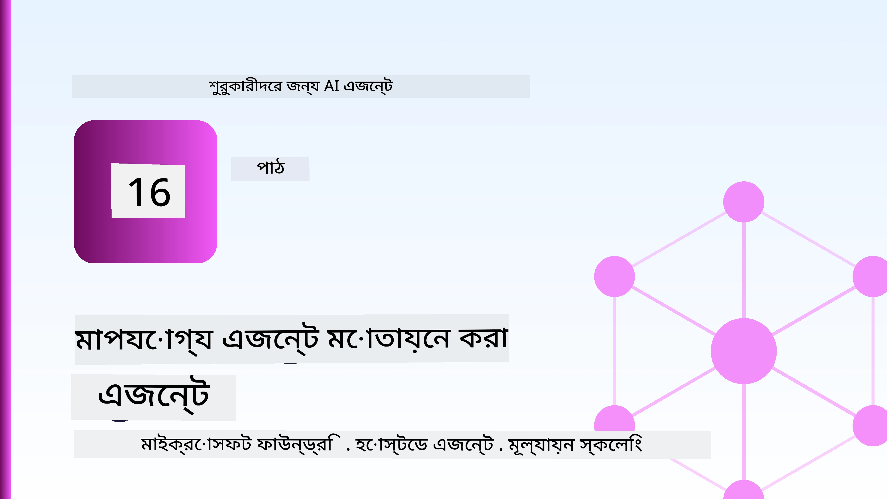
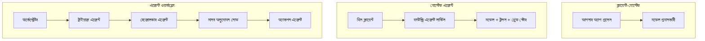
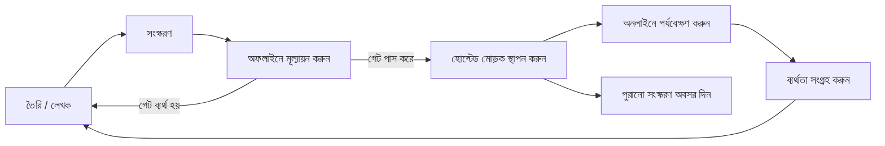
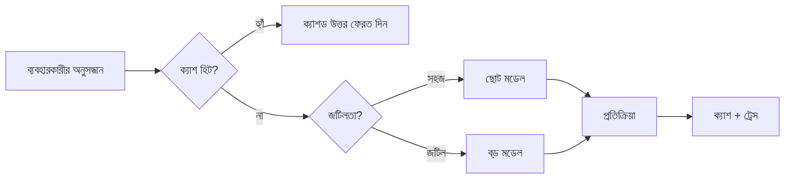
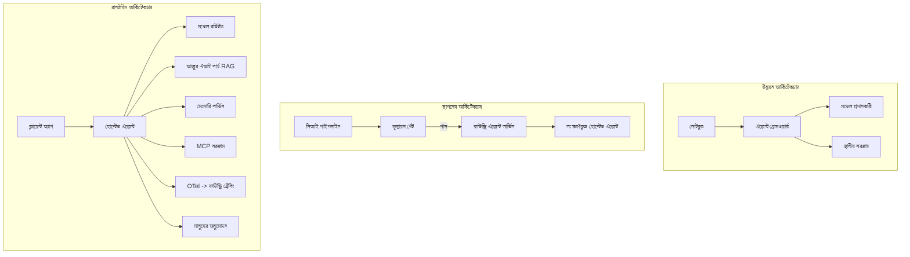

# Microsoft Foundry দিয়ে স্কেলেবল এজেন্ট মোতায়েন করা



কোর্সের এই পর্যায় পর্যন্ত আপনি এমন এজেন্ট তৈরি করেছেন যা আপনার ল্যাপটপে, একটি নোটবুকের ভিতরে চলে, `az login` এবং কয়েকটি পরিবেশ ভেরিয়েবল দ্বারা চালিত। এটি শেখার জন্য একদম সঠিক উপায়। তবে হাজার হাজার গ্রাহক যারা ৩ টা বাজে নির্ভর করে, তাদের জন্য এজেন্ট চালানো এটাই সঠিক উপায় নয়।

এই পাঠটি “আমার যন্ত্রে এটা কাজ করে” এবং “এটা উত্পাদনে সঠিকভাবে এবং সাশ্রয়ী দামে কাজ করে” এর মধ্যকার ফাঁক সম্পর্কিত। আমরা এই ফাঁক বন্ধ করবো **Microsoft Foundry** এবং **Microsoft Foundry Agent Service** ব্যবহার করে, এবং আমরা এটি করবো একটি বাস্তব গ্রাহক সহায়তা এজেন্ট তৈরি করে যার রয়েছে টুলস, অনুসন্ধান, মেমরি, মূল্যায়ন এবং পর্যবেক্ষণ।

## পরিচিতি

এই পাঠে আলোচনা করা হবে:

- একটি **প্রোটোটাইপ এজেন্ট** এবং একটি **মোতায়েনকৃত এজেন্ট** এর পার্থক্য এবং কেন পরিবর্তনটি প্রায় সবসময় মডেলের *পাশের* জিনিসগুলো নিয়ে।
- এজেন্টের **মোতায়েন প্যাটার্ন**: ক্লায়েন্ট-হোস্টেড, সার্ভিস-হোস্টেড (Hosted Agents), এবং ওয়ার্কফ্লো-অর্কেস্ট্রেটেড।
- Microsoft Foundry-তে **এজেন্ট জীবনচক্র** — তৈরি, সংস্করণ, মোতায়েন, মূল্যায়ন, পর্যবেক্ষণ, অবসর।
- **স্কেলিং কৌশল**: মডেল রাউটিং, ক্যাশিং, সহসময়ে, এবং স্টেটলেস ডিজাইন।
- OpenTelemetry এবং Foundry ট্রেসিং সহ **পর্যবেক্ষণযোগ্যতা**।
- মডেল নির্বাচন, রাউটিং, এবং মূল্যায়ন গেটের মাধ্যমে **ব্যয় অপ্টিমাইজেশন**।
- **এন্টারপ্রাইজ বিবেচনা**: গভর্ন্যান্স, মানব অনুমোদন, এবং MCP সার্ভারগুলোকে সুরক্ষিতভাবে উত্পাদনে চালানো।

## শেখার লক্ষ্যসমূহ

এই পাঠ শেষ করার পরে, আপনি জানতে পারবেন:

- একটি নির্দিষ্ট এজেন্ট ওয়ার্কলোডের জন্য সঠিক মোতায়েন প্যাটার্ন নির্বাচন করা।
- একটি এজেন্ট Microsoft Foundry Agent Service-এ মোতায়েন করা যাতে এটি সংস্করণায়িত, গভর্নড, এবং পর্যবেক্ষণযোগ্য হয়।
- ট্রেসিং এর জন্য একটি এজেন্ট ইন্সট্রুমেন্ট করা এবং প্রতিটি মুক্তির আগে একটি মূল্যায়ন পাইলাইন সংযুক্ত করা।
- স্কেলের সময় ল্যাটেন্সি ও খরচ নিয়ন্ত্রণ করতে মডেল রাউটিং এবং ক্যাশিং প্রয়োগ করা।
- উচ্চ-ঝুঁকিপূর্ণ ক্রিয়াগুলির জন্য মানব অনুমোদন গেট যোগ করা এবং উত্পাদনে MCP সার্ভারকে নিরাপদ ভাবে ইন্টিগ্রেট করা।

## পূর্বপরিস্থিতি

এই পাঠটি ধরে নেয় যে আপনি পূর্ববর্তী পাঠগুলি সম্পন্ন করেছেন এবং নীচের বিষয়গুলিতে আরামদায়ক:

- [Microsoft Agent Framework](../14-microsoft-agent-framework/README.md) (পাঠ ১৪) দিয়ে এজেন্ট তৈরি।
- [টুল ব্যবহার](../04-tool-use/README.md) (পাঠ ৪) এবং [Agentic RAG](../05-agentic-rag/README.md) (পাঠ ৫)।
- [Agent Memory](../13-agent-memory/README.md) (পাঠ ১৩) এবং [Agentic Protocols / MCP](../11-agentic-protocols/README.md) (পাঠ ১১)।
- [পর্যবেক্ষণযোগ্যতা ও মূল্যায়ন](../10-ai-agents-production/README.md) (পাঠ ১০) — এই পাঠ সরাসরি এর উপরে তৈরি।

এছাড়াও আপনার প্রয়োজন হবে:

- একটি **Azure সাবস্ক্রিপশন** এবং একটি **Microsoft Foundry প্রকল্প** যেখানে অন্তত একটি মোতায়েনিত চ্যাট মডেল রয়েছে।
- **Azure CLI** অথেনটিকেটেড (`az login`)।
- Python 3.12+ এবং রিপোজিটরির [`requirements.txt`](../../../requirements.txt) এ থাকা প্যাকেজগুলি।

## প্রোটোটাইপ থেকে প্রোডাকশন: আসলে কী পরিবর্তন হয়

একটি প্রোটোটাইপ এজেন্ট এবং একটি প্রোডাকশন এজেন্ট একই মূল লুপ ভাগ করে — যুক্তি, টুল কল, প্রতিক্রিয়া। যা পরিবর্তন হয় তা হলো সেই লুপের চারপাশে মোড়ানো সবকিছু। মডেলটি সম্ভবত প্রোডাকশন এজেন্টের মাত্র ২০%; বাকি ৮০% হলো অপারেশনাল ডিজাইন।

| বিষয় | প্রোটোটাইপ | প্রোডাকশন |
| --- | --- | --- |
| **হোস্টিং** | আপনার নোটবুকে চলে | হোস্টেড সার্ভিস হিসেবে চলে, সংস্করণায়িত এবং ধীরে ধীরে রোল আউট হয় |
| **পরিচয়** | আপনার `az login` টোকেন | স্কোপড RBAC সহ পরিচালিত পরিচয় |
| **অবস্থা** | মেমরিতে, রিস্টার্টে হারিয়ে যায় | বাহ্যিকীকৃত (থ্রেড স্টোর, মেমরি সার্ভিস) |
| **ব্যর্থতা** | আপনি ট্রেসব্যাক দেখেন | পুনরায় চেষ্টা, ব্যাকআপ, ডেড-লেটার, এলার্ট |
| **খরচ** | "কয়েক সেন্ট মাত্র" | অনুরোধ অনুযায়ী ট্র্যাক করা হয়, রাউট করা হয়, ক্যাশ করা হয়, বাজেট নির্ধারণ করা হয় |
| **গুণগত মান** | আপনি আউটপুট চোখে দেখে যাচাই করেন | প্রতিটি মুক্তির আগে স্বয়ংক্রিয়ভাবে মূল্যায়িত |
| **বিশ্বাসযোগ্যতা** | আপনি প্রতিটি কর্ম অনুমোদন করেন | ঝুঁকিপূর্ণ ক্রিয়াগুলির জন্য নীতি + মানব-ইন-দ্য-লুপ |

এই টেবিলটি মাথায় রাখুন। নিচের প্রতিটি অংশ এই সারিগুলির একটি-একটি ট্যাবে মেলে।

## এজেন্ট মোতায়েন প্যাটার্নসমূহ

আপনি তিনটি প্যাটার্ন ব্যবহার করবেন, প্রায়ই সমন্বয়ে।

### ১. ক্লায়েন্ট-হোস্টেড এজেন্টস

এজেন্ট অবজেক্টটি *আপনার* অ্যাপ্লিকেশন প্রসেসের ভিতরে থাকে। আপনার কোড সরাসরি মডেল প্রোভাইডারকে কল করে; যুক্তি লুপ আপনার সার্ভিসে চলে। এটি প্রত্যেক পূর্ববর্তী পাঠে করা হয়েছে।

- **ব্যবহার করুন যখন** আপনি লুপের সম্পূর্ণ নিয়ন্ত্রণ চান, কাস্টম মিডলওয়্যার বা বিদ্যমান ব্যাকএন্ডের ভিতরে এজেন্ট এম্বেড করছেন।
- **ট্রেড-অফ**: স্কেলিং, অবস্থা, এবং স্থিতিস্থাপকতা নিজে নিজেই আপনাকে নিয়ন্ত্রণ করতে হয়।

### ২. হোস্টেড এজেন্টস (Foundry Agent Service)

এজেন্টটি Microsoft Foundry-তে *রিসোর্স হিসেবে নিবন্ধিত* হয়। Foundry যুক্তি লুপ হোস্ট করে, থ্রেড সংরক্ষণ করে, কনটেন্ট সেফটি এবং RBAC প্রয়োগ করে, এবং এজেন্টটিকে Foundry পোর্টালে দৃশ্যমান করে। আপনার অ্যাপ একটি পাতলা ক্লায়েন্ট যা থ্রেড তৈরি করে এবং প্রতিক্রিয়া পড়ে।

- **ব্যবহার করুন যখন** আপনি স্থায়িত্ব, বিল্ট-ইন পর্যবেক্ষণযোগ্যতা, গভর্ন্যান্স এবং কম অপারেশনাল সারফেস এলাকা চান।
- **ট্রেড-অফ**: পরিচালিত রানটাইমের বিনিময়ে কম নিম্নস্তরের নিয়ন্ত্রণ।

### ৩. এজেন্ট ওয়ার্কফ্লো

একাধিক এজেন্ট (এবং টুল) একটি গ্রাফ আকারে সংগঠিত হয় যেখানে স্পষ্ট নিয়ন্ত্রণ প্রবাহ থাকে — ধারাবাহিক ধাপ, শাখা, মানব অনুমোদন নোড, এবং স্থায়ী চেকপয়েন্ট যা স্থগিত এবং পুনরায় শুরু করা যায়। এটি Microsoft Agent Framework-এর **Workflows** ফিচার যা মোতায়েন স্কেলে ব্যবহার করা হয়।

- **ব্যবহার করুন যখন** একটি একক কাজ একাধিক বিশেষজ্ঞ এজেন্ট বা মাঝখানে অনুমোদন ধাপের প্রয়োজন।
- **ট্রেড-অফ**: বেশি চলমান অংশ; অর্কেস্ট্রেশন-স্তরের পর্যবেক্ষণযোগ্যতা প্রয়োজন।



## Microsoft Foundry-তে এজেন্ট জীবনচক্র

একটি এজেন্ট মোতায়েন করা কেবল একবারের `push` নয়। এটা একটি লুপ, এবং এটি অনেকটাই সফটওয়্যার মুক্তি চক্রের মত কারণ আসলেই সেটাই।



মূল ধারণা, [Lesson 10](../10-ai-agents-production/README.md) থেকে গৃহীত: **অফলাইন মূল্যায়ন একটি গেট, একটি পরবর্তীতে চিন্তা নয়।** একটি নতুন এজেন্ট সংস্করণ তখনই চালু হয় যখন এটি আপনার মূল্যায়ন সীমা পার হয়। অনলাইন পর্যবেক্ষণ তখন প্রকৃত ব্যর্থতাগুলিকে আপনার অফলাইন টেস্ট সেটে পুনরায় ফিড করে। এটাই পুরো লুপ।

## স্কেলিং কৌশলসমূহ

একটি এজেন্ট স্কেল করা স্টেটলেস ওয়েব API স্কেল করার থেকে আলাদা, কারণ প্রতিটি অনুরোধ অনেক ব্যয়বহুল মডেল এবং টুল কল চালাতে পারে। চারটি প্রযুক্তি বেশিরভাগ লোড বহন করে।

**স্টেটলেস অনুরোধ পরিচালনা।** আপনার প্রসেস মেমরিতে কোনও ব্যবহারকারী-নির্দিষ্ট অবস্থা রাখবেন না। Foundry থ্রেড স্টোর বা একটি মেমরি সার্ভিসে কথোপকথন থ্রেড সংরক্ষণ করুন যাতে যেকোনো ইনস্ট্যান্স যেকোনো অনুরোধ পরিচালনা করতে পারে। এটাই আপনাকে অনুভূমিকভাবে স্কেল করতে দেয় — ইনস্ট্যান্স যোগ করুন, কোনও স্টিকি সেশন নয়।

**মডেল রাউটিং।** সব অনুরোধ আপনার সবচেয়ে ক্ষমতাবান (এবং সবচেয়ে ব্যয়বহুল) মডেলের প্রয়োজন হয় না। সহজ অনুরোধ, যেমন ইন্টেন্ট শ্রেণীবিভাগ, সংক্ষিপ্ত তথ্যপূর্ণ উত্তর — একটি ছোট, দ্রুত মডেলে রাউট করুন এবং বড় মডেলটি জেনুইন যুক্তির জন্য সংরক্ষণ করুন। Foundry-এর **Model Router** এটা করতে পারে, অথবা আপনি নিজে একটি হালকা শ্রেণীবিভাগকারী তৈরি করতে পারেন। আপনি ল্যাব-এ DIY সংস্করণ তৈরি করবেন।

**প্রতিক্রিয়া ক্যাশিং।** অনেক সহায়তা প্রশ্ন প্রায় একই রকম ("আমি কীভাবে পাসওয়ার্ড রিসেট করব?")। সাধারণ প্রশ্নের উত্তর ক্যাশ করুন এবং মডেল ছাড়াই সেগুলো পরিবেশন করুন। সামান্য ক্যাশ হিট রেটও খরচ এবং ল্যাটেন্সি উল্লেখযোগ্যভাবে কমায়।

**সহসময়ে এবং ব্যাকপ্রেশার।** মডেল প্রোভাইডারদের রেট সীমা আছে। আপনার সহসময়ে সীমাবদ্ধ করুন, এক্সপোনেনশিয়াল ব্যাকঅফ সহ পুনরায় চেষ্টা ব্যবহার করুন, এবং গ্রেসফully ব্যর্থ হোন (একটি কিউ করা "আমরা কাজ চালিয়ে যাচ্ছি" সাড়া ৫০০ তে ভালো)।



## উত্পাদনে পর্যবেক্ষণযোগ্যতা

আপনি যা দেখতে পারবেন না তা আপনি পরিচালনা করতে পারবেন না। যেমন পাঠ ১০-এ আলোচনা করা হয়েছে, Microsoft Agent Framework নেটিভভাবে **OpenTelemetry** ট্রেসস সৃষ্টি করে — প্রতিটি মডেল কল, টুল আহ্বান এবং অর্কেস্ট্রেশন ধাপ একটি স্প্যান হয়। উত্পাদনে আপনি সেই স্প্যানগুলো Microsoft Foundry-তে (অথবা যেকোনো OTel-সঙ্গত ব্যাকএন্ডে) রপ্তানি করেন যাতে আপনি:

- প্রতিটি মডেল এবং টুল কল জুড়ে একটি গ্রাহকের অভিযোগ ট্রেস করতে পারেন।
- সময়ের সাথে প্রতি অনুরোধের p50/p95 ল্যাটেন্সি এবং খরচ পর্যবেক্ষণ করতে পারেন।
- আপনার ব্যবহারকারী (অথবা আপনার ফাইনান্স টিম) বুঝার আগেই ত্রুটি-হারের বৃদ্ধির এবং খরচের অস্বাভাবিকতা নিয়ে সতর্কতা পেতে পারেন।

```python
from agent_framework.observability import get_tracer

tracer = get_tracer()

with tracer.start_as_current_span("support_request") as span:
    span.set_attribute("customer.tier", "enterprise")
    span.set_attribute("routed.model", "gpt-5-nano")
    # এজেন্ট কার্যকরী স্বয়ংক্রিয়ভাবে এই স্প্যানের ভিতরে ট্রেস করা হয়
```

`customer.tier` এবং `routed.model` এর মত অ্যাট্রিবিউটগুলো ট্রেসের দেয়ালকে উত্তরের মতো প্রশ্নে রূপান্তরিত করে ("এন্টারপ্রাইজ গ্রাহকরা কি ছোট মডেলে খুব বেশি রাউট হচ্ছে?")।

## খরচ অপ্টিমাইজেশন

উত্পাদনে এজেন্টের খরচ প্রধানত টোকেন দ্বারা নির্ধারিত হয়। তিনটি লিভার, প্রভাবের ক্রমে:

১. **মডেলের সঠিক মাপ নির্বাচন।** একটি ছোট মডেল যা আপনার মূল্যায়ন গেট পাস করে সাধারণত একটি বড় মডেলের থেকে সস্তা। মূল্যায়ন ব্যবহার করুন *প্রমাণ করার জন্য* যে ছোট মডেল যথেষ্ট ভাল, বড় মডেলের কাছাকাছি যাওয়ার আগে সাবধানতা হিসাবে বড় মডেল বেছে না নেওয়া।
২. **জটিলতা অনুযায়ী রাউটিং।** উপরের মতো — বড় মডেলের দাম দাও শুধু সেসব অনুরোধের জন্য যেগুলো বড় মডেলের যুক্তি প্রয়োজন।
৩. **ক্যাশিং কঠোরভাবে।** সবচেয়ে সস্তা মডেল কল হল সেইটি যা আপনি কখনোই করলেন না।

মূল্যায়ন গেট এবং খরচ নিয়ন্ত্রণ একই শৃঙ্খলা ভিন্ন দুটি দিক থেকে দেখা: মূল্যায়ন আপনাকে *গুণগত মানের মেঝে* বলে, রাউটিং এবং ক্যাশিং আপনাকে সেই মেঝের *খরচে* সম্ভব যতটা কাছে রাখে।

## এন্টারপ্রাইজ মোতায়েনে বিবেচ্য বিষয়

**গভর্ন্যান্স।** হোস্টেড এজেন্টস Foundry-এর RBAC, কনটেন্ট সেফটি, এবং অডিট লগিং উত্তরাধিকারসূত্রে পায়। প্রতিটি এজেন্টকে একটি পরিচালিত পরিচয় দিন যার সর্বনিম্ন প্রিভিলেজ থাকে — নলেজ বেস পড়ার অনুমতি, টিকেটিং API-র স্কোপড অ্যাক্সেস, আর কিছু নয়।

**মানব-ইন-দ্য-লুপ।** কিছু ক্রিয়া একেবারেই স্বয়ংক্রিয় করা যায় না — যেমন রিফান্ড জারি করা, একটি অ্যাকাউন্ট মুছে ফেলা, একটি লিগ্যাল টিমকে এগিয়ে দেওয়া। Microsoft Agent Framework **অনুমোদন-আবশ্যক** টুল সাপোর্ট করে: এজেন্ট কর্মটির প্রস্তাব দেয়, কার্য সম্পাদন থেমে যায়, একজন মানুষ অনুমোদন বা প্রত্যাখ্যান করে, ওয়ার্কফ্লো পুনরায় শুরু হয়। আপনি [Lesson 6](../06-building-trustworthy-agents/README.md)-এ এটির প্রাথমিক রূপ দেখেছেন; এখানে আপনি এটিকে মোতায়েন করবেন।

**প্রোডাকশনে MCP।** [MCP](../11-agentic-protocols/README.md) আপনার এজেন্টকে বাহ্যিক টুল ব্যবহার করার মানক ইন্টারফেস দেয়। প্রোডাকশনে, প্রতিটি MCP সার্ভারকে অবিশ্বস্ত সীমানা হিসেবে বিবেচনা করুন: সার্ভার সংস্করণ পিন করুন, স্কোপড আইডেন্টিটিতে চালান, এর আউটপুট যাচাই করুন, এবং কখনো গোপনীয়তা প্রকাশ করবেন না। MCP সার্ভার একটি নির্ভরতাস্বরূপ এবং নির্ভরতা প্যাচ, অডিট এবং রেট-লিমিটেড হয়।



এই তিনটি ডায়াগ্রাম — ডেভেলপমেন্ট, মোতায়েন, রানটাইম — একই এজেন্টের জীবনচক্রের তিনটি ধাপ। পরবর্তী ল্যাবটি আপনাকে এটির নির্মাণে সহায়তা করবে।

## হাতেকলমে ল্যাব: একটি প্রোডাকশন-রেডি গ্রাহক সহায়তা এজেন্ট

ওপেন করুন [`code_samples/16-python-agent-framework.ipynb`](./code_samples/16-python-agent-framework.ipynb) এবং শুরু থেকে শেষ পর্যন্ত কাজ করুন। আপনি একটি **Contoso গ্রাহক সহায়তা এজেন্ট** তৈরি করবেন যার মধ্যে প্রতিটি প্রোডাকশন উদ্বেগ অন্তর্ভুক্ত:

১. **টুল কলিং** — অর্ডার স্ট্যাটাস খোঁজা এবং সহায়তা টিকেট খোলা।
২. **RAG** — একটি নলেজ বেস (Azure AI Search, মেমরিতে ফ্যালব্যাক সহ যাতে নোটবুকটি Search রিসোর্স ছাড়াই চলে) থেকে নীতি সম্পর্কিত প্রশ্নের উত্তর।
৩. **মেমরি** — কথোপকথনের পরপর গ্রাহককে মনে রাখা।
৪. **মডেল রাউটিং** — একটি জটিলতা শ্রেণীবিভাগকারী প্রতিটি অনুরোধকে ছোট বা বড় মডেলে রাউট করে।
৫. **প্রতিক্রিয়া ক্যাশিং** — পুনরায় আসা প্রশ্নগুলো ক্যাশ থেকে পরিবেশন করা।
৬. **মানব অনুমোদন** — নির্দিষ্ট সীমার ওপরে রিফান্ড মানব অনুমোদনের জন্য বিরতি দেয়।
৭. **মূল্যায়ন পাইপলাইন** — একটি ছোট অফলাইন টেস্ট সেট এজেন্টকে স্কোর করে এবং একটি রিলিজ গেট হিসেবে কাজ করে।
৮. **পর্যবেক্ষণযোগ্যতা** — প্রতিটি অনুরোধের চারপাশে OpenTelemetry ট্রেসিং।

### ওয়াকথ্রু

নোটবুকটি এমনভাবে সংগঠিত যাতে প্রতিটি প্রোডাকশন উদ্বেগ একটি স্বতন্ত্র, চালানো যোগ্য অংশ হয়। এর হৃদয় হল রাউটিং-প্লাস-ক্যাশিং অনুরোধ হ্যান্ডলার:

```python
async def handle_support_request(query: str, customer_id: str) -> str:
    # 1. যখন পারি ক্যাশ থেকে সার্ভ করুন।
    cached = response_cache.get(normalize(query))
    if cached:
        return cached

    # 2. খরচ নিয়ন্ত্রণ করতে জটিলতা অনুযায়ী রুট নির্ধারণ করুন।
    model = "gpt-5-nano" if is_simple(query) else "gpt-5-mini"

    # 3. পর্যবেক্ষণযোগ্যতার জন্য ট্রেস স্প্যানের মধ্যে এজেন্ট চালান।
    with tracer.start_as_current_span("support_request") as span:
        span.set_attribute("routed.model", model)
        span.set_attribute("customer.id", customer_id)
        response = await support_agent.run(query, model=model)

    # 4. ক্যাশ করুন এবং ফেরত দিন।
    response_cache.set(normalize(query), response.text)
    return response.text
```

একটি রিলিজ রক্ষাকারী মূল্যায়ন গেট এরকম দেখায়:

```python
async def evaluation_gate(agent, test_cases, threshold: float = 0.8) -> bool:
    passed = 0
    for case in test_cases:
        result = await agent.run(case["input"])
        if score_response(result.text, case["expected"]) >= 0.8:
            passed += 1
    pass_rate = passed / len(test_cases)
    print(f"Evaluation pass rate: {pass_rate:.0%} (gate: {threshold:.0%})")
    return pass_rate >= threshold  # গেট পাশ হলে শুধুমাত্র ডিপ্লয় করুন
```

প্রতিটি লাইন পড়ুন — নোটবুকটি কোনো কিছুই একটি ফ্রেমওয়ার্ক কলের পেছনে লুকিয়ে না রেখে ছোট primitives করে রাখে।

## মোতায়েনকৃত এজেন্ট smoke تست দিয়ে যাচাইকরণ

উপরোক্ত মূল্যায়ন গেট *অফলাইন* আপনার এজেন্ট অবজেক্টের বিরুদ্ধে চলে। একবার এজেন্ট হোস্টেড এজেন্ট হিসেবে মোতায়েন হওয়ার পর, আপনাকে আরেকটি, আরও সস্তা পরীক্ষা করতে হবে: **মোতায়েনকৃত এন্ডপয়েন্ট কি আসলেই উত্তর দিচ্ছে?**

“সফলভাবে” মোতায়েন হওয়া কেবল প্রমাণ করে যে নিয়ন্ত্রণ প্লেন সংজ্ঞাটি গ্রহণ করেছে — এটি প্রমাণ করে না যে এজেন্ট প্রতিক্রিয়া দেয়। একটি অনুপস্থিত নির্ভরতা, খারাপ মডেল রাউটিং, অথবা মেয়াদোত্তীর্ণ কানেকশন গ্রিন মোতায়েন রেখে শূন্য ফিরিয়ে দিতে পারে। একটি **smoke test** কয়েক সেকেন্ডে, প্রতিটি মোতায়েনের সময় এটি ধরতে পারে, সম্পূর্ণ মূল্যায়নের খরচ ছাড়াই।

এই রেপোজিটরিতে একটি ব্যবহার সহজে smoke-test পাইপলাইন আছে যা [AI Smoke Test](https://github.com/marketplace/actions/ai-smoke-test) GitHub Action ব্যবহার করে তৈরি:

- **ক্যাটালগ** — [`tests/lesson-16-smoke-tests.json`](../../../tests/lesson-16-smoke-tests.json) এ Contoso সহায়তা এজেন্টের জন্য প্রম্পট এবং দাবিসমূহ রয়েছে (মৌলিক নীতি উত্তর, অর্ডার খোঁজা, বিষয়ের মধ্যে থাকা, এবং বহু পর্যায়ের থ্রেড ধারাবাহিকতা)। অন্যান্য পাঠের এজেন্টের ক্যাটালগ এটির পাশে অবস্থিত — দেখুন [`tests/README.md`](../tests/README.md)।
- **ওয়ার্কফ্লো** — [`.github/workflows/smoke-test.yml`](../../../.github/workflows/smoke-test.yml) Azure OIDC-তে লগইন করে এবং প্রতিটি প্রম্পট এজেন্টের Responses এন্ডপয়েন্টে POST করে, কোনো ভুল পাওয়া গেলে কাজ ব্যর্থ করে।

```yaml
- name: Smoke-test hosted agent
  uses: JFolberth/ai-smoketest@v1
  with:
    project_endpoint: ${{ inputs.project_endpoint }}
    agent_name: ContosoSupportAgent
    tests_file: tests/lesson-16-smoke-tests.json
```


আপনার এজেন্ট মোতায়েন করার পরে **Actions** ট্যাব থেকে এটি চালান, আপনার Foundry প্রকল্প এন্ডপয়েন্ট এবং এজেন্ট নাম সরবরাহ করুন। ফেডারেটেড পরিচয় Foundry প্রকল্প স্কোপে **Azure AI User** ভূমিকা প্রয়োজন। স্তরগুলোকে একটি পিরামিড হিসাবে ভাবুন: স্মোক টেস্ট (বাস্তবসম্মত এবং প্রতিক্রিয়াশীল?) প্রতি মোতায়েনে চালানো হয়, অফলাইন মূল্যায়ন (পরিবহনের জন্য যথেষ্ট কি না?) পদোন্নতির আগে চালানো হয়, এবং অনলাইন মূল্যায়ন (প্রকৃত অবস্থায় কেমন চলছে?) ধারাবাহিকভাবে চালানো হয়।

## জ্ঞান পরীক্ষা

অ্যাসাইনমেন্টে যাওয়ার আগে আপনার বোঝাপড়া পরীক্ষা করুন।

**১. একটি প্রোডাকশন এজেন্টের প্রায় কত শতাংশ "মডেল," এবং বাকিটা কী?**

<details>
<summary>উত্তর</summary>

মডেলটি সিস্টেমের একটি সংখ্যালঘু অংশ — সাধারণত প্রায় ২০% হিসাবে উল্লেখ করা হয়। বাকিটা হলো অপারেশনাল অবয়ব: হোস্টিং এবং ভার্সন নিয়ন্ত্রণ, পরিচয় এবং RBAC, বাহ্যিক অবস্থা, ফলাফল পরিচালনা, খরচ পর্যবেক্ষণ, মূল্যায়ন, এবং মানব-ইন-দ্য-লুপ নিয়ন্ত্রণ। প্রোডাকশনে যাওয়া মূলত যুক্তি পদ্ধতির *চারে* সবকিছু গড়ে তোলা।
</details>

**২. কখন আপনি একটি হোস্টেড এজেন্ট নির্বাচিত করবেন ক্লায়েন্ট-হোস্টেড এজেন্টের পরিবর্তে?**

<details>
<summary>উত্তর</summary>

যখন আপনি একটি ব্যবস্থাপিত রানটাইম চান যার মধ্যে বিল্ট-ইন স্থায়িত্ব (থ্রেড যা টিকে থাকে এবং পুনরায় শুরু করতে পারে), পর্যবেক্ষণযোগ্যতা, কন্টেন্ট সুরক্ষা, এবং RBAC থাকে, এবং আপনি যুক্তি পদ্ধতির নীচুপর্যায়ের নিয়ন্ত্রণ কিছুটা কমিয়ে কম অপারেশনাল এলাকা চান। ক্লায়েন্ট-হোস্টেড পছন্দনীয় যখন আপনি পূর্ণ নিয়ন্ত্রণ চান বা এজেন্টকে বিদ্যমান ব্যাকএন্ডে এমবেড করছেন।
</details>

**৩. কেন একটি স্কেলেবল এজেন্টের নিজস্ব প্রক্রিয়া মেমরিতে স্টেটলেস হতে হবে?**

<details>
<summary>উত্তর</summary>

যাতে যেকোনো ইন্সট্যান্স যেকোনো অনুরোধ পরিচালনা করতে পারে, যা অনুভূমিক স্কেলিংয়ের জন্য স্টিকি সেশন ছাড়াই সম্ভব করে। ব্যবহারকারীভিত্তিক কথোপকথনের অবস্থা একটি থ্রেড স্টোর বা মেমরি সার্ভিসে বাহ্যিকরণ করা হয়। যদি অবস্থা প্রক্রিয়া মেমরিতে থাকত, তাহলে রিস্টার্ট করলে তা হারিয়ে যেত এবং লোড মুক্তভাবে বিতরণ করা যেত না।
</details>

**৪. মডেল রাউটিং কোন সমস্যা সমাধান করে, এবং এটি মূল্যায়নের সাথে কীভাবে সম্পর্কিত?**

<details>
<summary>উত্তর</summary>

রাউটিং সহজ অনুরোধগুলো একটি ছোট, সস্তা, দ্রুত মডেলে পাঠায় এবং বড় মডেলটি প্রকৃত যুক্তি জন্য সংরক্ষণ করে, যা লেটেন্সি এবং খরচ নিয়ন্ত্রণ করে। এটি মূল্যায়নের সাথে সম্পর্কিত কারণ মূল্যায়নই প্রমাণ করে ছোট মডেল একটি অনুরোধ শ্রেণীর জন্য যথেষ্ট ভালো — মূল্যায়ন ছাড়া রাউটিং হয় আন্দাজ।
</details>

**৫. "মূল্যায়ন গেট" কী এবং এটি লাইফসাইকেলে কোথায় অবস্থান করে?**

<details>
<summary>উত্তর</summary>

একটি মূল্যায়ন গেট নতুন এজেন্ট ভার্সনের বিরুদ্ধে একটি অফলাইন টেস্ট সেট চালায় এবং যদি পাশের হার নির্দিষ্ট সীমা অতিক্রম না করে তবে মোতায়েন আটকায়। এটি লাইফসাইকেলের "ভার্সন" এবং "মোতায়েন" এর মধ্যে থাকে, যা রিলিজের জন্য গুণগতমান প্রাক-শর্ত হিসেবে তৈরি করে, শিপিংয়ের পরে যাচাইয়ের পরিবর্তে।
</details>

**৬. কেন MCP সার্ভারকে প্রোডাকশনে অবিশ্বস্ত সীমান্ত হিসেবে বিবেচনা করা উচিত?**

<details>
<summary>উত্তর</summary>

কারণ এটি একটি বহির্বর্তী নির্ভরশীলতা যা আপনার এজেন্ট কল করে। এর ভার্সন পিন করা উচিত, স্কোপড পরিচয় দিয়ে চালানো উচিত, এর আউটপুট যাচাই করতে হবে, রেট-লিমিট করতে হবে, এবং এতে কখনো সিক্রেট ছড়ানো যাবে না — যেকোনো তৃতীয়-পক্ষ নির্ভরশীলতায় আপনি যে শৃঙ্খলা প্রয়োগ করেন তা এখানে প্রযোজ্য। এর আউটপুট আপনার এজেন্টের যুক্তিতে প্রবাহিত হয়, তাই যাচাইকৃত বিশ্বাসহীনতা সুরক্ষার ঝুঁকি।
</details>

**৭. কোন একটি পরিবর্তন সাধারণত প্রোডাকশন এজেন্ট খরচে সবচেয়ে বড় প্রভাব ফেলে, এবং কেন?**

<details>
<summary>উত্তর</summary>

মডেলের সঠিক আকার নির্ধারণ করা — সবচেয়ে ছোট মডেল ব্যবহার করা যা এখনও আপনার মূল্যায়ন গেট পাশ করে। খরচ প্রধানত টোকেন দ্বারা নির্ধারিত হয়, এবং একটি ছোট মডেল যা গুণগত মান পূরণ করে তা প্রায়শই বড় মডেলের চেয়ে সস্তা হয়। তারপর ক্যাশিং এবং রাউটিং খরচ আরও কমায়, কিন্তু সঠিক বেস মডেল নির্বাচন প্রথম-ক্রমের সবচেয়ে বড় প্রভাব ফেলে।
</details>

**৮. span attribute যেমন `customer.tier` এবং `routed.model` পর্যবেক্ষণীয়তায় কী ভূমিকা পালন করে?**

<details>
<summary>উত্তর</summary>

এগুলো কাঁচা ট্রেসকে উত্তরযোগ্য ব্যবসায়িক প্রশ্নে রূপান্তর করে। অ্যাট্রিবিউট না থাকলে আপনার কাছে একটি স্প্যানের দেয়াল থাকে; আর থাকলে আপনি জিজ্ঞাসা করতে পারেন "এন্টারপ্রাইজ গ্রাহকদের ছোট মডেলে খুব বেশি রাউট করা হচ্ছে কি?" অথবা "কোন মডেল আমাদের সবচেয়ে ধীর অনুরোধগুলো পরিচালনা করে?" অ্যাট্রিবিউট হল কিভাবে আপনি আপনার অপারেশনকে প্রয়োজনীয় মাত্রায় টেলিমেট্রি ভাগ করেন।
</details>

## অ্যাসাইনমেন্ট

ল্যাব থেকে গ্রাহক সহায়তা এজেন্ট নিন এবং একটি নির্দিষ্ট পরিসরের জন্য শক্তিশালী করুন: **একটি SaaS কোম্পানির সাবস্ক্রিপশন বিলিং সাপোর্ট এজেন্ট।**

আপনার সাবমিশন হওয়া উচিত:

১. **টুলগুলি পরিবর্তন করুন** বিলিং সম্পর্কিত টুল দিয়ে: `get_subscription_status`, `get_invoice`, এবং `issue_credit` (৫০ ডলারের বেশি ক্রেডিটের জন্য মানব অনুমোদন প্রয়োজন)।
২. **তিনটি RAG ডকুমেন্ট যোগ করুন** যা কোম্পানির রিফান্ড পলিসি, বিলিং চক্র, এবং বাতিলকরণ নীতি আচ্ছাদিত করে।
৩. **মূল্যায়ন সেট ৮টি কেসে বাড়ান**, অন্তত দুটি অবশ্যই মানব-অনুমোদন পথ ট্রিগার করবে, এবং নিশ্চিত করুন আপনার মূল্যায়ন গেট সঠিকভাবে পাশ বা ফেল করে।
৪. **একটি খরচ প্রতিবেদন যোগ করুন**: এজেন্টের মাধ্যমে দশটি মিশ্র অনুরোধ চালানোর পরে, কতগুলো ছোট মডেলে গিয়েছিল, কতগুলো বড় মডেলে, এবং কতগুলো ক্যাশ থেকে সেবা দেওয়া হয়েছে তা মুদ্রণ করুন।

একটি সংক্ষিপ্ত প্যারাগ্রাফ লিখুন (একটি মার্কডাউন সেলে) ব্যাখ্যা করে আপনি কোন মডেল-রাউটিং নিয়ম বেছে নিয়েছেন এবং এটি বাস্তব ট্র্যাফিক দিয়ে কীভাবে যাচাই করবেন। একটি সঠিক উত্তর নেই — আপনাকে যাচাই করা হচ্ছে যে প্রোডাকশন উদ্বেগগুলো coherence সহ সংযুক্ত হয়েছে কিনা।

## সারসংক্ষেপ

এই পাঠে আপনি Microsoft Foundry দিয়ে একটি এজেন্ট প্রোটোটাইপ থেকে প্রোডাকশনে নিয়েছেন:

- প্রোডাকশনে যাওয়া মূলত মডেলের চারপাশের **অপারেশনাল অবয়ব** - হোস্টিং, পরিচয়, অবস্থা, ফলাফল পরিচালনা, খরচ, গুণমান, এবং বিশ্বাস নিয়ে।
- আপনি তিনটি **মোতায়েন প্যাটার্ন** শিখেছেন — ক্লায়েন্ট-হোস্টেড, হোস্টেড এজেন্ট, এবং এজেন্ট ওয়ার্কফ্লো — এবং কখন এগুলো উপযুক্ত।
- আপনি **এজেন্ট লাইফসাইকেল** অনুসরণ করেছেন, যেখানে অফলাইন **মূল্যায়ন একটি রিলিজ গেট হিসেবে কাজ করে** এবং অনলাইন পর্যবেক্ষণ ত্রুটিগুলো টেস্ট সেটে ফেরত পাঠায়।
- আপনি **স্কেলিং কৌশল** প্রয়োগ করেছেন — স্টেটলেস ডিজাইন, মডেল রাউটিং, ক্যাশিং, এবং সীমাবদ্ধ সমান্তরালতা — এবং এগুলো **খরচ অপ্টিমাইজেশনের** সাথে সংযুক্ত করেছেন।
- আপনি **এন্টারপ্রাইজ নিয়ন্ত্রণ** যুক্ত করেছেন: RBAC, মানব-ইন-দ্য-লুপ অনুমোদন, এবং প্রোডাকশন-নিরাপদ MCP ইন্টিগ্রেশন।
- আপনি একটি **প্রোডাকশন-প্রস্তুত গ্রাহক সাপোর্ট এজেন্ট** তৈরি করেছেন যা এগুলো সব উদ্বেগ রানযোগ্য কোডে যুক্ত করে।

পরবর্তী পাঠটি বিপরীত যাত্রা নেয়: ক্লাউডে এজেন্টগুলিকে স্কেল করার পরিবর্তে, আপনি তাদের *পাতাল* করবেন একটি একক ডেভেলপার মেশিনে সম্পূর্ণ লোকালভাবে চালানোর জন্য।

## অতিরিক্ত সম্পদ

- <a href="https://learn.microsoft.com/azure/ai-foundry/what-is-azure-ai-foundry" target="_blank">Microsoft Foundry ডকুমেন্টেশন</a>
- <a href="https://learn.microsoft.com/azure/ai-foundry/agents/overview" target="_blank">Microsoft Foundry Agent Service ওভারভিউ</a>
- <a href="https://aka.ms/ai-agents-beginners/agent-framework" target="_blank">Microsoft Agent Framework</a>
- <a href="https://learn.microsoft.com/azure/ai-foundry/concepts/model-router" target="_blank">Microsoft Foundry-তে Model Router</a>
- <a href="https://learn.microsoft.com/azure/search/search-what-is-azure-search" target="_blank">Azure AI Search</a>
- <a href="https://opentelemetry.io/" target="_blank">OpenTelemetry</a>
- <a href="https://github.com/marketplace/actions/ai-smoke-test" target="_blank">AI Smoke Test GitHub Action</a>
- <a href="https://modelcontextprotocol.io/" target="_blank">Model Context Protocol (MCP)</a>

## পূর্ববর্তী পাঠ

[কম্পিউটার ইউজ এজেন্ট নির্মাণ (CUA)](../15-browser-use/README.md)

## পরবর্তী পাঠ

[লোকাল AI এজেন্ট তৈরি](../17-creating-local-ai-agents/README.md)

---

<!-- CO-OP TRANSLATOR DISCLAIMER START -->
**অস্বীকৃতি**:
এই নথিটি AI অনুবাদ পরিষেবা [Co-op Translator](https://github.com/Azure/co-op-translator) ব্যবহার করে অনূদিত হয়েছে। যদিও আমরা শুদ্ধতার জন্য চেষ্টা করি, অনুগ্রহ করে মনে রাখবেন যে স্বয়ংক্রিয় অনুবাদে ত্রুটি বা অসঙ্গতি থাকতে পারে। মূল নথিটি তার স্বভাষায় কর্তৃত্বপূর্ণ উৎস হিসেবে বিবেচিত হওয়া উচিত। গুরুত্বপূর্ণ তথ্যের জন্য পেশাদার মানব অনুবাদ সুপারিশ করা হয়। এই অনুবাদের ব্যবহারে প্রয়োজনীয় ভুল বোঝাবুঝি বা ভুল ব্যাখ্যার জন্য আমরা দায়বদ্ধ নই।
<!-- CO-OP TRANSLATOR DISCLAIMER END -->