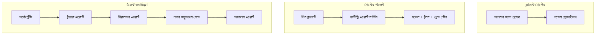
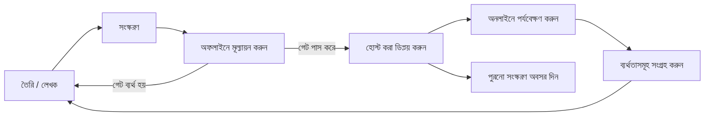
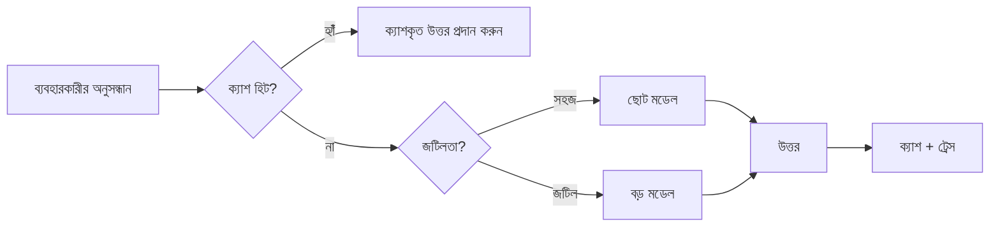
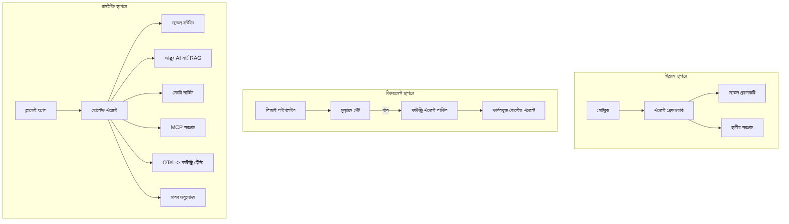

# Microsoft Foundry দিয়ে স্কেলেবল এজেন্ট মোতায়েন


এখন পর্যন্ত কোর্সে আপনি এমন এজেন্ট গঠন করেছেন যা আপনার ল্যাপটপে, একটি নোটবুকের ভিতরে, `az login` এবং কিছু পরিবেশ ভেরিয়েবলের মাধ্যমে চালিত হয়। শেখার জন্য এটি সঠিক পদ্ধতি। তবে হাজার হাজার গ্রাহক নির্ভর করে এমন একটি এজেন্ট ৩ টা রাতে চলানোর জন্য এটি সঠিক পদ্ধতি নয়।

এই পাঠটি "এটি আমার মেশিনে কাজ করে" এবং "এটি নির্ভরযোগ্য ও সাশ্রয়ী মূল্যে উৎপাদনে কাজ করে" এর মধ্যে ফাঁক সম্পর্কে। আমরা **Microsoft Foundry** এবং **Microsoft Foundry Agent Service** ব্যবহার করে সেই ফাঁক পূরণ করবো এবং একটি বাস্তব গ্রাহক সহায়তা এজেন্ট তৈরি করবো যেটিতে টুল, রিট্রিভাল, মেমোরি, মূল্যায়ন এবং মনিটরিং থাকবে।

## পরিচিতি

এই পাঠে আলোচনা করা হবে:

- একটি **প্রোটোটাইপ এজেন্ট** এবং একটি **মোতায়েনকৃত এজেন্ট** এর মধ্যে পার্থক্য, এবং কেন ট্রানজিশন মূলত মডেলের *পারিপার্শ্ব* বিষয়।
- এজেন্টের জন্য **মোতায়েন প্যাটার্ন**: ক্লায়েন্ট-হোস্টেড, সার্ভিস-হোস্টেড (হোস্টেড এজেন্টস), এবং ওয়ার্কফ্লো-অর্কেস্ট্রেটেড।
- Microsoft Foundry-তে **এজেন্ট জীবচক্র** — তৈরি, সংস্করণ, মোতায়েন, মূল্যায়ন, পর্যবেক্ষণ, অবসর।
- **স্কেলিং কৌশল**: মডেল রাউটিং, ক্যাশিং, কনকারেন্সি, এবং স্টেটলেস ডিজাইন।
- OpenTelemetry এবং Foundry ট্রেসিং সহ **পর্যবেক্ষণযোগ্যতা**।
- মডেল নির্বাচন, রাউটিং, এবং মূল্যায়ন গেটের মাধ্যমে **খরচ অপ্টিমাইজেশন**।
- **এন্টারপ্রাইজ বিবেচনা**: গভর্নেন্স, মানব অনুমোদন, এবং উৎপাদনে MCP সার্ভার নিরাপদে চালানো।

## শেখার লক্ষ্যসমূহ

এই পাঠ সম্পন্ন করার পর আপনি জানতে পারবেন কিভাবে:

- নির্দিষ্ট এজেন্ট ওয়ার্কলোডের জন্য সঠিক মোতায়েন প্যাটার্ন নির্বাচন করবেন।
- একটি এজেন্ট Microsoft Foundry Agent Service-এ মোতায়েন করবেন যাতে এটি সংস্কৃত, গভর্নড এবং পর্যবেক্ষণযোগ্য হয়।
- ট্রেসিংয়ের জন্য এজেন্টে ইনস্ট্রুমেন্টেশন করবেন এবং প্রতিটি রিলিজের আগে একটি মূল্যায়ন পাইপলাইন সংযুক্ত করবেন।
- মডেল রাউটিং এবং ক্যাশিং প্রয়োগ করবেন যাতে স্কেলে ল্যাটেন্সি ও খরচ নিয়ন্ত্রণে থাকে।
- উচ্চ ঝুঁকিপূর্ণ কাজের জন্য মানব অনুমোদন গেট যোগ করবেন এবং MCP সার্ভারকে উৎপাদন-নিরাপদভাবে ইন্টিগ্রেট করবেন।

## পূর্বশর্ত

এই পাঠে ধরে নেওয়া হয়েছে আপনি পূর্ববর্তী পাঠগুলো সম্পন্ন করেছেন এবং নিম্নলিখিত বিষয়ে স্বাচ্ছন্দ্য বোধ করেন:

- [Microsoft Agent Framework](../14-microsoft-agent-framework/README.md) দিয়ে এজেন্ট তৈরি করা (পাঠ ১৪)।
- [টুল ব্যবহার](../04-tool-use/README.md) (পাঠ ৪) এবং [Agentic RAG](../05-agentic-rag/README.md) (পাঠ ৫)।
- [এজেন্ট মেমোরি](../13-agent-memory/README.md) (পাঠ ১৩) এবং [Agentic Protocols / MCP](../11-agentic-protocols/README.md) (পাঠ ১১)।
- [পর্যবেক্ষণযোগ্যতা এবং মূল্যায়ন](../10-ai-agents-production/README.md) (পাঠ ১০) — এই পাঠ সরাসরি এর উপর ভিত্তি করে।

এছাড়াও আপনার প্রয়োজন:

- একটি **Azure সাবস্ক্রিপশন** এবং একটি **Microsoft Foundry প্রজেক্ট** যার অন্তত একটি মোতায়েনকৃত চ্যাট মডেল রয়েছে।
- **Azure CLI** প্রমাণীকরণ করা (`az login`)।
- Python 3.12+ এবং রিপোজিটরির [`requirements.txt`](../../../requirements.txt) প্যাকেজসমূহ।

## প্রোটোটাইপ থেকে প্রোডাকশনে: আসলে কি পরিবর্তন হয়

একটি প্রোটোটাইপ এজেন্ট এবং একটি প্রোডাকশন এজেন্ট একই মূল লুপ শেয়ার করে — যুক্তি তর্ক করা, টুল ডাকা, প্রতিক্রিয়া দেওয়া। পরিবর্তন হয় ওই লুপের চারপাশে যা মোড়ানো থাকে। মডেল প্রোডাকশন এজেন্টের প্রায় ২০%; অন্য ৮০% হল অপারেশনাল কাঠামো।

| বিষয় | প্রোটোটাইপ | প্রোডাকশন |
| --- | --- | --- |
| **হোস্টিং** | আপনার নোটবুকে চলে | হোস্টেড সার্ভিস হিসেবে চলে, সংস্কৃত এবং রোল আউট করা হয় |
| **পরিচয়** | আপনার `az login` টোকেন | স্কোপড RBAC সহ ম্যানেজড পরিচয় |
| **অবস্থা** | ইন-মেমোরি, রিস্টার্টে হারিয়ে যায় | বহির্মুখী (থ্রেড স্টোর, মেমোরি সার্ভিস) |
| **ব্যার্থতা** | আপনি ট্রেসব্যাক দেখেন | পুনরায় চেষ্টা, ফেলব্যাক, ডেড-লেটার, অ্যালার্ট |
| **খরচ** | "কয়েক সেন্ট" | প্রতি অনুরোধ ট্র্যাক, রাউট, ক্যাশ, বাজেট নির্ধারিত |
| **গুণগত মান** | আপনি ফলাফল চোখে যাচাই করেন | প্রতিটি রিলিজের আগে স্বয়ংক্রিয়ভাবে মূল্যায়ন করা হয় |
| **বিশ্বাস** | প্রতিটি কাজ আপনি অনুমোদন করেন | ঝুঁকিপূর্ণ কাজের জন্য নীতি + মানব-ইন-দ্য-লুপ |

এই তালিকাটি মনে রাখুন। প্রতিটি পরবর্তী অংশ এই সারিগুলোর মধ্যে একটির সাথে সম্পর্কিত।

## এজেন্ট মোতায়েন প্যাটার্নসমূহ

তিনটি প্যাটার্ন আছে, প্রায়শই একসাথে ব্যবহার করা হয়।

### ১. ক্লায়েন্ট-হোস্টেড এজেন্টস

এজেন্ট অবজেক্ট *আপনার* অ্যাপ্লিকেশন প্রসেসের ভিতরে থাকে। আপনার কোড সরাসরি মডেল প্রদানকারীর সাথে যোগাযোগ করে; যুক্তি লুপ আপনার সার্ভিসে চলে। পূর্ববর্তী সব পাঠই এই পদ্ধতিটি অনুসরণ করেছে।

- **এটি ব্যবহার করুন যখন** আপনি লুপের সম্পূর্ণ নিয়ন্ত্রণ চান, কাস্টম মিডলওয়্যার দরকার অথবা এজেন্টেক বিদ্যমান ব্যাকএন্ডের মধ্যে এমবেড করছেন।
- **ব্যবহারিক অসুবিধা**: স্কেলিং, অবস্থা, স্থিতিস্থাপকতা নিজেরাই ম্যানেজ করতে হবে।

### ২. হোস্টেড এজেন্টস (Foundry Agent Service)

এজেন্ট Microsoft Foundry-তে *একটি রিসোর্স হিসেবে নিবন্ধিত* হয়। Foundry যুক্তি লুপ হোস্ট করে, থ্রেড সংরক্ষণ করে, কনটেন্ট সেফটি ও RBAC প্রয়োগ করে, এবং এজেন্টকে Foundry পোর্টালে দৃশ্যমান করে তোলে। আপনার অ্যাপ একটি পাতলা ক্লায়েন্টে পরিণত হয় যারা থ্রেড তৈরি করে এবং প্রতিক্রিয়া পড়ে।

- **এটি ব্যবহার করুন যখন** আপনি স্থায়িত্ব, অন্তর্নির্মিত পর্যবেক্ষণযোগ্যতা, গভর্নেন্স, এবং কম অপারেশনাল সার্ফেস এরিয়া চান।
- **ব্যবহারিক অসুবিধা**: নিয়ন্ত্রিত রানটাইমে কম নিম্নস্তরের নিয়ন্ত্রণ।

### ৩. এজেন্ট ওয়ার্কফ্লোস

একাধিক এজেন্ট (এবং টুল) স্পষ্ট নিয়ন্ত্রণ প্রবাহ সহ একটি গ্রাফে গঠিত — ধারাবাহিক ধাপ, শাখা, মানব অনুমোদন নোড, এবং টেকসই চেকপয়েন্ট যা বিরতি এবং পুনরায় শুরু করতে পারে। এটি Microsoft Agent Framework-এর **Workflows** ক্ষমতা যা মোতায়েন স্কেলে প্রয়োগ করা হয়।

- **এটি ব্যবহার করুন যখন** একটি একক কাজ কয়েকটি বিশেষায়িত এজেন্টকে কেন্দ্র করে অথবা মাঝখানে একটি অনুমোদন ধাপ দরকার হয়।
- **ব্যবহারিক অসুবিধা**: বেশি চলমান অংশ; অর্কেস্ট্রেশন স্তরের পর্যবেক্ষণযোগ্যতা প্রয়োজন।



## Microsoft Foundry-তে এজেন্ট জীবচক্র

এজেন্ট মোতায়েন একটি এককালীন `push` নয়। এটি একটি লুপ, এবং এটি একটি সফটওয়্যার রিলিজ চক্রের মতো কারণ আসলে তাই।



মূল ধারণা, [Lesson 10](../10-ai-agents-production/README.md) থেকে নেওয়া হয়েছে: **অফলাইন মূল্যায়ন একটি গেট, পরে ভাবনার বিষয় নয়।** একটি নতুন এজেন্ট সংস্করণ আপনার মূল্যায়ন দিকনির্দেশগুলি পাস না করলে চালু হয় না। অনলাইন পর্যবেক্ষণ তারপরে প্রকৃত ব্যর্থতাগুলোকে আপনার অফলাইন টেস্ট সেটে ফেরত দেয়। এইটা পুরো লুপ।

## স্কেলিং কৌশলসমূহ

একটি এজেন্টের স্কেলিং স্টেটলেস ওয়েব এপিআই এর স্কেলিং থেকে আলাদা, কারণ প্রতিটি অনুরোধ অনেক ব্যয়বহুল মডেল এবং টুল কল ট্রিগার করতে পারে। চারটি কৌশল বেশিরভাগ লোড বহন করে।

**স্টেটলেস রিকোয়েস্ট হ্যান্ডলিং।** আপনার প্রসেস মেমোরিতে কোনো ব্যবহারকারীর অবস্থা রাখবেন না। কথোপকথনের থ্রেডগুলো Foundry থ্রেড স্টোর বা একটি মেমোরি সার্ভিসে সংরক্ষণ করুন যাতে যেকোনো ইন্সট্যান্স যেকোনো অনুরোধ সামলাতে পারে। এভাবেই আপনি অনুভূমিক স্কেলিং পারবেন — ইন্সট্যান্স যোগ করুন, স্টিকি সেশন ছাড়াই।

**মডেল রাউটিং।** সকল অনুরোধ আপনার সবচেয়ে সক্ষম (এবং সবচেয়ে ব্যয়বহুল) মডেলের প্রয়োজন হয় না। সহজ অনুরোধ — উদ্দেশ্য শ্রেণীবিন্যাস, সংক্ষিপ্ত তথ্যপূর্ণ উত্তর — ছোট, দ্রুত মডেলে পাঠান, এবং বড় মডেল শুধুমাত্র প্রকৃত যুক্তির জন্য সংরক্ষণ করুন। Foundry-এর **Model Router** আপনার জন্য এটি করতে পারে, অথবা আপনি নিজেই হালকা ওজনের শ্রেণীবিন্যস্তকারী বাস্তবায়ন করতে পারেন। ল্যাবে আপনি DIY সংস্করণ তৈরি করবেন।

**প্রতিক্রিয়া ক্যাশিং।** অনেক সাপোর্ট প্রশ্ন প্রায় ডুপ্লিকেট ("আমি কীভাবে আমার পাসওয়ার্ড রিসেট করব?")। সাধারণ প্রশ্নের উত্তর ক্যাশ করুন এবং মডেল ছাড়াই সরবরাহ করুন। এমনকি সামান্য ক্যাশ হিট রেটও খরচ এবং ল্যাটেন্সি উল্লেখযোগ্যভাবে কমায়।

**কনকারেন্সি এবং ব্যাকপ্রেশার।** মডেল প্রদানকারীদের রেট লিমিট থাকে। আপনার কনকারেন্সি সীমাবদ্ধ করুন, এক্সপোনেনশিয়াল ব্যাকঅফ সহ পুনরায় চেষ্টা ব্যবহার করুন, এবং সুন্দরভাবে ব্যর্থ হন (কিউড "আমরা কাজ করছি" প্রতিক্রিয়া ৫০০ এর চেয়ে ভালো)।



## উৎপাদনে পর্যবেক্ষণযোগ্যতা

আপনি যা দেখতে পারেন না তা পরিচালনা করতে পারবেন না। পাঠ ১০-এ আলোচিত হয়েছে, Microsoft Agent Framework **OpenTelemetry** ট্রেস পার্থক্য করে — প্রতিটি মডেল কল, টুল ইনভোকেশন এবং ওর্কেস্ট্রেশন ধাপ একটি স্প্যানে পরিণত হয়। উৎপাদনে আপনি ঐ স্প্যানগুলো Microsoft Foundry (অথবা যেকোনো OTel-সঙ্গত ব্যাকএন্ড) এ এক্সপোর্ট করেন যাতে আপনি:

- একটি একক গ্রাহকের অভিযোগ সব মডেল এবং টুল কল জুড়ে ট্রেস করতে পারেন।
- সময়ের সাথে প্রতি অনুরোধের পি৫০/পি৯৫ ল্যাটেন্সি এবং খরচ পর্যবেক্ষণ করতে পারেন।
- আপনার ব্যবহারকারী (অথবা আপনার আর্থিক দল) বুঝার আগেই ত্রুটি-হার উত্থান এবং খরচের অসামঞ্জস্য আলার্ম করতে পারেন।

```python
from agent_framework.observability import get_tracer

tracer = get_tracer()

with tracer.start_as_current_span("support_request") as span:
    span.set_attribute("customer.tier", "enterprise")
    span.set_attribute("routed.model", "gpt-4.1-mini")
    # এজেন্টের কার্য সম্পাদন স্বয়ংক্রিয়ভাবে এই স্প্যানে ট্রেস করা হয়
```

`customer.tier` এবং `routed.model` এর মতো বৈশিষ্ট্যগুলো একটি ট্রেসের দেয়ালকে উত্তরযোগ্য প্রশ্নে রূপান্তর করে ("এন্টারপ্রাইজ গ্রাহকরা কি ছোট মডেলে খুব বেশি রাউট করা হচ্ছে?")।

## খরচ অপ্টিমাইজেশন

উৎপাদন এজেন্টের খরচ মূলত টোকেন দ্বারা নির্ধারিত। প্রভাব অনুযায়ী তিনটি লিভার:

1. **মডেল সঠিক আকারে নির্বাচন করুন।** একটি ছোট মডেল যা আপনার মূল্যায়ন গেট পাস করে তা প্রায়শই একটি বড় মডেলের চেয়ে সস্তা যা পাস করে। নিরাপত্তার স্বার্থে স্বয়ংক্রিয়ভাবে বড় মডেলের পরিবর্তে মূল্যায়ন ব্যবহার করে প্রমাণ করুন ছোট মডেল যথেষ্ট ভাল।
2. **জটিলতার ভিত্তিতে রাউট করুন।** উপরে যেমন - বড় মডেলের মূল্য শুধুমাত্র এমন অনুরোধের জন্য দিন যা বড় মডেলের যুক্তি প্রয়োজন।
3. **উগ্রভাবে ক্যাশ করুন।** সবচেয়ে সস্তা মডেল কল হল আপনি যে কল কখনো করছেন না।

মূল্যায়ন গেট ও খরচ নিয়ন্ত্রণ দুটি দৃষ্টিভঙ্গি থেকে একই শৃঙ্খলা: মূল্যায়ন আপনাকে *গুণগত মানের ন্যূনতম স্তর* বলে, রাউটিং এবং ক্যাশিং আপনাকে ঐ স্তরের *খরচ* যতটা সম্ভব কাছাকাছি রাখে।

## এন্টারপ্রাইজ মোতায়েন বিবেচনা

**গভর্নেন্স।** Hosted Agents Foundry-এর RBAC, কনটেন্ট সেফটি, এবং অডিট লগিং উত্তরাধিকার সূত্রে পায়। প্রতিটি এজেন্টকে একটি managed identity দিন যার কমপক্ষে প্রয়োজনীয় প্রবেশাধিকার আছে — জ্ঞান ভান্ডারে শুধু পড়ার, টিকেটিং API-তে স্কোপড প্রবেশাধিকার, এর বেশি নয়।

**মানব-ইন-দ্য-লুপ।** কিছু কাজ সরাসরি স্বয়ংক্রিয় করা খুব গুরুতর — রিফান্ড ইস্যু করা, অ্যাকাউন্ট মুছা, আইনগত দলের কাছে উত্তোরণ। Microsoft Agent Framework **অনুমোদন-প্রয়োজনীয়** টুলগুলিকে সমর্থন করে: এজেন্ট কাজ প্রস্তাব করে, কার্যকরীতা বিরতি দেয়, একজন মানুষ অনুমোদন বা প্রত্যাখ্যান করে, ওয়ার্কফ্লো পুনরায় শুরু হয়। আপনি [Lesson 6](../06-building-trustworthy-agents/README.md) তে এটির প্রাথমিক রূপ দেখেছেন; এখানে আপনি এটিকে মোতায়েন করবেন।

**MCP উৎপাদনে।** [MCP](../11-agentic-protocols/README.md) আপনার এজেন্টকে একটি স্ট্যান্ডার্ড ইন্টারফেসের মাধ্যমে বহিরাগত টুল ব্যবহার করতে দেয়। উৎপাদনে প্রতিটি MCP সার্ভারকে অবিশ্বাসযোগ্য সীমানা হিসেবে বিবেচনা করুন: সার্ভার সংস্করণ পিন করুন, একটি স্কোপড পরিচয়ে চালান, এর আউটপুট যাচাই করুন, এবং এর সাথে সিক্রেট কখনো শেয়ার করবেন না। MCP সার্ভার একটি নির্ভরশীলতা, এবং নির্ভরশীলতাগুলো প্যাচ, অডিট এবং রেট-লিমিটেড হয়।



ঐ তিনটি চিত্র — ডেভেলপমেন্ট, মোতায়েন, রানটাইম — একই এজেন্ট জীবনের তিন ধাপ। পরবর্তী ল্যাবটি আপনাকে এটি গঠন শেখাবে।

## হাতে কলমে ল্যাব: একটি উৎপাদন-সাজানো গ্রাহক সহায়তা এজেন্ট

ওপেন করুন [`code_samples/16-python-agent-framework.ipynb`](./code_samples/16-python-agent-framework.ipynb) এবং শুরু থেকে শেষ পর্যন্ত কাজ করুন। আপনি একটি **Contoso গ্রাহক সহায়তা এজেন্ট** গঠন করবেন যার প্রতিটি উৎপাদন উদ্বেগ সংযুক্ত থাকবে:

১. **টুল কলিং** — অর্ডার স্ট্যাটাস চেক এবং সাপোর্ট টিকিট খোলা।
২. **RAG** — জ্ঞান ভাণ্ডার থেকে নীতি সম্পর্কিত প্রশ্নের উত্তর (Azure AI Search, ইন-মেমোরি ব্যাকআপ সহ যাতে নোটবুক সার্চ রিসোর্স ছাড়াই চলে)।
৩. **মেমোরি** — কথোপকথনের মধ্যে গ্রাহককে স্মরণ রাখা।
৪. **মডেল রাউটিং** — একটি জটিলতা শ্রেণীবিন্যাসকারী প্রতিটি অনুরোধকে ছোট বা বড় মডেলে রাউট করে।
৫. **প্রতিক্রিয়া ক্যাশিং** — পুনরাবৃত্ত প্রশ্ন ক্যাশ থেকে সরবরাহ করা হয়।
৬. **মানব অনুমোদন** — নির্দিষ্ট পরিমাণের উপরে রিফান্ডের জন্য মানব অনুমোদন বাধ্যতামূলক।
৭. **মূল্যায়ন পাইপলাইন** — একটি ছোট অফলাইন টেস্ট সেট এজেন্টের স্কোর করে এবং রিলিজ গেট হিসেবে কাজ করে।
৮. **পর্যবেক্ষণযোগ্যতা** — প্রতিটি অনুরোধে OpenTelemetry ট্রেসিং।

### ওয়াকথ্রু

নোটবুকটি এমনভাবে গঠিত যাতে প্রতিটি উৎপাদন উদ্বেগ আলাদা, চালানোর উপযোগী অংশ হয়। এর কেন্দ্রে রয়েছে রাউটিং-প্লাস-ক্যাশিং অনুরোধ হ্যান্ডলার:

```python
async def handle_support_request(query: str, customer_id: str) -> str:
    # 1. যখন সম্ভব ক্যাশ থেকে পরিবেশন করুন।
    cached = response_cache.get(normalize(query))
    if cached:
        return cached

    # 2. ব্যয় নিয়ন্ত্রণে জটিলতা অনুযায়ী রুট নির্ধারণ করুন।
    model = "gpt-4.1-mini" if is_simple(query) else "gpt-4.1"

    # 3. পর্যবেক্ষণের জন্য ট্রেস স্প্যানে এজেন্ট চালান।
    with tracer.start_as_current_span("support_request") as span:
        span.set_attribute("routed.model", model)
        span.set_attribute("customer.id", customer_id)
        response = await support_agent.run(query, model=model)

    # 4. ক্যাশ করুন এবং ফিরে আসুন।
    response_cache.set(normalize(query), response.text)
    return response.text
```

রিলিজের গেট দেখাচ্ছে এমন মূল্যায়ন:

```python
async def evaluation_gate(agent, test_cases, threshold: float = 0.8) -> bool:
    passed = 0
    for case in test_cases:
        result = await agent.run(case["input"])
        if score_response(result.text, case["expected"]) >= 0.8:
            passed += 1
    pass_rate = passed / len(test_cases)
    print(f"Evaluation pass rate: {pass_rate:.0%} (gate: {threshold:.0%})")
    return pass_rate >= threshold  # শুধুমাত্র গেট পাশ করলে ডেপ্লয় করুন
```

প্রতিটি লাইন পড়ুন — নোটবুকটি উৎস-কলের পিছনে কিছু আড়াল না রেখে প্রাথমিক অংশগুলো ছোট করে রাখে।

## মোতায়েন করা এজেন্টকে স্মোকে টেস্ট দিয়ে যাচাই করা

উপরের মূল্যায়ন গেট আপনার এজেন্ট অবজেক্টের বিরুদ্ধে *অফলাইন* চলে। একবার এজেন্ট হোস্টেড এজেন্ট হিসেবে মোতায়েন হলে, আরেকটি, আরও সস্তা পরীক্ষা প্রয়োজন: **মোতায়েনকৃত এন্ডপয়েন্ট কি আসলেই উত্তর দিচ্ছে?**

"সফল" মোতায়েন কেবলমাত্র কন্ট্রোল প্লেন সংজ্ঞাকে গ্রহণ করেছে বলে প্রমাণ করে — এটি প্রমাণ করে না যে এজেন্ট উত্তর দেয়। একটি অনুপস্থিত নির্ভরশীলতা, ভুল মডেল রাউটিং, অথবা একটি মেয়াদোত্তীর্ণ সংযোগ এমন একটি সবুজ মোতায়েন তৈরি করতে পারে যা কিছুই ফেরত দেয় না। একটি **স্মোক টেস্ট** এটি কয়েক সেকেন্ডে, প্রতিটি মোতায়েনে ধরতে পারে, পূর্ণ মূল্যায়নের খরচ ছাড়াই।

এই রিপোজিটরি [AI Smoke Test](https://github.com/marketplace/actions/ai-smoke-test) GitHub Action-এ তৈরি একটি প্রস্তুত ব্যবহারযোগ্য স্মোক-টেস্ট পাইপলাইন সরবরাহ করে:

- **ক্যাটালগ** — [`tests/lesson-16-smoke-tests.json`](../../../tests/lesson-16-smoke-tests.json) হলো Contoso সাপোর্ট এজেন্টের জন্য প্রম্পট এবং_ASSERTIONS_ (ভিত্তিক নীতি উত্তর, অর্ডার লুকআপ, বিষয়ের মধ্যে থাকা, এবং বহু-টানথ্রেড ধারাবাহিকতা)। অন্যান্য পাঠের এজেন্টের জন্য ক্যাটালগ এটির পাশেই থাকে — দেখুন [`tests/README.md`](../tests/README.md)।
- **ওয়ার্কফ্লো** — [`.github/workflows/smoke-test.yml`](../../../.github/workflows/smoke-test.yml) Azure OIDC দিয়ে লগ ইন করে এবং প্রতিটি প্রম্পট এজেন্টের Responses এন্ডপয়েন্টে পোস্ট করে, কোনো_ASSERTION_ মিস হলে কাজ ব্যর্থ হয়।

```yaml
- name: Smoke-test hosted agent
  uses: JFolberth/ai-smoketest@v1
  with:
    project_endpoint: ${{ inputs.project_endpoint }}
    agent_name: ContosoSupportAgent
    tests_file: tests/lesson-16-smoke-tests.json
```


আপনার এজেন্ট মোতায়েন হওয়ার পরে **Actions** ট্যাব থেকে এটি চালান, আপনার Foundry প্রকল্পের endpoint এবং এজেন্টের নাম সরবরাহ করে। সম্মিলিত পরিচয় (federated identity) এর Foundry প্রকল্প স্কোপে **Azure AI User** ভূমিকা থাকতে হবে। স্তরগুলিকে একটি পিরামিড হিসেবে ভাবুন: প্রতিটি মোতায়েনের সময় ধোঁয়া পরীক্ষা (পোঁছানো যায় এবং সাড়া দেয়?) চলে, প্রচার করার আগে অফলাইন মূল্যায়ন (পর্যাপ্ত ভাল কি?) চলে, এবং অনলাইন মূল্যায়ন (এটি বাস্তবে কেমন কাজ করছে?) অবিরত চলে।

## জ্ঞান পরীক্ষা

অ্যাসাইনমেন্টে যাওয়ার আগে আপনার বোঝাপড়া পরীক্ষা করুন।

**১. একটি প্রোডাকশন এজেন্টের মোডেলের আনুমানিক অংশ কতটুকু এবং বাকিটা কি?**

<details>
<summary>উত্তর</summary>

মোডেল হলো সিস্টেমের একটি ছোট অংশ — সাধারণত প্রায় ২০% বলা হয়ে থাকে। বাকিটা হলো অপারেশনাল কাঠামো: হোস্টিং ও সংস্করণ নিয়ন্ত্রণ, পরিচয় এবং RBAC, বাহ্যিক রাজ্য, ব্যর্থতা পরিচালনা, খরচ ট্র্যাকিং, মূল্যায়ন, এবং মানুষের নিয়ন্ত্রণ। প্রোডাকশনে যাওয়া মূলত যুক্তি লুপের চারপাশে সবকিছু তৈরি করার ব্যাপার।
</details>

**২. কখন আপনি ক্লায়েন্ট-হোস্টেড এজেন্টের পরিবর্তে Hosted Agent নির্বাচন করবেন?**

<details>
<summary>উত্তর</summary>

যখন আপনি একটি ম্যানেজড রানটাইম চান যার অন্তর্নির্মিত স্থায়ীত্ব (অপসরে থাকা থ্রেড ও পুনরায় শুরু করা যায়), পর্যবেক্ষণযোগ্যতা, বিষয়বস্তু নিরাপত্তা, এবং RBAC থাকে, এবং আপনি কিছুটা নিম্ন স্তরের নিয়ন্ত্রণ ছেড়ে দিয়ে কম অপারেশনাল জটিলতা চান। ক্লায়েন্ট-হোস্টেড যখন পছন্দযোগ্য যখন আপনাকে লুপের পূর্ণ নিয়ন্ত্রণ প্রয়োজন বা আপনি এজেন্টকে একটি বিদ্যমান ব্যাকএন্ডে এম্বেড করছেন।
</details>

**৩. কেন একটি স্কেলযোগ্য এজেন্টকে তার নিজস্ব প্রক্রিয়া মেমরিতে স্টেটলেস হতে হবে?**

<details>
<summary>উত্তর</summary>

যাতে যেকোনো ইনস্ট্যান্স যেকোনো অনুরোধ সামলাতে পারে, যা হরিজন্টাল স্কেলিংকে স্টিকি সেশন ছাড়া সম্ভব করে। ব্যবহারকারীর আলাপের রাজ্য একটি থ্রেড স্টোর বা মেমরি সার্ভিসে বাহ্যিক করা হয়। যদি রাজ্য প্রক্রিয়া মেমরিতে থাকে, তবে রিস্টার্টের সময় আপনি এটি হারাবেন এবং লোড সুষ্ঠুভাবে বিতরণ করতে পারবেন না।
</details>

**৪. মোডেল রাউটিং কোন সমস্যা সমাধান করে, এবং এটি মূল্যায়নের সঙ্গে কিভাবে সম্পর্কযুক্ত?**

<details>
<summary>উত্তর</summary>

রাউটিংটি সাধারণ অনুরোধগুলোকে ছোট, সস্তা, দ্রুত মোডেলে পাঠায় এবং বড় মোডেলটি প্রকৃত যুক্তি নিরূপণের জন্য রেখে দেয়, যা উভয়ই সময়ক্ষেপণ এবং খরচ নিয়ন্ত্রণ করে। এটি মূল্যায়নের সঙ্গে সম্পর্কিত কারণ মূল্যায়ন প্রমাণ করে ছোট মোডেলটি একটি শ্রেণীর অনুরোধের জন্য যথেষ্ট ভালো — মূল্যায়ন ছাড়া রাউটিং হল অনুমান।
</details>

**৫. "মূল্যায়ন গেট" কী এবং এটি জীবনচক্রে কোথায় অবস্থান করে?**

<details>
<summary>উত্তর</summary>

একটি মূল্যায়ন গেট নতুন এজেন্ট সংস্করণের বিরুদ্ধে একটি অফলাইন পরীক্ষাসমূহ চালায় এবং পার হওয়ার হার একটি থ্রেশহোল্ড ছাড়ালে মোতায়েন বাধা দেয়। এটি জীবনচক্রে "সংস্করণ" এবং "মোতায়েন" এর মধ্যে থাকে, যা মুক্তির জন্য গুণমানকে একটি পূর্বশর্ত করে তোলে, পরিবহনের পর নয়।
</details>

**৬. কেন একটি MCP সার্ভারকে প্রোডাকশনে একটি অবিশ্বাসযোগ্য সীমানা হিসেবে বিবেচনা করা উচিত?**

<details>
<summary>উত্তর</summary>

কারণ এটি একটি বাহ্যিক নির্ভরতা যা আপনার এজেন্ট কল করে। আপনাকে এর সংস্করণ পিন করতে হবে, স্কোপড পরিচয়ে চালাতে হবে, এর আউটপুট যাচাই করতে হবে, হার-সীমাবদ্ধ করতে হবে, এবং এর প্রতি কোনো গোপনীয়তা প্রকাশ করা যাবে না — যা আপনি যেকোনো তৃতীয় পক্ষ নির্ভরতার ক্ষেত্রে অনুসরণ করেন। এর আউটপুট আপনার এজেন্টের যুক্তিতে প্রবাহিত হয়, তাই অমূল্যায়িত বিশ্বাস একটি নিরাপত্তা ঝুঁকি।
</details>

**৭. সাধারণত কোন একটি পরিবর্তন প্রোডাকশন এজেন্ট খরচে সবচেয়ে বড় প্রভাব ফেলে, এবং কেন?**

<details>
<summary>উত্তর</summary>

মোডেলের সঠিক আকার নির্ধারণ — সবচেয়ে ছোট মোডেল ব্যবহার করা যা এখনও আপনার মূল্যায়ন গেট পাস করে। খরচ টোকেন দ্বারা নিয়ন্ত্রিত হয়, এবং একটি ছোট মোডেল যা মানের মান পূরণ করে প্রায় সবসময় বড় মোডেল থেকে সস্তা। ক্যাচিং এবং রাউটিং খরচ আরও কমায়, তবে সঠিক মৌলিক মোডেল নির্বাচন সবচেয়ে বড় প্রথম-ক্রমের প্রভাব ফেলে।
</details>

**৮. `customer.tier` এবং `routed.model` এর মতো স্প্যান বৈশিষ্ট্যসমূহ পর্যবেক্ষণযোগ্যতায় কী ভূমিকা পালন করে?**

<details>
<summary>উত্তর</summary>

এগুলো কাঁচা ট্রেসগুলোকে জবাবযোগ্য ব্যবসায়িক প্রশ্নে রূপান্তর করে। বৈশিষ্ট্য ছাড়া আপনার কাছে একটি স্প্যানের প্রাচীর থাকে; এগুলো থাকলে আপনি জিজ্ঞাসা করতে পারেন "এন্টারপ্রাইজ গ্রাহকরা কি খুবই বেশি ছোট মোডেলে রাউট করা হচ্ছে?" অথবা "সবচেয়ে ধীর অনুরোধ কোন মোডেল সামলায়?" বৈশিষ্ট্য হলো কিভাবে আপনি আপনার অপারেশনের জন্য গুরুত্বপূর্ণ মাত্রাগুলোর ভিত্তিতে টেলিমেট্রি ভাগ করেন।
</details>

## অ্যাসাইনমেন্ট

ল্যাব থেকে গ্রাহক সাপোর্ট এজেন্ট নিয়ে এটিকে একটি বিশেষ পরিস্থিতির জন্য শক্তিশালী করুন: **একটি SaaS কোম্পানির সাবস্ক্রিপশন বিলিং সাপোর্ট এজেন্ট।**

আপনার জমা দেওয়া উচিত:

১. **টুলগুলো পরিবর্তন করুন** বিলিং-সম্পর্কিত টুল দিয়ে: `get_subscription_status`, `get_invoice`, এবং `issue_credit` (৫০ ডলারের বেশি ক্রেডিটের জন্য মানব অনুমোদন প্রয়োজন)।
২. **তিনটি RAG ডকুমেন্ট যোগ করুন** যা কোম্পানির রিফান্ড নীতি, বিলিং চক্র, এবং বাতিলকরণ নীতির ওপর ভিত্তি করে।
৩. **মূল্যায়ন সেট বাড়ান** অন্তত আটটি কেসের, যেখানে অন্তত দুইটি অবশ্যই মানব-অনুমোদন পাথ ট্রিগার করা উচিত, এবং নিশ্চিত করুন আপনার মূল্যায়ন গেট সঠিকভাবে পাস বা ফেল করে।
৪. **একটি খরচ প্রতিবেদন যোগ করুন**: এজেন্টের মধ্য দিয়ে দশটি মিশ্র অনুরোধ চালানোর পরে, প্রিন্ট করুন কতগুলো ছোট মোডেলে গেছে, কতগুলো বড় মোডেলে, এবং কতগুলো ক্যাচ থেকে পরিবতিত হয়েছে।

একটি ছোট প্যারাগ্রাফ লিখুন (একটি মার্কডাউন সেলে) যেখানে আপনি ব্যাখ্যা করবেন কোন মোডেল-রাউটিং নিয়ম আপনি বেছে নিয়েছেন এবং বাস্তব ট্রাফিক দিয়ে এটি কিভাবে যাচাই করবেন। কোনো একক সঠিক উত্তর নেই — আপনাকে মূল্যায়ন করা হবে যে প্রোডাকশন উদ্বেগগুলো সুনির্দিষ্টভাবে সংযুক্ত হয়েছে কিনা।

## সারসংক্ষেপ

এই পাঠে আপনি Microsoft Foundry দিয়ে একটি এজেন্টকে প্রোটোটাইপ থেকে প্রোডাকশনে নিয়ে গেছেন:

- প্রোডাকশনে যাওয়া মূলত মোডেলের চারপাশের **অপারেশনাল কাঠামো** সম্পর্কিত — হোস্টিং, পরিচয়, রাজ্য, ব্যর্থতা পরিচালনা, খরচ, গুণমান, এবং বিশ্বাস।
- আপনি তিনটি **মোতায়েন প্যাটার্ন** শিখেছেন — ক্লায়েন্ট-হোস্টেড, Hosted Agents, এবং Agent Workflows — এবং কখন কোনটি মানায়।
- আপনি **এজেন্ট জীবনচক্র** অনুসরণ করেছেন, যেখানে অফলাইন **মূল্যায়ন একটি মুক্তির গেট হিসেবে কাজ করে** এবং অনলাইন পর্যবেক্ষণ ব্যর্থতাকে পরীক্ষাসমূহে ফেরত পাঠায়।
- আপনি **স্কেলিং কৌশল** প্রয়োগ করেছেন — স্টেটলেস ডিজাইন, মোডেল রাউটিং, ক্যাচিং, এবং সীমাবদ্ধ সমান্তরালতা — এবং তাদেরকে **খরচ অপ্টিমাইজেশনের সঙ্গে** সংযুক্ত করেছেন।
- আপনি **এন্টারপ্রাইজ নিয়ন্ত্রণগুলি** সংযুক্ত করেছেন: RBAC, মানুষ-কেন্দ্রিক অনুমোদন, এবং প্রোডাকশন-নিরাপদ MCP একত্রীকরণ।
- আপনি একটি **প্রোডাকশন-সিদ্ধ গ্রাহক সাপোর্ট এজেন্ট** তৈরি করেছেন যা এই সব উদ্বেগকে রানযোগ্য কোডে বাঁধে।

পরবর্তী পাঠটি বিপরীত যাত্রা করবে: ক্লাউডে এজেন্ট স্কেল করার পরিবর্তে, আপনি তাদের একটি একক ডেভেলপার মেশিনে করে সম্পূর্ণরূপে লোকালি চালাবেন।

## অতিরিক্ত উৎস

- <a href="https://learn.microsoft.com/azure/ai-foundry/what-is-azure-ai-foundry" target="_blank">Microsoft Foundry ডকুমেন্টেশন</a>
- <a href="https://learn.microsoft.com/azure/ai-foundry/agents/overview" target="_blank">Microsoft Foundry Agent Service ওভারভিউ</a>
- <a href="https://aka.ms/ai-agents-beginners/agent-framework" target="_blank">Microsoft Agent Framework</a>
- <a href="https://learn.microsoft.com/azure/ai-foundry/concepts/model-router" target="_blank">Microsoft Foundry-তে Model Router</a>
- <a href="https://learn.microsoft.com/azure/search/search-what-is-azure-search" target="_blank">Azure AI Search</a>
- <a href="https://opentelemetry.io/" target="_blank">OpenTelemetry</a>
- <a href="https://github.com/marketplace/actions/ai-smoke-test" target="_blank">AI Smoke Test GitHub Action</a>
- <a href="https://modelcontextprotocol.io/" target="_blank">Model Context Protocol (MCP)</a>

## পূর্ববর্তী পাঠ

[Building Computer Use Agents (CUA)](../15-browser-use/README.md)

## পরবর্তী পাঠ

[Creating Local AI Agents](../17-creating-local-ai-agents/README.md)

---

<!-- CO-OP TRANSLATOR DISCLAIMER START -->
**অস্বীকৃতি**:
এই নথিটি AI অনুবাদ পরিষেবা [Co-op Translator](https://github.com/Azure/co-op-translator) ব্যবহার করে অনূদিত হয়েছে। যদিও আমরা শুদ্ধতার জন্য চেষ্টা করি, অনুগ্রহ করে মনে রাখবেন যে স্বয়ংক্রিয় অনুবাদে ত্রুটি বা অসঙ্গতি থাকতে পারে। মূল নথিটি তার স্বভাষায় কর্তৃত্বপূর্ণ উৎস হিসেবে বিবেচিত হওয়া উচিত। গুরুত্বপূর্ণ তথ্যের জন্য পেশাদার মানব অনুবাদ সুপারিশ করা হয়। এই অনুবাদের ব্যবহারে প্রয়োজনীয় ভুল বোঝাবুঝি বা ভুল ব্যাখ্যার জন্য আমরা দায়বদ্ধ নই।
<!-- CO-OP TRANSLATOR DISCLAIMER END -->