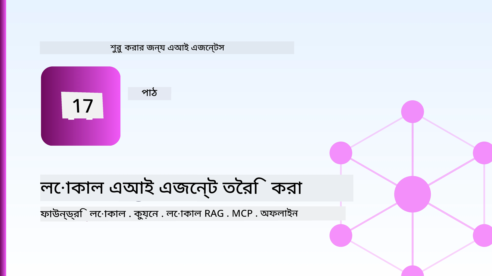
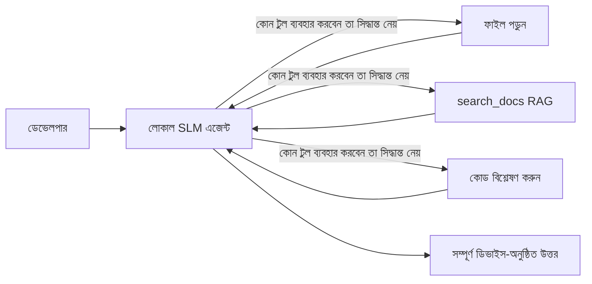
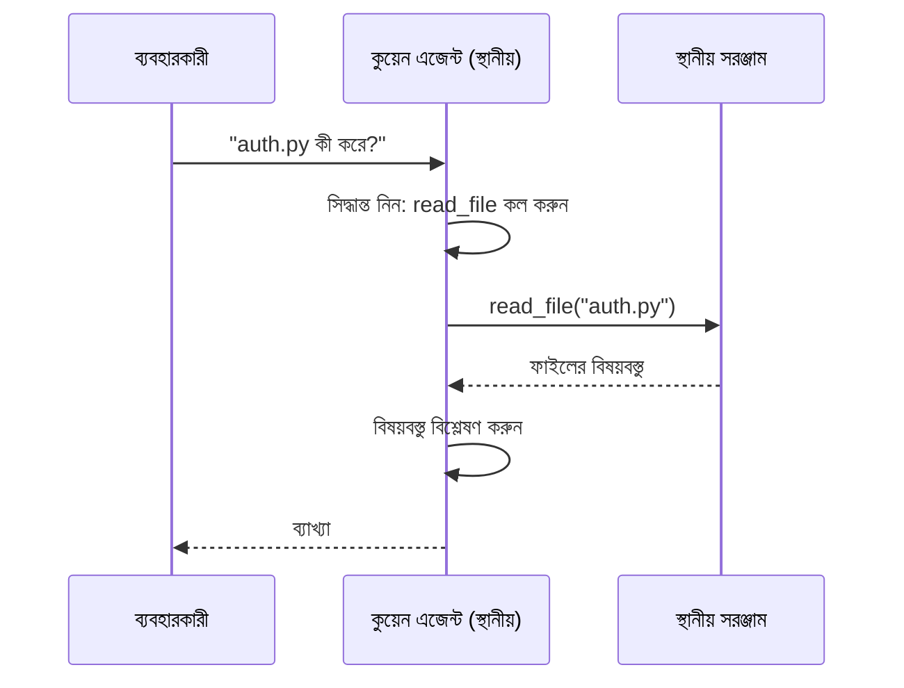
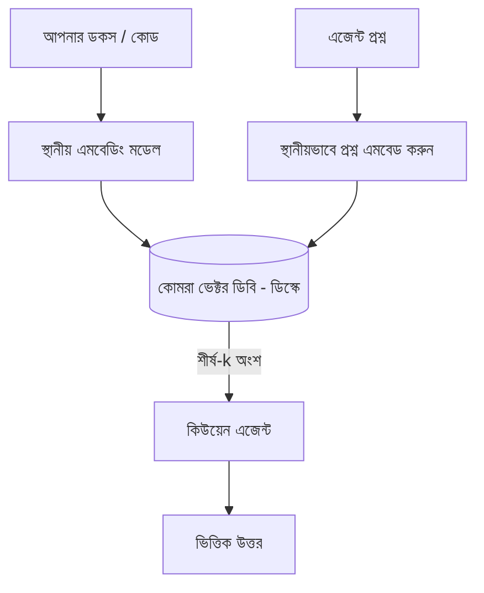
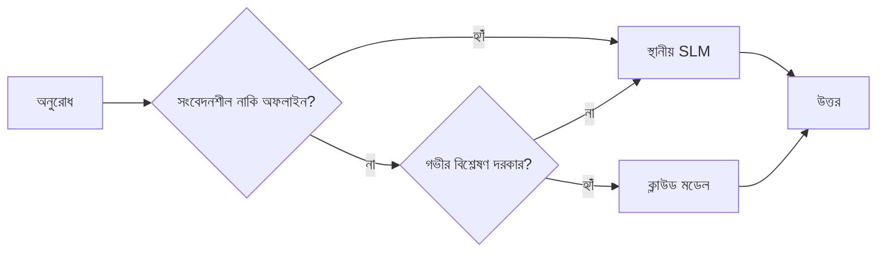

# মাইক্রোসফ্ট ফাউন্ড্রি লোকাল এবং কুউয়েন ব্যবহার করে লোকাল AI এজেন্ট তৈরি করা



পূর্বের পাঠে এজেন্টগুলো *আপ* অর্থাৎ ক্লাউডে স্কেল করা হয়েছিল। এইটাতে এজেন্টগুলোকে একটি একক মেশিনে *ডাউন* আনা হয়েছে। পাঠ শেষে আপনার কাছে একটি কাজ করা ইঞ্জিনিয়ারিং সহকারী থাকবে যা যুক্তি করে, সরঞ্জাম কল করে, আপনার ফাইলগুলো পড়ে এবং আপনার ডকুমেন্টেশন অনুসন্ধান করে — **একটুও ক্লাউড ইনফারেন্স কল ছাড়াই।**

কেন এটা আপনি চাইবেন? প্রকৃত ইঞ্জিনিয়ারিং কাজে তিনটি কারণ যা বারবার আসে:

- **গোপনীয়তা।** কোড এবং ডকুমেন্ট কখনোই মেশিন ছাড়ে না। কোন প্রম্পট, স্নিপেট বা গ্রাহক ডেটা নেটওয়ার্ক সীমানা অতিক্রম করে না।
- **খরচ।** লোকাল ইনফারেন্সে কোন প্রতি-টোকেন বিল নেই। আপনি দিনের পর দিন ইলেকট্রিসিটির খরচে কাজ করতে পারেন।
- **অফলাইন।** একটি প্লেনে, সুরক্ষিত প্রতিষ্ঠানে, অথবা আউটেজের সময় এজেন্ট আধিভৌতিকভাবে কাজ করে।

ধরণাটি হল যে আপনি একটি আধুনিক ক্লাউড মডেলকে বদলে একটি **ছোট ভাষার মডেল (SLM)** পাবেন যা আপনার CPU, GPU বা NPU তে চলে। এই পাঠে আমরা সেই সীমাবদ্ধতায় ভাল কাজ করে এমন এজেন্ট তৈরি করার কথা বলব, যেন সীমাবদ্ধতা থাকে কিন্তু প্রভাবিত না হয়।

## পরিচিতি

এই পাঠে আলোচনা হবে:

- **ছোট ভাষার মডেল (SLM)** — তারা কী, কোথায় তারা ভাল এবং কোথায় তারা ঠিক নয়।
- **মাইক্রোসফ্ট ফাউন্ড্রি লোকাল** — একটি রUNTIME যা ডাউনলোড করে এবং মডেলগুলো ডিভাইসে **OpenAI-সঙ্গত API** দিয়ে সরবরাহ করে।
- **কুউয়েন ফাংশন-কলিং মডেল** — এমন SLM যা নির্ভরযোগ্যভাবে টুল কল তৈরি করে, যা লোকাল *এজেন্ট* সম্ভব করে তোলে (শুধুমাত্র লোকাল চ্যাট নয়)।
- **লোকাল টুল, লোকাল RAG, এবং লোকাল MCP** — এজেন্টকে ক্লাউড ছাড়াই সক্ষম করা।
- **হাইব্রিড প্যাটার্ন** — কখন লোকাল রাখা উচিত এবং কখন ক্লাউডে পৌঁছানো।

## শেখার লক্ষ্যসমূহ

এই পাঠ শেষ করার পর আপনি জানবেন কীভাবে:

- SLM এর ট্রেড-অফ ব্যাখ্যা করবেন এবং উপযুক্ত লোকাল এজেন্ট ব্যবহারের ক্ষেত্রে বেছে নেবেন।
- ফাউন্ড্রি লোকাল দিয়ে কুউয়েন মডেল লোকালি সার্ভ করবেন এবং OpenAI-সঙ্গত এন্ডপয়েন্টের মাধ্যমে কানেক্ট করবেন।
- একটি টুল-কলিং এজেন্ট তৈরি করবেন যা সম্পূর্ণ আপনার ওয়ার্কস্টেশনে চলে।
- আপনার নিজের ডকুমেন্টে লোকাল RAG যোগ করবেন একটি লোকাল ভেক্টর ডাটাবেস (Chroma) ব্যবহার করে।
- এজেন্টকে একটি লোকাল MCP সার্ভারের সাথে কানেক্ট করবেন এবং হাইব্রিড লোকাল/ক্লাউড ডিজাইন নিয়ে যুক্তি করবেন।

## পূর্বশর্ত

এই পাঠটিতে ধরে নেওয়া হয়েছে যে আপনি আগের পাঠগুলো শেষ করেছেন এবং নিচের বিষয়গুলোতে স্বাচ্ছন্দ্যবোধ করেন:

- [টুল ব্যবহারের](../04-tool-use/README.md) (পাঠ ৪) এবং [এজেন্টিক RAG](../05-agentic-rag/README.md) (পাঠ ৫)।
- [এজেন্টিক প্রোটোকল / MCP](../11-agentic-protocols/README.md) (পাঠ ১১)।
- [মাইক্রোসফ্ট এজেন্ট ফ্রেমওয়ার্ক](../14-microsoft-agent-framework/README.md) (পাঠ ১৪)।

আপনাকে আরও প্রয়োজন:

- একটি ডেভেলপার ওয়ার্কস্টেশন। **৮ জিবি RAM একটি বাস্তবসম্মত সর্বনিম্ন সীমা**; ১৬ জিবি+ আরামদায়ক। GPU বা NPU সাহায্য করে কিন্তু বাধ্যতামূলক নয়।
- **মাইক্রোসফ্ট ফাউন্ড্রি লোকাল** ইনস্টল করা (নিচের সেটআপ অংশ দেখুন)।
- পাইথন ৩.১২+ এবং রিপোজিটরির [`requirements.txt`](../../../requirements.txt) এর প্যাকেজগুলো, প্লাস এই পাঠের জন্য `foundry-local-sdk`, `openai`, ও `chromadb`।

## ছোট ভাষার মডেল: স্থানীয় কাজের জন্য উপযুক্ত টুল

একটি আধুনিক ক্লাউড মডেলে শত শত বিলিয়ন প্যারামিটার থাকে এবং একটি ডেটা সেন্টার থাকে তার পেছনে। একটি SLM এর কিছু বিলিয়ন প্যারামিটার থাকে এবং তা আপনার ল্যাপটপের RAM এ ফিট করতে হয়। এই পার্থক্য স্পষ্ট প্রত্যাশা তৈরি করে।

**SLM ভালো যা:**

- কাঠামোবদ্ধ, সীমাবদ্ধ কাজ — শ্রেণীবিন্যাস, নিষ্কাশন, পরিচিত ডকুমেন্টের সারসংক্ষেপ।
- **টুল কলিং** — সিদ্ধান্ত নেয়া কোন ফাংশন কল করতে হবে এবং কী আর্গুমেন্টে।
- দ্রুত, সস্তা, ব্যক্তিগত পুনরাবৃত্তি আপনার নিজের ডেটায়।

**SLM দুর্বল যা:**

- মুক্ত-প্রান্ত, বহু-ধাপ যুক্তি বৃহৎ প্রসঙ্গে।
- বিস্তৃত বিশ্ব জ্ঞান (তারা কম দেখেছে, এবং দ্রুত ভুলে যায়)।

তাই লোকাল এজেন্টদের জন্য সফল কৌশল হলো: **SLM কে পরিচালনা করতে দিন, এবং টুলকে ভারী কাজ করতে দিন।** মডেলকে আপনার কোডবেস *জানতে* হয় না — তবে জানতে হয় কখন `read_file` এবং `search_docs` কল করতে হবে। এটা SLM এর শক্তির সঙ্গে সরাসরি খেলে।



## মাইক্রোসফ্ট ফাউন্ড্রি লোকাল

**মাইক্রোসফ্ট ফাউন্ড্রি লোকাল** হল একটি হালকা রUNTIME যা মডেলগুলো ডাউনলোড করে, পরিচালনা করে, এবং সম্পূর্ণ আপনার মেশিনে সার্ভ করে। আমাদের জন্য এর সবচেয়ে গুরুত্বপূর্ণ বৈশিষ্ট্য হল এটি একটি **OpenAI-সঙ্গত HTTP এন্ডপয়েন্ট** সরবরাহ করে — যার অর্থ OpenAI SDK এবং মাইক্রোসফ্ট এজেন্ট ফ্রেমওয়ার্কের OpenAI ক্লায়েন্ট শুধুমাত্র `base_url` পরিবর্তন করে এটিকে ব্যবহার করতে পারে। এজেন্ট তৈরির শিক্ষিত সবকিছু সরাসরি প্রয়োগযোগ্য; শুধুমাত্র এন্ডপয়েন্ট ক্লাউড থেকে `localhost` এ চলে এসেছে।

ফাউন্ড্রি লোকাল স্বয়ংক্রিয়ভাবে আপনার হার্ডওয়্যারের জন্য একটি সেরা মডেল বিল্ড বেছে নেয় — এটি CPU বিল্ড, CUDA/GPU বিল্ড, বা NPU বিল্ড — সুতরাং আপনাকে প্রতিটি মেশিনে হাতে-হাতে অপ্টিমাইজ করতে হয় না।

### সেটআপ

ফাউন্ড্রি লোকাল ইনস্টল করুন (আপনার OS এর জন্য [ডকুমেন্টেশন](https://learn.microsoft.com/azure/ai-foundry/foundry-local/) দেখুন), তারপর নিশ্চিত করুন এটা কাজ করছে:

```bash
# ইনস্টল করুন (উদাহরণ; আপনার প্ল্যাটফর্মের জন্য ডকুমেন্টেশন অনুসরণ করুন)
winget install Microsoft.FoundryLocal      # উইন্ডোজ
# brew install microsoft/foundrylocal/foundrylocal   # ম্যাকওএস

# একটি Qwen মডেল ডাউনলোড এবং চালান, তারপর স্থানীয় সার্ভিস শুরু করুন
foundry model run qwen2.5-7b-instruct
foundry service status
```

সার্ভিস চালু হলে আপনার কাছে একটি লোকাল, OpenAI-সঙ্গত এন্ডপয়েন্ট থাকবে (সাধারণত `http://localhost:PORT/v1`)। নোটবুকটি `foundry-local-sdk` ব্যবহার করে স্বয়ংক্রিয়ভাবে এন্ডপয়েন্ট আবিষ্কার করে, তাই আপনাকে পোর্ট হার্ড-কোড করতে হয় না।

## কুউয়েন ফাংশন কলিং: কেন এটি গুরুত্বপূর্ণ

একটি এজেন্ট শুধুমাত্র তখনই এজেন্ট যখন তা টুল কল করতে পারে। অনেক SLM চ্যাট করতে পারে কিন্তু অননুমোদিত, ভ্রান্ত টুল কল তৈরি করে। **কুউয়েন** মডেল ফাংশন কলের জন্য প্রশিক্ষিত এবং ধারাবাহিকভাবে সু-গঠিত টুল কল স্ট্রাকচার সৃষ্টি করে — এগুলোই লোকাল চ্যাট মডেলকে একটি বাস্তব লোকাল *এজেন্ট* এ পরিণত করে।

প্রবাহটি হল প্রচলিত টুল-কলিং লুপ যা আপনি ইতোমধ্যে জানেন, শুধু ডিভাইসে চলছে:



## লোকাল RAG

ডকুমেন্টেশন অনুসন্ধান যেখানে লোকাল এজেন্টরা তাদের মূল্য জোগায়। SLM আপনার ফ্রেমওয়ার্কের ডক মেমোরাইজ করার আশা রাখার বদলে, আপনি সেই ডকুমেন্টগুলোকে একটি **লোকাল ভেক্টর ডাটাবেস** এ এমবেড করেন এবং এজেন্টকে প্রয়োজন অনুযায়ী প্রাসঙ্গিক অংশগুলি পুনরুদ্ধার করতে দেন।

আমরা ব্যবহার করি **Chroma**, একটি এমবেডেড ভেক্টর স্টোর যা কোনো সার্ভার ছাড়াই প্রসেসে চলে। সম্পূর্ণ পাইপলাইন হল: লোকাল এমবেডিং মডেল → লোকাল ভেক্টর → লোকাল রিট্রিভাল → লোকাল SLM।



এটি Lesson 5 থেকে একই Agentic RAG প্যাটার্ন — একমাত্র পার্থক্য হলো প্রতিটি উপাদান আপনার মেশিনে চলে।

## লোকাল MCP সার্ভার

[MCP](../11-agentic-protocols/README.md) একটি পরিবহন ব্যবস্থা, ক্লাউড সার্ভিস নয়। একটি MCP সার্ভার লোকাল প্রসেস হিসাবে `stdio` তে চালানো যেতে পারে, স্ট্যান্ডার্ড প্রোটোকলের মাধ্যমে আপনার এজেন্টকে টুল সরবরাহ করে। এটা MCP সার্ভার ইকোসিস্টেম পুনঃব্যবহার সম্ভব করে — ফাইল সিস্টেম অ্যাক্সেস, গিট অপারেশন, ডাটাবেস প্রশ্ন — সম্পূর্ণ অফলাইন।

সুরক্ষা দৃষ্টিকোণ ক্লাউড থেকে আলাদা, কিন্তু না থাকেনা: একটি লোকাল MCP সার্ভার আপনার ব্যবহারকারীর অনুমতিতে চলে, তাই এর যে জায়গাগুলো স্পর্শ করতে পারে সেগুলো সীমাবদ্ধ করুন (একটি প্রকল্প ডিরেক্টরি, আপনার পুরো হোম ফোল্ডার নয়) এবং এর আউটপুট ইনপুট হিসাবে মান্য করে যাচাই করুন।

## হাইব্রিড ক্লাউড-এবং-লোকাল প্যাটার্ন

লোকাল-প্রথম মানে শুধুমাত্র লোকাল নয়। পরিণত সিস্টেমগুলি সংবেদনশীলতা এবং জটিলতা অনুসারে চালনা করে:

| পরিস্থিতি | কোথায় চলে |
| --- | --- |
| সংবেদনশীল কোড / ডেটা, অথবা অফলাইন | **লোকাল SLM** |
| সাধারণ, সীমাবদ্ধ কাজ | **লোকাল SLM** (সস্তা, দ্রুত) |
| কঠিন বহু-ধাপ যুক্তি অ-সংবেদনশীল ডেটায় | **ক্লাউড মডেল** |
| সবকিছু, আউটেজের সময় | **লোকাল SLM** (শিষ্ট আচরণে অবনতি) |

এটি Lesson 16 এর **মডেল রাউটিং** আইডিয়ার মতো — শুধু এক "মডেল" এখন আপনার নিজস্ব মেশিন। একটি দৃঢ় ডিজাইন ক্লাউড না থাকলে লোকালে ফিরে যায়, তাই এজেন্ট সম্পূর্ণ ব্যর্থ না হয়ে ধীরগতিতে নিস্তেজ হয়।



## হাতে-কলমে ল্যাব: একটি লোকাল ইঞ্জিনিয়ারিং সহকারী

খুলুন [`code_samples/17-local-agent-foundry-local.ipynb`](./code_samples/17-local-agent-foundry-local.ipynb) এবং এটি সম্পূর্ণ করুন। আপনি একটি **লোকাল ইঞ্জিনিয়ারিং সহকারী** তৈরি করবেন যা সম্পূর্ণ আপনার ওয়ার্কস্টেশনে চলে এবং পারে:

১. **টুল কল করুন** — ফাউন্ড্রি লোকালের মাধ্যমে কুউয়েন ফাংশন কল ব্যবহার করে।
২. **লোকাল ফাইল অপারেশন করুন** — একটি প্রকল্প ডিরেক্টরির ফাইল তালিকা দেখুন এবং পড়ুন।
৩. **কোড বিশ্লেষণ করুন** — একটি সোর্স ফাইলের মৌলিক পরিমাপক রিপোর্ট করুন।
৪. **ডকুমেন্টেশন অনুসন্ধান করুন** — চ্রমা ব্যবহার করে একটি ডক ফোল্ডারের উপর লোকাল RAG।
৫. **MCP ব্যবহার করুন** — একটি লোকাল MCP সার্ভার এর সাথে কানেক্ট করুন (যদি না থাকে তবে সুন্দরভাবে বাদ দিন)।

একটুও ক্লাউড ইনফারেন্স ব্যবহার করা হবে না।

### পথ নির্দেশিকা

এজেন্ট ফাউন্ড্রি লোকালের সঙ্গে OpenAI-সঙ্গত এন্ডপয়েন্টের মাধ্যমে কানেক্ট করে, তাই এজেন্ট কোড ক্লাউডের পাঠের মতোই প্রায় অভিন্ন — শুধু ক্লায়েন্ট পরিবর্তন হয়:

```python
from foundry_local import FoundryLocalManager
from openai import OpenAI

# Foundry Local মডেলটি আবিষ্কার/ডাউনলোড করে এবং আমাদের একটি লোকাল এন্ডপয়েন্ট দেয়।
manager = FoundryLocalManager(\"qwen2.5-7b-instruct\")
client = OpenAI(base_url=manager.endpoint, api_key=manager.api_key)  # api_key একটি লোকাল প্লেসহোল্ডার।
```

টুলগুলি হল সাধারণ পাইথন ফাংশন যা একটি প্রকল্প ডিরেক্টরির জন্য সীমাবদ্ধ:

```python
def read_file(path: str) -> str:
    \"\"\"Read a file, but only inside the sandboxed project directory.\"\"\"
    full = (PROJECT_ROOT / path).resolve()
    if PROJECT_ROOT not in full.parents and full != PROJECT_ROOT:
        return \"Access denied: path is outside the project directory.\"
    return full.read_text(encoding=\"utf-8\")
```

স্যান্ডবক্স চেক লক্ষ্য করুন — এমনকি লোকালেও, একটি টুল যা এলোমেলো পাথ পড়ে তা ঝুঁকিপূর্ণ। নোটবুক প্রতিটি টুলকে একটি প্রকল্প মূল সীমাবদ্ধ করে রাখে।

## জ্ঞানের যাচাই

অ্যাসাইনমেন্টে যাওয়ার আগেই আপনার বোঝাপড়া পরীক্ষা করুন।

**১. ক্লাউডের বদলে লোকাল এজেন্ট চালানোর দুটি স্পষ্ট কারণ দিন।**

<details>
<summary>উত্তর</summary>

যে কোন দুটি: **গোপনীয়তা** (কোড ও ডেটা মেশিন ছাড়ে না), **খরচ** (কোনো প্রতি-টোকেন ইনফারেন্স বিল নেই), এবং **অফলাইন সক্ষমতা** (নেটওয়ার্ক ছাড়াই কাজ করে — প্লেনে, সুরক্ষিত স্থানে, বা আউটেজে)। ডেটা ডিভাইসের বাইরে পাঠানো নিষিদ্ধ এমন নিয়ন্ত্রণ/সম্মতি সীমাবদ্ধতা গোপনীয়তার প্রধান চালিকা শক্তি।
</details>

**২. একটি SLM এবং তার টুলের মধ্যে লোকাল এজেন্টে কী কাজ ভাগাভাগি করা উচিত এবং কেন?**

<details>
<summary>উত্তর</summary>

SLM কে **পরিচালনা করতে দিন** (কোন টুল কল করতে হবে এবং কী আর্গুমেন্ট ব্যবহার হবে সিদ্ধান্ত নেওয়া) এবং **টুলকে ভারী কাজ করতে দিন** (ফাইল পড়া, ডকস পুনরুদ্ধার, ফলাফল গণনা)। SLM সীমাবদ্ধ সিদ্ধান্ত যেমন টুল নির্বাচন ভাল করে কিন্তু বিস্তৃত জ্ঞান এবং দীর্ঘ বহু-ধাপ যুক্তিতে দুর্বল, তাই টুলের ওপর নির্ভরতা তাদের শক্তিকে কাজে লাগায়।
</details>

**৩. Foundry Local দিয়ে ক্লাউড এজেন্ট কোড পুনঃব্যবহার কেন সম্ভব?**

<details>
<summary>উত্তর</summary>

Foundry Local একটি **OpenAI-সঙ্গত HTTP এন্ডপয়েন্ট** সরবরাহ করে। OpenAI SDK এবং এজেন্ট ফ্রেমওয়ার্কের OpenAI ক্লায়েন্ট শুধুমাত্র `base_url` পরিবর্তন করে (একটি স্থানীয় প্লেসহোল্ডার API কী ব্যবহার করে) এটি ব্যবহার করতে পারে। বাকী সব এজেন্ট কোড অপরিবর্তিত থাকে।
</details>

**৪. কেন আমরা নির্দিষ্টভাবে একটি কুউয়েন ফাংশন-কলিং মডেল ব্যবহার করি, যেকোনো SLM নয়?**

<details>
<summary>উত্তর</summary>

কারণ একটি এজেন্ট নির্ভরযোগ্য, সু-গঠিত **টুল কল** তৈরি করতে হবে। অনেক SLM চ্যাট করতে পারে কিন্তু ভুল বা অসঙ্গত টুল কল স্ট্রাকচার তৈরি করে। কুউয়েন মডেল ফাংশন কলিংয়ের জন্য প্রশিক্ষিত এবং ধারাবাহিক টুল কল তৈরি করে যা একটি লোকাল চ্যাট মডেলকে কার্যকরী লোকাল এজেন্ট বানায়।
</details>

**৫. লোকাল RAG পাইপলাইনে কোন কোন উপাদানগুলো মেশিনে চলে?**

<details>
<summary>উত্তর</summary>

সবগুলো: এমবেডিং মডেল, ভেক্টর ডাটাবেস (Chroma, ডিস্কে), রিট্রিভাল স্টেপ, এবং SLM। ডকুমেন্টগুলো লোকালি এমবেড, লোকালি স্টোর, লোকালি রিট্রিভ এবং লোকাল মডেল দ্বারা যুক্তিবদ্ধ — কোনো উপাদান ক্লাউড স্পর্শ করে না।
</details>

**৬. একটি লোকাল MCP সার্ভার আপনার মেশিনে চলে। এটা কি স্বয়ংক্রিয়ভাবে নিরাপদ? আপনি কী সাবধানতা অবলম্বন করবেন?**

<details>
<summary>উত্তর</summary>

না। একটি লোকাল MCP সার্ভার আপনার ব্যবহারকারীর অনুমতিতে চলে, তাই এটি আপনার মতোই ফাইল অ্যাক্সেস করতে পারে। এটিকে প্রয়োজনীয় জায়গায় সীমাবদ্ধ করুন (যেমন, একটি প্রকল্প ডিরেক্টরি, আপনার পুরো হোম ফোল্ডার নয়) এবং এর আউটপুটগুলিকে ইনপুট হিসেবে ধরে যাচাই করে কাজ করুন।
</details>

**৭. একটি যুক্তিসঙ্গত হাইব্রিড রাউটিং নিয়ম বর্ণনা করুন যেখানে একটি লোকাল মডেল অন্তর্ভুক্ত।**

<details>
<summary>উত্তর</summary>

সংবেদনশীল বা অফলাইন অনুরোধ লোকাল SLM এ পাঠান; সাধারণ সীমাবদ্ধ কাজ লোকাল SLM এ দ্রুত ও সস্তায় পাঠান; কঠিন বহু-ধাপ যুক্তি অ-সংবেদনশীল ডেটায় ক্লাউড মডেলে পাঠান; এবং ক্লাউড অনুপলব্ধ হলে লোকাল SLM এ ফিরে যান যাতে এজেন্ট শিষ্টাচার সহ অবনতির মধ্য দিয়ে যায়, সম্পূর্ণ ব্যর্থ নয়। এটা Lesson 16 এর মডেল রাউটিং, আপনার নিজের মেশিনকে একটি মডেল হিসেবে ব্যবহার করে।
</details>

**৮. এই পাঠে লোকাল এজেন্ট চলানোর জন্য বাস্তবসম্মত ন্যূনতম RAM কত এবং বেশি RAM আপনাকে কী দেয়?**

<details>
<summary>উত্তর</summary>

প্রায় **৮ জিবি** একটি বাস্তবসম্মত ন্যূনতম; ১৬ জিবি+ আরামদায়ক। বেশি RAM আপনাকে বড়, আরও সক্ষম মডেল চালাতে এবং মেমোরিতে আরো প্রসঙ্গ রাখতে সাহায্য করে। GPU বা NPU ইনফারেন্স দ্রুততর করে তবে বাধ্যতামূলক নয় — Foundry Local সাধারণত CPU বিল্ড বেছে নেয় যখন কোনো ত্বরক উপলব্ধ নেই।
</details>

## অ্যাসাইনমেন্ট

লোকাল ইঞ্জিনিয়ারিং সহকারীকে একটি ছোট প্রকল্পের জন্য **লোকাল ডকুমেন্টেশন রিভিউয়ার** হিসেবে সম্প্রসারিত করুন (আপনি চাইলে এই রিপোর যেকোনো পাঠ ফোল্ডার ব্যবহার করতে পারেন)।

আপনার জমা দেওয়া উচিত:

১. একটি বাস্তব ডকস/কোড ফোল্ডার ইনডেক্স করুন Chroma তে (অন্তত পাঁচটি ফাইল)।
২. একটি `find_todos` টুল যোগ করুন যা প্রকল্প থেকে `TODO`/`FIXME` মত মন্তব্য স্ক্যান করে ফাইল ও লাইন নম্বরসহ ফিরিয়ে দেয় — `read_file` এর মতো স্যান্ডবক্স চেক রক্ষা করে।

3. **এজেন্টের কাছে তিনটি প্রশ্ন করুন** যা এটিকে টুলগুলো একত্রিত করতে বাধ্য করবে: একটি বিশুদ্ধ RAG প্রশ্ন, একটি যা একটি নির্দিষ্ট ফাইল পড়তে বলে, এবং একটি যা TODOs খুঁজে পেতে হবে।
4. **এর সময় মাপুন**: তিনটি প্রতিক্রিয়ার প্রতিটির সময় মাপুন এবং সেগুলো একটি মার্কডাউন সেলে নোট করুন। আপনার পরিকল্পিত কাজের জন্য দেরি গ্রহণযোগ্য কিনা তা সম্পর্কে মন্তব্য করুন।

তারপর একটি ছোট প্যারাগ্রাফ লিখুন **আপনি কোনগুলি ক্লাউডে নিয়ে যাবেন এবং কোনগুলি লোকাল রাখবেন** এই পর্যালোচকের জন্য, এবং কেন। আপনাকে মূল্যায়ন করা হবে লোকাল উপাদানগুলি সঠিকভাবে সংযুক্ত হয়েছে কিনা এবং আপনার হাইব্রিড যুক্তি সঠিক কিনা — মডেল গুণমানের উপর নয়।

## সারসংক্ষেপ

এই পাঠে আপনি এমন একটি এজেন্ট নির্মাণ করেছেন যা সম্পূর্ণ আপনার নিজস্ব মেশিনে চলে:

- **SLMs** গোপনীয়তা, খরচ এবং অফলাইন অপারেশনের জন্য বিস্তার বিনিময় করে — এবং তারা **টুলস সমন্বয় করলে** জ্বলজ্বল করে, নিজেই সব জ্ঞান বহন করার পরিবর্তে।
- **Foundry Local** একটি **OpenAI-অনুরূপ এন্ডপয়েন্টের** পিছনে ডিভাইসে মডেল পরিবেশন করে, তাই আপনার ক্লাউড এজেন্ট কোড একটি লাইন পরিবর্তনের মাধ্যমে স্থানান্তরিত হয়।
- **Qwen ফাংশন-কলিং মডেলগুলি** নির্ভরযোগ্য লোকাল টুল কলিং তৈরি করে — এবং তাই স্থানীয় *এজেন্ট* সম্ভব করে তোলে।
- **লোকাল RAG** (Chroma) এবং **লোকাল MCP** এজেন্টকে মেশিন ছাড়াই ক্ষমতা দেয়।
- **হাইব্রিড প্যাটার্ন** আপনাকে সংবেদনশীলতা ও জটিলতার ভিত্তিতে রুট করার অনুমতি দেয়, যেখানে লোকাল একটি নম্র ব্যাকআপ হিসাবে কাজ করে।

এটি মোতায়েন আর্ক শেষ করে: পাঠ ১৬ এজেন্টকে Microsoft Foundry-তে বড় করেছিল, এবং এই পাঠে সেগুলোকে একটি একটি ওয়ার্কস্টেশনে ছোট করেছে। পরবর্তী পাঠ মোতায়েনকৃত এজেন্টদের সুরক্ষার দিকে নজর দেয়।

## অতিরিক্ত সম্পদ

- <a href="https://learn.microsoft.com/azure/ai-foundry/foundry-local/" target="_blank">Microsoft Foundry Local ডকুমেন্টেশন</a>
- <a href="https://learn.microsoft.com/azure/ai-foundry/what-is-azure-ai-foundry" target="_blank">Microsoft Foundry ডকুমেন্টেশন</a>
- <a href="https://aka.ms/ai-agents-beginners/agent-framework" target="_blank">Microsoft Agent Framework</a>
- <a href="https://qwen.readthedocs.io/en/latest/framework/function_call.html" target="_blank">Qwen ফাংশন কলিং ডকুমেন্টেশন</a>
- <a href="https://modelcontextprotocol.io/" target="_blank">Model Context Protocol (MCP)</a>
- <a href="https://docs.trychroma.com/" target="_blank">Chroma ভেক্টর ডাটাবেস</a>

## পূর্ববর্তী পাঠ

[Deploying Scalable Agents](../16-deploying-scalable-agents/README.md)

## পরবর্তী পাঠ

[Securing AI Agents](../18-securing-ai-agents/README.md)

---

<!-- CO-OP TRANSLATOR DISCLAIMER START -->
**অস্বীকৃতি**:
এই নথিটি AI অনুবাদ পরিষেবা [Co-op Translator](https://github.com/Azure/co-op-translator) ব্যবহার করে অনূদিত হয়েছে। যদিও আমরা শুদ্ধতার জন্য চেষ্টা করি, অনুগ্রহ করে মনে রাখবেন যে স্বয়ংক্রিয় অনুবাদে ত্রুটি বা অসঙ্গতি থাকতে পারে। মূল নথিটি তার স্বভাষায় কর্তৃত্বপূর্ণ উৎস হিসেবে বিবেচিত হওয়া উচিত। গুরুত্বপূর্ণ তথ্যের জন্য পেশাদার মানব অনুবাদ সুপারিশ করা হয়। এই অনুবাদের ব্যবহারে প্রয়োজনীয় ভুল বোঝাবুঝি বা ভুল ব্যাখ্যার জন্য আমরা দায়বদ্ধ নই।
<!-- CO-OP TRANSLATOR DISCLAIMER END -->