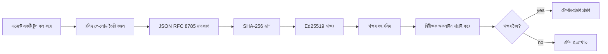
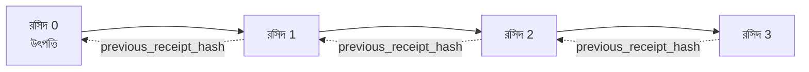

[পাঠাভ্যাস ভিডিও দেখুন: ক্রিপ্টোগ্রাফিক রসিদ সহ AI এজেন্ট নিরাপদকরণ](https://youtu.be/PLACEHOLDER_VIDEO_ID)

> _(পাঠভিডিও এবং থাম্বনেইল মাইক্রোসফট কনটেন্ট টিমের দ্বারা মার্জের পরে যোগ করা হবে, পাঠ ১৪/১৫ এর প্যাটার্ন অনুযায়ী।)_

# ক্রিপ্টোগ্রাফিক রসিদ দিয়ে AI এজেন্ট নিরাপদকরণ

## পরিচিতি

এই পাঠে আপনি শিখবেন:

- কেন AI এজেন্টদের জন্য অডিট ট্রেইল কমপ্লায়েন্স, ডিবাগিং এবং বিশ্বাসযোগ্যতার জন্য গুরুত্বপূর্ণ।
- ক্রিপ্টোগ্রাফিক রসিদ কী এবং এটি অসইনড লগ লাইনের থেকে কিভাবে আলাদা।
- একটি এজেন্টের টুল কলের জন্য প্লেইন পাইথনে সাইনড রসিদ কিভাবে তৈরি করবেন।
- অফলাইনে রসিদ যাচাই কিভাবে করবেন এবং ট্যাম্পারিং সনাক্ত করবেন।
- কিভাবে রসিদ চেইন করবেন যাতে একটি রসিদ সরানো বা পুনর্বিন্যাস করলে চেইন ভেঙে যায়।
- রসিদ কী প্রমাণ করে এবং তারা স্পষ্টতই কী প্রমাণ করে না।

## শেখার লক্ষ্য

এই পাঠ শেষ করার পর আপনি জানতে পারবেন:

- এজেন্ট ক্রিয়াকলাপের জন্য ক্রিপ্টোগ্রাফিক উৎপত্তি অনুপ্রেরণা দেয় এমন ব্যর্থতা মোড সনাক্ত করা।
- একটি ক্যনোনিক্যাল JSON পে-লোডে Ed25519-স্বাক্ষরিত রসিদ তৈরি করা।
- শুধুমাত্র সইকারকের পাবলিক কী ব্যবহার করে স্বতন্ত্রভাবে রসিদ যাচাই করা।
- একটি পরিবর্তিত রসিদে যাচাইকরণ আবার চালিয়ে ট্যাম্পারিং সনাক্ত করা।
- রসিদগুলোর একটি হ্যাশ-চেইন তৈরি করা এবং কেন চেইন গুরুত্বপূর্ণ তা ব্যাখ্যা করা।
- রসিদ কী প্রমাণ করে (অ্যাট্রিবিউশন, অখণ্ডতা, অর্ডারিং) এবং কী প্রমাণ করে না (ক্রিয়ার সঠিকতা, নীতির সাউন্ডনেস) সীমারেখা চিন্হিত করা।

## সমস্যা: আপনার এজেন্টের অডিট ট্রেইল

কল্পনা করুন, আপনি Contoso Travel এর জন্য একটি AI এজেন্ট স্থাপন করেছেন। এজেন্ট গ্রাহকের অনুরোধ পড়ে, ফ্লাইট API কল করে অপশনগুলি খোঁজে এবং গ্রাহকের পক্ষে আসন বুক করে। গত ত্রৈমাসিকে এজেন্ট ৫০,০০০ বুকিং প্রসেস করেছে।

আজ একজন অডিটর আসলেন। তিনি সরল প্রশ্ন করলেন: "আমার এজেন্ট কী করেছিল দেখান।"

আপনি লগ ফাইলগুলি দেন। অডিটর সেগুলো দেখেন এবং কঠিন প্রশ্ন করলেন: "আমি কীভাবে জানতে পারি এই লগগুলো সম্পাদিত হয়নি?"

এটিই অডিট-ট্রেইল সমস্যা। আজকের বেশিরভাগ এজেন্ট স্থাপনা নির্ভর করে:

- **অ্যাপ্লিকেশন লগ**: এজেন্ট নিজেই লিখে, যেকেউ ফাইল-সিস্টেম এক্সেস থাকলে সম্পাদনা করতে পারে।
- **ক্লাউড লগিং সার্ভিসসমূহ**: প্ল্যাটফর্ম স্তরে ট্যাম্পার-প্রমাণ কিন্তু শুধুমাত্র যদি অডিটর প্ল্যাটফর্ম অপারেটরকে বিশ্বাস করেন।
- **ডাটাবেস ট্রানজেকশন লগ**: ডাটাবেস পরিবর্তনের জন্য উপযুক্ত কিন্তু যেকোনো টুল কলের জন্য নয়।

এর কোনওটিই অডিটরের প্রশ্নের উত্তর দিতে পারে না যদি না অডিটর কাউকে বিশ্বাস করেন (আপনি, আপনার ক্লাউড প্রদানকারী, বা আপনার ডাটাবেস বিক্রেতা)। অভ্যন্তরীণ ব্যবহারের জন্য সেই বিশ্বাস প্রায়ই গ্রহণযোগ্য। নিয়ন্ত্রিত কাজের ক্ষেত্রে (অর্থ, স্বাস্থ্যসেবা, ইউরোপীয় ইউনিয়ন AI আইন সম্পর্কিত) তা গ্রহণযোগ্য নয়।

ক্রিপ্টোগ্রাফিক রসিদগুলি প্রতিটি এজেন্ট ক্রিয়া স্বতন্ত্রভাবে যাচাইযোগ্য করে সমাধান করে। অডিটর আপনার বিশ্বাস প্রয়োজন নেই। তাদের শুধুমাত্র আপনার পাবলিক কী এবং রশিদের প্রয়োজন।

## ক্রিপ্টোগ্রাফিক রসিদ কী?

একটি রসিদ হলো একটি JSON অবজেক্ট যা রেকর্ড করে এজেন্ট কী করেছিল, একটি ডিজিটাল স্বাক্ষর দিয়ে সই করা।



একটি ন্যূনতম রসিদ এরকম দেখায়:

```json
{
  "type": "agent.tool_call.v1",
  "agent_id": "contoso-travel-bot",
  "tool_name": "lookup_flights",
  "tool_args_hash": "sha256:a3f9c1...",
  "result_hash": "sha256:7b2e1d...",
  "policy_id": "contoso-travel-policy-v3",
  "timestamp": "2026-04-25T14:30:00Z",
  "sequence": 47,
  "previous_receipt_hash": "sha256:9d4e6a...",
  "signature": {
    "alg": "EdDSA",
    "sig": "c5af83...",
    "public_key": "8f3b2c..."
  }
}
```

তিনটি বৈশিষ্ট্য কাজ করছে:

১. **স্বাক্ষর**। রশিদটি এজেন্টের গেটওয়ে দ্বারা Ed25519 প্রাইভেট কী দিয়ে সই করা হয়েছে। সংশ্লিষ্ট পাবলিক কী থাকা যে কেউ অফলাইনে স্বাক্ষর যাচাই করতে পারে। যেকোন ক্ষেত্র পরিবর্তন স্বাক্ষর অবৈধ করে।

২. **ক্যানোনিক্যাল এনকোডিং**। সইয়ের আগে, রসিদ JSON ক্যানোনিক্যালাইজেশন স্কিম (JCS, RFC 8785) ব্যবহার করে সিরিয়ালাইজ করা হয়। এটি নিশ্চিত করে যে একই লজিক্যাল রসিদ উত্পাদনকারী দুইটি ইমপ্লিমেন্টেশন একই বাইট-সনদ আউটপুট তৈরি করে। ক্যানোনিক্যালাইজেশন ব্যতীত বিভিন্ন JSON সিরিয়ালাইজার একই বিষয়বস্তুর জন্য বিভিন্ন স্বাক্ষর তৈরি করত।

৩. **হ্যাশ চেইনিং**। `previous_receipt_hash` ক্ষেত্র প্রতিটি রসিদকে তার পূর্বের রসিদের সাথে যুক্ত করে। একটি রসিদ সরানো বা পুনর্বিন্যাস করা পরবর্তী প্রতিটি রসিদের ভেঙে দেয়। ট্যাম্পারিং চেইন স্তরে দেখা দেয় এমনকি ব্যক্তিগত স্বাক্ষর এড়িয়ে গেলেও।

একসাথে এই বৈশিষ্ট্যগুলি তিনটি নিশ্চয়তা প্রদান করে:

- **অ্যাট্রিবিউশন**: এই কী এই বিষয়বস্তু সই করেছে।
- **অখণ্ডতা**: স্বাক্ষর করার পর বিষয়বস্তু পরিবর্তিত হয়নি।
- **অর্ডারিং**: এই রসিদ চেইনে ওই রসিদের পরে এসেছিল।

## পাইথনে একটি রসিদ তৈরি করা

রসিদ তৈরির জন্য বিশেষ কোনো লাইব্রেরির প্রয়োজন নেই। ক্রিপ্টোগ্রাফিক প্রিমিটিভগুলি ব্যাপকভাবে উপলব্ধ এবং লজিক কয়েক ডজন লাইন পাইথন কোড।

`code_samples/18-signed-receipts.ipynb` এ হ্যান্ডস-অন এক্সারসাইজগুলি সম্পূর্ণ প্রবাহ ব্যাখ্যা করে। সংক্ষিপ্ত সংস্করণ:

```python
import json
import hashlib
import base64
from nacl import signing
from jcs import canonicalize  # RFC 8785 ক্যানোনিক্যাল JSON

def b64url_nopad(data: bytes) -> str:
    return base64.urlsafe_b64encode(data).decode("ascii").rstrip("=")

def sha256_canonical(obj) -> str:
    """SHA-256 of a Python object's JCS-canonical JSON form."""
    return f"sha256:{hashlib.sha256(canonicalize(obj)).hexdigest()}"

# একটি সাইনিং কী তৈরি করুন বা লোড করুন (প্রোডাকশনে, কী ভল্টে সংরক্ষণ করুন)
signing_key = signing.SigningKey.generate()
verify_key = signing_key.verify_key

# রসিদ পে-লোড তৈরি করুন (এখনো স্বাক্ষর নেই)
tool_args = {"origin": "SYD", "destination": "LAX"}
tool_result = [{"flight": "QF11", "price": 1850, "stops": 0}]

payload = {
    "type": "agent.tool_call.v1",
    "agent_id": "contoso-travel-bot",
    "tool_name": "lookup_flights",
    "tool_args_hash": sha256_canonical(tool_args),
    "result_hash": sha256_canonical(tool_result),
    "policy_id": "contoso-travel-policy-v3",
    "timestamp": "2026-04-25T14:30:00Z",
    "sequence": 0,
    "previous_receipt_hash": None,
}

# ক্যানোনিক্যালাইজ করুন, হ্যাশ করুন, সাইন করুন।
canonical_bytes = canonicalize(payload)
message_hash = hashlib.sha256(canonical_bytes).digest()
signature_bytes = signing_key.sign(message_hash).signature

# একটি গঠনমূলক স্বাক্ষর অবজেক্ট সংযুক্ত করুন।
receipt = {
    **payload,
    "signature": {
        "alg": "EdDSA",
        "sig": b64url_nopad(signature_bytes),
        "public_key": b64url_nopad(bytes(verify_key)),
    },
}
```

এটাই সম্পূর্ণ সাইনিং পাইপলাইন। নোটবুকে প্রতিটি ধাপ বুঝিয়ে বলা হয়েছে।

## রসিদ যাচাই এবং ট্যাম্পারিং সনাক্তকরণ

যাচাই হলো বিপরীত অপারেশন:

```python
import base64
import hashlib
from nacl import signing
from nacl.exceptions import BadSignatureError
from jcs import canonicalize

def b64url_decode(s: str) -> bytes:
    padding = "=" * ((4 - len(s) % 4) % 4)
    return base64.urlsafe_b64decode(s + padding)

def verify_receipt(receipt: dict) -> bool:
    # স্বাক্ষর একটি কাঠামোবদ্ধ অবজেক্ট: {"alg", "sig", "public_key"}।
    sig_obj = receipt.get("signature")
    if not sig_obj or sig_obj.get("alg") != "EdDSA":
        return False

    # আসলেই যা স্বাক্ষরিত হয়েছিল এমন পে-লোড পুনর্গঠন করুন (স্বাক্ষর বাদে সবকিছু)।
    payload = {k: v for k, v in receipt.items() if k != "signature"}

    canonical_bytes = canonicalize(payload)
    message_hash = hashlib.sha256(canonical_bytes).digest()

    try:
        verify_key = signing.VerifyKey(b64url_decode(sig_obj["public_key"]))
        verify_key.verify(message_hash, b64url_decode(sig_obj["sig"]))
        return True
    except BadSignatureError:
        return False
```

এই ফাংশন একটি রসিদ গ্রহণ করে এবং যদি স্বাক্ষর বৈধ হয় তবে `True`, অন্যথায় `False` ফেরত দেয়। কোনো নেটওয়ার্ক কল, সার্ভিস নির্ভরতা, বা তৃতীয় পক্ষের বিশ্বাসের প্রয়োজন নেই।

ট্যাম্পারিং সনাক্তকরণ দেখতে নোটবুকটি মাধ্যমে যায়:

১. একটি বৈধ রসিদ তৈরি এবং যাচাই নিশ্চিত করা।
২. `tool_args_hash` ক্ষেত্রের একটি বাইট পরিবর্তন।
৩. যাচাইকরণ আবার চালিয়ে ব্যর্থ হওয়া দেখা।

এটি একটি ব্যবহারিক প্রমাণ যে রসিদগুলি ট্যাম্পার-প্রমাণ: যেকোনো ছোট পরিবর্তন স্বাক্ষর ভেঙে দেয়।

## মাল্টি-স্টেপ এজেন্টের জন্য রসিদ চেইনিং

একটি একক স্বাক্ষরিত রসিদ একটি ক্রিয়া সুরক্ষিত করে। রসিদ চেইন একটি ক্রিয়াক্রম সুরক্ষিত করে।



প্রতিটি রসিদ তার পূর্বের রসিদের হ্যাশ রেকর্ড করে। রসিদ ২ চুপচাপ সরাতে, আক্রমণকারীকে করতে হবে:

- রসিদ ৩ এর `previous_receipt_hash` ক্ষেত্র পরিবর্তন করা (রসিদ ৩ এর স্বাক্ষর ভেঙে যাবে), অথবা
- সংশোধিত রসিদ ৩ তে নতুন স্বাক্ষর জাল করা (এজেন্টের প্রাইভেট কী প্রয়োজন)।

যদি প্রাইভেট কী হার্ডওয়্যার কী ভল্টে থাকে এবং আপনি প্রতিটি রসিদের সাথে পাবলিক কী প্রকাশ করেন, তবে দেখিয়ে ছাড়া কোনও আক্রমণ সম্ভব নয়।

নোটবুক মাধ্যমে যায়:

১. তিনটি রসিদের একটি চেইন তৈরি করা।
২. প্রতিটি রসিদের `previous_receipt_hash` এর মিল আগে রসিদের প্রকৃত হ্যাশের সাথে যাচাই করা।
৩. মাঝখানে একটি রসিদ ট্যাম্পার করা এবং চেইন সেই নির্দিষ্ট স্থানে ভেঙে যাওয়া দেখা।

এটাই কিভাবে আপনি এমন একটি অডিট ট্রেইল তৈরি করবেন যা একটি বাহ্যিক অডিটর আপনার উপর বিশ্বাস না করেও যাচাই করতে পারে।

## রসিদ কী প্রমাণ করে (এবং কী প্রমাণ করে না)

এই অংশ হল এই পাঠের সবচেয়ে গুরুত্বপূর্ণ অংশ। রসিদ শক্তিশালী কিন্তু তাদের ক্ষমতার সীমা আছে।

**রসিদ তিনটি বিষয় প্রমাণ করে:**

১. **অ্যাট্রিবিউশন**: একটি নির্দিষ্ট কী একটি নির্দিষ্ট পে-লোড সই করেছে।
২. **অখণ্ডতা**: পে-লোড স্বাক্ষরের পর থেকে পরিবর্তিত হয়নি।
৩. **অর্ডারিং**: এই রসিদ হ্যাশ চেইনে ওই রসিদের পরে এসেছে।

**রসিদ প্রমাণ করে না:**

১. **সঠিকতা**: এজেন্টের ক্রিয়া সঠিক ক্রিয়া ছিল কিনা। রসিদ একটি ভুল উত্তরের জন্যও ঠিক একইভাবে সই হতে পারে যেমনটি সঠিক উত্তরের জন্য হয়।
২. **নীতিমালা মেনে চলা**: `policy_id` তে উল্লেখিত নীতি সত্যিই মূল্যায়ন করা হয়েছে কি না, অথবা যদি পরীক্ষা করা হত এই ক্রিয়া অনুমোদিত হত কি না। রসিদ যা দাবী করে তা রেকর্ড করে, যা প্রয়োগিত হয়েছে না।
৩. **কী এর বাইরে পরিচয়**: রসিদ বলে "এই কী এই বিষয়বস্তু সই করেছে।" এটি বলে না "এই মানুষ এটি অনুমোদন করেছে।" একটি কী কে একজন ব্যক্তি বা প্রতিষ্ঠানের সাথে যুক্ত করতে আলাদা পরিচয় অবকাঠামো প্রয়োজন (একটি ডিরেক্টরি, পাবলিক কী রেজিস্ট্রি, ইত্যাদি)।
৪. **ইনপুটের সত্যতা**: যদি এজেন্ট একটি পরিবর্তিত প্রম্পট পায় এবং তার উপর কাজ করে, রসিদ ক্রিয়াটি বিশ্বস্তভাবে রেকর্ড করে। রসিদ ইনপুট যাচাইকরণের পর আসে, বিকল্প নয়।

এই সীমারেখা দুই কারণে গুরুত্বপূর্ণ:

- এটি বলে রসিদ কী কাজে লাগে: এজেন্টের আচরণ অডিটযোগ্য এবং ট্যাম্পার-প্রমাণ করা, এমনকি সাংগঠনিক সীমানার বাইরে।
- এটি বলে আপনাকে কোন অতিরিক্ত স্তর দরকার: ইনপুট যাচাইকরণ (পাঠ ৬), নীতি প্রয়োগ (নীচে সংক্ষেপে), এবং পরিচয় অবকাঠামো (এই পাঠের বাইরে)।

একটি সাধারণ ভুল হলো "আমাদের রসিদ আছে" মানে "আমরা শাসিত" না। রসিদ একটি ভিত্তি। শাসন ব্যবস্থা আপনি তার ওপর গড়েন।

## প্রমাণিত করা একজন মানুষ সঠিক ক্রিয়া অনুমোদন করেছে

উপরের আইটেম ৩ নিজের একটি অংশের যোগ্য: একটি ক্রিয়া রসিদ বলে "এই কী এই বিষয়বস্তু সই করেছে," কিন্তু কখনো বলে না "একজন মানুষ এটি অনুমোদন করেছে।" উচ্চ ঝুঁকিপূর্ণ কার্যাবলীর জন্য (রিফান্ড, মুছে ফেলা, ওয়্যার ট্রান্সফার), শাসন কাঠামো ক্রমবর্ধমানভাবে ঠিক সেই অনুপস্থিত বিবৃতি চায়, এবং এটি একই প্রিমিটিভ দিয়ে তৈরি যা আপনি ইতিমধ্যেই এই পাঠে তৈরি করেছেন।

পরবর্তী নোটবুক `code_samples/human-authorization-receipts.ipynb` একটি দ্বিতীয় রসিদের প্রকার যোগ করে, `human.approval.v1`, একই খামে (τύpered payload, Ed25519 দ্বারা তার canonical SHA-256 স্বাক্ষরে, `signature` অবজেক্ট স্বাক্ষরিত বাইটের বাইরে)। একটি নামকরণকৃত অনুমোদক সম্পূর্ণ ক্যানোনিক্যাল ক্রিয়া এবং এর ডাইজেস্ট স্বাক্ষর করে কার্যকর করার আগে; এজেন্টের ক্রিয়া রশিদ একই ক্রিয়া ডাইজেস্ট বহন করে এবং একটি `parent_approval_ref`, অনুমোদনের `receipt_hash`, একই রীতি যেমন চেইনে `previous_receipt_hash`। এক `verify_chain` দুই ঐজেয়াস্তরকে পৃথক কী রেজিস্ট্রিতে যাচাই করে (অনুমোদকের কী বনাম এজেন্টের কী), কোড পথ শেয়ার করা হলেও কর্তৃপক্ষ কখনও নয়।

এটি ক্রয় করা বৈশিষ্ট্য, সাবধানে বলা: *মানুষ এই সঠিক ক্রিয়াটি অনুমোদন করেছে, এবং এজেন্ট সঠিকভাবে সেই অনুমোদিত ক্রিয়াটি সম্পাদন করেছে।* নোটবুকের প্রত্যাখ্যান ফিক্সচারগুলিই বৈশিষ্ট্যটিকে দাবী নয় বাস্তব করে তোলে:

- ক্লাসিক সেট: ট্যাম্পারিং, বিভ্রান্ত ডেপুটি, পুনঃপ্রেরণ, উভয় পাশে জাল কী, খারাপ ইনপুট;
- **অবসন্ন কর্তৃপক্ষ**: একটি স্বাক্ষর যা এখনও যাচাই হয়, তবুও প্রত্যাখ্যাত কারণ নীতি সংস্করণ পরিবর্তিত হয়েছে, অনুমোদকের কী পিনড রেজিস্ট্রি থেকে বাদ পরেছে, বা অনুমোদনের মেয়াদ উত্তীর্ণ হয়েছে;
- **ডাইজেস্ট পরিবর্তন**: একটি বৈধ স্বাক্ষরিত ক্রিয়া রসিদ একটি *বাস্তব* অনুমোদনের দিকে নির্দেশ করে যা একটি *বিভিন্ন* ক্যানোনিক্যাল ক্রিয়া বেঁধে দেয়।

প্রতিটি ব্যর্থতা একটি পৃথক কারণ সহ প্রত্যাখ্যান করে, তাই একটি অডিটর প্রত্যাখ্যান পড়ে জানতে পারে কর্তৃপক্ষ অবসন্ন হয়েছে নাকি সম্পাদিত ক্রিয়া পরিবর্তিত হয়েছে। নোটবুক শেখায়: একটি সই করা অনুমোদন নিজেই কর্তৃপক্ষ নয়। কর্তৃপক্ষ শুধুমাত্র থাকে যদি দুই রসিদও একই ক্যানোনিক্যাল ক্রিয়ার সাথে সময়কালে বেঁধে থাকে। এই পাঠ অনুসরণ করা ইন্টারনেট ড্রাফটের কো-স্বাক্ষর পথ (`draft-farley-acta-signed-receipts`) এই প্যাটার্নের মান অনুসারে।

## উৎপাদন রেফারেন্স

এই পাঠের পাইথন কোড সচেতনভাবে ন্যূনতম রাখা হয়েছে যাতে আপনি প্রতিটি লাইন পড়ে বুঝতে পারেন ঠিক কী হচ্ছে। উৎপাদনে, আপনার দুটি বিকল্প আছে:

১. **ক্রিপ্টোগ্রাফিক প্রিমিটিভের উপর সরাসরি নির্মাণ।** উপরে দেখানো ৫০ লাইন অনেক ব্যবহারের জন্য যথেষ্ট। PyNaCl (Ed25519) এবং `jcs` প্যাকেজ (ক্যানোনিক্যাল JSON) ভালোভাবে রক্ষণাবেক্ষণ ও নিরীক্ষিত লাইব্রেরি।

২. **উৎপাদন রসিদ লাইব্রেরি ব্যবহার করুন।** বেশ কয়েকটি ওপেন-সোর্স প্রকল্প একই প্যাটার্ন বিভিন্ন বৈশিষ্ট্য সহ বাস্তবায়ন করে (কী রোটেশন, ব্যাচ যাচাইকরণ, JWK সেট বিতরণ, নীতি ইঞ্জিনের সাথে সংযুক্তি):
   - এই পাঠে ব্যবহৃত রসিদ ফরম্যাট একটি IETF ইন্টারনেট-ড্রাফট অনুসরণ করে ([`draft-farley-acta-signed-receipts`](https://datatracker.ietf.org/doc/draft-farley-acta-signed-receipts/), সংস্করণ ০২), যা বর্তমানে স্ট্যান্ডার্ড প্রক্রিয়ায় আছে, একটি শেয়ার্ড কনফরমেন্স স্যুইট সহ ([agent-governance-testvectors](https://github.com/ScopeBlind/agent-governance-testvectors)) যা স্বতন্ত্র ইমপ্লিমেন্টেশনগুলি বাইট-সদৃশ ক্যানোনিক্যাল আউটপুটের জন্য পারস্পরিক যাচাই করে।
   - মাইক্রোসফট এজেন্ট গভর্নেন্স টুলকিট রসিদগুলো সিডার-ভিত্তিক নীতি সিদ্ধান্তের সাথে সংযুক্ত করে; ওই রিপোজিটোরির টিউটোরিয়াল ৩৩-এ একটি সম্পূর্ণ উদাহরণ দেখতে পারেন।
   - `protect-mcp` (npm) এবং `@veritasacta/verify` (npm) প্যাকেজগুলি রসিদ সাইনিং এবং অফলাইন যাচাইয়ের নোড-ভিত্তিক ইমপ্লিমেন্টেশন দেয়, যেটি MCP সার্ভারকে ট্যাম্পার-প্রমাণী অডিট ট্রেইল দিয়ে মোড়াকরণের জন্য, অর্থাৎ একটি হোল্ড-ফোর-কো-সাইন ফ্লো যেখানে একটি বিরামপ্রাপ্ত ক্রিয়া একটি অনুমোদন রসিদ ইমিট করে যা ক্রিয়া ডাইজেস্টের সাথে যুক্ত (ডেস্কটপ ফ্লোতে WebAuthn-সমর্থিত), উপরে মানব-অনুমোদন নোটবুকের মতো।
   - **[nobulex](https://github.com/arian-gogani/nobulex)** পাইথন SDK (`pip install nobulex`) একই Ed25519 + JCS সাইনিং প্যাটার্ন পাইথনে LangChain এবং CrewAI সংযোগ সহ প্রদান করে, প্রকাশিত ক্রস-ভ্যালিডেশন টেস্ট ভেক্টর এবং [OWASP PR #2210](https://github.com/OWASP/CheatSheetSeries/pull/2210) দ্বারা অবদানকৃত অনুবর্তিতা ম্যাপিং সহ।

নিজে কোড লেখার এবং লাইব্রেরি ব্যবহারের মধ্যে সিদ্ধান্ত JWT লাইব্রেরি লেখার এবং পরীক্ষিত লাইব্রেরি ব্যবহারের মতো: দুটোই যুক্তিযুক্ত; লাইব্রেরি সময় বাঁচায় এবং নিরীক্ষার পৃষ্ঠপোষকতা কমায়; নিজে তৈরি করলে আপনি প্রতিটি প্রিমিটিভ বুঝতে বাধ্য হন। এই পাঠে নিজে তৈরি পথ শেখানো হয়েছে যাতে আপনার কাছে দুটোর জন্যই ভিত্তি থাকে।

## জ্ঞান যাচাই

প্র্যাকটিস এক্সারসাইজের আগে আপনার বোঝাপড়া পরীক্ষা করুন।

**১. একটি রসিদ এজেন্টের প্রাইভেট Ed25519 কী দিয়ে সই করা হয়। অডিটরের কাছে শুধুমাত্র পাবলিক কী আছে। অডিটর রসিদ অফলাইনে যাচাই করতে পারবে?**

<details>
<summary>উত্তর</summary>

হ্যাঁ। Ed25519 যাচাইকরণের জন্য শুধু পাবলিক কী এবং সই করা বাইট দরকার। কোনো নেটওয়ার্ক কল, সার্ভিস নির্ভরতা নেই। এই বৈশিষ্ট্য রসিদগুলি এয়ার-গ্যাপড, বহু-সংগঠন, বা কম বিশ্বাসযুক্ত অডিট পরিবেশে ব্যবহার যোগ্য করে তোলে।
</details>

**২. একজন আক্রমণকারী রসিদের `policy_id` ক্ষেত্র পরিবর্তন করে দাবি করে এটি একটি আরও নমনীয় নীতি দ্বারা শাসিত ছিল। স্বাক্ষর ছিল মূল পে-লোডে। যাচাইকরণের সময় কী হয়?**

<details>
<summary>উত্তর</summary>


যাচাইকরণ ব্যর্থ হয়েছে। স্বাক্ষরটি মূল পেইলোডের প্রামাণিক বাইটের উপর গণনা করা হয়েছিল; যেকোনো ক্ষেত্র পরিবর্তন করলে প্রামাণিক বাইট পরিবর্তন হয়, যা SHA-256 হ্যাশ পরিবর্তন করে, ফলে স্বাক্ষর অবৈধ হয়ে যায়। আক্রমণকারীকে নতুন একটি বৈধ স্বাক্ষর তৈরি করতে ব্যক্তিগত চাবির প্রয়োজন, যা তাদের কাছে নেই।
</details>

**3. রসিদে কাঁচা আর্গুমেন্ট এবং ফলাফলের পরিবর্তে কেন `tool_args_hash` এবং `result_hash` অন্তর্ভুক্ত করা হয়েছে?**

<details>
<summary>উত্তর</summary>

দুটি কারণ রয়েছে। প্রথমত, রসিদটি এমন পরিবেশে সংরক্ষণ বা প্রেরণ করতে হতে পারে যেখানে কাঁচা সামগ্রী (ব্যক্তিগত শনাক্তযোগ্য তথ্য, ব্যবসায়ের ডেটা) ফাঁস হওয়া একটি সমস্যা। হ্যাশিং রসিদকে ছোট এবং সামগ্রীকে ব্যক্তিগত রাখে; নিরীক্ষক নিশ্চিত করে হ্যাশটি প্রকৃত সামগ্রী যেটির একটি পৃথকভাবে সংরক্ষিত কপির সাথে মেলে। দ্বিতীয়ত, হ্যাশের একটি নির্দিষ্ট আকার থাকে; হ্যাশযুক্ত রসিদ ইনপুট ও আউটপুট যতই বড় হোক না কেন আকারে সীমাবদ্ধ থাকে।
</details>

**4. `previous_receipt_hash` ক্ষেত্র প্রতিটি রসিদকে এর পূর্বসূরীর সাথে সংযুক্ত করে। যদি আক্রমণকারী চেইনের মাঝখান থেকে একটি রসিদ নীরবে মুছে দেয়, তাহলে কী অবৈধ হয়ে যায়?**

<details>
<summary>উত্তর</summary>

মুছে ফেলা রসিদের পরবর্তী প্রতিটি রসিদ। তাদের `previous_receipt_hash` ক্ষেত্রগুলি প্রকৃত চেইনের সাথে মেলে না (কারণ তারা যেটি উল্লেখ করেছিল সেই রসিদ ইতিমধ্যেই নেই, অথবা চেইন এখন অন্য পূর্বসূরীর দিকে নির্দেশ করছে)। মুছে ফেলা লুকাতে, আক্রমণকারীকে প্রতিটি পরবর্তী রসিদ পুনরায় স্বাক্ষর করতে হয়, যা ব্যক্তিগত চাবি প্রয়োজন।
</details>

**5. একটি রসিদ সঠিকভাবে যাচাই হয়। এটি কি সিঙ্ঘাত করে যে এজেন্টের কাজ সঠিক, সাউন্ড, বা নীতিমালা অনুসারে?**

<details>
<summary>উত্তর</summary>

না। একটি বৈধ রসিদ তিনটি বিষয় প্রমাণ করে: দায়িত্ব (এই চাবি এই সামগ্রীতে স্বাক্ষর করেছে), অখণ্ডতা (সামগ্রী পরিবর্তিত হয়নি), এবং আদেশ (এই রসিদ ওই রসিদের পরে এসেছে)। এটি প্রমাণ করে না যে কাজটি সঠিক ছিল, `policy_id`-এ উল্লেখিত নীতি বাস্তবায়িত হয়েছে, বা এজেন্ট প্রতিটি নিয়ম অনুসরণ করেছে। রসিদ এজেন্টের আচরণ নিরীক্ষণযোগ্য করে, নুন্যতম সঠিক নয়। এটা পাঠের সবচেয়ে গুরুত্বপূর্ণ সীমানা।
</details>

## অনুশীলন পরীক্ষা

`code_samples/18-signed-receipts.ipynb` খুলুন এবং চারটি বিভাগ পূরণ করুন:

1. **বিভাগ ১**: আপনার প্রথম রসিদে স্বাক্ষর করুন এবং যাচাই করুন।
2. **বিভাগ ২**: রসিদে হস্তক্ষেপ করুন এবং যাচাইকরণের ব্যর্থতা পর্যবেক্ষণ করুন।
3. **বিভাগ ৩**: তিনটি রসিদের চেইন গঠন করুন এবং চেইন অখণ্ডতা যাচাই করুন।
4. **বিভাগ ৪**: মাইক্রোসফট এজেন্ট ফ্রেমওয়ার্ক দিয়ে নির্মিত একটি এজেন্টে প্যাটার্নটি প্রয়োগ করুন: একটি টুল কল রসিদ-স্বাক্ষরকরণের মধ্যে রাখুন, তারপর স্বাধীনভাবে রসিদ যাচাই করুন।

**অতিরিক্ত চ্যালেঞ্জ 1:** রসিদ স্কিমায় আপনার পছন্দের একটি অতিরিক্ত ক্ষেত্র যুক্ত করুন (যেমন ট্রেসিং এর জন্য একটি অনুরোধ আইডি), প্রামাণিক স্বাক্ষর লজিক আপডেট করুন এবং নিশ্চিত করুন রসিদ যাচাই করে আসল অবস্থা বজায় থাকে। তারপর স্বাক্ষরের পর ক্ষেত্রটি পরিবর্তন করুন এবং যাচাইকরণ ব্যর্থ হয় নিশ্চিত করুন। এটি আপনাকে শেখায় কিভাবে প্রতিটি বাইট প্রামাণিক এনকোডিংয়ে স্বাক্ষরের সাথে সম্পর্কিত।

**অতিরিক্ত চ্যালেঞ্জ 2:** আপনার দুটির রসিদ একসঙ্গে SHA-256 হ্যাশ করুন (তাদের প্রামাণিক বাইট নির্দিষ্ট ক্রমে সংযুক্ত করে) এবং তৃতীয় রসিদে নতুন একটি ক্ষেত্র হিসেবে সংযোজন করুন এবং স্বাক্ষর করুন। যাচাই করুন সব তিনটি রসিদ এখনও রাউন্ড-ট্রিপ হয়। আপনি এতেই একটি এক ধাপের অন্তর্ভুক্তি প্রমাণ তৈরি করেছেন: তৃতীয় রসিদ ধারণকারী কেউ প্রমাণ করতে পারে প্রথম দুটি রসিদ স্বাক্ষরের সময় ছিল, তাদের সামগ্রী প্রকাশ না করেই। এটি নির্বাচনী-প্রকাশ রসিদ যেগুলি স্কেলে ব্যবহার করে এমন প্যাটার্ন (Merkle commitments, RFC 6962)।

## উপসংহার

ক্রিপ্টোগ্রাফিক রসিদগুলি AI এজেন্টদের একটি নিরীক্ষা পথ প্রদান করে যা:

- **স্বতন্ত্রভাবে যাচাইকরণযোগ্য**: যেকোনো পক্ষ পাবলিক কী নিয়ে যাচাই করতে পারে, কোনো সেবার উপর নির্ভরশীল নয়।
- **হস্তক্ষেপ-প্রমাণ**: যেকোনো পরিবর্তন স্বাক্ষর অবৈধ করে দেয়।
- **বহনযোগ্য**: রসিদ হলো একটি ছোট JSON ফাইল; এটি সংরক্ষণ, প্রেরণ এবং যেকোনো জায়গায় যাচাই করা যায়।
- **মানসম্পন্ন**: Ed25519 (RFC 8032), JCS (RFC 8785), এবং SHA-256 এর উপরে নির্মিত, জায়গায় ব্যাপক ব্যবহৃত প্রিমিটিভ।

এগুলি ইনপুট যাচাই, নীতি বাস্তবায়ন, বা পরিচয় অবকাঠামোর বিকল্প নয়। এগুলি সেই স্তরগুলোর ভিত্তি। যখন আপনি নিয়ন্ত্রিত কাজের পরিবেশে, বহু-সংগঠনের কর্মপ্রবাহে, বা এমন পরিবেশে এজেন্ট প্রয়োগ করবেন যেখানে ভবিষ্যত নিরীক্ষক আপনাকে বিশ্বাস করবে না, রসিদই আপনাকে নিরীক্ষার পথ সৎ রাখতে সাহায্য করে।

সবচেয়ে গুরুত্বপূর্ণ শিক্ষা: রসিদ প্রমাণ করে কে কী বলেছে, কখন। এটি প্রমাণ করে না যা বলা হয়েছে তা সত্য বা সঠিক। এই পার্থক্যটি শক্তভাবে ধরুন। এটি সৎ উত্স ব্যবস্থা এবং বিভ্রান্তিকর ব্যবস্থার মধ্যে পার্থক্য।

## উৎপাদন পরীক্ষা তালিকা

এই পাঠ থেকে বাস্তব পরিবেশে রসিদ-স্বাক্ষরযুক্ত এজেন্ট মোতায়েন করার জন্য যখন আপনি প্রস্তুত হবে:

- [ ] **স্বাক্ষর চাবিটি ডেভেলপার ল্যাপটপ থেকে সরান।** Azure Key Vault, AWS KMS, অথবা হার্ডওয়্যার সুরক্ষা মডিউল ব্যবহার করুন। আপনার রসিদের স্বাক্ষরকারী ব্যক্তিগত চাবিটি কখনো সোর্স কন্ট্রোল বা অ্যাপ্লিকেশন মেশিনে প্লেনটেক্সটে দেখা যাবে না।
- [ ] **যাচাইকরণ পাবলিক কী প্রকাশ করুন।** নিরীক্ষকরা এটি অফলাইন যাচাইয়ের জন্য প্রয়োজন। স্ট্যান্ডার্ড প্যাটার্ন হচ্ছে পরিচিত URL-এ একটি JWK সেট (RFC 7517), যেমন `https://your-org.example.com/.well-known/agent-keys.json`।
- [ ] **চেইনকে বাহ্যিকভাবে সংযুক্ত করুন।** নির্দিষ্ট সময় অন্তর সর্বশেষ চেইন হেড হ্যাশকে আপপ্যারদর্শিতা লগে (Sigstore Rekor, RFC 3161 টাইমস্ট্যাম্প কর্তৃপক্ষ, অথবা একটি অভ্যন্তরীণ সিস্টেম) লিখুন যাতে বাইরের পক্ষ নিশ্চিত করতে পারে "এই চেইনটি এই সময়ে ছিল।"
- [ ] **রসিদ অবিচ্ছিন্নভাবে সংরক্ষণ করুন।** শুধুমাত্র সংযোজনযোগ্য ব্লব স্টোরেজ (Azure Storage with immutability policies, AWS S3 Object Lock) অভ্যন্তরীণ কারও দ্বারা ইতিহাস পুনরায় লেখাকে প্রতিরোধ করে।
- [ ] **রক্ষণাবেক্ষণ সিদ্ধান্ত নিন।** বহু সম্মতির নিয়ম বহু বছর ধরে রাখার প্রয়োজন হতে পারে। রসিদের দ্রুত বৃদ্ধির পরিকল্পনা করুন (প্রতি রসিদ প্রায় ৫০০ বাইট; একজন এজেন্ট যদি দিনে ১০ হাজার কল করে বছরে প্রায় ১.৮ জিবি ডেটা তৈরি করে)।
- [ ] **রসিদ যা কভার করে না তা দলিল করুন।** রসিদ দায়িত্ব, অখণ্ডতা, এবং আদেশ প্রমাণ করে। আপনার রানবুকে স্পষ্টভাবে উল্লেখ করুন কি অতিরিক্ত নিয়ন্ত্রণ (ইনপুট যাচাই, নীতি বাস্তবায়ন, রেট সীমাবদ্ধকরণ, পরিচয় অবকাঠামো) রসিদের সাথে শাসন প্রতিষ্ঠানে রয়েছে।

### AI এজেন্ট সুরক্ষার বিষয়ে আরও প্রশ্ন আছে?

অন্য শিক্ষার্থীদের সাথে দেখা করতে, অফিস আওয়ার অংশ নিতে, এবং AI এজেন্ট সম্পর্কিত প্রশ্নের উত্তর পেতে [Microsoft Foundry Discord](https://aka.ms/ai-agents/discord)-এ যোগ দিন।

## এই পাঠের পরবর্তী পর্যায়

এই পাঠে একক রসিদে স্বাক্ষর এবং হ্যাশ-চেইনযুক্ত ক্রম আলোচনা করা হয়েছে। একই প্রিমিটিভগুলি আরও উন্নত কয়েকটি প্যাটার্নে গঠিত যা আপনি আপনার শাসন পরিধি বিস্তৃত হলে দেখতে পারেন:

- **নির্বাচনী প্রকাশ।** যখন রসিদের ক্ষেত্রগুলি স্বতন্ত্রভাবে প্রতিশ্রুতিবদ্ধ হয় (RFC 6962-স্টাইল মার্কল ট্রি), আপনি বিশেষ নিরীক্ষকদের জন্য নির্দিষ্ট ক্ষেত্র প্রকাশ করতে পারেন এবং বাকী অক্ষুন্ন থাকার প্রমাণ দিতে পারেন, সামগ্রী প্রকাশ না করেই। প্রয়োজন যখন একটি রসিদকে পূর্ণাঙ্গ নিরীক্ষাও সাধিত করতে হয় এবং একই সময়ে GDPR-এর মত ডেটা-মহর নীতিও বজায় রাখতে হয়।
- **রসিদ প্রত্যাহার।** যদি স্বাক্ষর চাবি অননুমোদিত হয়ে যায়, তাহলে আপনাকে একটি পদ্ধতি দরকার যা সেই চাবি দ্বারা স্বাক্ষর করা সকল রসিদ নির্দোষ থেকে অবিশ্বাস্য হিসাবে চিহ্নিত করবে নির্দিষ্ট সময় থেকে। স্ট্যান্ডার্ড প্যাটার্নগুলো: স্বল্প-মেয়াদী স্বাক্ষর চাবি ও প্রকাশিত প্রত্যাহার তালিকা, অথবা প্রত্যাহার এন্ট্রি সহ একটি আপপ্যারদর্শিতা লগ।
- **দ্বিপাক্ষিক / বিভক্ত-স্বাক্ষর রসিদ।** কিছু বাস্তবায়নে স্বাক্ষরকৃত পেইলোড পূর্ব-কার্যকারিতা (`authorization_*`) ও পোস্ট-কার্যকারিতা (`result_*`) অংশে বিভক্ত হয়, স্বতন্ত্র স্বাক্ষর সহ, যখন অনুমোদন সিদ্ধান্ত ও পর্যবেক্ষণকৃত ফলাফল ভিন্ন সময় বা ভূমিকা দ্বারা তৈরি হয়। এটি এই পাঠে শেখানো রসিদ ফরম্যাটের উপরে সংযোজন হিসেবে কার্যকর।
- **পেইলোড কম্পোজিশন।** একটি রসিদ `result_hash`-এ যা কিছু বাইট আপনি রাখেন তা সীল করে। বাস্তব জীবনের পেইলোড সাধারণত একক টুল কল ফলাফল থেকে সমৃদ্ধ: সিদ্ধান্তের পূর্বাভাস (মডেল ভবিষ্যদ্বাণী, বিবেচিত বিকল্প, প্রমাণ ও তার সম্পূর্ণতা, ঝুঁকি অবস্থা, জবাবদিহিতার চেইন, গেট ফলাফল) সব পেইলোডের ভিতরে থাকতে পারে, একটি রসিদ দ্বারা সীলিত। এটি রসিদ ফরম্যাটকে সীমিত রাখে এবং পেইলোড স্কিমা ডোমেইন অনুযায়ী বিকশিত হতে দেয়।
- **বহু-বাস্তবায়নের সামঞ্জস্য।** একই রসিদ ফরম্যাটের বিভিন্ন স্বাধীন বাস্তবায়ন (Python, TypeScript, Rust, Go) শেয়ার করা টেস্ট ভেক্টর দিয়ে ক্রস-যাচাই করে। আপনি নিজস্ব বাস্তবায়ন করলে প্রকাশিত ভেক্টরের সঙ্গে যাচাই ওয়্যার কম্প্যাটিবিলিটি নিশ্চিত করে।
- **পোস্ট-কোয়ান্টাম মাইগ্রেশন।** Ed25519 আজ ব্যাপক ব্যবহৃত হলেও কোয়ান্টাম-প্রতিরোধী নয়। রসিদ ফরম্যাট হলো অ্যালগরিদম-সহজ: `signature.alg` ক্ষেত্র `ML-DSA-65` (NIST পোস্ট-কোয়ান্টাম স্বাক্ষর স্ট্যান্ডার্ড) বহন করতে পারে যখন মাইগ্ৰেশন প্রয়োজন। একটি মেয়াদ পরিকল্পনা করুন যেখানে রসিদ দ্বিমাত্রিক স্বাক্ষরযুক্ত।

## অতিরিক্ত সম্পদসমূহ

- <a href="https://datatracker.ietf.org/doc/draft-farley-acta-signed-receipts/" target="_blank">IETF ইন্টারনেট-ড্রাফট: মেশিন-টু-মেশিন এক্সেস কন্ট্রোলের জন্য স্বাক্ষরিত সিদ্ধান্ত রসিদ</a>
- <a href="https://learn.microsoft.com/azure/ai-studio/responsible-use-of-ai-overview" target="_blank">দায়িত্বশীল AI সংক্ষিপ্ত পর্যালোচনা (Azure AI)</a>
- <a href="https://datatracker.ietf.org/doc/html/rfc8032" target="_blank">RFC 8032: এডওয়ার্ডস-কর্ব ডিজিটাল স্বাক্ষর অ্যালগরিদম (EdDSA)</a>
- <a href="https://datatracker.ietf.org/doc/html/rfc8785" target="_blank">RFC 8785: JSON প্রামাণিকরণ পদ্ধতি (JCS)</a>
- <a href="https://datatracker.ietf.org/doc/html/rfc6962" target="_blank">RFC 6962: সার্টিফিকেট আপপ্যারদর্শিতা</a> (নির্বাচনী প্রকাশ রসিদে ব্যবহৃত মার্কল-ট্রি গঠন)
- <a href="https://github.com/microsoft/agent-governance-toolkit/blob/main/docs/tutorials/33-offline-verifiable-receipts.md" target="_blank">Microsoft Agent Governance Toolkit, Tutorial 33: অফলাইন যাচাইকৃত সিদ্ধান্ত রসিদ</a>
- <a href="https://github.com/ScopeBlind/agent-governance-testvectors" target="_blank">একাধিক বাস্তবায়ন সামঞ্জস্য পরীক্ষা ভেক্টর</a> এই পাঠে ব্যবহৃত রসিদ ফরম্যাটের জন্য (Apache-2.0)
- <a href="https://pynacl.readthedocs.io/" target="_blank">PyNaCl ডকুমেন্টেশন</a> (Python-এ Ed25519)

## পূর্ববর্তী পাঠ

[স্থানীয় AI এজেন্ট তৈরি](../17-creating-local-ai-agents/README.md)

---

<!-- CO-OP TRANSLATOR DISCLAIMER START -->
**অস্বীকৃতি**:
এই নথিটি AI অনুবাদ পরিষেবা [Co-op Translator](https://github.com/Azure/co-op-translator) ব্যবহার করে অনূদিত হয়েছে। যদিও আমরা শুদ্ধতার জন্য চেষ্টা করি, অনুগ্রহ করে মনে রাখবেন যে স্বয়ংক্রিয় অনুবাদে ত্রুটি বা অসঙ্গতি থাকতে পারে। মূল নথিটি তার স্বভাষায় কর্তৃত্বপূর্ণ উৎস হিসেবে বিবেচিত হওয়া উচিত। গুরুত্বপূর্ণ তথ্যের জন্য পেশাদার মানব অনুবাদ সুপারিশ করা হয়। এই অনুবাদের ব্যবহারে প্রয়োজনীয় ভুল বোঝাবুঝি বা ভুল ব্যাখ্যার জন্য আমরা দায়বদ্ধ নই।
<!-- CO-OP TRANSLATOR DISCLAIMER END -->