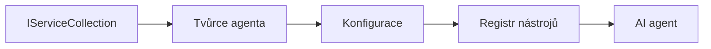

# 🎨 Agentní návrhové vzory s Azure OpenAI (Responses API) (.NET)

## 📋 Výukové cíle

Tento příklad ukazuje podnikové návrhové vzory pro vytváření inteligentních agentů pomocí Microsoft Agent Framework v .NET s integrací Azure OpenAI (Responses API). Naučíte se profesionální vzory a architektonické přístupy, které činí agenty připravenými pro produkci, udržovatelnými a škálovatelnými.

### Podnikové návrhové vzory

- 🏭 **Factory Pattern**: Standardizované vytváření agentů s injektáží závislostí
- 🔧 **Builder Pattern**: Fluent konfigurace a nastavení agentů
- 🧵 **Thread-Safe Patterns**: Současná správa konverzací
- 📋 **Repository Pattern**: Organizované spravování nástrojů a schopností

## 🎯 Architektonické výhody specifické pro .NET

### Podnikové funkce

- **Silné typování**: Validace během překladu a podpora IntelliSense
- **Injektáž závislostí**: Integrovaný DI kontejner
- **Správa konfigurace**: IConfiguration a vzory Options
- **Async/Await**: Plnohodnotná podpora asynchronního programování

### Vzory připravené pro produkci

- **Integrace logování**: ILogger a podpora strukturovaného logování
- **Health Checks**: Vestavěné monitorování a diagnostika
- **Validace konfigurace**: Silné typování s datovými anotacemi
- **Zpracování chyb**: Strukturované řízení výjimek

## 🔧 Technická architektura

### Základní komponenty .NET

- **Microsoft.Extensions.AI**: Unified AI service abstrakce
- **Microsoft.Agents.AI**: Podnikový rámec pro orchestraci agentů
- **Azure OpenAI (Responses API)**: Vysokovýkonné vzory klienta API
- **Konfigurační systém**: appsettings.json a integrace prostředí

### Implementace návrhových vzorů



## 🏗️ Ukázané podnikové vzory

### 1. **Tvořící vzory**

- **Agent Factory**: Centralizované vytváření agentů s konzistentní konfigurací
- **Builder Pattern**: Fluent API pro složitou konfiguraci agentů
- **Singleton Pattern**: Sdílené zdroje a správa konfigurace
- **Injektáž závislostí**: Volné vazby a testovatelnost

### 2. **Chování vzory**

- **Strategy Pattern**: Zaměnitelné strategie provádění nástrojů
- **Command Pattern**: Zapouzdřené operace agenta s undo/redo
- **Observer Pattern**: Událostmi řízená správa životního cyklu agenta
- **Template Method**: Standardizované pracovní postupy spuštění agenta

### 3. **Strukturální vzory**

- **Adapter Pattern**: Vrstva integrace Azure OpenAI (Responses API)
- **Decorator Pattern**: Vylepšení schopností agenta
- **Facade Pattern**: Zjednodušené rozhraní pro interakci s agentem
- **Proxy Pattern**: Lazy loading a cache pro výkon

## 📚 Principy návrhu .NET

### Principy SOLID

- **Single Responsibility**: Každá komponenta má jeden jasný účel
- **Open/Closed**: Rozšiřitelný bez úprav
- **Liskov Substitution**: Implementace nástrojů na základě rozhraní
- **Interface Segregation**: Zaměřená, koherentní rozhraní
- **Dependency Inversion**: Závislost na abstrakcích, ne na konkrétních třídách

### Čistá architektura

- **Doménová vrstva**: Základní abstrakce agenta a nástrojů
- **Aplikační vrstva**: Orchestrace agentů a pracovní postupy
- **Infrastrukturní vrstva**: Integrace Azure OpenAI (Responses API) a externí služby
- **Prezentační vrstva**: Uživatelská interakce a formátování odpovědí

## 🔒 Podnikové úvahy

### Bezpečnost

- **Správa přihlašovacích údajů**: Bezpečná správa API klíčů s IConfiguration
- **Validace vstupů**: Silné typování a validace datovými anotacemi
- **Sanitizace výstupu**: Bezpečné zpracování a filtrování odpovědí
- **Auditní logování**: Komplexní sledování operací

### Výkon

- **Async vzory**: Neblokující I/O operace
- **Pooling připojení**: Efektivní správa HTTP klienta
- **Caching**: Kešování odpovědí pro lepší výkon
- **Správa zdrojů**: Správné uvolňování a úklid vzorů

### Škálovatelnost

- **Bezpečnost vláken**: Podpora souběžného spuštění agentů
- **Pooling zdrojů**: Efektivní využití zdrojů
- **Řízení zátěže**: Omezení rychlosti a zpracování zpětného tlaku
- **Monitorování**: Výkonové metriky a kontroly stavu

## 🚀 Nasazení do produkce

- **Správa konfigurace**: Nastavení specifická pro prostředí
- **Strategie logování**: Strukturované logování s korelačními ID
- **Zpracování chyb**: Globální zpracování výjimek s řádným zotavením
- **Monitorování**: Application insights a výkonnostní čítače
- **Testování**: Jednotkové testy, integrační testy a vzory zátěžového testování

Připraveno postavit podnikově kvalitní inteligentní agenty s .NET? Navrhněme něco robustního! 🏢✨

## 🚀 Začínáme

### Požadavky

- [.NET 10 SDK](https://dotnet.microsoft.com/download/dotnet/10.0) nebo vyšší
- Předplatné [Azure](https://azure.microsoft.com/free/) s Azure OpenAI zdrojem a nasazením modelu
- [Azure CLI](https://learn.microsoft.com/cli/azure/install-azure-cli) — přihlášení pomocí `az login`

### Požadované proměnné prostředí

```bash
# zsh/bash
export AZURE_OPENAI_ENDPOINT=https://<your-resource>.openai.azure.com
export AZURE_OPENAI_DEPLOYMENT=gpt-5-mini
# Přihlaste se, aby AzureCliCredential mohl získat token
az login
```

```powershell
# PowerShell
$env:AZURE_OPENAI_ENDPOINT = "https://<your-resource>.openai.azure.com"
$env:AZURE_OPENAI_DEPLOYMENT = "gpt-5-mini"
# Poté se přihlaste, aby AzureCliCredential mohl získat token
az login
```

### Ukázkový kód

Pro spuštění příkladu kódu,

```bash
# zsh/bash
chmod +x ./03-dotnet-agent-framework.cs
./03-dotnet-agent-framework.cs
```

Nebo s využitím dotnet CLI:

```bash
dotnet run ./03-dotnet-agent-framework.cs
```

Podívejte se na [`03-dotnet-agent-framework.cs`](../../../../03-agentic-design-patterns/code_samples/03-dotnet-agent-framework.cs) pro kompletní kód.

```csharp
#!/usr/bin/dotnet run

#:package Microsoft.Extensions.AI@10.*
#:package Microsoft.Agents.AI.OpenAI@1.*-*
#:package Azure.AI.OpenAI@2.1.0
#:package Azure.Identity@1.13.1

using System.ComponentModel;

using Microsoft.Agents.AI;
using Microsoft.Extensions.AI;

using Azure.AI.OpenAI;
using Azure.Identity;

// Tool Function: Random Destination Generator
// This static method will be available to the agent as a callable tool
// The [Description] attribute helps the AI understand when to use this function
// This demonstrates how to create custom tools for AI agents
[Description("Provides a random vacation destination.")]
static string GetRandomDestination()
{
    // List of popular vacation destinations around the world
    // The agent will randomly select from these options
    var destinations = new List<string>
    {
        "Paris, France",
        "Tokyo, Japan",
        "New York City, USA",
        "Sydney, Australia",
        "Rome, Italy",
        "Barcelona, Spain",
        "Cape Town, South Africa",
        "Rio de Janeiro, Brazil",
        "Bangkok, Thailand",
        "Vancouver, Canada"
    };

    // Generate random index and return selected destination
    // Uses System.Random for simple random selection
    var random = new Random();
    int index = random.Next(destinations.Count);
    return destinations[index];
}

// Azure OpenAI with the Responses API (stable v1 endpoint). Sign in with `az login`.
var azureEndpoint = Environment.GetEnvironmentVariable("AZURE_OPENAI_ENDPOINT")
    ?? throw new InvalidOperationException("AZURE_OPENAI_ENDPOINT is not set.");
var deployment = Environment.GetEnvironmentVariable("AZURE_OPENAI_DEPLOYMENT") ?? "gpt-5-mini";

var azureClient = new AzureOpenAIClient(new Uri(azureEndpoint), new AzureCliCredential());

// Define Agent Identity and Comprehensive Instructions
// Agent name for identification and logging purposes
var AGENT_NAME = "TravelAgent";

// Detailed instructions that define the agent's personality, capabilities, and behavior
// This system prompt shapes how the agent responds and interacts with users
var AGENT_INSTRUCTIONS = """
You are a helpful AI Agent that can help plan vacations for customers.

Important: When users specify a destination, always plan for that location. Only suggest random destinations when the user hasn't specified a preference.

When the conversation begins, introduce yourself with this message:
"Hello! I'm your TravelAgent assistant. I can help plan vacations and suggest interesting destinations for you. Here are some things you can ask me:
1. Plan a day trip to a specific location
2. Suggest a random vacation destination
3. Find destinations with specific features (beaches, mountains, historical sites, etc.)
4. Plan an alternative trip if you don't like my first suggestion

What kind of trip would you like me to help you plan today?"

Always prioritize user preferences. If they mention a specific destination like "Bali" or "Paris," focus your planning on that location rather than suggesting alternatives.
""";

// Create AI Agent with Advanced Travel Planning Capabilities
// Get the Responses client for the deployment and create the AI agent
// Configure agent with name, detailed instructions, and available tools
// This demonstrates the .NET agent creation pattern with full configuration
AIAgent agent = azureClient
    .GetChatClient(deployment)
    .AsAIAgent(
        name: AGENT_NAME,
        instructions: AGENT_INSTRUCTIONS,
        tools: [AIFunctionFactory.Create(GetRandomDestination)]
    );

// Create New Conversation Session for Context Management
// Initialize a new conversation session to maintain context across multiple interactions
// Sessions enable the agent to remember previous exchanges and maintain conversational state
// This is essential for multi-turn conversations and contextual understanding
var session = await agent.CreateSessionAsync();

// Execute Agent: First Travel Planning Request
// Run the agent with an initial request that will likely trigger the random destination tool
// The agent will analyze the request, use the GetRandomDestination tool, and create an itinerary
// Using the session parameter maintains conversation context for subsequent interactions
await foreach (var update in agent.RunStreamingAsync("Plan me a day trip", session))
{
    await Task.Delay(10);
    Console.Write(update);
}

Console.WriteLine();

// Execute Agent: Follow-up Request with Context Awareness
// Demonstrate contextual conversation by referencing the previous response
// The agent remembers the previous destination suggestion and will provide an alternative
// This showcases the power of conversation sessions and contextual understanding in .NET agents
await foreach (var update in agent.RunStreamingAsync("I don't like that destination. Plan me another vacation.", session))
{
    await Task.Delay(10);
    Console.Write(update);
}
```

---

<!-- CO-OP TRANSLATOR DISCLAIMER START -->
**Prohlášení o omezení odpovědnosti**:
Tento dokument byl přeložen pomocí AI překladatelské služby [Co-op Translator](https://github.com/Azure/co-op-translator). Přestože usilujeme o co největší přesnost, mějte prosím na paměti, že automatizované překlady mohou obsahovat chyby nebo nepřesnosti. Originální dokument v jeho mateřském jazyce by měl být považován za autoritativní zdroj. Pro kritické informace se doporučuje profesionální lidský překlad. Nejsme odpovědní za jakékoli nedorozumění nebo nesprávné interpretace vzniklé použitím tohoto překladu.
<!-- CO-OP TRANSLATOR DISCLAIMER END -->