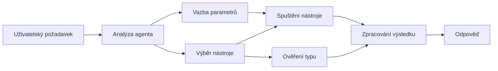

# 🛠️ Pokročilé použití nástrojů s Azure OpenAI (Responses API) (.NET)

## 📋 Cíle učení

Tento poznámkový blok ukazuje vzory integrace nástrojů na podnikové úrovni pomocí Microsoft Agent Framework v .NET s Azure OpenAI (Responses API). Naučíte se vytvářet sofistikované agenty s více specializovanými nástroji, využívající silné typování C# a podnikové funkce .NET.

### Pokročilé schopnosti nástrojů, které ovládnete

- 🔧 **Architektura s více nástroji**: Budování agentů s více specializovanými schopnostmi
- 🎯 **Typově bezpečné spuštění nástrojů**: Využití ověřování při kompilaci v C#
- 📊 **Podnikové vzory nástrojů**: Návrh nástrojů připravených pro produkci a zpracování chyb
- 🔗 **Kombinování nástrojů**: Spojování nástrojů pro složité obchodní workflow

## 🎯 Výhody architektury nástrojů v .NET

### Podnikové vlastnosti nástrojů

- **Ověření při kompilaci**: Silné typování zajišťuje správnost parametrů nástroje
- **Dependency Injection**: Integrace IoC kontejneru pro správu nástrojů
- **Async/Await vzory**: Nezablokující spuštění nástrojů se správou zdrojů
- **Strukturované logování**: Vestavěná integrace logování pro sledování spuštění nástrojů

### Vzory připravené pro produkci

- **Zpracování výjimek**: Komplexní řízení chyb s typovanými výjimkami
- **Správa zdrojů**: Správné vzory uvolňování a správy paměti
- **Monitorování výkonu**: Vestavěné metriky a počítadla výkonu
- **Správa konfigurace**: Typově bezpečná konfigurace s validací

## 🔧 Technická architektura

### Jádrové .NET komponenty nástrojů

- **Microsoft.Extensions.AI**: Jednotná abstraktní vrstva nástrojů
- **Microsoft.Agents.AI**: Orchestrace nástrojů na podnikové úrovni
- **Azure OpenAI (Responses API)**: Vysoce výkonný API klient s poolingem připojení

### Pipeline spuštění nástrojů



## 🛠️ Kategorie nástrojů a vzory

### 1. **Nástroje pro zpracování dat**

- **Validace vstupu**: Silné typování s datovými anotacemi
- **Transformační operace**: Typově bezpečné převody a formátování dat
- **Obchodní logika**: Nástroje pro doménově specifické výpočty a analýzy
- **Formátování výstupu**: Generování strukturovaných odpovědí

### 2. **Integrace nástrojů**

- **API konektory**: Integrace RESTful služeb pomocí HttpClient
- **Databázové nástroje**: Integrace Entity Framework pro přístup k datům
- **Operace se soubory**: Bezpečné operace se souborovým systémem s validací
- **Externí služby**: Vzory integrace služeb třetích stran

### 3. **Užitečné nástroje**

- **Zpracování textu**: Utilitky pro manipulaci a formátování řetězců
- **Operace s datem/časem**: Výpočty data/času citlivé na kulturu
- **Matematické nástroje**: Přesné výpočty a statistické operace
- **Validace nástrojů**: Validace obchodních pravidel a ověření dat

Připraveni vytvářet podnikové agenty s výkonnými, typově bezpečnými schopnostmi nástrojů v .NET? Pojďme navrhnout profesionální řešení! 🏢⚡

## 🚀 Začínáme

### Požadavky

- [.NET 10 SDK](https://dotnet.microsoft.com/download/dotnet/10.0) nebo vyšší
- Předplatné [Azure](https://azure.microsoft.com/free/) s Azure OpenAI zdrojem a nasazením modelu
- [Azure CLI](https://learn.microsoft.com/cli/azure/install-azure-cli) — přihlaste se pomocí `az login`

### Požadované proměnné prostředí

```bash
# zsh/bash
export AZURE_OPENAI_ENDPOINT=https://<your-resource>.openai.azure.com
export AZURE_OPENAI_DEPLOYMENT=gpt-4.1-mini
# Přihlaste se, aby AzureCliCredential mohl získat token
az login
```

```powershell
# PowerShell
$env:AZURE_OPENAI_ENDPOINT = "https://<your-resource>.openai.azure.com"
$env:AZURE_OPENAI_DEPLOYMENT = "gpt-4.1-mini"
# Poté se přihlaste, aby AzureCliCredential mohl získat token
az login
```

### Ukázkový kód

Pro spuštění příkladu kódu,

```bash
# zsh/bash
chmod +x ./04-dotnet-agent-framework.cs
./04-dotnet-agent-framework.cs
```

Nebo použijte dotnet CLI:

```bash
dotnet run ./04-dotnet-agent-framework.cs
```

Viz [`04-dotnet-agent-framework.cs`](../../../../04-tool-use/code_samples/04-dotnet-agent-framework.cs) pro kompletní kód.

```csharp
#!/usr/bin/dotnet run

#:package Microsoft.Extensions.AI@10.*
#:package Microsoft.Agents.AI.OpenAI@1.*-*
#:package Azure.AI.OpenAI@2.1.0
#:package Azure.Identity@1.13.1

using System.ComponentModel;

using Microsoft.Agents.AI;
using Microsoft.Extensions.AI;

using Azure.AI.OpenAI;
using Azure.Identity;

// Tool Function: Random Destination Generator
// This static method will be available to the agent as a callable tool
// The [Description] attribute helps the AI understand when to use this function
// This demonstrates how to create custom tools for AI agents
[Description("Provides a random vacation destination.")]
static string GetRandomDestination()
{
    // List of popular vacation destinations around the world
    // The agent will randomly select from these options
    var destinations = new List<string>
    {
        "Paris, France",
        "Tokyo, Japan",
        "New York City, USA",
        "Sydney, Australia",
        "Rome, Italy",
        "Barcelona, Spain",
        "Cape Town, South Africa",
        "Rio de Janeiro, Brazil",
        "Bangkok, Thailand",
        "Vancouver, Canada"
    };

    // Generate random index and return selected destination
    // Uses System.Random for simple random selection
    var random = new Random();
    int index = random.Next(destinations.Count);
    return destinations[index];
}

// Azure OpenAI with the Responses API (stable v1 endpoint). Sign in with `az login`.
var azureEndpoint = Environment.GetEnvironmentVariable("AZURE_OPENAI_ENDPOINT")
    ?? throw new InvalidOperationException("AZURE_OPENAI_ENDPOINT is not set.");
var deployment = Environment.GetEnvironmentVariable("AZURE_OPENAI_DEPLOYMENT") ?? "gpt-4.1-mini";

var azureClient = new AzureOpenAIClient(new Uri(azureEndpoint), new AzureCliCredential());

// Define Agent Identity and Comprehensive Instructions
// Agent name for identification and logging purposes
var AGENT_NAME = "TravelAgent";

// Detailed instructions that define the agent's personality, capabilities, and behavior
// This system prompt shapes how the agent responds and interacts with users
var AGENT_INSTRUCTIONS = """
You are a helpful AI Agent that can help plan vacations for customers.

Important: When users specify a destination, always plan for that location. Only suggest random destinations when the user hasn't specified a preference.

When the conversation begins, introduce yourself with this message:
"Hello! I'm your TravelAgent assistant. I can help plan vacations and suggest interesting destinations for you. Here are some things you can ask me:
1. Plan a day trip to a specific location
2. Suggest a random vacation destination
3. Find destinations with specific features (beaches, mountains, historical sites, etc.)
4. Plan an alternative trip if you don't like my first suggestion

What kind of trip would you like me to help you plan today?"

Always prioritize user preferences. If they mention a specific destination like "Bali" or "Paris," focus your planning on that location rather than suggesting alternatives.
""";

// Create AI Agent with Advanced Travel Planning Capabilities
// Get the Responses client for the deployment and create the AI agent
// Configure agent with name, detailed instructions, and available tools
// This demonstrates the .NET agent creation pattern with full configuration
AIAgent agent = azureClient
    .GetChatClient(deployment)
    .AsAIAgent(
        name: AGENT_NAME,
        instructions: AGENT_INSTRUCTIONS,
        tools: [AIFunctionFactory.Create(GetRandomDestination)]
    );

// Create New Conversation Session for Context Management
// Initialize a new conversation session to maintain context across multiple interactions
// Sessions enable the agent to remember previous exchanges and maintain conversational state
// This is essential for multi-turn conversations and contextual understanding
await using var session = await agent.CreateSessionAsync();

// Execute Agent: First Travel Planning Request
// Run the agent with an initial request that will likely trigger the random destination tool
// The agent will analyze the request, use the GetRandomDestination tool, and create an itinerary
// Using the session parameter maintains conversation context for subsequent interactions
await foreach (var update in agent.RunStreamingAsync("Plan me a day trip", session))
{
    await Task.Delay(10);
    Console.Write(update);
}

Console.WriteLine();

// Execute Agent: Follow-up Request with Context Awareness
// Demonstrate contextual conversation by referencing the previous response
// The agent remembers the previous destination suggestion and will provide an alternative
// This showcases the power of conversation sessions and contextual understanding in .NET agents
await foreach (var update in agent.RunStreamingAsync("I don't like that destination. Plan me another vacation.", session))
{
    await Task.Delay(10);
    Console.Write(update);
}
```

---

<!-- CO-OP TRANSLATOR DISCLAIMER START -->
**Prohlášení o omezení odpovědnosti**:
Tento dokument byl přeložen pomocí AI překladatelské služby [Co-op Translator](https://github.com/Azure/co-op-translator). Přestože usilujeme o co největší přesnost, mějte prosím na paměti, že automatizované překlady mohou obsahovat chyby nebo nepřesnosti. Originální dokument v jeho mateřském jazyce by měl být považován za autoritativní zdroj. Pro kritické informace se doporučuje profesionální lidský překlad. Nejsme odpovědní za jakékoli nedorozumění nebo nesprávné interpretace vzniklé použitím tohoto překladu.
<!-- CO-OP TRANSLATOR DISCLAIMER END -->