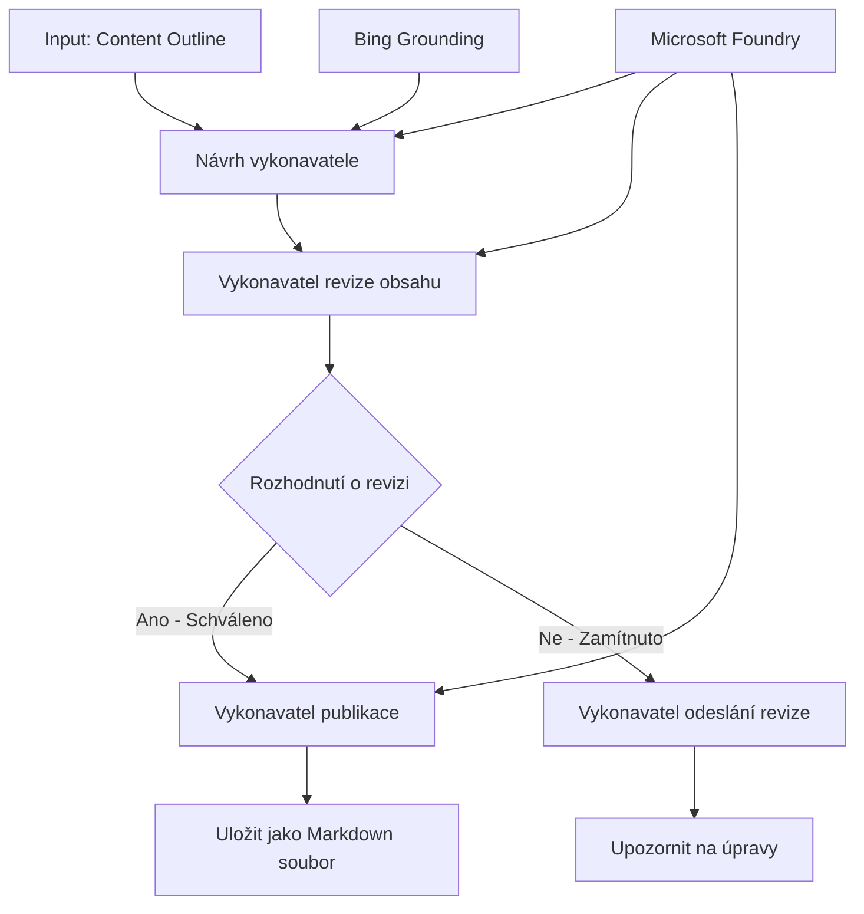

# 🔀 Podmíněné pracovní toky agentů s Microsoft Foundry (.NET)

## 📋 Návod na inteligentní rozhodovací pracovní tok

Tento notebook demonstruje **vzory podmíněných pracovních toků** pomocí Microsoft Foundry a Microsoft Agent Framework pro .NET. Naučíte se, jak vytvářet sofistikované, rozhodováním řízené pracovní toky, které inteligentně směrují zpracování na základě analýzy AI, obchodních pravidel a dynamických podmínek pro automatizaci na úrovni podniku.

## 🎯 Výukové cíle

### 🧠 **Architektura inteligentního rozhodování**
- **Implementace podmíněné logiky**: Vytvářejte složité rozhodovací stromy s více rozcestími
- **Směrování řízené AI**: Používejte modely Microsoft Foundry pro inteligentní rozhodování o směrování
- **Dynamická adaptace pracovního toku**: Měňte chování pracovního toku na základě analýzy v době běhu a podmínek
- **Integrace podnikových pravidel**: Zahrňte obchodní logiku a požadavky na soulad do pracovních toků

### 🔀 **Pokročilé podmíněné vzory**
- **Rozhodování podle více kritérií**: Hodnoťte různé faktory pro rozhodování o směrování
- **Zpracování citlivé na kontext**: Rozhodujte na základě nahromaděného kontextu a historie pracovního toku
- **Adaptivní modifikace pracovního toku**: Dynamicky přizpůsobujte cesty zpracování na základě podmínek v reálném čase
- **Integrace pravidlových motorů**: Implementujte sofistikované obchodní pravidlové motory v pracovních tocích

### 🏢 **Podnikové podmíněné aplikace**
- **Klasifikace a směrování dokumentů**: Automaticky klasifikujte a směrujte dokumenty do příslušných pracovních toků
- **Triage zákaznické podpory**: Inteligentní směrování zákaznických požadavků na specializované týmy
- **Zpracování souladu a rizik**: Uplatnění různých validačních a kontrolních procesů podle hodnocení rizika
- **Pracovní toky pro zajištění kvality**: Směrujte obsah přes příslušné kontrolní procesy na základě metrik kvality

## ⚙️ Předpoklady a nastavení

### 📦 **Požadované balíčky NuGet**

Pokročilé balíčky pro zpracování podmíněných pracovních toků:

```xml
<!-- Core AI Framework -->
<PackageReference Include="Microsoft.Extensions.AI" Version="9.9.0" />

<!-- Azure AI Agents with Persistent State -->
<PackageReference Include="Azure.AI.Agents.Persistent" Version="1.2.0-beta.5" />

<!-- Azure Identity and Utilities -->
<PackageReference Include="Azure.Identity" Version="1.15.0" />
<PackageReference Include="System.Linq.Async" Version="6.0.3" />
<PackageReference Include="DotNetEnv" Version="3.1.1" />

<!-- Local Workflow Framework References -->
<!-- Microsoft.Agents.Workflows.dll - Advanced workflow orchestration -->
<!-- Microsoft.Agents.AI.AzureAI.dll - Microsoft Foundry integration -->
<!-- Microsoft.Agents.AI.dll - Core agent abstractions -->
```

### 🔑 **Konfigurace Microsoft Foundry**

**Požadované zdroje Azure:**
- Prostředí Microsoft Foundry s modely pro podmíněné zpracování
- Předplatné Azure s odpovídajícími kvótami a oprávněními pro výpočet
- Nasazené AI modely pro rozhodování a analýzu obsahu
- (Volitelné) Připojení k Bing Search API pro možnosti podkladu

**Konfigurace prostředí (.env soubor):**
```env
# Microsoft Foundry Configuration
AZURE_AI_PROJECT_ENDPOINT=https://your-project.cognitiveservices.azure.com/
BING_CONNECTION_ID=your-bing-connection-id
```

**Nastavení autentizace:**
```csharp
// Azure CLI or Managed Identity authentication
using Azure.Identity;
var credential = new AzureCliCredential();

// Load environment configuration
DotNetEnv.Env.Load("../../../.env");
```

### 🏗️ **Architektura podmíněného pracovního toku**



**Klíčové komponenty:**
- **Draft Executor**: AI agent, který vytváří první návrhy obsahu z osnov
- **Content Review Executor**: AI agent, který hodnotí kvalitu a soulad návrhů
- **Podmíněné směrování**: Rozhodovací logika, která směruje na základě výsledků hodnocení
- **Cesty pro publikování/kontrolu**: Oddělené zpracovatelské cesty pro schválený a odmítnutý obsah
- **Správa stavu**: Uchovává kontext obsahu a hodnocení během celého pracovního toku

## 🎨 **Vzorové návrhy podmíněných pracovních toků**

### 📋 **Výroba obsahu s kontrolními branami kvality**
```
Outline → Draft Creation → Quality Review → {Approve: Publish | Reject: Revise}
```

### 🎯 **Zpracování dokumentů založené na riziku**
```
Document → Risk Assessment → {Low: Standard | High: Enhanced Review}
```

### 🔍 **Inteligentní směrování zákaznické podpory**
```
Customer Query → Analysis → {Simple: FAQ Bot | Complex: Human Agent}
```

### 💼 **Pracovní toky řízené dodržováním předpisů**
```
Content → Compliance Check → {Pass: Publish | Fail: Legal Review}
```

## 🏢 **Podnikové výhody podmíněných pracovních toků**

### 🎯 **Inteligentní automatizace**
- **Chytré rozhodování**: AI řízená rozhodnutí o směrování založená na analýze obsahu a kontextu
- **Adaptivní zpracování**: Pracovní toky, které se automaticky přizpůsobují měnícím se podmínkám
- **Prosazení obchodních pravidel**: Automatická aplikace složité obchodní logiky a pravidel
- **Směrování citlivé na kontext**: Rozhodnutí založená na úplné historii pracovního toku a nahromaděném kontextu

### 📈 **Výjimečný provoz**
- **Optimalizované přidělování zdrojů**: Směrujte práci k nejvhodnějším specialistům a procesům
- **Snížený ruční zásah**: Automatizované rozhodování minimalizuje potřebu lidského směrování
- **Rychlejší řešení**: Přímé směrování k odpovídajícím odborníkům a kapacitám zpracování
- **Konzistentní aplikace**: Jednotné uplatňování obchodních pravidel a rozhodovacích kritérií

### 🛡️ **Řízení rizik a dodržování předpisů**
- **Automatizované hodnocení rizik**: AI řízené hodnocení úrovně rizika obsahu a situace
- **Prosazení souladu**: Automatické směrování přes požadované regulační procesy
- **Aplikace bezpečnostních protokolů**: Rozšířená zabezpečení aplikovaná podle hodnocení rizika
- **Údržba auditních stop**: Kompletní dokumentace rozhodnutí o směrování a jejich odůvodnění

### 📊 **Analytika a kontinuální zlepšování**
- **Analýza rozhodování**: Sledování efektivity a přesnosti rozhodovacích procesů
- **Rozpoznávání vzorců**: Identifikace trendů a vzorců v rozhodovacích procesech v čase
- **Optimalizace výkonu**: Neustálé zlepšování kritérií rozhodování a efektivity směrování
- **Podniková inteligence**: Přehledy o charakteristikách obsahu a požadavcích na zpracování

### 🔧 **Technická dokonalost**
- **Perzistentní správa stavu**: Uchovávání komplexního stavu během vykonávání pracovního toku
- **Škálovatelná architektura**: Zvládání vysokého objemu požadavků na podmíněné zpracování
- **Integrace**: Bezproblémová integrace se stávajícími obchodními systémy a procesy
- **Monitorování a observabilita**: Komplexní sledování výkonu pracovního toku a rozhodnutí

Pojďme vytvořit inteligentní, rozhodováním řízené podnikové pracovní toky s .NET! 🚀

## 💻 Spuštění kódu

Kompletní implementace je k dispozici v `04.dotnet-agent-framework-workflow-aifoundry-condition.cs`. Tato ukazuje **pracovní tok výroby obsahu s kontrolními branami kvality**:

### 🏗️ **Architektura pracovního toku**

```
Content Outline → Draft Creation → Quality Review → Conditional Routing:
                                                      ├─ Approved (>200 words) → Publish
                                                      └─ Rejected (<200 words) → Review Notification
```

**Agenti v pracovním toku:**
1. **Evangelist Agent**: Vytváří návrhy návodů z osnov s Bing podkladem
2. **Content Reviewer Agent**: Hodnotí kvalitu návrhu (počet slov, úplnost)
3. **Publisher Agent**: Ukládá schválený obsah jako časově označené Markdown soubory

**Vlastní vykonavatelé:**
1. **DraftExecutor**: Koordinuje tvorbu návrhů
2. **ContentReviewExecutor**: Provádí hodnocení kvality
3. **PublishExecutor**: Zajišťuje vydávání schváleného obsahu
4. **SendReviewExecutor**: Spravuje oznámení o zamítnutém obsahu

### 🚀 Spuštění příkladu

**Předpoklady:**
- Konfigurované prostředí Microsoft Foundry
- Autentizace pomocí Azure CLI (`az login`)
- (Volitelné) Připojení k Bing Search pro podkladové informace

```bash
# Nastavte skript jako spustitelný (Unix/Linux/macOS)
chmod +x 04.dotnet-agent-framework-workflow-aifoundry-condition.cs

# Spusťte podmíněný pracovní postup
./04.dotnet-agent-framework-workflow-aifoundry-condition.cs
```

Nebo na Windows:
```powershell
dotnet run 04.dotnet-agent-framework-workflow-aifoundry-condition.cs
```

### 📝 Očekávaný výstup

Pracovní tok:
1. **Vytvoří agentů**: Inicializuje tři specializované agenty Microsoft Foundry
2. **Vygeneruje návrh**: Evangelist agent vytvoří návrh návodu z osnov
3. **Zhodnotí obsah**: Content Reviewer zhodnotí kvalitu návrhu
4. **Podmíněné směrování**:
   - **Pokud schválen (>200 slov)**: Publish executor uloží jako Markdown soubor
   - **Pokud zamítnut (<200 slov)**: Odešle oznámení o kontrole
5. **Zobrazí výsledky**: Ukáže konečný výsledek pracovního toku

### 🔧 Možnosti přizpůsobení

**Upravte kritéria hodnocení:**
```csharp
const string ContentReviewerInstructions = @"
You are a content reviewer...
1. Check if content is more than 500 words (instead of 200)
2. Verify technical accuracy
3. Ensure proper formatting
...";
```

**Přidejte více podmíněných cest:**
```csharp
var workflow = new WorkflowBuilder(draftExecutor)
    .AddEdge(draftExecutor, contentReviewerExecutor)
    .AddEdge(contentReviewerExecutor, publishExecutor, condition: GetCondition("Excellent"))
    .AddEdge(contentReviewerExecutor, editExecutor, condition: GetCondition("Good"))
    .AddEdge(contentReviewerExecutor, sendReviewerExecutor, condition: GetCondition("Poor"))
    .Build();
```

**Změňte požadavky na obsah:**
```csharp
string OUTLINE_Content = @"
# Your Custom Topic
## Section 1
https://your-reference-url
## Section 2
...
";
```

### 🎯 Aplikace v praxi

Tento podmíněný vzor pracovního toku je ideální pro:
- **Systémy pro správu obsahu**: Automatizované redakční pracovní toky s kontrolními branami kvality
- **Zpracování dokumentů**: Směrování dokumentů podle klasifikace a souladu
- **Zákaznická podpora**: Inteligentní směrování ticketů podle složitosti a naléhavosti
- **Právní kontrola**: Směrování smluv podle hodnocení rizika a hodnoty
- **Personální procesy**: Směrování žádostí přes odpovídající skríningové pracovní toky

### 🔍 Porozumění podmíněné logice

**Funkce podmínky:**
```csharp
public Func<object?, bool> GetCondition(string expectedResult) =>
    reviewResult => reviewResult is ReviewResult review && review.Result == expectedResult;
```

Tato funkce vytváří predikát, který:
1. Kontroluje, zda je výsledek typu `ReviewResult`
2. Porovnává vlastnost `Result` s očekávanou hodnotou
3. Vrací true/false pro určení směrování

**Hrany pracovního toku s podmínkami:**
```csharp
.AddEdge(contentReviewerExecutor, publishExecutor, condition: GetCondition("Yes"))
.AddEdge(contentReviewerExecutor, sendReviewerExecutor, condition: GetCondition("No"))
```

### 📊 Pokročilé funkce

**Validace JSON schématu:**
Pracovní tok používá JSON schémata pro zajištění strukturovaných odpovědí:

```csharp
// Define response structure
public class ReviewResult
{
    [JsonPropertyName("review_result")]
    public string Result { get; set; } = string.Empty;
    
    [JsonPropertyName("reason")]
    public string Reason { get; set; } = string.Empty;
    
    [JsonPropertyName("draft_content")]
    public string DraftContent { get; set; } = string.Empty;
}

// Apply to agent
ResponseFormat = ChatResponseFormat.ForJsonSchema(
    AIJsonUtilities.CreateJsonSchema(typeof(ReviewResult)), 
    "ReviewResult", 
    "Review Result From DraftContent"
)
```

**Integrace podkladu Bing:**
Evangelist agent používá Bing podklad k přístupu k aktuálním informacím:

```csharp
var bingGroundingConfig = new BingGroundingSearchConfiguration(bing_conn_id);
BingGroundingToolDefinition bingGroundingTool = new(
    new BingGroundingSearchToolParameters([bingGroundingConfig])
);
```

To agentovi umožňuje sledovat URL v osnově a získávat aktuální informace.

### 🛡️ Zpracování chyb

Pracovní tok obsahuje robustní zpracování chyb pro zamítnutý obsah:
- Selhání hodnocení vyvolávají alternativní cestu
- Oznámení poskytnou jasné důvody zamítnutí
- Obsah je zachován pro revizi

### 🔄 Rozšíření pracovního toku

**Přidejte smyčku revize:**
Vytvořte zpětnou smyčku, která automaticky přepracovává obsah:

```csharp
.AddEdge(contentReviewerExecutor, publishExecutor, condition: GetCondition("Yes"))
.AddEdge(contentReviewerExecutor, draftExecutor, condition: GetCondition("No")) // Loop back
```

**Implementujte vícestupňové hodnocení:**
Přidejte více stupňů hodnocení s různými kritérii:

```csharp
.AddEdge(draftExecutor, technicalReviewer)
.AddEdge(technicalReviewer, editorialReviewer, condition: GetCondition("TechPass"))
.AddEdge(editorialReviewer, publishExecutor, condition: GetCondition("EditPass"))
```

Tento podmíněný vzor pracovního toku poskytuje základ pro vytváření sofistikovaných, inteligentních systémů podnikové automatizace! 🚀

---

<!-- CO-OP TRANSLATOR DISCLAIMER START -->
**Prohlášení o omezení odpovědnosti**:
Tento dokument byl přeložen pomocí AI překladatelské služby [Co-op Translator](https://github.com/Azure/co-op-translator). Přestože usilujeme o co největší přesnost, mějte prosím na paměti, že automatizované překlady mohou obsahovat chyby nebo nepřesnosti. Originální dokument v jeho mateřském jazyce by měl být považován za autoritativní zdroj. Pro kritické informace se doporučuje profesionální lidský překlad. Nejsme odpovědní za jakékoli nedorozumění nebo nesprávné interpretace vzniklé použitím tohoto překladu.
<!-- CO-OP TRANSLATOR DISCLAIMER END -->