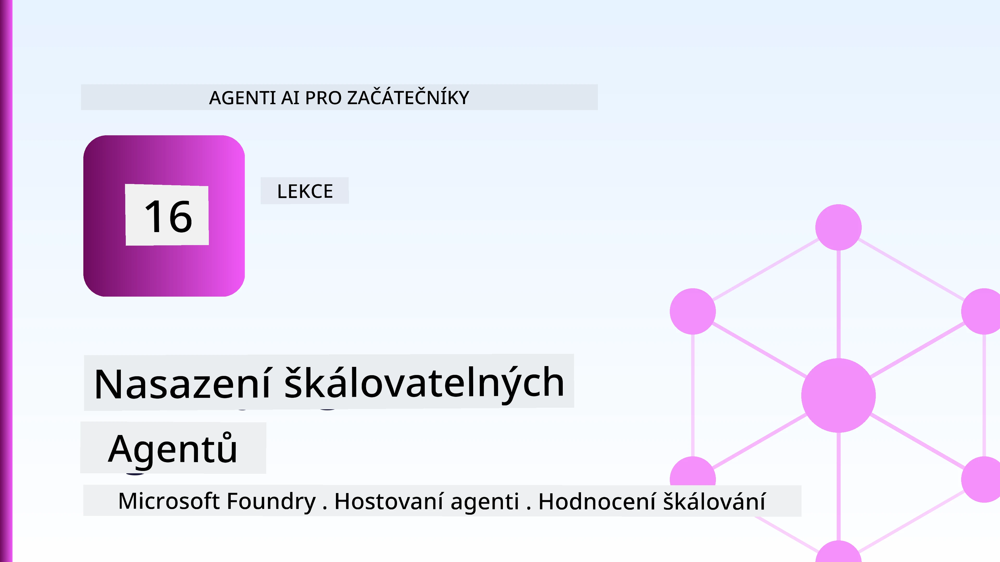
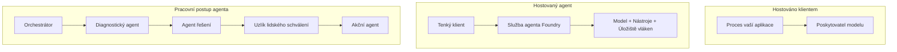
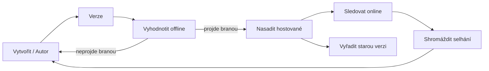
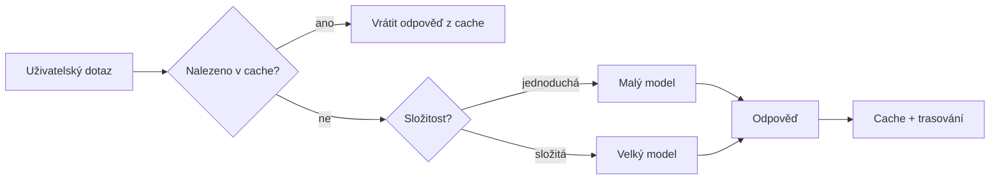
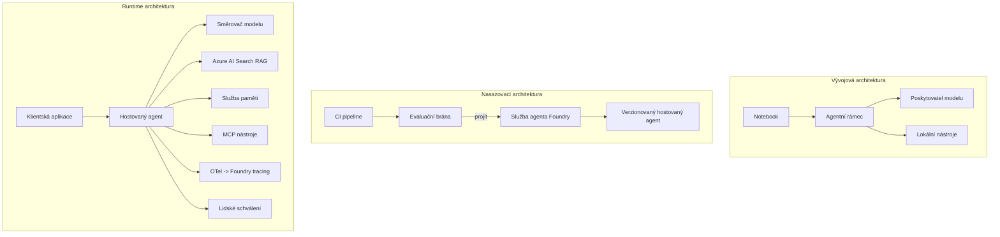

# Nasazení škálovatelných agentů s Microsoft Foundry



Do tohoto bodu kurzu jste vytvářeli agenty, kteří běží na vašem notebooku, uvnitř poznámkového bloku, řízeni pomocí `az login` a několika proměnných prostředí. To je přesně ten správný způsob, jak se učit. Není to však správný způsob, jak provozovat agenta, na kterém tisíce zákazníků závisí ve 3 ráno.

Tato lekce je o propasti mezi „funguje to na mém počítači“ a „funguje to spolehlivě a dostupně v produkci“. Tuto propast uzavíráme pomocí **Microsoft Foundry** a **Microsoft Foundry Agent Service**, a to tak, že stavíme skutečného zákaznického support agenta, který má nástroje, vyhledávání, paměť, vyhodnocování a monitoring.

## Úvod

Tato lekce pokrývá:

- Rozdíl mezi **prototypovým agentem** a **nasazeným agentem** a proč je přechod hlavně o všem, co je *okolo* modelu.
- **Vzorové způsoby nasazení** agentů: hostované na klientovi, hostované jako služba (Hosted Agents) a orchestrací workflow.
- **Životní cyklus agenta** na Microsoft Foundry — vytvoření, verzování, nasazení, vyhodnocení, pozorování, ukončení.
- **Strategie škálování**: směrování modelu, cachování, souběžnost a bezstavový design.
- **Pozorovatelnost** pomocí OpenTelemetry a sledování ve Foundry.
- **Optimalizace nákladů** pomocí volby modelu, směrování a hodnoticích bran.
- **Podnikové úvahy**: správa, lidské schvalování a bezpečný provoz MCP serverů v produkci.

## Cíle učení

Po dokončení této lekce budete umět:

- Vybrat správný vzor nasazení pro dané zatížení agenta.
- Nasadit agenta do Microsoft Foundry Agent Service, aby byl verzovaný, spravovaný a pozorovatelný.
- Instrumentovat agenta pro sledování a propojit hodnoticí pipeline, která běží před každým releasem.
- Použít směrování modelu a cachování ke kontrole latence a nákladů ve velkém měřítku.
- Přidat lidskou schvalovací bránu pro vysoce rizikové akce a integrovat MCP server bezpečně do produkce.

## Předpoklady

Tato lekce předpokládá, že jste absolvovali předchozí lekce a jste obeznámeni s:

- Stavbou agentů pomocí [Microsoft Agent Framework](../14-microsoft-agent-framework/README.md) (Lekce 14).
- [Používání nástrojů](../04-tool-use/README.md) (Lekce 4) a [Agentic RAG](../05-agentic-rag/README.md) (Lekce 5).
- [Pamětí agenta](../13-agent-memory/README.md) (Lekce 13) a [Agentic protokoly / MCP](../11-agentic-protocols/README.md) (Lekce 11).
- [Pozorovatelností a vyhodnocováním](../10-ai-agents-production/README.md) (Lekce 10) — tato lekce na této staví přímo.

Budete také potřebovat:

- **Azure subscription** a **Microsoft Foundry projekt** s minimálně jedním nasazeným chatovacím modelem.
- Autentizovanou **Azure CLI** (`az login`).
- Python 3.12+ a balíčky ve repozitáři [`requirements.txt`](../../../requirements.txt).

## Od prototypu k produkci: co se vlastně mění

Prototypový agent a produkční agent sdílejí stejnou hlavní smyčku — uvažuj, vyvolej nástroje, reaguj. Mění se vše, co je navlečeno kolem této smyčky. Model tvoří asi 20 % produkčního agenta; zbývajících 80 % je provozní kostra.

| Oblast | Prototyp | Produkce |
| --- | --- | --- |
| **Hosting** | Běží ve vašem poznámkovém bloku | Běží jako hostovaná služba, verzovaná a rolloutovaná |
| **Identita** | Váš token `az login` | Spravovaná identita s omezeným RBAC |
| **Stav** | V paměti, ztraceno po restartu | Externí (uložena vlákna, paměťová služba) |
| **Selhání** | Vidíte traceback | Opakování, záložní cesty, mrtvá pošta, výstrahy |
| **Náklady** | „Je to pár centů“ | Sledované na požadavek, směrovány, cachovány, rozpočtovány |
| **Kvalita** | Odborně řídíte výstup očima | Automaticky hodnoceno před každým releasem |
| **Důvěra** | Schvalujete každou akci | Politika + člověk v cyklu pro rizikové akce |

Mějte tuto tabulku na paměti. Každá sekce níže odpovídá jednomu z těchto řádků.

## Vzory nasazení agentů

Existují tři vzory, které budete používat, často v kombinaci.

### 1. Agenti hostovaní na klientovi

Objekt agenta žije uvnitř *vašeho* aplikačního procesu. Váš kód volá poskytovatele modelu přímo; smyčka uvažování běží ve vaší službě. To je to, co každá předchozí lekce dělala.

- **Použijte, když** potřebujete plnou kontrolu nad smyčkou, vlastní middleware nebo integraci agenta do stávající backendové služby.
- **Kompromis**: škálování, stav a odolnost řešíte sami.

### 2. Hostovaní agenti (Foundry Agent Service)

Agent je *registrován jako zdroj* v Microsoft Foundry. Foundry hostí smyčku uvažování, ukládá vlákna, vynucuje bezpečnost obsahu a RBAC a zviditelňuje agenta v portálu Foundry. Vaše aplikace se stává tenkým klientem, který vytváří vlákna a čte odpovědi.

- **Použijte, když** chcete trvanlivost, zabudovanou pozorovatelnost, správu a menší provozní povrch.
- **Kompromis**: méně nízkoúrovňové kontroly výměnou za spravované runtime.

### 3. Workflow agentů

Více agentů (a nástrojů) je složeno do grafu s explicitním tokem řízení — sekvenční kroky, rozvětvení, uzly lidského schválení a trvalé kontrolní body, které mohou pozastavit a obnovit běh. Je to schopnost Microsoft Agent Frameworku **Workflows** použitá ve škálovatelné produkci.

- **Použijte, když** jedna úloha pokrývá několik specializovaných agentů nebo vyžaduje schvalovací krok uprostřed.
- **Kompromis**: více pohyblivých částí; potřebuje pozorovatelnost na úrovni orchestrace.



## Životní cyklus agenta na Microsoft Foundry

Nasazení agenta není jednorázový `push`. Je to smyčka a vypadá hodně jako cyklus vydávání softwaru, protože to přesně tak je.



Klíčová myšlenka, převzatá z [Lekce 10](../10-ai-agents-production/README.md): **offline vyhodnocení je brána, ne dodatečná záležitost.** Nová verze agenta neprojde, pokud nevyhoví vašim hodnotícím prahům. Online pozorovatelnost pak přivádí skutečné selhání zpět do offline testovací sady. To je celý cyklus.

## Strategie škálování

Škálování agenta se liší od škálování bezstavového webového API, protože každý požadavek může spustit několik nákladných modelových a nástrojových volání. Čtyři techniky nesou většinu zátěže.

**Bezustavová správa požadavků.** Neuchovávejte stav uživatele v paměti procesu. Přetrvávejte konverzační vlákna ve Foundry thread store nebo paměťové službě, takže jakákoli instance může spravovat jakýkoli požadavek. To vám umožňuje škálovat horizontálně — přidávejte instance, žádné sticky sessions.

**Směrování modelu.** Ne každý požadavek potřebuje váš nejvýkonnější (a nejdražší) model. Směřujte jednoduché požadavky — klasifikaci záměru, krátké faktické odpovědi — na malý, rychlý model a rezervujte velký model pro skutečné uvažování. Foundry má **Model Router**, který to udělá za vás, nebo si můžete implementovat lehký klasifikátor sami. V laboratorním cvičení vybudujete DIY verzi.

**Cachování odpovědí.** Mnoho dotazů podporu jsou téměř duplikáty („jak resetuji heslo?“). Cachujte odpovědi na běžné otázky a podávejte je bez nutnosti volání modelu. I mírná míra cache hit zásadně snižuje náklady a latenci.

**Souběžnost a zpětný tlak.** Poskytovatelé modelů mají limity rychlosti. Omezte souběžnost, používejte opakování s exponenciálním odstupem a selhání řešte jemně (zařazená odpověď „pracujeme na tom“ je lepší než 500).



## Pozorovatelnost v produkci

Nemůžete provozovat to, co nevidíte. Jak bylo pokryto v Lekci 10, Microsoft Agent Framework nativně emitovat **OpenTelemetry** stopy — každé volání modelu, vyvolání nástroje a orchestrální krok se stává spanem. V produkci exportujete tyto spany do Microsoft Foundry (nebo jakéhokoli backendu kompatibilního s OTel), abyste mohli:

- Sledovat jediný zákaznický problém vzájemně skrze všechna volání modelu a nástroje.
- Sledovat latenci p50/p95 a náklady na požadavek v čase.
- Varovat na nárůsty chybovosti a anomálie nákladů dříve, než si jich všimnou vaši uživatelé (nebo finanční tým).

```python
from agent_framework.observability import get_tracer

tracer = get_tracer()

with tracer.start_as_current_span("support_request") as span:
    span.set_attribute("customer.tier", "enterprise")
    span.set_attribute("routed.model", "gpt-4.1-mini")
    # vykonávání agenta je automaticky sledováno uvnitř tohoto rozsahu
```

Atributy jako `customer.tier` a `routed.model` proměňují ze zdi stop odpověditelné otázky („jsou podnikový zákazníci příliš často směrováni na malý model?“).

## Optimalizace nákladů

Náklady u produkčních agentů jsou dominantně určovány tokeny. Tři páky, podle dopadu:

1. **Správná velikost modelu.** Malý model, který projde hodnotící bránou, je téměř vždy levnější než velký model, který také projde. Použijte evaluaci k *prokázání*, že malý model je dostatečně dobrý, místo abyste z opatrnosti volili největší model.
2. **Směrujte podle složitosti.** Jak uvedeno výše — platíte cenu velkého modelu jen za požadavky, které vyžadují velké uvažování.
3. **Agresivní cachování.** Nejlevnější volání modelu je to, které nikdy neprovedete.

Hodnotící brány a řízení nákladů jsou stejnou disciplínou viděnou ze dvou úhlů: evaluace určuje *kvalitativní minimum*, směrování a cachování udržují náklady co nejblíž k tomuto minimu.

## Podnikové úvahy o nasazení

**Správa.** Hostovaní agenti dědí RBAC, bezpečnost obsahu a auditní protokol Foundry. Dejte každému agentovi spravovanou identitu s minimálními potřebnými právy — pouze čtení do znalostní databáze, omezený přístup k API ticketů, nic víc.

**Člověk v cyklu.** Některé akce jsou příliš závažné na plnou automatizaci — vrácení peněz, smazání účtu, eskalace na právní tým. Microsoft Agent Framework podporuje nástroje vyžadující **schválení**: agent navrhne akci, vykonávání se pozastaví, člověk schválí nebo odmítne a workflow pokračuje. Tento primitiv jste viděli v [Lekci 6](../06-building-trustworthy-agents/README.md); zde jej nasadíte.

**MCP v produkci.** [MCP](../11-agentic-protocols/README.md) umožňuje agentovi používat externí nástroje přes standardní rozhraní. V produkci považujte každý MCP server za nedůvěryhodnou hranici: připněte verzi serveru, spusťte jej s omezenou identitou, validujte jeho výstupy a nikdy mu nezveřejňujte tajemství. MCP server je závislost, a závislosti se patchují, auditují a omezují.



Tato tři schémata — vývoj, nasazení, runtime — jsou stejný agent ve třech fázích života. Následující laboratoř vás provede jeho stavbou.

## Praktická laboratoř: Zákaznický support agent připravený do produkce

Otevřete [`code_samples/16-python-agent-framework.ipynb`](./code_samples/16-python-agent-framework.ipynb) a projděte jej celý. Sestavíte **Contoso zákaznického support agenta** se všemi produkčními aspekty:

1. **Volání nástrojů** — kontrola stavu objednávky a otevření support ticketů.
2. **RAG** — odpovídání na otázky ohledně politiky ze znalostní databáze (Azure AI Search s fallbackem v paměti, aby poznámkový blok fungoval bez Search zdroje).
3. **Paměť** — zapamatování si zákazníka přes průběh konverzace.
4. **Směrování modelu** — klasifikátor složitosti směruje každý požadavek na malý nebo velký model.
5. **Cachování odpovědí** — opakované otázky jsou podávány z cache.
6. **Lidské schválení** — refundace nad stanovený limit vyžadují lidské potvrzení.
7. **Hodnoticí pipeline** — malá offline testovací sada skóruje agenta a slouží jako brána pro release.
8. **Pozorovatelnost** — OpenTelemetry sledování kolem každého požadavku.

### Průchod

Poznámkový blok je uspořádán tak, že každý produkční aspekt je samostatná, spustitelná sekce. Jádrem je request handler kombinující směrování a cachování:

```python
async def handle_support_request(query: str, customer_id: str) -> str:
    # 1. Podávejte ze zásobníku, kdykoli to můžeme.
    cached = response_cache.get(normalize(query))
    if cached:
        return cached

    # 2. Směrujte podle složitosti pro kontrolu nákladů.
    model = "gpt-4.1-mini" if is_simple(query) else "gpt-4.1"

    # 3. Spusťte agenta uvnitř stopovacího rozsahu pro sledovatelnost.
    with tracer.start_as_current_span("support_request") as span:
        span.set_attribute("routed.model", model)
        span.set_attribute("customer.id", customer_id)
        response = await support_agent.run(query, model=model)

    # 4. Uložte do cache a vraťte.
    response_cache.set(normalize(query), response.text)
    return response.text
```

Brána pro vyhodnocení, která hlídá vydání, vypadá takto:

```python
async def evaluation_gate(agent, test_cases, threshold: float = 0.8) -> bool:
    passed = 0
    for case in test_cases:
        result = await agent.run(case["input"])
        if score_response(result.text, case["expected"]) >= 0.8:
            passed += 1
    pass_rate = passed / len(test_cases)
    print(f"Evaluation pass rate: {pass_rate:.0%} (gate: {threshold:.0%})")
    return pass_rate >= threshold  # nasadit pouze pokud brána projde
```

Přečtěte si každý řádek — poznámkový blok drží primitiva úmyslně malá, aby nic nebylo skryto za voláním frameworku.

## Validace nasazeného agenta pomocí smoke testů

Hodnoticí brána výše běží *offline* proti vašemu agentovi v paměti. Jakmile je agent nasazen jako Hosted Agent, potřebujete ještě jednu, ještě levnější kontrolu: **odpovídá nasazený endpoint vůbec?**

„Úspěšné“ nasazení znamená jen, že kontrolní rovina přijala definici — ne že agent odpovídá. Chybějící závislost, chybné směrování modelu nebo vypršené spojení mohou zanechat zelené nasazení, ale bez odpovědi. **Smoke test** to zachytí během sekund, při každém nasazení, bez nákladů plného vyhodnocení.

Tento repozitář obsahuje připravenou smoke-test pipeline postavenou na GitHub Action [AI Smoke Test](https://github.com/marketplace/actions/ai-smoke-test):

- **Katalog** — [`tests/lesson-16-smoke-tests.json`](../../../tests/lesson-16-smoke-tests.json) obsahuje prompty a tvrzení pro Contoso support agenta (odpovědi založené na politice, vyhledání objednávky, držení tématu a kontinuita multi-turn konverzace). Katalogy pro agenty jiných lekcí jsou vedle něj — viz [`tests/README.md`](../tests/README.md).
- **Workflow** — [`.github/workflows/smoke-test.yml`](../../../.github/workflows/smoke-test.yml) přihlašuje se pomocí Azure OIDC a POSTuje každý prompt na agentův endpoint Responses, který při jakékoli nevyhovující odpovědi ukončí práci jako neúspěšnou.

```yaml
- name: Smoke-test hosted agent
  uses: JFolberth/ai-smoketest@v1
  with:
    project_endpoint: ${{ inputs.project_endpoint }}
    agent_name: ContosoSupportAgent
    tests_file: tests/lesson-16-smoke-tests.json
```


Spusťte jej z karty **Actions**, jakmile je váš agent nasazen, a zadejte konečný bod projektu Foundry a jméno agenta. Federovaná identita potřebuje roli **Azure AI User** v rozsahu projektu Foundry. Představte si vrstvy jako pyramidu: smoke testy (dostupný a odpovídá?) se spouští při každém nasazení, offline vyhodnocení (je dostatečně dobrý na nasazení?) se provádí před propagací a online vyhodnocení (jak si vede ve volné přírodě?) běží kontinuálně.

## Kontrola znalostí

Otestujte své porozumění před přesunem k zadání.

**1. Přibližně kolik produkčního agenta tvoří „model“ a co je zbytek?**

<details>
<summary>Odpověď</summary>

Model tvoří minoritu systému — často uváděnou kolem 20 %. Zbytek je provozní kostra: hostování a verzování, identita a RBAC, externalizovaný stav, řešení chyb, sledování nákladů, vyhodnocení a kontroly zapojení člověka. Přechod do produkce většinou znamená postavit vše *kolem* smyčky uvažování.
</details>

**2. Kdy byste zvolili Hosted Agenta oproti agentovi hostovanému na klientovi?**

<details>
<summary>Odpověď</summary>

Když chcete řízené běhové prostředí s vestavěnou odolností (vlákna, která přetrvávají a mohou pokračovat), pozorovatelností, bezpečností obsahu a RBAC a jste ochotni obětovat část nízkoúrovňové kontroly nad smyčkou uvažování za menší provozní povrch. Agent hostovaný klientem je vhodný, když potřebujete úplnou kontrolu nad smyčkou nebo vkládáte agenta do existujícího backendu.
</details>

**3. Proč musí být škálovatelný agent bezstavový ve své vlastní paměti procesu?**

<details>
<summary>Odpověď</summary>

Aby jakákoli instance mohla zpracovat jakýkoli požadavek, což umožňuje horizontální škálování bez vazebných relací (sticky sessions). Stav konverzace pro uživatele je externalizován do úložiště vláken nebo paměťové služby. Kdyby byl stav uložen v paměti procesu, při restartu by se ztratil a nebylo by možné volně rozkládat zatížení.
</details>

**4. Jaký problém řeší směrování modelu a jak souvisí s vyhodnocením?**

<details>
<summary>Odpověď</summary>

Směrování posílá jednoduché požadavky malému, levnému a rychlému modelu a vyhrazuje velký model pro skutečné uvažování, čímž ovládá latenci i náklady. Souvisí to s vyhodnocením, protože vyhodnocení *dokazuje*, že malý model je dostatečně dobrý pro určitou třídu požadavků — směrování bez vyhodnocení je hádání.
</details>

**5. Co je to „evaluační brána“ a kde se nachází v životním cyklu?**

<details>
<summary>Odpověď</summary>

Evaluační brána spouští offline testovací sadu na nové verzi agenta a blokuje nasazení, pokud míra úspěšnosti nepřesáhne stanovený práh. Nachází se mezi „verze“ a „nasazení“ v životním cyklu, čímž činí kvalitu předpokladem pro vydání místo něčeho, co se kontroluje po nasazení.
</details>

**6. Proč by měl být server MCP považován za nedůvěryhodnou hranici v produkci?**

<details>
<summary>Odpověď</summary>

Protože jde o externí závislost, na kterou agent volá. Verzi byste měli zamknout, spouštět ji s omezenou identitou, validovat výstupy, omezovat míru volání a nikdy jí nesdělovat tajemství — stejná disciplína jako u jakékoli třetí strany. Její výstupy vstupují do uvažování agenta, takže nevalidovaná důvěra představuje bezpečnostní riziko.
</details>

**7. Která jediná změna obvykle má největší dopad na náklady produkčního agenta a proč?**

<details>
<summary>Odpověď</summary>

Správná volba velikosti modelu — použití co nejmenšího modelu, který stále projde vyhodnocovací branou. Náklady jsou primárně závislé na tokenech a menší model splňující kvalitu je téměř vždy levnější než větší. Ke snižování nákladů dále přispívají caching a směrování, ale volba správného základního modelu má největší prvotní efekt.
</details>

**8. Jakou roli hrají atributy rozsahu jako `customer.tier` a `routed.model` v pozorovatelnosti?**

<details>
<summary>Odpověď</summary>

Přeměňují surové stopy na zodpověditelné obchodní otázky. Bez atributů máte zeď rozsahů; s nimi můžete ptát, „jsou firemní zákazníci příliš často směrováni na malý model?“ nebo „který model zpracovává naše nejpomalejší požadavky?“ Atributy slouží k řezání telemetrie podle dimenzí, které jsou pro váš provoz důležité.
</details>

## Zadání

Vezměte zákaznického podporného agenta z laboratoře a přizpůsobte jej pro konkrétní scénář: **agent podpory pro fakturaci předplatného pro SaaS společnost.**

Vaše odevzdání by mělo:

1. **Nahradit nástroje** těmi relevantními pro fakturaci: `get_subscription_status`, `get_invoice`, a `issue_credit` (kredit nad 50 $ vyžaduje schválení člověkem).
2. **Přidat tři RAG dokumenty** pokrývající politiku refundací společnosti, fakturační cyklus a storno podmínky.
3. **Rozšířit evaluační sadu** na minimálně osm případů, včetně alespoň dvou, které *by měly* spustit cestu schválení člověkem, a potvrdit, že vaše evaluační brána správně projde nebo selže.
4. **Přidat jednu zprávu o nákladech**: po spuštění deseti smíšených dotazů přes agenta vytisknout, kolik jich šlo na malý model, kolik na velký a kolik bylo obslouženo z cache.

Napište krátký odstavec (v markdown buňce) vysvětlující, kterou pravidlo pro směrování modelu jste zvolili a jak byste jej ověřili na reálném provozu. Neexistuje jedna správná odpověď — hodnotí se, zda jsou produkční aspekty propojeny koherentně.

## Shrnutí

V této lekci jste přesunuli agenta z prototypu do produkce s Microsoft Foundry:

- Skok do produkce je většinou o **provozní kostře** kolem modelu — hostování, identita, stav, řešení chyb, náklady, kvalita a důvěra.
- Naučili jste se tři **vzory nasazení** — hostování na klientovi, Hosted Agenti a Agent Workflows — a kdy se který hodí.
- Prošli jste **životní cyklus agenta**, kde offline **vyhodnocení funguje jako brána pro vydání** a online pozorovatelnost vrací chyby zpět do testovací sady.
- Použili jste **strategie škálování** — bezstavový design, směrování modelu, caching a omezenou souběžnost — a spojili je s **optimalizací nákladů**.
- Zapojili jste **firemní kontroly**: RBAC, schválení člověkem a produkčně bezpečnou integraci MCP.
- Vybudovali jste **produkcí připraveného agenta zákaznické podpory**, který všechny tyto aspekty spojuje do spustitelného kódu.

Další lekce podnikne opačnou cestu: místo škálování agentů do cloudu je stáhnete *dolů* na jediný vývojářský počítač a poběžíte je zcela lokálně.

## Další zdroje

- <a href="https://learn.microsoft.com/azure/ai-foundry/what-is-azure-ai-foundry" target="_blank">Dokumentace Microsoft Foundry</a>
- <a href="https://learn.microsoft.com/azure/ai-foundry/agents/overview" target="_blank">Přehled služby agentů Microsoft Foundry</a>
- <a href="https://aka.ms/ai-agents-beginners/agent-framework" target="_blank">Microsoft Agent Framework</a>
- <a href="https://learn.microsoft.com/azure/ai-foundry/concepts/model-router" target="_blank">Model Router v Microsoft Foundry</a>
- <a href="https://learn.microsoft.com/azure/search/search-what-is-azure-search" target="_blank">Azure AI Search</a>
- <a href="https://opentelemetry.io/" target="_blank">OpenTelemetry</a>
- <a href="https://github.com/marketplace/actions/ai-smoke-test" target="_blank">AI Smoke Test GitHub Action</a>
- <a href="https://modelcontextprotocol.io/" target="_blank">Model Context Protocol (MCP)</a>

## Předchozí lekce

[Vytváření agentů pro používání počítače (CUA)](../15-browser-use/README.md)

## Následující lekce

[Vytváření lokálních AI agentů](../17-creating-local-ai-agents/README.md)

---

<!-- CO-OP TRANSLATOR DISCLAIMER START -->
**Prohlášení o omezení odpovědnosti**:
Tento dokument byl přeložen pomocí AI překladatelské služby [Co-op Translator](https://github.com/Azure/co-op-translator). Přestože usilujeme o co největší přesnost, mějte prosím na paměti, že automatizované překlady mohou obsahovat chyby nebo nepřesnosti. Originální dokument v jeho mateřském jazyce by měl být považován za autoritativní zdroj. Pro kritické informace se doporučuje profesionální lidský překlad. Nejsme odpovědní za jakékoli nedorozumění nebo nesprávné interpretace vzniklé použitím tohoto překladu.
<!-- CO-OP TRANSLATOR DISCLAIMER END -->