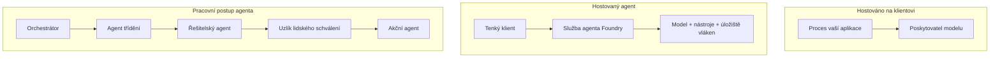
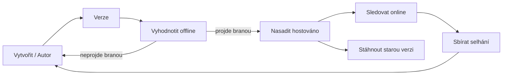
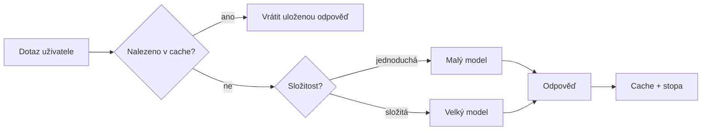
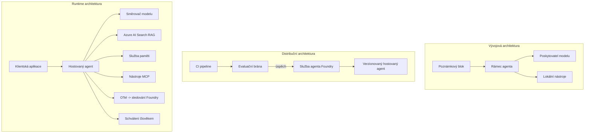

# Nasazení škálovatelných agentů s Microsoft Foundry


Do tohoto bodu kurzu jste vytvářeli agenty, kteří běží na vašem notebooku, uvnitř poznámkového bloku, řízeni pomocí `az login` a několika proměnnými prostředí. To je přesně ten správný způsob, jak se učit. Není to však správný způsob, jak spustit agenta, na kterého spoléhají tisíce zákazníků v 3 hodiny ráno.

Toto téma se zabývá rozdílem mezi "funguje to na mém počítači" a "funguje to spolehlivě a za rozumnou cenu v produkci." Tento rozdíl uzavíráme pomocí **Microsoft Foundry** a **Microsoft Foundry Agent Service**, a to tím, že stavíme skutečného zákaznického support agenta s nástroji, vyhledáváním, pamětí, evaluací a monitorováním.

## Úvod

Tato lekce pokryje:

- Rozdíl mezi **prototypovým agentem** a **nasazeným agentem**, a proč přechod většinou znamená vše *kolem* modelu.
- **Vzorce nasazení** agentů: hostované na klientovi, hostované jako služba (Hosted Agents), a orchestrálně řízené workflow.
- **Životní cyklus agenta** na Microsoft Foundry — vytvořit, verzovat, nasadit, vyhodnotit, sledovat, vyřadit.
- **Strategie škálování**: směrování modelu, cachování, souběžnost, a design bez stavu.
- **Sledovatelnost** s OpenTelemetry a Foundry trasováním.
- **Optimalizace nákladů** přes výběr modelu, směrování a evaluační brány.
- **Podnikové úvahy**: správa, lidské schvalování a bezpečný provoz MCP serverů v produkci.

## Cíle učení

Po dokončení této lekce budete vědět, jak:

- Vybrat správný vzorec nasazení pro danou zátěž agenta.
- Nasadit agenta do Microsoft Foundry Agent Service tak, aby byl verzovaný, spravovaný a sledovatelný.
- Instrumentovat agenta pro trasování a napojit evaluační pipeline, která běží před každým vydáním.
- Použít směrování modelu a cachování k udržení latence a nákladů pod kontrolou ve velkém měřítku.
- Přidat bránu lidského schválení pro vysoce rizikové akce a integrovat MCP server bezpečně v produkci.

## Předpoklady

Tato lekce předpokládá, že jste dokončili předchozí lekce a jste obeznámeni s:

- Tvorbou agentů pomocí [Microsoft Agent Framework](../14-microsoft-agent-framework/README.md) (Lekce 14).
- [Použití nástrojů](../04-tool-use/README.md) (Lekce 4) a [Agentic RAG](../05-agentic-rag/README.md) (Lekce 5).
- [Pamětí agenta](../13-agent-memory/README.md) (Lekce 13) a [Agentic protokoly / MCP](../11-agentic-protocols/README.md) (Lekce 11).
- [Sledovatelností a evaluací](../10-ai-agents-production/README.md) (Lekce 10) — tato lekce přímo na ni navazuje.

Také budete potřebovat:

- **Azure předplatné** a **Microsoft Foundry projekt** s alespoň jedním nasazeným chat modelem.
- Autentizovaný **Azure CLI** (`az login`).
- Python 3.12+ a balíčky v repozitáři [`requirements.txt`](../../../requirements.txt).

## Od prototypu k produkci: co se vlastně mění

Prototypový agent a produkční agent sdílejí stejný základní cyklus — uvažovat, volat nástroje, odpovídat. Co se mění, je vše, co je kolem tohoto cyklu. Model tvoří asi 20 % produkčního agenta; zbylých 80 % je provozní kostra.

| Oblast | Prototyp | Produkce |
| --- | --- | --- |
| **Hosting** | Běží ve vašem poznámkovém bloku | Běží jako hostovaná služba, verzovaná a rolloutovaná |
| **Identita** | Váš token z `az login` | Spravovaná identita s omezeným RBAC |
| **Stav** | V paměti, ztrácí se při restartu | Externí (uloženo v thread store, paměťová služba) |
| **Selhání** | Vidíte traceback | Retry, fallback, dead-letter, upozornění |
| **Náklady** | "Je to pár centů" | Sledováno na požadavek, směrováno, cachováno, rozpočtováno |
| **Kvalita** | Hodnotíte výstup vizuálně | Automaticky hodnoceno před každým vydáním |
| **Důvěra** | Schvalujete každou akci | Politika + člověk v procesu pro rizikové akce |

Mějte tuto tabulku na paměti. Každá následující část odpovídá jednomu z těchto řádků.

## Vzorce nasazení agentů

Existují tři vzorce, které budete používat, často v kombinaci.

### 1. Agenti hostovaní na klientovi

Objekt agenta žije uvnitř *vašeho* aplikačního procesu. Váš kód přímo volá poskytovatele modelu; uvažovací smyčka běží ve vaší službě. Takto postupovala každá předchozí lekce.

- **Používejte, když** potřebujete plnou kontrolu nad smyčkou, vlastní middleware, nebo agent embeddingujete do existujícího backendu.
- **Kompenzace**: odpovídáte sami za škálování, stav a odolnost.

### 2. Hostované agenti (Foundry Agent Service)

Agent je *registrován jako zdroj* v Microsoft Foundry. Foundry hostí uvažovací smyčku, ukládá vlákna, prosazuje bezpečnost obsahu a RBAC, a zviditelňuje agenta v portálu Foundry. Vaše aplikace se stává tenkým klientem, který vytváří vlákna a čte odpovědi.

- **Používejte, když** chcete trvanlivost, vestavěnou sledovatelnost, správu a menší provozní plochu.
- **Kompenzace**: méně nízkoúrovňové kontroly výměnou za řízený runtime.

### 3. Workflow agentů

Více agentů (a nástrojů) je složeno do grafu s explicitním řízením toku — sekvenční kroky, větvení, uzly lidského schválení a trvalé kontrolní body, které se mohou pozastavit a obnovit. Toto je schopnost **Workflows** Microsoft Agent Framework aplikovaná na škálování nasazení.

- **Používejte, když** jedna úloha zahrnuje několik specializovaných agentů nebo vyžaduje schvalovací krok uprostřed.
- **Kompenzace**: více pohyblivých částí; potřebuje sledovatelnost na úrovni orchestrací.



## Životní cyklus agenta na Microsoft Foundry

Nasazení agenta není jednorázovým `push`. Je to smyčka a hodně připomíná cyklus vydávání softwaru, protože to přesně je.



Klíčová myšlenka, převzatá z [Lekce 10](../10-ai-agents-production/README.md): **offline evaluace je brána, ne pouhá úvaha.** Nová verze agenta nevyjde, pokud neprojde vašimi evaluačními prahy. Online sledovatelnost pak přivádí reálné chyby zpět do vaší offline testovací sady. To je celý cyklus.

## Strategie škálování

Škálování agenta se liší od škálování stateless web API, protože každý požadavek může vyvolat více nákladných volání modelů a nástrojů. Čtyři techniky ponesou většinu zátěže.

**Zpracování požadavků bez stavu.** Neuchovávejte žádný stav na uživatele v paměti procesu. Perzistujte konverzační vlákna ve Foundry thread store nebo paměťové službě, aby jakýkoli instance mohl zpracovat jakýkoli požadavek. To vám umožní horizontální škálování — přidat instance, žádné sticky sessions.

**Směrování modelu.** Ne každý požadavek potřebuje váš nejvýkonnější (a nejdražší) model. Směřujte jednoduché požadavky — klasifikace záměru, krátké faktické odpovědi — na malý rychlý model a rezervujte velký model pro skutečné uvažování. Foundry **Model Router** to za vás může udělat, nebo můžete implementovat lehký klasifikátor sami. DIY verzi si sestavíte v laboratoři.

**Cachování odpovědí.** Mnoho dotazů na podporu jsou téměř duplikáty („jak si resetuji heslo?“). Cachujte odpovědi na běžné otázky a servírujte je bez volání modelu. I mírná míra cache hitů významně snižuje náklady a latenci.

**Souběžnost a zpětný tlak.** Poskytovatelé modelů mají limity pro rychlost. Omezte svou souběžnost, používejte retry s exponenciálním backoffem, a selhávejte ladně (čekající odpověď „řešíme to“ je lepší než chyba 500).



## Sledovatelnost v produkci

Nelze provozovat, co nevidíte. Jak bylo zmíněno v Lekci 10, Microsoft Agent Framework nativně vydává **OpenTelemetry** trasování — každý modelový hovor, vyvolání nástroje a orchestrální krok se stává spanem. V produkci exportujete tyto spany do Microsoft Foundry (nebo jakéhokoli OTel-kompatibilního backendu), abyste mohli:

- Sledovat jednu zákaznickou stížnost od začátku do konce přes všechna volání modelů a nástrojů.
- Monitorovat p50/p95 latenci a náklady na požadavek v průběhu času.
- Upozorňovat na skoky chybovosti a anomálie v nákladech dříve, než si toho všimnou vaši uživatelé (nebo finanční tým).

```python
from agent_framework.observability import get_tracer

tracer = get_tracer()

with tracer.start_as_current_span("support_request") as span:
    span.set_attribute("customer.tier", "enterprise")
    span.set_attribute("routed.model", "gpt-5-nano")
    # provádění agenta je automaticky sledováno uvnitř tohoto rozsahu
```

Atributy jako `customer.tier` a `routed.model` jsou to, co proměňuje zeď tras do zodpověditelných otázek („sou enterprise zákazníci příliš často směrováni na malý model?“).

## Optimalizace nákladů

Náklady na produkční agenty jsou převážně tokeny. Tři páky, podle dopadu:

1. **Správná velikost modelu.** Malý model, který projde vaší evaluační bránou, je téměř vždy levnější než velký, který též projde. Používejte evaluaci, abyste *dokázali*, že malý model je dost dobrý místo abyste defaultovali na největší modelem ze strachu.
2. **Směrujte podle složitosti.** Jak výše — platíte cenu velkého modelu pouze za požadavky, které potřebují velké uvažování.
3. **Agresivně cachujte.** Nejlevnější volání modelu je to, které nikdy neuděláte.

Evaluační brány a kontrola nákladů jsou stejná disciplína viděná ze dvou úhlů: evaluace vám říká *kvalitativní spodní hranici*, směrování a cached drží náklady co nejblíže této hranici.

## Podnikové úvahy o nasazení

**Správa.** Hosted Agents dědí Foundry RBAC, bezpečnost obsahu a auditní protokolování. Dejte každému agentu spravovanou identitu s nejnižším potřebným oprávněním — pouze ke čtení znalostní báze, omezený přístup k ticket API, nic víc.

**Člověk v procesu.** Některé akce jsou příliš závažné na plnou automatizaci — vystavení refundace, smazání účtu, eskalace na právní tým. Microsoft Agent Framework podporuje **nástroje vyžadující schválení**: agent navrhne akci, vykonání se pozastaví, člověk schválí nebo odmítne a workflow pokračuje. Primitivum jste viděli v [Lekci 6](../06-building-trustworthy-agents/README.md); zde je nasadíte.

**MCP v produkci.** [MCP](../11-agentic-protocols/README.md) umožňuje vašemu agentovi používat externí nástroje přes standardní rozhraní. V produkci považujte každý MCP server za nedůvěryhodnou hranici: pinujte verzi serveru, běžte s omezenou identitou, validujte jeho výstupy a nikdy mu nezveřejňujte tajemství. MCP server je závislost a závislosti se patchují, auditují a omezují rychlost.



Tyto tři diagramy — vývoj, nasazení, runtime — jsou stejný agent ve třech fázích svého života. Následující laboratoř vás provede jeho stavbou.

## Praktická laboratoř: Agent zákaznické podpory připravený na produkci

Otevřete [`code_samples/16-python-agent-framework.ipynb`](./code_samples/16-python-agent-framework.ipynb) a projděte jej celý. Sestavíte **Contoso agenta zákaznické podpory** se všemi produkčními prvky:

1. **Volání nástrojů** — vyhledávání stavu objednávky a otevírání ticketů podpory.
2. **RAG** — odpovídání na dotazy o politice ze znalostní báze (Azure AI Search, s fallbackem v paměti, aby poznámkový blok fungoval bez Search zdroje).
3. **Paměť** — pamatování si zákazníka přes průběh konverzace.
4. **Směrování modelu** — klasifikátor složitosti směruje každý požadavek na malý nebo velký model.
5. **Cachování odpovědí** — opakované otázky se servírují z cache.
6. **Lidské schválení** — refundace nad hranici pozastaví pro souhlas člověka.
7. **Evaluační pipeline** — malá offline testovací sada skóruje agenta a slouží jako brána vydání.
8. **Sledovatelnost** — OpenTelemetry trasování kolem každého požadavku.

### Průchod

Poznámkový blok je uspořádán tak, aby každý produkční prvek byl samostatná, spustitelná sekce. Jeho srdcem je request handler spojující směrování a cachování:

```python
async def handle_support_request(query: str, customer_id: str) -> str:
    # 1. Podávejte ze záznamu, když to lze.
    cached = response_cache.get(normalize(query))
    if cached:
        return cached

    # 2. Směrujte podle složitosti pro kontrolu nákladů.
    model = "gpt-5-nano" if is_simple(query) else "gpt-5-mini"

    # 3. Spusťte agenta uvnitř trace span pro pozorovatelnost.
    with tracer.start_as_current_span("support_request") as span:
        span.set_attribute("routed.model", model)
        span.set_attribute("customer.id", customer_id)
        response = await support_agent.run(query, model=model)

    # 4. Ukládejte do cache a vraťte.
    response_cache.set(normalize(query), response.text)
    return response.text
```

Evaluační brána, která hlídá vydání, vypadá takto:

```python
async def evaluation_gate(agent, test_cases, threshold: float = 0.8) -> bool:
    passed = 0
    for case in test_cases:
        result = await agent.run(case["input"])
        if score_response(result.text, case["expected"]) >= 0.8:
            passed += 1
    pass_rate = passed / len(test_cases)
    print(f"Evaluation pass rate: {pass_rate:.0%} (gate: {threshold:.0%})")
    return pass_rate >= threshold  # nasadit pouze, pokud brána projde
```

Přečtěte každou řádku — poznámkový blok drží primitiva vědomě malá, aby nic nebylo skryto za voláním frameworku.

## Validace nasazeného agenta pomocí Smoke Testů

Výše uvedená evaluační brána běží *offline* proti vaší objektové instanci agenta. Jakmile je agent nasazen jako Hosted Agent, potřebujete ještě jednu, mnohem levnější kontrolu: **odpovídá nasazený endpoint vůbec?**

Úspěšné nasazení pouze dokazuje, že kontrolní plocha přijala definici — ne že agent skutečně reaguje. Chybějící závislost, špatné směrování modelu nebo vypršelé připojení může zanechat zelené nasazení, které neodpovídá. **Smoke test** to odhalí během sekund, při každém nasazení, bez nákladů na plnou evaluaci.

Tento repozitář obsahuje připravený pipeline smoke testů založený na [AI Smoke Test](https://github.com/marketplace/actions/ai-smoke-test) GitHub akci:

- **Katalog** — [`tests/lesson-16-smoke-tests.json`](../../../tests/lesson-16-smoke-tests.json) obsahuje dotazy a ověření pro Contoso support agenta (odpovědi založené na politice, vyhledávání objednávky, udržení tématu a kontinuita multi-turn vláken). Katalogy pro agenty z jiných lekcí jsou vedle něj — viz [`tests/README.md`](../tests/README.md).
- **Workflow** — [`.github/workflows/smoke-test.yml`](../../../.github/workflows/smoke-test.yml) přihlašuje se přes Azure OIDC a zasílá každý prompt na endpoint agentových odpovědí, selhání v kteroukoliv asercí selže úloha.

```yaml
- name: Smoke-test hosted agent
  uses: JFolberth/ai-smoketest@v1
  with:
    project_endpoint: ${{ inputs.project_endpoint }}
    agent_name: ContosoSupportAgent
    tests_file: tests/lesson-16-smoke-tests.json
```


Spusťte to z karty **Actions** poté, co je váš agent nasazen, a zadejte koncový bod projektu Foundry a název agenta. Federovaná identita potřebuje roli **Azure AI User** v rozsahu projektu Foundry. Vrstvy si představte jako pyramidu: smoke testy (dosažitelné a reagující?) běží při každém nasazení, offline vyhodnocení (dost dobré k odeslání?) běží před posunutím, a online vyhodnocení (jak si vede v provozu?) běží nepřetržitě.

## Kontrola znalostí

Otestujte si své porozumění před přechodem k úkolu.

**1. Přibližně kolik produkčního agenta tvoří „model“ a co je zbytek?**

<details>
<summary>Odpověď</summary>

Model tvoří menšinu systému — často se uvádí přibližně 20 %. Zbytek je provozní kostra: hostování a verzování, identita a RBAC, externí stav, zpracování chyb, sledování nákladů, vyhodnocení a řízení s lidským zásahem (human-in-the-loop). Přechod do produkce je většinou o vybudování všeho *kolem* smyčky uvažování.
</details>

**2. Kdy byste zvolili Hosted Agenta namísto klientem hostovaného agenta?**

<details>
<summary>Odpověď</summary>

Když chcete spravované prostředí s vestavěnou odolností (vlákna, která přetrvávají a mohou pokračovat), pozorovatelnost, bezpečnost obsahu a RBAC a jste ochotni obětovat něco nízkoúrovňové kontroly smyčky uvažování za menší provozní plochu. Klientem hostované řešení je vhodnější, pokud potřebujete plnou kontrolu nad smyčkou nebo vkládáte agenta do stávající backendové služby.
</details>

**3. Proč musí být škálovatelný agent bezstavový ve vlastní paměti procesu?**

<details>
<summary>Odpověď</summary>

Aby jakákoliv instance mohla obsloužit jakýkoliv požadavek, což umožňuje horizontální škálování bez nutnosti „sticky sessions“. Stav konverzace na uživatele je externě uložen v thread store nebo paměťové službě. Kdyby byl stav uchován v paměti procesu, ztratil by se při restartu a nebylo by možné volně rozkládat zátěž.
</details>

**4. Jaký problém řeší směrování modelů a jak souvisí s vyhodnocováním?**

<details>
<summary>Odpověď</summary>

Směrování odesílá jednoduché požadavky malému, levnému, rychlému modelu a vyhrazuje velký model pro skutečné uvažování, čímž řídí latenci i náklady. Souvisí to s vyhodnocováním, protože vyhodnocování *dokazuje*, že malý model je dost dobrý pro určitý typ požadavků — směrování bez vyhodnocování je hádání.
</details>

**5. Co je „evaluační brána“ a kde se nachází v životním cyklu?**

<details>
<summary>Odpověď</summary>

Evaluační brána spouští offline testovací sadu na nové verzi agenta a blokuje nasazení, pokud míra úspěšnosti nedosáhne prahu. Nachází se mezi „verzí“ a „nasazením“ v životním cyklu, takže kvalita je podmínkou pro vydání, nikoliv něco, co kontrolujete až po odeslání.
</details>

**6. Proč by měl být MCP server považován za nedůvěryhodnou hranici v produkci?**

<details>
<summary>Odpověď</summary>

Protože je to externí závislost, na kterou váš agent volá. Měli byste připnout jeho verzi, spouštět ho s omezenou identitou, ověřovat jeho výstupy, omezovat rychlost volání a nikdy mu nezveřejňovat tajné údaje — stejná disciplína jako u jakékoliv třetí strany. Jeho výstupy vstupují do uvažování vašeho agenta, takže neověřená důvěra je bezpečnostní riziko.
</details>

**7. Která jediná změna obvykle nejvíce ovlivní náklady produkčního agenta a proč?**

<details>
<summary>Odpověď</summary>

Správná velikost modelu — použití nejmenšího modelu, který stále projde evaluační branou. Náklady dominují tokeny a menší model, který splňuje kvalitativní standard, je téměř vždy levnější než větší. Ke snížení nákladů dále přispívají kešování a směrování, ale volba správného základního modelu má největší prvotní efekt.
</details>

**8. Jakou roli hrají atributy spanů jako `customer.tier` a `routed.model` v pozorovatelnosti (observability)?**

<details>
<summary>Odpověď</summary>

Přeměňují surové trace do odpověditelných obchodních otázek. Bez atributů máte hromadu spanů; s nimi můžete položit otázky jako „jsou naši podnikový zákazníci příliš často směrováni na malý model?“ nebo „který model obsluhuje naše nejpomalejší požadavky?“ Atributy umožňují řezat telemetrii podle dimenzí, které jsou pro vaše provozní potřeby důležité.
</details>

## Úkol

Vezměte zákaznického podpůrného agenta z laboratoře a přizpůsobte ho pro specifické scénáře: **agent podpory fakturace předplatného pro SaaS společnost.**

Vaše řešení by mělo:

1. **Nahradit nástroje** nástroji relevantními pro fakturaci: `get_subscription_status`, `get_invoice` a `issue_credit` (kredity nad 50 USD vyžadují lidské schválení).
2. **Přidat tři RAG dokumenty** pokrývající firemní politiku vrácení peněz, fakturační cyklus a zásady zrušení.
3. **Rozšířit evaluační sadu** na alespoň osm případů, včetně minimálně dvou, které by měly spustit cestu s lidským schválením, a potvrdit, že vaše evaluační brána správně propustí nebo zamítne.
4. **Přidat jednu zprávu o nákladech**: po zpracování deseti smíšených dotazů agentem vytisknout, kolik jich šlo na malý model, kolik na velký model a kolik bylo obslouženo z keše.

Napište krátký odstavec (v markdown buňce) vysvětlující pravidlo směrování modelů, které jste zvolili, a jak byste ho ověřili na reálném provozu. Neexistuje jedna správná odpověď — je hodnoceno, zda jsou produkční požadavky propojeny koherentně.

## Shrnutí

V této lekci jste převedli agenta z prototypu do produkce s Microsoft Foundry:

- Přechod do produkce je především o **provozní kostře** kolem modelu — hostování, identita, stav, zpracování chyb, náklady, kvalita a důvěra.
- Naučili jste se tři **vzorce nasazení** — klientem hostované, Hosted Agents a Agent Workflows — a kdy se který hodí.
- Prošli jste **životním cyklem agenta**, kde offline **vyhodnocení funguje jako brána pro uvolnění** a online pozorovatelnost vrací chyby zpět do testovací sady.
- Aplikovali jste **strategie škálování** — bezstátový design, směrování modelů, kešování a omezenou souběžnost — a spojili je s **optimalizací nákladů**.
- Propojili jste **podnikové kontroly**: RBAC, lidské schválení a integraci MCP bezpečnou pro produkci.
- Postavili jste **produkčně připraveného agenta zákaznické podpory**, který propojuje všechny tyto požadavky v běžícím kódu.

Další lekce vás provede opačnou cestou: místo škálování agentů do cloudu je přenesete *dolů* na jeden vývojářský počítač a poběží zcela lokálně.

## Další zdroje

- <a href="https://learn.microsoft.com/azure/ai-foundry/what-is-azure-ai-foundry" target="_blank">Dokumentace Microsoft Foundry</a>
- <a href="https://learn.microsoft.com/azure/ai-foundry/agents/overview" target="_blank">Přehled služby Microsoft Foundry Agent</a>
- <a href="https://aka.ms/ai-agents-beginners/agent-framework" target="_blank">Microsoft Agent Framework</a>
- <a href="https://learn.microsoft.com/azure/ai-foundry/concepts/model-router" target="_blank">Model Router v Microsoft Foundry</a>
- <a href="https://learn.microsoft.com/azure/search/search-what-is-azure-search" target="_blank">Azure AI Search</a>
- <a href="https://opentelemetry.io/" target="_blank">OpenTelemetry</a>
- <a href="https://github.com/marketplace/actions/ai-smoke-test" target="_blank">GitHub Action AI Smoke Test</a>
- <a href="https://modelcontextprotocol.io/" target="_blank">Model Context Protocol (MCP)</a>

## Předchozí lekce

[Vytváření agentů pro použití počítače (CUA)](../15-browser-use/README.md)

## Další lekce

[Vytváření lokálních AI agentů](../17-creating-local-ai-agents/README.md)

---

<!-- CO-OP TRANSLATOR DISCLAIMER START -->
**Prohlášení o omezení odpovědnosti**:
Tento dokument byl přeložen pomocí AI překladatelské služby [Co-op Translator](https://github.com/Azure/co-op-translator). Přestože usilujeme o co největší přesnost, mějte prosím na paměti, že automatizované překlady mohou obsahovat chyby nebo nepřesnosti. Originální dokument v jeho mateřském jazyce by měl být považován za autoritativní zdroj. Pro kritické informace se doporučuje profesionální lidský překlad. Nejsme odpovědní za jakékoli nedorozumění nebo nesprávné interpretace vzniklé použitím tohoto překladu.
<!-- CO-OP TRANSLATOR DISCLAIMER END -->