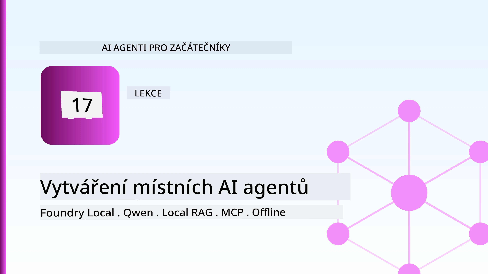
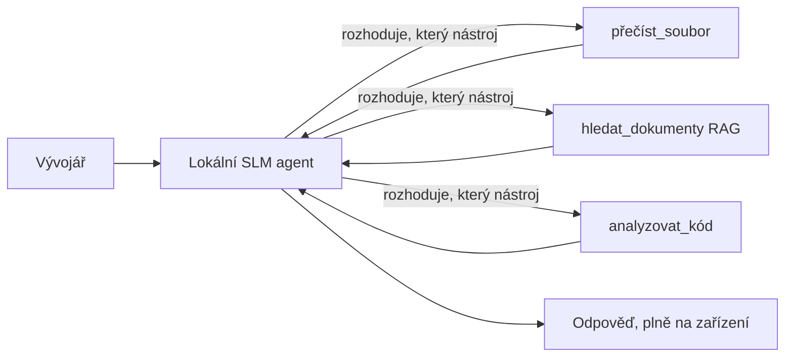
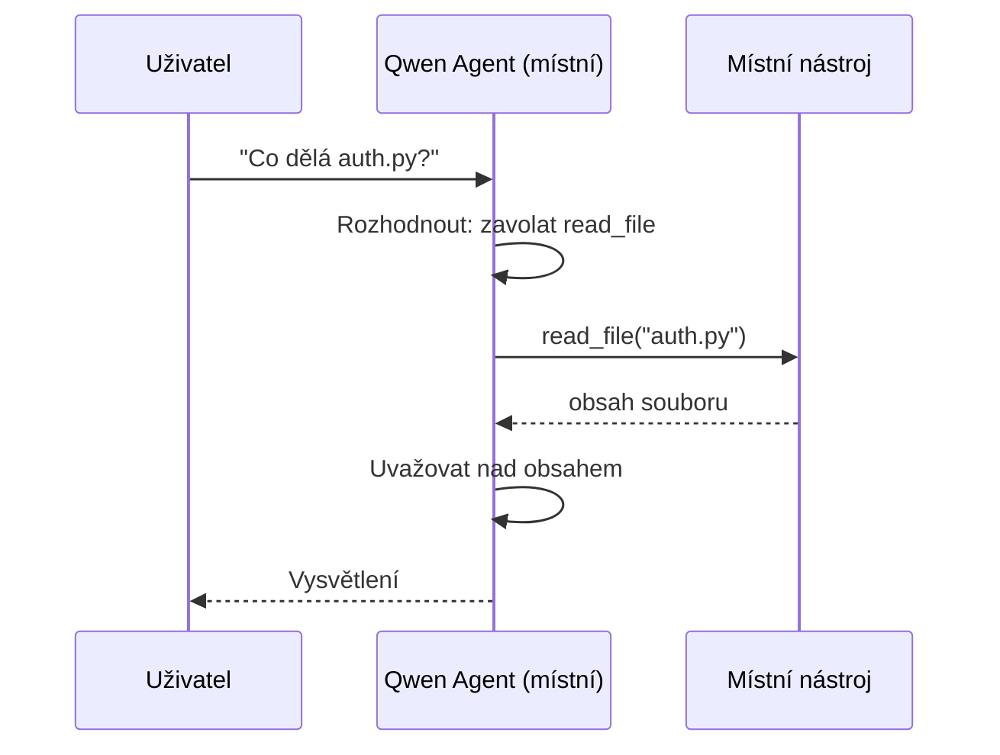
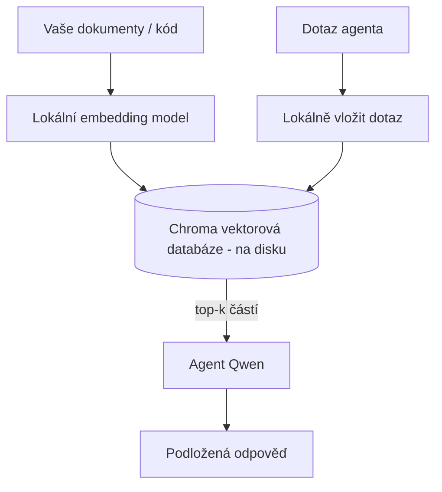
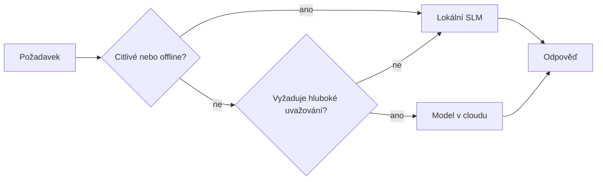

# Vytváření lokálních AI agentů pomocí Microsoft Foundry Local a Qwen



Předchozí lekce škálovala agenty *nahoru* do cloudu. Tato je přenáší *dolů* na jeden stroj. Na konci budete mít funkčního inženýrského asistenta, který uvažuje, volá nástroje, čte vaše soubory a vyhledává ve vaší dokumentaci — **aniž by vykonal jediný inference call v cloudu.**

Proč byste to chtěli? Tři důvody, které se neustále objevují v reálné inženýrské práci:

- **Soukromí.** Kód a dokumenty nikdy neopouštějí stroj. Žádný prompt, žádný úryvek, žádná data zákazníka nepřecházejí přes síťovou hranici.
- **Cena.** Lokální inference nemá žádný poplatek za token. Můžete iterovat celý den za cenu elektřiny.
- **Offline.** Ve letadle, v bezpečném zařízení nebo během výpadku agent stále funguje.

Háček je, že vyměňujete špičkový cloudový model za **Malý jazykový model (SLM)**, který běží na vašem CPU, GPU nebo NPU. Tato lekce se týká budování agentů, kteří jsou v rámci tohoto omezení *dobří*, místo předstírání, že omezení neexistuje.

## Úvod

Tato lekce zahrnuje:

- **Malé jazykové modely (SLM)** — co jsou zač, kde vynikají a kde ne.
- **Microsoft Foundry Local** — runtime, který stahuje a poskytuje modely přímo na zařízení přes **OpenAI-kompatibilní API**.
- **Qwen modely pro volání funkcí** — SLM, které spolehlivě vytvářejí volání nástrojů, což je to, co umožňuje lokální *agenty* (nejen lokální chat).
- **Lokální nástroje, lokální RAG a lokální MCP** — přidávající agentovi schopnosti bez cloudu.
- **Hybridní vzory** — kdy věci držet lokálně a kdy sahat do cloudu.

## Cíle učení

Po dokončení této lekce budete vědět, jak:

- Vysvětlit kompromisy SLM a vybrat vhodné případy použití lokálních agentů.
- Poskytnout model Qwen lokálně pomocí Foundry Local a připojit se k němu přes OpenAI-kompatibilní endpoint.
- Vytvořit agenta volajícího nástroje, který běží kompletně na vašem pracovním stanovišti.
- Přidat lokální RAG nad vlastními dokumenty pomocí lokální vektorové databáze (Chroma).
- Připojit agenta k lokálnímu serveru MCP a uvažovat o hybridních lokálních/cloud designy.

## Předpoklady

Předpokládá se, že jste absolvovali předchozí lekce a jste obeznámeni s:

- [Používání nástrojů](../04-tool-use/README.md) (Lekce 4) a [Agentic RAG](../05-agentic-rag/README.md) (Lekce 5).
- [Agentické protokoly / MCP](../11-agentic-protocols/README.md) (Lekce 11).
- [Microsoft Agent Framework](../14-microsoft-agent-framework/README.md) (Lekce 14).

Také budete potřebovat:

- Vývojářské pracovní stanoviště. **8 GB RAM je realistické minimum**; 16 GB+ je pohodlné. GPU nebo NPU pomáhá, ale není nutné.
- Nainstalovaný **Microsoft Foundry Local** (viz sekce instalace níže).
- Python 3.12+ a balíčky v repozitáři [`requirements.txt`](../../../requirements.txt), navíc `foundry-local-sdk`, `openai` a `chromadb` pro tuto lekci.

## Malé jazykové modely: Správný nástroj pro lokální práci

Špičkový cloudový model má stovky miliard parametrů a za sebou datacentrum. SLM má pár miliard parametrů a musí se vejít do paměti RAM vašeho notebooku. Tento rozdíl nastavuje jasná očekávání.

**SLM jsou dobré v:**

- Strukturovaných, ohraničených úlohách — klasifikace, extrakce, shrnutí známého dokumentu.
- **Volání nástrojů** — rozhodování, kterou funkci zavolat a s jakými argumenty.
- Rychlé, levné, soukromé iterace s vlastními daty.

**SLM jsou slabší v:**

- Otevřeném, vícenásobném uvažování přes rozsáhlý kontext.
- Širokých znalostech světa (viděli méně a více zapomínají).

Vítězná strategie pro lokální agenty je tedy: **nechte SLM orchestraci a nechte nástroje dělat těžkou práci.** Model nemusí *znát* váš kód — musí vědět, kdy zavolat `read_file` a `search_docs`. To přesně odpovídá silným stránkám SLM.



## Microsoft Foundry Local

**Microsoft Foundry Local** je lehký runtime, který stahuje, spravuje a poskytuje modely kompletně na vašem stroji. Jeho nejdůležitější vlastností pro nás je, že vystavuje **OpenAI-kompatibilní HTTP endpoint** — což znamená, že OpenAI SDK a OpenAI klient v Microsoft Agent Framework fungují proti němu pouze změnou `base_url`. Vše, co jste se naučili o budování agentů, lze použít přímo; pouze endpoint se přesouvá z cloudu na `localhost`.

Foundry Local také automaticky vybere nejlepší verzi modelu pro váš hardware — verzi na CPU, CUDA/GPU nebo NPU — takže nemusíte ručně optimalizovat pro každý stroj.

### Instalace

Nainstalujte Foundry Local (viz [dokumentaci](https://learn.microsoft.com/azure/ai-foundry/foundry-local/) pro váš OS) a ověřte, že funguje:

```bash
# Nainstalujte (například; postupujte podle dokumentace pro vaši platformu)
winget install Microsoft.FoundryLocal      # Windows
# brew install microsoft/foundrylocal/foundrylocal   # macOS

# Stáhněte a spusťte model Qwen, poté spusťte lokální službu
foundry model run qwen2.5-7b-instruct
foundry service status
```

Jakmile služba běží, máte lokální OpenAI-kompatibilní endpoint (obvykle `http://localhost:PORT/v1`). Notebook používá `foundry-local-sdk` k automatickému nalezení endpointu, takže nemusíte pevně zakódovat port.

## Qwen volání funkcí: Proč je důležité

Agent je agentem jen pokud může volat nástroje. Mnoho SLM může chatovat, ale vytváří nespolehlivé, nesprávně formátované volání nástrojů. **Qwen** modely jsou trénovány pro volání funkcí a konzistentně vytvářejí správně formátované volání nástrojů — což přesně mění lokální chat model na lokální *agenta*.

Průběh je standardní smyčka volání nástrojů, kterou už znáte, jen běží přímo na zařízení:



## Lokální RAG

Vyhledávání v dokumentaci je místo, kde si lokální agenti vydělají. Místo toho, abyste doufali, že SLM zapamatoval dokumentaci vašeho frameworku, vložíte tyto dokumenty do **lokální vektorové databáze** a necháte agenta, aby podle potřeby načítal relevantní úryvky.

Používáme **Chromu**, vestavěný vektorový obchod, který běží v procesu bez nutnosti správy serveru. Pipeline je kompletně lokální: lokální embedding model → lokální vektory → lokální vyhledávání → lokální SLM.



Toto je stejný Agentic RAG vzor z Lekce 5 — jediná změna je, že všechny komponenty běží na vašem stroji.

## Lokální MCP servery

[MCP](../11-agentic-protocols/README.md) je transport, ne cloudová služba. MCP server může běžet jako lokální proces na `stdio`, poskytující nástroje agentovi přes standardní protokol. To umožňuje znovupoužití rostoucího ekosystému MCP serverů — přístup k souborovému systému, git operace, dotazy do databáze — kompletně offline.

Bezpečnostní postoj je odlišný od cloudu, ale není nulový: lokální MCP server běží s oprávněními vašeho uživatele, proto omeďte, k čemu může přistupovat (adresář projektu, ne celý domovský adresář) a výstupy považujte za vstupy určené ke kontrole.

## Hybridní cloudové a lokální vzory

Lokální-first neznamená pouze lokální. Dospělé systémy směrují dle citlivosti a obtížnosti:

| Situace | Kde běží |
| --- | --- |
| Citlivý kód / data, nebo offline | **Lokální SLM** |
| Jednoduchý, ohraničený úkol | **Lokální SLM** (lacné, rychlé) |
| Těžké vícenásobné uvažování nad necitlivými daty | **Cloudový model** |
| Vše během výpadku | **Lokální SLM** (přiměřená degradace) |

To odráží myšlenku **model routing** z Lekce 16 — až na to, že jeden „model“ je nyní váš vlastní stroj. Robustní design se vrací k lokálnímu modelu, když cloud není dostupný, takže agent klesá v kvalitě, místo aby úplně selhal.



## Praktická laboratoř: Lokální inženýrský asistent

Otevřete [`code_samples/17-local-agent-foundry-local.ipynb`](./code_samples/17-local-agent-foundry-local.ipynb) a projděte jej. Vytvoříte **lokálního inženýrského asistenta**, který běží kompletně na vašem pracovním stanovišti a umí:

1. **Volat nástroje** — přes Qwen volání funkcí přes Foundry Local.
2. **Provádět lokální operace se soubory** — vypisovat a číst soubory v adresáři projektu.
3. **Analyzovat kód** — hlásit základní metriky zdrojového souboru.
4. **Vyhledávat v dokumentaci** — lokální RAG nad složkou dokumentace pomocí Chromy.
5. **Používat MCP** — připojit se k lokálnímu MCP serveru (s elegantním přeskočením, pokud není nakonfigurován).

Nikdy se nepoužívá inference z cloudu.

### Průchod

Asistent se připojuje k Foundry Local přes OpenAI-kompatibilní endpoint, takže kód agenta vypadá téměř stejně jako v cloudových lekcích — mění se jen klient:

```python
from foundry_local import FoundryLocalManager
from openai import OpenAI

# Foundry Local objeví/stáhne model a poskytne nám lokální endpoint.
manager = FoundryLocalManager(\"qwen2.5-7b-instruct\")
client = OpenAI(base_url=manager.endpoint, api_key=manager.api_key)  # api_key je lokální zástupný symbol
```

Nástroje jsou obyčejné Python funkce omezené na adresář projektu:

```python
def read_file(path: str) -> str:
    \"\"\"Read a file, but only inside the sandboxed project directory.\"\"\"
    full = (PROJECT_ROOT / path).resolve()
    if PROJECT_ROOT not in full.parents and full != PROJECT_ROOT:
        return \"Access denied: path is outside the project directory.\"
    return full.read_text(encoding=\"utf-8\")
```

Všimněte si kontroly sandboxu — i lokálně je nástroj, který čte libovolné cesty, riziko. Notebook omezuje každý nástroj na jednu kořenovou složku projektu.

## Kontrola znalostí

Otestujte své chápání před přechodem k úkolu.

**1. Uveďte dva konkrétní důvody pro spuštění agenta lokálně místo v cloudu.**

<details>
<summary>Odpověď</summary>

Jakékoli dva z: **soukromí** (kód a data nikdy neopouštějí stroj), **cena** (bez poplatků za tokeny při inferenci) a **offline schopnost** (funguje bez sítě — ve letadle, v zabezpečeném zařízení nebo během výpadku). Častým důvodem soukromí jsou regulační/povinné požadavky, které zakazují odesílání dat mimo zařízení.
</details>

**2. Jaké je doporučené rozdělení práce mezi SLM a jeho nástroji v lokálním agentovi a proč?**

<details>
<summary>Odpověď</summary>

Nechte SLM **orchestrace** (rozhodnutí, který nástroj zavolat a s jakými argumenty) a nechte **nástroje odnést těžkou práci** (čtení souborů, vyhledávání dokumentů, výpočty výsledků). SLM excelují v ohraničených rozhodnutích, jako je výběr nástroje, ale jsou slabší ve velkém znalostním rozsahu a dlouhém vícenásobném uvažování, takže závislost na nástrojích odpovídá jejich silným stránkám.
</details>

**3. Co umožňuje znovupoužití cloudového kódu agenta s Foundry Local?**

<details>
<summary>Odpověď</summary>

Foundry Local vystavuje **OpenAI-kompatibilní HTTP endpoint**. OpenAI SDK a OpenAI klient Agent Framework na něj fungují jen změnou `base_url` (a použitím lokálního placeholder API klíče). Vše ostatní v kódu agenta zůstává stejné.
</details>

**4. Proč konkrétně používáme Qwen model pro volání funkcí místo jakéhokoli SLM?**

<details>
<summary>Odpověď</summary>

Protože agent musí produkovat spolehlivá, dobře formátovaná **volání nástrojů**. Mnoho SLM zvládne chat, ale vytváří nesprávně nebo nekonzistentně strukturovaná volání. Qwen modely jsou trénovány pro volání funkcí a konzistentně vytvářejí správná volání, což z lokálního chat modelu dělá funkčního lokálního agenta.
</details>

**5. Které komponenty běží v lokální RAG pipeline na stroji?**

<details>
<summary>Odpověď</summary>

Všechny: embedding model, vektorová databáze (Chroma, na disku), vyhledávací krok a SLM. Dokumenty jsou vloženy lokálně, uloženy lokálně, vyhledávány lokálně a vyhodnocovány lokálním modelem — žádná komponenta se nedotýká cloudu.
</details>

**6. Lokální MCP server běží na vašem stroji. Znamená to automaticky bezpečnost? Jaká opatření byste měli stále přijmout?**

<details>
<summary>Odpověď</summary>

Ne. Lokální MCP server běží s oprávněními vašeho uživatele, takže může přistupovat k čemukoli, k čemu máte přístup i vy. Omezte jeho dosah na potřebné oblasti (například jeden adresář projektu místo celého domovského adresáře) a výstupy považujte za vstupy, které je třeba před použitím ověřit.
</details>

**7. Popište rozumné hybridní pravidlo směrování, které zahrnuje lokální model.**

<details>
<summary>Odpověď</summary>

Směřujte citlivé nebo offline požadavky na lokální SLM; jednoduché ohraničené úkoly směrujte na lokální SLM kvůli rychlosti a ceně; těžké vícenásobné uvažování nad necitlivými daty směrujte na cloudový model; a v případě nedostupnosti cloudu padněte zpět na lokální SLM, aby agent klesal přiměřeně, místo aby úplně selhal. To je model routing (Lekce 16) s lokálním strojem jako jedním z modelů.
</details>

**8. Jaké je realistické minimum RAM pro spuštění lokálního agenta v této lekci a co vám přináší více RAM?**

<details>
<summary>Odpověď</summary>

Přibližně **8 GB** je realistické minimum; 16 GB+ je pohodlné. Více RAM umožňuje spouštět větší, schopnější modely a udržet více kontextu v paměti. GPU nebo NPU zrychluje inferenci, ale není nutné — Foundry Local vybírá verzi na CPU, pokud není dostupný žádný akcelerátor.
</details>

## Zadání úkolu

Rozšiřte lokální inženýrského asistenta na **lokálního recenzenta dokumentace** pro malý projekt podle vašeho výběru (použijte některou z lekčních složek tohoto repozitáře, pokud chcete).

Vaše řešení by mělo:

1. **Zindexovat skutečnou složku s dokumentací/kódem** do Chromy (alespoň pět souborů).
2. **Přidat nástroj `find_todos`**, který prohledá projekt na komentáře `TODO`/`FIXME` a vrátí je s názvem souboru a číslem řádku — při dodržení téže kontroly sandboxu jako `read_file`.

3. **Zeptejte se agenta na tři otázky**, které ho nutí kombinovat nástroje: jednu čistě RAG otázku, jednu, která vyžaduje přečtení konkrétního souboru, a jednu, která vyžaduje nalezení TODO.
4. **Změřte to**: změřte čas každé ze tří odpovědí a poznamenejte je v markdown buňce. Komentujte, zda je latence přijatelná pro váš zamýšlený pracovní tok.

Poté napište krátký odstavec o tom, **co byste přesunuli do cloudu a co byste nechali lokálně** pro tohoto recenzenta a proč. Hodnotí se, zda jsou lokální komponenty správně propojené a zda je vaše hybridní uvažování správné — ne kvalita modelu.

## Shrnutí

V této lekci jste postavili agenta, který běží zcela na vašem vlastním zařízení:

- **SLM** vyměňují šíři za soukromí, náklady a offline provoz — a vynikají, když **orkestrují nástroje** namísto toho, aby nesly veškeré znalosti samy.
- **Foundry Local** poskytuje modely na zařízení za **OpenAI-kompatibilním endpointem**, takže váš cloudový kód agenta přechází s jednou řádkovou změnou.
- **Qwen modely s voláním funkcí** umožňují spolehlivé lokální volání nástrojů — a tedy lokální *agenty*.
- **Lokální RAG** (Chroma) a **lokální MCP** dávají agentovi schopnosti bez opuštění zařízení.
- **Hybridní vzory** umožňují směrovat podle citlivosti a složitosti, přičemž lokální režim slouží jako elegantní záloha.

Tím je dokončena fáze nasazení: Lekce 16 škálovala agenty do Microsoft Foundry a tato lekce je škáluje dolů na jednu pracovní stanici. Následující lekce se věnuje zabezpečení nasazených agentů.

## Další zdroje

- <a href="https://learn.microsoft.com/azure/ai-foundry/foundry-local/" target="_blank">Dokumentace Microsoft Foundry Local</a>
- <a href="https://learn.microsoft.com/azure/ai-foundry/what-is-azure-ai-foundry" target="_blank">Dokumentace Microsoft Foundry</a>
- <a href="https://aka.ms/ai-agents-beginners/agent-framework" target="_blank">Microsoft Agent Framework</a>
- <a href="https://qwen.readthedocs.io/en/latest/framework/function_call.html" target="_blank">Dokumentace volání funkcí Qwen</a>
- <a href="https://modelcontextprotocol.io/" target="_blank">Model Context Protocol (MCP)</a>
- <a href="https://docs.trychroma.com/" target="_blank">Chroma vektorová databáze</a>

## Předchozí lekce

[Nasazení škálovatelných agentů](../16-deploying-scalable-agents/README.md)

## Následující lekce

[Zabezpečení AI agentů](../18-securing-ai-agents/README.md)

---

<!-- CO-OP TRANSLATOR DISCLAIMER START -->
**Prohlášení o omezení odpovědnosti**:
Tento dokument byl přeložen pomocí AI překladatelské služby [Co-op Translator](https://github.com/Azure/co-op-translator). Přestože usilujeme o co největší přesnost, mějte prosím na paměti, že automatizované překlady mohou obsahovat chyby nebo nepřesnosti. Originální dokument v jeho mateřském jazyce by měl být považován za autoritativní zdroj. Pro kritické informace se doporučuje profesionální lidský překlad. Nejsme odpovědní za jakékoli nedorozumění nebo nesprávné interpretace vzniklé použitím tohoto překladu.
<!-- CO-OP TRANSLATOR DISCLAIMER END -->