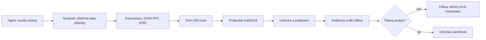
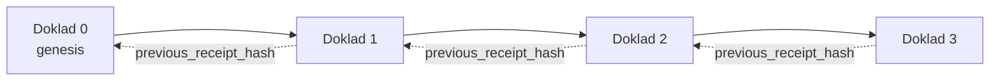

[Sledujte video lekce: Zabezpečení AI agentů pomocí kryptografických potvrzení](https://youtu.be/PLACEHOLDER_VIDEO_ID)

> _(Video lekce a náhledový obrázek budou přidány týmem Microsoftu po sloučení, odpovídající vzoru lekcí 14 / 15.)_

# Zabezpečení AI agentů pomocí kryptografických potvrzení

## Úvod

Tato lekce pokryje:

- Proč jsou auditní stopy AI agentů důležité pro soulad, ladění a důvěru.
- Co je to kryptografické potvrzení a jak se liší od nepodepsaného záznamu v logu.
- Jak vytvořit podepsané potvrzení o volání nástroje agenta v čistém Pythonu.
- Jak ověřit potvrzení offline a detekovat manipulaci.
- Jak propojit potvrzení do řetězce tak, že odstranění nebo přeuspořádání jednoho potvrdí přeruší řetězec.
- Co potvrzení prokazují a co výslovně neprokazují.

## Cíle učení

Po dokončení této lekce budete umět:

- Identifikovat chyby, které motivují kryptografický původ akcí agenta.
- Vytvořit Ed25519-podepsané potvrzení nad kanonickým JSON objektem.
- Ověřit potvrzení nezávisle pouze s použitím veřejného klíče podepisovatele.
- Detekovat manipulaci opětovným ověřením upraveného potvrzení.
- Sestavit sekvenci potvrzení propojených hašem a vysvětlit, proč je řetězec důležitý.
- Rozlišovat, co potvrzení prokazují (přiřazení, integrita, pořadí) a co neprokazují (správnost akce, smysluplnost politiky).

## Problém: Auditní stopa vašeho agenta

Představte si, že jste nasadili AI agenta pro Contoso Travel. Agent čte požadavky zákazníků, volá API letenek pro hledání možností a rezervuje místa jménem zákazníka. Minulý čtvrtletí agent zpracoval 50 000 rezervací.

Dnes přichází auditor. Položí jednoduchou otázku: „Ukažte mi, co váš agent udělal.“

Předáte mu své logy. Auditor je prohlíží a položí obtížnější otázku: „Jak vím, že tyto logy nebyly upravovány?“

To je problém auditní stopy. Dnešní většina nasazení agentů spoléhá na:

- **Aplikační logy**: zapisované samotným agentem, upravitelné kýmkoliv s přístupem k souborovému systému.
- **Cloudové logovací služby**: znatelné manipulaci na úrovni platformy, ale jen pokud auditor důvěřuje provozovateli platformy.
- **Databázové transakční logy**: vhodné pro změny v databázi, nikoliv však pro libovolné volání nástrojů.

Žádný z těchto způsobů nemůže odpovědět auditorovi bez toho, aby auditor někomu důvěřoval (vám, vašemu poskytovateli cloudu, dodavateli databáze). Pro interní použití je tato důvěra často přijatelná. Pro regulované úlohy (finance, zdravotnictví, cokoliv podléhající EU AI zákonu) nikoliv.

Kryptografická potvrzení řeší tento problém tím, že každou akci agenta dělají nezávisle ověřitelnou. Auditor vám nemusí důvěřovat. Potřebuje pouze váš veřejný klíč a samotné potvrzení.

## Co je kryptografické potvrzení?

Potvrzení je JSON objekt, který zaznamenává, co agent udělal, podepsaný digitálním podpisem.



Minimalistické potvrzení vypadá takto:

```json
{
  "type": "agent.tool_call.v1",
  "agent_id": "contoso-travel-bot",
  "tool_name": "lookup_flights",
  "tool_args_hash": "sha256:a3f9c1...",
  "result_hash": "sha256:7b2e1d...",
  "policy_id": "contoso-travel-policy-v3",
  "timestamp": "2026-04-25T14:30:00Z",
  "sequence": 47,
  "previous_receipt_hash": "sha256:9d4e6a...",
  "signature": {
    "alg": "EdDSA",
    "sig": "c5af83...",
    "public_key": "8f3b2c..."
  }
}
```

Tři vlastnosti vykonávají práci:

1. **Podpis**. Potvrzení je podepsané branou agenta pomocí Ed25519 privátního klíče. Kdokoli s odpovídajícím veřejným klíčem může offline ověřit podpis. Jakákoliv manipulace s polem zneplatní podpis.

2. **Kanonické kódování**. Než je potvrzení podepsáno, je serializováno pomocí JSON Canonicalization Scheme (JCS, RFC 8785). To zajišťuje, že dvě implementace vytvářející stejný logický záznam produkovat stejný přesně identický byteřad.

3. **Hašovací řetězec**. Pole `previous_receipt_hash` propojuje každé potvrzení s tím předchozím. Odebrání nebo přeuspořádání potvrzení zlomí každé potvrzení, které na něj navazuje. Manipulace je tak viditelná na úrovni řetězce i při obejití jednotlivých podpisů.

Tyto vlastnosti dohromady poskytují tři záruky:

- **Přiřazení**: tento klíč podepsal tento obsah.
- **Integrita**: obsah se od podpisu nezměnil.
- **Pořadí**: toto potvrzení přišlo po onom potvrzení v řetězci.

## Vytvoření potvrzení v Pythonu

K vytvoření potvrzení nepotřebujete speciální knihovnu. Kryptografické primitiva jsou široce dostupná a logika je pár desítek řádků Pythonu.

Praktické cvičení v `code_samples/18-signed-receipts.ipynb` vede úplným procesem. Shrnutí:

```python
import json
import hashlib
import base64
from nacl import signing
from jcs import canonicalize  # RFC 8785 kanonický JSON

def b64url_nopad(data: bytes) -> str:
    return base64.urlsafe_b64encode(data).decode("ascii").rstrip("=")

def sha256_canonical(obj) -> str:
    """SHA-256 of a Python object's JCS-canonical JSON form."""
    return f"sha256:{hashlib.sha256(canonicalize(obj)).hexdigest()}"

# Vygenerujte nebo načtěte podepisovací klíč (v produkci uložit do klíčového skladu)
signing_key = signing.SigningKey.generate()
verify_key = signing_key.verify_key

# Sestavte obsah účtenky (ještě bez podpisu)
tool_args = {"origin": "SYD", "destination": "LAX"}
tool_result = [{"flight": "QF11", "price": 1850, "stops": 0}]

payload = {
    "type": "agent.tool_call.v1",
    "agent_id": "contoso-travel-bot",
    "tool_name": "lookup_flights",
    "tool_args_hash": sha256_canonical(tool_args),
    "result_hash": sha256_canonical(tool_result),
    "policy_id": "contoso-travel-policy-v3",
    "timestamp": "2026-04-25T14:30:00Z",
    "sequence": 0,
    "previous_receipt_hash": None,
}

# Kanonizujte, zahashujte, podepište.
canonical_bytes = canonicalize(payload)
message_hash = hashlib.sha256(canonical_bytes).digest()
signature_bytes = signing_key.sign(message_hash).signature

# Připojte strukturovaný podpisový objekt.
receipt = {
    **payload,
    "signature": {
        "alg": "EdDSA",
        "sig": b64url_nopad(signature_bytes),
        "public_key": b64url_nopad(bytes(verify_key)),
    },
}
```

To je celý proces podepisování. Cvičení v poznámkovém bloku procházejí každý krok.

## Ověření potvrzení a detekce manipulace

Ověření je opačná operace:

```python
import base64
import hashlib
from nacl import signing
from nacl.exceptions import BadSignatureError
from jcs import canonicalize

def b64url_decode(s: str) -> bytes:
    padding = "=" * ((4 - len(s) % 4) % 4)
    return base64.urlsafe_b64decode(s + padding)

def verify_receipt(receipt: dict) -> bool:
    # Podpis je strukturovaný objekt: {"alg", "sig", "public_key"}.
    sig_obj = receipt.get("signature")
    if not sig_obj or sig_obj.get("alg") != "EdDSA":
        return False

    # Obnovte užitečné zatížení, které bylo skutečně podepsáno (vše kromě podpisu).
    payload = {k: v for k, v in receipt.items() if k != "signature"}

    canonical_bytes = canonicalize(payload)
    message_hash = hashlib.sha256(canonical_bytes).digest()

    try:
        verify_key = signing.VerifyKey(b64url_decode(sig_obj["public_key"]))
        verify_key.verify(message_hash, b64url_decode(sig_obj["sig"]))
        return True
    except BadSignatureError:
        return False
```

Tato funkce vezme potvrzení a vrátí `True`, pokud je podpis platný, jinak `False`. Žádný síťový hovor, žádná závislost na službě, žádná důvěra v třetí stranu není potřeba.

Pro zobrazení detekce manipulace poznámkový blok společně ukazuje:

1. Vytvoření platného potvrzení a potvrzení, že se ověřuje.
2. Úprava jednoho bytu ve `tool_args_hash`.
3. Opětovné ověření a zjištění neúspěchu.

Toto je praktická ukázka toho, že potvrzení jsou odolná proti manipulaci: jakákoliv změna, byť sebemenší, zlomí podpis.

## Řetězení potvrzení pro vícestupňové agenty

Jedno podepsané potvrzení chrání jednu akci. Řetězec potvrzení chrání sekvenci.



Každé potvrzení zaznamenává hash potvrzení předchozího. K tichému odstranění potvrzení 2 by útočník musel:

- Upravit pole `previous_receipt_hash` potvrzení 3 (zničí podpis potvrzení 3), NEBO
- Vytvořit nový podpis na upraveném potvrzení 3 (vyžaduje privátní klíč agenta).

Je-li privátní klíč v hardwarovém klíčovém trezoru a veřejný klíč publikujete s každým potvrzením, žádný útok není proveditelný bez odhalení.

Poznámkový blok ukazuje:

1. Vytvoření řetězce tří potvrzení.
2. Ověření, že `previous_receipt_hash` každého potvrzení odpovídá skutečnému hashi předchozího potvrzení.
3. Manipulaci se středním potvrzením a vidění, že se řetězec u tohoto bodu přeruší.

Takto vytvoříte auditní stopu, kterou může externí auditor ověřit bez nutnosti vám důvěřovat.

## Co potvrzení dokazují (a co ne)

Toto je nejdůležitější část lekce. Potvrzení jsou silná, ale jejich síla je omezená.

**Potvrzení prokazují tři věci:**

1. **Přiřazení**: konkrétní klíč podepsal konkrétní objektní data.
2. **Integrita**: data se od podpisu nezměnila.
3. **Pořadí**: toto potvrzení následovalo po onom potvrzení v řetězci hashů.

**Potvrzení neprokazují:**

1. **Správnost**: že akce agenta byla správná akce. Potvrzení může být podepsáno pro špatnou odpověď stejně jako pro správnou.
2. **Soulad s politikou**: že politika uvedená v `policy_id` byla skutečně vyhodnocena nebo že by akci povolila, kdyby to bylo kontrolováno. Potvrzení zaznamenává to, co bylo tvrzeno, ne to, co bylo vynuceno.
3. **Identita nad rámec klíče**: potvrzení říká „tento klíč podepsal tento obsah“. Neříká „tento člověk to autorizoval.“ Propojení klíče s osobou nebo organizací vyžaduje samostatnou identitní infrastrukturu (adresář, veřejný registr klíčů apod.).
4. **Pravdivost vstupů**: pokud agent obdrží zmanipulovaný podnět a jedná podle něj, potvrzení akci věrně zaznamená. Potvrzení jsou následující po validaci vstupů, ne její náhradou.

Tato hranice je důležitá ze dvou důvodů:

- Ukazuje, na co jsou potvrzení užitečná: pro auditovatelné a odolné vůči manipulaci chování agentů i přes hranice organizací.
- Ukazuje, jaké další vrstvy stále potřebujete: validaci vstupů (lekce 6), vynucení politiky (krátce zmíněno níže) a identitní infrastrukturu (mimo rozsah této lekce).

Častou chybou je předpokládat, že „máme potvrzení“ znamená „jsme řízeni.“ Neznamená to tak. Potvrzení jsou základ. Řízení je systém, který na tomto základě stavíte.

## Dokázání, že lidská osoba schválila přesnou akci

Bod 3 výše stojí za vlastní sekci: potvrzení o akci říká „tento klíč podepsal tento obsah,“ nikdy „člověk to autorizoval.“ Pro akce s vysokým rizikem (vrácení peněz, mazání, převody peněz) rámce řízení stále častěji vyžadují právě toto chybějící prohlášení, a je vytvořitelné se stejnými primitivy, které jste již v této lekci vybudovali.

Doprovodný poznámkový blok `code_samples/human-authorization-receipts.ipynb` přidává druhý typ potvrzení, `human.approval.v1`, ve stejné obálce jako potvrzení v lekci (typový payload podepsaný Ed25519 přes jeho kanonický SHA-256, s objektem `signature` mimo podepsaná data). Pojmenovaný schvalovatel podepisuje **celou kanonickou akci a její digest** před provedením; potvrzení akce agenta nese **stejný digest akce** a `parent_approval_ref`, což je `receipt_hash` schválení, ve stejném konvenci jako `previous_receipt_hash` v řetězci, který jste výše sestavili. Jedno `verify_chain` vyhodnocuje oba artefakty pod **oddělenými registrovanými klíči** (klíče schvalovatele vs klíče agenta), takže kódová cesta je sdílená, ale pravomoci nikdy.

Vlastnost, kterou toto zajišťuje, formulováno opatrně: *člověk schválil tuto přesnou akci a agent provedl přesně tu schválenou akci.* Odepření v poznámkovém bloku jsou to, co dělá vlastnost skutečnou, nikoli jen tvrzenou:

- klasická sada: manipulace, zmatený zástupce, přehrání, padělané klíče na obou stranách, neplatný vstup;
- **zastaralá pravomoc**: podpis stále ověřitelný, ale přesto odmítnutý, protože verze politiky se posunula, klíč schvalovatele byl odstraněn z registrovaných klíčů, nebo schválení vypršelo před provedením;
- **záměna digestu**: platně podepsané potvrzení akce ukazující na *skutečné* schválení, které se týká *jiné* kanonické akce.

Každá chyba odmítá s jiným důvodem, takže auditor čtoucí odmítnutí pozná, zda pravomoc vypršela, nebo se akce změnila. Pravidlo, které poznámkový blok učí: podepsané schválení samo o sobě není pravomocí. Pravomoc existuje jen pokud oba potvrzení stále v době vykonání odkazují na stejnou kanonickou akci. Cesta spolupodpisu v témže Internet-Draftu jako tato lekce sleduje (`draft-farley-acta-signed-receipts`) je standardizovaná verze tohoto vzoru.

## Produkční reference

Python kód v této lekci je záměrně minimalistický, aby si každý řádek mohl přečíst a přesně pochopit, co se děje. V produkci máte dvě možnosti:

1. **Budovat přímo na kryptografických primitivech.** Padesát řádků, které jste viděli výše, stačí pro mnoho případů použití. PyNaCl (Ed25519) a balíček `jcs` (kanonický JSON) jsou dobře udržované a auditované knihovny.

2. **Použít produkční knihovnu pro potvrzení.** Několik open-source projektů implementuje stejný vzor s dalšími vlastnostmi (rotace klíčů, dávkové ověření, distribuce JWK Set, integrace s politikami):
   - Formát potvrzení použitý v této lekci vychází z IETF Internet-Draftu ([`draft-farley-acta-signed-receipts`](https://datatracker.ietf.org/doc/draft-farley-acta-signed-receipts/), revize 02), který je aktuálně ve standardizačním procesu, se sadou sdílených testů souladu ([agent-governance-testvectors](https://github.com/ScopeBlind/agent-governance-testvectors)), jež nezávislé implementace používají k porovnávání identických kanonických výstupů.
   - Microsoft Agent Governance Toolkit kombinuje potvrzení s rozhodnutími politik založenými na Cedaru; viz Tutoriál 33 v repozitáři pro příklad end-to-end.
   - Balíčky `protect-mcp` (npm) a `@veritasacta/verify` (npm) poskytují Node-based implementaci podepisování potvrzení a offline ověření, určené pro obalení jakéhokoli MCP serveru s auditní stopou odolnou vůči manipulaci, včetně režimu čekání na spolupodpis, kdy pozastavená akce vydá schvalovací potvrzení spojené s digestem akce (WebAuthn-backend v desktopovém režimu), totéž schéma jako v poznámkovém bloku o lidské autorizaci výše.
   - **[nobulex](https://github.com/arian-gogani/nobulex)** Python SDK (`pip install nobulex`) poskytuje stejný vzor podepisování Ed25519 + JCS s LangChain a integrací CrewAI v Pythonu, včetně publikovaných testovacích vektorů a mapování souladu přispěného přes [OWASP PR #2210](https://github.com/OWASP/CheatSheetSeries/pull/2210).

Rozhodnutí mezi vlastním řešením a knihovnou je podobné rozhodnutí mezi napsáním vlastní JWT knihovny a použitím otestované knihovny: obě varianty jsou rozumné; knihovna šetří čas a snižuje auditní plochu; vlastní cesta vás nutí rozumět každému primitivu. Tato lekce učí vlastní cestu, abyste měli základy pro obě volby.

## Kontrola znalostí

Otestujte své pochopení před přechodem k praktickému cvičení.

**1. Potvrzení je podepsáno soukromým Ed25519 klíčem agenta. Auditor má pouze veřejný klíč. Může auditor potvrzení ověřit offline?**

<details>
<summary>Odpověď</summary>

Ano. Ověření Ed25519 vyžaduje pouze veřejný klíč a podepsaná data. Žádný síťový hovor, žádná závislost na službě. To je vlastnost, která činí potvrzení užitečná v nastaveních bez přístupu k síti, vícero organizačních prostředích nebo nízké důvěře auditu.
</details>

**2. Útočník změní pole `policy_id` v potvrzení tak, že tvrdí, že bylo řízeno benevolentnější politikou. Podpis byl vytvořen nad původním obsahem. Co se stane při ověření?**

<details>
<summary>Odpověď</summary>


Ověření selhalo. Podpis byl vypočítán nad kanonickými bajty původního obsahu; jakákoli změna v poli mění kanonické bajty, což mění hash SHA-256, a tím činí podpis neplatným. Útočník by potřeboval soukromý klíč k vytvoření nového platného podpisu, který však nemá.
</details>

**3. Proč potvrzení obsahuje `tool_args_hash` a `result_hash` namísto surových argumentů a výsledku?**

<details>
<summary>Odpověď</summary>

Důvody jsou dva. Za prvé, potvrzení může být potřeba archivovat nebo přenášet v prostředích, kde by únik surového obsahu (osobní údaje, obchodní data) byl problém. Hashování udržuje potvrzení malé a obsah soukromý; auditor ověřuje, že hash odpovídá samostatně uložené kopii skutečného obsahu. Za druhé, hashe mají pevnou velikost; potvrzení s hashi je omezené velikostí bez ohledu na to, jak velké byly vstupy a výstupy.
</details>

**4. Pole `previous_receipt_hash` propojuje každé potvrzení s jeho předchůdcem. Pokud útočník potichu vymaže jedno potvrzení uprostřed řetězce, co se stane neplatným?**

<details>
<summary>Odpověď</summary>

Každé potvrzení, které přišlo po vymazaném. Jejich pole `previous_receipt_hash` už neodpovídají skutečnému řetězci (protože potvrzení, na které odkazovaly, už neexistuje, nebo řetězec nyní ukazuje na jiného předchůdce). Aby útočník skryl vymazání, musel by znovu podepsat každé následující potvrzení, což vyžaduje soukromý klíč.
</details>

**5. Potvrzení projde ověřením. Dokazuje to, že akce agenta byla správná, platná nebo v souladu s politikou?**

<details>
<summary>Odpověď</summary>

Ne. Platné potvrzení dokazuje tři věci: přiřazení (tento klíč podepsal tento obsah), integritu (obsah se nezměnil) a pořadí (toto potvrzení přišlo po onom potvrzení). NEDOKAZUJE, že akce byla správná, že politika uvedená v `policy_id` byla opravdu vyhodnocena, nebo že agent dodržel všechna pravidla. Potvrzení umožňují auditovatelnost chování agenta, ne nutně jeho správnost. Toto je nejdůležitější hranice v lekci.
</details>

## Cvičení

Otevřete `code_samples/18-signed-receipts.ipynb` a dokončete všechny čtyři části:

1. **Část 1**: Podepište své první potvrzení a ověřte jej.
2. **Část 2**: Manipulujte s potvrzením a sledujte, jak ověření selže.
3. **Část 3**: Sestavte řetězec ze tří potvrzení a ověřte integritu řetězce.
4. **Část 4**: Použijte vzor na agenta postaveného s Microsoft Agent Framework: zabalte volání nástroje do podepisování potvrzení a poté potvrzení nezávisle ověřte.

**Náročný úkol 1:** rozšiřte schéma potvrzení o vlastní pole (například ID požadavku pro trasování), aktualizujte kanonickou logiku podepisování tak, aby pole zahrnovala, a potvrďte, že potvrzení stále projde ověřením. Poté pole po podepsání změňte a potvrďte, že ověření selže. Tím pochopíte, jak každý bajt kanonického kódování přispívá k podpisu.

**Náročný úkol 2:** Zkombinujte dva své potvrzení SHA-256 hashem (spojte jejich kanonické bajty v deterministickém pořadí) a vložte výsledný digest jako nové pole na třetí potvrzení před jeho podepsáním. Ověřte, že všechna tři potvrzení stále projdou ověřením. Právě jste vytvořili jednu úroveň důkazu začlenění: kdokoli držící třetí potvrzení může dokázat, že první dvě existovala v době jeho podepsání, aniž by bylo potřeba odhalit jejich obsah. Tento vzor používají potvrzení s výběrovým zveřejněním ve velkém měřítku (Merkleho závazky, RFC 6962).

## Závěr

Kryptografická potvrzení dávají AI agentům auditní stopu, která je:

- **Nezávisle ověřitelná**: kdokoli s veřejným klíčem může ověřit, bez závislosti na službě.
- **Zjevná manipulace**: jakákoli změna činí podpis neplatným.
- **Přenosná**: potvrzení je malý JSON soubor; může být archivován, přenášen a ověřován kdekoli.
- **Soulad se standardy**: postaveno na Ed25519 (RFC 8032), JCS (RFC 8785) a SHA-256, všechny široce nasazené primitivy.

Není náhradou za validaci vstupu, vynucování politik nebo identifikační infrastrukturu. Jsou základem pro tyto vrstvy. Při nasazování agentů do regulovaných systémů, meziorganizovaných workflow nebo jakéhokoli prostředí, kde budoucí auditor nemůže být předpokládán jako důvěryhodný, jsou potvrzení cestou, jak zajistit poctivou auditní stopu.

Nejdůležitější poznatek: potvrzení dokazují, kdo co kdy řekl. Nedokazují, že to, co bylo řečeno, bylo pravdivé nebo správné. Držte tento rozdíl pevně. Je to rozdíl mezi poctivým systémem původu a zavádějícím.

## Kontrolní seznam pro produkci

Až budete připraveni přejít od této lekce k nasazení agentů podepisujících potvrzení v reálném prostředí:

- [ ] **Přeneste podepisovací klíč z vývojářova notebooku.** Použijte Azure Key Vault, AWS KMS nebo hardwarový bezpečnostní modul. Soukromý klíč podepisující vaše potvrzení nikdy nesmí být ve zdrojovém kódu ani v prostém textu na aplikačních strojích.
- [ ] **Zveřejněte veřejný ověřovací klíč.** Auditoři jej potřebují k offline ověření. Standardní vzor je JWK Set na známé URL (RFC 7517), např. `https://your-org.example.com/.well-known/agent-keys.json`.
- [ ] **Externě ukotvěte řetězec.** Pravidelně zapisujte hash hlavy řetězce do transparentního záznamu (Sigstore Rekor, RFC 3161 časová autorita nebo druhý interní systém), aby externí osoba mohla potvrdit „tento řetězec existoval k tomuto času.“
- [ ] **Uložte potvrzení neměnně.** Append-only blob storage (Azure Storage s politikou neměnnosti, AWS S3 Object Lock) zabraňuje insiderovi přepisovat historii na úrovni úložiště.
- [ ] **Rozhodněte o uchovávání dat.** Mnoho režimů dodržování vyžaduje víceletou archivaci. Plánujte růst potvrzení (každé potvrzení má cca 500 bajtů; agent vykonávající 10 000 volání denně vygeneruje cca 1,8 GB za rok).
- [ ] **Zdokumentujte, co potvrzení nepokrývají.** Potvrzení dokazují přiřazení, integritu a pořadí. Váš provozní manuál by měl explicitně vyjmenovat, jaká další opatření (validace vstupu, vynucování politik, omezení rychlosti, identifikační infrastruktura) fungují vedle potvrzení ve vaší správě.

### Máte další otázky o zabezpečení AI agentů?

Připojte se k [Microsoft Foundry Discordu](https://aka.ms/ai-agents/discord), kde se setkáte s ostatními studenty, můžete navštívit konzultační hodiny a dostanete odpovědi na své otázky týkající se AI agentů.

## Za touto lekcí

Tato lekce pokrývá podepisování jednoho potvrzení a sekvence řetězených hashů. Stejné primitiva se skládají do několika pokročilejších vzorů, které můžete potkat, jak vaše správa dozrává:

- **Výběrové zveřejnění.** Když jsou pole potvrzení nezávisle závazná (Merkleho strom podle RFC 6962), můžete odhalit specifická pole konkrétním auditorům a dokázat, že ostatní zůstala nezměněna, aniž byste je vystavili. Užitečné, pokud totéž potvrzení má vyhovět jak komplexnímu auditu (který požaduje úplnost), tak regulacím na minimalizaci dat jako GDPR (které chtějí, aby auditor viděl co nejméně).
- **Odvolání potvrzení.** Když je podepisovací klíč kompromitován, potřebujete způsob, jak označit všechna potvrzení podepsaná tímto klíčem jako nedůvěryhodná od určitého času dále. Standardní postupy: krátkodobé podepisovací klíče plus zveřejněný seznam odvolání, nebo transparentní záznam s položkami odvolání.
- **Obousměrná / rozdělená podpisová potvrzení.** Některé implementace rozdělí podepsaný obsah na poloviny před vykonáním (`authorization_*`) a po vykonání (`result_*`) s nezávislými podpisy, užitečné, když rozhodnutí o autorizaci a pozorovaný výsledek vydávají různí aktéři nebo v různých časech. To se skládá navíc na formát potvrzení vyučovaný v této lekci.
- **Skládání obsahu.** Potvrzení zapečeťuje jakékoliv bajty v `result_hash`. Reálné obsahy jsou často bohatší než jediný výsledek volání nástroje: předběžné uvažování (predikce modelu, uvažované možnosti, důkazy a jejich úplnost, riziková situace, řetězec odpovědnosti, výsledek brány) může být celý obsažen v payloadu a zabezpečen jediným potvrzením. To udržuje formát potvrzení minimalistický, zatímco schémata obsahu se mohou vyvíjet podle domény.
- **Souběžné ověřování implementací.** Více nezávislých implementací stejného formátu potvrzení (Python, TypeScript, Rust, Go) se navzájem ověřuje dle sdílených testovacích vektorů. Pokud vytvoříte vlastní implementaci, ověření vůči zveřejněným vektorům potvrzuje kompatibilitu formátu.
- **Migrace do postkvantové kryptografie.** Ed25519 je dnes široce nasazený, ale není odolný vůči kvantovým útokům. Formát potvrzení je algoritmicky flexibilní: pole `signature.alg` může nést hodnotu `ML-DSA-65` (postkvantový standard NIST) pokud potřebujete migrovat. Plánujte přechodné období, kdy budou potvrzení podepisována dvojitě.

## Další zdroje

- <a href="https://datatracker.ietf.org/doc/draft-farley-acta-signed-receipts/" target="_blank">IETF Internet-Draft: Potvrzení podepsaných rozhodnutí pro strojově-strojový přístup</a>
- <a href="https://learn.microsoft.com/azure/ai-studio/responsible-use-of-ai-overview" target="_blank">Přehled odpovědného využívání AI (Azure AI)</a>
- <a href="https://datatracker.ietf.org/doc/html/rfc8032" target="_blank">RFC 8032: Edwardsova křivka a digitální podpisový algoritmus (EdDSA)</a>
- <a href="https://datatracker.ietf.org/doc/html/rfc8785" target="_blank">RFC 8785: Schéma kanonizace JSON (JCS)</a>
- <a href="https://datatracker.ietf.org/doc/html/rfc6962" target="_blank">RFC 6962: Transparentnost certifikátů</a> (Merkleho strom použitý selektivními potvrzeními)
- <a href="https://github.com/microsoft/agent-governance-toolkit/blob/main/docs/tutorials/33-offline-verifiable-receipts.md" target="_blank">Microsoft Agent Governance Toolkit, Výukový program 33: Offline ověřitelné potvrzení rozhodnutí</a>
- <a href="https://github.com/ScopeBlind/agent-governance-testvectors" target="_blank">Testovací vektory pro soulad napříč implementacemi</a> formátu potvrzení použitých v této lekci (Apache-2.0)
- <a href="https://pynacl.readthedocs.io/" target="_blank">Dokumentace PyNaCl</a> (Ed25519 v Pythonu)

## Předchozí lekce

[Vytváření lokálních AI agentů](../17-creating-local-ai-agents/README.md)

---

<!-- CO-OP TRANSLATOR DISCLAIMER START -->
**Prohlášení o omezení odpovědnosti**:
Tento dokument byl přeložen pomocí AI překladatelské služby [Co-op Translator](https://github.com/Azure/co-op-translator). Přestože usilujeme o co největší přesnost, mějte prosím na paměti, že automatizované překlady mohou obsahovat chyby nebo nepřesnosti. Originální dokument v jeho mateřském jazyce by měl být považován za autoritativní zdroj. Pro kritické informace se doporučuje profesionální lidský překlad. Nejsme odpovědní za jakékoli nedorozumění nebo nesprávné interpretace vzniklé použitím tohoto překladu.
<!-- CO-OP TRANSLATOR DISCLAIMER END -->