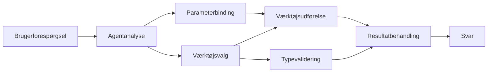

# 🛠️ Avanceret Værktøjsbrug med Azure OpenAI (Responses API) (.NET)

## 📋 Læringsmål

Denne notesbog demonstrerer enterprise-klasse værktøjsintegrationsmønstre ved brug af Microsoft Agent Framework i .NET med Azure OpenAI (Responses API). Du vil lære at bygge sofistikerede agenter med flere specialiserede værktøjer, der udnytter C#'s stærke typning og .NET's enterprise-funktioner.

### Avancerede Værktøjsevner Du Vil Mestre

- 🔧 **Multi-Værktøjsarkitektur**: Opbygning af agenter med flere specialiserede kapaciteter
- 🎯 **Type-sikker Værktøjsudførelse**: Udnyttelse af C#'s kompileringstid-validering
- 📊 **Enterprise Værktøjsmønstre**: Produktionsklar værktøjsdesign og fejlhåndtering
- 🔗 **Værktøjssammensætning**: Kombination af værktøjer til komplekse forretningsarbejdsgange

## 🎯 Fordele ved .NET Værktøjsarkitektur

### Enterprise Værktøjsfunktioner

- **Kompileringstid-validering**: Stærk typning sikrer korrekthed i værktøjsparametre
- **Dependency Injection**: IoC-containerintegration til værktøjsstyring
- **Async/Await-mønstre**: Ikke-blokerende værktøjsudførelse med korrekt ressourcehåndtering
- **Struktureret Logning**: Indbygget logningsintegration til overvågning af værktøjsudførelse

### Produktionsklare Mønstre

- **Fejlhåndtering**: Omfattende fejlstyring med typede undtagelser
- **Ressourcehåndtering**: Korrekte destruktionsmønstre og hukommelsesstyring
- **Ydelsesovervågning**: Indbyggede målinger og ydelsesindikatorer
- **Konfigurationsstyring**: Type-sikker konfiguration med validering

## 🔧 Teknisk Arkitektur

### Kerne .NET Værktøjskomponenter

- **Microsoft.Extensions.AI**: Forenet værktøjsabstraktionslag
- **Microsoft.Agents.AI**: Enterprise-klasse værktøjsorkestrering
- **Azure OpenAI (Responses API)**: Højtydende API-klient med forbindelsepooling

### Værktøjsudførelsespipeline



## 🛠️ Værktøjskategorier & Mønstre

### 1. **Data Processing Tools**

- **Inputvalidering**: Stærk typning med dataannoteringer
- **Transformationsoperationer**: Type-sikker datakonvertering og formatering
- **Forretningslogik**: Domaine-specifikke beregnings- og analysetools
- **Outputformatering**: Struktureret svargenerering

### 2. **Integrationsværktøjer**

- **API Connectors**: RESTful serviceintegration med HttpClient
- **Databaseværktøjer**: Entity Framework-integration til dataadgang
- **Filoperationer**: Sikker filsystemhåndtering med validering
- **Eksterne Tjenester**: Tredjepartsservice-integrationsmønstre

### 3. **Utility Tools**

- **Tekstbehandling**: Stringmanipulation og formatteringsværktøjer
- **Dato/Tids-Operationer**: Kulturbevidste dato/tids-beregninger
- **Matematiske værktøjer**: Præcisionsberegninger og statistiske operationer
- **Valideringsværktøjer**: Forretningsregelvalidering og dataverificering

Klar til at bygge enterprise-klasse agenter med kraftfulde, type-sikre værktøjsfunktioner i .NET? Lad os arkitektere nogle professionelle løsninger! 🏢⚡

## 🚀 Kom godt i gang

### Forudsætninger

- [.NET 10 SDK](https://dotnet.microsoft.com/download/dotnet/10.0) eller nyere
- Et [Azure abonnement](https://azure.microsoft.com/free/) med en Azure OpenAI-ressource og en modeludrulning
- [Azure CLI](https://learn.microsoft.com/cli/azure/install-azure-cli) — log ind med `az login`

### Påkrævede Miljøvariabler

```bash
# zsh/bash
export AZURE_OPENAI_ENDPOINT=https://<your-resource>.openai.azure.com
export AZURE_OPENAI_DEPLOYMENT=gpt-5-mini
# Log derefter ind, så AzureCliCredential kan få et token
az login
```

```powershell
# PowerShell
$env:AZURE_OPENAI_ENDPOINT = "https://<your-resource>.openai.azure.com"
$env:AZURE_OPENAI_DEPLOYMENT = "gpt-5-mini"
# Log ind, så AzureCliCredential kan få en token
az login
```

### Eksempel Kode

For at køre kodeeksemplet,

```bash
# zsh/bash
chmod +x ./04-dotnet-agent-framework.cs
./04-dotnet-agent-framework.cs
```

Eller brug dotnet CLI:

```bash
dotnet run ./04-dotnet-agent-framework.cs
```

Se [`04-dotnet-agent-framework.cs`](../../../../04-tool-use/code_samples/04-dotnet-agent-framework.cs) for den komplette kode.

```csharp
#!/usr/bin/dotnet run

#:package Microsoft.Extensions.AI@10.*
#:package Microsoft.Agents.AI.OpenAI@1.*-*
#:package Azure.AI.OpenAI@2.1.0
#:package Azure.Identity@1.13.1

using System.ComponentModel;

using Microsoft.Agents.AI;
using Microsoft.Extensions.AI;

using Azure.AI.OpenAI;
using Azure.Identity;

// Tool Function: Random Destination Generator
// This static method will be available to the agent as a callable tool
// The [Description] attribute helps the AI understand when to use this function
// This demonstrates how to create custom tools for AI agents
[Description("Provides a random vacation destination.")]
static string GetRandomDestination()
{
    // List of popular vacation destinations around the world
    // The agent will randomly select from these options
    var destinations = new List<string>
    {
        "Paris, France",
        "Tokyo, Japan",
        "New York City, USA",
        "Sydney, Australia",
        "Rome, Italy",
        "Barcelona, Spain",
        "Cape Town, South Africa",
        "Rio de Janeiro, Brazil",
        "Bangkok, Thailand",
        "Vancouver, Canada"
    };

    // Generate random index and return selected destination
    // Uses System.Random for simple random selection
    var random = new Random();
    int index = random.Next(destinations.Count);
    return destinations[index];
}

// Azure OpenAI with the Responses API (stable v1 endpoint). Sign in with `az login`.
var azureEndpoint = Environment.GetEnvironmentVariable("AZURE_OPENAI_ENDPOINT")
    ?? throw new InvalidOperationException("AZURE_OPENAI_ENDPOINT is not set.");
var deployment = Environment.GetEnvironmentVariable("AZURE_OPENAI_DEPLOYMENT") ?? "gpt-5-mini";

var azureClient = new AzureOpenAIClient(new Uri(azureEndpoint), new AzureCliCredential());

// Define Agent Identity and Comprehensive Instructions
// Agent name for identification and logging purposes
var AGENT_NAME = "TravelAgent";

// Detailed instructions that define the agent's personality, capabilities, and behavior
// This system prompt shapes how the agent responds and interacts with users
var AGENT_INSTRUCTIONS = """
You are a helpful AI Agent that can help plan vacations for customers.

Important: When users specify a destination, always plan for that location. Only suggest random destinations when the user hasn't specified a preference.

When the conversation begins, introduce yourself with this message:
"Hello! I'm your TravelAgent assistant. I can help plan vacations and suggest interesting destinations for you. Here are some things you can ask me:
1. Plan a day trip to a specific location
2. Suggest a random vacation destination
3. Find destinations with specific features (beaches, mountains, historical sites, etc.)
4. Plan an alternative trip if you don't like my first suggestion

What kind of trip would you like me to help you plan today?"

Always prioritize user preferences. If they mention a specific destination like "Bali" or "Paris," focus your planning on that location rather than suggesting alternatives.
""";

// Create AI Agent with Advanced Travel Planning Capabilities
// Get the Responses client for the deployment and create the AI agent
// Configure agent with name, detailed instructions, and available tools
// This demonstrates the .NET agent creation pattern with full configuration
AIAgent agent = azureClient
    .GetChatClient(deployment)
    .AsAIAgent(
        name: AGENT_NAME,
        instructions: AGENT_INSTRUCTIONS,
        tools: [AIFunctionFactory.Create(GetRandomDestination)]
    );

// Create New Conversation Session for Context Management
// Initialize a new conversation session to maintain context across multiple interactions
// Sessions enable the agent to remember previous exchanges and maintain conversational state
// This is essential for multi-turn conversations and contextual understanding
await using var session = await agent.CreateSessionAsync();

// Execute Agent: First Travel Planning Request
// Run the agent with an initial request that will likely trigger the random destination tool
// The agent will analyze the request, use the GetRandomDestination tool, and create an itinerary
// Using the session parameter maintains conversation context for subsequent interactions
await foreach (var update in agent.RunStreamingAsync("Plan me a day trip", session))
{
    await Task.Delay(10);
    Console.Write(update);
}

Console.WriteLine();

// Execute Agent: Follow-up Request with Context Awareness
// Demonstrate contextual conversation by referencing the previous response
// The agent remembers the previous destination suggestion and will provide an alternative
// This showcases the power of conversation sessions and contextual understanding in .NET agents
await foreach (var update in agent.RunStreamingAsync("I don't like that destination. Plan me another vacation.", session))
{
    await Task.Delay(10);
    Console.Write(update);
}
```

---

<!-- CO-OP TRANSLATOR DISCLAIMER START -->
**Ansvarsfraskrivelse**:
Dette dokument er blevet oversat ved hjælp af AI-oversættelsestjenesten [Co-op Translator](https://github.com/Azure/co-op-translator). Selvom vi bestræber os på nøjagtighed, skal du være opmærksom på, at automatiserede oversættelser kan indeholde fejl eller unøjagtigheder. Det originale dokument på dets oprindelige sprog bør betragtes som den autoritative kilde. For kritisk information anbefales professionel menneskelig oversættelse. Vi påtager os intet ansvar for misforståelser eller fejltolkninger, der opstår som følge af brugen af denne oversættelse.
<!-- CO-OP TRANSLATOR DISCLAIMER END -->