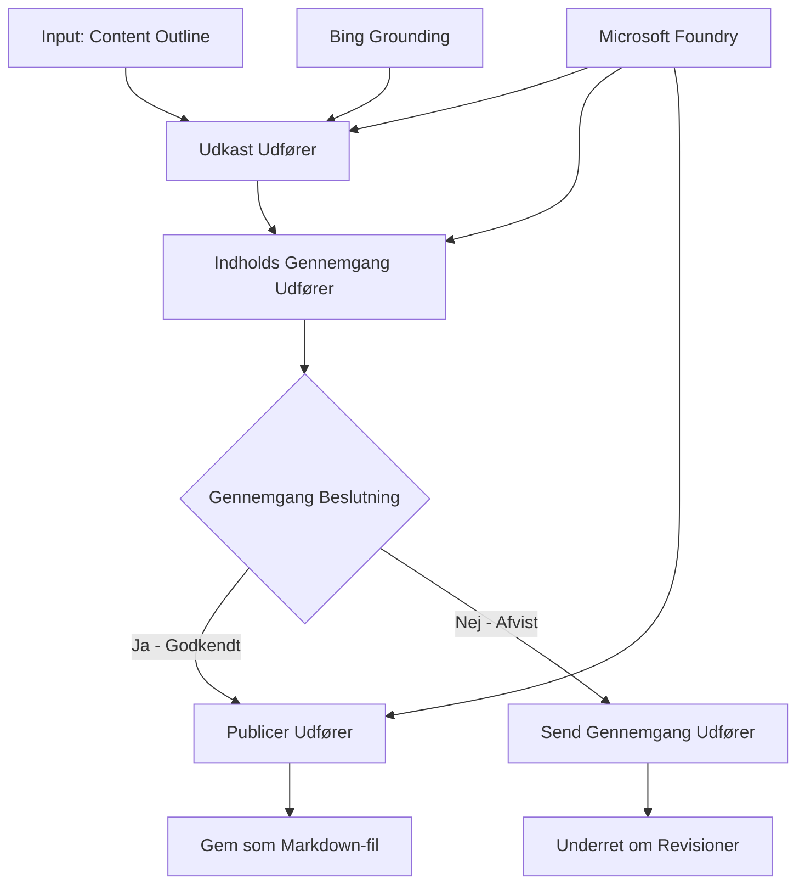

# 🔀 Betingede Agentarbejdsgange med Microsoft Foundry (.NET)

## 📋 Vejledning til Intelligent Beslutningsbaseret Arbejdsgang

Denne notesbog demonstrerer **betingede arbejdsgangsmønstre** ved hjælp af Microsoft Foundry og Microsoft Agent Framework til .NET. Du vil lære at bygge avancerede, beslutningsdrevne arbejdsgange, der intelligent dirigerer behandling baseret på AI-analyse, forretningsregler og dynamiske betingelser til automatisering på virksomhedsplan.

## 🎯 Læringsmål

### 🧠 **Intelligent Beslutningsarkitektur**
- **Implementering af betinget logik**: Opbyg komplekse beslutningstræer med flere forgreningspunkter
- **AI-drevet routing**: Brug Microsoft Foundry-modeller til at træffe intelligente rutedecisioner
- **Dynamisk tilpasning af arbejdsgang**: Ændr arbejdsgangens adfærd baseret på runtime-analyse og betingelser
- **Integration af virksomhedsregler**: Indarbejd forretningslogik og overholdelseskrav i arbejdsgange

### 🔀 **Avancerede betingede mønstre**
- **Beslutningstagning med flere kriterier**: Evaluer flere faktorer for rutebeslutninger
- **Kontekstbevidst behandling**: Træf beslutninger baseret på ophobet arbejdsgangskontekst og historie
- **Adaptiv arbejdsgangstilpasning**: Juster dynamisk behandlingsveje baseret på realtidsbetingelser
- **Integration med regelmotorer**: Implementer avancerede virksomhedsregel-motorer i arbejdsgange

### 🏢 **Betingede virksomhedsapplikationer**
- **Dokumentklassificering og routing**: Automatisk klassificer og rut dokumenter til passende arbejdsgange
- **Customer Service Triage**: Intelligent routing af kundeforespørgsler til specialiserede teams
- **Overholdelse & risikobehandling**: Anvend forskellige validerings- og reviewprocesser baseret på risikovurdering
- **Quality Assurance arbejdsgange**: Ruter indhold gennem passende gennemgangsprocesser baseret på kvalitetsmetrikker

## ⚙️ Forudsætninger & Opsætning

### 📦 **Påkrævede NuGet-pakker**

Avancerede pakker til betinget arbejdsgangsbehandling:

```xml
<!-- Core AI Framework -->
<PackageReference Include="Microsoft.Extensions.AI" Version="9.9.0" />

<!-- Azure AI Agents with Persistent State -->
<PackageReference Include="Azure.AI.Agents.Persistent" Version="1.2.0-beta.5" />

<!-- Azure Identity and Utilities -->
<PackageReference Include="Azure.Identity" Version="1.15.0" />
<PackageReference Include="System.Linq.Async" Version="6.0.3" />
<PackageReference Include="DotNetEnv" Version="3.1.1" />

<!-- Local Workflow Framework References -->
<!-- Microsoft.Agents.Workflows.dll - Advanced workflow orchestration -->
<!-- Microsoft.Agents.AI.AzureAI.dll - Microsoft Foundry integration -->
<!-- Microsoft.Agents.AI.dll - Core agent abstractions -->
```

### 🔑 **Microsoft Foundry Konfiguration**

**Påkrævede Azure-ressourcer:**
- Microsoft Foundry-arbejdsområde med betingede behandlingsmodeller
- Azure-abonnement med passende compute-kvoter og tilladelser
- Udrullede AI-modeller til beslutningstagning og indholdsanalyse
- (Valgfrit) Bing Search API-forbindelse til groundingsfunktioner

**Miljøkonfiguration (.env-fil):**
```env
# Microsoft Foundry Configuration
AZURE_AI_PROJECT_ENDPOINT=https://your-project.cognitiveservices.azure.com/
BING_CONNECTION_ID=your-bing-connection-id
```

**Autentificeringsopsætning:**
```csharp
// Azure CLI or Managed Identity authentication
using Azure.Identity;
var credential = new AzureCliCredential();

// Load environment configuration
DotNetEnv.Env.Load("../../../.env");
```

### 🏗️ **Betinget Arbejdsgangsarkitektur**



**Nøglekomponenter:**
- **Draft Executor**: AI-agent der skaber indledende indholdudkast ud fra dispositioner
- **Content Review Executor**: AI-agent der vurderer udkastets kvalitet og overholdelse
- **Betinget routing**: Beslutningslogik der dirigerer baseret på vurderingsresultater
- **Publicer/Gennemgang Veje**: Separate behandlingsveje for godkendt vs. afvist indhold
- **State Management**: Vedligeholder indholds- og gennemgangskontekst gennem arbejdsgangen

## 🎨 **Designmønstre for Betingede Arbejdsgange**

### 📋 **Indholdsproduktion med kvalitetsporte**
```
Outline → Draft Creation → Quality Review → {Approve: Publish | Reject: Revise}
```

### 🎯 **Risiko-baseret dokumentbehandling**
```
Document → Risk Assessment → {Low: Standard | High: Enhanced Review}
```

### 🔍 **Intelligent routing af kundeservice**
```
Customer Query → Analysis → {Simple: FAQ Bot | Complex: Human Agent}
```

### 💼 **Overholdelsesdrevne arbejdsgange**
```
Content → Compliance Check → {Pass: Publish | Fail: Legal Review}
```

## 🏢 **Fordele ved betingede arbejdsgange i virksomheder**

### 🎯 **Intelligent automatisering**
- **Smart beslutningstagning**: AI-drevne rutebeslutninger baseret på indholdsanalyse og kontekst
- **Adaptiv behandling**: Arbejdsgange der automatisk tilpasser sig ændrede betingelser
- **Håndhævelse af forretningsregler**: Automatisk anvendelse af komplekse forretningsregler og politikker
- **Kontekstbevidst routing**: Beslutninger baseret på fuld arbejdsgangshistorik og ophobet kontekst

### 📈 **Operationel ekspertise**
- **Optimeret ressourceallokering**: Rut arbejde til de mest passende specialister og processer
- **Reduceret manuel indgriben**: Automatiseret beslutningstagning minimerer behov for menneskelig routing
- **Hurtigere løsningstider**: Direkte routing til relevant ekspertise og behandlingskapaciteter
- **Konsistent anvendelse**: Ensartet anvendelse af forretningsregler og beslutningskriterier

### 🛡️ **Risikostyring og overholdelse**
- **Automatiseret risikovurdering**: AI-drevet evaluering af indhold og situationsrisikoniveauer
- **Overholdelseshåndhævelse**: Automatisk routing gennem nødvendige regulatoriske processer
- **Anvendelse af sikkerhedsprotokoller**: Forstærkede sikkerhedsforanstaltninger anvendt baseret på risikovurdering
- **Vedligeholdelse af revisionsspor**: Fuld dokumentation af rutebeslutninger og begrundelser

### 📊 **Analyse og kontinuerlig forbedring**
- **Beslutningsanalyse**: Spor effektiviteten og nøjagtigheden af rutebeslutninger
- **Mønstergenkendelse**: Identificer trends og mønstre i rutebeslutninger over tid
- **Præstationsoptimering**: Kontinuerlig forbedring af beslutningskriterier og ruteeffektivitet
- **Business Intelligence**: Indsigter i indholdskarakteristika og behandlingsbehov

### 🔧 **Teknisk ekspertise**
- **Vedvarende tilstandsstyring**: Oprethold kompleks tilstand gennem arbejdsgangsudførelse
- **Skalerbar arkitektur**: Håndter høje volumen-krav for betinget behandling
- **Integrationsmuligheder**: Problemfri integration med eksisterende forretningssystemer og processer
- **Overvågning og observabilitet**: Omfattende sporing af arbejdsgangens ydeevne og beslutninger

Lad os bygge intelligente, beslutningsdrevne virksomheders arbejdsgange med .NET! 🚀

## 💻 Kørsel af koden

Den komplette implementering findes i `04.dotnet-agent-framework-workflow-aifoundry-condition.cs`. Denne demonstrerer en **indholdsproduktions-arbejdsgang med kvalitetsporte**:

### 🏗️ **Arbejdsgangsarkitektur**

```
Content Outline → Draft Creation → Quality Review → Conditional Routing:
                                                      ├─ Approved (>200 words) → Publish
                                                      └─ Rejected (<200 words) → Review Notification
```

**Agenter i arbejdsgangen:**
1. **Evangelist-agent**: Opretter tutorial-udkast ud fra dispositioner med Bing grounding
2. **Content Reviewer-agent**: Vurderer udkastets kvalitet (ordantal, fuldstændighed)
3. **Publisher-agent**: Gemmer godkendt indhold som tidsstemplede Markdown-filer

**Brugerdefinerede eksekutor'er:**
1. **DraftExecutor**: Koordinerer oprettelse af udkast
2. **ContentReviewExecutor**: Udfører kvalitetsvurdering
3. **PublishExecutor**: Håndterer offentliggørelse af godkendt indhold
4. **SendReviewExecutor**: Administrerer afviste indholdsnotifikationer

### 🚀 Kørsel af eksemplet

**Forudsætninger:**
- Microsoft Foundry-arbejdsområde konfigureret
- Azure CLI autentificering (`az login`)
- (Valgfrit) Bing Search-forbindelse til grounding

```bash
# Gør scriptet eksekverbart (Unix/Linux/macOS)
chmod +x 04.dotnet-agent-framework-workflow-aifoundry-condition.cs

# Kør den betingede arbejdsgang
./04.dotnet-agent-framework-workflow-aifoundry-condition.cs
```

Eller på Windows:
```powershell
dotnet run 04.dotnet-agent-framework-workflow-aifoundry-condition.cs
```

### 📝 Forventet output

Arbejdsgangen vil:
1. **Oprette agenter**: Initialisere tre specialiserede Microsoft Foundry-agenter
2. **Generere udkast**: Evangelist-agenten opretter tutorial-udkast fra disposition
3. **Gennemgå indhold**: Content Reviewer vurderer udkastets kvalitet
4. **Betinget routing**:
   - **Hvis godkendt (>200 ord)**: PublishExecutor gemmer som Markdown-fil
   - **Hvis afvist (<200 ord)**: Send notifikation om gennemgang
5. **Vis resultater**: Vis den endelige arbejdsgangsudgang

### 🔧 Tilpasningsmuligheder

**Ændr vurderingskriterier:**
```csharp
const string ContentReviewerInstructions = @"
You are a content reviewer...
1. Check if content is more than 500 words (instead of 200)
2. Verify technical accuracy
3. Ensure proper formatting
...";
```

**Tilføj flere betingede veje:**
```csharp
var workflow = new WorkflowBuilder(draftExecutor)
    .AddEdge(draftExecutor, contentReviewerExecutor)
    .AddEdge(contentReviewerExecutor, publishExecutor, condition: GetCondition("Excellent"))
    .AddEdge(contentReviewerExecutor, editExecutor, condition: GetCondition("Good"))
    .AddEdge(contentReviewerExecutor, sendReviewerExecutor, condition: GetCondition("Poor"))
    .Build();
```

**Ændr indholdskrav:**
```csharp
string OUTLINE_Content = @"
# Your Custom Topic
## Section 1
https://your-reference-url
## Section 2
...
";
```

### 🎯 Anvendelser i virkeligheden

Dette betingede arbejdsgangsmønster er ideelt til:
- **Content Management Systems**: Automatiserede redaktionelle arbejdsgange med kvalitetsporte
- **Dokumentbehandling**: Ruter dokumenter baseret på klassificering og overholdelse
- **Kundesupport**: Intelligent billetrouting baseret på kompleksitet og hastende karakter
- **Juridisk gennemgang**: Ruter kontrakter baseret på risikovurdering og værdi
- **HR-processer**: Ruter ansøgninger gennem passende screeningsarbejdsgange

### 🔍 Forståelse af betinget logik

**Betingelsesfunktion:**
```csharp
public Func<object?, bool> GetCondition(string expectedResult) =>
    reviewResult => reviewResult is ReviewResult review && review.Result == expectedResult;
```

Denne funktion opretter en prædikat, der:
1. Tjekker om resultatet er af typen `ReviewResult`
2. Sammenligner `Result`-egenskaben med den forventede værdi
3. Returnerer sandt/falsk for at bestemme routing

**Arbejdsgangskanter med betingelser:**
```csharp
.AddEdge(contentReviewerExecutor, publishExecutor, condition: GetCondition("Yes"))
.AddEdge(contentReviewerExecutor, sendReviewerExecutor, condition: GetCondition("No"))
```

### 📊 Avancerede funktioner

**JSON-skema validering:**
Arbejdsgangen bruger JSON-skemaer til at sikre strukturerede svar:

```csharp
// Define response structure
public class ReviewResult
{
    [JsonPropertyName("review_result")]
    public string Result { get; set; } = string.Empty;
    
    [JsonPropertyName("reason")]
    public string Reason { get; set; } = string.Empty;
    
    [JsonPropertyName("draft_content")]
    public string DraftContent { get; set; } = string.Empty;
}

// Apply to agent
ResponseFormat = ChatResponseFormat.ForJsonSchema(
    AIJsonUtilities.CreateJsonSchema(typeof(ReviewResult)), 
    "ReviewResult", 
    "Review Result From DraftContent"
)
```

**Bing groundingsintegration:**
Evangelist-agenten bruger Bing-grounding til at tilgå realtidsinformation:

```csharp
var bingGroundingConfig = new BingGroundingSearchConfiguration(bing_conn_id);
BingGroundingToolDefinition bingGroundingTool = new(
    new BingGroundingSearchToolParameters([bingGroundingConfig])
);
```

Dette gør det muligt for agenten at følge URL'er i dispositionen og udtrække aktuelle oplysninger.

### 🛡️ Fejlhåndtering

Arbejdsgangen inkluderer robust fejlhåndtering for afvist indhold:
- Gennemgangsfejl udløser den alternative sti
- Notifikationer giver klare afvisningsårsager
- Indhold bevares til revision

### 🔄 Udvidelse af arbejdsgangen

**Tilføj et revisionsloop:**
Opret et feedback-loop der automatisk genudformer indhold:

```csharp
.AddEdge(contentReviewerExecutor, publishExecutor, condition: GetCondition("Yes"))
.AddEdge(contentReviewerExecutor, draftExecutor, condition: GetCondition("No")) // Loop back
```

**Implementer flertrinsgennemgang:**
Tilføj flere gennemgangstrin med forskellige kriterier:

```csharp
.AddEdge(draftExecutor, technicalReviewer)
.AddEdge(technicalReviewer, editorialReviewer, condition: GetCondition("TechPass"))
.AddEdge(editorialReviewer, publishExecutor, condition: GetCondition("EditPass"))
```

Dette betingede arbejdsgangsmønster leverer fundamentet for at bygge avancerede, intelligente automatiseringssystemer for virksomheder! 🚀

---

<!-- CO-OP TRANSLATOR DISCLAIMER START -->
**Ansvarsfraskrivelse**:
Dette dokument er blevet oversat ved hjælp af AI-oversættelsestjenesten [Co-op Translator](https://github.com/Azure/co-op-translator). Selvom vi bestræber os på nøjagtighed, skal du være opmærksom på, at automatiserede oversættelser kan indeholde fejl eller unøjagtigheder. Det originale dokument på dets oprindelige sprog bør betragtes som den autoritative kilde. For kritisk information anbefales professionel menneskelig oversættelse. Vi påtager os intet ansvar for misforståelser eller fejltolkninger, der opstår som følge af brugen af denne oversættelse.
<!-- CO-OP TRANSLATOR DISCLAIMER END -->