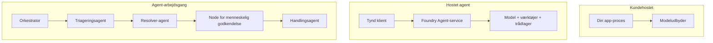
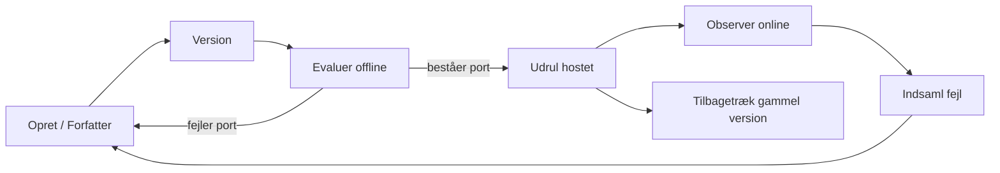
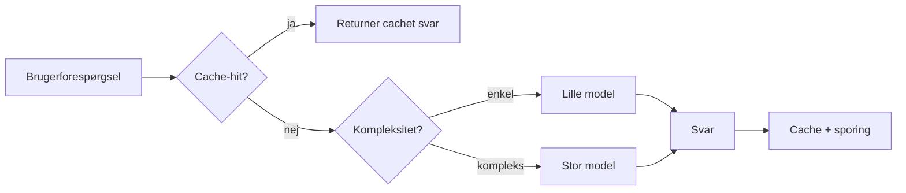
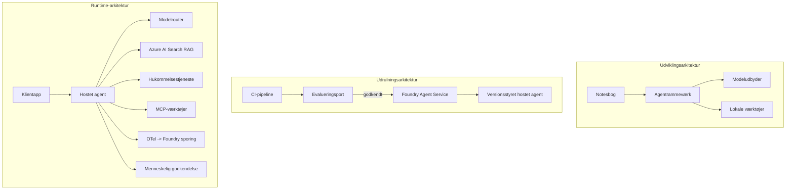

# Implementering af Skalerbare Agenter med Microsoft Foundry


Indtil nu i kurset har du bygget agenter, der kører på din bærbare computer, inde i en notesbog, drevet af `az login` og en håndfuld miljøvariabler. Det er præcis den rigtige måde at lære på. Det er ikke den rigtige måde at køre en agent på, som tusindvis af kunder er afhængige af kl. 3 om natten.

Denne lektion handler om kløften mellem "det virker på min maskine" og "det virker, pålideligt og økonomisk, i produktion." Vi lukker den kløft ved hjælp af **Microsoft Foundry** og **Microsoft Foundry Agent Service**, og vi gør det ved at bygge en rigtig kundesupportagent, der har værktøjer, opslag, hukommelse, evaluering og overvågning.

## Introduktion

Denne lektion vil dække:

- Forskellen mellem en **prototypeagent** og en **implementeret agent**, og hvorfor overgangen primært handler om alt *rundt om* modellen.
- **Implementeringsmønstre** for agenter: klient-hostet, service-hostet (Hosted Agents) og workflow-orchestration.
- **Agentens livscyklus** på Microsoft Foundry — opret, versioner, deploy, evaluer, observer, pensioner.
- **Skaleringsstrategier**: modelrouting, caching, samtidighed og stateless design.
- **Observerbarhed** med OpenTelemetry og Foundry tracing.
- **Omkostningsoptimering** gennem modelvalg, routing og evalueringsporte.
- **Enterprise-overvejelser**: styring, menneskelig godkendelse og sikker kørsel af MCP-servere i produktion.

## Læringsmål

Efter at have gennemført denne lektion, vil du vide, hvordan man:

- Vælger det rette implementeringsmønster for en given agentarbejdsmængde.
- Implementerer en agent til Microsoft Foundry Agent Service, så den er versioneret, styret og observerbar.
- Instrumenterer en agent til tracing og forbinder en evalueringspipeline, der kører før hver udgivelse.
- Anvender modelrouting og caching for at holde latenstid og omkostninger under kontrol i stor skala.
- Tilføjer en gate for menneskelig godkendelse for højrisikohandlinger og integrerer en MCP-server på en produktionssikker måde.

## Forudsætninger

Denne lektion antager, at du har gennemført de tidligere lektioner og er tryg ved:

- At bygge agenter med [Microsoft Agent Framework](../14-microsoft-agent-framework/README.md) (Lektion 14).
- [Brug af værktøjer](../04-tool-use/README.md) (Lektion 4) og [Agentic RAG](../05-agentic-rag/README.md) (Lektion 5).
- [Agent Hukommelse](../13-agent-memory/README.md) (Lektion 13) og [Agentic Protokoller / MCP](../11-agentic-protocols/README.md) (Lektion 11).
- [Observerbarhed og Evaluering](../10-ai-agents-production/README.md) (Lektion 10) — denne lektion bygger direkte videre på den.

Du skal også bruge:

- Et **Azure-abonnement** og et **Microsoft Foundry-projekt** med mindst én implementeret chatmodel.
- Den **Azure CLI** autentificeret (`az login`).
- Python 3.12+ og pakkerne i repository [`requirements.txt`](../../../requirements.txt).

## Fra Prototype til Produktion: Hvad Ændres Egentlig

En prototypeagent og en produktionsagent deler den samme kerne-løkke — ræsonner, kald værktøjer, svar. Det, der ændrer sig, er alt, hvad der er pakket omkring den løkke. Modellen er måske 20% af en produktionsagent; de øvrige 80% er det operationelle skelet.

| Bekymring | Prototype | Produktion |
| --- | --- | --- |
| **Hosting** | Kører i din notesbog | Kører som en hostet service, versioneret og udrullet |
| **Identitet** | Dit `az login` token | Administreret identitet med scoped RBAC |
| **State** | I hukommelsen, mistet ved genstart | Eksternaliseret (trådstore, hukommelsesservice) |
| **Fejl** | Du ser traceback | Genforsøg, fallback, dead-letter, alarmer |
| **Omkostning** | "Det er et par cent" | Sporret pr. forespørgsel, rutet, cachet, budgetteret |
| **Kvalitet** | Du vurderer output manuelt | Evalueret automatisk før hver udgivelse |
| **Tillid** | Du godkender hver handling | Politik + menneskelig involvering for risikable handlinger |

Husk denne tabel. Hvert afsnit nedenfor svarer til en af disse rækker.

## Agent Implementeringsmønstre

Der er tre mønstre, du vil bruge, ofte i kombination.

### 1. Klient-hostede Agenter

Agent-objektet lever inde i *din* applikationsproces. Din kode kalder modeludbyderen direkte; ræsonneringsløkken kører i din service. Det er, hvad alle tidligere lektioner har gjort.

- **Brug det, når** du har brug for fuld kontrol over løkken, tilpasset middleware, eller du indlejrer agenten i en eksisterende backend.
- **Kompro-mis**: du ejer selv skalering, state og robusthed.

### 2. Hosted Agenter (Foundry Agent Service)

Agenten er *registreret som en ressource* i Microsoft Foundry. Foundry hoster ræsonneringsløkken, lagrer tråde, håndhæver indholdssikkerhed og RBAC, og gør agenten synlig i Foundry-portalen. Din app bliver en tynd klient, der opretter tråde og læser svar.

- **Brug det, når** du ønsker holdbarhed, indbygget observerbarhed, styring og mindre operationelt overfladeområde.
- **Kompro-mis**: mindre lavniveau kontrol i bytte for en administreret runtime.

### 3. Agent Workflows

Flere agenter (og værktøjer) sammensættes til en graf med eksplicit kontrolflow — sekventielle trin, forgreninger, menneskelig godkendelsesknuder og holdbare checkpoints, der kan pause og genoptage. Dette er Microsoft Agent Framework **Workflows** kapaciteten anvendt i implementeringsskala.

- **Brug det, når** en enkelt opgave spænder over flere specialiserede agenter eller kræver et godkendelsestrin midtvejs.
- **Kompro-mis**: flere bevægelige dele; kræver observerbarhed på orkestrationsniveau.



## Agentens Livscyklus på Microsoft Foundry

Implementering af en agent er ikke et engangs-`push`. Det er en løkke, og den ligner meget en software-udgivelsescyklus, fordi det netop er det.



Den centrale idé, overført fra [Lektion 10](../10-ai-agents-production/README.md): **offline evaluering er en port, ikke en eftertanke.** En ny agentversion deployes ikke, medmindre den passerer dine evalueringsgrænser. Online observerbarhed fodrer så virkelige fejlsituationer tilbage i dit offline testset. Det er hele løkken.

## Skaleringsstrategier

Skalering af en agent er forskellig fra skalering af en stateless web-API, fordi hver forespørgsel kan udløse flere dyre model- og værktøjskald. Fire teknikker bærer størstedelen af belastningen.

**Stateless forespørgselshåndtering.** Gem ingen bruger-stats i din proces-hukommelse. Gem samtaletråde i Foundry trådstore eller en hukommelsesservice, så enhver instans kan håndtere enhver anmodning. Det er det, der gør det muligt at skalere horisontalt — tilføj instanser, ingen sticky sessions.

**Modelrouting.** Ikke alle forespørgsler behøver din mest kapable (og dyreste) model. Ruter simple forespørgsler — intentionklassifikation, korte faktuelle svar — til en lille, hurtig model, og reserver den store model til ægte ræsonnering. Foundrys **Model Router** kan gøre dette for dig, eller du kan implementere en letvægtsklassifikator selv. Du vil bygge DIY-versionen i lab.

**Respons caching.** Mange supportsøgninger er næsten-duplicates ("hvordan nulstiller jeg mit kodeord?"). Cache svar på almindelige spørgsmål og servér dem uden overhovedet at ramme modellen. Selv en beskeden cache hit-rate reducerer betydeligt både omkostninger og latenstid.

**Samtidighed og backpressure.** Modeludbydere har ratelimits. Begræns din samtidighed, brug genforsøg med eksponentiel backoff, og fejl yndefuldt (et kø-respons med "vi er på det" er bedre end en 500).



## Observerbarhed i Produktion

Du kan ikke operere, hvad du ikke kan se. Som dækket i Lektion 10 udsender Microsoft Agent Framework **OpenTelemetry** traces indbygget — hvert modelkald, værktøjsopkald og orkestreringstrin bliver til en span. I produktion eksporteres disse spans til Microsoft Foundry (eller enhver OTel-kompatibel backend), så du kan:

- Trace en enkelt kundeklage end-to-end på tværs af alle model- og værktøjskald.
- Overvåge p50/p95 latenstid og omkostning pr. anmodning over tid.
- Alarmere ved fejlrate-toppe og omkostningsanomalier, før dine brugere (eller dit finanshold) bemærker det.

```python
from agent_framework.observability import get_tracer

tracer = get_tracer()

with tracer.start_as_current_span("support_request") as span:
    span.set_attribute("customer.tier", "enterprise")
    span.set_attribute("routed.model", "gpt-4.1-mini")
    # agentudførelse spores automatisk inden for dette interval
```

Attributter som `customer.tier` og `routed.model` er det, der forvandler en væg af traces til svarbare spørgsmål ("bliver enterprise-kunder for ofte rutet til den lille model?").

## Omkostningsoptimering

Omkostningen i produktionsagenter domineres af tokens. Tre håndtag, sorteret efter effekt:

1. **Vælg modelstørrelse rigtigt.** En lille model, der passerer din evalueringsport, er næsten altid billigere end en stor, der også passerer. Brug evaluering til *at bevise*, at den lille model er god nok frem for at vælge den største model af forsigtighed.
2. **Rut efter kompleksitet.** Som ovenfor — betal stor-model-pris kun for forespørgsler, der har brug for stor-model-ræsonnering.
3. **Cache aggressivt.** Det billigste modelkald er det, du aldrig laver.

Evalueringsporte og omkostningskontrol er den samme disciplin set fra to vinkler: evaluering fortæller dig *kvalitetsgulvet*, routing og caching holder dig så tæt på det gulvs *omkostning* som muligt.

## Enterprise-overvejelser ved Implementering

**Styring.** Hosted Agents arver Foundrys RBAC, indholdssikkerhed og revisionslogning. Giv hver agent en administreret identitet med mindst muligt privilegium — læseadgang til vidensdatabasen, scoped adgang til ticket-API'en, ikke mere.

**Menneske-i-løkken.** Nogle handlinger er for betydningsfulde til at automatisere fuldstændigt — udstedelse af refundering, sletning af konto, eskalering til juridisk team. Microsoft Agent Framework understøtter **godkendelseskrævede** værktøjer: agenten foreslår handlingen, eksekveringen pauser, et menneske godkender eller afviser, og workflowet genoptages. Du så primitiven i [Lektion 6](../06-building-trustworthy-agents/README.md); her implementerer du den.

**MCP i produktion.** [MCP](../11-agentic-protocols/README.md) lader din agent bruge eksterne værktøjer gennem en standardgrænseflade. I produktion behandles hver MCP-server som en utroværdig grænse: fastlås serverversionen, kør den med scoped identitet, valider dens output, og afslør aldrig hemmeligheder for den. En MCP-server er en afhængighed, og afhængigheder patches, revideres og ratelimiteres.



De tre diagrammer — udvikling, implementering, runtime — er samme agent på tre stadier af dens liv. Lab'en herunder guider dig gennem at bygge den.

## Praktisk Lab: En Produktionsklar Kundesupportagent

Åbn [`code_samples/16-python-agent-framework.ipynb`](./code_samples/16-python-agent-framework.ipynb) og gennemfør den fra start til slut. Du vil samle en **Contoso kundesupportagent** med alle produktionshensyn indbygget:

1. **Værktøjskald** — slå ordrestatuser og åbne supportbilletter op.
2. **RAG** — besvar politikspørgsmål fra en vidensbase (Azure AI Search, med fallback i hukommelsen, så notesbogen kan køre uden en Search-ressource).
3. **Hukommelse** — husk kunden på tværs af samtaleture.
4. **Modelrouting** — en kompleksitetsklassifikator ruter hver forespørgsel til en lille eller stor model.
5. **Respons caching** — gentagne spørgsmål serviceres fra cache.
6. **Menneskelig godkendelse** — refunderinger over en tærskel afventer menneskelig sign-off.
7. **Evalueringspipeline** — et lille offline testset scorer agenten og fungerer som en udgivelsesport.
8. **Observerbarhed** — OpenTelemetry tracing for hver eneste forespørgsel.

### Gennemgang

Notesbogen er organiseret, så hvert produktionshensyn er en selvstændig, kørbar sektion. Hjertet er routing-plus-caching forespørgselsbehandleren:

```python
async def handle_support_request(query: str, customer_id: str) -> str:
    # 1. Server fra cache, når vi kan.
    cached = response_cache.get(normalize(query))
    if cached:
        return cached

    # 2. Ruter efter kompleksitet for at kontrollere omkostninger.
    model = "gpt-4.1-mini" if is_simple(query) else "gpt-4.1"

    # 3. Kør agenten inden for en trace-spænding for observérbarhed.
    with tracer.start_as_current_span("support_request") as span:
        span.set_attribute("routed.model", model)
        span.set_attribute("customer.id", customer_id)
        response = await support_agent.run(query, model=model)

    # 4. Cache og returnér.
    response_cache.set(normalize(query), response.text)
    return response.text
```

Evalueringsporten, der beskytter en udgivelse, ser sådan ud:

```python
async def evaluation_gate(agent, test_cases, threshold: float = 0.8) -> bool:
    passed = 0
    for case in test_cases:
        result = await agent.run(case["input"])
        if score_response(result.text, case["expected"]) >= 0.8:
            passed += 1
    pass_rate = passed / len(test_cases)
    print(f"Evaluation pass rate: {pass_rate:.0%} (gate: {threshold:.0%})")
    return pass_rate >= threshold  # deploy kun hvis porten går igennem
```

Læs hver linje — notesbogen holder primitiverne bevidst små, så intet er skjult bag et framework-kald.

## Validering af en Implementeret Agent med Smoke-tests

Evalueringsporten ovenfor køres *offline* mod dit agentobjekt. Når agenten er implementeret som Hosted Agent, har du brug for en sidste, endnu billigere kontrol: **svarer den implementerede endpoint faktisk?**

At deploye "med succes" beviser kun, at kontrolplanet accepterede definitionen — det beviser ikke, at agenten svarer. En manglende afhængighed, dårlig modelrouting eller en udløbet forbindelse kan efterlade en grøn implementation, der ikke returnerer noget. En **smoke test** fanger det på sekunder, ved hver deploy, uden omkostningerne ved en fuld evaluering.

Dette repository leverer en klar-til-brug smoke-test pipeline bygget på [AI Smoke Test](https://github.com/marketplace/actions/ai-smoke-test) GitHub Action:

- **Katalog** — [`tests/lesson-16-smoke-tests.json`](../../../tests/lesson-16-smoke-tests.json) indeholder prompts og påstande for Contoso supportagenten (jordbundne politik-svar, ordresøgning, holde sig til emnet, og kontinuitet i multiturstråde). Kataloger til andre lektionsagenter findes ved siden af — se [`tests/README.md`](../tests/README.md).
- **Workflow** — [`.github/workflows/smoke-test.yml`](../../../.github/workflows/smoke-test.yml) logger ind med Azure OIDC og POSTer hver prompt til agentens Responses endpoint, fejler jobbet ved manglende påstand.

```yaml
- name: Smoke-test hosted agent
  uses: JFolberth/ai-smoketest@v1
  with:
    project_endpoint: ${{ inputs.project_endpoint }}
    agent_name: ContosoSupportAgent
    tests_file: tests/lesson-16-smoke-tests.json
```


Kør det fra fanen **Actions**, når din agent er implementeret, og angiv din Foundry-projektendepunkt og agentnavn. Den fødererede identitet kræver rollen **Azure AI User** på Foundry-projektområdet. Tænk på lagene som en pyramide: røgtests (tilgængelig og reagerer?) køres ved hver implementering, offline evaluering (god nok til frigivelse?) køres før promovering, og online evaluering (hvordan klarer den sig i felten?) kører kontinuerligt.

## Videnstest

Test din forståelse inden du går videre til opgaven.

**1. Ca. hvor meget af en produktionsagent er "modellen," og hvad er resten?**

<details>
<summary>Svar</summary>

Modellen udgør en minoritet af systemet — ofte angivet til omkring 20%. Resten er det operationelle skelet: hosting og versionering, identitet og RBAC, eksternaliseret tilstand, fejlhåndtering, omkostningssporing, evaluering og kontrol med menneskelig inddragelse. Overgangen til produktion handler mest om at bygge alt *rundt om* ræsonnementsløkken.
</details>

**2. Hvornår vil du vælge en Hosted Agent frem for en klienthostet agent?**

<details>
<summary>Svar</summary>

Når du ønsker en administreret runtime med indbygget holdbarhed (tråde der bevares og kan genoptages), observerbarhed, indholdssikkerhed og RBAC, og du er villig til at afgive noget lavniveaukontrol over ræsonnementsløkken for et mindre operationelt overfladeareal. Klienthostet er at foretrække, når du har brug for fuld kontrol over løkken eller integrerer agenten i en eksisterende backend.
</details>

**3. Hvorfor skal en skalerbar agent være statsløs i sin egen proceshukommelse?**

<details>
<summary>Svar</summary>

Så enhver instans kan håndtere enhver anmodning, hvilket tillader horisontal skalering uden sticky sessions. Per-bruger samtalestatus eksternaliseres til en trådbutiks- eller hukommelsestjeneste. Hvis tilstanden boede i proceshukommelsen, ville du miste den ved genstart og kunne ikke fordele belastningen frit.
</details>

**4. Hvilket problem løser modelruting, og hvordan relaterer det sig til evaluering?**

<details>
<summary>Svar</summary>

Ruting sender simple forespørgsler til en lille, billig, hurtig model og reserverer den store model til ægte ræsonnering, hvilket styrer både latenstid og omkostning. Det relaterer til evaluering, fordi evaluering er det, der *beviser*, at den lille model er god nok til en klasse af forespørgsler — ruting uden evaluering er gætteri.
</details>

**5. Hvad er en "evalueringsport," og hvor ligger den i livscyklussen?**

<details>
<summary>Svar</summary>

En evalueringsport kører et offline testsæt mod en ny agentversion og blokerer implementering, medmindre beståelsesprocenten klarer en tærskel. Den ligger mellem "version" og "implementering" i livscyklussen, hvilket gør kvalitet til en forudsætning for frigivelse snarere end noget, du tjekker efter levering.
</details>

**6. Hvorfor bør en MCP-server behandles som en upålidelig grænseflade i produktion?**

<details>
<summary>Svar</summary>

Fordi det er en ekstern afhængighed, som din agent kalder på. Du bør nøglefiksere dens version, køre den med en afgrænset identitet, validere dens output, ratebegrænse den og aldrig udsætte hemmeligheder for den — samme disciplin som du anvender på enhver tredjepartsafhængighed. Dens output flyder ind i din agents ræsonnement, så uvalideret tillid er en sikkerhedsrisiko.
</details>

**7. Hvilken enkelt ændring har normalt den største indvirkning på produktionsagentens omkostninger, og hvorfor?**

<details>
<summary>Svar</summary>

At tilpasse modellens størrelse — bruge den mindste model, der stadig består din evalueringsport. Omkostninger domineres af tokens, og en mindre model, der opfylder kvalitetskravet, er næsten altid billigere end en større. Caching og routing reducerer omkostninger yderligere, men valg af den rette basismodel har den største primære effekt.
</details>

**8. Hvilken rolle spiller span-attributter som `customer.tier` og `routed.model` i observerbarhed?**

<details>
<summary>Svar</summary>

De omdanner rå spor til svarbare forretningsspørgsmål. Uden attributter har du en mur af spans; med dem kan du spørge "bliver virksomhedskunder for ofte routet til den lille model?" eller "hvilken model håndterer vores langsomste forespørgsler?" Attributter er, hvordan du skærer telemetri efter de dimensioner, der betyder noget for din drift.
</details>

## Opgave

Tag kundesupportagenten fra laboratoriet og styrk den til et specifikt scenarie: **en abonnements-betalingssupportagent for et SaaS-firma.**

Din aflevering skal:

1. **Erstat værktøjerne** med betalingsrelevante: `get_subscription_status`, `get_invoice`, og `issue_credit` (kreditter over $50 kræver menneskelig godkendelse).
2. **Tilføj tre RAG-dokumenter** der omhandler firmaets refusionspolitik, faktureringscyklus og annulleringspolitik.
3. **Udvid evalueringssættet** til mindst otte sager, inklusiv mindst to, der *skal* aktivere den menneskelige godkendelsesvej, og bekræft at din evalueringsport korrekt godkender eller afviser.
4. **Tilføj en omkostningsrapport**: efter at have kørt ti blandede forespørgsler gennem agenten, print hvor mange der gik til den lille model, hvor mange til den store model, og hvor mange der blev betjent fra cache.

Skriv et kort afsnit (i en markdown-celle), der forklarer hvilken modelruterregel du valgte, og hvordan du ville validere den med reel trafik. Der findes ikke ét korrekt svar — du vurderes på, om produktionshensynene er sammenflettet koherent.

## Resumé

I denne lektion flyttede du en agent fra prototype til produktion med Microsoft Foundry:

- Springet til produktion handler mest om **det operationelle skelet** omkring modellen — hosting, identitet, tilstand, fejlhåndtering, omkostninger, kvalitet og tillid.
- Du lærte de tre **implementeringsmønstre** — klienthostet, Hosted Agents og Agent Workflows — og hvornår de hver især passer.
- Du gik igennem **agents livscyklus**, hvor offline **evaluering fungerer som en frigivelsesport** og online observerbarhed giver fejl tilbage til testsættet.
- Du anvendte **skaleringsstrategier** — statsløs design, modelruting, caching og begrænset parallelitet — og koblede dem til **omkostningsoptimering**.
- Du implementerede **enterprise-kontroller**: RBAC, godkendelse med menneskelig inddragelse og produktion-sikker MCP-integration.
- Du byggede en **produktionsklar kundesupportagent**, der samler alle disse hensyn i kørbar kode.

Næste lektion tager den modsatte rejse: i stedet for at skalere agenter op i skyen, vil du trække dem *ned* på en enkelt udviklermaskine og køre dem fuldstændigt lokalt.

## Yderligere ressourcer

- <a href="https://learn.microsoft.com/azure/ai-foundry/what-is-azure-ai-foundry" target="_blank">Microsoft Foundry-dokumentation</a>
- <a href="https://learn.microsoft.com/azure/ai-foundry/agents/overview" target="_blank">Oversigt over Microsoft Foundry Agent Service</a>
- <a href="https://aka.ms/ai-agents-beginners/agent-framework" target="_blank">Microsoft Agent Framework</a>
- <a href="https://learn.microsoft.com/azure/ai-foundry/concepts/model-router" target="_blank">Model Router i Microsoft Foundry</a>
- <a href="https://learn.microsoft.com/azure/search/search-what-is-azure-search" target="_blank">Azure AI Search</a>
- <a href="https://opentelemetry.io/" target="_blank">OpenTelemetry</a>
- <a href="https://github.com/marketplace/actions/ai-smoke-test" target="_blank">AI Smoke Test GitHub Action</a>
- <a href="https://modelcontextprotocol.io/" target="_blank">Model Context Protocol (MCP)</a>

## Forrige lektion

[Building Computer Use Agents (CUA)](../15-browser-use/README.md)

## Næste lektion

[Creating Local AI Agents](../17-creating-local-ai-agents/README.md)

---

<!-- CO-OP TRANSLATOR DISCLAIMER START -->
**Ansvarsfraskrivelse**:
Dette dokument er blevet oversat ved hjælp af AI-oversættelsestjenesten [Co-op Translator](https://github.com/Azure/co-op-translator). Selvom vi bestræber os på nøjagtighed, skal du være opmærksom på, at automatiserede oversættelser kan indeholde fejl eller unøjagtigheder. Det originale dokument på dets oprindelige sprog bør betragtes som den autoritative kilde. For kritisk information anbefales professionel menneskelig oversættelse. Vi påtager os intet ansvar for misforståelser eller fejltolkninger, der opstår som følge af brugen af denne oversættelse.
<!-- CO-OP TRANSLATOR DISCLAIMER END -->