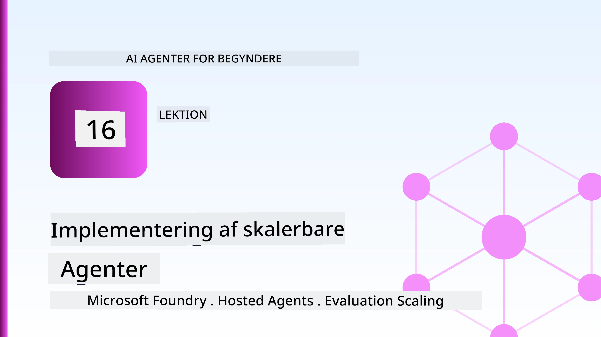
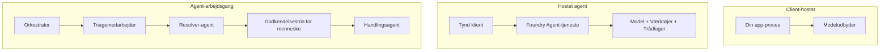
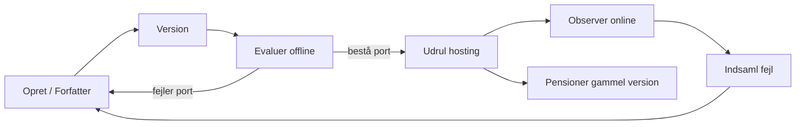
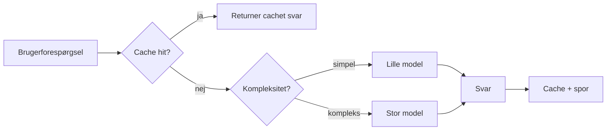
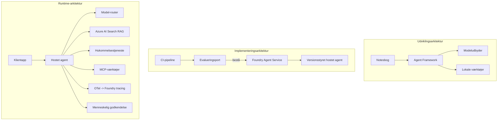

# Udrulning af skalerbare agenter med Microsoft Foundry



Indtil nu i kurset har du bygget agenter, der kører på din bærbare computer, inde i en notebook, drevet af `az login` og en håndfuld miljøvariabler. Det er præcis den rigtige måde at lære på. Det er ikke den rigtige måde at køre en agent på, som tusindvis af kunder er afhængige af klokken 3 om natten.

Denne lektion handler om kløften mellem "det virker på min maskine" og "det virker pålideligt og omkostningseffektivt i produktion." Vi lukker den kløft ved hjælp af **Microsoft Foundry** og **Microsoft Foundry Agent Service**, og vi gør det ved at bygge en rigtig kundeserviceagent, der har værktøjer, opslag, hukommelse, evaluering og overvågning.

## Introduktion

Denne lektion vil dække:

- Forskellen mellem en **prototypeagent** og en **udrullet agent**, og hvorfor overgangen mest handler om alt *omkring* modellen.
- **Udrulningsmønstre** for agenter: klient-hostet, service-hostet (Hosted Agents) og workflow-orchestrerede.
- **Agentens livscyklus** på Microsoft Foundry — opret, versioner, udrul, evaluer, observer, pensioner.
- **Skaleringsstrategier**: modelrouting, caching, samtidighed og statsløs design.
- **Observerbarhed** med OpenTelemetry og Foundry-sporing.
- **Omkostningsoptimering** gennem modelvalg, routing og evalueringsportaler.
- **Virksomhedsovervejelser**: styring, menneskelig godkendelse og sikker kørsel af MCP-servere i produktion.

## Læringsmål

Når du har gennemført denne lektion, vil du vide, hvordan man:

- Vælger det rigtige udrulningsmønster til en given agent arbejdsbyrde.
- Udruller en agent til Microsoft Foundry Agent Service, så den versionsstyres, styres og observeres.
- Instrumenterer en agent til sporing og kobler en evalueringspipeline på, som kører før hver udgivelse.
- Anvender modelrouting og caching for at holde latenstid og omkostninger under kontrol i skala.
- Tilføjer en menneskelig godkendelsesportal for højrisikohandlinger og integrerer en MCP-server på en produktion-sikker måde.

## Forudsætninger

Denne lektion forudsætter, at du har gennemført de tidligere lektioner og er fortrolig med:

- At bygge agenter med [Microsoft Agent Framework](../14-microsoft-agent-framework/README.md) (Lektion 14).
- [Værktøjsbrug](../04-tool-use/README.md) (Lektion 4) og [Agentic RAG](../05-agentic-rag/README.md) (Lektion 5).
- [Agenthukommelse](../13-agent-memory/README.md) (Lektion 13) og [Agentic Protocols / MCP](../11-agentic-protocols/README.md) (Lektion 11).
- [Observerbarhed og evaluering](../10-ai-agents-production/README.md) (Lektion 10) — denne lektion bygger direkte videre på den.

Du skal også bruge:

- Et **Azure-abonnement** og et **Microsoft Foundry-projekt** med mindst én udrullet chatmodel.
- Den **Azure CLI** autentificeret (`az login`).
- Python 3.12+ og pakkerne i repositoriet [`requirements.txt`](../../../requirements.txt).

## Fra prototype til produktion: Hvad ændres egentlig

En prototypeagent og en produktionsagent deler samme kerneloop — resoner, kald værktøjer, svar. Hvad der ændres, er alt det, der er pakket rundt om det loop. Modellen udgør måske 20% af en produktionsagent; de resterende 80% er den operationelle ryggrad.

| Bekymring | Prototype | Produktion |
| --- | --- | --- |
| **Hosting** | Kører i din notebook | Kører som en hostet service, versionsstyret og udrullet |
| **Identitet** | Dit `az login` token | Administreret identitet med scoped RBAC |
| **Status** | I hukommelsen, mistes ved genstart | Eksterniseret (thread store, hukommelsestjeneste) |
| **Fejl** | Du ser fejlopsporing | Genforsøg, fallback, dead-letter, alarmer |
| **Omkostning** | "Det er et par cent" | Sporet pr. anmodning, ruteret, cached, budgetteret |
| **Kvalitet** | Du vurderer output | Evalueret automatisk før hver udgivelse |
| **Tillid** | Du godkender hver handling | Politik + menneske-i-loop for risikable handlinger |

Husk denne tabel. Hver sektion nedenfor svarer til en af disse rækker.

## Agentudrulningsmønstre

Der er tre mønstre, du vil bruge, ofte i kombination.

### 1. Klient-hostede agenter

Agent-objektet lever inde i *din* applikationsproces. Din kode kalder modeludbyderen direkte; resoneringsloopet kører i din service. Det er det, hver tidligere lektion har gjort.

- **Brug det, når** du har brug for fuld kontrol over loopen, brugerdefineret middleware eller indlejrer agenten inde i en eksisterende backend.
- **Afvejning**: du ejer selv skalering, tilstand og robusthed.

### 2. Hosted Agenter (Foundry Agent Service)

Agenten er *registreret som en ressource* i Microsoft Foundry. Foundry hoster resoneringsloopet, gemmer tråde, håndhæver indholdssikkerhed og RBAC samt gør agenten synlig i Foundry-portalen. Din app bliver en tynd klient, der opretter tråde og læser svar.

- **Brug det, når** du vil have holdbarhed, indbygget observerbarhed, styring og mindre operationelt overfladeareal.
- **Afvejning**: mindre lavniveau kontrol til gengæld for en administreret runtime.

### 3. Agent-workflows

Flere agenter (og værktøjer) sammensættes til en graf med eksplicit kontrolflow — sekventielle trin, forgrening, menneskelig godkendelsesknuder og holdbare checkpoints, der kan pause og genoptage. Dette er Microsoft Agent Framework **Workflows**-funktionaliteten anvendt i udrulningsskala.

- **Brug det, når** en enkelt opgave spænder over flere specialiserede agenter eller kræver et godkendelsestrin midt i processen.
- **Afvejning**: flere bevægelige dele; kræver orchestration-niveau observerbarhed.



## Agentens livscyklus på Microsoft Foundry

Udrulning af en agent er ikke et engangs-`push`. Det er et loop, og det ligner meget en software-udgivelsescyklus, fordi det er præcis, hvad det er.



Hovedideen, taget med fra [Lektion 10](../10-ai-agents-production/README.md): **offline evaluering er en port, ikke en eftertanke.** En ny agentversion udgives ikke, medmindre den klarer dine evalueringsgrænser. Online observerbarhed forsyner derefter virkelige fejlsituationer tilbage til dit offline testsæt. Det er hele loopen.

## Skaleringsstrategier

Skalering af en agent er anderledes end skalering af en statsløs web-API, fordi hver anmodning kan udløse flere dyre model- og værktøjskald. Fire teknikker bærer det meste af belastningen.

**Statsløs håndtering af anmodninger.** Gem ingen per-bruger status i din proces hukommelse. Gem samtaletråde i Foundry thread store eller en hukommelsestjeneste, så enhver instans kan håndtere enhver anmodning. Det er det, der lader dig skalere horisontalt — tilføj instanser, ingen sticky sessions.

**Modelrouting.** Ikke hver anmodning behøver din mest kapable (og dyreste) model. Ruter simple anmodninger — intentionsklassifikation, korte faktuelle svar — til en lille, hurtig model, og reserver den store model til ægte resonnering. Foundrys **Model Router** kan gøre dette for dig, eller du kan implementere en letvægtsklassifikator selv. Du vil bygge DIY-versionen i labbet.

**Responscaching.** Mange supportforespørgsler er næsten duplikater ("hvordan nulstiller jeg mit kodeord?"). Cache svar på almindelige spørgsmål og lever dem uden at ramme modellen overhovedet. Selv en beskeden cache-hit-rate reducerer omkostninger og latenstid mærkbart.

**Samtidighed og backpressure.** Modeludbydere har ratebegrænsninger. Begræns din samtidighed, brug genforsøg med eksponentiel backoff, og fejl på en elegant måde (et kø-respons "vi er på sagen" slår en 500).



## Observerbarhed i produktion

Du kan ikke drive det, du ikke kan se. Som dækket i Lektion 10 udsender Microsoft Agent Framework **OpenTelemetry** sporinger nativeret — hvert modelkald, værktøjsindkald og orkestreringstrin bliver til en span. I produktion eksporterer du disse spans til Microsoft Foundry (eller enhver OTel-kompatibel backend), så du kan:

- Spore en enkelt kundeklage fra ende til anden på tværs af hvert model- og værktøjskald.
- Overvåge p50/p95 latenstid og omkostninger per anmodning over tid.
- Alarmer ved fejlratestigninger og omkostningsanomalier før dine brugere (eller dit finanshold) bemærker det.

```python
from agent_framework.observability import get_tracer

tracer = get_tracer()

with tracer.start_as_current_span("support_request") as span:
    span.set_attribute("customer.tier", "enterprise")
    span.set_attribute("routed.model", "gpt-5-nano")
    # agentudførelse spores automatisk inden for dette span
```

Attributter som `customer.tier` og `routed.model` er det, der forvandler en væg af spor til besvarelige spørgsmål ("bliver virksomhedskunder for ofte ruteret til den lille model?").

## Omkostningsoptimering

Omkostninger i produktionsagenter domineres af tokens. Tre håndtag, i rækkefølge efter effekt:

1. **Rettestør modellen.** En lille model, der passerer din evalueringsport, er næsten altid billigere end en stor, der også passerer. Brug evaluering til at *bevise*, at den lille model er god nok i stedet for som udgangspunkt at vælge den største model af forsigtighed.
2. **Ruter efter kompleksitet.** Som ovenfor — betal kun store-model-priser for anmodninger, der kræver stor-model resonnering.
3. **Cache aggressivt.** Det billigste modelkald er det, du aldrig foretager.

Evalueringsporte og omkostningskontrol er den samme disciplin set fra to vinkler: evaluering fortæller dig *kvalitetsbunden*, routing og caching holder dig så tæt som muligt på den bunds *omkostninger*.

## Overvejelser ved virksomhedens udrulning

**Styring.** Hosted Agents arver Foundrys RBAC, indholdssikkerhed og revisionslogning. Giv hver agent en administreret identitet med mindst mulig rettighed — skrivebeskyttet adgang til vidensbasen, scoperet adgang til ticketing-API'en, intet mere.

**Menneske-i-loop.** Nogle handlinger er for konsekvente til at automatisere direkte — udstede en refusion, slette en konto, eskalere til en juridisk afdeling. Microsoft Agent Framework understøtter **godkendelseskrævende** værktøjer: agenten foreslår handlingen, udførelsen pauser, et menneske godkender eller afviser, og workflowet genoptages. Du så denne primitiv i [Lektion 6](../06-building-trustworthy-agents/README.md); her udruller du den.

**MCP i produktion.** [MCP](../11-agentic-protocols/README.md) lader din agent forbruge eksterne værktøjer via en standardgrænseflade. I produktion behandles hver MCP-server som en ikke-tillidværdi grænseflade: fastlåse serverversionen, køre den med en scoped identitet, validere dens output og aldrig eksponere hemmeligheder til den. En MCP-server er en afhængighed, og afhængigheder bliver patched, revideret og ratebegrænset.



De tre diagrammer — udvikling, udrulning, runtime — er den samme agent i tre livsfaser. Labbet, der følger, guider dig gennem at bygge den.

## Hands-On Lab: En produktionsklar kundeserviceagent

Åbn [`code_samples/16-python-agent-framework.ipynb`](./code_samples/16-python-agent-framework.ipynb) og arbejd dig igennem den fra ende til anden. Du vil samle en **Contoso kundeserviceagent** med alle produktionsbekymringer indbygget:

1. **Værktøjskald** — slå ordrestatus op og åben supportsager.
2. **RAG** — svar på politikspørgsmål fra en vidensbase (Azure AI Search, med et in-memory fallback, så notebooken kører uden en Search-ressource).
3. **Hukommelse** — husk kunden på tværs af samtaleture.
4. **Modelrouting** — en kompleksitetsklassifikator ruter hver anmodning til en lille eller stor model.
5. **Responscaching** — gentagne spørgsmål betjenes fra cache.
6. **Menneskelig godkendelse** — refusioner over en tærskel pauser for menneskelig godkendelse.
7. **Evalueringspipeline** — et lille offline testsæt scorer agenten og fungerer som udgivelsesport.
8. **Observerbarhed** — OpenTelemetry-sporing omkring hver anmodning.

### Gennemgang

Notebooken er organiseret, så hver produktionsbekymring er en selvstændig, kørbar sektion. Kernen i den er routing-plus-caching anmodningshåndteringen:

```python
async def handle_support_request(query: str, customer_id: str) -> str:
    # 1. Server fra cache når vi kan.
    cached = response_cache.get(normalize(query))
    if cached:
        return cached

    # 2. Ruters efter kompleksitet for at kontrollere omkostninger.
    model = "gpt-5-nano" if is_simple(query) else "gpt-5-mini"

    # 3. Kør agenten inden for et trace-span for observerbarhed.
    with tracer.start_as_current_span("support_request") as span:
        span.set_attribute("routed.model", model)
        span.set_attribute("customer.id", customer_id)
        response = await support_agent.run(query, model=model)

    # 4. Cache og returner.
    response_cache.set(normalize(query), response.text)
    return response.text
```

Evalueringsporten, der beskytter en udgivelse, ser sådan ud:

```python
async def evaluation_gate(agent, test_cases, threshold: float = 0.8) -> bool:
    passed = 0
    for case in test_cases:
        result = await agent.run(case["input"])
        if score_response(result.text, case["expected"]) >= 0.8:
            passed += 1
    pass_rate = passed / len(test_cases)
    print(f"Evaluation pass rate: {pass_rate:.0%} (gate: {threshold:.0%})")
    return pass_rate >= threshold  # deploy kun hvis porten passerer
```

Læs hver linje — notebooken holder primitivene bevidst små, så intet er skjult bag et frameworks-kald.

## Validering af en udrullet agent med røgtests

Evalueringsporten ovenfor kører *offline* mod dit agentobjekt. Når agenten er udrullet som en Hosted Agent, har du brug for endnu en, endnu billigere kontrol: **svarer den udrullede endpoint faktisk?**

At udrulle "med succes" beviser kun, at kontrolplanet accepterede definitionen — det beviser ikke, at agenten svarer. En manglende afhængighed, dårlig modelrouting eller en udløbet forbindelse kan efterlade en grøn udrulning, der ikke returnerer noget. En **røgtest** fanger det på sekunder, ved hver udrulning, uden omkostningerne ved en fuld evaluering.

Dette repository leverer en klar-til-brug røgtest-pipeline bygget på [AI Smoke Test](https://github.com/marketplace/actions/ai-smoke-test) GitHub Action:

- **Katalog** — [`tests/lesson-16-smoke-tests.json`](../../../tests/lesson-16-smoke-tests.json) indeholder prompts og påstande for Contoso supportagenten (grundfæstede politik-svar, en ordreopslag, holde sig til emnet, og multi-turn tråde kontinuitet). Kataloger for andre lektionsagenters lever samtidig — se [`tests/README.md`](../tests/README.md).
- **Workflow** — [`.github/workflows/smoke-test.yml`](../../../.github/workflows/smoke-test.yml) logger ind med Azure OIDC og POST'er hver prompt til agentens Responses endpoint, og fejler jobbet ved enhver påstandsmiss.

```yaml
- name: Smoke-test hosted agent
  uses: JFolberth/ai-smoketest@v1
  with:
    project_endpoint: ${{ inputs.project_endpoint }}
    agent_name: ContosoSupportAgent
    tests_file: tests/lesson-16-smoke-tests.json
```


Kør det fra **Handlinger**-fanen, når din agent er implementeret, og angiv din Foundry-projektendepunkt og agentnavn. Den fødererede identitet skal have rollen **Azure AI User** i Foundry-projektets omfang. Tænk på lagene som en pyramide: rygetests (er den tilgængelig og reagerer?) kører ved hver implementering, offline evaluering (er den god nok til at sende ud?) kører før promovering, og online evaluering (hvordan klarer den sig ude i brug?) kører kontinuerligt.

## Videnscheck

Test din forståelse, før du går videre til opgaven.

**1. Omtrent hvor stor en del af en produktionsagent er "modellen," og hvad består resten af?**

<details>
<summary>Svar</summary>

Modellen er en minoritet af systemet — ofte nævnt til omkring 20%. Resten er det operationelle skelet: hosting og versionering, identitet og RBAC, ekstern tilstand, fejlhåndtering, omkostningssporing, evaluering og human-in-the-loop kontrol. At gå i produktion handler mest om at bygge *omkring* ræsonnementsløkken.
</details>

**2. Hvornår ville du vælge en Hosted Agent fremfor en klient-hostet agent?**

<details>
<summary>Svar</summary>

Når du ønsker en administreret runtime med indbygget holdbarhed (tråde, der bevares og kan genoptages), observabilitet, indholdsikkerhed og RBAC, og du er villig til at give op på noget lavniveaukontrol over ræsonnementsløkken til fordel for mindre operationelt overfladeareal. Klient-hostet er at foretrække, når du har brug for fuld kontrol over løkken eller indlejrer agenten i en eksisterende backend.
</details>

**3. Hvorfor skal en skalerbar agent være tilstandsløs i sin egen processhukommelse?**

<details>
<summary>Svar</summary>

Så enhver instans kan håndtere enhver anmodning, hvilket tillader horisontal skalering uden sticky sessions. Brugerens samtalestatus er eksternt lagret i en trådbutik eller hukommelsestjeneste. Hvis tilstanden levede i processhukommelsen, ville du miste den ved genstart og kunne ikke frit fordele belastningen.
</details>

**4. Hvilket problem løser modelrouting, og hvordan relaterer det til evaluering?**

<details>
<summary>Svar</summary>

Routing sender simple forespørgsler til en lille, billig, hurtig model og reserverer den store model til ægte ræsonnement, hvilket styrer både latenstid og omkostninger. Det relaterer til evaluering, fordi evaluering er det, der *beviser*, at den lille model er god nok til en klasse af forespørgsler — routing uden evaluering er gætteri.
</details>

**5. Hvad er en "evaluationsgrind", og hvor placerer den sig i livscyklussen?**

<details>
<summary>Svar</summary>

En evaluationsgrind kører et offline testsæt mod en ny agentversion og blokerer implementering, medmindre beståelsesgraden overstiger en tærskel. Den placerer sig mellem "version" og "implementering" i livscyklussen, hvilket gør kvalitet til en forudsætning for udgivelse i stedet for noget, du tjekker efter udgivelse.
</details>

**6. Hvorfor skal en MCP-server betragtes som en ikke-tillid til grænse i produktion?**

<details>
<summary>Svar</summary>

Fordi det er en ekstern afhængighed, som din agent kalder ind til. Du bør fastlåse dens version, køre den med en scoped identitet, validere dens output, rate-begrænse den og aldrig eksponere hemmeligheder for den — den samme disciplin, du anvender på enhver tredjepartsafhængighed. Dens output flyder ind i din agents ræsonnement, så utjekket tillid er en sikkerhedsrisiko.
</details>

**7. Hvilken enkelt ændring har som regel den største indvirkning på omkostningerne ved en produktionsagent, og hvorfor?**

<details>
<summary>Svar</summary>

At vælge den rigtige modelstørrelse — bruge den mindste model, der stadig består din evaluationsgrind. Omkostninger domineres af tokens, og en mindre model, der opfylder kvalitetskravet, er næsten altid billigere end en større. Caching og routing reducerer så yderligere omkostninger, men valg af den rigtige basismodel har den største førsteordenseffekt.
</details>

**8. Hvilken rolle spiller span-attributter som `customer.tier` og `routed.model` i observabilitet?**

<details>
<summary>Svar</summary>

De omdanner rå spor til besvarelige forretningsspørgsmål. Uden attributter har du en væg af spans; med dem kan du spørge "bliver virksomhedskunder for ofte ruteret til den lille model?" eller "hvilken model håndterer vores langsomste forespørgsler?" Attributter er, hvordan du skærer telemetri efter de dimensioner, der betyder noget for din drift.
</details>

## Opgave

Tag kundesupportagenten fra laboratoriet og styrk den til et specifikt scenarie: **en abonnementsfakturerings-supportagent for et SaaS-firma.**

Din aflevering skal:

1. **Erstat værktøjerne** med faktureringsrelaterede: `get_subscription_status`, `get_invoice` og `issue_credit` (kreditter over $50 kræver menneskelig godkendelse).
2. **Tilføj tre RAG-dokumenter**, der dækker firmaets refunderingspolitik, faktureringscyklus og afbestillingspolitik.
3. **Udvid evalueringssættet** til mindst otte tilfælde, inklusive mindst to der *skal* aktivere den menneskelige godkendelsessti, og bekræft at din evaluationsgrind korrekt godkender eller afviser.
4. **Tilføj én omkostningsrapport**: efter at have kørt ti blandede forespørgsler gennem agenten, udskriv hvor mange der gik til den lille model, hvor mange til den store model, og hvor mange der blev serveret fra cache.

Skriv et kort afsnit (i en markdown-celle), der forklarer hvilken model-routing regel du valgte, og hvordan du ville validere den med reel trafik. Der findes ikke ét korrekt svar — du bliver vurderet på, om produktionshensynene er forbundet sammen sammenhængende.

## Resumé

I denne lektion flyttede du en agent fra prototype til produktion med Microsoft Foundry:

- Overgangen til produktion handler mest om **det operationelle skelet** omkring modellen — hosting, identitet, tilstand, fejlhåndtering, omkostninger, kvalitet og tillid.
- Du lærte de tre **implementeringsmønstre** — klient-hostet, Hosted Agents og Agent Workflows — og hvornår hver passer.
- Du gennemgik **agents livscyklus**, hvor offline **evaluering fungerer som en frigivelsesgrind** og online observabilitet fodrer fejl tilbage til testsættet.
- Du anvendte **skaleringsstrategier** — tilstandsløs design, modelrouting, caching og begrænset samtidighed — og kædede dem sammen med **omkostningsoptimering**.
- Du integrerede **enterprise-kontroller**: RBAC, human-in-the-loop godkendelse og produktion-sikker MCP-integration.
- Du byggede en **produktionsklar kundesupportagent**, der binder alle disse hensyn sammen i kørbar kode.

Den næste lektion tager den modsatte rejse: i stedet for at skalere agenter op i skyen, bringer du dem *ned* på en enkelt udviklermaskine og kører dem helt lokalt.

## Yderligere ressourcer

- <a href="https://learn.microsoft.com/azure/ai-foundry/what-is-azure-ai-foundry" target="_blank">Microsoft Foundry-dokumentation</a>
- <a href="https://learn.microsoft.com/azure/ai-foundry/agents/overview" target="_blank">Microsoft Foundry Agent Service oversigt</a>
- <a href="https://aka.ms/ai-agents-beginners/agent-framework" target="_blank">Microsoft Agent Framework</a>
- <a href="https://learn.microsoft.com/azure/ai-foundry/concepts/model-router" target="_blank">Model Router i Microsoft Foundry</a>
- <a href="https://learn.microsoft.com/azure/search/search-what-is-azure-search" target="_blank">Azure AI Search</a>
- <a href="https://opentelemetry.io/" target="_blank">OpenTelemetry</a>
- <a href="https://github.com/marketplace/actions/ai-smoke-test" target="_blank">AI Smoke Test GitHub Action</a>
- <a href="https://modelcontextprotocol.io/" target="_blank">Model Context Protocol (MCP)</a>

## Forrige lektion

[Bygning af computerbrugere (CUA)](../15-browser-use/README.md)

## Næste lektion

[Oprettelse af lokale AI-agenter](../17-creating-local-ai-agents/README.md)

---

<!-- CO-OP TRANSLATOR DISCLAIMER START -->
**Ansvarsfraskrivelse**:
Dette dokument er blevet oversat ved hjælp af AI-oversættelsestjenesten [Co-op Translator](https://github.com/Azure/co-op-translator). Selvom vi bestræber os på nøjagtighed, skal du være opmærksom på, at automatiserede oversættelser kan indeholde fejl eller unøjagtigheder. Det originale dokument på dets oprindelige sprog bør betragtes som den autoritative kilde. For kritisk information anbefales professionel menneskelig oversættelse. Vi påtager os intet ansvar for misforståelser eller fejltolkninger, der opstår som følge af brugen af denne oversættelse.
<!-- CO-OP TRANSLATOR DISCLAIMER END -->