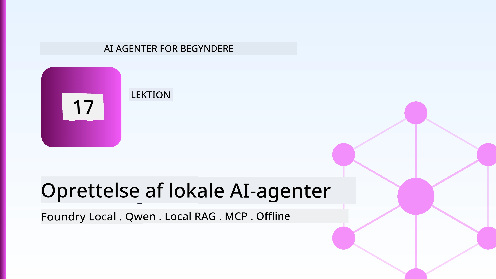
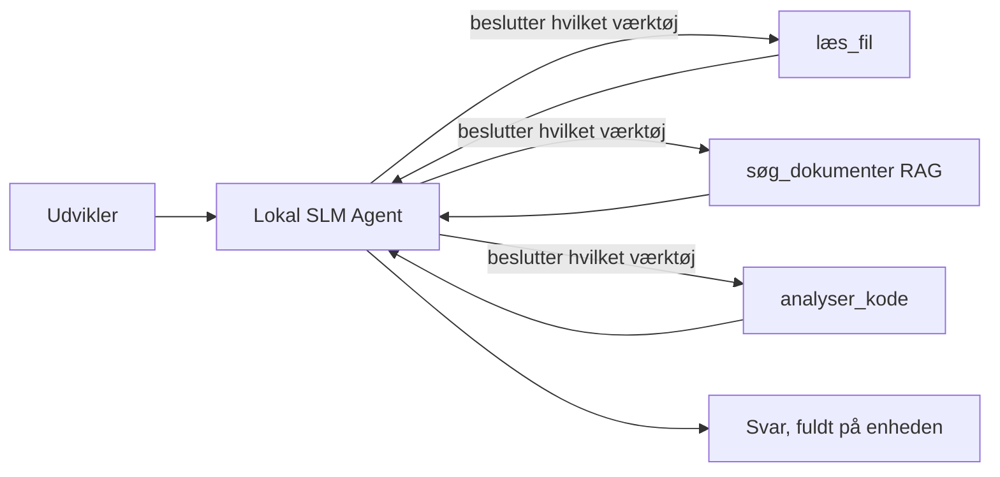
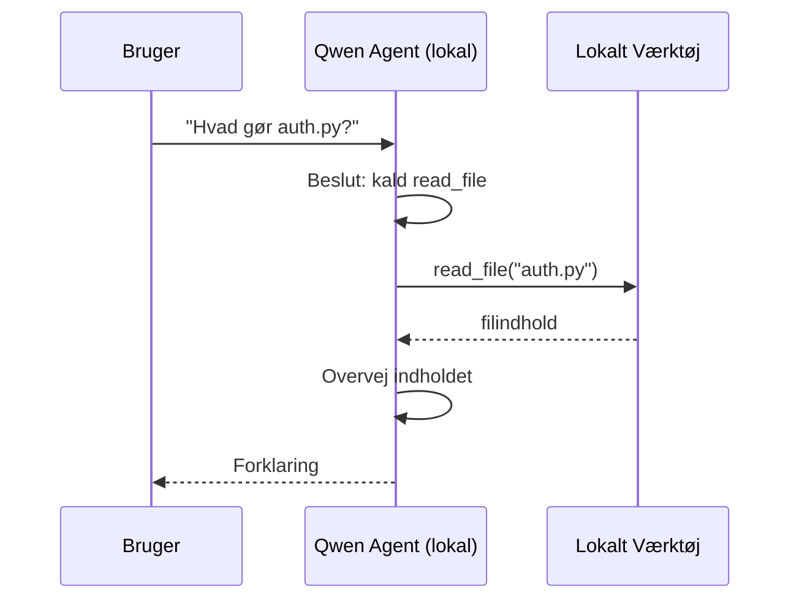
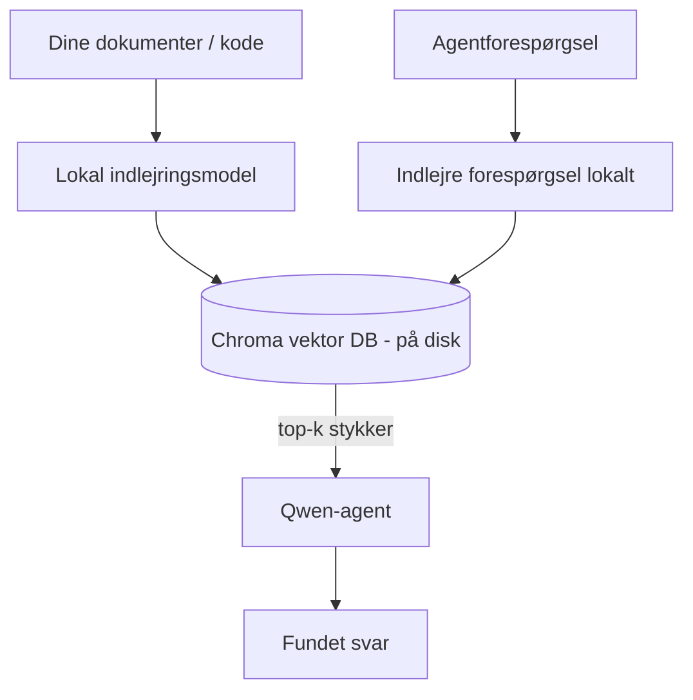
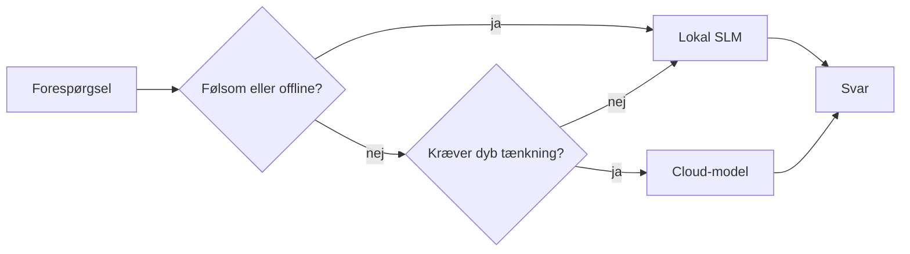

# Oprettelse af lokale AI-agenter ved brug af Microsoft Foundry Local og Qwen



Den foregående lektion skalerede agenter *op* til skyen. Denne bringer dem *ned* på en enkelt maskine. Til slut vil du have en fungerende ingeniørassistent, der kan ræsonnere, kalde værktøjer, læse dine filer og søge i din dokumentation — **uden en eneste cloud inference-forespørgsel.**

Hvorfor skulle du ønske det? Tre grunde, der konstant dukker op i ægte ingeniørarbejde:

- **Privatliv.** Koden og dokumenterne forlader aldrig maskinen. Ingen prompt, intet uddrag, ingen kundedata krydser netværksgrænsen.
- **Omkostninger.** Lokal inference har ingen pris pr. token. Du kan iterere hele dagen for elprisen.
- **Offline.** På et fly, i en sikker facilitet eller under et nedbrud fungerer agenten stadig.

Fangsten er, at du bytter en frontlinje cloud-model for en **Small Language Model (SLM)**, der kører på din CPU, GPU eller NPU. Denne lektion handler om at bygge agenter, der er *gode* inden for den begrænsning, frem for at lade som om begrænsningen ikke findes.

## Introduktion

Denne lektion dækker:

- **Small Language Models (SLMs)** — hvad de er, hvor de er gode, og hvor de ikke er.
- **Microsoft Foundry Local** — et runtime-miljø, der downloader og server modeller på enheden gennem en **OpenAI-kompatibel API**.
- **Qwen funktionkald-modeller** — SLM'er, der pålideligt producerer værktøjskald, hvilket muliggør lokale *agenter* (ikke kun lokal chat).
- **Lokale værktøjer, lokal RAG og lokal MCP** — giver agenten kapabilitet uden skyen.
- **Hybrid mønstre** — hvornår man skal holde ting lokalt, og hvornår man skal række ud mod skyen.

## Læringsmål

Efter at have gennemført denne lektion, vil du kunne:

- Forklare kompromiser ved SLM'er og vælge passende anvendelsestilfælde for lokale agenter.
- Servere en Qwen-model lokalt med Foundry Local og forbinde til den gennem OpenAI-kompatibelt endepunkt.
- Bygge en værktøjskaldende agent, der kører fuldstændigt på din arbejdsstation.
- Tilføje lokal RAG over dine egne dokumenter ved hjælp af en lokal vektordatabase (Chroma).
- Forbinde agenten til en lokal MCP-server og ræsonnere om hybride lokale/cloud designs.

## Forudsætninger

Denne lektion forudsætter, at du har gennemført de tidligere lektioner og er fortrolig med:

- [Værktøjsbrug](../04-tool-use/README.md) (Lektion 4) og [Agentic RAG](../05-agentic-rag/README.md) (Lektion 5).
- [Agentic Protocols / MCP](../11-agentic-protocols/README.md) (Lektion 11).
- [Microsoft Agent Framework](../14-microsoft-agent-framework/README.md) (Lektion 14).

Du får også brug for:

- En udviklingsarbejdsstation. **8 GB RAM er et realistisk minimum**; 16 GB+ er behageligt. En GPU eller NPU hjælper, men er ikke påkrævet.
- **Microsoft Foundry Local** installeret (se installationsafsnittet nedenfor).
- Python 3.12+ og pakkerne i repository'en [`requirements.txt`](../../../requirements.txt), plus `foundry-local-sdk`, `openai`, og `chromadb` til denne lektion.

## Small Language Models: Det rette værktøj til lokalt arbejde

En frontlinje cloud-model har hundredvis af milliarder parametre og et datacenter bag sig. En SLM har få milliarder parametre og skal kunne være i din laptops RAM. Den forskel sætter klare forventninger.

**SLM'er er gode til:**

- Strukturerede, afgrænsede opgaver — klassificering, udtræk, opsummering af et kendt dokument.
- **Værktøjskald** — beslutning om hvilket funktionkald der skal foretages og med hvilke argumenter.
- Hurtig, billig og privat iteration på dine egne data.

**SLM'er er svagere til:**

- Åbent slut, multi-hop ræsonnering over stort kontekst.
- Bred verdensviden (de har set mindre og glemmer mere).

Den vindende strategi for lokale agenter er derfor: **lad SLM'en orkestrere, og lad værktøjer gøre det tunge arbejde.** Modellen behøver ikke at *kende* din kodebase — den skal vide, hvornår den skal kalde `read_file` og `search_docs`. Det spiller direkte til SLM'ens styrker.



## Microsoft Foundry Local

**Microsoft Foundry Local** er et letvægts runtime-miljø, der downloader, administrerer og server modeller helt på din maskine. Dets vigtigste funktion for os er, at det eksponerer et **OpenAI-kompatibelt HTTP-endpoint** — hvilket betyder, at OpenAI SDK’en og Microsoft Agent Frameworks OpenAI-klient arbejder mod det med kun en ændring af `base_url`. Alt, hvad du har lært om at bygge agenter, overføres direkte; kun endpoint flytter fra skyen til `localhost`.

Foundry Local vælger også automatisk den bedste build af en model til dit hardware — en CPU-build, en CUDA/GPU-build eller en NPU-build — så du ikke selv skal optimere per maskine.

### Installation

Installer Foundry Local (se [dokumentationen](https://learn.microsoft.com/azure/ai-foundry/foundry-local/) for dit operativsystem), og bekræft, at det virker:

```bash
# Installer (eksempel; følg dokumentationen for din platform)
winget install Microsoft.FoundryLocal      # Windows
# brew install microsoft/foundrylocal/foundrylocal   # macOS

# Download og kør en Qwen-model, og start derefter den lokale tjeneste
foundry model run qwen2.5-7b-instruct
foundry service status
```

Når tjenesten kører, har du et lokalt, OpenAI-kompatibelt endpoint (typisk `http://localhost:PORT/v1`). Notebook’en bruger `foundry-local-sdk` til automatisk at finde endpointet, så du slipper for at hardkode porten.

## Qwen Funktionkald: Hvorfor det er vigtigt

En agent er kun en agent, hvis den kan kalde værktøjer. Mange SLM'er kan chatte, men producerer upålidelige, fejlformede værktøjskald. **Qwen** modeller er trænet til funktionkald og udsender konsekvent velformede værktøjskaldsstrukturer — hvilket præcis er det, der gør en lokal chatmodel til en lokal *agent*.

Flowet er den standard værktøjskald-loop, du allerede kender, blot kørende på enheden:



## Lokal RAG

Dokumentationssøgning er, hvor lokale agenter tjener deres værd. I stedet for at håbe på, at SLM’en har memoreret din frameworks dokumenter, embedder du de dokumenter i en **lokal vektordatabase** og lader agenten hente de relevante uddrag efter behov.

Vi bruger **Chroma**, et embedded vektor-database, der kører i-process uden server at administrere. Pipen er helt lokal: lokal embeddingsmodel → lokale vektorer → lokal hentning → lokal SLM.



Dette er det samme Agentic RAG-mønster fra Lektion 5 — den eneste ændring er, at alle komponenter kører på din maskine.

## Lokale MCP-servere

[MCP](../11-agentic-protocols/README.md) er et transportsystem, ikke en cloud-tjeneste. En MCP-server kan køre som en lokal proces på `stdio`, og eksponere værktøjer til din agent over den standard protokol. Dette lader dig genbruge det voksende økosystem af MCP-servere — filsystemadgang, git-operationer, databaseforespørgsler — helt offline.

Sikkerhedsindstillingen er forskellig fra skyen, men ikke fraværende: en lokal MCP-server kører stadig under din brugers tilladelser, så afgræns hvad den kan tilgå (et projektmappe med adgang, ikke hele din hjemmemappe) og behandl dens output som inputs, der skal valideres.

## Hybride cloud-og-lokal mønstre

Lokal-først betyder ikke kun lokal. Modne systemer router efter følsomhed og sværhedsgrad:

| Situation | Hvor det kører |
| --- | --- |
| Følsom kode/data, eller offline | **Lokal SLM** |
| Enkel, afgrænset opgave | **Lokal SLM** (billig, hurtig) |
| Svær multi-hop ræsonnering på ikke-følsomme data | **Cloud-model** |
| Alt under et nedbrud | **Lokal SLM** (graciøs forringelse) |

Dette afspejler ideen om **modelrouting** fra Lektion 16 — bortset fra, at en af "modellerne" nu er din egen maskine. Et robust design falder tilbage til lokalt, når skyen ikke er tilgængelig, så agenten degraderer i kvalitet i stedet for at fejle helt.



## Praktisk øvelse: En lokal ingeniørassistent

Åbn [`code_samples/17-local-agent-foundry-local.ipynb`](./code_samples/17-local-agent-foundry-local.ipynb) og arbejd dig igennem den. Du vil bygge en **lokal ingeniørassistent**, der kører fuldstændigt på din arbejdsstation og kan:

1. **Kalde værktøjer** — via Qwen funktionkald gennem Foundry Local.
2. **Udføre lokale filoperationer** — liste og læse filer i en projektmappe.
3. **Analysere kode** — rapportere grundlæggende målinger på en kildefil.
4. **Søge i dokumentation** — lokal RAG over en docs-mappe med Chroma.
5. **Bruge MCP** — forbinde til en lokal MCP-server (med en smidig spring-over, hvis ingen er konfigureret).

Der bruges ikke cloud inference på noget tidspunkt.

### Gennemgang

Assistenten forbinder til Foundry Local gennem det OpenAI-kompatible endpoint, så agentkoden ser næsten identisk ud med cloud-lektionerne — kun klienten ændres:

```python
from foundry_local import FoundryLocalManager
from openai import OpenAI

# Foundry Local opdager/downloads modellen og giver os et lokalt endepunkt.
manager = FoundryLocalManager(\"qwen2.5-7b-instruct\")
client = OpenAI(base_url=manager.endpoint, api_key=manager.api_key)  # api_key er en lokal pladsholder
```

Værktøjerne er almindelige Python-funktioner, scope'et til en projektmappe:

```python
def read_file(path: str) -> str:
    \"\"\"Read a file, but only inside the sandboxed project directory.\"\"\"
    full = (PROJECT_ROOT / path).resolve()
    if PROJECT_ROOT not in full.parents and full != PROJECT_ROOT:
        return \"Access denied: path is outside the project directory.\"
    return full.read_text(encoding=\"utf-8\")
```

Bemærk sandkasse-kontrollen — selv lokalt er et værktøj, der læser vilkårlige stier, en risiko. Notebook’en holder hvert værktøj scoped til et enkelt projekts rodmappe.

## Videnscheck

Test din viden inden du fortsætter til opgaven.

**1. Giv to konkrete grunde til at køre en agent lokalt frem for i skyen.**

<details>
<summary>Svar</summary>

Enhver to af: **privatliv** (kode og data forlader aldrig maskinen), **omkostninger** (ingen pris pr. token på inference), og **offline kapabilitet** (virker uden netværk — på et fly, i en sikker facilitet, eller under nedbrud). Regulatoriske/overholdelseskrav, der forbyder at sende data ud af enheden, er en almindelig årsag til privatlivsårsagen.
</details>

**2. Hvad er den anbefalede arbejdsdeling mellem en SLM og dens værktøjer i en lokal agent, og hvorfor?**

<details>
<summary>Svar</summary>

Lad SLM'en **orkestrere** (beslutte hvilket værktøj der skal kaldes og med hvilke argumenter) og lad **værktøjerne gøre det tunge arbejde** (læse filer, hente dokumenter, udregne resultater). SLM'er er stærke til afgrænsede beslutninger som valg af værktøj, men svagere til bred viden og lang multi-hop ræsonnering, så at lene sig på værktøjer spiller til deres styrker.
</details>

**3. Hvad gør det muligt at genbruge cloud-agent kode med Foundry Local?**

<details>
<summary>Svar</summary>

Foundry Local eksponerer et **OpenAI-kompatibelt HTTP-endpoint**. OpenAI SDK'en og Agent Framework's OpenAI-klient arbejder mod det ved kun at ændre `base_url` (og bruge en lokal placeholder API-nøgle). Alt andet i agentkoden forbliver det samme.
</details>

**4. Hvorfor bruger vi specifikt en Qwen funktionkaldsmodel frem for en hvilken som helst SLM?**

<details>
<summary>Svar</summary>

Fordi en agent må producere pålidelige, velformede **værktøjskald**. Mange SLM’er kan chatte, men udsender fejlformede eller inkonsistente værktøjskaldestrukturer. Qwen modeller er trænet til funktionkald og producerer konsekvente værktøjskald, hvilket gør en lokal chatmodel til en fungerende lokal agent.
</details>

**5. I den lokale RAG-pipeline, hvilke komponenter kører på maskinen?**

<details>
<summary>Svar</summary>

Alle af dem: embeddingsmodellen, vektordatabasen (Chroma, på disk), hentningstrinnet og SLM. Dokumenter embeddes lokalt, lagres lokalt, hentes lokalt og ræsonneres over af en lokal model — ingen komponent berører skyen.
</details>

**6. En lokal MCP-server kører på din maskine. Gør det den automatisk sikker? Hvilken forsigtighed bør du stadig tage?**

<details>
<summary>Svar</summary>

Nej. En lokal MCP-server kører med din brugers tilladelser, så den kan tilgå alt, du kan. Afgræns den til hvad den behøver (for eksempel en enkelt projektmappe frem for hele din hjemmemappe) og behandle dens output som inputs, der skal valideres, før du handler på dem.
</details>

**7. Beskriv en fornuftig hybrid routing-regel, der inkluderer en lokal model.**

<details>
<summary>Svar</summary>

Router følsomme eller offline-forespørgsler til den lokale SLM; router simple afgrænsede opgaver til den lokale SLM for hastighed og omkostning; router svær multi-hop ræsonnering på ikke-følsomme data til en cloud-model; og falder tilbage til den lokale SLM, hvis skyen ikke er tilgængelig, så agenten degraderer graciøst i stedet for at fejle. Dette er modelrouting (Lektion 16) med den lokale maskine som en af modellerne.
</details>

**8. Hvad er et realistisk minimum RAM-tal for at køre den lokale agent i denne lektion, og hvad får du ud af mere RAM?**

<details>
<summary>Svar</summary>

Omkring **8 GB** er et realistisk minimum; 16 GB+ er behageligt. Mere RAM lader dig køre større, mere kapable modeller og bevare mere kontekst i hukommelsen. En GPU eller NPU fremskynder inference, men er ikke påkrævet — Foundry Local vælger en CPU-build, når ingen accelerator er tilgængelig.
</details>

## Opgave

Udvid den lokale ingeniørassistent til en **lokal dokumentationsanmelder** for et lille projekt efter eget valg (brug gerne en af denne repo’s lektionsmapper).

Din aflevering bør:

1. **Indeksere en reel docs-/kodemappe** i Chroma (mindst fem filer).
2. **Tilføje et `find_todos` værktøj**, der scanner projektet for `TODO`/`FIXME` kommentarer og returnerer dem med fil og linjenummer — med samme sandbox-kontrol som `read_file`.

3. **Stil agenten tre spørgsmål** der tvinger den til at kombinere værktøjer: et rent RAG-spørgsmål, et der kræver at læse en specifik fil, og et der kræver at finde TODOs.
4. **Mål det**: tid hver af de tre svar og noter dem i en markdown-celle. Kommenter på, om latenstiden er acceptabel for din tiltænkte arbejdsgang.

Skriv derefter et kort afsnit om **hvad du ville flytte til skyen, og hvad du ville beholde lokalt** for denne anmelder, og hvorfor. Du bliver vurderet på, om de lokale komponenter er korrekt forbundet, og om din hybride ræsonnering er sund — ikke på modelkvaliteten.

## Resumé

I denne lektion byggede du en agent, der kører helt på din egen maskine:

- **SLM'er** bytter bredde ud med privatliv, omkostninger og offline-drift — og skinner, når de **orkestrerer værktøjer** i stedet for at have al viden selv.
- **Foundry Local** server modeller på enheden bag et **OpenAI-kompatibelt endepunkt**, så din cloud-agentkode kan overføres med en linjes ændring.
- **Qwen funktionskaldsmodeller** gør pålidelig lokal kald af værktøjer — og dermed lokale *agenter* — muligt.
- **Lokal RAG** (Chroma) og **lokal MCP** giver agenten kapabilitet uden at forlade maskinen.
- **Hybride mønstre** lader dig rute efter følsomhed og sværhedsgrad, med lokalt som en elegant fallback.

Dette fuldender udrulningsbogen: Lektion 16 skalerede agenter op i Microsoft Foundry, og denne lektion skalerede dem ned til en enkelt arbejdsstation. Næste lektion handler om at holde udrullede agenter sikre.

## Yderligere ressourcer

- <a href="https://learn.microsoft.com/azure/ai-foundry/foundry-local/" target="_blank">Microsoft Foundry Local dokumentation</a>
- <a href="https://learn.microsoft.com/azure/ai-foundry/what-is-azure-ai-foundry" target="_blank">Microsoft Foundry dokumentation</a>
- <a href="https://aka.ms/ai-agents-beginners/agent-framework" target="_blank">Microsoft Agent Framework</a>
- <a href="https://qwen.readthedocs.io/en/latest/framework/function_call.html" target="_blank">Qwen funktionskald dokumentation</a>
- <a href="https://modelcontextprotocol.io/" target="_blank">Model Context Protocol (MCP)</a>
- <a href="https://docs.trychroma.com/" target="_blank">Chroma vektordatabase</a>

## Forrige lektion

[Deploying Scalable Agents](../16-deploying-scalable-agents/README.md)

## Næste lektion

[Securing AI Agents](../18-securing-ai-agents/README.md)

---

<!-- CO-OP TRANSLATOR DISCLAIMER START -->
**Ansvarsfraskrivelse**:
Dette dokument er blevet oversat ved hjælp af AI-oversættelsestjenesten [Co-op Translator](https://github.com/Azure/co-op-translator). Selvom vi bestræber os på nøjagtighed, skal du være opmærksom på, at automatiserede oversættelser kan indeholde fejl eller unøjagtigheder. Det originale dokument på dets oprindelige sprog bør betragtes som den autoritative kilde. For kritisk information anbefales professionel menneskelig oversættelse. Vi påtager os intet ansvar for misforståelser eller fejltolkninger, der opstår som følge af brugen af denne oversættelse.
<!-- CO-OP TRANSLATOR DISCLAIMER END -->