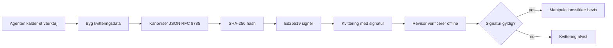
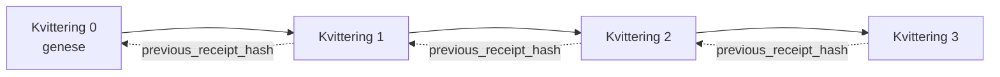

[Se lektionens video: Sikring af AI-agenter med kryptografiske kvitteringer](https://youtu.be/PLACEHOLDER_VIDEO_ID)

> _(Lektionsvideo og thumbnail tilføjes af Microsoft-indholdsteamet efter sammenfletning, i overensstemmelse med lektion 14 / 15 mønsteret.)_

# Sikring af AI-agenter med kryptografiske kvitteringer

## Introduktion

Denne lektion vil dække:

- Hvorfor revisionsspor for AI-agenter er vigtige for overholdelse, fejlfinding og tillid.
- Hvad en kryptografisk kvittering er, og hvordan den adskiller sig fra en usigneret loglinje.
- Hvordan man producerer en signeret kvittering for et agents værktøjskald i almindelig Python.
- Hvordan man verificerer en kvittering offline og opdager manipulation.
- Hvordan man kæder kvitteringer, så fjernelse eller omrokering af én bryder kæden.
- Hvad kvitteringer beviser, og hvad de eksplicit ikke beviser.

## Læringsmål

Efter at have gennemført denne lektion vil du vide, hvordan du:

- Identificerer fejlsituationer, der motiverer kryptografisk oprindelse for agents handlinger.
- Producerer en Ed25519-signeret kvittering over en kanonisk JSON-payload.
- Verificerer en kvittering uafhængigt ved kun at bruge signatørens offentlige nøgle.
- Opdager manipulation ved at køre verifikation igen på en ændret kvittering.
- Bygger en hash-kædet sekvens af kvitteringer og forklarer, hvorfor kæden er vigtig.
- Genkender grænsen mellem hvad kvitteringer beviser (attribution, integritet, rækkefølge) og hvad de ikke beviser (korekthed af handlingen, holdbarhed af politikken).

## Problemet: Dit agents revisionsspor

Forestil dig, at du har implementeret en AI-agent for Contoso Travel. Agenten læser kunders forespørgsler, kalder en fly-API for at finde muligheder og booker sæder på kundens vegne. I sidste kvartal behandlede agenten 50.000 bookinger.

I dag ankommer en revisor. De stiller et simpelt spørgsmål: "Vis mig, hvad din agent gjorde."

Du overleverer dine logfiler. Revisoren ser på dem og stiller det sværere spørgsmål: "Hvordan ved jeg, at disse logs ikke er blevet redigeret?"

Dette er problemet med revisionssporet. De fleste agent-implementeringer i dag stoler på:

- **Applikationslogs**: skrevet af agenten selv, kan redigeres af enhver med adgang til filsystemet.
- **Cloud logging-tjenester**: manipulationssikret på platformniveau, men kun hvis revisoren stoler på platformoperatøren.
- **Databasetransaktionslogs**: velegnede til databaseændringer, men ikke til vilkårlige værktøjskald.

Ingen af disse kan besvare revisorens spørgsmål uden at kræve, at revisoren stoler på nogen (dig, din cloud-udbyder, din databaseleverandør). Til intern brug er den tillid ofte acceptabel. For regulerede arbejdsbelastninger (finans, sundhedsvæsen, alt underlagt EU's AI-lov) er det ikke.

Kryptografiske kvitteringer løser dette ved at gøre hver agents handling uafhængigt verificerbar. Revisoren behøver ikke at stole på dig. De behøver kun din offentlige nøgle og selve kvitteringen.

## Hvad er en kryptografisk kvittering?

En kvittering er et JSON-objekt, der registrerer, hvad en agent gjorde, signeret med en digital signatur.



En minimal kvittering ser sådan ud:

```json
{
  "type": "agent.tool_call.v1",
  "agent_id": "contoso-travel-bot",
  "tool_name": "lookup_flights",
  "tool_args_hash": "sha256:a3f9c1...",
  "result_hash": "sha256:7b2e1d...",
  "policy_id": "contoso-travel-policy-v3",
  "timestamp": "2026-04-25T14:30:00Z",
  "sequence": 47,
  "previous_receipt_hash": "sha256:9d4e6a...",
  "signature": {
    "alg": "EdDSA",
    "sig": "c5af83...",
    "public_key": "8f3b2c..."
  }
}
```

Tre egenskaber udfører arbejdet:

1. **Signaturen**. Kvitteringen signeres af agentens gateway med en Ed25519-privatnøgle. Enhver med den tilhørende offentlige nøgle kan verificere signaturen offline. Manipulation af et hvilket som helst felt ugyldiggør signaturen.

2. **Kanonisk kodning**. Før underskrivelse serialiseres kvitteringen ved brug af JSON Canonicalization Scheme (JCS, RFC 8785). Det sikrer, at to implementeringer, der producerer den samme logiske kvittering, producerer byte-identisk output. Uden kanonisering ville forskellige JSON-serialisatorer producere forskellige signaturer for det samme indhold.

3. **Hash-kædning**. Feltet `previous_receipt_hash` linker hver kvittering til den forrige. Fjernelse eller omrokering af en kvittering bryder hver efterfølgende kvittering. Manipulation bliver synlig på kædeniveau, selv hvis enkelte signaturer omgås.

Sammen giver disse egenskaber tre garantier:

- **Attribution**: denne nøgle signerede dette indhold.
- **Integritet**: indholdet har ikke ændret sig siden underskrivelse.
- **Rækkefølge**: denne kvittering kom efter den kvittering i kæden.

## Produktion af en kvittering i Python

Du behøver ikke et specielt bibliotek for at producere en kvittering. De kryptografiske primitive er bredt tilgængelige, og logikken fylder få dusin linjer Python.

De praktiske øvelser i `code_samples/18-signed-receipts.ipynb` gennemgår hele flowet. Her er opsummeringen:

```python
import json
import hashlib
import base64
from nacl import signing
from jcs import canonicalize  # RFC 8785 kanonisk JSON

def b64url_nopad(data: bytes) -> str:
    return base64.urlsafe_b64encode(data).decode("ascii").rstrip("=")

def sha256_canonical(obj) -> str:
    """SHA-256 of a Python object's JCS-canonical JSON form."""
    return f"sha256:{hashlib.sha256(canonicalize(obj)).hexdigest()}"

# Generér eller indlæs en signeringsnøgle (i produktion, gem i en nøgleboks)
signing_key = signing.SigningKey.generate()
verify_key = signing_key.verify_key

# Byg kvitteringsindholdet (ingen signatur endnu)
tool_args = {"origin": "SYD", "destination": "LAX"}
tool_result = [{"flight": "QF11", "price": 1850, "stops": 0}]

payload = {
    "type": "agent.tool_call.v1",
    "agent_id": "contoso-travel-bot",
    "tool_name": "lookup_flights",
    "tool_args_hash": sha256_canonical(tool_args),
    "result_hash": sha256_canonical(tool_result),
    "policy_id": "contoso-travel-policy-v3",
    "timestamp": "2026-04-25T14:30:00Z",
    "sequence": 0,
    "previous_receipt_hash": None,
}

# Kanoniser, hash, signer.
canonical_bytes = canonicalize(payload)
message_hash = hashlib.sha256(canonical_bytes).digest()
signature_bytes = signing_key.sign(message_hash).signature

# Vedhæft et struktureret signaturobjekt.
receipt = {
    **payload,
    "signature": {
        "alg": "EdDSA",
        "sig": b64url_nopad(signature_bytes),
        "public_key": b64url_nopad(bytes(verify_key)),
    },
}
```

Det er hele underskrivningspipelinjen. Øvelserne i notebogen gennemgår hvert trin.

## Verificering af en kvittering og opdagelse af manipulation

Verifikation er den inverse operation:

```python
import base64
import hashlib
from nacl import signing
from nacl.exceptions import BadSignatureError
from jcs import canonicalize

def b64url_decode(s: str) -> bytes:
    padding = "=" * ((4 - len(s) % 4) % 4)
    return base64.urlsafe_b64decode(s + padding)

def verify_receipt(receipt: dict) -> bool:
    # Signaturen er et struktureret objekt: {"alg", "sig", "public_key"}.
    sig_obj = receipt.get("signature")
    if not sig_obj or sig_obj.get("alg") != "EdDSA":
        return False

    # Genskab den nyttelast, der faktisk blev signeret (alt undtagen signaturen).
    payload = {k: v for k, v in receipt.items() if k != "signature"}

    canonical_bytes = canonicalize(payload)
    message_hash = hashlib.sha256(canonical_bytes).digest()

    try:
        verify_key = signing.VerifyKey(b64url_decode(sig_obj["public_key"]))
        verify_key.verify(message_hash, b64url_decode(sig_obj["sig"]))
        return True
    except BadSignatureError:
        return False
```

Denne funktion tager en kvittering og returnerer `True` hvis signaturen er gyldig, `False` ellers. Ingen netværkskald, ingen serviceafhængighed, ingen tillid nødvendig til tredjepart.

For at se manipulation opdages i praksis gennemgår notebogen:

1. Produktion af en gyldig kvittering og bekræftelse af verifikation.
2. Ændring af en byte i feltet `tool_args_hash`.
3. Kør verifikation igen og se at den fejler.

Dette er den praktiske demonstration af, at kvitteringer er manipulationssikre: enhver ændring, hvor lille den end er, bryder signaturen.

## Kædning af kvitteringer for flertrinsagenter

En enkelt signeret kvittering beskytter en handling. En kæde af kvitteringer beskytter en sekvens.



Hver kvittering registrerer hashen af den forrige kvittering. For at fjerne kvittering 2 stille og roligt, skulle en angriber enten:

- Ændre kvittering 3's felt `previous_receipt_hash` (ødelægger kvittering 3's signatur), ELLER
- Forfalske en ny signatur på en ændret kvittering 3 (kræver agentens private nøgle).

Hvis den private nøgle er i en hardware key vault, og du offentliggør den offentlige nøgle med hver kvittering, er ingen af angrebene mulige uden opdagelse.

Notebogen gennemgår:

1. Konstruktion af en kæde af tre kvitteringer.
2. Verificering af at hver kvitterings `previous_receipt_hash` matcher den faktiske hash af den forrige kvittering.
3. Manipulation med en kvittering midt i kæden og observation af kædens brud præcis der.

Sådan producerer du et revisionsspor, som en ekstern revisor kan verificere uden at skulle stole på dig.

## Hvad kvitteringer beviser (og hvad de ikke beviser)

Dette er det vigtigste afsnit i denne lektion. Kvitteringer er kraftfulde, men deres magt er begrænset.

**Kvitteringer beviser tre ting:**

1. **Attribution**: en specifik nøgle signerede en specifik payload.
2. **Integritet**: payload’en har ikke ændret sig siden underskrivelse.
3. **Rækkefølge**: denne kvittering kom efter den kvittering i hashkæden.

**Kvitteringer beviser IKKE:**

1. **Korrekthed**: at agentens handling var den korrekte handling. En kvittering kan signeres for et forkert svar lige så nemt som for et rigtigt svar.
2. **Politikovertredelsesfrihed**: at politikken refereret i `policy_id` faktisk blev evalueret, eller at den ville have godkendt denne handling, hvis tjekket. Kvitteringen registrerer hvad der blev påstået, ikke hvad der blev håndhævet.
3. **Identitet ud over nøglen**: kvitteringen siger "denne nøgle signerede dette indhold." Den siger ikke "et menneske godkendte dette." At koble en nøgle til en person eller organisation kræver separat identitetsinfrastruktur (et katalog, et offentligt nøgleregister osv.).
4. **Sandfærdighed af input**: hvis agenten modtager en manipuleret prompt og handler på den, registrerer kvitteringen handlingen nøjagtigt. Kvitteringer er downstream af inputvalidering, ikke en erstatning for den.

Denne grænse er vigtig af to grunde:

- Den fortæller dig, hvad kvitteringer er nyttige til: at gøre agenters adfærd revisionsbar og manipulationssikker, også på tværs af organisatoriske grænser.
- Den fortæller dig, hvilke yderligere lag du stadig har brug for: inputvalidering (Lektion 6), håndhævelse af politik (kort berørt nedenfor) og identitetsinfrastruktur (udenfor denne lektions omfang).

En almindelig fejl er at antage, at "vi har kvitteringer" betyder "vi er styret." Det gør det ikke. Kvitteringer er en grundsten. Styring er det system, du bygger ovenpå.

## Bevis for, at et menneske godkendte den præcise handling

Punkt 3 ovenfor fortjener sit eget afsnit: en handlingskvittering siger "denne nøgle signerede dette indhold," aldrig "et menneske godkendte dette." For handlinger med høj risiko (refunderinger, sletninger, pengeoverførsler) kræver styringsrammer i stigende grad præcis denne manglende erklæring, og den kan produceres med de samme primitive værktøjer, du allerede byggede i denne lektion.

Følge-notebooken `code_samples/human-authorization-receipts.ipynb` tilføjer en anden type kvittering, `human.approval.v1`, i samme konvolutform som lektionens kvitteringer (en typet payload signeret med Ed25519 over dens kanoniske SHA-256, med `signature` objektet uden for de signerede bytes). En navngivet godkender signerer **den fulde kanoniske handling og dens digest** før udførelse; agentens handlingskvittering bærer den **samme handle-digest** og en `parent_approval_ref`, `receipt_hash` for godkendelsen, samme konvention som `previous_receipt_hash` i den kæde, du byggede ovenfor. Én `verify_chain` behandler begge artefakter under **separate pinned nøgleregistre** (godkendernøgler vs agentnøgler), så kodevejen er delt, men myndighederne aldrig er.

Den egenskab, dette sikrer, formuleret omhyggeligt: *mennesket godkendte denne præcise handling, og agenten udførte nøjagtig den godkendte handling.* Notebooks afvisningssinstitutioner er hvad der gør egenskaben virkelig snarere end påstået:

- det klassiske sæt: manipulation, forvirret stedfortræder, genafspilning, forfalskede nøgler på begge sider, fejlformateret input;
- **forældet myndighed**: en signatur, der stadig verificeres, nægtet alligevel, fordi politikversionen flyttede, godkendernøglen blev roteret ud af det pinned register, eller godkendelsen udløb før udførelse;
- **digest-substitution**: en gyldigt signeret handlingskvittering, der peger på en *ægte* godkendelse, som binder en *anderledes* kanonisk handling.

Hver fejl nægter med en distinct grund, så en revisor, der læser en afvisning, kan se, om myndighed blev forældet eller om den udførte handling ændrede sig. Reglen, notebooken lærer: en signeret godkendelse er ikke myndighed i sig selv. Myndighed eksisterer kun, hvis begge kvitteringer stadig binder til den samme kanoniske handling ved udførelsestidspunktet. Co-signaturvejen i det samme Internet-Draft, denne lektion følger (`draft-farley-acta-signed-receipts`), er den standardspor-form af dette mønster.

## Produktionsreferencer

Python-koden i denne lektion er bevidst minimal, så du kan læse hver linje og forstå præcis, hvad der sker. I produktion har du to muligheder:

1. **Byg direkte på de kryptografiske primitive.** De 50 linjer, du så ovenfor, er tilstrækkelige til mange anvendelser. PyNaCl (Ed25519) og `jcs`-pakken (kanonisk JSON) er velvedligeholdte og reviderede biblioteker.

2. **Brug et produktions-bibliotek til kvitteringer.** Flere open source-projekter implementerer samme mønster med ekstra funktioner (nøgle-rotation, batch-verifikation, JWK Set-distribution, integration med politikmotorer):
   - Kvitteringsformatet brugt i denne lektion følger et IETF Internet-Draft ([`draft-farley-acta-signed-receipts`](https://datatracker.ietf.org/doc/draft-farley-acta-signed-receipts/), revision 02) som aktuelt er i standardiseringsprocessen, med en delt konformitetssuite ([agent-governance-testvectors](https://github.com/ScopeBlind/agent-governance-testvectors)) som uafhængige implementeringer krydsverificerer mod for byte-identisk kanonisk output.
   - Microsoft Agent Governance Toolkit komponerer kvitteringer med Cedar-baserede politikbeslutninger; se Tutorial 33 i det lager for et eksempel fra start til slut.
   - `protect-mcp` (npm) og `@veritasacta/verify` (npm) pakkerne giver en Node-baseret implementering af kvitteringssignering og offline verifikation, beregnet til indpakning af enhver MCP-server med et manipulationssikkert revisionsspor, inklusive et hold-for-co-sign flow, hvor en pauset handling udsender en godkendelses-kvittering bundet til handledigesten (WebAuthn-understøttet i desktopflowet), samme godkendelses-kvitteringsmønster som human-autorisation-notebooken ovenfor.
   - **[nobulex](https://github.com/arian-gogani/nobulex)** Python SDK (`pip install nobulex`) leverer samme Ed25519 + JCS signaturmønster i Python med LangChain og CrewAI integrationer, inklusive offentliggjorte krydsvalideringstestvektorer og en overholdelseskortlægning bidraget via [OWASP PR #2210](https://github.com/OWASP/CheatSheetSeries/pull/2210).

Valget mellem selv at bygge og at bruge et bibliotek svarer til valget mellem at skrive dit eget JWT-bibliotek eller bruge et testet: begge er rimelige; biblioteket sparer tid og reducerer audit-areal; den fra-grunden tilgang tvinger dig til at forstå hver primitive. Denne lektion lærer fra-grunden-vejen, så du har grundlaget for begge valg.

## Test din viden

Test din forståelse, før du går videre til praksisøvelsen.

**1. En kvittering er signeret med agentens private Ed25519-nøgle. Revisoren har kun den offentlige nøgle. Kan revisoren verificere kvitteringen offline?**

<details>
<summary>Svar</summary>

Ja. Ed25519-verifikation kræver kun den offentlige nøgle og de signerede bytes. Intet netværkskald, ingen serviceafhængighed. Dette er den egenskab, der gør kvitteringer nyttige i luftklarede, multi-organisatoriske eller lavtillids revisionsmiljøer.
</details>

**2. En angriber ændrer feltet `policy_id` i en kvittering for at hævde, at den var underlagt en mere tilladende politik. Signaturen var over den oprindelige payload. Hvad sker der under verifikation?**

<details>
<summary>Svar</summary>


Verifikationen mislykkes. Signaturen blev beregnet over de kanoniske bytes af det oprindelige payload; ændring af et hvilket som helst felt ændrer de kanoniske bytes, hvilket ændrer SHA-256-hashen, hvilket gør signaturen ugyldig. Angriberen ville skulle have den private nøgle for at producere en frisk gyldig signatur, hvilket de ikke har.
</details>

**3. Hvorfor inkluderer kvitteringen en `tool_args_hash` og `result_hash` i stedet for de rå argumenter og resultat?**

<details>
<summary>Svar</summary>

To grunde. For det første kan kvitteringen være nødt til at blive arkiveret eller overført i miljøer, hvor lækage af det rå indhold (personlige oplysninger, forretningsdata) er problematisk. Hashing holder kvitteringen lille og indholdet privat; revisoren verificerer, at hashen matcher en separat opbevaret kopi af det faktiske indhold. For det andet har hasher en fast størrelse; en kvittering med hasher er begrænset i størrelse uanset hvor store input og output var.
</details>

**4. Feltet `previous_receipt_hash` forbinder hver kvittering til dens forgænger. Hvis en angriber stille sletter en kvittering midt i en kæde, hvad bliver så ugyldigt?**

<details>
<summary>Svar</summary>

Hver kvittering der kom efter den slettede. Deres `previous_receipt_hash` felter matcher ikke længere den faktiske kæde (fordi kvitteringen de refererede til ikke længere eksisterer, eller kæden nu peger på en anden forgænger). For at skjule sletningen skulle angriberen gensigne hver senere kvittering, hvilket kræver den private nøgle.
</details>

**5. En kvittering verificeres rent. Beviser det, at agentens handling var korrekt, valid eller i overensstemmelse med politikken?**

<details>
<summary>Svar</summary>

Nej. En gyldig kvittering beviser tre ting: tilskrivning (denne nøgle har signeret dette indhold), integritet (indholdet er ikke ændret), og rækkefølge (denne kvittering kom efter den pågældende kvittering). Det beviser IKKE, at handlingen var korrekt, at den i `policy_id` navngivne politik faktisk blev evalueret, eller at agenten fulgte alle regler. Kvitteringer gør agentens adfærd auditerbar, ikke nødvendigvis korrekt. Dette er den vigtigste grænse i lektionen.
</details>

## Praktisk øvelse

Åbn `code_samples/18-signed-receipts.ipynb` og gennemfør alle fire sektioner:

1. **Sektion 1**: Signer din første kvittering og verificer den.
2. **Sektion 2**: Manipuler kvitteringen og observer verifikationsfejl.
3. **Sektion 3**: Byg en tre-kvitterings-kæde og verificer kædens integritet.
4. **Sektion 4**: Anvend mønsteret på en agent bygget med Microsoft Agent Framework: omslut et værktøjsopkald med kvitterings-signering, og verificer derefter kvitteringen uafhængigt.

**Udvidelsesudfordring 1:** udvid kvitteringsskemaet med et yderligere felt efter dit valg (for eksempel en anmodnings-ID til sporing), opdater den kanoniske signeringslogik til at inkludere det, og bekræft at kvitteringen stadig kan verifieres gennem hele processen. Ændr derefter feltet efter signering og bekræft at verifikationen fejler. Dette tvinger dig til at forstå, hvordan hver byte af den kanoniske kodning bidrager til signaturen.

**Udvidelsesudfordring 2:** SHA-256-hash to af dine kvitteringer sammen (sammenkæd deres kanoniske bytes i en deterministisk rækkefølge) og indlejre den resulterende digest som et nyt felt på en tredje kvittering før signering. Verificer at alle tre kvitteringer stadig kan rundrejses. Du har lige bygget et enkelt-trin inklusionsbevis: enhver, der har den tredje kvittering, kan bevise at de første to eksisterede på det tidspunkt den blev signeret, uden at skulle afsløre deres indhold. Dette er mønsteret som selective-disclosure kvitteringer bruger i stor skala (Merkle-forpligtelser, RFC 6962).

## Konklusion

Kryptografiske kvitteringer giver AI-agenter et revisionsspor, der er:

- **Uafhængigt verificerbart**: enhver med den offentlige nøgle kan verificere, ingen tjenesteafhængighed.
- **Manipulationssynligt**: enhver ændring ugyldiggør signaturen.
- **Bærbart**: en kvittering er en lille JSON-fil; den kan arkiveres, overføres og verificeres hvor som helst.
- **Standardtilpasset**: bygget på Ed25519 (RFC 8032), JCS (RFC 8785), og SHA-256, alle vidt implementerede primitive.

De er ikke en erstatning for inputvalidering, håndhævelse af politik eller identitetsinfrastruktur. De er fundamentet for disse lag. Når du implementerer agenter i regulerede arbejdsbelastninger, tværorganisatoriske arbejdsgange eller enhver indstilling hvor en fremtidig revisor ikke kan antages at stole på dig, er kvitteringer måden hvorpå du gør revisionssporet ærligt.

Det vigtigste at tage med: kvitteringer beviser, hvem der sagde hvad og hvornår. De beviser ikke, at det sagte var sandt eller rigtigt. Hold det skel tæt. Det er forskellen mellem et ærligt provenienssystem og et vildledende.

## Produktionscheckliste

Når du er klar til at rykke videre fra denne lektion til at implementere kvitteringssignerende agenter i et rigtigt miljø:

- [ ] **Flyt signeringsnøglen væk fra udviklerens laptop.** Brug Azure Key Vault, AWS KMS eller en hardware-sikkerhedsmodul. Den private nøgle, der signerer dine kvitteringer, må aldrig ligge i kildekontrol eller i klartekst på applikationsmaskiner.
- [ ] **Publicer den offentlige verifikationsnøgle.** Revisorer har brug for den til offline verifikation. Den standardiserede praksis er et JWK Set på en velkendt URL (RFC 7517), f.eks. `https://your-org.example.com/.well-known/agent-keys.json`.
- [ ] **Forankr kæden eksternt.** Skriv med jævne mellemrum den seneste kædehoved-hash til en transparenslog (Sigstore Rekor, RFC 3161 tidsstempelmyndighed, eller et andet internt system), så en ekstern part kan bekræfte "denne kæde eksisterede på dette tidspunkt."
- [ ] **Opbevar kvitteringer uforanderligt.** Append-only blob storage (Azure Storage med uforanderlighedspolitikker, AWS S3 Object Lock) forhindrer en insider i at omskrive historikken på lagringslaget.
- [ ] **Beslut om opbevaringstid.** Mange compliance-regimer kræver opbevaring i flere år. Planlæg for vækst i kvitteringer (hver kvittering er ~500 bytes; en agent der laver 10.000 kald per dag producerer ~1,8 GB pr. år).
- [ ] **Dokumenter hvad kvitteringer ikke dækker.** Kvitteringer beviser tilskrivning, integritet og rækkefølge. Din køreplan bør eksplicit angive hvilke yderligere kontroller (inputvalidering, håndhævelse af politik, hastighedsbegrænsning, identitets-infrastruktur) der eksisterer sammen med kvitteringer i din styringsholdning.

### Har du flere spørgsmål om sikring af AI-agenter?

Deltag i [Microsoft Foundry Discord](https://aka.ms/ai-agents/discord) for at møde andre lærende, deltage i åben kontortid og få svar på dine spørgsmål om AI-agenter.

## Udover denne lektion

Denne lektion dækker enkelt-kvitteringssignering og hash-kædede sekvenser. De samme primitive byggekonstruktioner sammensætter flere mere avancerede mønstre, du kan støde på, efterhånden som din styringsholdning modnes:

- **Selective disclosure.** Når et kvitteringsfelt er uafhængigt forpligtet (RFC 6962-stil Merkle-træ), kan du afsløre specifikke felter til specifikke revisorer og bevise, at resten er uændret uden at eksponere dem. Brugbart når samme kvittering skal tilfredsstille både en omfattende revision (som ønsker komplethed) og dataminimeringsregler som GDPR (der ønsker, at revisor kun ser det nødvendige).
- **Kvitterings tilbagekaldelse.** Hvis en signeringsnøgle kompromitteres, skal du kunne markere alle kvitteringer signeret med den nøgle som utroværdige fra et bestemt tidspunkt og frem. Standardmønstre: korttidslevende signeringsnøgler plus en offentliggjort tilbagekaldelsesliste, eller en transparenslog med tilbagekaldelsesposter.
- **Bilaterale / split-signature kvitteringer.** Nogle implementeringer opdeler det signerede payload i før-eksekvering (`authorization_*`) og efter-eksekvering (`result_*`) halvdele med uafhængige signaturer, nyttigt når autorisationsbeslutningen og det observerede resultat produceres af forskellige aktører eller på forskellige tidspunkter. Dette bygger ovenpå kvitteringsformatet undervist i denne lektion.
- **Payloadsammensætning.** En kvittering forsegler de bytes, du sætter i `result_hash`. Payloads i virkeligheden er ofte rigere end et enkelt værktøjsopkalds resultat: beslutningsforberedelse (modelprediktion, overvejede muligheder, beviser og deres fuldstændighed, risikoposition, ansvarskæde, gate udfald) kan alle være indeholdt, forseglet af en enkelt kvittering. Dette holder kvitteringsformatet minimalt samtidig med at payloadskemaer kan udvikle sig domæne-for-domæne.
- **Konformitet på tværs af implementeringer.** Flere uafhængige implementeringer af samme kvitteringsformat (Python, TypeScript, Rust, Go) krydsverificerer mod delte testvektorer. Hvis du bygger din egen implementering, bekræfter validering mod offentliggjorte vektorer kompatibilitet på wire-niveau.
- **Post-kvantemigrering.** Ed25519 er bredt implementeret i dag, men er ikke kvante-resistent. Kvitteringsformatet er algoritme-agilt: `signature.alg` feltet kan bære `ML-DSA-65` (NIST post-kvantelig signaturstandard), når du har behov for migrering. Planlæg en overgangsperiode hvor kvitteringer er dualsignerede.

## Yderligere ressourcer

- <a href="https://datatracker.ietf.org/doc/draft-farley-acta-signed-receipts/" target="_blank">IETF Internet-Draft: Signed Decision Receipts for Machine-to-Machine Access Control</a>
- <a href="https://learn.microsoft.com/azure/ai-studio/responsible-use-of-ai-overview" target="_blank">Responsible AI overview (Azure AI)</a>
- <a href="https://datatracker.ietf.org/doc/html/rfc8032" target="_blank">RFC 8032: Edwards-Curve Digital Signature Algorithm (EdDSA)</a>
- <a href="https://datatracker.ietf.org/doc/html/rfc8785" target="_blank">RFC 8785: JSON Canonicalization Scheme (JCS)</a>
- <a href="https://datatracker.ietf.org/doc/html/rfc6962" target="_blank">RFC 6962: Certificate Transparency</a> (Merkle-træ konstruktion brugt af selective-disclosure kvitteringer)
- <a href="https://github.com/microsoft/agent-governance-toolkit/blob/main/docs/tutorials/33-offline-verifiable-receipts.md" target="_blank">Microsoft Agent Governance Toolkit, Tutorial 33: Offline-Verifiable Decision Receipts</a>
- <a href="https://github.com/ScopeBlind/agent-governance-testvectors" target="_blank">Cross-implementation conformance test vectors</a> for the receipt format used in this lesson (Apache-2.0)
- <a href="https://pynacl.readthedocs.io/" target="_blank">PyNaCl documentation</a> (Ed25519 i Python)

## Forrige lektion

[Oprettelse af lokale AI-agenter](../17-creating-local-ai-agents/README.md)

---

<!-- CO-OP TRANSLATOR DISCLAIMER START -->
**Ansvarsfraskrivelse**:
Dette dokument er blevet oversat ved hjælp af AI-oversættelsestjenesten [Co-op Translator](https://github.com/Azure/co-op-translator). Selvom vi bestræber os på nøjagtighed, skal du være opmærksom på, at automatiserede oversættelser kan indeholde fejl eller unøjagtigheder. Det originale dokument på dets oprindelige sprog bør betragtes som den autoritative kilde. For kritisk information anbefales professionel menneskelig oversættelse. Vi påtager os intet ansvar for misforståelser eller fejltolkninger, der opstår som følge af brugen af denne oversættelse.
<!-- CO-OP TRANSLATOR DISCLAIMER END -->