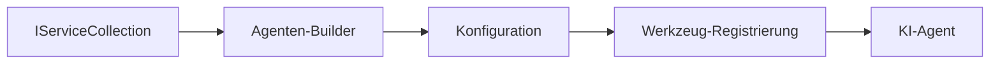

# 🎨 Agentische Designmuster mit Azure OpenAI (Responses API) (.NET)

## 📋 Lernziele

Dieses Beispiel zeigt unternehmensgerechte Designmuster zum Aufbau intelligenter Agenten unter Verwendung des Microsoft Agent Frameworks in .NET mit Azure OpenAI (Responses API) Integration. Sie lernen professionelle Muster und architektonische Ansätze kennen, die Agenten produktionsreif, wartbar und skalierbar machen.

### Unternehmens-Designmuster

- 🏭 **Factory Pattern**: Standardisierte Agentenerstellung mit Dependency Injection
- 🔧 **Builder Pattern**: Fluent Agentenkonfiguration und Einrichtung
- 🧵 **Thread-Safe Patterns**: Gleichzeitige Gesprächsverwaltung
- 📋 **Repository Pattern**: Organisiertes Werkzeug- und Fähigkeitsmanagement

## 🎯 .NET-spezifische Architekturvorteile

### Unternehmensfunktionen

- **Starke Typisierung**: Kompilierzeit-Validierung und IntelliSense-Unterstützung
- **Dependency Injection**: Eingebaute DI-Containerintegration
- **Konfigurationsmanagement**: IConfiguration und Optionsmuster
- **Async/Await**: Erstklassige asynchrone Programmierunterstützung

### Produktionsreife Muster

- **Logging-Integration**: ILogger und strukturierte Protokollierung
- **Health Checks**: Eingebaute Überwachung und Diagnostik
- **Konfigurationsvalidierung**: Starke Typisierung mit Datenanmerkungen
- **Fehlerbehandlung**: Strukturierte Ausnahmeverwaltung

## 🔧 Technische Architektur

### Kern-.NET-Komponenten

- **Microsoft.Extensions.AI**: Einheitliche AI-Service-Abstraktionen
- **Microsoft.Agents.AI**: Unternehmens-Framework zur Agenten-Orchestrierung
- **Azure OpenAI (Responses API)**: Hochleistungsfähige API-Clientmuster
- **Konfigurationssystem**: appsettings.json und Umgebungsintegration

### Designmuster-Implementierung



## 🏗️ Gezeigte Unternehmensmuster

### 1. **Erzeugende Muster**

- **Agent Factory**: Zentralisierte Agentenerstellung mit konsistenter Konfiguration
- **Builder Pattern**: Fluent API für komplexe Agentenkonfiguration
- **Singleton Pattern**: Gemeinsame Ressourcen- und Konfigurationsverwaltung
- **Dependency Injection**: Lose Kopplung und Testbarkeit

### 2. **Verhaltensmuster**

- **Strategy Pattern**: Austauschbare Werkzeugaussführungsstrategien
- **Command Pattern**: Kapselte Agentenoperationen mit Undo/Redo
- **Observer Pattern**: Ereignisgesteuerte Agenten-Lebenszyklusverwaltung
- **Template Method**: Standardisierte Agentenausführungs-Workflows

### 3. **Strukturelle Muster**

- **Adapter Pattern**: Azure OpenAI (Responses API) Integrationsschicht
- **Decorator Pattern**: Erweiterung der Agentenfähigkeiten
- **Facade Pattern**: Vereinfachte Agenteninteraktionsschnittstellen
- **Proxy Pattern**: Lazy Loading und Caching für Performance

## 📚 .NET-Designprinzipien

### SOLID-Prinzipien

- **Single Responsibility**: Jede Komponente hat einen klaren Zweck
- **Open/Closed**: Erweiterbar ohne Modifikation
- **Liskov Substitution**: Interface-basierte Werkzeugimplementierungen
- **Interface Segregation**: Fokussierte, kohäsive Schnittstellen
- **Dependency Inversion**: Abhängigkeit von Abstraktionen, nicht von Konkretisierungen

### Clean Architecture

- **Domain-Schicht**: Kernagenten- und Werkzeugabstraktionen
- **Application-Schicht**: Agentenorchestrierung und Workflows
- **Infrastructure-Schicht**: Azure OpenAI (Responses API) Integration und externe Dienste
- **Presentation-Schicht**: Benutzerinteraktion und Antwortformatierung

## 🔒 Unternehmensüberlegungen

### Sicherheit

- **Anmeldeinformationenverwaltung**: Sichere Handhabung von API-Schlüsseln mit IConfiguration
- **Eingabevalidierung**: Starke Typisierung und Validierung mit Datenanmerkungen
- **Ausgabe-Sanitärmaßnahmen**: Sichere Antwortverarbeitung und Filterung
- **Audit-Logging**: Umfassende Betriebserfassung

### Leistung

- **Async Muster**: Nicht-blockierende I/O-Operationen
- **Verbindungs-Pooling**: Effizientes HTTP-Client-Management
- **Caching**: Antwort-Caching für verbesserte Leistung
- **Ressourcenverwaltung**: Ordnungsgemäße Freigabe- und Bereinigungsmuster

### Skalierbarkeit

- **Thread-Sicherheit**: Unterstützung für gleichzeitige Agentenausführung
- **Ressourcen-Pooling**: Effiziente Ressourcennutzung
- **Lastmanagement**: Rate-Limiting und Backpressure-Handhabung
- **Überwachung**: Leistungskennzahlen und Health Checks

## 🚀 Produktionsbereitstellung

- **Konfigurationsmanagement**: Umgebungsabhängige Einstellungen
- **Logging-Strategie**: Strukturierte Protokollierung mit Korrelations-IDs
- **Fehlerbehandlung**: Globale Ausnahmebehandlung mit geeigneter Wiederherstellung
- **Überwachung**: Application Insights und Leistungszähler
- **Tests**: Unit-Tests, Integrationstests und Lasttestmuster

Bereit, unternehmensgerechte intelligente Agenten mit .NET zu bauen? Lassen Sie uns etwas Robustem entwerfen! 🏢✨

## 🚀 Erste Schritte

### Voraussetzungen

- [.NET 10 SDK](https://dotnet.microsoft.com/download/dotnet/10.0) oder höher
- Ein [Azure-Abonnement](https://azure.microsoft.com/free/) mit einer Azure OpenAI-Ressource und einer Modell-Bereitstellung
- Die [Azure CLI](https://learn.microsoft.com/cli/azure/install-azure-cli) — Anmeldung mit `az login`

### Erforderliche Umgebungsvariablen

```bash
# zsh/bash
export AZURE_OPENAI_ENDPOINT=https://<your-resource>.openai.azure.com
export AZURE_OPENAI_DEPLOYMENT=gpt-5-mini
# Melden Sie sich dann an, damit AzureCliCredential ein Token abrufen kann
az login
```

```powershell
# PowerShell
$env:AZURE_OPENAI_ENDPOINT = "https://<your-resource>.openai.azure.com"
$env:AZURE_OPENAI_DEPLOYMENT = "gpt-5-mini"
# Melden Sie sich dann an, damit AzureCliCredential ein Token erhalten kann
az login
```

### Beispielcode

Um das Codebeispiel auszuführen,

```bash
# zsh/bash
chmod +x ./03-dotnet-agent-framework.cs
./03-dotnet-agent-framework.cs
```

Oder mit der dotnet CLI:

```bash
dotnet run ./03-dotnet-agent-framework.cs
```

Siehe [`03-dotnet-agent-framework.cs`](../../../../03-agentic-design-patterns/code_samples/03-dotnet-agent-framework.cs) für den vollständigen Code.

```csharp
#!/usr/bin/dotnet run

#:package Microsoft.Extensions.AI@10.*
#:package Microsoft.Agents.AI.OpenAI@1.*-*
#:package Azure.AI.OpenAI@2.1.0
#:package Azure.Identity@1.13.1

using System.ComponentModel;

using Microsoft.Agents.AI;
using Microsoft.Extensions.AI;

using Azure.AI.OpenAI;
using Azure.Identity;

// Tool Function: Random Destination Generator
// This static method will be available to the agent as a callable tool
// The [Description] attribute helps the AI understand when to use this function
// This demonstrates how to create custom tools for AI agents
[Description("Provides a random vacation destination.")]
static string GetRandomDestination()
{
    // List of popular vacation destinations around the world
    // The agent will randomly select from these options
    var destinations = new List<string>
    {
        "Paris, France",
        "Tokyo, Japan",
        "New York City, USA",
        "Sydney, Australia",
        "Rome, Italy",
        "Barcelona, Spain",
        "Cape Town, South Africa",
        "Rio de Janeiro, Brazil",
        "Bangkok, Thailand",
        "Vancouver, Canada"
    };

    // Generate random index and return selected destination
    // Uses System.Random for simple random selection
    var random = new Random();
    int index = random.Next(destinations.Count);
    return destinations[index];
}

// Azure OpenAI with the Responses API (stable v1 endpoint). Sign in with `az login`.
var azureEndpoint = Environment.GetEnvironmentVariable("AZURE_OPENAI_ENDPOINT")
    ?? throw new InvalidOperationException("AZURE_OPENAI_ENDPOINT is not set.");
var deployment = Environment.GetEnvironmentVariable("AZURE_OPENAI_DEPLOYMENT") ?? "gpt-5-mini";

var azureClient = new AzureOpenAIClient(new Uri(azureEndpoint), new AzureCliCredential());

// Define Agent Identity and Comprehensive Instructions
// Agent name for identification and logging purposes
var AGENT_NAME = "TravelAgent";

// Detailed instructions that define the agent's personality, capabilities, and behavior
// This system prompt shapes how the agent responds and interacts with users
var AGENT_INSTRUCTIONS = """
You are a helpful AI Agent that can help plan vacations for customers.

Important: When users specify a destination, always plan for that location. Only suggest random destinations when the user hasn't specified a preference.

When the conversation begins, introduce yourself with this message:
"Hello! I'm your TravelAgent assistant. I can help plan vacations and suggest interesting destinations for you. Here are some things you can ask me:
1. Plan a day trip to a specific location
2. Suggest a random vacation destination
3. Find destinations with specific features (beaches, mountains, historical sites, etc.)
4. Plan an alternative trip if you don't like my first suggestion

What kind of trip would you like me to help you plan today?"

Always prioritize user preferences. If they mention a specific destination like "Bali" or "Paris," focus your planning on that location rather than suggesting alternatives.
""";

// Create AI Agent with Advanced Travel Planning Capabilities
// Get the Responses client for the deployment and create the AI agent
// Configure agent with name, detailed instructions, and available tools
// This demonstrates the .NET agent creation pattern with full configuration
AIAgent agent = azureClient
    .GetChatClient(deployment)
    .AsAIAgent(
        name: AGENT_NAME,
        instructions: AGENT_INSTRUCTIONS,
        tools: [AIFunctionFactory.Create(GetRandomDestination)]
    );

// Create New Conversation Session for Context Management
// Initialize a new conversation session to maintain context across multiple interactions
// Sessions enable the agent to remember previous exchanges and maintain conversational state
// This is essential for multi-turn conversations and contextual understanding
var session = await agent.CreateSessionAsync();

// Execute Agent: First Travel Planning Request
// Run the agent with an initial request that will likely trigger the random destination tool
// The agent will analyze the request, use the GetRandomDestination tool, and create an itinerary
// Using the session parameter maintains conversation context for subsequent interactions
await foreach (var update in agent.RunStreamingAsync("Plan me a day trip", session))
{
    await Task.Delay(10);
    Console.Write(update);
}

Console.WriteLine();

// Execute Agent: Follow-up Request with Context Awareness
// Demonstrate contextual conversation by referencing the previous response
// The agent remembers the previous destination suggestion and will provide an alternative
// This showcases the power of conversation sessions and contextual understanding in .NET agents
await foreach (var update in agent.RunStreamingAsync("I don't like that destination. Plan me another vacation.", session))
{
    await Task.Delay(10);
    Console.Write(update);
}
```

---

<!-- CO-OP TRANSLATOR DISCLAIMER START -->
**Haftungsausschluss**:
Dieses Dokument wurde mit dem KI-Übersetzungsdienst [Co-op Translator](https://github.com/Azure/co-op-translator) übersetzt. Obwohl wir uns um Genauigkeit bemühen, beachten Sie bitte, dass automatisierte Übersetzungen Fehler oder Ungenauigkeiten enthalten können. Das Originaldokument in seiner Ursprungssprache gilt als maßgebliche Quelle. Bei kritischen Informationen wird eine professionelle menschliche Übersetzung empfohlen. Wir übernehmen keine Haftung für Missverständnisse oder Fehlinterpretationen, die aus der Verwendung dieser Übersetzung entstehen.
<!-- CO-OP TRANSLATOR DISCLAIMER END -->