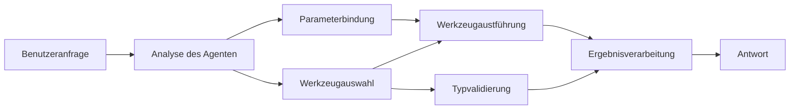

# 🛠️ Erweiterte Werkzeugnutzung mit Azure OpenAI (Responses API) (.NET)

## 📋 Lernziele

Dieses Notebook demonstriert unternehmensgerechte Werkzeug-Integrationsmuster unter Verwendung des Microsoft Agent Frameworks in .NET mit Azure OpenAI (Responses API). Sie lernen, komplexe Agenten mit mehreren spezialisierten Werkzeugen zu erstellen und dabei die starke Typisierung von C# sowie die Unternehmensfunktionen von .NET zu nutzen.

### Erweiterte Werkzeugfähigkeiten, die Sie meistern werden

- 🔧 **Mehrfach-Werkzeug-Architektur**: Aufbau von Agenten mit mehreren spezialisierten Fähigkeiten
- 🎯 **Typsichere Werkzeugausführung**: Nutzung der Compile-Zeit-Validierung von C#
- 📊 **Enterprise-Werkzeugmuster**: Produktionsreifes Werkzeugdesign und Fehlerbehandlung
- 🔗 **Werkzeugkomposition**: Kombination von Werkzeugen für komplexe Geschäftsabläufe

## 🎯 Vorteile der .NET-Werkzeugarchitektur

### Enterprise-Werkzeugfunktionen

- **Compile-Zeit-Validierung**: Starke Typisierung sichert die Korrektheit der Werkzeugparameter
- **Dependency Injection**: IoC-Container-Integration für Werkzeugverwaltung
- **Async/Await-Muster**: Nicht blockierende Werkzeugausführung mit ordnungsgemäßer Ressourcenverwaltung
- **Strukturierte Protokollierung**: Eingebaute Protokollierungsintegration zur Überwachung der Werkzeugausführung

### Produktionsreife Muster

- **Ausnahmebehandlung**: Umfassendes Fehlermanagement mit typisierten Ausnahmen
- **Ressourcenverwaltung**: Korrekte Disposal-Muster und Speicherverwaltung
- **Leistungsüberwachung**: Eingebaute Metriken und Performance-Counter
- **Konfigurationsmanagement**: Typsichere Konfiguration mit Validierung

## 🔧 Technische Architektur

### Kernkomponenten der .NET-Werkzeuge

- **Microsoft.Extensions.AI**: Vereinheitlichte Abstraktionsschicht für Werkzeuge
- **Microsoft.Agents.AI**: Unternehmensgerechte Orchestrierung von Werkzeugen
- **Azure OpenAI (Responses API)**: Hochleistungs-API-Client mit Verbindungspool

### Werkzeug-Ausführungspipeline



## 🛠️ Werkzeugkategorien & Muster

### 1. **Datenverarbeitungswerkzeuge**

- **Eingabevalidierung**: Starke Typisierung mit Datenannotation
- **Transformationsoperationen**: Typsichere Datenkonvertierung und Formatierung
- **Geschäftslogik**: Domänenspezifische Berechnungs- und Analysewerkzeuge
- **Ausgabeformatierung**: Strukturierte Antwortgenerierung

### 2. **Integrationswerkzeuge**

- **API-Connectoren**: RESTful-Service-Integration mit HttpClient
- **Datenbankwerkzeuge**: Entity Framework Integration für Datenzugriff
- **Dateioperationen**: Sichere Dateisystemoperationen mit Validierung
- **Externe Dienste**: Integrationsmuster für Dienste von Drittanbietern

### 3. **Hilfswerkzeuge**

- **Textverarbeitung**: String-Manipulation und Formatierungswerkzeuge
- **Datum/Uhrzeit-Operationen**: Kulturbewusste Datum/Uhrzeit-Berechnungen
- **Mathematische Werkzeuge**: Präzisionsberechnungen und statistische Operationen
- **Validierungswerkzeuge**: Geschäftliche Regelvalidierung und Datenprüfung

Bereit, unternehmensgerechte Agenten mit leistungsfähigen, typsicheren Werkzeugfunktionen in .NET zu bauen? Lassen Sie uns professionelle Lösungen entwerfen! 🏢⚡

## 🚀 Erste Schritte

### Voraussetzungen

- [.NET 10 SDK](https://dotnet.microsoft.com/download/dotnet/10.0) oder höher
- Ein [Azure-Abonnement](https://azure.microsoft.com/free/) mit einer Azure OpenAI-Ressource und einem Modellausstoß
- Die [Azure CLI](https://learn.microsoft.com/cli/azure/install-azure-cli) — Anmeldung mit `az login`

### Erforderliche Umgebungsvariablen

```bash
# zsh/bash
export AZURE_OPENAI_ENDPOINT=https://<your-resource>.openai.azure.com
export AZURE_OPENAI_DEPLOYMENT=gpt-5-mini
# Melden Sie sich dann an, damit AzureCliCredential ein Token erhalten kann
az login
```

```powershell
# PowerShell
$env:AZURE_OPENAI_ENDPOINT = "https://<your-resource>.openai.azure.com"
$env:AZURE_OPENAI_DEPLOYMENT = "gpt-5-mini"
# Melden Sie sich dann an, damit AzureCliCredential ein Token erhalten kann
az login
```

### Beispielcode

Um das Codebeispiel auszuführen,

```bash
# zsh/bash
chmod +x ./04-dotnet-agent-framework.cs
./04-dotnet-agent-framework.cs
```

Oder mit der dotnet-CLI:

```bash
dotnet run ./04-dotnet-agent-framework.cs
```

Siehe [`04-dotnet-agent-framework.cs`](../../../../04-tool-use/code_samples/04-dotnet-agent-framework.cs) für den vollständigen Code.

```csharp
#!/usr/bin/dotnet run

#:package Microsoft.Extensions.AI@10.*
#:package Microsoft.Agents.AI.OpenAI@1.*-*
#:package Azure.AI.OpenAI@2.1.0
#:package Azure.Identity@1.13.1

using System.ComponentModel;

using Microsoft.Agents.AI;
using Microsoft.Extensions.AI;

using Azure.AI.OpenAI;
using Azure.Identity;

// Tool Function: Random Destination Generator
// This static method will be available to the agent as a callable tool
// The [Description] attribute helps the AI understand when to use this function
// This demonstrates how to create custom tools for AI agents
[Description("Provides a random vacation destination.")]
static string GetRandomDestination()
{
    // List of popular vacation destinations around the world
    // The agent will randomly select from these options
    var destinations = new List<string>
    {
        "Paris, France",
        "Tokyo, Japan",
        "New York City, USA",
        "Sydney, Australia",
        "Rome, Italy",
        "Barcelona, Spain",
        "Cape Town, South Africa",
        "Rio de Janeiro, Brazil",
        "Bangkok, Thailand",
        "Vancouver, Canada"
    };

    // Generate random index and return selected destination
    // Uses System.Random for simple random selection
    var random = new Random();
    int index = random.Next(destinations.Count);
    return destinations[index];
}

// Azure OpenAI with the Responses API (stable v1 endpoint). Sign in with `az login`.
var azureEndpoint = Environment.GetEnvironmentVariable("AZURE_OPENAI_ENDPOINT")
    ?? throw new InvalidOperationException("AZURE_OPENAI_ENDPOINT is not set.");
var deployment = Environment.GetEnvironmentVariable("AZURE_OPENAI_DEPLOYMENT") ?? "gpt-5-mini";

var azureClient = new AzureOpenAIClient(new Uri(azureEndpoint), new AzureCliCredential());

// Define Agent Identity and Comprehensive Instructions
// Agent name for identification and logging purposes
var AGENT_NAME = "TravelAgent";

// Detailed instructions that define the agent's personality, capabilities, and behavior
// This system prompt shapes how the agent responds and interacts with users
var AGENT_INSTRUCTIONS = """
You are a helpful AI Agent that can help plan vacations for customers.

Important: When users specify a destination, always plan for that location. Only suggest random destinations when the user hasn't specified a preference.

When the conversation begins, introduce yourself with this message:
"Hello! I'm your TravelAgent assistant. I can help plan vacations and suggest interesting destinations for you. Here are some things you can ask me:
1. Plan a day trip to a specific location
2. Suggest a random vacation destination
3. Find destinations with specific features (beaches, mountains, historical sites, etc.)
4. Plan an alternative trip if you don't like my first suggestion

What kind of trip would you like me to help you plan today?"

Always prioritize user preferences. If they mention a specific destination like "Bali" or "Paris," focus your planning on that location rather than suggesting alternatives.
""";

// Create AI Agent with Advanced Travel Planning Capabilities
// Get the Responses client for the deployment and create the AI agent
// Configure agent with name, detailed instructions, and available tools
// This demonstrates the .NET agent creation pattern with full configuration
AIAgent agent = azureClient
    .GetChatClient(deployment)
    .AsAIAgent(
        name: AGENT_NAME,
        instructions: AGENT_INSTRUCTIONS,
        tools: [AIFunctionFactory.Create(GetRandomDestination)]
    );

// Create New Conversation Session for Context Management
// Initialize a new conversation session to maintain context across multiple interactions
// Sessions enable the agent to remember previous exchanges and maintain conversational state
// This is essential for multi-turn conversations and contextual understanding
await using var session = await agent.CreateSessionAsync();

// Execute Agent: First Travel Planning Request
// Run the agent with an initial request that will likely trigger the random destination tool
// The agent will analyze the request, use the GetRandomDestination tool, and create an itinerary
// Using the session parameter maintains conversation context for subsequent interactions
await foreach (var update in agent.RunStreamingAsync("Plan me a day trip", session))
{
    await Task.Delay(10);
    Console.Write(update);
}

Console.WriteLine();

// Execute Agent: Follow-up Request with Context Awareness
// Demonstrate contextual conversation by referencing the previous response
// The agent remembers the previous destination suggestion and will provide an alternative
// This showcases the power of conversation sessions and contextual understanding in .NET agents
await foreach (var update in agent.RunStreamingAsync("I don't like that destination. Plan me another vacation.", session))
{
    await Task.Delay(10);
    Console.Write(update);
}
```

---

<!-- CO-OP TRANSLATOR DISCLAIMER START -->
**Haftungsausschluss**:
Dieses Dokument wurde mit dem KI-Übersetzungsdienst [Co-op Translator](https://github.com/Azure/co-op-translator) übersetzt. Obwohl wir uns um Genauigkeit bemühen, beachten Sie bitte, dass automatisierte Übersetzungen Fehler oder Ungenauigkeiten enthalten können. Das Originaldokument in seiner Ursprungssprache gilt als maßgebliche Quelle. Bei kritischen Informationen wird eine professionelle menschliche Übersetzung empfohlen. Wir übernehmen keine Haftung für Missverständnisse oder Fehlinterpretationen, die aus der Verwendung dieser Übersetzung entstehen.
<!-- CO-OP TRANSLATOR DISCLAIMER END -->