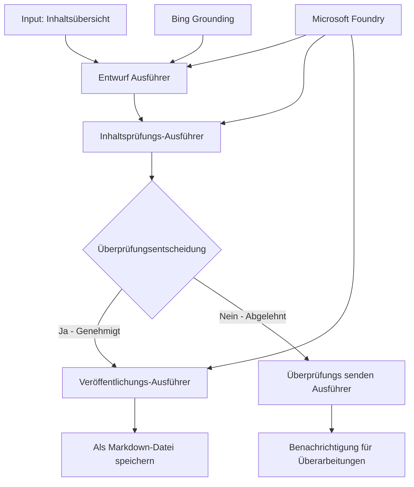

# 🔀 Bedingte Agenten-Workflows mit Microsoft Foundry (.NET)

## 📋 Tutorial für intelligente, entscheidungsbasierte Workflows

Dieses Notebook zeigt **bedingte Workflow-Muster** mit Microsoft Foundry und dem Microsoft Agent Framework für .NET. Sie lernen, wie man ausgeklügelte, entscheidungsgetriebene Workflows erstellt, die die Verarbeitung basierend auf KI-Analyse, Geschäftsregeln und dynamischen Bedingungen für Automatisierung auf Unternehmensniveau intelligent steuern.

## 🎯 Lernziele

### 🧠 **Intelligente Entscheidungsarchitektur**
- **Umsetzung bedingter Logik**: Aufbau komplexer Entscheidungsbäume mit mehreren Verzweigungspunkten
- **KI-gestützte Steuerung**: Nutzung von Microsoft Foundry-Modellen zur intelligenten Entscheidungsfindung bei der Weiterleitung
- **Dynamische Workflow-Anpassung**: Modifizierung des Workflow-Verhaltens basierend auf Laufzeitanalyse und Bedingungen
- **Integration von Unternehmensregeln**: Einbindung von Geschäftslogik und Compliance-Anforderungen in Workflows

### 🔀 **Erweiterte bedingte Muster**
- **Mehrkriterien-Entscheidungsfindung**: Bewertung mehrerer Faktoren für Weiterleitungsentscheidungen
- **Kontextbewusste Verarbeitung**: Entscheidungen basierend auf angesammeltem Workflow-Kontext und Historie
- **Adaptive Workflow-Modifikation**: Dynamische Anpassung der Verarbeitungswege je nach Echtzeitbedingungen
- **Regel-Engine-Integration**: Implementierung ausgeklügelter Geschäftsregel-Engines innerhalb von Workflows

### 🏢 **Bedingte Anwendungen für Unternehmen**
- **Dokumentenklassifizierung & Weiterleitung**: Automatische Klassifikation und Weiterleitung von Dokumenten an passende Workflows
- **Kundendienst-Triage**: Intelligente Weiterleitung von Kundenanfragen an spezialisierte Bearbeitungsteams
- **Compliance- & Risiko-Verarbeitung**: Anwendung unterschiedlicher Validierungs- und Prüfprozesse basierend auf Risikobewertung
- **Workflows für Qualitätssicherung**: Weiterleitung von Inhalten durch geeignete Prüfprozesse basierend auf Qualitätsmetriken

## ⚙️ Voraussetzungen & Einrichtung

### 📦 **Benötigte NuGet-Pakete**

Erweiterte Pakete zur bedingten Workflow-Verarbeitung:

```xml
<!-- Core AI Framework -->
<PackageReference Include="Microsoft.Extensions.AI" Version="9.9.0" />

<!-- Azure AI Agents with Persistent State -->
<PackageReference Include="Azure.AI.Agents.Persistent" Version="1.2.0-beta.5" />

<!-- Azure Identity and Utilities -->
<PackageReference Include="Azure.Identity" Version="1.15.0" />
<PackageReference Include="System.Linq.Async" Version="6.0.3" />
<PackageReference Include="DotNetEnv" Version="3.1.1" />

<!-- Local Workflow Framework References -->
<!-- Microsoft.Agents.Workflows.dll - Advanced workflow orchestration -->
<!-- Microsoft.Agents.AI.AzureAI.dll - Microsoft Foundry integration -->
<!-- Microsoft.Agents.AI.dll - Core agent abstractions -->
```

### 🔑 **Microsoft Foundry Konfiguration**

**Erforderliche Azure-Ressourcen:**
- Microsoft Foundry-Arbeitsbereich mit bedingten Verarbeitungsmodellen
- Azure-Abonnement mit passenden Compute-Kontingenten und Berechtigungen
- Bereitgestellte KI-Modelle für Entscheidungsfindung und Inhaltsanalyse
- (Optional) Bing Search API-Verbindung für Grounding-Fähigkeiten

**Umgebungskonfiguration (.env-Datei):**
```env
# Microsoft Foundry Configuration
AZURE_AI_PROJECT_ENDPOINT=https://your-project.cognitiveservices.azure.com/
BING_CONNECTION_ID=your-bing-connection-id
```

**Authentifizierungseinrichtung:**
```csharp
// Azure CLI or Managed Identity authentication
using Azure.Identity;
var credential = new AzureCliCredential();

// Load environment configuration
DotNetEnv.Env.Load("../../../.env");
```

### 🏗️ **Architektur bedingter Workflows**



**Hauptkomponenten:**
- **Draft Executor**: KI-Agent, der erste Inhaltsentwürfe aus Gliederungen erstellt
- **Content Review Executor**: KI-Agent, der die Qualität und Compliance des Entwurfs bewertet
- **Conditional Routing**: Entscheidungslogik zur Steuerung der Weiterleitung basierend auf Prüfergebnissen
- **Publish/Review Paths**: Getrennte Verarbeitungswege für genehmigte vs. abgelehnte Inhalte
- **Zustandsverwaltung**: Pflegt Inhalte- und Prüfkontext während des gesamten Workflows

## 🎨 **Designmuster für bedingte Workflows**

### 📋 **Inhaltsproduktion mit Qualitätskontrollen**
```
Outline → Draft Creation → Quality Review → {Approve: Publish | Reject: Revise}
```

### 🎯 **Risiko-basierte Dokumentenverarbeitung**
```
Document → Risk Assessment → {Low: Standard | High: Enhanced Review}
```

### 🔍 **Intelligente Steuerung im Kundendienst**
```
Customer Query → Analysis → {Simple: FAQ Bot | Complex: Human Agent}
```

### 💼 **Compliance-orientierte Workflows**
```
Content → Compliance Check → {Pass: Publish | Fail: Legal Review}
```

## 🏢 **Vorteile bedingter Workflows für Unternehmen**

### 🎯 **Intelligente Automatisierung**
- **Intelligente Entscheidungsfindung**: KI-gestützte Routing-Entscheidungen basierend auf Inhaltsanalyse und Kontext
- **Adaptive Verarbeitung**: Workflows passen sich automatisch an sich ändernde Bedingungen an
- **Durchsetzung von Geschäftsregeln**: Automatische Anwendung komplexer Geschäftslogik und Richtlinien
- **Kontextbewusstes Routing**: Entscheidungen basierend auf vollständiger Workflow-Historie und angesammeltem Kontext

### 📈 **Operative Exzellenz**
- **Optimierte Ressourcenzuweisung**: Zuweisung von Arbeit an geeignetste Spezialisten und Prozesse
- **Reduzierter manueller Eingriff**: Automatisierte Entscheidungsfindung minimiert den Bedarf an menschlicher Steuerung
- **Schnellere Lösungszeiten**: Direkte Weiterleitung an passende Expertise und Verarbeitungskapazitäten
- **Konsistente Anwendung**: Einheitliche Durchsetzung von Geschäftsregeln und Entscheidungskriterien

### 🛡️ **Risikomanagement & Compliance**
- **Automatisierte Risikoanalyse**: KI-gestützte Bewertung von Inhalts- und Situationsrisiken
- **Durchsetzung von Compliance**: Automatische Weiterleitung durch erforderliche regulatorische Prozesse
- **Anwendung von Sicherheitsprotokollen**: Verbesserte Sicherheitsmaßnahmen basierend auf Risikobewertung
- **Pflege eines Audit-Trails**: Vollständige Dokumentation der Routing-Entscheidungen und Begründungen

### 📊 **Analytik & kontinuierliche Verbesserung**
- **Entscheidungsanalytik**: Verfolgung der Effektivität und Genauigkeit von Routing-Entscheidungen
- **Mustererkennung**: Identifikation von Trends und Mustern in Routing-Entscheidungen über die Zeit
- **Leistungsoptimierung**: Kontinuierliche Verbesserung von Entscheidungskriterien und Routing-Effizienz
- **Business Intelligence**: Erkenntnisse zu Inhaltsmerkmalen und Verarbeitungsanforderungen

### 🔧 **Technische Exzellenz**
- **Persistente Zustandsverwaltung**: Verwaltung komplexer Zustände über die Ausführung des Workflows hinweg
- **Skalierbare Architektur**: Bewältigung von Anforderungen hoher bedingter Prozessvolumina
- **Integrationsfähigkeiten**: Nahtlose Integration mit bestehenden Geschäftssystemen und Prozessen
- **Überwachung & Beobachtbarkeit**: Umfassendes Tracking von Workflow-Leistung und Entscheidungen

Bauen wir intelligente, entscheidungsgetriebene Unternehmens-Workflows mit .NET! 🚀

## 💻 Ausführung des Codes

Die vollständige Implementierung ist verfügbar in `04.dotnet-agent-framework-workflow-aifoundry-condition.cs`. Es demonstriert einen **Inhaltsproduktionsworkflow mit Qualitätskontrollen**:

### 🏗️ **Workflow-Architektur**

```
Content Outline → Draft Creation → Quality Review → Conditional Routing:
                                                      ├─ Approved (>200 words) → Publish
                                                      └─ Rejected (<200 words) → Review Notification
```

**Agenten im Workflow:**
1. **Evangelist Agent**: Erstellt Tutorial-Entwürfe aus Gliederungen mit Bing-Grounding
2. **Content Reviewer Agent**: Bewertet die Entwurfsqualität (Wortanzahl, Vollständigkeit)
3. **Publisher Agent**: Speichert genehmigte Inhalte als mit Zeitstempel versehene Markdown-Dateien

**Benutzerdefinierte Executor:**
1. **DraftExecutor**: Koordiniert die Entwurfserstellung
2. **ContentReviewExecutor**: Führt Qualitätsbewertung durch
3. **PublishExecutor**: Verantwortlich für Veröffentlichung genehmigter Inhalte
4. **SendReviewExecutor**: Verwaltet Benachrichtigungen zu abgelehntem Inhalt

### 🚀 Ausführung des Beispiels

**Voraussetzungen:**
- Microsoft Foundry-Arbeitsbereich konfiguriert
- Azure CLI-Authentifizierung (`az login`)
- (Optional) Bing Search-Verbindung für Grounding

```bash
# Machen Sie das Skript ausführbar (Unix/Linux/macOS)
chmod +x 04.dotnet-agent-framework-workflow-aifoundry-condition.cs

# Führen Sie den bedingten Workflow aus
./04.dotnet-agent-framework-workflow-aifoundry-condition.cs
```

Oder unter Windows:
```powershell
dotnet run 04.dotnet-agent-framework-workflow-aifoundry-condition.cs
```

### 📝 Erwartete Ausgabe

Der Workflow wird:
1. **Agenten erstellen**: Initialisiert drei spezialisierte Microsoft Foundry-Agenten
2. **Entwurf generieren**: Evangelist-Agent erstellt Tutorial-Entwurf aus Gliederung
3. **Inhalt prüfen**: Content Reviewer bewertet Entwurfsqualität
4. **Bedingte Steuerung**:
   - **Wenn genehmigt (>200 Wörter)**: Publish Executor speichert als Markdown-Datei
   - **Wenn abgelehnt (<200 Wörter)**: Send Review Benachrichtigung
5. **Ergebnisse anzeigen**: Zeigt das endgültige Workflow-Ergebnis

### 🔧 Anpassungsoptionen

**Überprüfungskriterien anpassen:**
```csharp
const string ContentReviewerInstructions = @"
You are a content reviewer...
1. Check if content is more than 500 words (instead of 200)
2. Verify technical accuracy
3. Ensure proper formatting
...";
```

**Weitere bedingte Pfade hinzufügen:**
```csharp
var workflow = new WorkflowBuilder(draftExecutor)
    .AddEdge(draftExecutor, contentReviewerExecutor)
    .AddEdge(contentReviewerExecutor, publishExecutor, condition: GetCondition("Excellent"))
    .AddEdge(contentReviewerExecutor, editExecutor, condition: GetCondition("Good"))
    .AddEdge(contentReviewerExecutor, sendReviewerExecutor, condition: GetCondition("Poor"))
    .Build();
```

**Inhaltsanforderungen ändern:**
```csharp
string OUTLINE_Content = @"
# Your Custom Topic
## Section 1
https://your-reference-url
## Section 2
...
";
```

### 🎯 Anwendungsbeispiele aus der Praxis

Dieses bedingte Workflow-Muster eignet sich ideal für:
- **Content Management Systeme**: Automatisierte redaktionelle Workflows mit Qualitätskontrollen
- **Dokumentenverarbeitung**: Weiterleitung von Dokumenten basierend auf Klassifizierung und Compliance
- **Kundensupport**: Intelligente Ticketweiterleitung basierend auf Komplexität und Dringlichkeit
- **Juristische Überprüfung**: Weiterleitung von Verträgen basierend auf Risikobewertung und Wert
- **HR-Prozesse**: Weiterleitung von Bewerbungen durch passende Screening-Workflows

### 🔍 Verständnis der bedingten Logik

**Bedingungsfunktion:**
```csharp
public Func<object?, bool> GetCondition(string expectedResult) =>
    reviewResult => reviewResult is ReviewResult review && review.Result == expectedResult;
```

Diese Funktion erstellt ein Prädikat, das:
1. Prüft, ob das Ergebnis vom Typ `ReviewResult` ist
2. Die Eigenschaft `Result` mit dem erwarteten Wert vergleicht
3. True/False zurückgibt, um die Weiterleitung zu bestimmen

**Workflow-Kanten mit Bedingungen:**
```csharp
.AddEdge(contentReviewerExecutor, publishExecutor, condition: GetCondition("Yes"))
.AddEdge(contentReviewerExecutor, sendReviewerExecutor, condition: GetCondition("No"))
```

### 📊 Erweiterte Funktionen

**JSON Schema Validierung:**
Der Workflow verwendet JSON-Schemas zur Sicherstellung strukturierter Antworten:

```csharp
// Define response structure
public class ReviewResult
{
    [JsonPropertyName("review_result")]
    public string Result { get; set; } = string.Empty;
    
    [JsonPropertyName("reason")]
    public string Reason { get; set; } = string.Empty;
    
    [JsonPropertyName("draft_content")]
    public string DraftContent { get; set; } = string.Empty;
}

// Apply to agent
ResponseFormat = ChatResponseFormat.ForJsonSchema(
    AIJsonUtilities.CreateJsonSchema(typeof(ReviewResult)), 
    "ReviewResult", 
    "Review Result From DraftContent"
)
```

**Bing Grounding Integration:**
Der Evangelist-Agent nutzt Bing Grounding, um auf Echtzeitinformationen zuzugreifen:

```csharp
var bingGroundingConfig = new BingGroundingSearchConfiguration(bing_conn_id);
BingGroundingToolDefinition bingGroundingTool = new(
    new BingGroundingSearchToolParameters([bingGroundingConfig])
);
```

Dadurch kann der Agent URLs in der Gliederung folgen und aktuelle Informationen extrahieren.

### 🛡️ Fehlerbehandlung

Der Workflow umfasst eine robuste Fehlerbehandlung bei abgelehnten Inhalten:
- Prüfungsfehler lösen den alternativen Pfad aus
- Benachrichtigungen geben klare Ablehnungsgründe an
- Inhalte werden zur Überarbeitung erhalten

### 🔄 Erweiterung des Workflows

**Eine Überarbeitungsschleife hinzufügen:**
Erstellen Sie eine Feedbackschleife, die Inhalte automatisch neu entwirft:

```csharp
.AddEdge(contentReviewerExecutor, publishExecutor, condition: GetCondition("Yes"))
.AddEdge(contentReviewerExecutor, draftExecutor, condition: GetCondition("No")) // Loop back
```

**Implementierung einer mehrstufigen Überprüfung:**
Fügen Sie mehrere Prüfungsstufen mit unterschiedlichen Kriterien hinzu:

```csharp
.AddEdge(draftExecutor, technicalReviewer)
.AddEdge(technicalReviewer, editorialReviewer, condition: GetCondition("TechPass"))
.AddEdge(editorialReviewer, publishExecutor, condition: GetCondition("EditPass"))
```

Dieses bedingte Workflow-Muster bildet die Grundlage zum Aufbau ausgeklügelter, intelligenter Unternehmensautomatisierungssysteme! 🚀

---

<!-- CO-OP TRANSLATOR DISCLAIMER START -->
**Haftungsausschluss**:
Dieses Dokument wurde mit dem KI-Übersetzungsdienst [Co-op Translator](https://github.com/Azure/co-op-translator) übersetzt. Obwohl wir uns um Genauigkeit bemühen, beachten Sie bitte, dass automatisierte Übersetzungen Fehler oder Ungenauigkeiten enthalten können. Das Originaldokument in seiner Ursprungssprache gilt als maßgebliche Quelle. Bei kritischen Informationen wird eine professionelle menschliche Übersetzung empfohlen. Wir übernehmen keine Haftung für Missverständnisse oder Fehlinterpretationen, die aus der Verwendung dieser Übersetzung entstehen.
<!-- CO-OP TRANSLATOR DISCLAIMER END -->