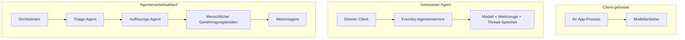
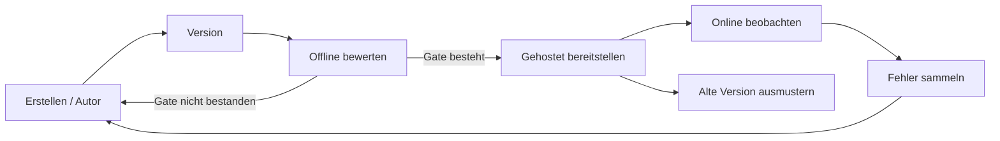
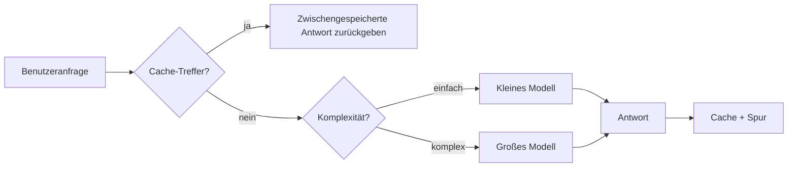
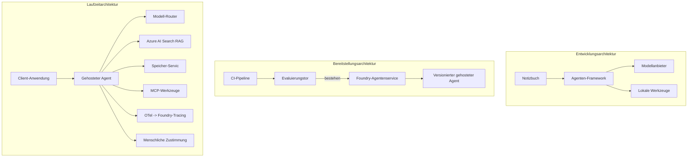

# Bereitstellung skalierbarer Agenten mit Microsoft Foundry


Bis zu diesem Punkt im Kurs haben Sie Agenten erstellt, die auf Ihrem Laptop, innerhalb eines Notebooks laufen, gesteuert durch `az login` und einige Umgebungsvariablen. Das ist genau der richtige Weg zum Lernen. Es ist nicht der richtige Weg, einen Agenten zu betreiben, auf den Tausende von Kunden um 3 Uhr morgens angewiesen sind.

Diese Lektion behandelt die Lücke zwischen „es funktioniert auf meinem Rechner“ und „es funktioniert zuverlässig und kostengünstig in der Produktion.“ Wir schließen diese Lücke mithilfe von **Microsoft Foundry** und dem **Microsoft Foundry Agent Service**, und wir tun dies, indem wir einen echten Kundensupport-Agenten mit Werkzeugen, Abruf, Gedächtnis, Bewertung und Überwachung erstellen.

## Einführung

Diese Lektion behandelt:

- Den Unterschied zwischen einem **Prototyp-Agenten** und einem **bereitgestellten Agenten** und warum der Übergang hauptsächlich alles *um* das Modell herum betrifft.
- **Bereitstellungsmuster** für Agenten: client-gestützt, service-gestützt (Hosted Agents) und workflow-orchestriert.
- Den **Agentenlebenszyklus** bei Microsoft Foundry — erstellen, versionieren, bereitstellen, bewerten, beobachten, ausmustern.
- **Skalierungsstrategien**: Modell-Routing, Caching, Gleichzeitigkeit und zustandsloses Design.
- **Beobachtbarkeit** mit OpenTelemetry und Foundry-Tracing.
- **Kostenoptimierung** durch Modellauswahl, Routing und Bewertungsgatter.
- **Enterprise-Überlegungen**: Governance, menschliche Genehmigung und das sichere Betreiben von MCP-Servern in der Produktion.

## Lernziele

Nach Abschluss dieser Lektion wissen Sie, wie man:

- Das richtige Bereitstellungsmuster für eine gegebene Agentenlast auswählt.
- Einen Agenten beim Microsoft Foundry Agent Service bereitstellt, sodass er versioniert, verwaltet und beobachtbar ist.
- Einen Agenten für das Tracing instrumentiert und eine Bewertungspipeline einrichtet, die vor jeder Freigabe läuft.
- Modellrouting und Caching anwendet, um Latenz und Kosten bei Skalierung unter Kontrolle zu halten.
- Ein menschliches Genehmigungsgatter für risikoreiche Aktionen hinzufügt und einen MCP-Server produktionstauglich integriert.

## Voraussetzungen

Diese Lektion setzt voraus, dass Sie die vorherigen Lektionen abgeschlossen haben und vertraut sind mit:

- Dem Erstellen von Agenten mit dem [Microsoft Agent Framework](../14-microsoft-agent-framework/README.md) (Lektion 14).
- [Werkzeugnutzung](../04-tool-use/README.md) (Lektion 4) und [Agentic RAG](../05-agentic-rag/README.md) (Lektion 5).
- [Agentengedächtnis](../13-agent-memory/README.md) (Lektion 13) und [Agentic-Protokolle / MCP](../11-agentic-protocols/README.md) (Lektion 11).
- [Beobachtbarkeit und Bewertung](../10-ai-agents-production/README.md) (Lektion 10) — diese Lektion baut direkt darauf auf.

Sie benötigen außerdem:

- Ein **Azure-Abonnement** und ein **Microsoft Foundry Projekt** mit mindestens einem bereitgestellten Chatmodell.
- Die **Azure CLI** authentifiziert (`az login`).
- Python 3.12+ und die Pakete im Repository [`requirements.txt`](../../../requirements.txt).

## Vom Prototyp zur Produktion: Was sich tatsächlich ändert

Ein Prototyp-Agent und ein Produktionsagent teilen dieselbe Kernschleife – nachdenken, Werkzeuge aufrufen, antworten. Was sich ändert, ist alles um diese Schleife herum. Das Modell macht vielleicht 20 % eines Produktionsagenten aus; die restlichen 80 % sind das operative Gerüst.

| Bereich | Prototyp | Produktion |
| --- | --- | --- |
| **Hosting** | Läuft in Ihrem Notebook | Läuft als gehosteter Dienst, versioniert und ausgerollt |
| **Identität** | Ihr `az login` Token | Verwaltete Identität mit scoped RBAC |
| **Status** | Im Speicher, beim Neustart verloren | Externalisiert (Thread-Store, Gedächtnisdienst) |
| **Fehler** | Sie sehen den Traceback | Wiederholungen, Fallbacks, Dead-Letter, Warnungen |
| **Kosten** | „Es sind ein paar Cent“ | Pro Anfrage getrackt, geroutet, gecacht, budgetiert |
| **Qualität** | Sie überprüfen die Ausgabe visuell | Vor jeder Freigabe automatisch bewertet |
| **Vertrauen** | Sie genehmigen jede Aktion manuell | Richtlinien + Mensch-in-der-Schleife für risikoreiche Aktionen |

Behalten Sie diese Tabelle im Hinterkopf. Jeder der folgenden Abschnitte entspricht einer Zeile in dieser Tabelle.

## Agenten-Bereitstellungsmuster

Es gibt drei Muster, die Sie verwenden, oft auch in Kombination.

### 1. Client-gehostete Agenten

Das Agentenobjekt lebt innerhalb *Ihrer* Anwendung. Ihr Code ruft den Modellanbieter direkt auf; die Denk­schleife läuft in Ihrem Dienst. So wurde es in jeder vorherigen Lektion gemacht.

- **Verwenden Sie es, wenn** Sie volle Kontrolle über die Schleife, benutzerdefinierte Middleware benötigen oder den Agenten in eine vorhandene Backend-Umgebung einbetten.
- **Nachteil**: Sie sind selbst für Skalierung, Status und Fehlertoleranz verantwortlich.

### 2. Gehostete Agenten (Foundry Agent Service)

Der Agent ist *als Ressource* in Microsoft Foundry registriert. Foundry hostet die Denk­schleife, speichert Threads, erzwingt Inhalts­schutz und RBAC und macht den Agenten im Foundry-Portal sichtbar. Ihre App wird zu einem dünnen Client, der Threads erzeugt und Antworten liest.

- **Verwenden Sie es, wenn** Sie Haltbarkeit, integrierte Beobachtbarkeit, Verwaltung und eine geringere operative Oberfläche wünschen.
- **Nachteil**: Weniger Low-Level-Kontrolle im Tausch gegen eine verwaltete Laufzeit.

### 3. Agenten-Workflows

Mehrere Agenten (und Werkzeuge) werden zu einem Graphen mit explizitem Steuerfluss zusammengesetzt — sequentielle Schritte, Verzweigungen, menschliche Genehmigungsstellen und dauerhafte Prüf­punkte, die pausieren und fortsetzen können. Dies ist die Microsoft Agent Framework **Workflows**-Funktion, angewandt auf Bereitstellungsebene.

- **Verwenden Sie es, wenn** eine einzelne Aufgabe mehrere spezialisierte Agenten umfasst oder einen Genehmigungsschritt in der Mitte benötigt.
- **Nachteil**: mehr bewegliche Teile; benötigt Beobachtbarkeit auf Orchestrierungs-Ebene.



## Der Agentenlebenszyklus bei Microsoft Foundry

Einen Agenten bereitzustellen ist kein einmaliges `push`. Es ist eine Schleife, die einem Software-Release-Zyklus ähnelt, denn genau das ist es.



Die zentrale Idee, übernommen aus [Lektion 10](../10-ai-agents-production/README.md): **Offline-Bewertung ist ein Tor, kein Nachgedanke.** Eine neue Agentenversion wird nur ausgeliefert, wenn sie Ihre Bewertungs­schwellenwerte besteht. Online-Beobachtbarkeit speist dann reale Fehler zurück in Ihr Offline-Testset. Das ist der gesamte Zyklus.

## Skalierungsstrategien

Die Skalierung eines Agenten unterscheidet sich von der Skalierung einer zustandslosen Web-API, da jede Anfrage mehrere kostspielige Modell- und Werkzeugaufrufe auslösen kann. Vier Techniken tragen den größten Teil der Last.

**Zustandslose Anfragebehandlung.** Halten Sie keinen pro-Benutzer-Zustand im Prozessspeicher. Speichern Sie Gesprächsstränge im Foundry-Thread-Store oder einem Gedächtnisdienst, damit jede Instanz jede Anfrage bearbeiten kann. Das ermöglicht horizontale Skalierung — Instanzen hinzufügen, keine Sticky Sessions.

**Modell-Routing.** Nicht jede Anfrage benötigt Ihr leistungsfähigstes (und teuerstes) Modell. Leiten Sie einfache Anfragen — Intent-Klassifikation, kurze faktische Antworten — an ein kleines schnelles Modell weiter und reservieren Sie das große Modell für echte reasoning-Aufgaben. Der Foundry-**Model Router** kann das für Sie übernehmen, oder Sie können selbst einen leichten Klassifikator implementieren. Die Do-it-yourself-Version bauen Sie im Labor.

**Antwort-Caching.** Viele Supportanfragen sind nahezu Duplikate („Wie setze ich mein Passwort zurück?“). Cachen Sie Antworten auf häufige Fragen und liefern Sie diese, ohne das Modell zu belasten. Selbst eine moderate Cache-Trefferquote reduziert Kosten und Latenz spürbar.

**Gleichzeitigkeit und Backpressure.** Modellanbieter haben Raten­begrenzungen. Begrenzen Sie Ihre Gleichzeitigkeit, verwenden Sie Wiederholungen mit exponentiellem Backoff und scheitern Sie elegant (eine wartende „Wir arbeiten dran“-Antwort ist besser als ein 500er).



## Beobachtbarkeit in der Produktion

Was man nicht sehen kann, kann man nicht betreiben. Wie in Lektion 10 behandelt, gibt das Microsoft Agent Framework **OpenTelemetry**-Traces nativ aus — jeder Modellaufruf, Werkzeugaufruf und Orchestrierungsschritt wird zu einem Span. In der Produktion exportieren Sie diese Spans zu Microsoft Foundry (oder einem beliebigen OTel-kompatiblen Backend), um:

- Eine einzelne Kundenbeschwerde von Anfang bis Ende über jeden Modell- und Werkzeugaufruf nachzuverfolgen.
- P50/P95-Latenz und Kosten pro Anfrage über Zeit zu beobachten.
- Vor Fehler-Spitzen und Kosten­anomalien zu warnen, bevor Ihre Nutzer (oder Ihr Finanzteam) sie bemerken.

```python
from agent_framework.observability import get_tracer

tracer = get_tracer()

with tracer.start_as_current_span("support_request") as span:
    span.set_attribute("customer.tier", "enterprise")
    span.set_attribute("routed.model", "gpt-4.1-mini")
    # Die Ausführung des Agenten wird automatisch innerhalb dieses Bereichs verfolgt
```

Attribute wie `customer.tier` und `routed.model` verwandeln eine Wand von Traces in beantwortbare Fragen („Werden Unternehmenskunden zu oft zum kleinen Modell geroutet?“).

## Kostenoptimierung

Kosten bei Produktionsagenten werden von Tokens dominiert. Drei Hebel, geordnet nach Wirkung:

1. **Modell passend dimensionieren.** Ein kleines Modell, das Ihr Bewertungsgate passiert, ist fast immer günstiger als ein großes, das ebenfalls besteht. Verwenden Sie Bewertung, um zu *beweisen*, dass das kleine Modell gut genug ist, statt vorsichtshalber das größte Modell zu wählen.
2. **Routing nach Komplexität.** Wie oben — zahlen Sie Preise für ein großes Modell nur für Anfragen, die großes reasoning benötigen.
3. **Aggressiv cachen.** Der günstigste Modellaufruf ist der, den Sie nie machen.

Bewertungs-Gatter und Kostenkontrolle sind dieselbe Disziplin aus zwei Blickwinkeln: Bewertung zeigt Ihnen den *Qualitätsboden*, Routing und Caching halten die *Kosten* möglichst nahe an diesem Boden.

## Unternehmensweite Bereitstellungsüberlegungen

**Governance.** Gehostete Agenten erben Foundrys RBAC, Inhalts­sicherheit und Audit-Logging. Geben Sie jedem Agenten eine verwaltete Identität mit den geringsten nötigen Berechtigungen — readonly-Zugriff auf die Wissensdatenbank, Scoped-Zugriff auf die Ticket-API, nichts weiter.

**Mensch in der Schleife.** Manche Aktionen sind zu folgenreich, um sie vollständig zu automatisieren — Rückerstattung ausstellen, Konto löschen, Eskalationen an das Rechts­team. Das Microsoft Agent Framework unterstützt **Genehmigung erforderlich**-Werkzeuge: der Agent schlägt die Aktion vor, die Ausführung pausiert, ein Mensch genehmigt oder lehnt ab, und der Workflow fährt fort. Sie haben das Primitive in [Lektion 6](../06-building-trustworthy-agents/README.md) gesehen; hier setzen Sie es ein.

**MCP in Produktion.** [MCP](../11-agentic-protocols/README.md) ermöglicht Ihrem Agenten, externe Werkzeuge über eine standardisierte Schnittstelle zu nutzen. In der Produktion behandeln Sie jeden MCP-Server als unzuverlässige Grenze: fixieren Sie die Serverversion, führen ihn mit scoped Identity aus, validieren die Ergebnisse und geben ihm niemals Geheimnisse preis. Ein MCP-Server ist eine Abhängigkeit, und Abhängigkeiten werden gepatcht, geprüft und rate-begrenzt.



Diese drei Diagramme — Entwicklung, Bereitstellung, Laufzeit — zeigen denselben Agenten in drei Lebensphasen. Das folgende Labor führt Sie durch den Aufbau.

## Praktisches Labor: Ein produkttauglicher Kundensupport-Agent

Öffnen Sie [`code_samples/16-python-agent-framework.ipynb`](./code_samples/16-python-agent-framework.ipynb) und arbeiten Sie es von Anfang bis Ende durch. Sie werden einen **Contoso Kundensupport-Agenten** zusammenstellen, bei dem jede Produktions-Anforderung integriert ist:

1. **Werkzeugaufrufe** — Bestellstatus abfragen und Support-Tickets öffnen.
2. **RAG** — Richtlinienfragen aus einer Wissensdatenbank beantworten (Azure AI Search, mit einem In-Memory-Fallback, sodass das Notebook ohne Suchressource läuft).
3. **Gedächtnis** — sich den Kunden über Gesprächsrunden merken.
4. **Modellrouting** — ein Komplexitätsklassifikator leitet jede Anfrage an ein kleines oder großes Modell weiter.
5. **Antwort-Caching** — wiederholte Fragen werden aus dem Cache bedient.
6. **Menschliche Genehmigung** — Rückerstattungen über einer Schwelle pausieren zur menschlichen Freigabe.
7. **Bewertungspipeline** — ein kleines Offline-Testset bewertet den Agenten und fungiert als Freigabesperre.
8. **Beobachtbarkeit** — OpenTelemetry-Tracing bei jeder Anfrage.

### Durchgang

Das Notebook ist so organisiert, dass jede Produktionsanforderung ein eigenständiger, ausführbarer Abschnitt ist. Das Herzstück ist der Routing-Plus-Caching-Anfrage-Handler:

```python
async def handle_support_request(query: str, customer_id: str) -> str:
    # 1. Vom Cache aus bedienen, wenn möglich.
    cached = response_cache.get(normalize(query))
    if cached:
        return cached

    # 2. Nach Komplexität routen, um Kosten zu kontrollieren.
    model = "gpt-4.1-mini" if is_simple(query) else "gpt-4.1"

    # 3. Den Agenten innerhalb eines Trace-Spans zur Beobachtbarkeit ausführen.
    with tracer.start_as_current_span("support_request") as span:
        span.set_attribute("routed.model", model)
        span.set_attribute("customer.id", customer_id)
        response = await support_agent.run(query, model=model)

    # 4. Zwischenspeichern und zurückgeben.
    response_cache.set(normalize(query), response.text)
    return response.text
```

Das Bewertungsgatter, das eine Freigabe schützt, sieht so aus:

```python
async def evaluation_gate(agent, test_cases, threshold: float = 0.8) -> bool:
    passed = 0
    for case in test_cases:
        result = await agent.run(case["input"])
        if score_response(result.text, case["expected"]) >= 0.8:
            passed += 1
    pass_rate = passed / len(test_cases)
    print(f"Evaluation pass rate: {pass_rate:.0%} (gate: {threshold:.0%})")
    return pass_rate >= threshold  # nur bereitstellen, wenn das Tor besteht
```

Lesen Sie jede Zeile — das Notebook hält die Primitiven bewusst klein, damit nichts hinter einem Framework-Aufruf verborgen bleibt.

## Validierung eines bereitgestellten Agenten mit Smoke-Tests

Das oben gezeigte Bewertungsgatter läuft *offline* gegen Ihr Agentenobjekt. Sobald der Agent als gehosteter Agent bereitgestellt ist, benötigen Sie noch eine günstigere Prüfung: **Antwortet der bereitgestellte Endpunkt überhaupt?**

Eine „erfolgreiche“ Bereitstellung beweist nur, dass die Steuerungsebene die Definition akzeptiert hat — sie beweist nicht, dass der Agent antwortet. Eine fehlende Abhängigkeit, ein fehlerhaftes Modellrouting oder eine abgelaufene Verbindung können eine grüne Bereitstellung zurücklassen, die nichts liefert. Ein **Smoke-Test** erkennt das in Sekunden, bei jeder Bereitstellung, ohne die Kosten einer vollständigen Bewertung.

Dieses Repository enthält eine gebrauchsfertige Smoke-Test-Pipeline, basierend auf der [AI Smoke Test](https://github.com/marketplace/actions/ai-smoke-test) GitHub Action:

- **Katalog** — [`tests/lesson-16-smoke-tests.json`](../../../tests/lesson-16-smoke-tests.json) enthält Prompts und Prüfungen für den Contoso-Support-Agenten (fundierte Richtlinienantworten, eine Bestellabfrage, thematisch bleiben und mehrteilige Gesprächskontinuität). Kataloge für die Agenten anderer Lektionen liegen daneben — siehe [`tests/README.md`](../tests/README.md).
- **Workflow** — [`.github/workflows/smoke-test.yml`](../../../.github/workflows/smoke-test.yml) meldet sich mit Azure OIDC an und sendet jede Eingabe an den Responses-Endpunkt des Agenten, schlägt fehl bei jeder Prüfung, die nicht besteht.

```yaml
- name: Smoke-test hosted agent
  uses: JFolberth/ai-smoketest@v1
  with:
    project_endpoint: ${{ inputs.project_endpoint }}
    agent_name: ContosoSupportAgent
    tests_file: tests/lesson-16-smoke-tests.json
```


Führen Sie es über die Registerkarte **Aktionen** aus, sobald Ihr Agent bereitgestellt ist. Geben Sie dabei Ihren Foundry-Projektendpunkt und den Agentennamen an. Die föderierte Identität benötigt die Rolle **Azure AI User** im Foundry-Projektumfang. Denken Sie an die Ebenen wie an eine Pyramide: Rauchtests (erreichbar und antwortet?) laufen bei jeder Bereitstellung, Offline-Bewertungen (gut genug zum Ausliefern?) laufen vor der Promotion, und Online-Bewertungen (wie schlägt er sich in der Praxis?) laufen kontinuierlich.

## Wissensüberprüfung

Testen Sie Ihr Verständnis, bevor Sie zur Aufgabe übergehen.

**1. Wie viel von einem Produktionsagenten ist grob gesehen „das Modell“, und was ist der Rest?**

<details>
<summary>Antwort</summary>

Das Modell macht einen Minderheitsanteil des Systems aus — häufig wird ein Wert von etwa 20 % genannt. Der Rest ist das operationale Grundgerüst: Hosting und Versionierung, Identität und RBAC, externalisierter Zustand, Fehlermanagement, Kostenüberwachung, Evaluation und menschliche Kontrolle. Die Produktion zu erreichen bedeutet hauptsächlich, alles *um* die Denk-Schleife herum aufzubauen.
</details>

**2. Wann würden Sie einen Hosted Agent einem client-gehosteten Agent vorziehen?**

<details>
<summary>Antwort</summary>

Wenn Sie eine verwaltete Laufzeitumgebung mit integrierter Ausfallsicherheit (Threads, die bestehen bleiben und fortgesetzt werden können), Beobachtbarkeit, Inhalts-Sicherheit und RBAC wünschen und bereit sind, dafür etwas von der niedrigstufigen Kontrolle über die Denk-Schleife zugunsten einer geringeren operativen Angriffsfläche aufzugeben. Client-gehostet ist vorzuziehen, wenn Sie die volle Kontrolle über die Schleife brauchen oder den Agenten in ein bestehendes Backend einbetten.
</details>

**3. Warum muss ein skalierbarer Agent zustandslos im eigenen Prozessspeicher sein?**

<details>
<summary>Antwort</summary>

Damit jede Instanz jede Anforderung bearbeiten kann — das ermöglicht horizontale Skalierung ohne Bindung an eine Sitzung (Sticky Sessions). Der pro Nutzer geführte Gesprächszustand wird in einem Thread-Store oder Memory-Service externalisiert. Würde sich der Zustand im Prozessspeicher befinden, ginge er beim Neustart verloren und Lasten könnten nicht frei verteilt werden.
</details>

**4. Welches Problem löst das Modell-Routing, und wie steht es im Zusammenhang mit der Evaluation?**

<details>
<summary>Antwort</summary>

Beim Routing werden einfache Anfragen an ein kleines, günstiges, schnelles Modell geleitet, während das große Modell für echte Denkaufgaben reserviert bleibt. Dadurch werden Latenzzeiten und Kosten kontrolliert. Der Zusammenhang zur Evaluation liegt darin, dass Evaluation beweist, dass das kleine Modell für eine Kategorie von Anfragen ausreichend gut ist — Routing ohne Evaluation ist nur geraten.
</details>

**5. Was ist ein „Evaluation Gate“ und wo sitzt es im Lebenszyklus?**

<details>
<summary>Antwort</summary>

Ein Evaluation Gate führt eine Offline-Testreihe gegen eine neue Agentenversion durch und blockiert die Bereitstellung, wenn die Bestehensrate nicht eine Schwelle überschreitet. Es sitzt zwischen „Version“ und „Bereitstellung“ im Lebenszyklus, wodurch Qualität eine Voraussetzung für die Freigabe wird, statt etwas, das man erst nach dem Ausliefern überprüft.
</details>

**6. Warum sollte ein MCP-Server in der Produktion als nicht vertrauenswürdige Grenze behandelt werden?**

<details>
<summary>Antwort</summary>

Weil er eine externe Abhängigkeit ist, die Ihr Agent anspricht. Sie sollten dessen Version fixieren, ihn mit einer eingeschränkten Identität ausführen, seine Ausgaben validieren, Ratenbegrenzung einsetzen und ihm niemals Geheimnisse anvertrauen — dieselbe Disziplin wie bei jeder Drittanbieter-Abhängigkeit. Seine Ausgaben fließen in das Denken Ihres Agenten ein, daher ist blindes Vertrauen ein Sicherheitsrisiko.
</details>

**7. Welche einzelne Änderung hat in der Regel die größte Auswirkung auf die Produktionskosten eines Agents und warum?**

<details>
<summary>Antwort</summary>

Die passende Modellgröße — die Verwendung des kleinsten Modells, das immer noch die Anforderungen im Evaluation Gate besteht. Die Kosten werden hauptsächlich durch Token bestimmt, und ein kleineres Modell, das den Qualitätsmaßstab erfüllt, ist fast immer günstiger als ein größeres. Caching und Routing senken die Kosten zusätzlich, aber die Wahl des richtigen Basismodells hat den größten unmittelbaren Effekt.
</details>

**8. Welche Rolle spielen Span-Attribute wie `customer.tier` und `routed.model` bei der Beobachtbarkeit?**

<details>
<summary>Antwort</summary>

Sie verwandeln rohe Traces in beantwortbare Geschäftsanfragen. Ohne Attribute hat man eine Wand aus Spans; mit ihnen kann man fragen „Werden Unternehmenskunden zu oft ans kleine Modell geleitet?“ oder „Welches Modell bearbeitet unsere langsamsten Anfragen?“. Attribute sind das Mittel, um Telemetriedaten nach für den Betrieb wichtigen Dimensionen zu segmentieren.
</details>

## Aufgabe

Nehmen Sie den Kundenservice-Agenten aus dem Labor und härten Sie ihn für ein spezielles Szenario ab: **ein Abonnement-Rechnungs-Supportagent für ein SaaS-Unternehmen.**

Ihre Einreichung sollte:

1. **Die Werkzeuge ersetzen** durch Abrechnungsrelevante: `get_subscription_status`, `get_invoice` und `issue_credit` (Gutschriften über 50 $ erfordern menschliche Freigabe).
2. **Drei RAG-Dokumente hinzufügen**, die die Rückerstattungsrichtlinie, den Abrechnungszyklus und die Kündigungsbedingungen des Unternehmens abdecken.
3. **Die Evaluationsreihe auf mindestens acht Fälle erweitern**, darunter mindestens zwei, die den menschlichen Genehmigungsweg *auslösen sollten*, und bestätigen, dass Ihr Evaluation Gate korrekt besteht oder fehlschlägt.
4. **Einen Kostenbericht hinzufügen**: Nach zehn gemischten Anfragen an den Agenten ausgeben, wie viele an das kleine Modell, wie viele an das große Modell und wie viele aus dem Cache bedient wurden.

Schreiben Sie einen kurzen Absatz (in einer Markdown-Zelle), der erklärt, welche Modell-Routing-Regel Sie gewählt haben und wie Sie sie mit echtem Datenverkehr validieren würden. Es gibt keine einzige richtige Antwort — die Bewertung erfolgt nach der kohärenten Verknüpfung der produktionsrelevanten Aspekte.

## Zusammenfassung

In dieser Lektion haben Sie einen Agenten mit Microsoft Foundry vom Prototyp in die Produktion gebracht:

- Der Schritt in die Produktion dreht sich vor allem um das **operative Gerüst** um das Modell herum — Hosting, Identität, Zustand, Fehlermanagement, Kosten, Qualität und Vertrauen.
- Sie haben die drei **Bereitstellungsmuster** kennengelernt — client-gehostet, Hosted Agents und Agent Workflows — und wann jedes passt.
- Sie sind den **Agenten-Lebenszyklus** durchlaufen, bei dem Offline-**Evaluation als Release Gate** fungiert und Online-Beobachtbarkeit Fehler zurück in die Tests speist.
- Sie haben **Skalierungsstrategien** angewandt — zustandsloses Design, Modell-Routing, Caching und begrenzte Parallelität — und deren Verbindung zur **Kostenoptimierung** erkannt.
- Sie haben **Enterprise Controls** eingebaut: RBAC, menschliche Freigabe und produktionssichere MCP-Integration.
- Sie haben einen **produktionsfähigen Kundenservice-Agenten** gebaut, der all diese Aspekte in ausführbaren Code zusammenführt.

Die nächste Lektion schlägt die entgegengesetzte Richtung ein: Statt Agents in der Cloud zu skalieren, bringen Sie sie *herunter* auf eine einzelne Entwickler-Maschine und führen sie vollständig lokal aus.

## Zusätzliche Ressourcen

- <a href="https://learn.microsoft.com/azure/ai-foundry/what-is-azure-ai-foundry" target="_blank">Microsoft Foundry Dokumentation</a>
- <a href="https://learn.microsoft.com/azure/ai-foundry/agents/overview" target="_blank">Übersicht Microsoft Foundry Agent Service</a>
- <a href="https://aka.ms/ai-agents-beginners/agent-framework" target="_blank">Microsoft Agent Framework</a>
- <a href="https://learn.microsoft.com/azure/ai-foundry/concepts/model-router" target="_blank">Model Router in Microsoft Foundry</a>
- <a href="https://learn.microsoft.com/azure/search/search-what-is-azure-search" target="_blank">Azure AI Search</a>
- <a href="https://opentelemetry.io/" target="_blank">OpenTelemetry</a>
- <a href="https://github.com/marketplace/actions/ai-smoke-test" target="_blank">AI Smoke Test GitHub Action</a>
- <a href="https://modelcontextprotocol.io/" target="_blank">Model Context Protocol (MCP)</a>

## Vorherige Lektion

[Computer Use Agents (CUA) bauen](../15-browser-use/README.md)

## Nächste Lektion

[Lokale KI-Agenten erstellen](../17-creating-local-ai-agents/README.md)

---

<!-- CO-OP TRANSLATOR DISCLAIMER START -->
**Haftungsausschluss**:
Dieses Dokument wurde mit dem KI-Übersetzungsdienst [Co-op Translator](https://github.com/Azure/co-op-translator) übersetzt. Obwohl wir uns um Genauigkeit bemühen, beachten Sie bitte, dass automatisierte Übersetzungen Fehler oder Ungenauigkeiten enthalten können. Das Originaldokument in seiner Ursprungssprache gilt als maßgebliche Quelle. Bei kritischen Informationen wird eine professionelle menschliche Übersetzung empfohlen. Wir übernehmen keine Haftung für Missverständnisse oder Fehlinterpretationen, die aus der Verwendung dieser Übersetzung entstehen.
<!-- CO-OP TRANSLATOR DISCLAIMER END -->