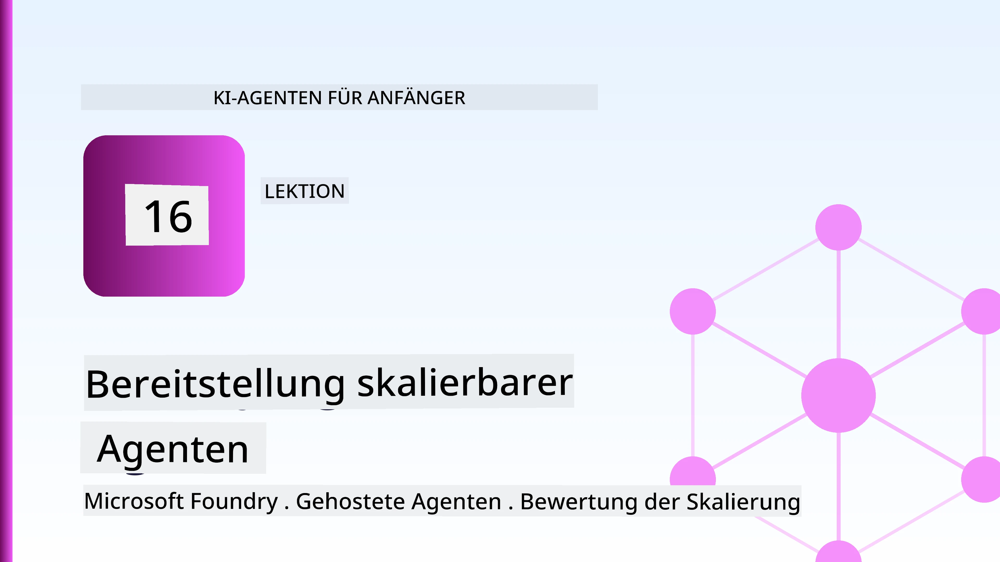
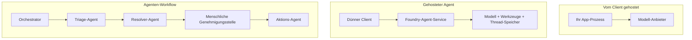
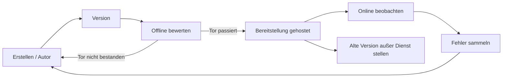
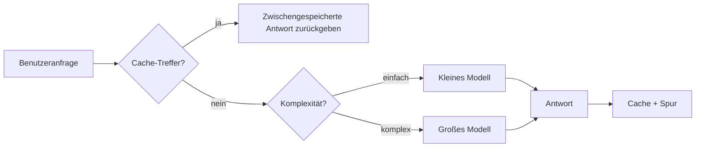
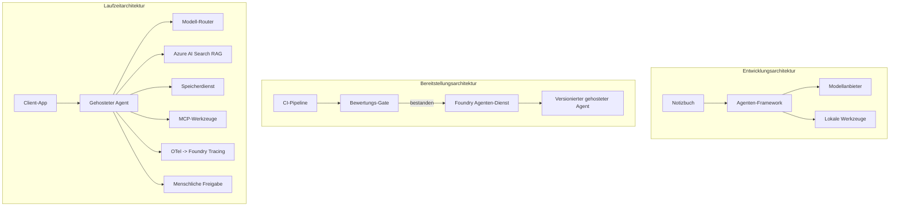

# Skalierbare Agenten mit Microsoft Foundry bereitstellen



Bis zu diesem Punkt im Kurs haben Sie Agenten gebaut, die auf Ihrem Laptop laufen, innerhalb eines Notebooks, gesteuert durch `az login` und einige Umgebungsvariablen. Das ist genau der richtige Weg zum Lernen. Es ist nicht der richtige Weg, um einen Agenten zu betreiben, von dem Tausende Kunden um 3 Uhr morgens abhängen.

Diese Lektion behandelt die Lücke zwischen "es funktioniert auf meinem Rechner" und "es funktioniert zuverlässig und erschwinglich in der Produktion." Wir schließen diese Lücke mit **Microsoft Foundry** und dem **Microsoft Foundry Agent Service**, und wir tun dies, indem wir einen echten Kundensupport-Agenten bauen, der Werkzeuge, Abruf, Speicher, Bewertung und Überwachung hat.

## Einführung

Diese Lektion behandelt:

- Den Unterschied zwischen einem **Prototyp-Agenten** und einem **bereitgestellten Agenten** und warum der Übergang hauptsächlich alles *umlaufende* um das Modell betrifft.
- **Bereitstellungsmuster** für Agenten: client-seitig gehostet, service-seitig gehostet (Hosted Agents) und workflow-orchestriert.
- Den **Agentenlebenszyklus** auf Microsoft Foundry — erstellen, versionieren, bereitstellen, bewerten, beobachten, ausmustern.
- **Skalierungsstrategien**: Modell-Routing, Caching, Gleichzeitigkeit und zustandslose Gestaltung.
- **Beobachtbarkeit** mit OpenTelemetry und Foundry-Tracing.
- **Kostenoptimierung** durch Modellauswahl, Routing und Bewertungstore.
- **Enterprise-Aspekte**: Governance, menschliche Zustimmung und den sicheren Betrieb von MCP-Servern in der Produktion.

## Lernziele

Nach Abschluss dieser Lektion wissen Sie, wie man:

- Das richtige Bereitstellungsmuster für eine gegebene Agentenarbeitslast auswählt.
- Einen Agenten im Microsoft Foundry Agent Service so bereitstellt, dass er versioniert, verwaltet und beobachtbar ist.
- Einen Agenten für Tracing instrumentiert und eine Bewertungspipeline verdrahtet, die vor jeder Veröffentlichung läuft.
- Modell-Routing und Caching anwendet, um Latenz und Kosten im großen Maßstab unter Kontrolle zu halten.
- Ein menschliches Zustimmungstor für Aktionen mit hohem Risiko hinzufügt und einen MCP-Server produktionstauglich integriert.

## Voraussetzungen

Diese Lektion setzt voraus, dass Sie die vorherigen Lektionen abgeschlossen haben und vertraut sind mit:

- Dem Bau von Agenten mit dem [Microsoft Agent Framework](../14-microsoft-agent-framework/README.md) (Lektion 14).
- [Werkzeugnutzung](../04-tool-use/README.md) (Lektion 4) und [Agentic RAG](../05-agentic-rag/README.md) (Lektion 5).
- [Agentenspeicher](../13-agent-memory/README.md) (Lektion 13) und [Agentic Protocols / MCP](../11-agentic-protocols/README.md) (Lektion 11).
- [Beobachtbarkeit und Bewertung](../10-ai-agents-production/README.md) (Lektion 10) — diese Lektion baut direkt darauf auf.

Außerdem benötigen Sie:

- Ein **Azure-Abonnement** und ein **Microsoft Foundry-Projekt** mit mindestens einem bereitgestellten Chatmodell.
- Die **Azure CLI** authentifiziert (`az login`).
- Python 3.12+ und die im Repository befindlichen Pakete in [`requirements.txt`](../../../requirements.txt).

## Vom Prototyp zur Produktion: Was sich tatsächlich ändert

Ein Prototyp-Agent und ein Produktionsagent teilen sich die gleiche Kernschleife — denken, Werkzeuge aufrufen, antworten. Was sich ändert, ist alles, was um diese Schleife herum aufgebaut ist. Das Modell macht vielleicht 20 % eines Produktionsagenten aus; die anderen 80 % sind das operationale Gerüst.

| Anliegen | Prototyp | Produktion |
| --- | --- | --- |
| **Hosting** | Läuft in deinem Notebook | Läuft als gehosteter Dienst, versioniert und ausgerollt |
| **Identität** | Dein `az login`-Token | Managed Identity mit scoped RBAC |
| **Status** | Im Speicher, beim Neustart verloren | Externalisiert (Thread Store, Memory Service) |
| **Fehler** | Du siehst den Traceback | Wiederholungen, Ausweichstrategien, Dead-Letter, Alarme |
| **Kosten** | "Es sind ein paar Cent" | Pro Anfrage verfolgt, geroutet, gecached, budgetiert |
| **Qualität** | Du beurteilst die Ausgabe visuell | Automatisch vor jeder Veröffentlichung bewertet |
| **Vertrauen** | Du genehmigst jede Aktion | Richtlinie + Mensch-in-der-Schleife für risikoreiche Aktionen |

Merken Sie sich diese Tabelle. Jeder Abschnitt unten ordnet sich einer dieser Zeilen zu.

## Agenten-Bereitstellungsmuster

Es gibt drei Muster, die Sie verwenden werden, oft in Kombination.

### 1. Client-seitig gehostete Agenten

Das Agent-Objekt lebt im *Anwendungsprozess Ihrer Applikation*. Ihr Code ruft den Modellanbieter direkt auf; die Denkschleife läuft in Ihrem Dienst. Das ist das Vorgehen, das jede vorherige Lektion gemacht hat.

- **Verwendung**: wenn Sie volle Kontrolle über die Schleife, kundenspezifische Middleware benötigen oder den Agenten in eine bestehende Backend-Anwendung einbetten.
- **Abwägung**: Sie sind selbst für Skalierung, Status und Resilienz verantwortlich.

### 2. Gehostete Agenten (Foundry Agent Service)

Der Agent wird *als Ressource registriert* in Microsoft Foundry. Foundry hostet die Denkschleife, speichert Threads, erzwingt Inhalts-Sicherheit und RBAC und macht den Agenten im Foundry-Portal sichtbar. Ihre Anwendung wird zum dünnen Client, der Threads anlegt und Antworten liest.

- **Verwendung**: wenn Sie Haltbarkeit, eingebaute Beobachtbarkeit, Governance und geringeren operativen Aufwand wünschen.
- **Abwägung**: weniger niedrige Kontrolle zugunsten einer verwalteten Laufzeitumgebung.

### 3. Agenten-Workflows

Mehrere Agenten (und Werkzeuge) werden zu einem Graphen mit explizitem Kontrollfluss zusammengesetzt — sequenzielle Schritte, Verzweigungen, Knoten mit menschlicher Zustimmung und dauerhafte Checkpoints, die anhalten und fortsetzen können. Dies ist die Microsoft Agent Framework **Workflows**-Fähigkeit, angewandt auf Bereitstellungsebene.

- **Verwendung**: wenn eine einzelne Aufgabe mehrere spezialisierte Agenten umfasst oder einen Zustimmungs-Schritt in der Mitte benötigt.
- **Abwägung**: mehr bewegliche Teile; benötigt Beobachtbarkeit auf Orchestrierungsebene.



## Der Agentenlebenszyklus auf Microsoft Foundry

Einen Agenten bereitzustellen bedeutet keinen einmaligen `push`. Es ist eine Schleife und ähnelt stark einem Software-Releasezyklus, weil es genau das ist.



Die zentrale Idee, übernommen aus [Lektion 10](../10-ai-agents-production/README.md): **Offline-Bewertung ist ein Tor, kein Nachgedanke.** Eine neue Agenten-Version wird nicht ausgeliefert, wenn sie Ihre Bewertungsgrenzen nicht erfüllt. Online-Beobachtbarkeit speist dann reale Fehler ins Offline-Testset zurück. Das ist die gesamte Schleife.

## Skalierungsstrategien

Das Skalieren eines Agenten unterscheidet sich vom Skalieren einer zustandslosen Web-API, weil jede Anfrage mehrere teure Modell- und Werkzeugaufrufe auslösen kann. Vier Techniken tragen die Hauptlast.

**Zustandslose Anfragenverarbeitung.** Bewahren Sie keinen benutzerspezifischen Status im Prozessspeicher auf. Speichern Sie Konversations-Threads im Foundry Thread Store oder einem Speicher-Service, sodass jede Instanz jede Anfrage bedienen kann. Dies ermöglicht horizontale Skalierung — mehr Instanzen hinzufügen, keine Sticky Sessions.

**Modell-Routing.** Nicht jede Anfrage benötigt Ihr leistungsfähigstes (und teuerstes) Modell. Routen Sie einfache Anfragen — Intent-Klassifikation, kurze Faktenantworten — an ein kleines, schnelles Modell und reservieren Sie das große Modell für echtes Denken. Foundrys **Model Router** kann das für Sie übernehmen, oder Sie implementieren selbst einen leichten Klassifizierer. Die DIY-Version bauen Sie im Labor.

**Antwort-Caching.** Viele Supportanfragen sind nahezu Duplikate („Wie setze ich mein Passwort zurück?“). Cachen Sie Antworten auf häufige Fragen und liefern Sie diese ohne Modellabfrage aus. Selbst eine moderate Cache-Trefferquote reduziert Kosten und Latenz deutlich.

**Gleichzeitigkeit und Rückdruck.** Modellanbieter haben Limits für Anfrage-Raten. Begrenzen Sie Ihre Gleichzeitigkeit, verwenden Sie Wiederholungen mit exponentiellem Backoff und schlagen Sie sanft fehl (eine Warteschlangen-Antwort „Wir kümmern uns darum“ ist besser als ein 500).



## Beobachtbarkeit in der Produktion

Man kann nicht betreiben, was man nicht sieht. Wie in Lektion 10 behandelt, erzeugt das Microsoft Agent Framework **OpenTelemetry**-Traces nativ — jeder Modellaufruf, Werkzeugaufruf und Orchestrierungsschritt wird ein Span. In Produktion exportieren Sie diese Spans zu Microsoft Foundry (oder jedem OTel-kompatiblen Backend), damit Sie:

- Eine einzelne Kundenbeschwerde End-to-End über jeden Modell- und Werkzeugaufruf nachverfolgen können.
- Die p50/p95-Latenz und Kosten pro Anfrage über die Zeit beobachten können.
- Vor Fehler-Rate-Spitzen und Kosten-Anomalien warnen können, noch bevor Ihre Nutzer (oder Ihr Finanzteam) das bemerken.

```python
from agent_framework.observability import get_tracer

tracer = get_tracer()

with tracer.start_as_current_span("support_request") as span:
    span.set_attribute("customer.tier", "enterprise")
    span.set_attribute("routed.model", "gpt-5-nano")
    # Die Ausführung des Agenten wird innerhalb dieses Bereichs automatisch verfolgt
```

Attribute wie `customer.tier` und `routed.model` verwandeln eine Wand von Traces in beantwortbare Fragen („Werden Unternehmenskunden zu oft zum kleinen Modell geroutet?“).

## Kostenoptimierung

Die Kosten in Produktionsagenten werden von Tokens dominiert. Drei Hebel, geordnet nach Wirkung:

1. **Modell richtig dimensionieren.** Ein kleines Modell, das Ihr Bewertungstor besteht, ist fast immer günstiger als ein großes, das ebenfalls besteht. Nutzen Sie Bewertung, um zu *beweisen*, dass das kleine Modell gut genug ist, statt vorsichtshalber das größte Modell zu wählen.
2. **Nach Komplexität routen.** Wie oben — zahlen Sie große Modellkosten nur für Anfragen, die große Modellüberlegung benötigen.
3. **Aggressiv cachen.** Der günstigste Modellaufruf ist der, den Sie nie machen.

Bewertungstore und Kostenkontrolle sind dieselbe Disziplin aus zwei Perspektiven: Bewertung gibt Ihnen die *Qualitätsuntergrenze*, Routing und Caching halten die *Kosten* möglichst nah an dieser Untergrenze.

## Enterprise-Bereitstellungsaspekte

**Governance.** Gehostete Agenten erben Foundrys RBAC, Inhalts-Sicherheit und Audit-Logging. Geben Sie jedem Agenten eine Managed Identity mit minimalen benötigten Berechtigungen — nur Leserechte für die Wissensbasis, scope-basierten Zugriff auf die Ticket-API, nicht mehr.

**Mensch-in-der-Schleife.** Manche Aktionen sind zu folgenreich, um sie komplett zu automatisieren – eine Rückerstattung ausstellen, ein Konto löschen, an die Rechtsabteilung eskalieren. Das Microsoft Agent Framework unterstützt **Zustimmung-erfordernde** Werkzeuge: der Agent schlägt die Aktion vor, die Ausführung pausiert, ein Mensch genehmigt oder lehnt ab, und der Workflow wird fortgesetzt. Sie haben das Primitive in [Lektion 6](../06-building-trustworthy-agents/README.md) gesehen; hier setzen Sie es produktiv ein.

**MCP in der Produktion.** [MCP](../11-agentic-protocols/README.md) ermöglicht es Ihrem Agenten, externe Werkzeuge über eine standardisierte Schnittstelle zu nutzen. In der Produktion behandeln Sie jeden MCP-Server als nicht vertrauenswürdige Grenze: fixieren Sie die Serverversion, betreiben Sie ihn mit einer scoped Identity, validieren Sie die Ausgaben und geben Sie niemals Geheimnisse preis. Ein MCP-Server ist eine Abhängigkeit, und Abhängigkeiten werden gepatcht, auditiert und rate-limitiert.



Diese drei Diagramme — Entwicklung, Bereitstellung, Laufzeit — zeigen denselben Agenten in drei Lebensphasen. Das folgende Labor führt Sie durch den Bau.

## Praktisches Labor: Ein produktionsreifer Kundensupport-Agent

Öffnen Sie [`code_samples/16-python-agent-framework.ipynb`](./code_samples/16-python-agent-framework.ipynb) und arbeiten Sie es komplett durch. Sie bauen einen **Contoso-Kundensupport-Agenten** mit allen produktionsrelevanten Aspekten:

1. **Werkzeugaufrufe** — Bestellstatus abfragen und Supporttickets eröffnen.
2. **RAG** — beantwortet Richtlinienfragen aus einer Wissensbasis (Azure AI Search, mit einem In-Memory-Fallback, damit das Notebook ohne Search-Ressource läuft).
3. **Speicher** — merkt sich den Kunden über Gesprächsverläufe hinweg.
4. **Modell-Routing** — ein Komplexitäts-Klassifizierer routet jede Anfrage an ein kleines oder großes Modell.
5. **Antwort-Caching** — wiederholte Fragen werden aus dem Cache bedient.
6. **Menschliche Zustimmung** — Rückerstattungen über einem Schwellenwert pausieren für menschliche Freigabe.
7. **Bewertungspipeline** — ein kleines Offline-Testset bewertet den Agenten und wirkt als Freigabetor.
8. **Beobachtbarkeit** — OpenTelemetry-Tracing für jede Anfrage.

### Durchgang

Das Notebook ist so organisiert, dass jedes produktionsrelevante Thema ein eigenständiger, ausführbarer Abschnitt ist. Das Herzstück ist der Request-Handler mit Routing plus Caching:

```python
async def handle_support_request(query: str, customer_id: str) -> str:
    # 1. Vom Cache bedienen, wenn möglich.
    cached = response_cache.get(normalize(query))
    if cached:
        return cached

    # 2. Nach Komplexität routen, um Kosten zu kontrollieren.
    model = "gpt-5-nano" if is_simple(query) else "gpt-5-mini"

    # 3. Den Agenten innerhalb eines Trace-Spans für Beobachtbarkeit ausführen.
    with tracer.start_as_current_span("support_request") as span:
        span.set_attribute("routed.model", model)
        span.set_attribute("customer.id", customer_id)
        response = await support_agent.run(query, model=model)

    # 4. Zwischenspeichern und zurückgeben.
    response_cache.set(normalize(query), response.text)
    return response.text
```

Das Bewertungstor, das eine Freigabe schützt, sieht so aus:

```python
async def evaluation_gate(agent, test_cases, threshold: float = 0.8) -> bool:
    passed = 0
    for case in test_cases:
        result = await agent.run(case["input"])
        if score_response(result.text, case["expected"]) >= 0.8:
            passed += 1
    pass_rate = passed / len(test_cases)
    print(f"Evaluation pass rate: {pass_rate:.0%} (gate: {threshold:.0%})")
    return pass_rate >= threshold  # nur bereitstellen, wenn das Tor bestanden ist
```

Lesen Sie jede Zeile — das Notebook hält die Primitiven bewusst klein, damit nichts hinter einem Framework-Aufruf verborgen ist.

## Validierung eines bereitgestellten Agenten mit Smoke-Tests

Das oben dargestellte Bewertungstor läuft *offline* gegen Ihr Agentenobjekt. Sobald der Agent als Gehosteter Agent bereitgestellt ist, brauchen Sie noch einen weiteren, noch günstigeren Check: **antwortet der bereitgestellte Endpunkt tatsächlich?**

Eine „erfolgreiche“ Bereitstellung beweist nur, dass die Steuerungsebene die Definition akzeptiert hat – sie beweist nicht, dass der Agent antwortet. Eine fehlende Abhängigkeit, fehlerhaftes Modell-Routing oder eine abgelaufene Verbindung können zu einer grünen Bereitstellung führen, die nichts zurückgibt. Ein **Smoke-Test** fängt dies in Sekunden bei jeder Bereitstellung ab, ohne die Kosten einer vollständigen Bewertung.

Dieses Repository liefert eine einsatzbereite Smoke-Test-Pipeline, basierend auf der [AI Smoke Test](https://github.com/marketplace/actions/ai-smoke-test) GitHub Action:

- **Katalog** — [`tests/lesson-16-smoke-tests.json`](../../../tests/lesson-16-smoke-tests.json) enthält Eingaben und Behauptungen für den Contoso-Support-Agenten (fundierte Policy-Antworten, eine Bestellauskunft, themenbezogen bleiben und Mehrfach-Thread-Kohärenz). Kataloge für Agenten anderer Lektionen sind daneben zu finden — siehe [`tests/README.md`](../tests/README.md).
- **Workflow** — [`.github/workflows/smoke-test.yml`](../../../.github/workflows/smoke-test.yml) meldet sich mit Azure OIDC an und POSTet jede Eingabe an den Responses-Endpunkt des Agenten, und schlägt den Job bei jeder fehlschlagenden Behauptung fehl.

```yaml
- name: Smoke-test hosted agent
  uses: JFolberth/ai-smoketest@v1
  with:
    project_endpoint: ${{ inputs.project_endpoint }}
    agent_name: ContosoSupportAgent
    tests_file: tests/lesson-16-smoke-tests.json
```


Führen Sie es im **Actions**-Tab aus, sobald Ihr Agent bereitgestellt ist, und geben Sie Ihren Foundry-Projekt-Endpunkt und den Agentennamen an. Die föderierte Identität benötigt die Rolle **Azure AI User** im Foundry-Projektbereich. Denken Sie an die Schichten wie eine Pyramide: Smoke Tests (erreichbar und antwortend?) werden bei jeder Bereitstellung ausgeführt, Offline-Bewertungen (gut genug zum Ausliefern?) vor der Freigabe, und Online-Bewertungen (wie schlägt es sich in der Praxis?) laufen kontinuierlich.

## Wissensüberprüfung

Testen Sie Ihr Verständnis, bevor Sie zur Aufgabe übergehen.

**1. Wie viel eines Produktionsagenten macht ungefähr „das Modell“ aus, und was ist der Rest?**

<details>
<summary>Antwort</summary>

Das Modell ist eine Minderheit des Systems – oft wird etwa 20 % genannt. Der Rest ist das operationelle Gerüst: Hosting und Versionierung, Identität und RBAC, externalisierter Zustand, Fehlerbehandlung, Kostenüberwachung, Bewertung und menschliche Kontrollschleifen. Der Schritt zur Produktion besteht hauptsächlich darin, alles *um* die Schleife des Denkens herum aufzubauen.
</details>

**2. Wann würden Sie einen Hosted Agent einem client-gehosteten Agenten vorziehen?**

<details>
<summary>Antwort</summary>

Wenn Sie eine verwaltete Laufzeit mit eingebauter Haltbarkeit (Threads, die fortbestehen und wieder aufgenommen werden können), Beobachtbarkeit, Inhaltssicherheit und RBAC wünschen und bereit sind, etwas niedrigstufige Kontrolle über die Denk-Schleife gegen eine geringere operative Angriffsfläche einzutauschen. Ein client-gehosteter Agent ist vorzuziehen, wenn Sie volle Kontrolle über die Schleife brauchen oder den Agenten in ein bestehendes Backend einbetten.
</details>

**3. Warum muss ein skalierbarer Agent zustandslos im eigenen Prozessspeicher sein?**

<details>
<summary>Antwort</summary>

Damit jede Instanz jede Anfrage bearbeiten kann, was horizontale Skalierung ohne Sticky Sessions ermöglicht. Der pro Benutzer geführte Gesprächszustand wird in einem Thread-Store oder Speicherdienst externalisiert. Wenn der Zustand im Prozessspeicher lebte, würde er beim Neustart verloren gehen und Sie könnten die Last nicht frei verteilen.
</details>

**4. Welches Problem löst das Model Routing, und wie steht es im Zusammenhang mit der Bewertung?**

<details>
<summary>Antwort</summary>

Routing schickt einfache Anfragen an ein kleines, günstiges, schnelles Modell und reserviert das große Modell für echte Argumentationen, kontrolliert dabei sowohl Latenz als auch Kosten. Es steht im Zusammenhang mit der Bewertung, weil die Bewertung *beweist*, dass das kleine Modell für eine Klasse von Anfragen gut genug ist – Routing ohne Bewertung ist eine Vermutung.
</details>

**5. Was ist ein „Evaluation Gate“ und wo sitzt es im Lebenszyklus?**

<details>
<summary>Antwort</summary>

Ein Evaluation Gate führt einen Offline-Testsatz gegen eine neue Agenten-Version aus und blockiert die Bereitstellung, sofern die Bestehensquote nicht einen Schwellenwert überschreitet. Es liegt zwischen „Version“ und „Deploy“ im Lebenszyklus und macht Qualität zur Voraussetzung für die Freigabe statt zu etwas, das man nach dem Ausliefern prüft.
</details>

**6. Warum sollte ein MCP-Server in der Produktion als nicht vertrauenswürdige Grenze behandelt werden?**

<details>
<summary>Antwort</summary>

Weil es eine externe Abhängigkeit ist, in die Ihr Agent aufruft. Sie sollten dessen Version festlegen, ihn mit einer scoped Identity laufen lassen, seine Ausgaben validieren, eine Ratenbegrenzung anwenden und niemals Geheimnisse preisgeben – die gleiche Disziplin wie bei jeder Drittanbieter-Abhängigkeit. Seine Ausgaben fließen in die Argumentation Ihres Agenten ein, daher ist unvalidiertes Vertrauen ein Sicherheitsrisiko.
</details>

**7. Welche einzelne Änderung hat normalerweise den größten Einfluss auf die Kosten eines Produktionsagenten, und warum?**

<details>
<summary>Antwort</summary>

Das richtige Modellmaß — das kleinste Modell zu verwenden, das Ihr Evaluation Gate besteht. Die Kosten werden durch Tokens dominiert, und ein kleineres Modell, das die Qualitätsanforderung erfüllt, ist fast immer günstiger als ein größeres. Caching und Routing reduzieren die Kosten weiter, aber die Wahl des richtigen Basismodells hat den größten primären Effekt.
</details>

**8. Welche Rolle spielen Span-Attribute wie `customer.tier` und `routed.model` in der Beobachtbarkeit?**

<details>
<summary>Antwort</summary>

Sie verwandeln rohe Traces in beantwortbare Geschäftsanfragen. Ohne Attribute hat man eine Wand von Spans; mit ihnen kann man fragen: „Werden Unternehmenskunden zu oft zum kleinen Modell geleitet?“ oder „Welches Modell bearbeitet unsere langsamsten Anfragen?“ Attribute sind der Weg, wie man Telemetrie nach den Dimensionen schneidet, die für den Betrieb wichtig sind.
</details>

## Aufgabe

Nehmen Sie den Kundensupport-Agenten aus dem Labor und härten Sie ihn für ein spezifisches Szenario ab: **ein Agent für Abo-Rechnungsunterstützung in einem SaaS-Unternehmen.**

Ihre Einreichung sollte:

1. **Die Werkzeuge austauschen** durch abrechnungsrelevante: `get_subscription_status`, `get_invoice` und `issue_credit` (Gutschriften über 50 $ erfordern menschliche Genehmigung).
2. **Drei RAG-Dokumente hinzufügen**, die die Rückerstattungsrichtlinie, den Abrechnungszyklus und die Kündigungsrichtlinie des Unternehmens abdecken.
3. **Das Bewertungsspektrum auf mindestens acht Fälle erweitern**, darunter mindestens zwei, die den menschlichen Genehmigungspfad auslösen *sollten*, und bestätigen, dass Ihr Evaluation Gate korrekt besteht oder nicht besteht.
4. **Einen Kostenbericht hinzufügen**: Nach zehn gemischten Anfragen durch den Agenten ausführen, ausgeben, wie viele an das kleine Modell, wie viele an das große Modell und wie viele aus dem Cache bedient wurden.

Schreiben Sie einen kurzen Absatz (in einer Markdown-Zelle), der erklärt, welche Modell-Routing-Regel Sie gewählt haben und wie Sie diese mit realem Datenverkehr validieren würden. Es gibt keine einzig richtige Antwort – bewertet wird, ob die Produktionsaspekte stimmig verknüpft sind.

## Zusammenfassung

In dieser Lektion haben Sie einen Agenten mit Microsoft Foundry vom Prototypen in die Produktion gebracht:

- Der Sprung zur Produktion dreht sich vor allem um das **operationelle Gerüst** um das Modell – Hosting, Identität, Zustand, Fehlerbehandlung, Kosten, Qualität und Vertrauen.
- Sie haben die drei **Bereitstellungsmuster** kennengelernt – client-gehostet, Hosted Agents und Agent Workflows – und wann sie jeweils passen.
- Sie sind den **Agenten-Lebenszyklus** durchlaufen, bei dem Offline-**Bewertung als Freigabetor** wirkt und Online-Beobachtbarkeit Fehler zurück in den Testsatz speist.
- Sie haben **Skalierungsstrategien** angewandt – zustandsloses Design, Model Routing, Caching und begrenzte Parallelität – und sie mit **Kostenoptimierung** verbunden.
- Sie haben **Enterprise-Kontrollen** eingebaut: RBAC, menschliche Genehmigungsschleifen und productionssichere MCP-Integration.
- Sie haben einen **produktionsbereiten Kundensupport-Agenten** gebaut, der all diese Aspekte in lauffähigem Code verknüpft.

Die nächste Lektion geht den umgekehrten Weg: Statt Agenten in die Cloud hochzuskalieren, bringen Sie sie *runter* auf eine einzelne Entwickler-Maschine und führen sie ganz lokal aus.

## Zusätzliche Ressourcen

- <a href="https://learn.microsoft.com/azure/ai-foundry/what-is-azure-ai-foundry" target="_blank">Microsoft Foundry Dokumentation</a>
- <a href="https://learn.microsoft.com/azure/ai-foundry/agents/overview" target="_blank">Übersicht zum Microsoft Foundry Agent Service</a>
- <a href="https://aka.ms/ai-agents-beginners/agent-framework" target="_blank">Microsoft Agent Framework</a>
- <a href="https://learn.microsoft.com/azure/ai-foundry/concepts/model-router" target="_blank">Model Router in Microsoft Foundry</a>
- <a href="https://learn.microsoft.com/azure/search/search-what-is-azure-search" target="_blank">Azure AI Search</a>
- <a href="https://opentelemetry.io/" target="_blank">OpenTelemetry</a>
- <a href="https://github.com/marketplace/actions/ai-smoke-test" target="_blank">AI Smoke Test GitHub Action</a>
- <a href="https://modelcontextprotocol.io/" target="_blank">Model Context Protocol (MCP)</a>

## Vorherige Lektion

[Building Computer Use Agents (CUA)](../15-browser-use/README.md)

## Nächste Lektion

[Creating Local AI Agents](../17-creating-local-ai-agents/README.md)

---

<!-- CO-OP TRANSLATOR DISCLAIMER START -->
**Haftungsausschluss**:
Dieses Dokument wurde mit dem KI-Übersetzungsdienst [Co-op Translator](https://github.com/Azure/co-op-translator) übersetzt. Obwohl wir uns um Genauigkeit bemühen, beachten Sie bitte, dass automatisierte Übersetzungen Fehler oder Ungenauigkeiten enthalten können. Das Originaldokument in seiner Ursprungssprache gilt als maßgebliche Quelle. Bei kritischen Informationen wird eine professionelle menschliche Übersetzung empfohlen. Wir übernehmen keine Haftung für Missverständnisse oder Fehlinterpretationen, die aus der Verwendung dieser Übersetzung entstehen.
<!-- CO-OP TRANSLATOR DISCLAIMER END -->