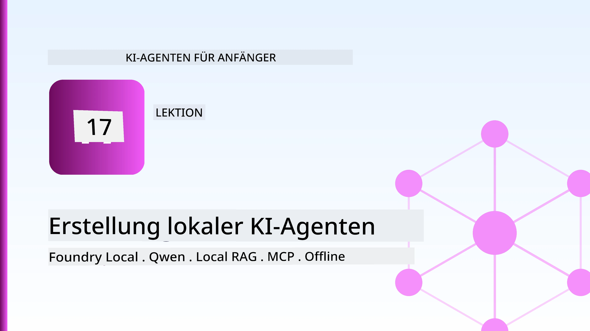
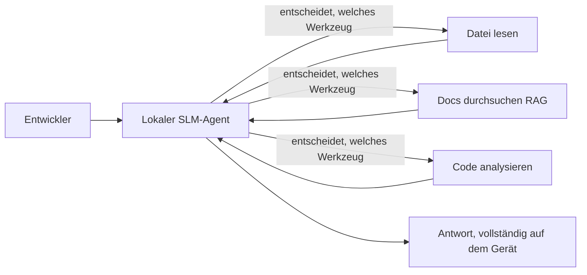
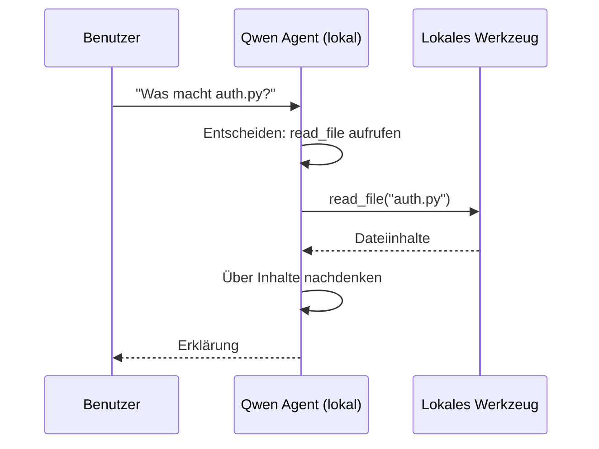
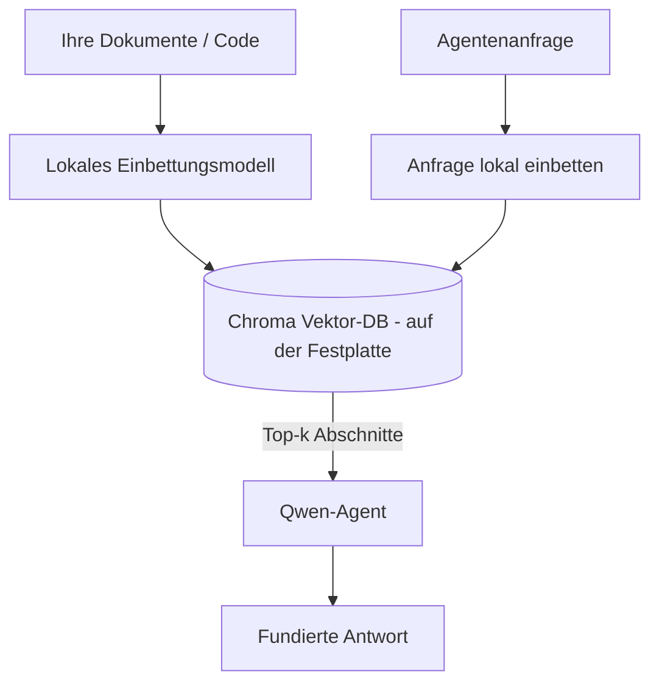
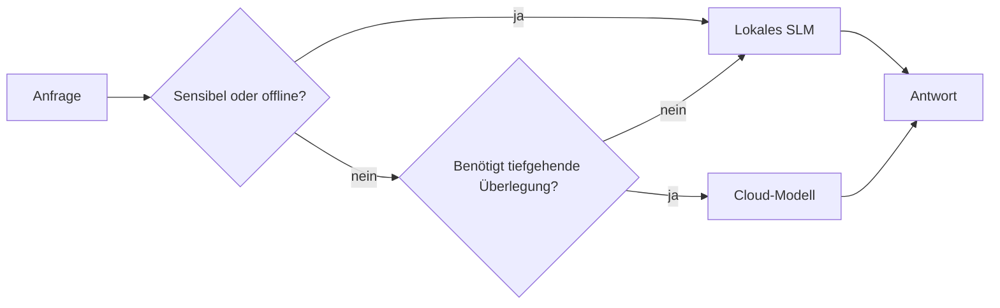

# Lokale KI-Agenten mit Microsoft Foundry Local und Qwen erstellen



Die vorherige Lektion hat Agenten *in die Cloud* skaliert. Diese bringt sie *herunter* auf eine einzelne Maschine. Am Ende hast du einen funktionierenden Ingenieurassistenten, der schlussfolgert, Werkzeuge aufruft, deine Dateien liest und deine Dokumentation durchsucht — **ohne einen einzigen Cloud-Inferenzaufruf.**

Warum sollte man das wollen? Drei Gründe, die in der realen Ingenieursarbeit ständig auftauchen:

- **Datenschutz.** Der Code und die Dokumente verlassen niemals die Maschine. Kein Prompt, kein Ausschnitt, keine Kundendaten überschreiten die Netzwerkgrenze.
- **Kosten.** Lokale Inferenz verursacht keine Abrechnung pro Token. Du kannst den ganzen Tag für den Preis des Stroms iterieren.
- **Offline.** Im Flugzeug, in einer sicheren Einrichtung oder bei einem Ausfall funktioniert der Agent trotzdem.

Die Einschränkung ist, dass du ein Spitzen-Cloud-Modell gegen ein **Small Language Model (SLM)** eintauschst, das auf deiner CPU, GPU oder NPU läuft. Diese Lektion dreht sich darum, Agenten zu bauen, die innerhalb dieser Einschränkung *gut* sind, anstatt so zu tun, als gäbe es keine.

## Einführung

Diese Lektion behandelt:

- **Small Language Models (SLMs)** — was sie sind, wo sie glänzen und wo nicht.
- **Microsoft Foundry Local** — eine Laufzeitumgebung, die Modelle lokal herunterlädt und über eine **OpenAI-kompatible API** bedient.
- **Qwen Funktionsaufruf-Modelle** — SLMs, die zuverlässig Werkzeugaufrufe erzeugen, was lokale *Agenten* (nicht nur lokalen Chat) erst möglich macht.
- **Lokale Werkzeuge, lokale RAG und lokales MCP** — die dem Agenten Funktionalität ohne Cloud geben.
- **Hybride Muster** — wann man lokal arbeitet und wann man die Cloud nutzt.

## Lernziele

Nach Abschluss dieser Lektion weißt du, wie man:

- Die Kompromisse von SLMs erklären und passende Anwendungsfälle für lokale Agenten auswählen.
- Ein Qwen-Modell lokal mit Foundry Local bereitstellen und über den OpenAI-kompatiblen Endpunkt darauf zugreifen.
- Einen Werkzeug-aufrufenden Agenten bauen, der komplett auf deiner Workstation läuft.
- Lokales RAG über eigene Dokumente mit einer lokalen Vektordatenbank (Chroma) hinzufügen.
- Den Agenten mit einem lokalen MCP-Server verbinden und Hybrid-Lokal/Cloud-Designs reflektieren.

## Voraussetzungen

Diese Lektion setzt voraus, dass du die vorherigen Lektionen abgeschlossen hast und vertraut bist mit:

- [Werkzeugnutzung](../04-tool-use/README.md) (Lektion 4) und [Agentic RAG](../05-agentic-rag/README.md) (Lektion 5).
- [Agentenprotokolle / MCP](../11-agentic-protocols/README.md) (Lektion 11).
- Dem [Microsoft Agent Framework](../14-microsoft-agent-framework/README.md) (Lektion 14).

Du benötigst außerdem:

- Eine Entwickler-Workstation. **8 GB RAM sind ein realistisches Minimum**; 16 GB+ sind komfortabel. Eine GPU oder NPU hilft, ist aber nicht zwingend.
- **Microsoft Foundry Local** installiert (siehe Abschnitt zur Einrichtung unten).
- Python 3.12+ und die Pakete im Repository [`requirements.txt`](../../../requirements.txt), plus `foundry-local-sdk`, `openai` und `chromadb` für diese Lektion.

## Small Language Models: Das richtige Werkzeug für lokale Arbeit

Ein Spitzen-Cloud-Modell hat hunderte Milliarden Parameter und ein Rechenzentrum dahinter. Ein SLM hat ein paar Milliarden Parameter und muss in den RAM deines Laptops passen. Dieser Unterschied setzt klare Erwartungen.

**SLMs sind gut bei:**

- Strukturierten, begrenzten Aufgaben — Klassifikation, Extraktion, Zusammenfassung eines bekannten Dokuments.
- **Werkzeugaufrufen** — entscheiden, welche Funktion mit welchen Argumenten aufgerufen wird.
- Schneller, günstiger, privater Iteration auf deinen eigenen Daten.

**SLMs sind schwächer bei:**

- Offenem, mehrstufigem Schließen über großen Kontext.
- Allgemeinem Weltwissen (sie haben weniger gesehen und vergessen mehr).

Die Gewinnstrategie für lokale Agenten lautet daher: **Lass das SLM orchestrieren und die Werkzeuge die schwere Arbeit erledigen.** Das Modell muss deinen Code nicht *kennen* — es muss wissen, wann `read_file` und `search_docs` aufzurufen sind. Das spielt direkt in die Stärken eines SLM.



## Microsoft Foundry Local

**Microsoft Foundry Local** ist eine leichtgewichtige Laufzeitumgebung, die Modelle komplett auf deinem Rechner herunterlädt, verwaltet und bereitstellt. Die wichtigste Funktion für uns ist, dass es einen **OpenAI-kompatiblen HTTP-Endpunkt** bereitstellt — was bedeutet, dass das OpenAI SDK und der OpenAI-Client des Microsoft Agent Frameworks nur `base_url` ändern müssen, um gegen Foundry Local zu arbeiten. Alles, was du über Agentenbau gelernt hast, überträgt sich direkt; nur der Endpunkt verschiebt sich von der Cloud zu `localhost`.

Foundry Local wählt auch automatisch die beste Modellversion für deine Hardware aus — eine CPU-Version, eine CUDA/GPU-Version oder eine NPU-Version — so musst du nicht pro Maschine manuell optimieren.

### Einrichtung

Installiere Foundry Local (siehe die [Dokumentation](https://learn.microsoft.com/azure/ai-foundry/foundry-local/) für dein Betriebssystem), und überprüfe dann, ob es funktioniert:

```bash
# Installieren (Beispiel; folgen Sie der Dokumentation für Ihre Plattform)
winget install Microsoft.FoundryLocal      # Windows
# brew install microsoft/foundrylocal/foundrylocal   # macOS

# Laden Sie ein Qwen-Modell herunter und führen Sie es aus, dann starten Sie den lokalen Dienst
foundry model run qwen2.5-7b-instruct
foundry service status
```

Wenn der Dienst läuft, hast du einen lokalen, OpenAI-kompatiblen Endpunkt (typischerweise `http://localhost:PORT/v1`). Das Notebook verwendet das `foundry-local-sdk`, um den Endpunkt automatisch zu finden, sodass du den Port nicht fest codieren musst.

## Qwen Funktionsaufruf: Warum das wichtig ist

Ein Agent ist nur ein Agent, wenn er Werkzeuge aufrufen kann. Viele SLMs können chatten, produzieren aber unzuverlässige, fehlerhafte Werkzeugaufrufe. **Qwen**-Modelle sind für Funktionsaufrufe trainiert und erzeugen konsequent wohlgeformte Werkzeugaufrufstrukturen — genau das macht aus einem lokalen Chatmodell einen lokalen *Agenten*.

Der Ablauf ist die bekannte Werkzeugaufruf-Schleife, die du schon kennst, nur lokal ausgeführt:



## Lokales RAG

Dokumentationssuche ist das, was lokale Agenten wirklich auszeichnet. Anstatt zu hoffen, dass das SLM deine Framework-Dokumentation auswendig gelernt hat, bettest du diese Dokumente in eine **lokale Vektordatenbank** ein und lässt den Agenten die relevanten Ausschnitte bei Bedarf abrufen.

Wir verwenden **Chroma**, einen eingebetteten Vektorspeicher, der im Prozess läuft und keinen separaten Server braucht. Die Pipeline ist vollständig lokal: lokales Einbettungsmodell → lokale Vektoren → lokale Suche → lokales SLM.



Das ist dasselbe Agentic RAG-Muster aus Lektion 5 — der einzige Unterschied ist, dass alle Komponenten auf deinem Rechner laufen.

## Lokale MCP-Server

[MCP](../11-agentic-protocols/README.md) ist ein Transport, kein Cloud-Service. Ein MCP-Server kann lokal als Prozess auf `stdio` laufen und Werkzeuge über das Standardprotokoll dem Agenten bereitstellen. So kannst du das wachsende Ökosystem von MCP-Servern — Dateisystemzugriff, Git-Operationen, Datenbankabfragen — komplett offline nutzen.

Die Sicherheitslage ist anders als in der Cloud, aber nicht nicht vorhanden: Ein lokaler MCP-Server läuft mit den Benutzerrechten, also beschränke seinen Zugriff (zum Beispiel auf ein Projektverzeichnis, nicht deinen gesamten Home-Ordner) und behandle seine Ausgaben als Eingaben, die du validierst.

## Hybride Cloud-und-Lokal-Muster

Lokal zuerst heißt nicht nur lokal. Ausgereifte Systeme routen nach Sensibilität und Schwierigkeit:

| Situation | Wo es läuft |
| --- | --- |
| Sensibler Code/Daten oder offline | **Lokales SLM** |
| Einfache, begrenzte Aufgabe | **Lokales SLM** (günstig, schnell) |
| Schwieriges mehrstufiges Schließen bei nicht-sensiblen Daten | **Cloud-Modell** |
| Alles, bei einem Ausfall | **Lokales SLM** (sanfter Abfall) |

Das spiegelt die Idee des **Modell-Routings** aus Lektion 16 wider — nur dass eines der „Modelle“ jetzt dein eigener Rechner ist. Ein robustes Design fällt auf lokal zurück, wenn die Cloud nicht verfügbar ist, sodass der Agent in der Qualität sinkt, statt komplett auszufallen.



## Praxis: Ein lokaler Ingenieurassistent

Öffne [`code_samples/17-local-agent-foundry-local.ipynb`](./code_samples/17-local-agent-foundry-local.ipynb) und arbeite es durch. Du baust einen **lokalen Ingenieurassistenten**, der komplett auf deiner Workstation läuft und kann:

1. **Werkzeuge aufrufen** — über Qwen Funktionsaufrufe durch Foundry Local.
2. **Lokale Dateioperationen durchführen** — Dateien in einem Projektverzeichnis auflisten und lesen.
3. **Code analysieren** — einfache Metriken über eine Quelldatei berichten.
4. **Dokumentation durchsuchen** — lokales RAG über einen Dokumentenordner mit Chroma.
5. **MCP nutzen** — Verbindung zu einem lokalen MCP-Server (mit sanftem Überspringen, falls keiner konfiguriert ist).

Es wird zu keinem Zeitpunkt Cloud-Inferenz genutzt.

### Durchgang

Der Assistent verbindet sich über den OpenAI-kompatiblen Endpunkt mit Foundry Local, daher sieht der Agenten-Code fast identisch zu den Cloud-Lektionen aus — nur der Client ändert sich:

```python
from foundry_local import FoundryLocalManager
from openai import OpenAI

# Foundry Local entdeckt/lädt das Modell herunter und stellt uns einen lokalen Endpunkt zur Verfügung.
manager = FoundryLocalManager(\"qwen2.5-7b-instruct\")
client = OpenAI(base_url=manager.endpoint, api_key=manager.api_key)  # api_key ist ein lokaler Platzhalter
```

Die Werkzeuge sind gewöhnliche Python-Funktionen, die auf ein Projektverzeichnis beschränkt sind:

```python
def read_file(path: str) -> str:
    \"\"\"Read a file, but only inside the sandboxed project directory.\"\"\"
    full = (PROJECT_ROOT / path).resolve()
    if PROJECT_ROOT not in full.parents and full != PROJECT_ROOT:
        return \"Access denied: path is outside the project directory.\"
    return full.read_text(encoding=\"utf-8\")
```

Beachte die Sandbox-Prüfung — selbst lokal ist ein Werkzeug, das beliebige Pfade liest, eine Sicherheitslücke. Das Notebook hält jedes Werkzeug auf eine einzelne Projektwurzel beschränkt.

## Wissensüberprüfung

Teste dein Verständnis, bevor du mit der Aufgabe beginnst.

**1. Nenne zwei konkrete Gründe, einen Agenten lokal statt in der Cloud auszuführen.**

<details>
<summary>Antwort</summary>

Zwei von: **Privatsphäre** (Code und Daten verlassen nie die Maschine), **Kosten** (keine Abrechnung pro Token), **Offline-Fähigkeit** (funktioniert ohne Netzwerk — im Flugzeug, in einer sicheren Einrichtung oder während eines Ausfalls). Rechtliche/Compliance-Vorschriften, die es verbieten, Daten außer Haus zu senden, sind ein häufiger Datenschutzgrund.
</details>

**2. Wie ist die empfohlene Aufgabenteilung zwischen einem SLM und seinen Werkzeugen in einem lokalen Agenten und warum?**

<details>
<summary>Antwort</summary>

Lass das SLM **orchestrieren** (entscheiden, welches Werkzeug mit welchen Argumenten aufgerufen wird) und lass die **Werkzeuge die schwere Arbeit machen** (Dateien lesen, Dokumente abfragen, Ergebnisse berechnen). SLMs sind stark bei begrenzten Entscheidungen wie Werkzeugauswahl, schwächer bei allgemeinen Kenntnissen und langem mehrstufigem Schließen, weshalb das Setzen auf Werkzeuge ihre Stärken nutzt.
</details>

**3. Was ermöglicht es, Cloud-Agent-Code mit Foundry Local wiederzuverwenden?**

<details>
<summary>Antwort</summary>

Foundry Local stellt einen **OpenAI-kompatiblen HTTP-Endpunkt** bereit. Das OpenAI SDK und der OpenAI-Client im Agent Framework funktionieren, indem nur die `base_url` geändert wird (mit einem lokalen Platzhalter-API-Schlüssel). Alles andere am Agentencode bleibt gleich.
</details>

**4. Warum verwenden wir speziell ein Qwen-Funktionsaufrufmodell anstatt eines beliebigen SLM?**

<details>
<summary>Antwort</summary>

Weil ein Agent zuverlässige, wohlgeformte **Werkzeugaufrufe** erzeugen muss. Viele SLMs können chatten, aber fehlerhafte oder inkonsistente Werkzeugaufrufstrukturen ausgeben. Qwen-Modelle sind für Funktionsaufrufe trainiert und liefern konsistente Werkzeugaufrufe, was ein lokales Chatmodell in einen funktionierenden lokalen Agenten verwandelt.
</details>

**5. Welche Komponenten laufen in der lokalen RAG-Pipeline auf dem Rechner?**

<details>
<summary>Antwort</summary>

Alle: das Einbettungsmodell, die Vektordatenbank (Chroma, auf der Festplatte), der Abrufschritt und das SLM. Dokumente werden lokal eingebettet, lokal gespeichert, lokal abgerufen und lokal vom Modell verarbeitet — keine Komponente greift auf die Cloud zu.
</details>

**6. Ein lokaler MCP-Server läuft auf deinem Rechner. Bedeutet das automatisch, dass er sicher ist? Welche Vorsichtsmaßnahmen solltest du trotzdem treffen?**

<details>
<summary>Antwort</summary>

Nein. Ein lokaler MCP-Server läuft mit deinen Benutzerrechten und kann deshalb alles berühren, was du kannst. Beschränke ihn auf das, was er braucht (zum Beispiel ein einzelnes Projektverzeichnis statt deines gesamten Home-Ordners) und behandle seine Ausgaben als Eingaben, die validiert werden, bevor du darauf reagierst.
</details>

**7. Beschreibe eine sinnvolle hybride Routing-Regel, die ein lokales Modell beinhaltet.**

<details>
<summary>Antwort</summary>

Leite sensible oder offline-Anfragen an das lokale SLM; einfache, begrenzte Aufgaben für Geschwindigkeit und Kosten ebenfalls an das lokale SLM; schwieriges mehrstufiges Schließen bei nicht-sensiblen Daten an ein Cloud-Modell; und falle auf das lokale SLM zurück, wenn die Cloud nicht verfügbar ist, sodass der Agent sanft degradiert statt komplett auszufallen. Das ist Modell-Routing (Lektion 16) mit dem lokalen Rechner als einem Modell.
</details>

**8. Was ist ein realistisches Minimum an RAM zum Ausführen des lokalen Agenten in dieser Lektion und was bringt mehr RAM?**

<details>
<summary>Antwort</summary>

Etwa **8 GB** sind ein realistisches Minimum; 16 GB+ sind komfortabel. Mehr RAM ermöglicht den Betrieb größerer, leistungsfähigerer Modelle und mehr Kontext im Speicher. Eine GPU oder NPU beschleunigt die Inferenz, ist aber nicht zwingend — Foundry Local wählt eine CPU-Version, wenn kein Accelerator verfügbar ist.
</details>

## Aufgabe

Erweitere den lokalen Ingenieurassistenten zu einem **lokalen Dokumentationsprüfer** für ein kleines Projekt deiner Wahl (nutze bei Bedarf einen der Lektionen-Ordner dieses Repositories).

Deine Abgabe sollte:

1. Einen echten Docs-/Code-Ordner in Chroma indexieren (mindestens fünf Dateien).
2. Ein `find_todos`-Werkzeug hinzufügen, das das Projekt nach `TODO`-/`FIXME`-Kommentaren durchsucht und diese mit Datei- und Zeilennummer zurückgibt — dabei die gleiche Sandbox-Prüfung wie bei `read_file` einhalten.

3. **Stellen Sie dem Agenten drei Fragen**, die ihn zwingen, Werkzeuge zu kombinieren: eine reine RAG-Frage, eine, die das Lesen einer bestimmten Datei erfordert, und eine, die das Finden von TODOs erfordert.
4. **Messen Sie es**: Zeitmessung jeder der drei Antworten und notieren Sie diese in einer Markdown-Zelle. Kommentieren Sie, ob die Latenz für Ihren beabsichtigten Arbeitsablauf akzeptabel ist.

Schreiben Sie dann einen kurzen Absatz darüber, **was Sie für diesen Prüfer in die Cloud verlagern und was Sie lokal behalten würden**, und warum. Bewertet wird, ob die lokalen Komponenten korrekt verdrahtet sind und ob Ihre hybride Argumentation stimmig ist – nicht die Modellqualität.

## Zusammenfassung

In dieser Lektion haben Sie einen Agenten entwickelt, der vollständig auf Ihrem eigenen Rechner läuft:

- **SLMs** tauschen Breite gegen Datenschutz, Kosten und Offline-Betrieb ein – und glänzen, wenn sie **Werkzeuge orchestrieren**, anstatt selbst das gesamte Wissen zu tragen.
- **Foundry Local** stellt Modelle lokal auf dem Gerät hinter einem **OpenAI-kompatiblen Endpunkt** bereit, sodass Ihr Cloud-Agenten-Code mit einer Zeilenänderung übertragen werden kann.
- **Qwen Function-Calling-Modelle** ermöglichen zuverlässiges lokales Aufrufen von Werkzeugen – und damit lokale *Agenten*.
- **Lokales RAG** (Chroma) und **lokales MCP** geben dem Agenten Fähigkeiten, ohne das Gerät zu verlassen.
- **Hybride Muster** erlauben Routing nach Sensitivität und Schwierigkeit, mit lokalem Betrieb als elegante Rückfallebene.

Damit wird der Bereitstellungsbogen abgeschlossen: Lektion 16 hat Agenten in Microsoft Foundry skaliert, und diese Lektion hat sie auf eine einzelne Workstation herunter skaliert. Die nächste Lektion widmet sich der sicheren Bereitstellung von Agenten.

## Zusätzliche Ressourcen

- <a href="https://learn.microsoft.com/azure/ai-foundry/foundry-local/" target="_blank">Dokumentation zu Microsoft Foundry Local</a>
- <a href="https://learn.microsoft.com/azure/ai-foundry/what-is-azure-ai-foundry" target="_blank">Microsoft Foundry Dokumentation</a>
- <a href="https://aka.ms/ai-agents-beginners/agent-framework" target="_blank">Microsoft Agent Framework</a>
- <a href="https://qwen.readthedocs.io/en/latest/framework/function_call.html" target="_blank">Dokumentation zum Qwen Function Calling</a>
- <a href="https://modelcontextprotocol.io/" target="_blank">Model Context Protocol (MCP)</a>
- <a href="https://docs.trychroma.com/" target="_blank">Chroma Vektordatenbank</a>

## Vorherige Lektion

[Bereitstellung skalierbarer Agenten](../16-deploying-scalable-agents/README.md)

## Nächste Lektion

[Sichern von KI-Agenten](../18-securing-ai-agents/README.md)

---

<!-- CO-OP TRANSLATOR DISCLAIMER START -->
**Haftungsausschluss**:
Dieses Dokument wurde mit dem KI-Übersetzungsdienst [Co-op Translator](https://github.com/Azure/co-op-translator) übersetzt. Obwohl wir uns um Genauigkeit bemühen, beachten Sie bitte, dass automatisierte Übersetzungen Fehler oder Ungenauigkeiten enthalten können. Das Originaldokument in seiner Ursprungssprache gilt als maßgebliche Quelle. Bei kritischen Informationen wird eine professionelle menschliche Übersetzung empfohlen. Wir übernehmen keine Haftung für Missverständnisse oder Fehlinterpretationen, die aus der Verwendung dieser Übersetzung entstehen.
<!-- CO-OP TRANSLATOR DISCLAIMER END -->