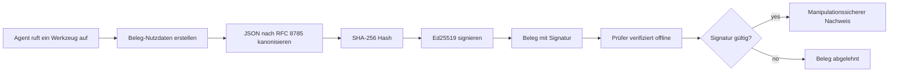
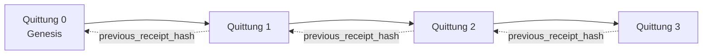

[Sehen Sie sich das Lektionvideo an: Sicherung von KI-Agenten mit kryptografischen Belegen](https://youtu.be/PLACEHOLDER_VIDEO_ID)

> _(Lektionvideo und Thumbnail werden nach dem Zusammenführen vom Microsoft-Inhaltsteam hinzugefügt und folgen dem Muster der Lektion 14 / 15.)_

# Sicherung von KI-Agenten mit kryptografischen Belegen

## Einführung

Diese Lektion behandelt:

- Warum Prüfpfade für KI-Agenten wichtig sind für Compliance, Fehlersuche und Vertrauen.
- Was ein kryptografischer Beleg ist und wie er sich von einer nicht signierten Protokollzeile unterscheidet.
- Wie man in einfachem Python einen signierten Beleg für den Werkzeugaufruf eines Agenten erstellt.
- Wie man einen Beleg offline verifiziert und Manipulationen erkennt.
- Wie man Belege verkettet, sodass das Entfernen oder Neuanordnen eines Belegs die Kette bricht.
- Was Belege beweisen und was sie ausdrücklich nicht beweisen.

## Lernziele

Nach Abschluss dieser Lektion wissen Sie, wie Sie:

- Fehlermodi identifizieren, die eine kryptografische Herkunftsnachverfolgung für Agentenaktionen motivieren.
- Einen Ed25519-signierten Beleg über eine kanonische JSON-Nutzlast erzeugen.
- Einen Beleg unabhängig nur mit dem öffentlichen Schlüssel des Signierenden verifizieren.
- Manipulation erkennen, indem die Verifikation mit einem modifizierten Beleg erneut durchgeführt wird.
- Eine hash-verkettete Folge von Belegen erstellen und erklären, warum die Kette wichtig ist.
- Die Grenze erkennen zwischen dem, was Belege beweisen (Zurechnung, Integrität, Reihenfolge) und dem, was sie nicht beweisen (Korrektheit der Aktion, Verlässlichkeit der Richtlinie).

## Das Problem: Der Prüfpfad Ihres Agenten

Stellen Sie sich vor, Sie haben einen KI-Agenten für Contoso Travel bereitgestellt. Der Agent liest Kundenanfragen, ruft eine Flug-API auf, um Optionen zu suchen, und bucht Plätze im Namen des Kunden. Im letzten Quartal hat der Agent 50.000 Buchungen abgewickelt.

Heute kommt ein Prüfer. Er stellt eine einfache Frage: „Zeigen Sie mir, was Ihr Agent gemacht hat.“

Sie übergeben Ihre Protokolldateien. Der Prüfer betrachtet sie und stellt die schwierigere Frage: „Woher weiß ich, dass diese Protokolle nicht bearbeitet wurden?“

Dies ist das Problem des Prüfpfads. Die meisten Agentenbereitstellungen heute verlassen sich auf:

- **Anwendungsprotokolle**: Vom Agenten selbst geschrieben, von jedem mit Dateisystemzugriff bearbeitbar.
- **Cloud-Protokollierungsdienste**: Manipulationssicher auf Plattformebene, aber nur wenn der Prüfer dem Plattformbetreiber vertraut.
- **Datenbank-Transaktionsprotokolle**: Gut geeignet für Datenbankänderungen, aber nicht für willkürliche Werkzeugaufrufe.

Keines dieser Systeme kann die Frage des Prüfers beantworten, ohne dass der Prüfer jemandem vertrauen muss (Ihnen, Ihrem Cloud-Anbieter, Ihrem Datenbankanbieter). Für den internen Gebrauch ist dieses Vertrauen oft akzeptabel. Für regulierte Arbeitslasten (Finanzen, Gesundheitswesen, alles, was dem EU-KI-Gesetz unterliegt) ist es das nicht.

Kryptografische Belege lösen dieses Problem, indem sie jede Agentenaktion unabhängig verifizierbar machen. Der Prüfer muss Ihnen nicht vertrauen. Er benötigt nur Ihren öffentlichen Schlüssel und den Beleg selbst.

## Was ist ein kryptografischer Beleg?

Ein Beleg ist ein JSON-Objekt, das aufzeichnet, was ein Agent getan hat, signiert mit einer digitalen Signatur.



Ein minimaler Beleg sieht so aus:

```json
{
  "type": "agent.tool_call.v1",
  "agent_id": "contoso-travel-bot",
  "tool_name": "lookup_flights",
  "tool_args_hash": "sha256:a3f9c1...",
  "result_hash": "sha256:7b2e1d...",
  "policy_id": "contoso-travel-policy-v3",
  "timestamp": "2026-04-25T14:30:00Z",
  "sequence": 47,
  "previous_receipt_hash": "sha256:9d4e6a...",
  "signature": {
    "alg": "EdDSA",
    "sig": "c5af83...",
    "public_key": "8f3b2c..."
  }
}
```

Drei Eigenschaften sind entscheidend:

1. **Die Signatur**. Der Beleg wird vom Gateway des Agenten mit einem Ed25519-Privatschlüssel signiert. Jeder mit dem entsprechenden öffentlichen Schlüssel kann die Signatur offline verifizieren. Jede Manipulation eines Feldes macht die Signatur ungültig.

2. **Kanonische Kodierung**. Vor dem Signieren wird der Beleg mit JSON Canonicalization Scheme (JCS, RFC 8785) serialisiert. Das stellt sicher, dass zwei Implementierungen, die den gleichen logischen Beleg erzeugen, byte-identischen Output liefern. Ohne Kanonisierung würden verschiedene JSON-Serializer unterschiedliche Signaturen für denselben Inhalt erzeugen.

3. **Hash-Verkettung**. Das Feld `previous_receipt_hash` verbindet jeden Beleg mit dem vorherigen. Das Entfernen oder Umordnen eines Belegs bricht jeden nachfolgenden Beleg. Manipulationen werden auf Kettenebene sichtbar, selbst wenn einzelne Signaturen umgangen werden.

Zusammen bieten diese Eigenschaften drei Garantien:

- **Zurechnung**: Dieser Schlüssel hat diesen Inhalt signiert.
- **Integrität**: Der Inhalt hat sich seit der Signatur nicht verändert.
- **Reihenfolge**: Dieser Beleg folgte auf jenen Beleg in der Kette.

## Erzeugung eines Belegs in Python

Sie benötigen keine spezielle Bibliothek, um einen Beleg zu erstellen. Die kryptografischen Primitive sind weit verbreitet und die Logik umfasst nur wenige Dutzend Zeilen Python-Code.

Die praktischen Übungen in `code_samples/18-signed-receipts.ipynb` führen Sie durch den gesamten Ablauf. Die Zusammenfassung:

```python
import json
import hashlib
import base64
from nacl import signing
from jcs import canonicalize  # RFC 8785 kanonisches JSON

def b64url_nopad(data: bytes) -> str:
    return base64.urlsafe_b64encode(data).decode("ascii").rstrip("=")

def sha256_canonical(obj) -> str:
    """SHA-256 of a Python object's JCS-canonical JSON form."""
    return f"sha256:{hashlib.sha256(canonicalize(obj)).hexdigest()}"

# Erzeugen oder Laden eines Signierschlüssels (in der Produktion im Schlüsseltresor speichern)
signing_key = signing.SigningKey.generate()
verify_key = signing_key.verify_key

# Erstelle die Beleg-Nutzlast (noch keine Signatur)
tool_args = {"origin": "SYD", "destination": "LAX"}
tool_result = [{"flight": "QF11", "price": 1850, "stops": 0}]

payload = {
    "type": "agent.tool_call.v1",
    "agent_id": "contoso-travel-bot",
    "tool_name": "lookup_flights",
    "tool_args_hash": sha256_canonical(tool_args),
    "result_hash": sha256_canonical(tool_result),
    "policy_id": "contoso-travel-policy-v3",
    "timestamp": "2026-04-25T14:30:00Z",
    "sequence": 0,
    "previous_receipt_hash": None,
}

# Kanonisieren, hashen, signieren.
canonical_bytes = canonicalize(payload)
message_hash = hashlib.sha256(canonical_bytes).digest()
signature_bytes = signing_key.sign(message_hash).signature

# Ein strukturiertes Signaturobjekt anhängen.
receipt = {
    **payload,
    "signature": {
        "alg": "EdDSA",
        "sig": b64url_nopad(signature_bytes),
        "public_key": b64url_nopad(bytes(verify_key)),
    },
}
```

Das ist die komplette Signier-Pipeline. Die Übungen im Notebook führen Sie durch jeden Schritt.

## Verifikation eines Belegs und Erkennung von Manipulationen

Die Verifikation ist der umgekehrte Vorgang:

```python
import base64
import hashlib
from nacl import signing
from nacl.exceptions import BadSignatureError
from jcs import canonicalize

def b64url_decode(s: str) -> bytes:
    padding = "=" * ((4 - len(s) % 4) % 4)
    return base64.urlsafe_b64decode(s + padding)

def verify_receipt(receipt: dict) -> bool:
    # Die Signatur ist ein strukturiertes Objekt: {"alg", "sig", "public_key"}.
    sig_obj = receipt.get("signature")
    if not sig_obj or sig_obj.get("alg") != "EdDSA":
        return False

    # Rekonstruieren Sie die tatsächlich signierte Nutzlast (alles außer der Signatur).
    payload = {k: v for k, v in receipt.items() if k != "signature"}

    canonical_bytes = canonicalize(payload)
    message_hash = hashlib.sha256(canonical_bytes).digest()

    try:
        verify_key = signing.VerifyKey(b64url_decode(sig_obj["public_key"]))
        verify_key.verify(message_hash, b64url_decode(sig_obj["sig"]))
        return True
    except BadSignatureError:
        return False
```

Diese Funktion nimmt einen Beleg und gibt `True` zurück, wenn die Signatur gültig ist, sonst `False`. Kein Netzwerkaufruf, keine Dienstabhängigkeit, kein Vertrauen in Dritte erforderlich.

Um die Manipulationserkennung in Aktion zu sehen, erklärt das Notebook:

1. Erzeugung eines gültigen Belegs und Bestätigung, dass er verifiziert wird.
2. Veränderung eines einzelnen Bytes im Feld `tool_args_hash`.
3. Erneutes Ausführen der Verifikation und Scheitern der Prüfung.

Dies ist der praktische Nachweis, dass Belege manipulationssicher sind: Jede Veränderung, so klein sie ist, bricht die Signatur.

## Verketten von Belegen für mehrstufige Agenten

Ein einzelner signierter Beleg schützt eine Aktion. Eine Kette von Belegen schützt eine Abfolge.



Jeder Beleg speichert den Hash des vorherigen Belegs. Um Beleg 2 unbemerkt zu entfernen, müsste ein Angreifer entweder:

- das Feld `previous_receipt_hash` von Beleg 3 ändern (bricht die Signatur von Beleg 3), ODER
- eine neue Signatur auf einem modifizierten Beleg 3 fälschen (erfordert den privaten Schlüssel des Agenten).

Wenn der private Schlüssel in einem Hardware-Schlüsselvault gespeichert ist und Sie den öffentlichen Schlüssel mit jedem Beleg veröffentlichen, ist keiner der Angriffe ohne Entdeckung möglich.

Das Notebook führt Sie durch:

1. Aufbau einer Kette von drei Belegen.
2. Verifikation, dass das `previous_receipt_hash` jedes Belegs dem tatsächlichen Hash des vorherigen Belegs entspricht.
3. Manipulation eines Belegs in der Mitte und Erkennen, dass die Kette genau an dieser Stelle bricht.

So erstellen Sie einen Prüfpfad, den ein externer Prüfer verifizieren kann, ohne Ihnen vertrauen zu müssen.

## Was Belege beweisen (und was nicht)

Dies ist der wichtigste Abschnitt dieser Lektion. Belege sind mächtig, aber ihre Macht hat Grenzen.

**Belege beweisen drei Dinge:**

1. **Zurechnung**: Ein bestimmter Schlüssel hat eine bestimmte Nutzlast signiert.
2. **Integrität**: Die Nutzlast hat sich seit der Signatur nicht geändert.
3. **Reihenfolge**: Dieser Beleg folgte auf jenen Beleg in der Hash-Kette.

**Belege beweisen NICHT:**

1. **Korrektheit**: Dass die Aktion des Agenten die richtige war. Ein Beleg kann genauso sauber für eine falsche Antwort signiert werden wie für eine richtige.
2. **Einhaltung von Richtlinien**: Dass die in `policy_id` referenzierte Richtlinie tatsächlich evaluiert wurde oder dass sie diese Aktion erlaubt hätte, falls geprüft. Der Beleg zeichnet auf, was behauptet wurde, nicht was durchgesetzt wurde.
3. **Identität über den Schlüssel hinaus**: Der Beleg sagt „dieser Schlüssel hat diesen Inhalt signiert.“ Er sagt nicht „Dieser Mensch hat das autorisiert.“ Die Verbindung eines Schlüssels zu einer Person oder Organisation erfordert separate Identitäts-Infrastruktur (ein Verzeichnis, ein öffentlicher Schlüssel-Registry usw.).
4. **Wahrhaftigkeit der Eingaben**: Wenn der Agent eine manipulierte Eingabe erhält und darauf reagiert, zeichnet der Beleg die Aktion korrekt auf. Belege sind nachgelagert von der Eingabevalidierung, nicht ein Ersatz dafür.

Diese Grenze ist aus zwei Gründen wichtig:

- Sie sagt Ihnen, wofür Belege nützlich sind: dabei helfen, das Verhalten von Agenten überprüfbar und manipulationssicher zu machen, auch über Organisationsgrenzen hinweg.
- Sie zeigt Ihnen, welche zusätzlichen Schichten Sie noch benötigen: Eingabevalidierung (Lektion 6), Richtlinien-Durchsetzung (unten kurz behandelt) und Identitätsinfrastruktur (außerhalb des Umfangs dieser Lektion).

Ein häufiger Fehler besteht darin zu denken, „wir haben Belege“ heißt „wir sind reguliert.“ Das tut es nicht. Belege sind eine Grundlage. Regulierung ist das System, das Sie darauf aufbauen.

## Nachweis, dass ein Mensch genau diese Aktion genehmigt hat

Punkt 3 oben ist einen eigenen Abschnitt wert: Ein Aktionsbeleg sagt „dieser Schlüssel hat diesen Inhalt signiert,“ niemals „ein Mensch hat das genehmigt.“ Für risikoreiche Aktionen (Rückerstattungen, Löschungen, Überweisungen) fordern Governance-Rahmenwerke zunehmend genau diese fehlende Aussage, und sie ist mit den gleichen primitiven Standards produzierbar, die Sie in dieser Lektion bereits gebaut haben.

Das Anschlussnotebook `code_samples/human-authorization-receipts.ipynb` fügt eine zweite Art von Beleg hinzu, `human.approval.v1`, im selben Umschlag-Format wie die Belege dieser Lektion (eine typisierte Nutzlast, signiert mit Ed25519 über den kanonischen SHA-256, mit dem `signature`-Objekt außerhalb der signierten Bytes). Ein benannter Genehmiger signiert die **vollständige kanonische Aktion und ihren Digest** vor der Ausführung; der Aktionsbeleg des Agenten enthält denselben Aktionsdigest und eine `parent_approval_ref`, den `receipt_hash` der Genehmigung, nach derselben Konvention wie `previous_receipt_hash` in der oben gebauten Kette. Ein einziger `verify_chain` prüft beide Artefakte unter **getrennten festen Schlüsselregistern** (Genehmigerschlüssel vs Agentenschlüssel), so ist der Codepfad gemeinsam, aber die Autoritäten nie.

Die dadurch erreichte Eigenschaft, sorgfältig formuliert: *Der Mensch hat genau diese Aktion genehmigt, und der Agent hat genau diese genehmigte Aktion ausgeführt.* Die Abwehrmechanismen im Notebook machen diese Eigenschaft real und nicht nur behauptet:

- Die klassischen Gefahren: Manipulation, verwechselt beauftragter Vertreter, Replay, gefälschte Schlüssel auf beiden Seiten, fehlerhafte Eingaben;
- **veraltete Autorität**: eine Signatur, die noch verifiziert, aber trotzdem abgelehnt wird, weil die Richtlinierversion sich änderte, der Genehmigungsschlüssel aus dem festen Register rotiert wurde oder die Genehmigung vor der Ausführung ablief;
- **Digest-Ersetzung**: Ein gültig signierter Aktionsbeleg verweist auf eine *echte* Genehmigung, die eine *andere* kanonische Aktion bindet.

Jeder Fehler wird mit einem eigenen Grund abgelehnt, so kann ein Prüfer beim Lesen erkennen, ob die Autorität veraltet ist oder die ausgeführte Aktion sich geändert hat. Die Regel, die das Notebook lehrt: Eine signierte Genehmigung ist für sich allein keine Autorität. Autorität existiert nur, wenn beide Belege zur Ausführungszeit noch dieselbe kanonische Aktion binden. Der Co-Signatur-Pfad im selben Internet-Draft, dem diese Lektion folgt (`draft-farley-acta-signed-receipts`), ist die offizielle Form dieses Musters.

## Produktionsreferenzen

Der Python-Code in dieser Lektion ist bewusst minimal gehalten, damit Sie jede Zeile lesen und genau verstehen können, was passiert. In der Produktion haben Sie zwei Optionen:

1. **Direkt auf kryptografischen Primitiven aufbauen.** Die 50 Zeilen, die Sie gesehen haben, reichen für viele Anwendungsfälle aus. PyNaCl (Ed25519) und das `jcs`-Paket (kanonisches JSON) sind gut gewartete und geprüfte Bibliotheken.

2. **Eine Produktions-Belegbibliothek nutzen.** Verschiedene Open-Source-Projekte implementieren dasselbe Muster mit zusätzlichen Features (Schlüsselrotation, Batch-Verifikation, JWK-Set-Verteilung, Integration mit Policy-Engines):
   - Das in dieser Lektion verwendete Belegformat folgt einem IETF Internet-Draft ([`draft-farley-acta-signed-receipts`](https://datatracker.ietf.org/doc/draft-farley-acta-signed-receipts/), Revision 02), das sich aktuell im Normungsprozess befindet, mit einer gemeinsamen Konformitäts-Suite ([agent-governance-testvectors](https://github.com/ScopeBlind/agent-governance-testvectors)), mit der unabhängige Implementierungen gegen byte-identischen kanonischen Output überkreuz verifizieren.
   - Das Microsoft Agent Governance Toolkit komponiert Belege mit Cedar-basierten Policy-Entscheidungen; siehe Tutorial 33 im Repository für ein End-to-End-Beispiel.
   - Die Pakete `protect-mcp` (npm) und `@veritasacta/verify` (npm) bieten eine Node-basierte Implementierung der Belegsignierung und Offline-Verifikation, gedacht für die Einbettung jeglichen MCP-Servers mit einem manipulationssicheren Prüfpfad, einschließlich eines mitgeführten Co-Sign-Flows, bei dem eine pausierte Aktion eine Genehmigung ausgibt, die an den Aktionsdigest gebunden ist (im Desktop-Flow WebAuthn-gestützt), dasselbe Genehmigungsbeleg-Muster wie im Notebook zur menschlichen Autorisierung.
   - Das **[nobulex](https://github.com/arian-gogani/nobulex)** Python-SDK (`pip install nobulex`) bietet dasselbe Ed25519 + JCS-Signiermuster in Python mit LangChain- und CrewAI-Integrationen, inklusive veröffentlichter Kreuzvalidierungs-Testvektoren und Compliance-Mapping, beigetragen über [OWASP PR #2210](https://github.com/OWASP/CheatSheetSeries/pull/2210).

Die Entscheidung zwischen einer Eigenentwicklung und einer Bibliotheksnutzung ähnelt der Entscheidung, ob man eine eigene JWT-Bibliothek schreibt oder eine erprobte nutzt: Beides ist vernünftig; die Bibliothek spart Zeit und reduziert die Angriffsoffenheit; der Eigenbau erzwingt das Verständnis jedes Primitivs. Diese Lektion lehrt den Eigenbau-Pfad, damit Sie die Grundlage für beide Optionen haben.

## Wissensüberprüfung

Testen Sie Ihr Verständnis, bevor Sie zur Übung übergehen.

**1. Ein Beleg wird mit dem privaten Ed25519-Schlüssel des Agenten signiert. Der Prüfer hat nur den öffentlichen Schlüssel. Kann der Prüfer den Beleg offline verifizieren?**

<details>
<summary>Antwort</summary>

Ja. Die Ed25519-Verifikation benötigt nur den öffentlichen Schlüssel und die signierten Bytes. Kein Netzwerkaufruf, keine Dienstabhängigkeit. Diese Eigenschaft macht Belege in luftisolierten, multi-organisationellen oder niedrig-vertrauenswürdigen Auditsituationen nützlich.
</details>

**2. Ein Angreifer manipuliert das Feld `policy_id` eines Belegs, um zu behaupten, es sei durch eine permissivere Richtlinie geregelt. Die Signatur war über die ursprüngliche Nutzlast. Was passiert bei der Verifikation?**

<details>
<summary>Antwort</summary>


Die Verifikation schlägt fehl. Die Signatur wurde über die kanonischen Bytes der ursprünglichen Nutzlast berechnet; jede Änderung eines Feldes ändert die kanonischen Bytes, was den SHA-256-Hash ändert und die Signatur ungültig macht. Der Angreifer bräuchte den privaten Schlüssel, um eine neue gültige Signatur zu erzeugen, den er jedoch nicht hat.
</details>

**3. Warum enthält der Beleg einen `tool_args_hash` und `result_hash` anstelle der rohen Argumente und des Ergebnisses?**

<details>
<summary>Antwort</summary>

Zwei Gründe. Erstens muss der Beleg möglicherweise archiviert oder in Umgebungen übertragen werden, in denen das Offenlegen des rohen Inhalts (PII, Geschäftsdaten) ein Problem darstellt. Das Hashen hält den Beleg klein und den Inhalt privat; der Prüfer verifiziert, dass der Hash mit einer separat gespeicherten Kopie des tatsächlichen Inhalts übereinstimmt. Zweitens haben Hashes eine feste Größe; ein Beleg mit Hashes ist hinsichtlich der Größe begrenzt, unabhängig davon, wie groß die Eingaben und Ausgaben waren.
</details>

**4. Das Feld `previous_receipt_hash` verknüpft jeden Beleg mit seinem Vorgänger. Wenn ein Angreifer stillschweigend einen Beleg aus der Mitte einer Kette löscht, was wird ungültig?**

<details>
<summary>Antwort</summary>

Jeder Beleg, der nach dem gelöschten kam. Deren Felder `previous_receipt_hash` stimmen nicht mehr mit der tatsächlichen Kette überein (weil der von ihnen referenzierte Beleg nicht mehr existiert oder die Kette jetzt auf einen anderen Vorgänger verweist). Um die Löschung zu verbergen, müsste der Angreifer jeden späteren Beleg neu signieren, was den privaten Schlüssel voraussetzt.
</details>

**5. Ein Beleg wird sauber verifiziert. Beweist das, dass die Aktion des Agenten korrekt, sinnvoll oder regelkonform war?**

<details>
<summary>Antwort</summary>

Nein. Ein gültiger Beleg beweist drei Dinge: Zuordnung (dieser Schlüssel signierte diesen Inhalt), Integrität (der Inhalt wurde nicht verändert) und Reihenfolge (dieser Beleg kam nach jenem). Er beweist NICHT, dass die Aktion korrekt war, dass die im `policy_id` benannte Richtlinie tatsächlich ausgewertet wurde, oder dass der Agent jede Regel befolgt hat. Belege machen das Verhalten des Agenten prüfbar, aber nicht zwangsläufig korrekt. Dies ist die wichtigste Grenze in der Lektion.
</details>

## Übungsaufgabe

Öffne `code_samples/18-signed-receipts.ipynb` und bearbeite alle vier Abschnitte:

1. **Abschnitt 1**: Signiere deinen ersten Beleg und verifiziere ihn.
2. **Abschnitt 2**: Manipuliere den Beleg und beobachte, wie die Verifikation fehlschlägt.
3. **Abschnitt 3**: Baue eine Kette aus drei Belegen auf und überprüfe die Integrität der Kette.
4. **Abschnitt 4**: Wende das Muster auf einen Agenten an, der mit dem Microsoft Agent Framework gebaut wurde: umfasse einen Toolaufruf mit Belegsignierung und verifiziere dann den Beleg unabhängig.

**Stretch-Challenge 1:** Erweitere das Belegschema um ein zusätzliches, von dir gewähltes Feld (z.B. eine Anfrage-ID zur Nachverfolgung), aktualisiere die kanonische Signierlogik, um es einzubeziehen, und stelle sicher, dass der Beleg die Verifikation weiterhin besteht. Ändere dann das Feld nach der Signatur und stelle sicher, dass die Verifikation fehlschlägt. Das zwingt dich zu verstehen, wie jedes Byte der kanonischen Codierung zur Signatur beiträgt.

**Stretch-Challenge 2:** Hashe zwei deiner Belege zusammen mit SHA-256 (verkette deren kanonische Bytes in einer deterministischen Reihenfolge) und binde den resultierenden Digest als neues Feld in einen dritten Beleg ein, bevor du diesen signierst. Verifiziere, dass alle drei Belege weiterhin die Verifikation bestehen. Du hast gerade einen einstufigen Einschlussnachweis gebaut: Jeder, der den dritten Beleg besitzt, kann beweisen, dass die ersten beiden zum Zeitpunkt der Signatur existierten, ohne deren Inhalt offenlegen zu müssen. Dies ist das Muster, das selektiv offenlegende Belege im großen Maßstab verwenden (Merkle-Commitments, RFC 6962).

## Fazit

Kryptografische Belege geben KI-Agenten eine Prüfnachverfolgung, die:

- **Unabhängig verifizierbar**: Jede Partei mit dem öffentlichen Schlüssel kann verifizieren, keine Dienstabhängigkeit.
- **Manipulationserkennend**: Jede Änderung macht die Signatur ungültig.
- **Portabel**: Ein Beleg ist eine kleine JSON-Datei; er kann archiviert, übertragen und überall verifiziert werden.
- **Standards-konform**: Basierend auf Ed25519 (RFC 8032), JCS (RFC 8785) und SHA-256, alles weit verbreitete Primitive.

Sie ersetzen nicht die Eingabevalidierung, Durchsetzung von Richtlinien oder Identitätsinfrastruktur. Sie sind die Grundlage für diese Schichten. Wenn du Agenten in regulierten Umgebungen, Organisations-übergreifenden Workflows oder jeder Umgebung einsetzt, in der ein zukünftiger Prüfer dir nicht vertrauen kann, machen Belege die Prüfnachverfolgung ehrlich.

Die wichtigste Erkenntnis: Belege beweisen, wer was wann gesagt hat. Sie beweisen nicht, dass das Gesagte wahr oder richtig war. Halte diese Unterscheidung fest. Das ist der Unterschied zwischen einem ehrlichen Herkunftssystem und einem irreführenden.

## Produktions-Checkliste

Wenn du bereit bist, von dieser Lektion zur Bereitstellung von belegsignierten Agenten in einer echten Umgebung überzugehen:

- [ ] **Verschiebe den Signierschlüssel vom Entwickler-Laptop.** Verwende Azure Key Vault, AWS KMS oder ein Hardware-Sicherheitsmodul. Der private Schlüssel, der deine Belege signiert, darf niemals in Quellcodeverwaltung oder unverschlüsselt auf Anwendungsmaschinen liegen.
- [ ] **Veröffentliche den öffentlichen Verifikationsschlüssel.** Prüfer brauchen ihn für die Offline-Verifikation. Das Standardmuster ist ein JWK Set an einer bekannten URL (RFC 7517), z.B. `https://your-org.example.com/.well-known/agent-keys.json`.
- [ ] **Verankere die Kette extern.** Schreibe periodisch den Hash des neuesten Kettenkopfes in ein Transparenzprotokoll (Sigstore Rekor, RFC 3161 Zeitstempelbehörde oder ein zweites internes System), damit eine externe Partei bestätigen kann: "Diese Kette existierte zu diesem Zeitpunkt."
- [ ] **Speichere Belege unveränderlich.** Anhängbare Blob-Speicher (Azure Storage mit Unveränderlichkeitsrichtlinien, AWS S3 Object Lock) verhindern, dass ein Insider die Historie auf der Speicherebene neu schreibt.
- [ ] **Entscheide über Aufbewahrung.** Viele Compliance-Regelwerke verlangen mehrjährige Aufbewahrung. Plane das Wachstum der Belege ein (jeder Beleg ist ~500 Bytes; ein Agent, der 10.000 Aufrufe pro Tag macht, erzeugt ca. 1,8 GB pro Jahr).
- [ ] **Dokumentiere, was Belege nicht abdecken.** Belege beweisen Zuordnung, Integrität und Reihenfolge. Dein Runbook sollte explizit auflisten, welche weiteren Kontrollen (Eingabevalidierung, Richtliniendurchsetzung, Ratenbegrenzung, Identitätsinfrastruktur) neben Belegen Teil deiner Governance-Strategie sind.

### Hast du weitere Fragen zur Sicherung von KI-Agenten?

Trete dem [Microsoft Foundry Discord](https://aka.ms/ai-agents/discord) bei, um andere Lernende zu treffen, an Sprechstunden teilzunehmen und deine Fragen zu KI-Agenten beantwortet zu bekommen.

## Über diese Lektion hinaus

Diese Lektion behandelt einzelne Belegsignaturen und hash-verkettete Sequenzen. Dieselben Primitive setzen sich zu mehreren fortgeschrittenen Mustern zusammen, die du kennenlernen kannst, wenn sich deine Governance-Haltung weiterentwickelt:

- **Selektive Offenlegung.** Wenn die Felder eines Belegs unabhängig festgelegt sind (RFC 6962-ähnlicher Merkle-Baum), kannst du bestimmte Felder für spezifische Prüfer offenlegen und beweisen, dass die übrigen unverändert sind, ohne sie zu offenbaren. Nützlich, wenn derselbe Beleg sowohl eine umfassende Prüfung (die Vollständigkeit verlangt) als auch Datenschutzvorschriften wie GDPR (die minimale Offenlegung verlangen) erfüllen muss.
- **Belegwiderruf.** Wenn ein Signierschlüssel kompromittiert wird, brauchst du eine Möglichkeit, alle von diesem Schlüssel ab einem Zeitpunkt signierten Belege als nicht vertrauenswürdig zu markieren. Standardmuster: kurzlebige Signierschlüssel plus veröffentlichte Widerrufsliste oder ein Transparenzprotokoll mit Widerrufseinträgen.
- **Bilaterale / geteilte Signatur-Belege.** Einige Implementierungen teilen die signierte Nutzlast in eine Vor-Ausführungs- (`authorization_*`) und eine Nach-Ausführungs- (`result_*`) Hälfte mit unabhängigen Signaturen auf, nützlich, wenn Entscheidungsfindung und beobachtetes Ergebnis von verschiedenen Akteuren oder zu verschiedenen Zeiten erzeugt werden. Dies setzt additive auf das in dieser Lektion gelehrte Belegformat auf.
- **Nutzlast-Komposition.** Ein Beleg versiegelt die Bytes, die du in `result_hash` legst. In der Praxis sind Nutzlasten oft komplexer als nur ein Tool-Ergebnis: Vorentscheidungsüberlegungen (Modellvorhersage, berücksichtigte Optionen, Beweise und deren Vollständigkeit, Risikoeinschätzung, Verantwortlichkeitskette, Ergebnis eines Gate) können alle in der Nutzlast leben, versiegelt durch einen einzigen Beleg. So bleibt das Belegformat minimal, während die Nutzlastschemas domänenspezifisch evolvieren können.
- **Konformität zwischen Implementierungen.** Mehrere unabhängige Implementierungen desselben Belegformats (Python, TypeScript, Rust, Go) verifizieren sich gegenseitig anhand gemeinsamer Testvektoren. Wenn du eine eigene Implementierung baust, bestätigt die Validierung gegen veröffentlichte Vektoren die Drahtkompatibilität.
- **Post-quanten Migration.** Ed25519 ist heute weit verbreitet, aber nicht quantenresistent. Das Belegformat ist algorithmus-flexibel: das Feld `signature.alg` kann `ML-DSA-65` (den NIST Post-Quantum-Signaturstandard) tragen, wenn du migrieren musst. Plane eine Übergangsphase mit doppelt signierten Belegen.

## Zusätzliche Ressourcen

- <a href="https://datatracker.ietf.org/doc/draft-farley-acta-signed-receipts/" target="_blank">IETF Internet-Draft: Signed Decision Receipts for Machine-to-Machine Access Control</a>
- <a href="https://learn.microsoft.com/azure/ai-studio/responsible-use-of-ai-overview" target="_blank">Überblick Responsible AI (Azure AI)</a>
- <a href="https://datatracker.ietf.org/doc/html/rfc8032" target="_blank">RFC 8032: Edwards-Kurven-Digitale-Signatur-Algorithmus (EdDSA)</a>
- <a href="https://datatracker.ietf.org/doc/html/rfc8785" target="_blank">RFC 8785: JSON Canonicalization Scheme (JCS)</a>
- <a href="https://datatracker.ietf.org/doc/html/rfc6962" target="_blank">RFC 6962: Zertifikatstransparenz</a> (Merkle-Baum-Konstruktion, die von selektiv offengelegten Belegen verwendet wird)
- <a href="https://github.com/microsoft/agent-governance-toolkit/blob/main/docs/tutorials/33-offline-verifiable-receipts.md" target="_blank">Microsoft Agent Governance Toolkit, Tutorial 33: Offline-Verifizierbare Entscheidungsbelege</a>
- <a href="https://github.com/ScopeBlind/agent-governance-testvectors" target="_blank">Konformitäts-Testvektoren über Implementierungen hinweg</a> für das in dieser Lektion verwendete Belegformat (Apache-2.0)
- <a href="https://pynacl.readthedocs.io/" target="_blank">PyNaCl Dokumentation</a> (Ed25519 in Python)

## Vorherige Lektion

[Lokale KI-Agenten erstellen](../17-creating-local-ai-agents/README.md)

---

<!-- CO-OP TRANSLATOR DISCLAIMER START -->
**Haftungsausschluss**:
Dieses Dokument wurde mit dem KI-Übersetzungsdienst [Co-op Translator](https://github.com/Azure/co-op-translator) übersetzt. Obwohl wir uns um Genauigkeit bemühen, beachten Sie bitte, dass automatisierte Übersetzungen Fehler oder Ungenauigkeiten enthalten können. Das Originaldokument in seiner Ursprungssprache gilt als maßgebliche Quelle. Bei kritischen Informationen wird eine professionelle menschliche Übersetzung empfohlen. Wir übernehmen keine Haftung für Missverständnisse oder Fehlinterpretationen, die aus der Verwendung dieser Übersetzung entstehen.
<!-- CO-OP TRANSLATOR DISCLAIMER END -->