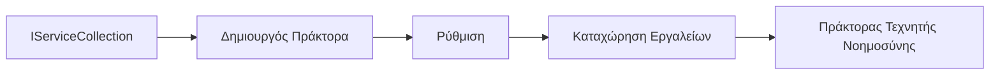

# 🎨 Πρότυπα Agentic Design με Azure OpenAI (Responses API) (.NET)

## 📋 Στόχοι Μάθησης

Αυτό το παράδειγμα δείχνει πρότυπα σχεδίασης επιπέδου επιχειρήσεων για την κατασκευή ευφυών πρακτόρων χρησιμοποιώντας το Microsoft Agent Framework σε .NET με ενσωμάτωση του Azure OpenAI (Responses API). Θα μάθετε επαγγελματικά πρότυπα και αρχιτεκτονικές προσεγγίσεις που καθιστούν τους πράκτορες έτοιμους για παραγωγή, συντηρήσιμους και επεκτάσιμους.

### Πρότυπα Επιχειρήσεων

- 🏭 **Factory Pattern**: Τυποποιημένη δημιουργία πρακτόρων με ενέσιμη εξάρτηση
- 🔧 **Builder Pattern**: Ρευστή διαμόρφωση και ρύθμιση πρακτόρων
- 🧵 **Thread-Safe Patterns**: Διαχείριση ταυτόχρονης επικοινωνίας
- 📋 **Repository Pattern**: Οργανωμένη διαχείριση εργαλείων και δυνατοτήτων

## 🎯 Οφέλη Αρχιτεκτονικής .NET

### Χαρακτηριστικά Επιχειρήσεων

- **Ισχυρή Τυποποίηση**: Έλεγχος κατά τη μεταγλώττιση και υποστήριξη IntelliSense
- **Dependency Injection**: Ενσωμάτωση ενσωματωμένου DI container
- **Διαχείριση Ρυθμίσεων**: Πρότυπα IConfiguration και Options
- **Async/Await**: Υποστήριξη ασύγχρονης προγραμματισμού πρώτης κατηγορίας

### Πρότυπα Έτοιμα για Παραγωγή

- **Logging Integration**: ILogger και υποστήριξη δομημένης καταγραφής
- **Health Checks**: Ενσωματωμένη παρακολούθηση και διαγνωστικά
- **Έλεγχος Ρυθμίσεων**: Ισχυρή τυποποίηση με ανιχνεύσεις δεδομένων
- **Διαχείριση Σφαλμάτων**: Δομημένη διαχείριση εξαιρέσεων

## 🔧 Τεχνική Αρχιτεκτονική

### Βασικά Συστατικά .NET

- **Microsoft.Extensions.AI**: Ενοποιημένες αφαίρεσεις υπηρεσιών AI
- **Microsoft.Agents.AI**: Πλαίσιο ορχήστρωσης πράκτορα επιχείρησης
- **Azure OpenAI (Responses API)**: Πρότυπα πελατών API υψηλής απόδοσης
- **Σύστημα Ρυθμίσεων**: appsettings.json και ενσωμάτωση περιβάλλοντος

### Υλοποίηση Προτύπων Σχεδίασης



## 🏗️ Επιδειχθέντα Πρότυπα Επιχείρησης

### 1. **Προτύπα Δημιουργίας**

- **Agent Factory**: Κεντρική δημιουργία πρακτόρων με ομοιόμορφη ρύθμιση
- **Builder Pattern**: Ρευστό API για σύνθετη διαμόρφωση πρακτόρων
- **Singleton Pattern**: Κοινόχρηστοι πόροι και διαχείριση ρυθμίσεων
- **Dependency Injection**: Χαλαρή σύνδεση και δυνατότητα δοκιμών

### 2. **Συμπεριφορικά Πρότυπα**

- **Strategy Pattern**: Εναλλάξιμες στρατηγικές εκτέλεσης εργαλείων
- **Command Pattern**: Εγκαλυμμένες λειτουργίες πρακτόρων με undo/redo
- **Observer Pattern**: Διαχείριση κύκλου ζωής πρακτόρων με βάση γεγονότα
- **Template Method**: Τυποποιημένες ροές εργασίας εκτέλεσης πρακτόρων

### 3. **Δομικά Πρότυπα**

- **Adapter Pattern**: Επίπεδο ενσωμάτωσης Azure OpenAI (Responses API)
- **Decorator Pattern**: Ενίσχυση δυνατοτήτων πράκτορα
- **Facade Pattern**: Απλοποιημένα interfaces αλληλεπίδρασης πρακτόρων
- **Proxy Pattern**: Τεμπέλικο φόρτωμα και caching για απόδοση

## 📚 Αρχές Σχεδίασης .NET

### Αρχές SOLID

- **Single Responsibility**: Κάθε συστατικό έχει έναν σαφή σκοπό
- **Open/Closed**: Επεκτάσιμο χωρίς τροποποίηση
- **Liskov Substitution**: Υλοποιήσεις εργαλείων βασισμένες σε interface
- **Interface Segregation**: Εστιασμένα, συνεκτικά interfaces
- **Dependency Inversion**: Εξάρτηση σε αφαίρεσεις, όχι υλοποιήσεις

### Καθαρή Αρχιτεκτονική

- **Domain Layer**: Βασικές αφαιρέσεις πράκτορα και εργαλείων
- **Application Layer**: Ορχήστρωση πράκτορα και ροές εργασίας
- **Infrastructure Layer**: Ενσωμάτωση Azure OpenAI (Responses API) και εξωτερικές υπηρεσίες
- **Presentation Layer**: Αλληλεπίδραση χρήστη και διαμόρφωση απαντήσεων

## 🔒 Επιχειρησιακές Σκέψεις

### Ασφάλεια

- **Διαχείριση Διαπιστευτηρίων**: Ασφαλής διαχείριση κλειδιών API με IConfiguration
- **Έλεγχος Εισόδου**: Ισχυρή τυποποίηση και έλεγχος ανιχνεύσεων δεδομένων
- **Απολύμανση Εξόδου**: Ασφαλής επεξεργασία και φιλτράρισμα απαντήσεων
- **Audit Logging**: Ολοκληρωμένη παρακολούθηση λειτουργιών

### Απόδοση

- **Async Πρότυπα**: Μη παρεμποδιστικές λειτουργίες I/O
- **Connection Pooling**: Αποδοτική διαχείριση HTTP clients
- **Caching**: Caching απαντήσεων για βελτιωμένη απόδοση
- **Διαχείριση Πόρων**: Σωστά πρότυπα απελευθέρωσης και καθαρισμού

### Επεκτασιμότητα

- **Thread Safety**: Υποστήριξη ταυτόχρονης εκτέλεσης πρακτόρων
- **Resource Pooling**: Αποδοτική χρήση πόρων
- **Load Management**: Περιορισμός ρυθμού και διαχείριση πίεσης
- **Monitoring**: Μετρήσεις απόδοσης και health checks

## 🚀 Ανάπτυξη για Παραγωγή

- **Διαχείριση Ρυθμίσεων**: Ρυθμίσεις ανά περιβάλλον
- **Στρατηγική Καταγραφής**: Δομημένη καταγραφή με correlation IDs
- **Διαχείριση Σφαλμάτων**: Παγκόσμια αντιμετώπιση εξαιρέσεων με κατάλληλη ανάκτηση
- **Monitoring**: Application insights και counters απόδοσης
- **Testing**: Μονάδες, integration και load testing πρότυπα

Έτοιμοι να φτιάξετε ευφυείς πράκτορες επιπέδου επιχείρησης με .NET; Ας σχεδιάσουμε κάτι στιβαρό! 🏢✨

## 🚀 Ξεκινώντας

### Προαπαιτούμενα

- [.NET 10 SDK](https://dotnet.microsoft.com/download/dotnet/10.0) ή μεγαλύτερο
- Ένα [Azure συνδρομή](https://azure.microsoft.com/free/) με πόρο Azure OpenAI και ανάπτυξη μοντέλου
- Το [Azure CLI](https://learn.microsoft.com/cli/azure/install-azure-cli) — συνδεθείτε με `az login`

### Απαιτούμενες Μεταβλητές Περιβάλλοντος

```bash
# zsh/bash
export AZURE_OPENAI_ENDPOINT=https://<your-resource>.openai.azure.com
export AZURE_OPENAI_DEPLOYMENT=gpt-5-mini
# Στη συνέχεια, συνδεθείτε ώστε το AzureCliCredential να μπορεί να πάρει ένα διακριτικό
az login
```

```powershell
# PowerShell
$env:AZURE_OPENAI_ENDPOINT = "https://<your-resource>.openai.azure.com"
$env:AZURE_OPENAI_DEPLOYMENT = "gpt-5-mini"
# Στη συνέχεια, συνδεθείτε ώστε το AzureCliCredential να μπορεί να λάβει ένα διακριτικό
az login
```

### Παράδειγμα Κώδικα

Για να εκτελέσετε το παράδειγμα κώδικα,

```bash
# zsh/bash
chmod +x ./03-dotnet-agent-framework.cs
./03-dotnet-agent-framework.cs
```

Ή χρησιμοποιώντας το dotnet CLI:

```bash
dotnet run ./03-dotnet-agent-framework.cs
```

Δείτε το αρχείο [`03-dotnet-agent-framework.cs`](../../../../03-agentic-design-patterns/code_samples/03-dotnet-agent-framework.cs) για τον πλήρη κώδικα.

```csharp
#!/usr/bin/dotnet run

#:package Microsoft.Extensions.AI@10.*
#:package Microsoft.Agents.AI.OpenAI@1.*-*
#:package Azure.AI.OpenAI@2.1.0
#:package Azure.Identity@1.13.1

using System.ComponentModel;

using Microsoft.Agents.AI;
using Microsoft.Extensions.AI;

using Azure.AI.OpenAI;
using Azure.Identity;

// Tool Function: Random Destination Generator
// This static method will be available to the agent as a callable tool
// The [Description] attribute helps the AI understand when to use this function
// This demonstrates how to create custom tools for AI agents
[Description("Provides a random vacation destination.")]
static string GetRandomDestination()
{
    // List of popular vacation destinations around the world
    // The agent will randomly select from these options
    var destinations = new List<string>
    {
        "Paris, France",
        "Tokyo, Japan",
        "New York City, USA",
        "Sydney, Australia",
        "Rome, Italy",
        "Barcelona, Spain",
        "Cape Town, South Africa",
        "Rio de Janeiro, Brazil",
        "Bangkok, Thailand",
        "Vancouver, Canada"
    };

    // Generate random index and return selected destination
    // Uses System.Random for simple random selection
    var random = new Random();
    int index = random.Next(destinations.Count);
    return destinations[index];
}

// Azure OpenAI with the Responses API (stable v1 endpoint). Sign in with `az login`.
var azureEndpoint = Environment.GetEnvironmentVariable("AZURE_OPENAI_ENDPOINT")
    ?? throw new InvalidOperationException("AZURE_OPENAI_ENDPOINT is not set.");
var deployment = Environment.GetEnvironmentVariable("AZURE_OPENAI_DEPLOYMENT") ?? "gpt-5-mini";

var azureClient = new AzureOpenAIClient(new Uri(azureEndpoint), new AzureCliCredential());

// Define Agent Identity and Comprehensive Instructions
// Agent name for identification and logging purposes
var AGENT_NAME = "TravelAgent";

// Detailed instructions that define the agent's personality, capabilities, and behavior
// This system prompt shapes how the agent responds and interacts with users
var AGENT_INSTRUCTIONS = """
You are a helpful AI Agent that can help plan vacations for customers.

Important: When users specify a destination, always plan for that location. Only suggest random destinations when the user hasn't specified a preference.

When the conversation begins, introduce yourself with this message:
"Hello! I'm your TravelAgent assistant. I can help plan vacations and suggest interesting destinations for you. Here are some things you can ask me:
1. Plan a day trip to a specific location
2. Suggest a random vacation destination
3. Find destinations with specific features (beaches, mountains, historical sites, etc.)
4. Plan an alternative trip if you don't like my first suggestion

What kind of trip would you like me to help you plan today?"

Always prioritize user preferences. If they mention a specific destination like "Bali" or "Paris," focus your planning on that location rather than suggesting alternatives.
""";

// Create AI Agent with Advanced Travel Planning Capabilities
// Get the Responses client for the deployment and create the AI agent
// Configure agent with name, detailed instructions, and available tools
// This demonstrates the .NET agent creation pattern with full configuration
AIAgent agent = azureClient
    .GetChatClient(deployment)
    .AsAIAgent(
        name: AGENT_NAME,
        instructions: AGENT_INSTRUCTIONS,
        tools: [AIFunctionFactory.Create(GetRandomDestination)]
    );

// Create New Conversation Session for Context Management
// Initialize a new conversation session to maintain context across multiple interactions
// Sessions enable the agent to remember previous exchanges and maintain conversational state
// This is essential for multi-turn conversations and contextual understanding
var session = await agent.CreateSessionAsync();

// Execute Agent: First Travel Planning Request
// Run the agent with an initial request that will likely trigger the random destination tool
// The agent will analyze the request, use the GetRandomDestination tool, and create an itinerary
// Using the session parameter maintains conversation context for subsequent interactions
await foreach (var update in agent.RunStreamingAsync("Plan me a day trip", session))
{
    await Task.Delay(10);
    Console.Write(update);
}

Console.WriteLine();

// Execute Agent: Follow-up Request with Context Awareness
// Demonstrate contextual conversation by referencing the previous response
// The agent remembers the previous destination suggestion and will provide an alternative
// This showcases the power of conversation sessions and contextual understanding in .NET agents
await foreach (var update in agent.RunStreamingAsync("I don't like that destination. Plan me another vacation.", session))
{
    await Task.Delay(10);
    Console.Write(update);
}
```

---

<!-- CO-OP TRANSLATOR DISCLAIMER START -->
**Αποποίηση ευθυνών**:
Αυτό το έγγραφο έχει μεταφραστεί χρησιμοποιώντας την υπηρεσία μετάφρασης με τεχνητή νοημοσύνη [Co-op Translator](https://github.com/Azure/co-op-translator). Ενώ επιδιώκουμε την ακρίβεια, παρακαλούμε να έχετε υπόψη ότι οι αυτοματοποιημένες μεταφράσεις ενδέχεται να περιέχουν λάθη ή ανακρίβειες. Το πρωτότυπο έγγραφο στη μητρική του γλώσσα πρέπει να θεωρείται η αυθεντική πηγή. Για κρίσιμες πληροφορίες, συνιστάται επαγγελματική ανθρώπινη μετάφραση. Δεν φέρουμε ευθύνη για τυχόν παρεξηγήσεις ή λανθασμένες ερμηνείες που προκύπτουν από τη χρήση αυτής της μετάφρασης.
<!-- CO-OP TRANSLATOR DISCLAIMER END -->