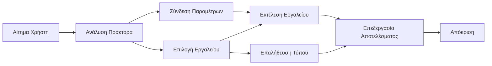

# 🛠️ Προχωρημένη Χρήση Εργαλείων με Azure OpenAI (Responses API) (.NET)

## 📋 Στόχοι Μάθησης

Αυτό το σημειωματάριο παρουσιάζει πρότυπα ολοκλήρωσης εργαλείων επιπέδου επιχείρησης χρησιμοποιώντας το Microsoft Agent Framework στο .NET με Azure OpenAI (Responses API). Θα μάθετε να δημιουργείτε εξελιγμένους agents με πολλαπλά εξειδικευμένα εργαλεία, αξιοποιώντας τον ισχυρό τύπο της C# και τα χαρακτηριστικά επιχειρήσεων του .NET.

### Προχωρημένες Δυνατότητες Εργαλείων που θα Κυριαρχήσετε

- 🔧 **Αρχιτεκτονική Πολυεργαλείων**: Δημιουργία agents με πολλαπλές εξειδικευμένες δυνατότητες
- 🎯 **Εκτέλεση Εργαλείων με Ασφαλή Τύπο**: Αξιοποίηση της επαλήθευσης κατά τη μεταγλώττιση στην C#
- 📊 **Πρότυπα Εργαλείων Επιχειρήσεων**: Σχεδίαση εργαλείων και διαχείριση σφαλμάτων έτοιμων για παραγωγή
- 🔗 **Σύνθεση Εργαλείων**: Συνδυασμός εργαλείων για πολύπλοκα επιχειρησιακά ροή εργασίας

## 🎯 Οφέλη Αρχιτεκτονικής Εργαλείων .NET

### Χαρακτηριστικά Εργαλείων Επιχειρήσεων

- **Επαλήθευση κατά τη Μεταγλώττιση**: Ισχυρή πληροφόρηση τύπων εξασφαλίζει ορθότητα παραμέτρων εργαλείων
- **Ένεση Εξαρτήσεων**: Ενσωμάτωση κοντέινερ IoC για διαχείριση εργαλείων
- **Πρότυπα Async/Await**: Μη αποκλειστική εκτέλεση εργαλείων με σωστή διαχείριση πόρων
- **Δομημένη Καταγραφή**: Ενσωματωμένη καταγραφή για παρακολούθηση εκτέλεσης εργαλείων

### Πρότυπα Έτοιμα για Παραγωγή

- **Διαχείριση Εξαιρέσεων**: Ολοκληρωμένη διαχείριση σφαλμάτων με τυποποιημένες εξαιρέσεις
- **Διαχείριση Πόρων**: Σωστά πρότυπα απόρριψης και διαχείρισης μνήμης
- **Παρακολούθηση Απόδοσης**: Ενσωματωμένα μετρικά και μετρητές απόδοσης
- **Διαχείριση Παραμετροποίησης**: Παραμετροποίηση ασφαλής ως προς τον τύπο με επαλήθευση

## 🔧 Τεχνική Αρχιτεκτονική

### Κύρια Συστατικά Εργαλείων .NET

- **Microsoft.Extensions.AI**: Ενοποιημένο επίπεδο αφαιρετικό εργαλείων
- **Microsoft.Agents.AI**: Ορχήστρωση εργαλείων επιπέδου επιχείρησης
- **Azure OpenAI (Responses API)**: Πελάτης API υψηλής απόδοσης με pooling συνδέσεων

### Γραμμή Εκτέλεσης Εργαλείων



## 🛠️ Κατηγορίες Εργαλείων & Πρότυπα

### 1. **Εργαλεία Επεξεργασίας Δεδομένων**

- **Επαλήθευση Εισόδου**: Ισχυρός τύπος με δεδομένα ανιχνευτικά
- **Μετασχηματιστικές Λειτουργίες**: Ασφαλείς ως προς τον τύπο μετατροπές και μορφοποιήσεις δεδομένων
- **Επιχειρησιακή Λογική**: Εργαλεία υπολογισμών και ανάλυσης ειδικών πεδίων
- **Μορφοποίηση Εξόδου**: Δομημένη παραγωγή απάντησης

### 2. **Εργαλεία Ενσωμάτωσης** 

- **Συνδέσεις API**: Ενσωμάτωση υπηρεσιών RESTful με HttpClient
- **Εργαλεία Βάσης Δεδομένων**: Ενσωμάτωση Entity Framework για πρόσβαση δεδομένων
- **Λειτουργίες Αρχείων**: Ασφαλείς λειτουργίες συστήματος αρχείων με επαλήθευση
- **Εξωτερικές Υπηρεσίες**: Πρότυπα ενσωμάτωσης τρίτων υπηρεσιών

### 3. **Χρήσιμα Εργαλεία**

- **Επεξεργασία Κειμένου**: Εργαλεία χειρισμού και μορφοποίησης συμβολοσειρών
- **Λειτουργίες Ημερομηνίας/Ώρας**: Υπολογισμοί ημερομηνίας/ώρας με γνώση πολιτισμού
- **Μαθηματικά Εργαλεία**: Ακριβείς υπολογισμοί και στατιστικές λειτουργίες
- **Εργαλεία Επαλήθευσης**: Επαλήθευση επιχειρησιακών κανόνων και επικύρωση δεδομένων

Έτοιμοι να δημιουργήσετε agents επιπέδου επιχείρησης με ισχυρές, ασφαλείς ως προς τον τύπο δυνατότητες εργαλείων στο .NET; Ας σχεδιάσουμε μερικές επαγγελματικές λύσεις! 🏢⚡

## 🚀 Ξεκινώντας

### Προαπαιτούμενα

- [.NET 10 SDK](https://dotnet.microsoft.com/download/dotnet/10.0) ή νεότερο
- Ένας [λογαριασμός Azure](https://azure.microsoft.com/free/) με πόρο Azure OpenAI και ανάπτυξη μοντέλου
- Το [Azure CLI](https://learn.microsoft.com/cli/azure/install-azure-cli) — σύνδεση με `az login`

### Απαιτούμενες Μεταβλητές Περιβάλλοντος

```bash
# zsh/bash
export AZURE_OPENAI_ENDPOINT=https://<your-resource>.openai.azure.com
export AZURE_OPENAI_DEPLOYMENT=gpt-4.1-mini
# Στη συνέχεια, συνδεθείτε ώστε το AzureCliCredential να μπορεί να πάρει ένα διακριτικό
az login
```

```powershell
# PowerShell
$env:AZURE_OPENAI_ENDPOINT = "https://<your-resource>.openai.azure.com"
$env:AZURE_OPENAI_DEPLOYMENT = "gpt-4.1-mini"
# Στη συνέχεια, συνδεθείτε ώστε το AzureCliCredential να μπορέσει να πάρει ένα διακριτικό
az login
```

### Παράδειγμα Κώδικα

Για να τρέξετε το παράδειγμα κώδικα,

```bash
# zsh/bash
chmod +x ./04-dotnet-agent-framework.cs
./04-dotnet-agent-framework.cs
```

Ή χρησιμοποιώντας το dotnet CLI:

```bash
dotnet run ./04-dotnet-agent-framework.cs
```

Δείτε το [`04-dotnet-agent-framework.cs`](../../../../04-tool-use/code_samples/04-dotnet-agent-framework.cs) για τον πλήρη κώδικα.

```csharp
#!/usr/bin/dotnet run

#:package Microsoft.Extensions.AI@10.*
#:package Microsoft.Agents.AI.OpenAI@1.*-*
#:package Azure.AI.OpenAI@2.1.0
#:package Azure.Identity@1.13.1

using System.ComponentModel;

using Microsoft.Agents.AI;
using Microsoft.Extensions.AI;

using Azure.AI.OpenAI;
using Azure.Identity;

// Tool Function: Random Destination Generator
// This static method will be available to the agent as a callable tool
// The [Description] attribute helps the AI understand when to use this function
// This demonstrates how to create custom tools for AI agents
[Description("Provides a random vacation destination.")]
static string GetRandomDestination()
{
    // List of popular vacation destinations around the world
    // The agent will randomly select from these options
    var destinations = new List<string>
    {
        "Paris, France",
        "Tokyo, Japan",
        "New York City, USA",
        "Sydney, Australia",
        "Rome, Italy",
        "Barcelona, Spain",
        "Cape Town, South Africa",
        "Rio de Janeiro, Brazil",
        "Bangkok, Thailand",
        "Vancouver, Canada"
    };

    // Generate random index and return selected destination
    // Uses System.Random for simple random selection
    var random = new Random();
    int index = random.Next(destinations.Count);
    return destinations[index];
}

// Azure OpenAI with the Responses API (stable v1 endpoint). Sign in with `az login`.
var azureEndpoint = Environment.GetEnvironmentVariable("AZURE_OPENAI_ENDPOINT")
    ?? throw new InvalidOperationException("AZURE_OPENAI_ENDPOINT is not set.");
var deployment = Environment.GetEnvironmentVariable("AZURE_OPENAI_DEPLOYMENT") ?? "gpt-4.1-mini";

var azureClient = new AzureOpenAIClient(new Uri(azureEndpoint), new AzureCliCredential());

// Define Agent Identity and Comprehensive Instructions
// Agent name for identification and logging purposes
var AGENT_NAME = "TravelAgent";

// Detailed instructions that define the agent's personality, capabilities, and behavior
// This system prompt shapes how the agent responds and interacts with users
var AGENT_INSTRUCTIONS = """
You are a helpful AI Agent that can help plan vacations for customers.

Important: When users specify a destination, always plan for that location. Only suggest random destinations when the user hasn't specified a preference.

When the conversation begins, introduce yourself with this message:
"Hello! I'm your TravelAgent assistant. I can help plan vacations and suggest interesting destinations for you. Here are some things you can ask me:
1. Plan a day trip to a specific location
2. Suggest a random vacation destination
3. Find destinations with specific features (beaches, mountains, historical sites, etc.)
4. Plan an alternative trip if you don't like my first suggestion

What kind of trip would you like me to help you plan today?"

Always prioritize user preferences. If they mention a specific destination like "Bali" or "Paris," focus your planning on that location rather than suggesting alternatives.
""";

// Create AI Agent with Advanced Travel Planning Capabilities
// Get the Responses client for the deployment and create the AI agent
// Configure agent with name, detailed instructions, and available tools
// This demonstrates the .NET agent creation pattern with full configuration
AIAgent agent = azureClient
    .GetChatClient(deployment)
    .AsAIAgent(
        name: AGENT_NAME,
        instructions: AGENT_INSTRUCTIONS,
        tools: [AIFunctionFactory.Create(GetRandomDestination)]
    );

// Create New Conversation Session for Context Management
// Initialize a new conversation session to maintain context across multiple interactions
// Sessions enable the agent to remember previous exchanges and maintain conversational state
// This is essential for multi-turn conversations and contextual understanding
await using var session = await agent.CreateSessionAsync();

// Execute Agent: First Travel Planning Request
// Run the agent with an initial request that will likely trigger the random destination tool
// The agent will analyze the request, use the GetRandomDestination tool, and create an itinerary
// Using the session parameter maintains conversation context for subsequent interactions
await foreach (var update in agent.RunStreamingAsync("Plan me a day trip", session))
{
    await Task.Delay(10);
    Console.Write(update);
}

Console.WriteLine();

// Execute Agent: Follow-up Request with Context Awareness
// Demonstrate contextual conversation by referencing the previous response
// The agent remembers the previous destination suggestion and will provide an alternative
// This showcases the power of conversation sessions and contextual understanding in .NET agents
await foreach (var update in agent.RunStreamingAsync("I don't like that destination. Plan me another vacation.", session))
{
    await Task.Delay(10);
    Console.Write(update);
}
```

---

<!-- CO-OP TRANSLATOR DISCLAIMER START -->
**Αποποίηση ευθυνών**:
Αυτό το έγγραφο έχει μεταφραστεί χρησιμοποιώντας την υπηρεσία μετάφρασης με τεχνητή νοημοσύνη [Co-op Translator](https://github.com/Azure/co-op-translator). Ενώ επιδιώκουμε την ακρίβεια, παρακαλούμε να έχετε υπόψη ότι οι αυτοματοποιημένες μεταφράσεις ενδέχεται να περιέχουν λάθη ή ανακρίβειες. Το πρωτότυπο έγγραφο στη μητρική του γλώσσα πρέπει να θεωρείται η αυθεντική πηγή. Για κρίσιμες πληροφορίες, συνιστάται επαγγελματική ανθρώπινη μετάφραση. Δεν φέρουμε ευθύνη για τυχόν παρεξηγήσεις ή λανθασμένες ερμηνείες που προκύπτουν από τη χρήση αυτής της μετάφρασης.
<!-- CO-OP TRANSLATOR DISCLAIMER END -->