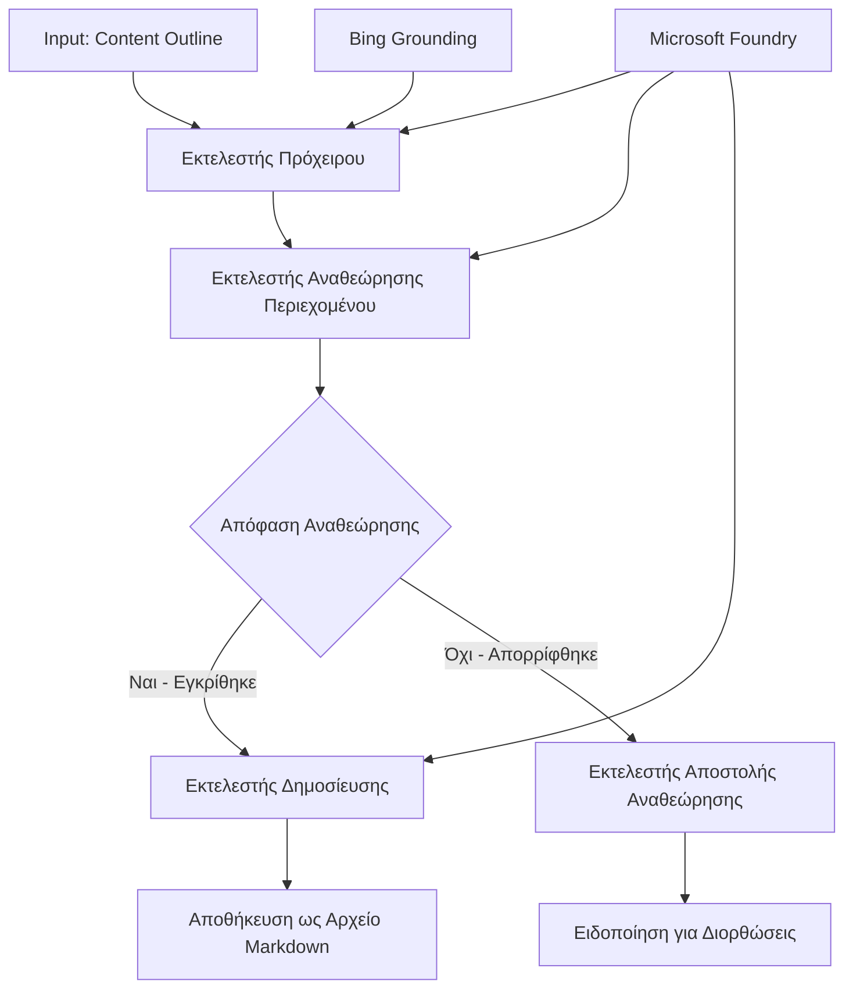

# 🔀 Ροές Εργασίας Υπό Όρους με Microsoft Foundry (.NET)

## 📋 Εκμάθηση Ροής Εργασίας με Βάση τις Έξυπνες Αποφάσεις

Αυτό το τετράδιο παρουσιάζει **πρότυπα ροής εργασίας υπό όρους** χρησιμοποιώντας το Microsoft Foundry και το Microsoft Agent Framework για .NET. Θα μάθετε πώς να κατασκευάζετε εξελιγμένες, αποφασιστικά καθοδηγούμενες ροές εργασίας που δρομολογούν επεξεργασία με ευφυΐα βασισμένη σε ανάλυση τεχνητής νοημοσύνης, επιχειρηματικούς κανόνες και δυναμικές συνθήκες για αυτοματοποίηση επιπέδου επιχειρήσεων.

## 🎯 Στόχοι Εκμάθησης

### 🧠 **Αρχιτεκτονική Ευφυούς Λήψης Αποφάσεων**
- **Υλοποίηση Λογικής υπό Όρους**: Δημιουργία σύνθετων δέντρων αποφάσεων με πολλαπλά σημεία διακλάδωσης
- **Δρομολόγηση με Τεχνητή Νοημοσύνη**: Χρήση μοντέλων Microsoft Foundry για έξυπνες αποφάσεις δρομολόγησης
- **Δυναμική Προσαρμογή Ροής Εργασίας**: Τροποποίηση συμπεριφοράς ροής εργασίας βάσει ανάλυσης και συνθηκών εκτέλεσης
- **Ενσωμάτωση Επιχειρησιακών Κανόνων**: Ενσωμάτωση επιχειρηματικής λογικής και απαιτήσεων συμμόρφωσης σε ροές εργασίας

### 🔀 **Προηγμένα Πρότυπα Υπό Όρους**
- **Λήψη Αποφάσεων με Πολλαπλά Κριτήρια**: Αξιολόγηση πολλαπλών παραγόντων για αποφάσεις δρομολόγησης
- **Επεξεργασία με Ενημέρωση Συμφραζομένων**: Λήψη αποφάσεων βάσει συσσωρευμένου συμφραζόμενου και ιστορικού ροής εργασίας
- **Προσαρμοστική Τροποποίηση Ροής Εργασίας**: Δυναμική προσαρμογή μονοπατιών επεξεργασίας βάσει συνθηκών σε πραγματικό χρόνο
- **Ενσωμάτωση Κινητήρα Κανόνων**: Υλοποίηση εξελιγμένων κινητήρων επιχειρηματικών κανόνων μέσα σε ροές εργασίας

### 🏢 **Εφαρμογές Υπό Όρους για Επιχειρήσεις**
- **Κατηγοριοποίηση & Δρομολόγηση Εγγράφων**: Αυτόματη κατηγοριοποίηση και δρομολόγηση εγγράφων σε κατάλληλες ροές εργασίας
- **Διαχωρισμός Εξυπηρέτησης Πελατών**: Έξυπνη δρομολόγηση ερωτημάτων πελατών σε εξειδικευμένες ομάδες διαχείρισης
- **Επεξεργασία Συμμόρφωσης & Κινδύνου**: Εφαρμογή διαφορετικών διαδικασιών επικύρωσης και ανασκόπησης βάσει αξιολόγησης κινδύνου
- **Ροές Εξασφάλισης Ποιότητας**: Δρομολόγηση περιεχομένου μέσω κατάλληλων διαδικασιών ανασκόπησης με βάση μετρικές ποιότητας

## ⚙️ Προαπαιτούμενα & Ρύθμιση

### 📦 **Απαιτούμενα Πακέτα NuGet**

Προηγμένα πακέτα για επεξεργασία ροών εργασίας υπό όρους:

```xml
<!-- Core AI Framework -->
<PackageReference Include="Microsoft.Extensions.AI" Version="9.9.0" />

<!-- Azure AI Agents with Persistent State -->
<PackageReference Include="Azure.AI.Agents.Persistent" Version="1.2.0-beta.5" />

<!-- Azure Identity and Utilities -->
<PackageReference Include="Azure.Identity" Version="1.15.0" />
<PackageReference Include="System.Linq.Async" Version="6.0.3" />
<PackageReference Include="DotNetEnv" Version="3.1.1" />

<!-- Local Workflow Framework References -->
<!-- Microsoft.Agents.Workflows.dll - Advanced workflow orchestration -->
<!-- Microsoft.Agents.AI.AzureAI.dll - Microsoft Foundry integration -->
<!-- Microsoft.Agents.AI.dll - Core agent abstractions -->
```

### 🔑 **Διαμόρφωση Microsoft Foundry**

**Απαιτούμενοι Πόροι Azure:**
- Χώρος εργασίας Microsoft Foundry με μοντέλα επεξεργασίας υπό όρους
- Συνδρομή Azure με κατάλληλα όρια υπολογιστικής ισχύος και δικαιώματα
- Αναπτυγμένα μοντέλα Τεχνητής Νοημοσύνης για λήψη αποφάσεων και ανάλυση περιεχομένου
- (Προαιρετικό) Σύνδεση με Bing Search API για δυνατότητες επιβεβαίωσης

**Διαμόρφωση Περιβάλλοντος (.env αρχείο):**
```env
# Microsoft Foundry Configuration
AZURE_AI_PROJECT_ENDPOINT=https://your-project.cognitiveservices.azure.com/
BING_CONNECTION_ID=your-bing-connection-id
```

**Ρύθμιση Πιστοποίησης:**
```csharp
// Azure CLI or Managed Identity authentication
using Azure.Identity;
var credential = new AzureCliCredential();

// Load environment configuration
DotNetEnv.Env.Load("../../../.env");
```

### 🏗️ **Αρχιτεκτονική Ροής Εργασίας Υπό Όρους**



**Κύρια Συστατικά:**
- **Εκτελεστής Προσχεδίου**: Πράκτορας AI που δημιουργεί αρχικά προσχέδια περιεχομένου από περιγράμματα
- **Εκτελεστής Ανασκόπησης Περιεχομένου**: Πράκτορας AI που αξιολογεί την ποιότητα και τη συμμόρφωση του προσχεδίου
- **Υπό Όρους Δρομολόγηση**: Λογική αποφάσεων που δρομολογεί βάσει αποτελεσμάτων ανασκόπησης
- **Μονοπάτια Δημοσίευσης/Ανασκόπησης**: Ξεχωριστές διαδρομές επεξεργασίας για εγκεκριμένο έναντι απορριφθέν περιεχομένου
- **Διαχείριση Κατάστασης**: Διατηρεί συμφραζόμενο περιεχομένου και ανασκόπησης καθ’ όλη τη ροή εργασίας

## 🎨 **Πρότυπα Σχεδίασης Ροής Εργασίας Υπό Όρους**

### 📋 **Παραγωγή Περιεχομένου με Πύλες Ποιότητας**
```
Outline → Draft Creation → Quality Review → {Approve: Publish | Reject: Revise}
```

### 🎯 **Επεξεργασία Εγγράφων Βασισμένη σε Κίνδυνο**
```
Document → Risk Assessment → {Low: Standard | High: Enhanced Review}
```

### 🔍 **Ευφυής Δρομολόγηση Εξυπηρέτησης Πελατών**
```
Customer Query → Analysis → {Simple: FAQ Bot | Complex: Human Agent}
```

### 💼 **Ροές Εργασίας Καθοδηγούμενες από Συμμόρφωση**
```
Content → Compliance Check → {Pass: Publish | Fail: Legal Review}
```

## 🏢 **Πλεονεκτήματα Ροών Υπό Όρους για Επιχειρήσεις**

### 🎯 **Έξυπνη Αυτοματοποίηση**
- **Έξυπνη Λήψη Αποφάσεων**: Αποφάσεις δρομολόγησης με υποστήριξη AI βάσει ανάλυσης περιεχομένου και συμφραζομένων
- **Προσαρμοστική Επεξεργασία**: Ροές εργασίας που αυτόματα προσαρμόζονται σε μεταβαλλόμενες συνθήκες
- **Επιβολή Επιχειρηματικών Κανόνων**: Αυτόματη εφαρμογή σύνθετων επιχειρηματικών λογικών και πολιτικών
- **Δρομολόγηση με Ενημέρωση Συμφραζομένων**: Αποφάσεις βάσει ολόκληρου ιστορικού ροής εργασίας και συσσωρευμένων συμφραζομένων

### 📈 **Λειτουργική Αριστεία**
- **Βελτιστοποιημένη Κατανομή Πόρων**: Δρομολόγηση εργασίας στους πιο κατάλληλους ειδικούς και διαδικασίες
- **Μειωμένη Χειροκίνητη Παρέμβαση**: Αυτοματοποιημένη λήψη αποφάσεων που ελαχιστοποιεί την ανάγκη για χειροκίνητη δρομολόγηση
- **Ταχύτεροι Χρόνοι Επίλυσης**: Άμεση δρομολόγηση σε κατάλληλη εμπειρογνωμοσύνη και δυνατότητες επεξεργασίας
- **Ομοιόμορφη Εφαρμογή**: Ομοιόμορφη εφαρμογή επιχειρηματικών κανόνων και κριτηρίων απόφασης

### 🛡️ **Διαχείριση Κινδύνου & Συμμόρφωση**
- **Αυτοματοποιημένη Αξιολόγηση Κινδύνου**: Αξιολόγηση επιπέδων κινδύνου περιεχομένου και κατάστασης με υποστήριξη AI
- **Επιβολή Συμμόρφωσης**: Αυτόματη δρομολόγηση μέσω απαιτούμενων ρυθμιστικών διαδικασιών
- **Εφαρμογή Πρωτοκόλλων Ασφαλείας**: Ενισχυμένα μέτρα ασφαλείας συμφωνα με εκτίμηση κινδύνου
- **Διαχείριση Αρχειοθέτησης Ελέγχου**: Πλήρης τεκμηρίωση των αποφάσεων δρομολόγησης και των αιτιολογήσεων

### 📊 **Αναλύσεις & Συνεχής Βελτίωση**
- **Αναλύσεις Αποφάσεων**: Παρακολούθηση αποτελεσματικότητας και ακρίβειας των αποφάσεων δρομολόγησης
- **Αναγνώριση Προτύπων**: Αναγνώριση τάσεων και προτύπων στις αποφάσεις δρομολόγησης με το πέρασμα του χρόνου
- **Βελτιστοποίηση Απόδοσης**: Συνεχής βελτίωση κριτηρίων αποφάσεων και αποδοτικότητας δρομολόγησης
- **Επιχειρηματική Ευφυΐα**: Αναλύσεις χαρακτηριστικών περιεχομένου και απαιτήσεων επεξεργασίας

### 🔧 **Τεχνική Αριστεία**
- **Επίμονη Διαχείριση Κατάστασης**: Διατήρηση σύνθετης κατάστασης κατά την εκτέλεση της ροής εργασίας
- **Επεκτάσιμη Αρχιτεκτονική**: Αντιμετώπιση απαιτήσεων επεξεργασίας υπό όρους υψηλού όγκου
- **Δυνατότητες Ενσωμάτωσης**: Αδιάλειπτη ενσωμάτωση με υπάρχοντα επιχειρηματικά συστήματα και διαδικασίες
- **Παρακολούθηση & Παρατηρησιμότητα**: Ολοκληρωμένη παρακολούθηση απόδοσης ροής εργασίας και αποφάσεων

Ας δημιουργήσουμε ευφυείς, αποφασιστικά καθοδηγούμενες ροές εργασίας επιχειρήσεων με .NET! 🚀

## 💻 Εκτέλεση του Κώδικα

Η πλήρης υλοποίηση είναι διαθέσιμη στο `04.dotnet-agent-framework-workflow-aifoundry-condition.cs`. Αυτό παρουσιάζει μια **ροή εργασίας παραγωγής περιεχομένου με πύλες ποιότητας**:

### 🏗️ **Αρχιτεκτονική Ροής Εργασίας**

```
Content Outline → Draft Creation → Quality Review → Conditional Routing:
                                                      ├─ Approved (>200 words) → Publish
                                                      └─ Rejected (<200 words) → Review Notification
```

**Πράκτορες στη Ροή Εργασίας:**
1. **Πράκτορας Ευαγγελιστής**: Δημιουργεί προσχέδια μαθημάτων από περιγράμματα με επιβεβαίωση Bing
2. **Πράκτορας Ανασκόπησης Περιεχομένου**: Αξιολογεί την ποιότητα του προσχεδίου (αριθμός λέξεων, πληρότητα)
3. **Πράκτορας Δημοσίευσης**: Αποθηκεύει εγκεκριμένο περιεχόμενο ως αρχεία Markdown με χρονική σήμανση

**Προσαρμοσμένοι Εκτελεστές:**
1. **DraftExecutor**: Συντονίζει τη δημιουργία προσχεδίου
2. **ContentReviewExecutor**: Πραγματοποιεί αξιολόγηση ποιότητας
3. **PublishExecutor**: Διαχειρίζεται τη δημοσίευση εγκεκριμένου περιεχομένου
4. **SendReviewExecutor**: Διαχειρίζεται ειδοποιήσεις για απορριφθέν περιεχόμενο

### 🚀 Εκτέλεση Παραδείγματος

**Προαπαιτούμενα:**
- Διαμορφωμένος χώρος εργασίας Microsoft Foundry
- Πιστοποίηση Azure CLI (`az login`)
- (Προαιρετικό) Σύνδεση Bing Search για επιβεβαίωση

```bash
# Κάντε το σενάριο εκτελέσιμο (Unix/Linux/macOS)
chmod +x 04.dotnet-agent-framework-workflow-aifoundry-condition.cs

# Εκτελέστε τη ροή εργασίας με όρους
./04.dotnet-agent-framework-workflow-aifoundry-condition.cs
```

Ή στα Windows:
```powershell
dotnet run 04.dotnet-agent-framework-workflow-aifoundry-condition.cs
```

### 📝 Αναμενόμενο Αποτέλεσμα

Η ροή εργασίας θα:
1. **Δημιουργήσει Πράκτορες**: Αρχικοποίηση τριών εξειδικευμένων πρακτόρων Microsoft Foundry
2. **Παράγει Πρόχειρο**: Ο πράκτορας Ευαγγελιστής δημιουργεί πρόχειρο μαθήματος από περίγραμμα
3. **Ανασκόπηση Περιεχομένου**: Ο πράκτορας ανασκόπησης αξιολογεί την ποιότητα του προσχεδίου
4. **Υπό Όρους Δρομολόγηση**:
   - **Εάν εγκεκριμένο (>200 λέξεις)**: Ο εκτελεστής δημοσίευσης αποθηκεύει ως αρχείο Markdown
   - **Εάν απορριφθεί (<200 λέξεις)**: Αποστολή ειδοποίησης ανασκόπησης
5. **Εμφάνιση Αποτελεσμάτων**: Παρουσίαση τελικού αποτελέσματος ροής εργασίας

### 🔧 Επιλογές Προσαρμογής

**Τροποποίηση Κριτηρίων Ανασκόπησης:**
```csharp
const string ContentReviewerInstructions = @"
You are a content reviewer...
1. Check if content is more than 500 words (instead of 200)
2. Verify technical accuracy
3. Ensure proper formatting
...";
```

**Προσθήκη Περισσότερων Υπό Όρους Διαδρομών:**
```csharp
var workflow = new WorkflowBuilder(draftExecutor)
    .AddEdge(draftExecutor, contentReviewerExecutor)
    .AddEdge(contentReviewerExecutor, publishExecutor, condition: GetCondition("Excellent"))
    .AddEdge(contentReviewerExecutor, editExecutor, condition: GetCondition("Good"))
    .AddEdge(contentReviewerExecutor, sendReviewerExecutor, condition: GetCondition("Poor"))
    .Build();
```

**Αλλαγή Απαιτήσεων Περιεχομένου:**
```csharp
string OUTLINE_Content = @"
# Your Custom Topic
## Section 1
https://your-reference-url
## Section 2
...
";
```

### 🎯 Πραγματικές Εφαρμογές

Αυτό το πρότυπο ροής εργασίας υπό όρους είναι ιδανικό για:
- **Συστήματα Διαχείρισης Περιεχομένου**: Αυτοματοποιημένες επιμελητικές ροές εργασίας με πύλες ποιότητας
- **Επεξεργασία Εγγράφων**: Δρομολόγηση εγγράφων βάσει κατηγοριοποίησης και συμμόρφωσης
- **Υποστήριξη Πελατών**: Έξυπνη δρομολόγηση αιτημάτων βάσει πολυπλοκότητας και επείγοντος
- **Νομική Ανασκόπηση**: Δρομολόγηση συμβάσεων βάσει αξιολόγησης κινδύνου και αξίας
- **Διαδικασίες Ανθρώπινου Δυναμικού**: Δρομολόγηση αιτήσεων μέσω κατάλληλων ροών εργασίας ελέγχου

### 🔍 Κατανόηση Λογικής Υπό Όρους

**Συνάρτηση Συνθήκης:**
```csharp
public Func<object?, bool> GetCondition(string expectedResult) =>
    reviewResult => reviewResult is ReviewResult review && review.Result == expectedResult;
```

Αυτή η συνάρτηση δημιουργεί ένα προδικαστικό που:
1. Ελέγχει εάν το αποτέλεσμα είναι τύπου `ReviewResult`
2. Συγκρίνει την ιδιότητα `Result` με την αναμενόμενη τιμή
3. Επιστρέφει true/false για να καθορίσει τη δρομολόγηση

**Ακμές Ροής Εργασίας με Συνθήκες:**
```csharp
.AddEdge(contentReviewerExecutor, publishExecutor, condition: GetCondition("Yes"))
.AddEdge(contentReviewerExecutor, sendReviewerExecutor, condition: GetCondition("No"))
```

### 📊 Προηγμένα Χαρακτηριστικά

**Επαλήθευση JSON Schema:**
Η ροή εργασίας χρησιμοποιεί JSON schemas για να διασφαλίσει δομημένες απαντήσεις:

```csharp
// Define response structure
public class ReviewResult
{
    [JsonPropertyName("review_result")]
    public string Result { get; set; } = string.Empty;
    
    [JsonPropertyName("reason")]
    public string Reason { get; set; } = string.Empty;
    
    [JsonPropertyName("draft_content")]
    public string DraftContent { get; set; } = string.Empty;
}

// Apply to agent
ResponseFormat = ChatResponseFormat.ForJsonSchema(
    AIJsonUtilities.CreateJsonSchema(typeof(ReviewResult)), 
    "ReviewResult", 
    "Review Result From DraftContent"
)
```

**Ενσωμάτωση Bing Grounding:**
Ο πράκτορας Ευαγγελιστής χρησιμοποιεί το Bing grounding για πρόσβαση σε πληροφορίες σε πραγματικό χρόνο:

```csharp
var bingGroundingConfig = new BingGroundingSearchConfiguration(bing_conn_id);
BingGroundingToolDefinition bingGroundingTool = new(
    new BingGroundingSearchToolParameters([bingGroundingConfig])
);
```

Αυτό επιτρέπει στον πράκτορα να ακολουθεί URLs στο περίγραμμα και να εξάγει τρέχουσες πληροφορίες.

### 🛡️ Διαχείριση Σφαλμάτων

Η ροή εργασίας περιλαμβάνει ανθεκτική διαχείριση σφαλμάτων για απορριφθέν περιεχόμενο:
- Τα σφάλματα ανασκόπησης ενεργοποιούν εναλλακτική διαδρομή
- Οι ειδοποιήσεις παρέχουν σαφείς λόγους απόρριψης
- Το περιεχόμενο διατηρείται για αναθεώρηση

### 🔄 Επέκταση της Ροής Εργασίας

**Προσθήκη Βρόχου Αναθεώρησης:**
Δημιουργία βρόχου ανατροφοδότησης που ξαναδημιουργεί προσχέδια αυτόματα:

```csharp
.AddEdge(contentReviewerExecutor, publishExecutor, condition: GetCondition("Yes"))
.AddEdge(contentReviewerExecutor, draftExecutor, condition: GetCondition("No")) // Loop back
```

**Υλοποίηση Πολλαπλών Επιπέδων Ανασκόπησης:**
Προσθήκη πολλαπλών σταδίων ανασκόπησης με διαφορετικά κριτήρια:

```csharp
.AddEdge(draftExecutor, technicalReviewer)
.AddEdge(technicalReviewer, editorialReviewer, condition: GetCondition("TechPass"))
.AddEdge(editorialReviewer, publishExecutor, condition: GetCondition("EditPass"))
```

Αυτό το πρότυπο ροής εργασίας υπό όρους παρέχει το θεμέλιο για την κατασκευή εξελιγμένων, ευφυών συστημάτων αυτοματοποίησης επιχειρήσεων! 🚀

---

<!-- CO-OP TRANSLATOR DISCLAIMER START -->
**Αποποίηση ευθυνών**:
Αυτό το έγγραφο έχει μεταφραστεί χρησιμοποιώντας την υπηρεσία μετάφρασης με τεχνητή νοημοσύνη [Co-op Translator](https://github.com/Azure/co-op-translator). Ενώ επιδιώκουμε την ακρίβεια, παρακαλούμε να έχετε υπόψη ότι οι αυτοματοποιημένες μεταφράσεις ενδέχεται να περιέχουν λάθη ή ανακρίβειες. Το πρωτότυπο έγγραφο στη μητρική του γλώσσα πρέπει να θεωρείται η αυθεντική πηγή. Για κρίσιμες πληροφορίες, συνιστάται επαγγελματική ανθρώπινη μετάφραση. Δεν φέρουμε ευθύνη για τυχόν παρεξηγήσεις ή λανθασμένες ερμηνείες που προκύπτουν από τη χρήση αυτής της μετάφρασης.
<!-- CO-OP TRANSLATOR DISCLAIMER END -->