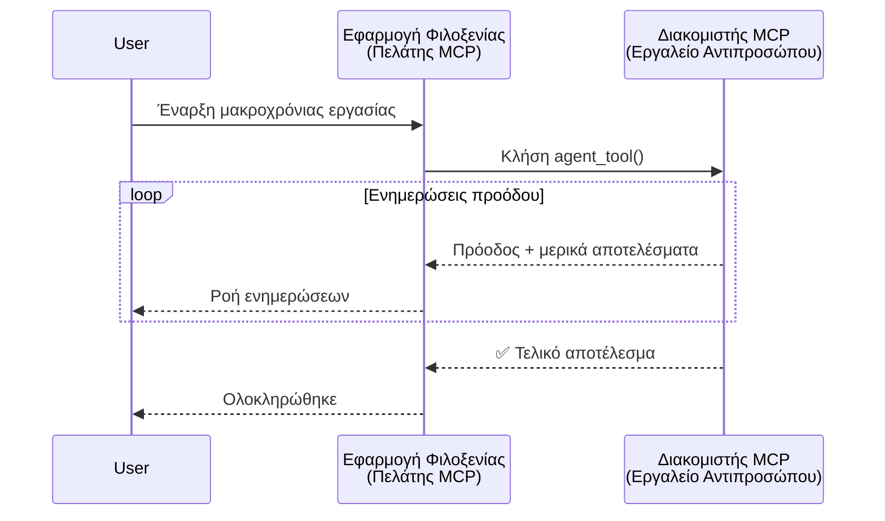
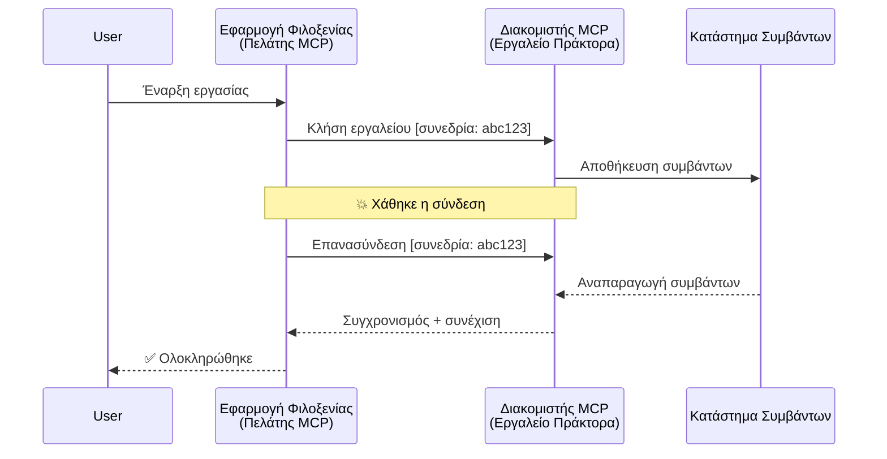
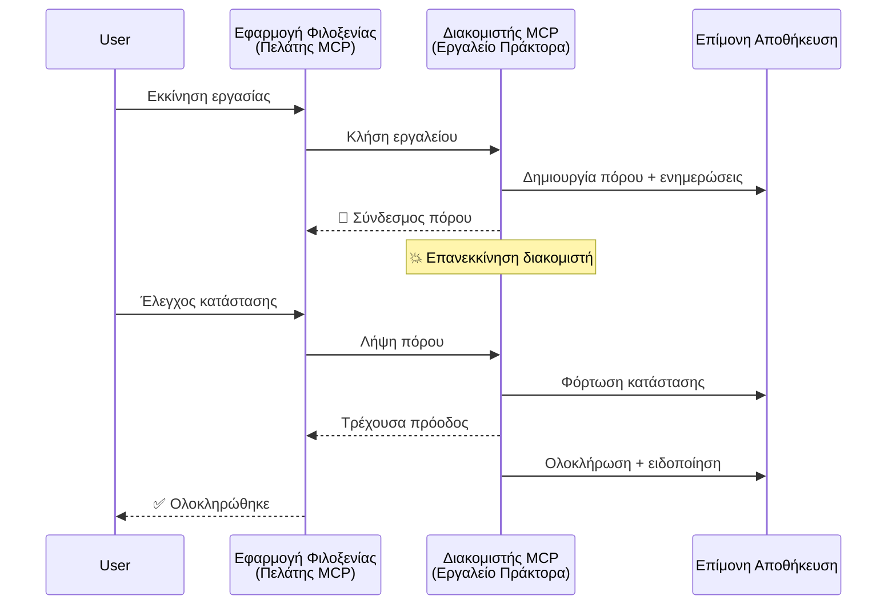
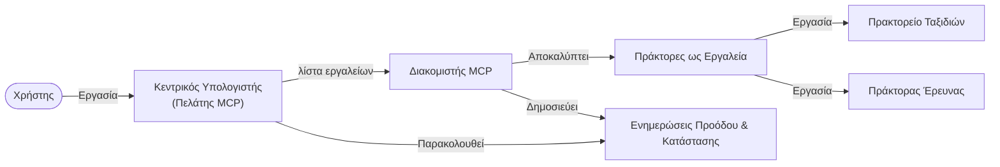

# Κατασκευή Συστημάτων Επικοινωνίας Agent-to-Agent με MCP

> TL;DR - Μπορείτε να Δημιουργήσετε Επικοινωνία Agent2Agent στο MCP; Ναι!

Το MCP έχει εξελιχθεί σημαντικά πέρα από τον αρχικό του στόχο του "παροχή συμφραζομένων σε LLMs". Με πρόσφατες βελτιώσεις όπως [επαναλαμβανόμενες ροές](https://modelcontextprotocol.io/docs/concepts/transports#resumability-and-redelivery), [επισήμανση](https://modelcontextprotocol.io/specification/2025-06-18/client/elicitation), [δειγματοληψία](https://modelcontextprotocol.io/specification/2025-06-18/client/sampling), και ειδοποιήσεις ([πρόοδος](https://modelcontextprotocol.io/specification/2025-06-18/basic/utilities/progress) και [πόροι](https://modelcontextprotocol.io/specification/2025-06-18/schema#resourceupdatednotification)), το MCP πλέον προσφέρει μια στιβαρή βάση για την κατασκευή σύνθετων συστημάτων επικοινωνίας agent-to-agent.

## Η Λανθασμένη Αντίληψη για Agent/Εργαλείο

Καθώς περισσότεροι προγραμματιστές εξερευνούν εργαλεία με agentic συμπεριφορές (λειτουργία μεγάλης διάρκειας, ενδεχόμενη ανάγκη για επιπλέον είσοδο κατά την εκτέλεση κλπ.), υπάρχει μια κοινή παρανόηση ότι το MCP δεν είναι κατάλληλο κυρίως επειδή τα πρώιμα παραδείγματα των εργαλείων του επικεντρωνόταν σε απλά πρότυπα ζήτησης-απόκρισης.

Αυτή η αντίληψη είναι ξεπερασμένη. Η προδιαγραφή του MCP έχει βελτιωθεί σημαντικά τους τελευταίους μήνες με δυνατότητες που γεφυρώνουν το χάσμα για την κατασκευή agentic συμπεριφορών μεγάλης διάρκειας:

- **Ροές & Μερικά Αποτελέσματα**: Ενημερώσεις προόδου σε πραγματικό χρόνο κατά την εκτέλεση
- **Επαναληψιμότητα**: Οι πελάτες μπορούν να επανασυνδεθούν και να συνεχίσουν μετά από αποσύνδεση
- **Ανθεκτικότητα**: Τα αποτελέσματα επιβιώνουν από επανεκκινήσεις διακομιστή (π.χ. μέσω συνδέσμων πόρων)
- **Πολλαπλές Επαναλήψεις (Multi-turn)**: Διαδραστική είσοδος κατά την εκτέλεση μέσω επισήμανσης και δειγματοληψίας

Αυτές οι δυνατότητες μπορούν να συνδυαστούν ώστε να επιτρέψουν πολύπλοκες agentic και πολυ-agent εφαρμογές, όλες αναπτυγμένες στο πρωτόκολλο MCP.

Για αναφορά, θα αναφερόμαστε σε έναν agent ως "εργαλείο" που είναι διαθέσιμο σε έναν διακομιστή MCP. Αυτό συνεπάγεται την ύπαρξη μιας εφαρμογής-κεντρικού υπολογιστή που υλοποιεί έναν MCP πελάτη ο οποίος δημιουργεί μια συνεδρία με τον MCP διακομιστή και μπορεί να καλέσει τον agent.

## Τι Κατασκευάζει ένα Εργαλείο MCP "Agentic";

Πριν προχωρήσουμε στην υλοποίηση, ας καθορίσουμε ποιες υποδομές απαιτούνται για την υποστήριξη agents μεγάλης διάρκειας.

> Θα ορίσουμε έναν agent ως οντότητα που μπορεί να λειτουργεί αυτόνομα για παρατεταμένες περιόδους, ικανή να χειρίζεται πολύπλοκες εργασίες που μπορεί να απαιτούν πολλαπλές αλληλεπιδράσεις ή προσαρμογές βάσει ανατροφοδότησης σε πραγματικό χρόνο.

### 1. Ροές & Μερικά Αποτελέσματα

Παραδοσιακά πρότυπα ζήτησης-απόκρισης δεν λειτουργούν για εργασίες μεγάλης διάρκειας. Οι agents πρέπει να παρέχουν:

- Ενημερώσεις προόδου σε πραγματικό χρόνο
- Ενδιάμεσα αποτελέσματα

**Υποστήριξη MCP**: Οι ειδοποιήσεις ενημέρωσης πόρων επιτρέπουν τη ροή μερικών αποτελεσμάτων, αν και αυτό απαιτεί προσεκτικό σχεδιασμό για να αποφευχθούν συγκρούσεις με το μοντέλο JSON-RPC 1:1 ζήτησης/απόκρισης.

| Δυνατότητα                 | Περίπτωση Χρήσης                                                                                                                                                 | Υποστήριξη MCP                                                          |
| -------------------------- | -------------------------------------------------------------------------------------------------------------------------------------------------------------- | ---------------------------------------------------------------------- |
| Ενημερώσεις Προόδου        | Ο χρήστης ζητά εργασία μετανάστευσης βάσης κώδικα. Ο agent ροής ενημερώνει πρόοδο: "10% - Ανάλυση εξαρτήσεων... 25% - Μετατροπή αρχείων TypeScript... 50% - Ενημέρωση εισαγωγών..." | ✅ Ειδοποιήσεις προόδου                                                 |
| Μερικά Αποτελέσματα        | Η εργασία "Δημιουργία βιβλίου" ροής μερικά αποτελέσματα, π.χ., 1) Διάγραμμα ιστορίας, 2) Λίστα κεφαλαίων, 3) Κάθε κεφάλαιο ως ολοκληρωμένο. Ο κεντρικός μπορεί να ελέγχει, να ακυρώνει ή να ανακατευθύνει σε κάθε στάδιο. | ✅ Οι ειδοποιήσεις μπορούν να "επεκταθούν" για να περιλάβουν μερικά αποτελέσματα, βλέπε προτάσεις στα PR 383, 776 |

<div align="center" style="font-style: italic; font-size: 0.95em; margin-bottom: 0.5em;">
<strong>Εικόνα 1:</strong> Αυτό το διάγραμμα απεικονίζει πώς ένας agent MCP ροής ενημερώσεις προόδου και μερικά αποτελέσματα σε πραγματικό χρόνο στην εφαρμογή-οικοδεσπότη κατά τη διάρκεια μιας εργασίας μεγάλης διάρκειας, επιτρέποντας στον χρήστη να παρακολουθεί την εκτέλεση σε πραγματικό χρόνο.
</div>



### 2. Επαναληψιμότητα

Οι agents πρέπει να χειρίζονται τις διακοπές δικτύου με ομαλό τρόπο:

- Επανασύνδεση μετά από αποσύνδεση (πελάτη)
- Συνέχιση από εκεί που σταμάτησε (επαναποστολή μηνυμάτων)

**Υποστήριξη MCP**: Το StreamableHTTP transport του MCP υποστηρίζει σήμερα την επανάληψη συνεδρίας και την επαναποστολή μηνυμάτων με session IDs και τελευταίο event ID. Σημαντικό είναι ότι ο διακομιστής πρέπει να υλοποιεί ένα EventStore που επιτρέπει την αναπαραγωγή γεγονότων κατά την επανασύνδεση του πελάτη.  
Σημειώστε ότι υπάρχει μια πρόταση κοινότητας (PR #975) που εξερευνά ροές επαναλήψιμες ανεξάρτητα από το transport.

| Δυνατότητα      | Περίπτωση Χρήσης                                                                                                                                              | Υποστήριξη MCP                                                         |
| --------------- | ------------------------------------------------------------------------------------------------------------------------------------------------------------- | --------------------------------------------------------------------- |
| Επαναληψιμότητα  | Ο πελάτης αποσυνδέεται κατά τη διάρκεια εργασίας μεγάλης διάρκειας. Κατά την επανασύνδεση, η συνεδρία συνεχίζεται με αναπαραγωγή των χαμένων γεγονότων, συνεχίζοντας ομαλά από εκεί που σταμάτησε. | ✅ StreamableHTTP transport με session IDs, αναπαραγωγή γεγονότων και EventStore |

<div align="center" style="font-style: italic; font-size: 0.95em; margin-bottom: 0.5em;">
<strong>Εικόνα 2:</strong> Αυτό το διάγραμμα δείχνει πώς το transport StreamableHTTP του MCP και το event store επιτρέπουν ομαλή επανάληψη συνεδρίας: αν ο πελάτης αποσυνδεθεί, μπορεί να επανασυνδεθεί και να αναπαράγει τα χαμένα γεγονότα, συνεχίζοντας την εργασία χωρίς απώλεια προόδου.
</div>



### 3. Ανθεκτικότητα

Οι agents μεγάλης διάρκειας χρειάζονται επίμονο (persistent) state:

- Τα αποτελέσματα επιβιώνουν επανεκκινήσεις διακομιστή
- Η κατάσταση μπορεί να ανακτηθεί ανεξάρτητα
- Παρακολούθηση προόδου μεταξύ συνεδριών

**Υποστήριξη MCP**: Το MCP υποστηρίζει πλέον έναν τύπο επιστροφής συνδέσμου πόρου για κλήσεις εργαλείων. Σήμερα, ένα πιθανό πρότυπο είναι να σχεδιάσετε ένα εργαλείο που δημιουργεί έναν πόρο και αμέσως επιστρέφει σύνδεσμο πόρου. Το εργαλείο μπορεί να συνεχίσει να αντιμετωπίζει την εργασία στο παρασκήνιο και να ενημερώνει τον πόρο. Αντίστοιχα, ο πελάτης μπορεί να επιλέξει να ελέγχει την κατάσταση αυτού του πόρου ώστε να λαμβάνει μερικά ή πλήρη αποτελέσματα (βάσει των ενημερώσεων που παρέχει ο διακομιστής) ή να εγγραφεί στον πόρο για ειδοποιήσεις ενημέρωσης.

Ένας περιορισμός εδώ είναι ότι ο έλεγχος πόρων (polling) ή η εγγραφή για ενημερώσεις μπορεί να καταναλώσει πόρους με συνέπειες σε μεγάλη κλίμακα. Υπάρχει μια ανοιχτή πρόταση κοινότητας (συμπεριλαμβανομένης της #992) που εξερευνά τη δυνατότητα ενσωμάτωσης webhooks ή triggers που ο διακομιστής μπορεί να καλέσει για να ειδοποιήσει τον πελάτη/οικοδεσπότη για ενημερώσεις.

| Δυνατότητα | Περίπτωση Χρήσης                                                                                                                                        | Υποστήριξη MCP                                                    |
| ---------- | ------------------------------------------------------------------------------------------------------------------------------------------------------- | ---------------------------------------------------------------- |
| Ανθεκτικότητα | Ο διακομιστής πέφτει κατά τη διάρκεια εργασίας μετανάστευσης δεδομένων. Τα αποτελέσματα και η πρόοδος επιβιώνουν την επανεκκίνηση, ο πελάτης μπορεί να ελέγχει την κατάσταση και να συνεχίσει από τον επίμονο πόρο. | ✅ Σύνδεσμοι πόρων με επίμονο αποθηκευτικό χώρο και ειδοποιήσεις κατάστασης |

Σήμερα, ένα κοινό πρότυπο είναι να σχεδιάσετε ένα εργαλείο που δημιουργεί έναν πόρο και αμέσως επιστρέφει σύνδεσμο πόρου. Το εργαλείο μπορεί στο παρασκήνιο να αντιμετωπίζει την εργασία, να εκδίδει ειδοποιήσεις πόρων που λειτουργούν ως ενημερώσεις προόδου ή να περιλαμβάνουν μερικά αποτελέσματα, και να ενημερώνει το περιεχόμενο του πόρου όπως χρειάζεται.

<div align="center" style="font-style: italic; font-size: 0.95em; margin-bottom: 0.5em;">
<strong>Εικόνα 3:</strong> Αυτό το διάγραμμα δείχνει πώς οι agents MCP χρησιμοποιούν επίμονους πόρους και ειδοποιήσεις κατάστασης για να διασφαλίσουν ότι οι εργασίες μεγάλης διάρκειας επιβιώνουν επανεκκινήσεις διακομιστή, επιτρέποντας στους πελάτες να ελέγχουν την πρόοδο και να ανακτούν αποτελέσματα ακόμα και μετά από αποτυχίες.
</div>



### 4. Πολλαπλές Επαναλήψεις (Multi-Turn Interactions)

Οι agents συχνά χρειάζονται επιπλέον είσοδο κατά την εκτέλεση:

- Ανθρώπινη διευκρίνιση ή έγκριση
- Βοήθεια AI για σύνθετες αποφάσεις
- Δυναμική προσαρμογή παραμέτρων

**Υποστήριξη MCP**: Πλήρης υποστήριξη μέσω δειγματοληψίας (για είσοδο AI) και επισήμανσης (για ανθρώπινη είσοδο).

| Δυνατότητα                | Περίπτωση Χρήσης                                                                                                                                    | Υποστήριξη MCP                                          |
| ------------------------ | -------------------------------------------------------------------------------------------------------------------------------------------------- | ------------------------------------------------------- |
| Πολλαπλές Επαναλήψεις    | Ο agent κρατήσεων ταξιδιών ζητά επιβεβαίωση τιμής από τον χρήστη, μετά ζητά από το AI να συνοψίσει δεδομένα ταξιδιού πριν ολοκληρώσει την κράτηση. | ✅ Επισήμανση για ανθρώπινη είσοδο, δειγματοληψία για είσοδο AI |

<div align="center" style="font-style: italic; font-size: 0.95em; margin-bottom: 0.5em;">
<strong>Εικόνα 4:</strong> Αυτό το διάγραμμα απεικονίζει πώς οι agents MCP μπορούν διαδραστικά να ζητούν ανθρώπινη είσοδο ή βοήθεια AI κατά την εκτέλεση, υποστηρίζοντας σύνθετες, πολλαπλών βημάτων ροές εργασίας όπως επιβεβαιώσεις και δυναμικές αποφάσεις.
</div>

```mermaid
sequenceDiagram
    participant User
    participant Host as Εφαρμογή κεντρικού υπολογιστή<br/>(Πελάτης MCP)
    participant Server as Διακομιστής MCP<br/>(Εργαλείο πράκτορα)

    User->>Host: Κράτηση πτήσης
    Host->>Server: Κλήση ταξιδιωτικού πράκτορα

    Server->>Host: Επιβεβαίωση: "Επιβεβαιώνετε $500;"
    Note over Host: Επιστροφή κλήσης επιβεβαίωσης (αν διατίθεται)
    Host->>User: 💰 Επιβεβαίωση τιμής;
    User->>Host: "Ναι"
    Host->>Server: Επιβεβαιώθηκε

    Server->>Host: Δειγματοληψία: "Περίληψη δεδομένων"
    Note over Host: Επιστροφή κλήσης AI (αν διατίθεται)
    Host->>Server: Περίληψη αναφοράς

    Server->>Host: ✅ Πτήση κρατήθηκε
```

## Υλοποίηση Agents Μεγάλης Διάρκειας στο MCP - Επισκόπηση Κώδικα

Στο πλαίσιο αυτού του άρθρου, παρέχουμε ένα [αποθετήριο κώδικα](https://github.com/victordibia/ai-tutorials/tree/main/MCP%20Agents) που περιέχει πλήρη υλοποίηση agents μεγάλης διάρκειας χρησιμοποιώντας το MCP Python SDK με StreamableHTTP transport για επανάληψη συνεδρίας και επαναποστολή μηνυμάτων. Η υλοποίηση δείχνει πώς οι δυνατότητες του MCP μπορούν να συνδυαστούν για να επιτρέψουν εξελιγμένες agent-like συμπεριφορές.

Συγκεκριμένα, υλοποιούμε έναν διακομιστή με δύο βασικά εργαλεία agent:

- **Agent Ταξιδιών** - Προσομοιώνει υπηρεσία κρατήσεων με επιβεβαίωση τιμής μέσω επισήμανσης
- **Agent Έρευνας** - Εκτελεί εργασίες έρευνας με AI-βοηθούμενες περιλήψεις μέσω δειγματοληψίας

Και οι δύο agents επιδεικνύουν ενημερώσεις προόδου σε πραγματικό χρόνο, διαδραστικές επιβεβαιώσεις και δυνατότητες πλήρους επανάληψης συνεδρίας.

### Βασικές Έννοιες Υλοποίησης

Οι επόμενες ενότητες παρουσιάζουν την υλοποίηση agent στην πλευρά του διακομιστή και τη διαχείριση στην πλευρά του πελάτη για κάθε δυνατότητα:

#### Ροές & Ενημερώσεις Προόδου - Κατάσταση Εργασίας σε Πραγματικό Χρόνο

Οι ροές επιτρέπουν στους agents να παρέχουν ενημερώσεις προόδου σε πραγματικό χρόνο κατά τη διάρκεια εργασιών μεγάλης διάρκειας, διατηρώντας τους χρήστες ενήμερους για την κατάσταση εργασίας και τα ενδιάμεσα αποτελέσματα.

**Υλοποίηση διακομιστή (ο agent στέλνει ειδοποιήσεις προόδου):**

```python
# Από το server/server.py - Πράκτορας ταξιδιών που στέλνει ενημερώσεις προόδου
for i, step in enumerate(steps):
    await ctx.session.send_progress_notification(
        progress_token=ctx.request_id,
        progress=i * 25,
        total=100,
        message=step,
        related_request_id=str(ctx.request_id)
    )
    await anyio.sleep(2)  # Προσομοίωση εργασίας

# Εναλλακτική: Καταγραφή μηνυμάτων για λεπτομερείς ενημερώσεις βήμα προς βήμα
await ctx.session.send_log_message(
    level="info",
    data=f"Processing step {current_step}/{steps} ({progress_percent}%)",
    logger="long_running_agent",
    related_request_id=ctx.request_id,
)
```

**Υλοποίηση πελάτη (ο οικοδεσπότης λαμβάνει ενημερώσεις προόδου):**

```python
# Από το client/client.py - Πελάτης που χειρίζεται ειδοποιήσεις σε πραγματικό χρόνο
async def message_handler(message) -> None:
    if isinstance(message, types.ServerNotification):
        if isinstance(message.root, types.LoggingMessageNotification):
            console.print(f"📡 [dim]{message.root.params.data}[/dim]")
        elif isinstance(message.root, types.ProgressNotification):
            progress = message.root.params
            console.print(f"🔄 [yellow]{progress.message} ({progress.progress}/{progress.total})[/yellow]")

# Εγγραφή χειριστή μηνυμάτων κατά τη δημιουργία συνεδρίας
async with ClientSession(
    read_stream, write_stream,
    message_handler=message_handler
) as session:
```

#### Επισήμανση - Ζήτηση Εισόδου Χρήστη

Η επισήμανση επιτρέπει στους agents να ζητούν είσοδο χρήστη κατά την εκτέλεση. Αυτό είναι απαραίτητο για επιβεβαιώσεις, διευκρινίσεις ή εγκρίσεις κατά τη διάρκεια εργασιών μεγάλης διάρκειας.

**Υλοποίηση διακομιστή (ο agent ζητά επιβεβαίωση):**

```python
# Από server/server.py - Ο ταξιδιωτικός πράκτορας ζητά επιβεβαίωση τιμής
elicit_result = await ctx.session.elicit(
    message=f"Please confirm the estimated price of $1200 for your trip to {destination}",
    requestedSchema=PriceConfirmationSchema.model_json_schema(),
    related_request_id=ctx.request_id,
)

if elicit_result and elicit_result.action == "accept":
    # Συνέχεια με την κράτηση
    logger.info(f"User confirmed price: {elicit_result.content}")
elif elicit_result and elicit_result.action == "decline":
    # Ακύρωση της κράτησης
    booking_cancelled = True
```

**Υλοποίηση πελάτη (ο οικοδεσπότης παρέχει callback επισήμανσης):**

```python
# Από client/client.py - Χειρισμός αιτημάτων ερώτησης από τον πελάτη
async def elicitation_callback(context, params):
    console.print(f"💬 Server is asking for confirmation:")
    console.print(f"   {params.message}")

    response = console.input("Do you accept? (y/n): ").strip().lower()

    if response in ['y', 'yes']:
        return types.ElicitResult(
            action="accept",
            content={"confirm": True, "notes": "Confirmed by user"}
        )
    else:
        return types.ElicitResult(
            action="decline",
            content={"confirm": False, "notes": "Declined by user"}
        )

# Καταχώριση της συνάρτησης ανάκλησης κατά τη δημιουργία της συνεδρίας
async with ClientSession(
    read_stream, write_stream,
    elicitation_callback=elicitation_callback
) as session:
```

#### Δειγματοληψία - Ζήτηση Βοήθειας AI

Η δειγματοληψία επιτρέπει στους agents να ζητούν βοήθεια LLM για σύνθετες αποφάσεις ή δημιουργία περιεχομένου κατά την εκτέλεση. Αυτό υποστηρίζει υβριδικές ροές εργασίας ανθρώπου-AI.

**Υλοποίηση διακομιστή (ο agent ζητά βοήθεια AI):**

```python
# Από τον server/server.py - Ο πράκτορας έρευνας ζητά περίληψη AI
sampling_result = await ctx.session.create_message(
    messages=[
        SamplingMessage(
            role="user",
            content=TextContent(type="text", text=f"Please summarize the key findings for research on: {topic}")
        )
    ],
    max_tokens=100,
    related_request_id=ctx.request_id,
)

if sampling_result and sampling_result.content:
    if sampling_result.content.type == "text":
        sampling_summary = sampling_result.content.text
        logger.info(f"Received sampling summary: {sampling_summary}")
```

**Υλοποίηση πελάτη (ο οικοδεσπότης παρέχει callback δειγματοληψίας):**

```python
# Από το client/client.py - Χειρισμός αιτημάτων δειγματοληψίας πελάτη
async def sampling_callback(context, params):
    message_text = params.messages[0].content.text if params.messages else 'No message'
    console.print(f"🧠 Server requested sampling: {message_text}")

    # Σε μια πραγματική εφαρμογή, αυτό θα μπορούσε να καλέσει ένα API LLM
    # Για σκοπούς επίδειξης, παρέχουμε μια ψεύτικη απάντηση
    mock_response = "Based on current research, MCP has evolved significantly..."

    return types.CreateMessageResult(
        role="assistant",
        content=types.TextContent(type="text", text=mock_response),
        model="interactive-client",
        stopReason="endTurn"
    )

# Καταχωρήστε την ανάκληση κατά τη δημιουργία της συνεδρίας
async with ClientSession(
    read_stream, write_stream,
    sampling_callback=sampling_callback,
    elicitation_callback=elicitation_callback
) as session:
```

#### Επαναληψιμότητα - Συνεχεια Συνεδρίας Μετά Από Αποσυνδέσεις

Η επαναληψιμότητα διασφαλίζει ότι οι εργασίες agents μεγάλης διάρκειας μπορούν να επιβιώσουν από αποσυνδέσεις πελάτη και να συνεχιστούν ομαλά μετά την επανασύνδεση. Αυτό υλοποιείται μέσω καταστημάτων γεγονότων και tokens επανάληψης.

**Υλοποίηση Event Store (ο διακομιστής κρατά κατάσταση συνεδρίας):**

```python
# Από server/event_store.py - Απλό αποθηκευτικό χώρο συμβάντων στη μνήμη
class SimpleEventStore(EventStore):
    def __init__(self):
        self._events: list[tuple[StreamId, EventId, JSONRPCMessage]] = []
        self._event_id_counter = 0

    async def store_event(self, stream_id: StreamId, message: JSONRPCMessage) -> EventId:
        """Store an event and return its ID."""
        self._event_id_counter += 1
        event_id = str(self._event_id_counter)
        self._events.append((stream_id, event_id, message))
        return event_id

    async def replay_events_after(self, last_event_id: EventId, send_callback: EventCallback) -> StreamId | None:
        """Replay events after the specified ID for resumption."""
        # Βρες συμβάντα μετά το τελευταίο γνωστό συμβάν και αναπαράγεις τα
        for _, event_id, message in self._events[start_index:]:
            await send_callback(EventMessage(message, event_id))

# Από server/server.py - Μεταβίβαση του αποθηκευτικού χώρου συμβάντων στον διαχειριστή συνεδρίας
def create_server_app(event_store: Optional[EventStore] = None) -> Starlette:
    server = ResumableServer()

    # Δημιουργία διαχειριστή συνεδρίας με αποθηκευτικό χώρο συμβάντων για επανάληψη
    session_manager = StreamableHTTPSessionManager(
        app=server,
        event_store=event_store,  # Ο αποθηκευτικός χώρος συμβάντων επιτρέπει την επανάληψη συνεδρίας
        json_response=False,
        security_settings=security_settings,
    )

    return Starlette(routes=[Mount("/mcp", app=session_manager.handle_request)])

# Χρήση: Αρχικοποίηση με αποθηκευτικό χώρο συμβάντων
event_store = SimpleEventStore()
app = create_server_app(event_store)
```

**Μεταδεδομένα πελάτη με Resumption Token (ο πελάτης επανασυνδέεται χρησιμοποιώντας την αποθηκευμένη κατάσταση):**

```python
# Από client/client.py - Συνέχιση πελάτη με μεταδεδομένα
if existing_tokens and existing_tokens.get("resumption_token"):
    # Χρησιμοποιήστε το υπάρχον διακομιστικό διακομιστή για να συνεχίσετε από εκεί που σταματήσαμε
    metadata = ClientMessageMetadata(
        resumption_token=existing_tokens["resumption_token"],
    )
else:
    # Δημιουργήστε αναδρομική κλήση για αποθήκευση του διακομιστικού διακομιστή όταν ληφθεί
    def enhanced_callback(token: str):
        protocol_version = getattr(session, 'protocol_version', None)
        token_manager.save_tokens(session_id, token, protocol_version, command, args)

    metadata = ClientMessageMetadata(
        on_resumption_token_update=enhanced_callback,
    )

# Αποστολή αιτήματος με μεταδεδομένα διακομιστή
result = await session.send_request(
    types.ClientRequest(
        types.CallToolRequest(
            method="tools/call",
            params=types.CallToolRequestParams(name=command, arguments=args)
        )
    ),
    types.CallToolResult,
    metadata=metadata,
)
```

Η εφαρμογή-οικοδεσπότης διατηρεί session IDs και resumption tokens τοπικά, επιτρέποντάς της να επανασυνδεθεί σε υπάρχουσες συνεδρίες χωρίς απώλεια προόδου ή κατάστασης.

### Οργάνωση Κώδικα

<div align="center" style="font-style: italic; font-size: 0.95em; margin-bottom: 0.5em;">
<strong>Εικόνα 5:</strong> Αρχιτεκτονική συστήματος agent βασισμένου σε MCP
</div>



**Βασικά Αρχεία:**

- **`server/server.py`** - Επαναλαμβανόμενος MCP διακομιστής με agents ταξιδιών και έρευνας που επιδεικνύουν επισήμανση, δειγματοληψία, και ενημερώσεις προόδου
- **`client/client.py`** - Διαδραστική εφαρμογή-οικοδεσπότης με υποστήριξη επανάληψης, χειριστές callback, και διαχείριση tokens
- **`server/event_store.py`** - Υλοποίηση event store που επιτρέπει επανάληψη συνεδρίας και επαναποστολή μηνυμάτων

## Επέκταση σε Πολυ-agent Επικοινωνία στο MCP

Η παραπάνω υλοποίηση μπορεί να επεκταθεί σε πολυ-agent συστήματα βελτιώνοντας την ευφυΐα και το εύρος της εφαρμογής-οικοδεσπότη:

- **Έξυπνη Διάσπαση Εργασίας**: Ο οικοδεσπότης αναλύει πολύπλοκα αιτήματα χρήστη και τα σπάει σε υποεργασίες για διαφορετικούς εξειδικευμένους agents
- **Συντονισμός Πολλαπλών Διακομιστών**: Ο οικοδεσπότης διατηρεί συνδέσεις με πολλούς MCP διακομιστές, καθένας από τους οποίους εκθέτει διαφορετικές agent δυνατότητες
- **Διαχείριση Κατάστασης Εργασιών**: Ο οικοδεσπότης παρακολουθεί την πρόοδο πολλών ταυτόχρονων εργασιών agent, χειρίζεται εξαρτήσεις και αλληλουχίες
- **Ανθεκτικότητα & Επαναπειραματισμοί**: Ο οικοδεσπότης διαχειρίζεται αποτυχίες, εφαρμόζει λογική επαναπειραματισμού και αναδρομολόγηση εργασιών όταν agents γίνουν μη διαθέσιμοι
- **Σύνθεση Αποτελεσμάτων**: Ο οικοδεσπότης συνδυάζει έξοδους από πολλούς agents σε συνεκτικά τελικά αποτελέσματα

Ο οικοδεσπότης εξελίσσεται από απλό πελάτη σε έξυπνο συντονιστή, ορίζοντας τις διανεμημένες δυνατότητες agent ενώ διατηρεί την ίδια βάση πρωτοκόλλου MCP.

## Συμπέρασμα

Οι βελτιωμένες δυνατότητες του MCP - ειδοποιήσεις πόρων, επισήμανση/δειγματοληψία, ροές με δυνατότητα επανάληψης, και επίμονοι πόροι - επιτρέπουν σύνθετες agent-to-agent αλληλεπιδράσεις διατηρώντας ταυτόχρονα την απλότητα του πρωτοκόλλου.

## Πώς να Ξεκινήσετε

Έτοιμοι να δημιουργήσετε το δικό σας σύστημα agent2agent; Ακολουθήστε αυτά τα βήματα:

### 1. Τρέξτε το Demo

```bash
# Ξεκινήστε τον διακομιστή με αποθήκη γεγονότων για συνέχιση
python -m server.server --port 8006

# Σε άλλο τερματικό, εκτελέστε τον διαδραστικό πελάτη
python -m client.client --url http://127.0.0.1:8006/mcp
```

**Διαθέσιμες εντολές σε διαδραστική λειτουργία:**

- `travel_agent` - Κράτηση ταξιδιού με επιβεβαίωση τιμής μέσω επισήμανσης
- `research_agent` - Θέματα έρευνας με AI-βοηθούμενες περιλήψεις μέσω δειγματοληψίας
- `list` - Εμφάνιση όλων των διαθέσιμων εργαλείων
- `clean-tokens` - Καθαρισμός resumption tokens
- `help` - Εμφάνιση λεπτομερούς βοήθειας εντολών
- `quit` - Έξοδος από τον πελάτη

### 2. Δοκιμάστε τις Δυνατότητες Επανάληψης

- Ξεκινήστε έναν agent μεγάλης διάρκειας (π.χ., `travel_agent`)
- Διακόψτε τον πελάτη κατά την εκτέλεση (Ctrl+C)
- Επανεκκινήστε τον πελάτη - θα συνεχίσει αυτόματα από το σημείο που σταμάτησε

### 3. Εξερευνήστε και Επεκτείνετε

- **Εξερευνήστε τα παραδείγματα**: Δείτε αυτό το [mcp-agents](https://github.com/victordibia/ai-tutorials/tree/main/MCP%20Agents)
- **Ενταχθείτε στην κοινότητα**: Συμμετάσχετε σε συζητήσεις MCP στο GitHub
- **Πειραματιστείτε**: Ξεκινήστε με μια απλή εργασία μεγάλης διάρκειας και σταδιακά προσθέστε ροές, επαναληψιμότητα, και συγχρονισμό πολυ-agent

Αυτό δείχνει πώς το MCP επιτρέπει έξυπνες συμπεριφορές agent ενώ διατηρεί την απλότητα της βασισμένης σε εργαλεία προσέγγισης.

Συνολικά, η προδιαγραφή του πρωτοκόλλου MCP εξελίσσεται γρήγορα· ο αναγνώστης ενθαρρύνεται να ελέγξει τον επίσημο ιστότοπο τεκμηρίωσης για τις πιο πρόσφατες ενημερώσεις - https://modelcontextprotocol.io/introduction

---

<!-- CO-OP TRANSLATOR DISCLAIMER START -->
**Αποποίηση ευθυνών**:
Αυτό το έγγραφο έχει μεταφραστεί χρησιμοποιώντας την υπηρεσία μετάφρασης με τεχνητή νοημοσύνη [Co-op Translator](https://github.com/Azure/co-op-translator). Ενώ επιδιώκουμε την ακρίβεια, παρακαλούμε να έχετε υπόψη ότι οι αυτοματοποιημένες μεταφράσεις ενδέχεται να περιέχουν λάθη ή ανακρίβειες. Το πρωτότυπο έγγραφο στη μητρική του γλώσσα πρέπει να θεωρείται η αυθεντική πηγή. Για κρίσιμες πληροφορίες, συνιστάται επαγγελματική ανθρώπινη μετάφραση. Δεν φέρουμε ευθύνη για τυχόν παρεξηγήσεις ή λανθασμένες ερμηνείες που προκύπτουν από τη χρήση αυτής της μετάφρασης.
<!-- CO-OP TRANSLATOR DISCLAIMER END -->