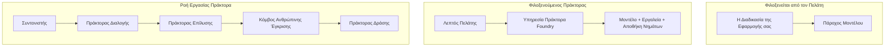
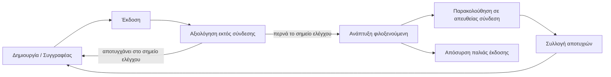
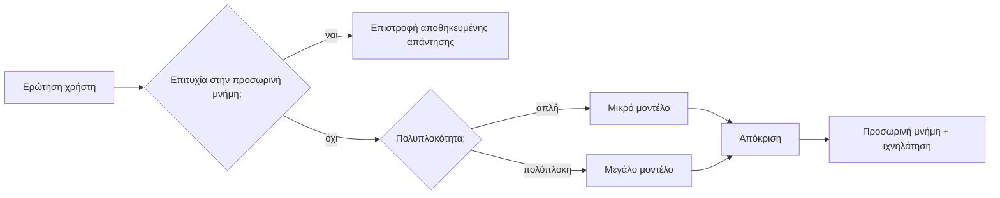
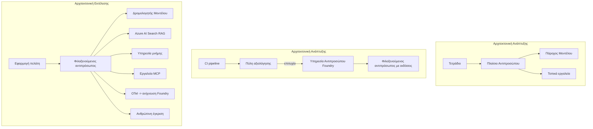

# Ανάπτυξη Κλιμακούμενων Πρακτόρων με το Microsoft Foundry


Μέχρι αυτό το σημείο στο μάθημα έχετε κατασκευάσει πράκτορες που τρέχουν στον φορητό υπολογιστή σας, μέσα σε ένα σημειωματάριο, με οδηγό το `az login` και μερικές μεταβλητές περιβάλλοντος. Αυτή είναι ακριβώς η σωστή προσέγγιση για να μάθετε. Δεν είναι όμως ο σωστός τρόπος για να τρέξετε έναν πράκτορα από τον οποίο εξαρτώνται χιλιάδες πελάτες στις 3 το πρωί.

Αυτό το μάθημα αφορά το χάσμα μεταξύ του "δουλεύει στη μηχανή μου" και του "δουλεύει αξιόπιστα και οικονομικά στην παραγωγή". Κλείνουμε αυτό το χάσμα χρησιμοποιώντας το **Microsoft Foundry** και την **Υπηρεσία Πρακτόρων Microsoft Foundry**, και το κάνουμε κατασκευάζοντας έναν πραγματικό πράκτορα υποστήριξης πελατών που έχει εργαλεία, ανάκτηση, μνήμη, αξιολόγηση και παρακολούθηση.

## Εισαγωγή

Αυτό το μάθημα θα καλύψει:

- Τη διαφορά μεταξύ ενός **πρωτοτύπου πράκτορα** και ενός **αναπτυγμένου πράκτορα**, και γιατί η μετάβαση αφορά κυρίως τα πάντα *γύρω* από το μοντέλο.
- Τα **μοτίβα ανάπτυξης** για πράκτορες: φιλοξενούμενοι από πελάτη, φιλοξενούμενοι ως υπηρεσία (Hosted Agents), και ορχηστρωμένοι ροές εργασίας.
- Τον **κύκλο ζωής πράκτορα** στο Microsoft Foundry — δημιουργία, έκδοση, ανάπτυξη, αξιολόγηση, παρατήρηση, απόσυρση.
- **Στρατηγικές κλιμάκωσης**: δρομολόγηση μοντέλου, αποθήκευση στην cache, ταυτόχρονη εκτέλεση, και σχεδιασμός χωρίς κατάσταση.
- **Παρατηρησιμότητα** με OpenTelemetry και ιχνηλάτηση Foundry.
- **Βελτιστοποίηση κόστους** μέσω επιλογής μοντέλου, δρομολόγησης, και πύλες αξιολόγησης.
- **Εταιρικές παράμετροι**: διακυβέρνηση, ανθρώπινη έγκριση, και ασφαλής λειτουργία των MCP servers σε παραγωγή.

## Στόχοι Μάθησης

Μετά την ολοκλήρωση αυτού του μαθήματος, θα γνωρίζετε πως να:

- Επιλέγετε το σωστό μοτίβο ανάπτυξης για έναν δοσμένο φόρτο εργασίας πράκτορα.
- Αναπτύσσετε έναν πράκτορα στην Υπηρεσία Πρακτόρων Microsoft Foundry ώστε να είναι εκδομένος, διαχειριζόμενος, και παρατηρήσιμος.
- Εξοπλίζετε έναν πράκτορα για ιχνηλάτηση και συνδέετε μία γραμμή αξιολόγησης που εκτελείται πριν από κάθε έκδοση.
- Εφαρμόζετε δρομολόγηση μοντέλου και αποθήκευση στην cache ώστε να διατηρείτε το λανθάνοντα χρόνο και το κόστος υπό έλεγχο σε κλίμακα.
- Προσθέτετε πύλη ανθρώπινης έγκρισης για ενέργειες υψηλού κινδύνου και ενσωματώνετε έναν MCP server με ασφάλεια παραγωγής.

## Προαπαιτούμενα

Αυτό το μάθημα υποθέτει ότι έχετε ολοκληρώσει τα προηγούμενα μαθήματα και αισθάνεστε άνετα με:

- Την κατασκευή πρακτόρων με το [Microsoft Agent Framework](../14-microsoft-agent-framework/README.md) (Μάθημα 14).
- [Χρήση Εργαλείων](../04-tool-use/README.md) (Μάθημα 4) και [Agentic RAG](../05-agentic-rag/README.md) (Μάθημα 5).
- [Μνήμη Πράκτορα](../13-agent-memory/README.md) (Μάθημα 13) και [Agentic Protocols / MCP](../11-agentic-protocols/README.md) (Μάθημα 11).
- [Παρατηρησιμότητα και Αξιολόγηση](../10-ai-agents-production/README.md) (Μάθημα 10) — αυτό το μάθημα χτίζει απευθείας επάνω σε αυτό.

Θα χρειαστείτε επίσης:

- Συνδρομή **Azure** και ένα **έργο Microsoft Foundry** με τουλάχιστον ένα αναπτυγμένο μοντέλο συζήτησης.
- Το **Azure CLI** αυθεντικοποιημένο (`az login`).
- Python 3.12+ και τα πακέτα στο αποθετήριο [`requirements.txt`](../../../requirements.txt).

## Από το Πρωτότυπο στην Παραγωγή: Τι Αλλάζει Πραγματικά

Ένας πράκτορας πρωτοτύπου και ένας παραγωγής μοιράζονται τον ίδιο βασικό βρόχο — συλλογισμός, κλήση εργαλείων, απάντηση. Αυτό που αλλάζει είναι τα πάντα που περιβάλλουν αυτόν τον βρόχο. Το μοντέλο είναι ίσως το 20% ενός παραγωγικού πράκτορα· το υπόλοιπο 80% είναι το λειτουργικό σκελετό.

| Περίπτωση | Πρωτότυπο | Παραγωγή |
| --- | --- | --- |
| **Φιλοξενία** | Τρέχει στο σημειωμάριό σας | Τρέχει ως φιλοξενούμενη υπηρεσία, εκδομένη και αναπτυγμένη |
| **Ταυτότητα** | Το διακριτικό `az login` σας | Διαχειριζόμενη ταυτότητα με συγκεκριμένα δικαιώματα RBAC |
| **Κατάσταση** | Στη μνήμη, χάνεται στην επανεκκίνηση | Εξωτερικοποιημένη (αποθήκη thread, υπηρεσία μνήμης) |
| **Αποτυχία** | Βλέπετε την ανίχνευση σφαλμάτων | Επαναλήψεις, επιστροφές, dead-letter, ειδοποιήσεις |
| **Κόστος** | «Είναι μερικά σεντς» | Παρακολουθείται ανά αίτημα, δρομολογείται, αποθηκεύεται στην cache, προϋπολογίζεται |
| **Ποιότητα** | Κοιτάτε οπτικά την έξοδο | Αξιολογείται αυτόματα πριν από κάθε έκδοση |
| **Εμπιστοσύνη** | Εγκρίνετε κάθε ενέργεια | Πολιτική + ανθρώπινη παρέμβαση για επικίνδυνες ενέργειες |

Κρατήστε αυτόν τον πίνακα στο μυαλό. Κάθε ενότητα παρακάτω αντιστοιχεί σε μια από αυτές τις γραμμές.

## Μοτίβα Ανάπτυξης Πρακτόρων

Υπάρχουν τρία μοτίβα που θα χρησιμοποιήσετε, συχνά σε συνδυασμό.

### 1. Πράκτορες Φιλοξενούμενοι από Πελάτη

Το αντικείμενο πράκτορα ζει μέσα στη *δική* σας διαδικασία εφαρμογής. Ο κώδικάς σας καλεί απευθείας τον πάροχο μοντέλου· ο βρόχος συλλογισμού τρέχει στην υπηρεσία σας. Αυτό είναι που έκανε κάθε προηγούμενο μάθημα.

- **Χρησιμοποιήστε το όταν** χρειάζεστε πλήρη έλεγχο του βρόχου, προσαρμοσμένο ενδιάμεσο λογισμικό, ή ενσωματώνετε τον πράκτορα μέσα σε υπάρχον backend.
- **Ανταλλαγή**: εσείς χειρίζεστε κλιμάκωση, κατάσταση, και ανθεκτικότητα μόνοι σας.

### 2. Φιλοξενούμενοι Πράκτορες (Foundry Agent Service)

Ο πράκτορας είναι *καταχωρημένος ως πόρος* στο Microsoft Foundry. Το Foundry φιλοξενεί τον βρόχο συλλογισμού, αποθηκεύει νήματα, εφαρμόζει ασφάλεια περιεχομένου και RBAC, και κάνει τον πράκτορα ορατό στο portal Foundry. Η εφαρμογή σας γίνεται ένας ελαφρύς πελάτης που δημιουργεί νήματα και διαβάζει απαντήσεις.

- **Χρησιμοποιήστε το όταν** θέλετε ανθεκτικότητα, ενσωματωμένη παρατηρησιμότητα, διακυβέρνηση, και μικρότερη λειτουργική επιφάνεια.
- **Ανταλλαγή**: λιγότερος χαμηλού επιπέδου έλεγχος σε αντάλλαγμα για μια διαχειριζόμενη εκτέλεση.

### 3. Ροές Εργασίας Πρακτόρων

Πολλαπλοί πράκτορες (και εργαλεία) συντίθενται σε γράφο με ρητή ροή ελέγχου — διαδοχικά βήματα, διακλαδώσεις, κόμβοι ανθρώπινης έγκρισης και ανθεκτικά σημεία ελέγχου που μπορούν να σταματήσουν και να συνεχίσουν. Αυτή είναι η δυνατότητα **Workflows** του Microsoft Agent Framework που εφαρμόζεται σε κλίμακα ανάπτυξης.

- **Χρησιμοποιήστε το όταν** μια μοναδική εργασία εκτείνεται σε πολλούς ειδικούς πράκτορες ή απαιτεί βήμα έγκρισης στη μέση.
- **Ανταλλαγή**: περισσότερα κινούμενα μέρη· χρειάζεται παρατηρησιμότητα σε επίπεδο ορχήστρωσης.



## Ο Κύκλος Ζωής του Πράκτορα στο Microsoft Foundry

Η ανάπτυξη ενός πράκτορα δεν είναι μια μοναδική `push` ενέργεια. Είναι ένας βρόχος, και μοιάζει πολύ με έναν κύκλο έκδοσης λογισμικού γιατί αυτό ακριβώς είναι.



Η βασική ιδέα, που προέρχεται από το [Μάθημα 10](../10-ai-agents-production/README.md): **η εκτός σύνδεσης αξιολόγηση είναι πύλη, όχι δεύτερη σκέψη.** Μια νέα έκδοση πράκτορα δεν κυκλοφορεί αν δεν περάσει τα όρια αξιολόγησής σας. Η διαδικτυακή παρατηρησιμότητα τροφοδοτεί στη συνέχεια τις αποτυχίες του πραγματικού κόσμου πίσω στο σύνολο δοκιμών εκτός σύνδεσης. Αυτός είναι όλος ο βρόχος.

## Στρατηγικές Κλιμάκωσης

Η κλιμάκωση ενός πράκτορα διαφέρει από την κλιμάκωση ενός stateless web API, επειδή κάθε αίτημα μπορεί να πυροδοτήσει πολλαπλές δαπανηρές κλήσεις μοντέλου και εργαλείων. Τέσσερις τεχνικές αντέχουν το μεγαλύτερο φορτίο.

**Χειρισμός αιτημάτων χωρίς κατάσταση.** Μην κρατάτε κατάσταση ανά χρήστη στη μνήμη της διαδικασίας σας. Αποθηκεύστε τα νήματα συνομιλίας στο Foundry thread store ή σε μια υπηρεσία μνήμης ώστε οποιαδήποτε παρουσία να μπορεί να χειριστεί οποιοδήποτε αίτημα. Αυτό επιτρέπει την οριζόντια κλιμάκωση — προσθέστε παρουσίες, χωρίς κολλημένες συνεδρίες.

**Δρομολόγηση μοντέλου.** Δεν χρειάζεται κάθε αίτημα να χρησιμοποιεί το πιο ικανό (και πιο ακριβό) μοντέλο. Δρομολογήστε απλά αιτήματα — ταξινόμηση προθέσεων, σύντομες πραγματολογικές απαντήσεις — σε ένα μικρό, γρήγορο μοντέλο, και κρατήστε το μεγάλο μοντέλο για πραγματικό συλλογισμό. Ο **Model Router** του Foundry μπορεί να το κάνει για εσάς, ή μπορείτε να υλοποιήσετε εσείς έναν ελαφρύ ταξινομητή. Θα κατασκευάσετε την έκδοση DIY στο εργαστήριο.

**Αποθήκευση απάντησης στην cache.** Πολλές ερωτήσεις υποστήριξης είναι σχεδόν διπλότυπες ("Πώς επαναφέρω τον κωδικό μου;"). Αποθηκεύστε απαντήσεις στις κοινές ερωτήσεις και σερβίρετέ τες χωρίς να φτάσετε καν το μοντέλο. Ακόμα και ένα μετριοπαθές ποσοστό χτύπημα cache κόβει σημαντικά το κόστος και την καθυστέρηση.

**Ταυτόχρονη εκτέλεση και πίεση αντίδρασης.** Οι πάροχοι μοντέλων έχουν όρια ρυθμού. Περιορίστε την ταυτόχρονη εκτέλεση, χρησιμοποιήστε επαναλήψεις με εκθετική απόσβεση, και αποτυγχάνετε με χάρη (μια απάντηση "το επεξεργαζόμαστε" στην ουρά νικά ένα σφάλμα 500).



## Παρατηρησιμότητα στην Παραγωγή

Δεν μπορείτε να λειτουργήσετε αυτό που δεν μπορείτε να δείτε. Όπως καλύφθηκε στο Μάθημα 10, το Microsoft Agent Framework εκπέμπει εγγενώς **OpenTelemetry** ίχνη — κάθε κλήση μοντέλου, επικλήσεις εργαλείων, και βήμα ορχήστρωσης γίνεται span. Στην παραγωγή εξάγετε αυτά τα spans στο Microsoft Foundry (ή σε οποιοδήποτε backend συμβατό με OTel) ώστε να μπορείτε:

- Να ιχνηλατήσετε μια και μόνο καταγγελία πελάτη από άκρο σε άκρο μέσα από κάθε κλήση μοντέλου και εργαλείου.
- Να παρακολουθείτε την καθυστέρηση p50/p95 και το κόστος ανά αίτημα με την πάροδο του χρόνου.
- Να ειδοποιείστε για εκρήξεις σφαλμάτων και ανωμαλίες κόστους πριν το αντιληφθούν οι χρήστες (ή η οικονομική ομάδα σας).

```python
from agent_framework.observability import get_tracer

tracer = get_tracer()

with tracer.start_as_current_span("support_request") as span:
    span.set_attribute("customer.tier", "enterprise")
    span.set_attribute("routed.model", "gpt-4.1-mini")
    # η εκτέλεση του πράκτορα εντοπίζεται αυτόματα μέσα σε αυτή την περίοδο
```

Χαρακτηριστικά όπως `customer.tier` και `routed.model` είναι αυτά που μετατρέπουν έναν τοίχο από ίχνη σε απαντήσιμες ερωτήσεις ("οι επιχειρησιακοί πελάτες δρομολογούνται πάρα πολύ συχνά στο μικρό μοντέλο;").

## Βελτιστοποίηση Κόστους

Το κόστος σε παραγωγικούς πράκτορες κυριαρχείται από token. Τρία μοχλοί, κατά σειρά επίδρασης:

1. **Επιλογή του κατάλληλου μεγέθους μοντέλου.** Ένα μικρό μοντέλο που περνάει την πύλη αξιολόγησής σας είναι σχεδόν πάντα πιο φθηνό από ένα μεγάλο που επίσης περνάει. Χρησιμοποιήστε την αξιολόγηση για να *αποδείξετε* ότι το μικρό μοντέλο είναι αρκετά καλό αντί να επιλέγετε το μεγαλύτερο προληπτικά.
2. **Δρομολόγηση ανάλογα με την πολυπλοκότητα.** Όπως παραπάνω — πληρώνετε τιμές μεγάλου μοντέλου μόνο για αιτήματα που χρειάζονται συλλογισμό μεγάλου μοντέλου.
3. **Αποθήκευση cache σε επιθετικό βαθμό.** Η φθηνότερη κλήση μοντέλου είναι αυτή που δεν κάνετε ποτέ.

Οι πύλες αξιολόγησης και ο έλεγχος κόστους είναι η ίδια πρακτική που βλέπεται από δύο οπτικές: η αξιολόγηση σας λέει το *κατώτατο όριο ποιότητας*, η δρομολόγηση και η cache κρατούν το κόστος σας κοντά σε αυτό το όριο.

## Εταιρικές Παράμετροι Ανάπτυξης

**Διακυβέρνηση.** Οι Φιλοξενούμενοι Πράκτορες κληρονομούν το RBAC του Foundry, την ασφάλεια περιεχομένου και το audit logging. Δώστε σε κάθε πράκτορα μια διαχειριζόμενη ταυτότητα με τα ελάχιστα δικαιώματα που χρειάζεται — μόνο ανάγνωση στη βάση γνώσης, συγκεκριμένη πρόσβαση στο API έκδοσης εισιτηρίων, τίποτα παραπάνω.

**Ανθρώπινη παρέμβαση.** Κάποιες ενέργειες είναι πολύ κρίσιμες για να αυτοματοποιηθούν απόλυτα — έκδοση επιστροφής χρημάτων, διαγραφή λογαριασμού, κλιμάκωση σε νομική ομάδα. Το Microsoft Agent Framework υποστηρίζει εργαλεία που απαιτούν **έγκριση**: ο πράκτορας προτείνει την ενέργεια, η εκτέλεση παγώνει, ένας άνθρωπος εγκρίνει ή απορρίπτει, και η ροή εργασίας συνεχίζει. Το πρωτόγονο είδατε στο [Μάθημα 6](../06-building-trustworthy-agents/README.md)· εδώ το αναπτύσσετε.

**MCP στην παραγωγή.** Το [MCP](../11-agentic-protocols/README.md) επιτρέπει στον πράκτορά σας να χρησιμοποιεί εξωτερικά εργαλεία μέσω ενός τυποποιημένου interface. Στην παραγωγή, αντιμετωπίζετε κάθε MCP server ως αναξιόπιστο όριο: καρφιτσώστε την έκδοση του server, τρέξτε το με διαχειριζόμενη ταυτότητα, επαληθεύστε τις εξόδους του, και μην αποκαλύπτετε ποτέ μυστικά σε αυτόν. Ένας MCP server είναι μια εξάρτηση, και οι εξαρτήσεις επιδιορθώνονται, ελέγχονται και έχουν περιορισμούς ρυθμού.



Αυτά τα τρία διαγράμματα — ανάπτυξης, ανάπτυξης, χρόνου εκτέλεσης — είναι ο ίδιος πράκτορας σε τρία στάδια ζωής. Το εργαστήριο που ακολουθεί σας καθοδηγεί να το κατασκευάσετε.

## Εργαστήριο: Πράκτορας Υποστήριξης Πελατών Έτοιμος για Παραγωγή

Ανοίξτε το [`code_samples/16-python-agent-framework.ipynb`](./code_samples/16-python-agent-framework.ipynb) και εργαστείτε σε αυτό από την αρχή ως το τέλος. Θα συναρμολογήσετε έναν **πράκτορα υποστήριξης πελατών Contoso** με κάθε ζήτημα παραγωγής ενσωματωμένο:

1. **Κλήση εργαλείων** — έλεγχος κατάστασης παραγγελίας και άνοιγμα εισιτηρίων υποστήριξης.
2. **RAG** — απάντηση σε ερωτήσεις πολιτικής από βάση γνώσης (Azure AI Search, με fallback στη μνήμη ώστε το σημειωματάριο να τρέχει χωρίς πόρο Search).
3. **Μνήμη** — θυμάται τον πελάτη μέσα από γύρους της συνομιλίας.
4. **Δρομολόγηση μοντέλου** — ένας ταξινομητής πολυπλοκότητας δρομολογεί κάθε αίτημα σε μικρό ή μεγάλο μοντέλο.
5. **Αποθήκευση απάντησης στην cache** — επαναλαμβανόμενες ερωτήσεις εξυπηρετούνται από cache.
6. **Ανθρώπινη έγκριση** — επιστροφές χρημάτων πάνω από ένα όριο παγώνουν για ανθρώπινη έγκριση.
7. **Γραμμή αξιολόγησης** — ένα μικρό σύνολο offline δοκιμών βαθμολογεί τον πράκτορα και λειτουργεί ως πύλη έκδοσης.
8. **Παρατηρησιμότητα** — ιχνηλάτηση OpenTelemetry γύρω από κάθε αίτημα.

### Οδηγός

Το σημειωματάριο είναι οργανωμένο ώστε κάθε ζήτημα παραγωγής να είναι μια αυτοτελής, εκτελέσιμη ενότητα. Η καρδιά του είναι ο χειριστής αιτημάτων δρομολόγησης-συνέλιξης:

```python
async def handle_support_request(query: str, customer_id: str) -> str:
    # 1. Εξυπηρέτηση από την προσωρινή μνήμη όταν είναι δυνατόν.
    cached = response_cache.get(normalize(query))
    if cached:
        return cached

    # 2. Δρομολόγηση ανάλογα με την πολυπλοκότητα για τον έλεγχο κόστους.
    model = "gpt-4.1-mini" if is_simple(query) else "gpt-4.1"

    # 3. Εκτέλεση του πράκτορα μέσα σε μια περίοδο ιχνών για παρατηρησιμότητα.
    with tracer.start_as_current_span("support_request") as span:
        span.set_attribute("routed.model", model)
        span.set_attribute("customer.id", customer_id)
        response = await support_agent.run(query, model=model)

    # 4. Αποθήκευση στην προσωρινή μνήμη και επιστροφή.
    response_cache.set(normalize(query), response.text)
    return response.text
```

Η πύλη αξιολόγησης που προστατεύει μια έκδοση μοιάζει έτσι:

```python
async def evaluation_gate(agent, test_cases, threshold: float = 0.8) -> bool:
    passed = 0
    for case in test_cases:
        result = await agent.run(case["input"])
        if score_response(result.text, case["expected"]) >= 0.8:
            passed += 1
    pass_rate = passed / len(test_cases)
    print(f"Evaluation pass rate: {pass_rate:.0%} (gate: {threshold:.0%})")
    return pass_rate >= threshold  # αναπτύξτε μόνο αν η πύλη περάσει
```

Διαβάστε κάθε γραμμή — το σημειωματάριο κρατά τις πρωτόγονες δομές εσκεμμένα μικρές ώστε να μην κρύβεται τίποτα πίσω από μια κλήση framework.

## Επικύρωση ενός Αναπτυγμένου Πράκτορα με Smoke Tests

Η πύλη αξιολόγησης παραπάνω τρέχει *εκτός σύνδεσης* σε σχέση με το αντικείμενο του πράκτορα σας. Μόλις ο πράκτορας αναπτυχθεί ως Hosted Agent, χρειάζεστε έναν ακόμα, ακόμη φθηνότερο έλεγχο: **απαντάει πραγματικά το αναπτυγμένο endpoint;**

Η "επιτυχημένη" ανάπτυξη αποδεικνύει μόνο ότι το επίπεδο ελέγχου αποδέχτηκε τον ορισμό — δεν αποδεικνύει ότι ο πράκτορας ανταποκρίνεται. Μια ελλιπής εξάρτηση, λανθασμένη δρομολόγηση μοντέλου, ή ληγμένη σύνδεση μπορεί να αφήσει μια πράσινη ανάπτυξη που δεν επιστρέφει τίποτα. Ένα **smoke test** το συλλαμβάνει αυτό σε δευτερόλεπτα, σε κάθε ανάπτυξη, χωρίς το κόστος πλήρους αξιολόγησης.

Αυτό το αποθετήριο παρέχει μια έτοιμη προς χρήση γραμμή δοκιμών smoke built με το [AI Smoke Test](https://github.com/marketplace/actions/ai-smoke-test) GitHub Action:

- **Κατάλογος** — Το [`tests/lesson-16-smoke-tests.json`](../../../tests/lesson-16-smoke-tests.json) περιέχει προτροπές και δηλώσεις για τον πράκτορα υποστήριξης της Contoso (απαντήσεις πολιτικής βάσει δεδομένων, έλεγχος παραγγελίας, διατήρηση θέματος, και συνέπεια νήματος πολλών γύρων). Κατάλογοι για άλλους πράκτορες μαθημάτων υπάρχουν παράλληλα — δείτε το [`tests/README.md`](../tests/README.md).
- **Ροή εργασίας** — Το [`.github/workflows/smoke-test.yml`](../../../.github/workflows/smoke-test.yml) κάνει login με Azure OIDC και κάνει POST κάθε προτροπής στο endpoint Απαντήσεων του πράκτορα, αποτυγχάνοντας το έργο αν λείπει κάποια δήλωση.

```yaml
- name: Smoke-test hosted agent
  uses: JFolberth/ai-smoketest@v1
  with:
    project_endpoint: ${{ inputs.project_endpoint }}
    agent_name: ContosoSupportAgent
    tests_file: tests/lesson-16-smoke-tests.json
```


Εκτελέστε το από την καρτέλα **Actions** μόλις αναπτυχθεί ο agent σας, παρέχοντας το endpoint του έργου Foundry και το όνομα του agent. Η ομοσπονδιακή ταυτότητα χρειάζεται τον ρόλο **Azure AI User** στο πεδίο του έργου Foundry. Σκεφτείτε τα επίπεδα σαν μια πυραμίδα: τα smoke tests (πρόσβαση και απόκριση;) εκτελούνται σε κάθε ανάπτυξη, η offline αξιολόγηση (αρκετά καλή για αποστολή;) εκτελείται πριν την προαγωγή, και η online αξιολόγηση (πώς τα πάει στο πεδίο;) εκτελείται συνεχώς.

## Έλεγχος Γνώσεων

Δοκιμάστε την κατανόησή σας πριν προχωρήσετε στην εργασία.

**1. Περίπου πόσο από ένα παραγωγικό agent είναι "το μοντέλο" και τι είναι το υπόλοιπο;**

<details>
<summary>Απάντηση</summary>

Το μοντέλο είναι μειονότητα του συστήματος — συχνά αναφέρεται περίπου στο 20%. Το υπόλοιπο είναι το λειτουργικό σκελετό: φιλοξενία και διαχείριση εκδόσεων, ταυτότητα και RBAC, εξωτερική κατάσταση, διαχείριση αποτυχιών, παρακολούθηση κόστους, αξιολόγηση και έλεγχοι με ανθρώπινη παρέμβαση. Η μετάβαση σε παραγωγή αφορά κυρίως την κατασκευή όλου του περιβάλλοντος *γύρω* από τον βρόχο συλλογισμού.
</details>

**2. Πότε θα επιλέγατε έναν Hosted Agent αντί για έναν agent που φιλοξενείται από τον πελάτη;**

<details>
<summary>Απάντηση</summary>

Όταν θέλετε ένα διαχειριζόμενο runtime με ενσωματωμένη ανθεκτικότητα (νήματα που διαρκούν και μπορούν να συνεχίσουν), παρατηρησιμότητα, ασφάλεια περιεχομένου και RBAC, και είστε διατεθειμένοι να ανταλλάξετε κάποιο χαμηλού επιπέδου έλεγχο του βρόχου συλλογισμού για λιγότερο λειτουργικό πεδίο. Ο agent που φιλοξενείται από πελάτη προτιμάται όταν χρειάζεστε πλήρη έλεγχο πάνω στον βρόχο ή ενσωματώνετε τον agent σε υπάρχον backend.
</details>

**3. Γιατί ένας κλιμακούμενος agent πρέπει να είναι χωρίς κατάσταση στη μνήμη της ίδιας της διεργασίας του;**

<details>
<summary>Απάντηση</summary>

Έτσι, κάθε παρουσία μπορεί να χειριστεί οποιοδήποτε αίτημα, κάτι που επιτρέπει οριζόντια κλιμάκωση χωρίς συνεδρίες προσκόλλησης. Η κατάσταση της συνομιλίας ανά χρήστη εξωτερικεύεται σε αποθήκη νημάτων ή υπηρεσία μνήμης. Αν η κατάσταση ζούσε στη μνήμη της διεργασίας, θα την έχανες με την επανεκκίνηση και δεν θα μπορούσες να διανείμεις το φορτίο ελεύθερα.
</details>

**4. Ποιο πρόβλημα λύνει η δρομολόγηση μοντέλου και πώς σχετίζεται με την αξιολόγηση;**

<details>
<summary>Απάντηση</summary>

Η δρομολόγηση στέλνει απλά αιτήματα σε ένα μικρό, φτηνό και γρήγορο μοντέλο και κρατά το μεγάλο μοντέλο για γνήσιο συλλογισμό, ελέγχοντας τόσο την καθυστέρηση όσο και το κόστος. Σχετίζεται με την αξιολόγηση επειδή η αξιολόγηση είναι αυτή που *αποδεικνύει* ότι το μικρό μοντέλο είναι αρκετά καλό για μια κατηγορία αιτημάτων — η δρομολόγηση χωρίς αξιολόγηση είναι εικασία.
</details>

**5. Τι είναι μια "πύλη αξιολόγησης" και πού βρίσκεται στον κύκλο ζωής;**

<details>
<summary>Απάντηση</summary>

Μια πύλη αξιολόγησης εκτελεί ένα offline σετ δοκιμών σε μια νέα έκδοση agent και μπλοκάρει την ανάπτυξη εκτός εάν το ποσοστό επιτυχίας ξεπερνά ένα όριο. Βρίσκεται μεταξύ "έκδοσης" και "ανάπτυξης" στον κύκλο ζωής, καθιστώντας την ποιότητα προϋπόθεση για την κυκλοφορία αντί για κάτι που ελέγχετε μετά την αποστολή.
</details>

**6. Γιατί ένας MCP server πρέπει να θεωρείται ως μη αξιόπιστο όριο στην παραγωγή;**

<details>
<summary>Απάντηση</summary>

Επειδή είναι εξωτερική εξάρτηση στην οποία καλεί ο agent σας. Πρέπει να κλειδώσετε την έκδοσή του, να το εκτελείτε με ταυτοποίηση με περιορισμένο εύρος, να επικυρώνετε τις εξόδους του, να περιορίζετε το ρυθμό και να μην εκθέτετε ποτέ μυστικά σε αυτό — την ίδια πειθαρχία που εφαρμόζετε σε οποιαδήποτε εξωτερική εξάρτηση. Οι έξοδοι ρέουν στον συλλογισμό του agent σας, οπότε η μη επικυρωμένη εμπιστοσύνη είναι κίνδυνος ασφάλειας.
</details>

**7. Ποια μεμονωμένη αλλαγή έχει συνήθως τη μεγαλύτερη επίδραση στο κόστος του παραγωγικού agent και γιατί;**

<details>
<summary>Απάντηση</summary>

Η σωστή επιλογή μεγέθους του μοντέλου — η χρήση του μικρότερου μοντέλου που εξακολουθεί να περνάει την πύλη αξιολόγησής σας. Το κόστος κυριαρχείται από τα tokens, και ένα μικρότερο μοντέλο που ικανοποιεί το όριο ποιότητας είναι σχεδόν πάντα πιο φθηνό από ένα μεγαλύτερο. Η προσωρινή αποθήκευση και η δρομολόγηση μειώνουν ακόμη περισσότερο το κόστος, αλλά η επιλογή του σωστού βασικού μοντέλου έχει το μεγαλύτερο άμεσο αποτέλεσμα.
</details>

**8. Τι ρόλο παίζουν οι ιδιότητες span όπως `customer.tier` και `routed.model` στην παρατηρησιμότητα;**

<details>
<summary>Απάντηση</summary>

Μετατρέπουν τα ακατέργαστα ίχνη σε απαντήσιμες επιχειρηματικές ερωτήσεις. Χωρίς ιδιότητες έχετε ένα τείχος από spans· με αυτές μπορείτε να ρωτάτε "κατευθύνονται πολύ συχνά οι πελάτες επιχειρήσεων στο μικρό μοντέλο;" ή "ποιο μοντέλο χειρίζεται τα πιο αργά αιτήματά μας;" Οι ιδιότητες είναι ο τρόπος που χωρίζετε την τηλεμετρία κατά τις διαστάσεις που έχουν σημασία για τη λειτουργία σας.
</details>

## Εργασία

Πάρτε τον agent υποστήριξης πελατών από το εργαστήριο και ενισχύστε τον για ένα συγκεκριμένο σενάριο: **agent υποστήριξης για χρέωση συνδρομής σε εταιρεία SaaS.**

Η υποβολή σας θα πρέπει να:

1. **Αντικαταστήστε τα εργαλεία** με εκείνα που σχετίζονται με χρέωση: `get_subscription_status`, `get_invoice`, και `issue_credit` (πιστώσεις άνω των $50 απαιτούν ανθρώπινη έγκριση).
2. **Προσθέστε τρία RAG έγγραφα** που καλύπτουν την πολιτική επιστροφής, τον κύκλο χρέωσης, και την πολιτική ακύρωσης της εταιρείας.
3. **Επεκτείνετε το σετ αξιολόγησης** σε τουλάχιστον οκτώ περιπτώσεις, συμπεριλαμβανομένων τουλάχιστον δύο που *πρέπει* να ενεργοποιήσουν τον δρόμο ανθρώπινης έγκρισης, και επιβεβαιώστε ότι η πύλη αξιολόγησής σας περνά ή αποτυγχάνει σωστά.
4. **Προσθέστε μια αναφορά κόστους**: μετά από την εκτέλεση δέκα μικτών ερωτημάτων μέσω του agent, εκτυπώστε πόσα πήγαν στο μικρό μοντέλο, πόσα στο μεγάλο μοντέλο και πόσα εξυπηρετήθηκαν από την προσωρινή μνήμη.

Γράψτε μια σύντομη παράγραφο (σε κελί markdown) που να εξηγεί ποιον κανόνα δρομολόγησης μοντέλου επιλέξατε και πώς θα τον επικυρώνατε με πραγματική κίνηση. Δεν υπάρχει μία σωστή απάντηση — αξιολογείστε κατά πόσο οι ανησυχίες της παραγωγής συνδέονται συνεκτικά.

## Περίληψη

Σε αυτό το μάθημα μεταφέρατε έναν agent από πρωτότυπο σε παραγωγή με το Microsoft Foundry:

- Η μετάβαση σε παραγωγή αφορά κυρίως τον **λειτουργικό σκελετό** γύρω από το μοντέλο — φιλοξενία, ταυτότητα, κατάσταση, διαχείριση αποτυχίας, κόστος, ποιότητα και εμπιστοσύνη.
- Μάθατε τα τρία **μοτίβα ανάπτυξης** — agent που φιλοξενείται από πελάτη, Hosted Agents, και Agent Workflows — και πότε ταιριάζει το καθένα.
- Περάσατε τον **κύκλο ζωής του agent**, όπου η offline **αξιολόγηση λειτουργεί ως πύλη κυκλοφορίας** και η online παρατηρησιμότητα τροφοδοτεί τις αποτυχίες πίσω στο σετ δοκιμών.
- Εφαρμόσατε **στρατηγικές κλιμάκωσης** — σχεδίαση χωρίς κατάσταση, δρομολόγηση μοντέλου, προσωρινή αποθήκευση και οριοθετημένη ταυτόχρονη εκτέλεση — και τις συνδέσατε με **βελτιστοποίηση κόστους**.
- Συνδέσατε **επιχειρηματικούς ελέγχους**: RBAC, ανθρώπινη έγκριση στο βρόχο, και ασφαλή ενσωμάτωση MCP στην παραγωγή.
- Δημιουργήσατε έναν **agent υποστήριξης πελατών έτοιμο για παραγωγή** που συνδέει όλες αυτές τις ανησυχίες σε εκτελέσιμο κώδικα.

Το επόμενο μάθημα ακολουθεί την αντίστροφη πορεία: αντί να κλιμακώνετε agents στο cloud, θα τους κατεβάσετε *κάτω* σε έναν μόνο υπολογιστή προγραμματιστή και θα τους τρέξετε εντελώς τοπικά.

## Πρόσθετοι Πόροι

- <a href="https://learn.microsoft.com/azure/ai-foundry/what-is-azure-ai-foundry" target="_blank">Τεκμηρίωση Microsoft Foundry</a>
- <a href="https://learn.microsoft.com/azure/ai-foundry/agents/overview" target="_blank">Επισκόπηση Υπηρεσίας Agent Microsoft Foundry</a>
- <a href="https://aka.ms/ai-agents-beginners/agent-framework" target="_blank">Πλαίσιο Agent Microsoft</a>
- <a href="https://learn.microsoft.com/azure/ai-foundry/concepts/model-router" target="_blank">Δρομολογητής Μοντέλου σε Microsoft Foundry</a>
- <a href="https://learn.microsoft.com/azure/search/search-what-is-azure-search" target="_blank">Azure AI Search</a>
- <a href="https://opentelemetry.io/" target="_blank">OpenTelemetry</a>
- <a href="https://github.com/marketplace/actions/ai-smoke-test" target="_blank">AI Smoke Test GitHub Action</a>
- <a href="https://modelcontextprotocol.io/" target="_blank">Πρωτόκολλο Πλαισίου Μοντέλου (MCP)</a>

## Προηγούμενο Μάθημα

[Κατασκευή Agents Χρήσης Υπολογιστή (CUA)](../15-browser-use/README.md)

## Επόμενο Μάθημα

[Δημιουργία Τοπικών Agent AI](../17-creating-local-ai-agents/README.md)

---

<!-- CO-OP TRANSLATOR DISCLAIMER START -->
**Αποποίηση ευθυνών**:
Αυτό το έγγραφο έχει μεταφραστεί χρησιμοποιώντας την υπηρεσία μετάφρασης με τεχνητή νοημοσύνη [Co-op Translator](https://github.com/Azure/co-op-translator). Ενώ επιδιώκουμε την ακρίβεια, παρακαλούμε να έχετε υπόψη ότι οι αυτοματοποιημένες μεταφράσεις ενδέχεται να περιέχουν λάθη ή ανακρίβειες. Το πρωτότυπο έγγραφο στη μητρική του γλώσσα πρέπει να θεωρείται η αυθεντική πηγή. Για κρίσιμες πληροφορίες, συνιστάται επαγγελματική ανθρώπινη μετάφραση. Δεν φέρουμε ευθύνη για τυχόν παρεξηγήσεις ή λανθασμένες ερμηνείες που προκύπτουν από τη χρήση αυτής της μετάφρασης.
<!-- CO-OP TRANSLATOR DISCLAIMER END -->