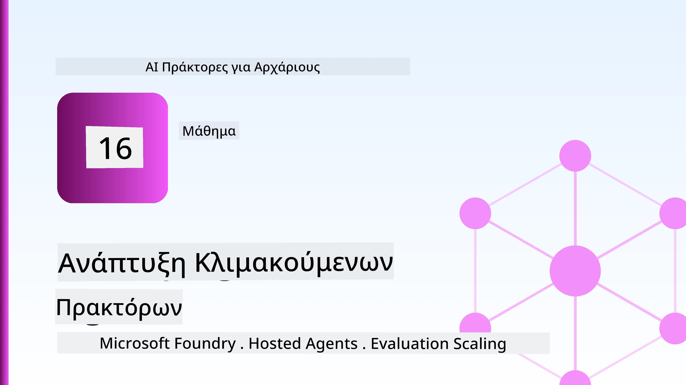
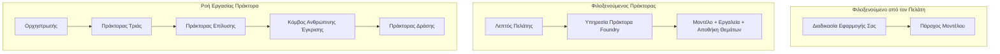
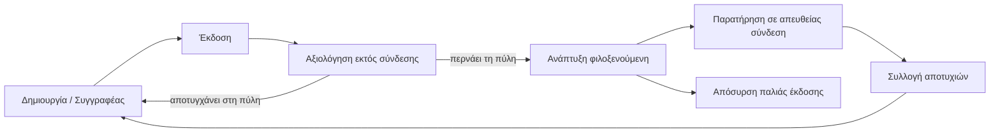
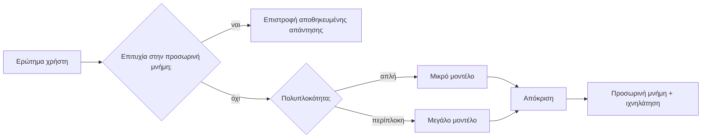
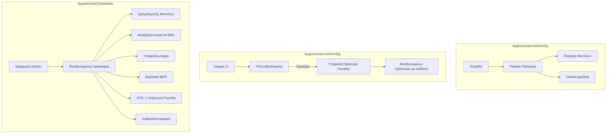

# Ανάπτυξη Κλιμακούμενων Πρακτόρων με το Microsoft Foundry



Μέχρι αυτό το σημείο στο μάθημα έχετε δημιουργήσει πράκτορες που τρέχουν στον φορητό υπολογιστή σας, μέσα σε ένα τετράδιο, τροφοδοτούμενοι από το `az login` και μερικές περιβαλλοντικές μεταβλητές. Αυτή είναι ακριβώς η σωστή προσέγγιση για μάθηση. Δεν είναι ο σωστός τρόπος για να τρέξετε έναν πράκτορα από τον οποίο εξαρτώνται χιλιάδες πελάτες στις 3 το πρωί.

Αυτό το μάθημα αφορά το χάσμα μεταξύ του "λειτουργεί στον υπολογιστή μου" και του "λειτουργεί αξιόπιστα και οικονομικά στην παραγωγή". Κλείνουμε αυτό το χάσμα χρησιμοποιώντας το **Microsoft Foundry** και την **Υπηρεσία Πρακτόρων του Microsoft Foundry**, και το κάνουμε δημιουργώντας έναν πραγματικό πελατειακό πράκτορα υποστήριξης που διαθέτει εργαλεία, ανάκτηση, μνήμη, αξιολόγηση και παρακολούθηση.

## Εισαγωγή

Αυτό το μάθημα θα καλύψει:

- Τη διαφορά μεταξύ ενός **πρωτοτύπου πράκτορα** και ενός **αναπτυγμένου πράκτορα**, και γιατί η μετάβαση αφορά κυρίως τα πάντα *γύρω* από το μοντέλο.
- **Πρότυπα ανάπτυξης** για πράκτορες: που φιλοξενούνται από τον πελάτη, που φιλοξενούνται ως υπηρεσία (Hosted Agents), και που ελέγχονται μέσω ροής εργασίας.
- Τον **κύκλο ζωής του πράκτορα** στο Microsoft Foundry — δημιουργία, έκδοση, ανάπτυξη, αξιολόγηση, παρακολούθηση, απόσυρση.
- **Στρατηγικές κλιμάκωσης**: δρομολόγηση μοντέλου, προσωρινή αποθήκευση, ταυτόχρονη εκτέλεση, και σχεδίαση χωρίς κατάσταση.
- **Παρατηρησιμότητα** με το OpenTelemetry και το Foundry tracing.
- **Βελτιστοποίηση κόστους** μέσω επιλογής μοντέλου, δρομολόγησης, και πυλών αξιολόγησης.
- **Επιχειρησιακές σκέψεις**: διακυβέρνηση, ανθρώπινη έγκριση, και ασφαλής λειτουργία διακομιστών MCP στην παραγωγή.

## Στόχοι Μάθησης

Μετά την ολοκλήρωση αυτού του μαθήματος, θα γνωρίζετε πώς να:

- Επιλέξετε το σωστό πρότυπο ανάπτυξης για ένα συγκεκριμένο φόρτο εργασίας πράκτορα.
- Αναπτύξετε έναν πράκτορα στην Υπηρεσία Πρακτόρων του Microsoft Foundry ώστε να έχει έκδοση, διακυβέρνηση και παρατηρησιμότητα.
- Εξοπλίσετε έναν πράκτορα για ανίχνευση και να συνδέσετε μια γραμμή αξιολόγησης που τρέχει πριν από κάθε έκδοση.
- Εφαρμόσετε δρομολόγηση μοντέλου και προσωρινή αποθήκευση για να διατηρήσετε το κόστος και την καθυστέρηση υπό έλεγχο σε μεγάλη κλίμακα.
- Προσθέσετε μία πύλη ανθρώπινης έγκρισης για ενέργειες υψηλού κινδύνου και να ενσωματώσετε έναν διακομιστή MCP με ασφαλή τρόπο στην παραγωγή.

## Προαπαιτούμενα

Αυτό το μάθημα υποθέτει ότι έχετε ολοκληρώσει τα προηγούμενα μαθήματα και είστε άνετοι με:

- Δημιουργία πρακτόρων με το [Microsoft Agent Framework](../14-microsoft-agent-framework/README.md) (Μάθημα 14).
- [Χρήση Εργαλείων](../04-tool-use/README.md) (Μάθημα 4) και [Agentic RAG](../05-agentic-rag/README.md) (Μάθημα 5).
- [Μνήμη Πράκτορα](../13-agent-memory/README.md) (Μάθημα 13) και [Agentic Protocols / MCP](../11-agentic-protocols/README.md) (Μάθημα 11).
- [Παρατηρησιμότητα και Αξιολόγηση](../10-ai-agents-production/README.md) (Μάθημα 10) — αυτό το μάθημα βασίζεται άμεσα σε αυτό.

Θα χρειαστείτε επίσης:

- Μια **εγγραφή Azure** και ένα **έργο Microsoft Foundry** με τουλάχιστον ένα αναπτυγμένο μοντέλο συνομιλίας.
- Την **Azure CLI** αυθεντικοποιημένη (`az login`).
- Python 3.12+ και τα πακέτα στο αποθετήριο [`requirements.txt`](../../../requirements.txt).

## Από το Πρωτότυπο στην Παραγωγή: Τι Αλλάζει Πραγματικά

Ένας πρωτότυπος πράκτορας και ένας παραγωγικός πράκτορας μοιράζονται τον ίδιο βασικό βρόχο — συλλογισμός, κλήση εργαλείων, απόκριση. Αυτό που αλλάζει είναι όλα όσα περιβάλλουν αυτόν τον βρόχο. Το μοντέλο ίσως αποτελεί το 20% ενός παραγωγικού πράκτορα· το υπόλοιπο 80% είναι ο λειτουργικός σκελετός.

| Θέμα | Πρωτότυπο | Παραγωγή |
| --- | --- | --- |
| **Φιλοξενία** | Τρέχει στο τετράδιό σας | Τρέχει ως φιλοξενούμενη υπηρεσία, με έκδοση και εισαγωγή |
| **Ταυτότητα** | Το διακριτικό `az login` σας | Διαχειριζόμενη ταυτότητα με RBAC περιορισμένη |
| **Κατάσταση** | Στη μνήμη, χάνεται σε επανεκκίνηση | Εξωτερικοποιημένη (κατάστημα threads, υπηρεσία μνήμης) |
| **Σφάλμα** | Βλέπετε το traceback | Επανεκκινήσεις, εναλλακτικές λύσεις, dead-letter, ειδοποιήσεις |
| **Κόστος** | "Είναι λίγα λεπτά" | Παρακολουθείται ανά αίτημα, δρομολογείται, προσωρινά αποθηκεύεται, προϋπολογίζεται |
| **Ποιότητα** | Κρίνετε οπτικά το αποτέλεσμα | Αξιολογείται αυτόματα πριν από κάθε έκδοση |
| **Εμπιστοσύνη** | Εγκρίνετε κάθε ενέργεια | Πολιτική + άνθρωπος στη ροή για επικίνδυνες ενέργειες |

Κρατήστε αυτό τον πίνακα στο μυαλό. Κάθε ενότητα παρακάτω αντιστοιχεί σε μία από αυτές τις γραμμές.

## Πρότυπα Ανάπτυξης Πρακτόρων

Υπάρχουν τρία πρότυπα που θα χρησιμοποιήσετε, συχνά σε συνδυασμό.

### 1. Πράκτορες που Φιλοξενούνται από τον Πελάτη

Το αντικείμενο πράκτορα ζει μέσα στη δική *σας* διεργασία εφαρμογής. Ο κώδικάς σας καλεί απευθείας τον πάροχο μοντέλου· ο βρόχος συλλογισμού τρέχει στην υπηρεσία σας. Αυτό έχει γίνει σε κάθε προηγούμενο μάθημα.

- **Χρησιμοποιήστε το όταν** χρειάζεστε πλήρη έλεγχο του βρόχου, προσαρμοσμένο middleware, ή ενσωματώνετε τον πράκτορα μέσα σε υπάρχον backend.
- **Συμβιβασμός**: εσείς αναλαμβάνετε το κλιμάκωμα, την κατάσταση και την ανθεκτικότητα.

### 2. Φιλοξενούμενοι Πράκτορες (Foundry Agent Service)

Ο πράκτορας *καταχωρείται ως πόρος* στο Microsoft Foundry. Το Foundry φιλοξενεί τον βρόχο συλλογισμού, αποθηκεύει threads, επιβάλλει ασφάλεια περιεχομένου και RBAC, και κάνει τον πράκτορα ορατό στην πύλη Foundry. Η εφαρμογή σας γίνεται ένας λεπτός πελάτης που δημιουργεί threads και διαβάζει απαντήσεις.

- **Χρησιμοποιήστε το όταν** θέλετε ανθεκτικότητα, ενσωματωμένη παρατηρησιμότητα, διακυβέρνηση και μικρότερο λειτουργικό πεδίο.
- **Συμβιβασμός**: λιγότερος κοντινός έλεγχος σε αντάλλαγμα με μια διαχειριζόμενη εκτέλεση.

### 3. Ροές Εργασίας Πρακτόρων

Πολλαπλοί πράκτορες (και εργαλεία) συντίθενται σε γράφο με ρητό έλεγχο ροής — διαδοχικά βήματα, διακλαδώσεις, κόμβοι ανθρώπινης έγκρισης, και ανθεκτικά σημεία ελέγχου που μπορούν να παγώσουν και να συνεχίσουν. Αυτή είναι η δυνατότητα **Ροές Εργασίας** του Microsoft Agent Framework που εφαρμόζεται σε κλίμακα ανάπτυξης.

- **Χρησιμοποιήστε το όταν** μια μόνο εργασία εκτείνεται σε πολλούς εξειδικευμένους πράκτορες ή απαιτεί ένα βήμα έγκρισης στη μέση.
- **Συμβιβασμός**: περισσότερα κινούμενα μέρη· απαιτεί παρατηρησιμότητα σε επίπεδο ορχήστρωσης.



## Ο Κύκλος Ζωής του Πράκτορα στο Microsoft Foundry

Η ανάπτυξη ενός πράκτορα δεν είναι μια εφάπαξ `push`. Είναι ένας βρόχος, και μοιάζει πολύ με τον κύκλο ζωής μιας έκδοσης λογισμικού, γιατί ακριβώς αυτό είναι.



Η βασική ιδέα, που προέρχεται από το [Μάθημα 10](../10-ai-agents-production/README.md): **η αξιολόγηση εκτός σύνδεσης είναι μια πύλη, όχι μια δεύτερη σκέψη.** Μια νέα έκδοση πράκτορα δεν κυκλοφορεί αν δεν περάσει τα όρια αξιολόγησής σας. Η παρατηρησιμότητα στο δίκτυο τροφοδοτεί στη συνέχεια τα πραγματικά σφάλματα πίσω στο σετ δοκιμών εκτός σύνδεσης. Αυτός είναι ο ολόκληρος βρόχος.

## Στρατηγικές Κλιμάκωσης

Η κλιμάκωση ενός πράκτορα διαφέρει από την κλιμάκωση ενός web API χωρίς κατάσταση, γιατί κάθε αίτημα μπορεί να ενεργοποιήσει πολλαπλές δαπανηρές κλήσεις μοντέλου και εργαλείων. Τέσσερις τεχνικές σηκώνουν το μεγαλύτερο φόρτο.

**Χειρισμός αιτήσεων χωρίς κατάσταση.** Μην κρατάτε καθόλου κατάστασης ανά χρήστη στη μνήμη της διεργασίας. Αποθηκεύστε τα threads συνομιλίας στο κατάστημα threads του Foundry ή σε υπηρεσία μνήμης ώστε οποιαδήποτε περίπτωση να μπορεί να χειριστεί οποιοδήποτε αίτημα. Αυτό επιτρέπει οριζόντια κλιμάκωση — προσθέστε περιπτώσεις, χωρίς κολλημένες συνεδρίες.

**Δρομολόγηση μοντέλου.** Δεν χρειάζεται κάθε αίτημα το πιο ικανό (και ακριβό) μοντέλο σας. Δρομολογήστε απλά αιτήματα — ταξινόμηση προθέσεων, σύντομες απαντήσεις — σε μικρό και γρήγορο μοντέλο, και αφήστε το μεγάλο μοντέλο για τον πραγματικό συλλογισμό. Ο **Model Router** του Foundry το κάνει για εσάς, ή μπορείτε να υλοποιήσετε μόνοι σας έναν ελαφρύ ταξινομητή. Θα φτιάξετε την έκδοση DIY στο εργαστήριο.

**Προσωρινή αποθήκευση απαντήσεων.** Πολλές ερωτήσεις υποστήριξης είναι σχεδόν-διπλότυπες ("πώς επαναφέρω τον κωδικό μου;"). Αποθηκεύστε τις απαντήσεις σε συχνές ερωτήσεις και σερβίρετέ τις χωρίς να καλέσετε το μοντέλο καθόλου. Ακόμα και ένα μέτριο ποσοστό χτυπημάτων cache μειώνει σημαντικά κόστος και καθυστέρηση.

**Ταυτόχρονη εκτέλεση και πίεση ροής.** Οι πάροχοι μοντέλων έχουν όρια ρυθμού. Περιορίστε την ταυτόχρονη εκτέλεση, χρησιμοποιήστε επανεκκινήσεις με εκθετική απόσβεση, και αποτύχετε ομαλά (μια ουρά "το δουλεύουμε" κερδίζει έναν 500).



## Παρατηρησιμότητα στην Παραγωγή

Δεν μπορείτε να λειτουργείτε κάτι που δεν βλέπετε. Όπως καλύφθηκε στο Μάθημα 10, το Microsoft Agent Framework εκπέμπει ιχνηλάτηση **OpenTelemetry** εγγενώς — κάθε κλήση μοντέλου, χρήση εργαλείου και βήμα ορχήστρωσης γίνεται μια διαστολή. Στην παραγωγή, εξάγετε αυτές τις διαστολές στο Microsoft Foundry (ή οτιδήποτε backend συμβατό με OTel) ώστε να μπορείτε:

- Να ιχνηλατείτε μια μεμονωμένη παραπομπή πελάτη από άκρο σε άκρο σε κάθε κλήση μοντέλου και εργαλείου.
- Να παρακολουθείτε καθυστερήσεις p50/p95 και κόστος ανά αίτημα με την πάροδο του χρόνου.
- Να ειδοποιείστε για αιχμές σφαλμάτων και ανωμαλίες κόστους πριν το παρατηρήσουν οι χρήστες σας (ή η οικονομική ομάδα σας).

```python
from agent_framework.observability import get_tracer

tracer = get_tracer()

with tracer.start_as_current_span("support_request") as span:
    span.set_attribute("customer.tier", "enterprise")
    span.set_attribute("routed.model", "gpt-5-nano")
    # η εκτέλεση του πράκτορα παρακολουθείται αυτόματα μέσα σε αυτή τη χρονική περίοδο
```

Χαρακτηριστικά όπως `customer.tier` και `routed.model` μετατρέπουν έναν τοίχο ιχνών σε απαντήσιμες ερωτήσεις ("κατευθύνονται πολύ συχνά οι πελάτες επιχειρήσεων στο μικρό μοντέλο;").

## Βελτιστοποίηση Κόστους

Το κόστος στους παραγωγικούς πράκτορες κυριαρχείται από tokens. Τρεις μοχλοί, κατά σειρά επιρροής:

1. **Μεγέθυνση του σωστού μοντέλου.** Ένα μικρό μοντέλο που περνάει την πύλη αξιολόγησής σας είναι σχεδόν πάντα φθηνότερο από ένα μεγάλο που επίσης περνάει. Χρησιμοποιήστε την αξιολόγηση για να *αποδείξετε* ότι το μικρό μοντέλο είναι αρκετά καλό αντί να επιλέξετε το μεγαλύτερο από προφύλαξη.
2. **Δρομολόγηση με βάση την πολυπλοκότητα.** Όπως παραπάνω — πληρώστε τιμές μεγάλου μοντέλου μόνο για αιτήματα που χρειάζονται συλλογισμό μεγάλου μοντέλου.
3. **Επιθετική προσωρινή αποθήκευση.** Η φθηνότερη κλήση μοντέλου είναι αυτή που δεν την κάνετε ποτέ.

Οι πύλες αξιολόγησης και ο έλεγχος κόστους είναι η ίδια πειθαρχία που φαίνεται από δύο γωνίες: η αξιολόγηση καθορίζει το *κατώτατο όριο ποιότητας*, η δρομολόγηση και η προσωρινή αποθήκευση διατηρούν το *κόστος* όσο πιο κοντά γίνεται σε αυτό το όριο.

## Επιχειρησιακές Σκέψεις για Ανάπτυξη

**Διακυβέρνηση.** Οι Φιλοξενούμενοι Πράκτορες κληρονομούν το RBAC, την ασφάλεια περιεχομένου, και την καταγραφή ελέγχου του Foundry. Δώστε σε κάθε πράκτορα μια διαχειριζόμενη ταυτότητα με τα λιγότερα προνόμια που χρειάζεται — μόνο ανάγνωση στη βάση γνώσης, περιορισμένη πρόσβαση στο API καταγραφής εισιτηρίων, τίποτα παραπάνω.

**Άνθρωπος στη ροή.** Ορισμένες ενέργειες είναι πολύ σημαντικές για να αυτοματοποιηθούν πλήρως — επιστροφή χρημάτων, διαγραφή λογαριασμού, κλιμάκωση σε νομική ομάδα. Το Microsoft Agent Framework υποστηρίζει εργαλεία **που απαιτούν έγκριση**: ο πράκτορας προτείνει την ενέργεια, η εκτέλεση παγώνει, ένας άνθρωπος εγκρίνει ή απορρίπτει, και η ροή εργασίας συνεχίζεται. Είδατε τον πρωταρχικό μηχανισμό στο [Μάθημα 6](../06-building-trustworthy-agents/README.md)· εδώ τον αναπτύσσετε.

**MCP στην παραγωγή.** Το [MCP](../11-agentic-protocols/README.md) επιτρέπει στον πράκτορά σας να χρησιμοποιεί εξωτερικά εργαλεία μέσω ενός τυποποιημένου interface. Στην παραγωγή, αντιμετωπίζετε κάθε διακομιστή MCP ως μη αξιόπιστο όριο: καρφιτσώστε την έκδοση του διακομιστή, τρέξτε τον με μια περιορισμένη ταυτότητα, επαληθεύστε τις εξόδους του, και μην αποκαλύπτετε ποτέ μυστικά σε αυτόν. Ένας διακομιστής MCP είναι μια εξάρτηση, και οι εξαρτήσεις ενημερώνονται, ελέγχονται και έχουν όρια ρυθμού.



Αυτά τα τρία διαγράμματα — ανάπτυξη, υλοποίηση, εκτέλεση — είναι ο ίδιος πράκτορας σε τρία στάδια της ζωής του. Το εργαστήριο που ακολουθεί σας περνάει από τη δημιουργία του.

## Πρακτικό Εργαστήριο: Ένας Πράκτορας Υποστήριξης Πελατών Έτοιμος για Παραγωγή

Ανοίξτε το [`code_samples/16-python-agent-framework.ipynb`](./code_samples/16-python-agent-framework.ipynb) και επεξεργαστείτε το από την αρχή μέχρι το τέλος. Θα συναρμολογήσετε έναν **πράκτορα υποστήριξης πελατών Contoso** με κάθε παραγωγικό θέμα ενσωματωμένο:

1. **Κλήση εργαλείων** — έλεγχος κατάστασης παραγγελίας και άνοιγμα εισιτηρίων υποστήριξης.
2. **RAG** — απαντήσεις σε ερωτήσεις πολιτικής από μια βάση γνώσης (Azure AI Search, με εφεδρική μνήμη στη μνήμη ώστε το τετράδιο να λειτουργεί χωρίς πόρο Search).
3. **Μνήμη** — θυμάται τον πελάτη μέσα στη συνομιλία.
4. **Δρομολόγηση μοντέλου** — ένας ταξινομητής πολυπλοκότητας δρομολογεί κάθε αίτημα σε μικρό ή μεγάλο μοντέλο.
5. **Προσωρινή αποθήκευση απαντήσεων** — επαναλαμβανόμενες ερωτήσεις εξυπηρετούνται από την cache.
6. **Ανθρώπινη έγκριση** — επιστροφές πάνω από ένα όριο παγώνουν για υπογραφή από άνθρωπο.
7. **Γραμμή αξιολόγησης** — ένα μικρό σετ δοκιμών εκτός σύνδεσης βαθμολογεί τον πράκτορα και λειτουργεί ως πύλη έκδοσης.
8. **Παρατηρησιμότητα** — OpenTelemetry ανίχνευση γύρω από κάθε αίτημα.

### Οδηγός

Το τετράδιο είναι οργανωμένο ώστε κάθε παραγωγικό θέμα να είναι μια αυτοτελής, εκτελέσιμη ενότητα. Η καρδιά του είναι ο χειριστής αιτήσεων δρομολόγησης και προσωρινής αποθήκευσης:

```python
async def handle_support_request(query: str, customer_id: str) -> str:
    # 1. Εξυπηρετήστε από την cache όταν μπορούμε.
    cached = response_cache.get(normalize(query))
    if cached:
        return cached

    # 2. Κατευθύνετε ανάλογα με την πολυπλοκότητα για να ελέγξετε το κόστος.
    model = "gpt-5-nano" if is_simple(query) else "gpt-5-mini"

    # 3. Εκτελέστε τον πράκτορα μέσα σε ένα trace span για παρατηρησιμότητα.
    with tracer.start_as_current_span("support_request") as span:
        span.set_attribute("routed.model", model)
        span.set_attribute("customer.id", customer_id)
        response = await support_agent.run(query, model=model)

    # 4. Κάντε cache και επιστρέψτε.
    response_cache.set(normalize(query), response.text)
    return response.text
```

Η πύλη αξιολόγησης που φυλάει μια έκδοση μοιάζει με αυτό:

```python
async def evaluation_gate(agent, test_cases, threshold: float = 0.8) -> bool:
    passed = 0
    for case in test_cases:
        result = await agent.run(case["input"])
        if score_response(result.text, case["expected"]) >= 0.8:
            passed += 1
    pass_rate = passed / len(test_cases)
    print(f"Evaluation pass rate: {pass_rate:.0%} (gate: {threshold:.0%})")
    return pass_rate >= threshold  # ανάπτυξη μόνο εάν η πύλη περάσει
```

Διαβάστε κάθε γραμμή — το τετράδιο κρατά τα πρωταρχικά στοιχεία σκόπιμα μικρά ώστε τίποτα να μην κρύβεται πίσω από μια κλήση framework.

## Επικύρωση Αναπτυγμένου Πράκτορα με Έλεγχους Smoke

Η πύλη αξιολόγησης παραπάνω τρέχει *εκτός σύνδεσης* ενάντια στο αντικείμενο πράκτορά σας. Μόλις ο πράκτορας αναπτυχθεί ως Hosted Agent, χρειάζεστε έναν ακόμη, ακόμα πιο φθηνό έλεγχο: **η αναπτυγμένη τελική σημείο απαντά πραγματικά;**

Η "επιτυχημένη" ανάπτυξη αποδεικνύει μόνο ότι το control plane αποδέχτηκε τον ορισμό — δεν αποδεικνύει ότι ο πράκτορας απαντά. Μια ελλιπής εξάρτηση, μια κακή δρομολόγηση μοντέλου, ή μια ληγμένη σύνδεση μπορεί να αφήσουν μια πράσινη ανάπτυξη που δεν επιστρέφει τίποτα. Ένας **έλεγχος smoke** το εντοπίζει αυτό μέσα σε δευτερόλεπτα, σε κάθε ανάπτυξη, χωρίς το κόστος μιας ολοκληρωμένης αξιολόγησης.

Αυτό το αποθετήριο παρέχει ένα έτοιμο προς χρήση pipeline ελέγχου smoke βασισμένο στο [AI Smoke Test](https://github.com/marketplace/actions/ai-smoke-test) GitHub Action:

- **Κατάλογος** — το [`tests/lesson-16-smoke-tests.json`](../../../tests/lesson-16-smoke-tests.json) περιέχει ερωτήσεις και επιβεβαιώσεις για τον πράκτορα υποστήριξης Contoso (βασισμένες απαντήσεις πολιτικής, αναζήτηση παραγγελίας, παραμονή στο θέμα, και συνέχεια συνομιλίας πολλών βημάτων). Κατάλογοι για άλλους πράκτορες μαθημάτων υπάρχουν δίπλα σε αυτόν — δείτε το [`tests/README.md`](../tests/README.md).
- **Ροή εργασίας** — το [`.github/workflows/smoke-test.yml`](../../../.github/workflows/smoke-test.yml) κάνει είσοδο με Azure OIDC και στέλνει με POST κάθε πρόταση στο τελικό σημείο Responses του πράκτορα, και αποτυγχάνει τη δουλειά σε οποιαδήποτε παράλειψη επιβεβαίωσης.

```yaml
- name: Smoke-test hosted agent
  uses: JFolberth/ai-smoketest@v1
  with:
    project_endpoint: ${{ inputs.project_endpoint }}
    agent_name: ContosoSupportAgent
    tests_file: tests/lesson-16-smoke-tests.json
```


Εκτελέστε το από την καρτέλα **Actions** μόλις αναπτυχθεί ο agent σας, παρέχοντας το endpoint του έργου Foundry και το όνομα του agent. Η ομοσπονδιακή ταυτότητα χρειάζεται το ρόλο **Azure AI User** στο επίπεδο του έργου Foundry. Σκεφτείτε τις στρώσεις σαν μια πυραμίδα: δοκιμές καπνού (προσβάσιμο και ανταποκρίνεται;) εκτελούνται σε κάθε ανάπτυξη, offline αξιολόγηση (αρκετά καλή για κυκλοφορία;) εκτελείται πριν την προώθηση, και online αξιολόγηση (πώς τα πάει σε πραγματικό περιβάλλον;) εκτελείται συνεχώς.

## Έλεγχος Γνώσεων

Δοκιμάστε την κατανόησή σας πριν προχωρήσετε στην ανάθεση.

**1. Περίπου πόσο από έναν παραγωγικό agent είναι "το μοντέλο", και τι είναι το υπόλοιπο;**

<details>
<summary>Απάντηση</summary>

Το μοντέλο είναι μια μικρή μειονότητα του συστήματος — συχνά αναφέρεται περίπου στο 20%. Το υπόλοιπο είναι ο λειτουργικός σκελετός: φιλοξενία και διαχείριση εκδόσεων, ταυτότητα και RBAC, εξωτερική κατάσταση, διαχείριση αποτυχιών, παρακολούθηση κόστους, αξιολόγηση, και έλεγχοι με ανθρώπινη παρέμβαση. Η μετάβαση στην παραγωγή αφορά κυρίως την κατασκευή όλων *γύρω* από τον κύκλο λογικής.
</details>

**2. Πότε θα επιλέγατε Hosted Agent αντί για agent που φιλοξενείται από τον πελάτη;**

<details>
<summary>Απάντηση</summary>

Όταν θέλετε ένα διαχειριζόμενο runtime με ενσωματωμένη ανθεκτικότητα (νήματα που διατηρούνται και μπορούν να συνεχιστούν), παρατηρησιμότητα, ασφάλεια περιεχομένου, και RBAC, και είστε διατεθειμένοι να ανταλλάξετε κάποιον λεπτομερή έλεγχο του κύκλου λογικής για λιγότερη λειτουργική επιφάνεια. Το client-hosted είναι προτιμητέο όταν χρειάζεστε πλήρη έλεγχο του κύκλου ή ενσωματώνετε τον agent σε υπάρχον backend.
</details>

**3. Γιατί ένας agent που κλιμακώνεται πρέπει να είναι stateless στη δική του μνήμη διεργασίας;**

<details>
<summary>Απάντηση</summary>

Έτσι κάθε παράδειγμα μπορεί να χειριστεί κάθε αίτημα, που επιτρέπει οριζόντια κλιμάκωση χωρίς "sticky sessions". Η κατάσταση συνομιλίας ανά χρήστη εξωτερικεύεται σε αποθήκη νημάτων ή υπηρεσία μνήμης. Αν η κατάσταση ζούσε στη μνήμη διεργασίας, θα την έχανες κατά την επανεκκίνηση και δεν θα μπορούσες να διανείμεις ελεύθερα το φορτίο.
</details>

**4. Ποιο πρόβλημα επιλύει το routing μοντέλου και πώς σχετίζεται με την αξιολόγηση;**

<details>
<summary>Απάντηση</summary>

Το routing στέλνει απλά αιτήματα σε ένα μικρό, φθηνό, γρήγορο μοντέλο και κρατά το μεγάλο μοντέλο για πραγματική λογική, ελέγχοντας τόσο την καθυστέρηση όσο και το κόστος. Σχετίζεται με την αξιολόγηση επειδή η αξιολόγηση είναι αυτή που *αποδεικνύει* ότι το μικρό μοντέλο είναι αρκετά καλό για μια κατηγορία αιτημάτων — το routing χωρίς αξιολόγηση είναι εικασία.
</details>

**5. Τι είναι "evaluation gate" και πού βρίσκεται στον κύκλο ζωής;**

<details>
<summary>Απάντηση</summary>

Ένα evaluation gate εκτελεί ένα offline σύνολο δοκιμών σε μια νέα έκδοση agent και εμποδίζει την ανάπτυξη αν το ποσοστό επιτυχίας δεν ξεπερνά ένα όριο. Βρίσκεται ανάμεσα στο "version" και το "deploy" στον κύκλο ζωής, κάνοντας την ποιότητα προϋπόθεση για κυκλοφορία και όχι κάτι που ελέγχεται μετά την αποστολή.
</details>

**6. Γιατί ένας διακομιστής MCP πρέπει να θεωρείται ως μη αξιόπιστο όριο στην παραγωγή;**

<details>
<summary>Απάντηση</summary>

Επειδή είναι εξωτερική εξάρτηση που καλεί ο agent σας. Πρέπει να σταθεροποιήσετε την έκδοσή του, να τον τρέχετε με scoped ταυτότητα, να ελέγχετε τα αποτελέσματά του, να περιορίζετε τον ρυθμό κλήσεων και να μην αποκαλύπτετε ποτέ μυστικά σε αυτόν — την ίδια πειθαρχία που εφαρμόζετε σε κάθε τρίτη εξάρτηση. Τα αποτελέσματά του εισρέουν στη λογική του agent σας, οπότε η μη επικυρωμένη εμπιστοσύνη αποτελεί κίνδυνο ασφαλείας.
</details>

**7. Ποια μεμονωμένη αλλαγή έχει συνήθως το μεγαλύτερο αντίκτυπο στο κόστος παραγωγικού agent, και γιατί;**

<details>
<summary>Απάντηση</summary>

Η κατάλληλη επιλογή μεγέθους μοντέλου — η χρήση του μικρότερου μοντέλου που περνά ακόμα το evaluation gate. Το κόστος κυριαρχείται από tokens, και ένα μικρότερο μοντέλο που πληροί το επίπεδο ποιότητας είναι σχεδόν πάντα φθηνότερο από ένα μεγαλύτερο. Η προσωρινή αποθήκευση και το routing μειώνουν περαιτέρω το κόστος, αλλά η επιλογή του κατάλληλου βασικού μοντέλου έχει το μεγαλύτερο πρωτογενή αντίκτυπο.
</details>

**8. Τι ρόλο παίζουν τα attributes span όπως `customer.tier` και `routed.model` στην παρατηρησιμότητα;**

<details>
<summary>Απάντηση</summary>

Μετατρέπουν ωμές παρακολουθήσεις σε απαντήσιμες επιχειρησιακές ερωτήσεις. Χωρίς attributes έχετε έναν τοίχο από spans· με αυτά μπορείτε να ρωτήσετε "κατευθύνονται οι πελάτες επιχειρήσεων πολύ συχνά στο μικρό μοντέλο;" ή "ποιο μοντέλο χειρίζεται τα πιο αργά αιτήματά μας;" Τα attributes είναι ο τρόπος με τον οποίο χωρίζετε την τηλεμετρία με βάση τις διαστάσεις που έχουν σημασία για τη λειτουργία σας.
</details>

## Ανάθεση

Πάρτε τον agent υποστήριξης πελατών από το εργαστήριο και ενισχύστε τον για ένα συγκεκριμένο σενάριο: **έναν agent υποστήριξης χρέωσης συνδρομών για μια εταιρεία SaaS.**

Η υποβολή σας πρέπει να:

1. **Αντικαταστήσετε τα εργαλεία** με εργαλεία σχετικά με τη χρέωση: `get_subscription_status`, `get_invoice`, και `issue_credit` (πιστώσεις άνω των $50 απαιτούν ανθρώπινη έγκριση).
2. **Προσθέσετε τρία RAG έγγραφα** που καλύπτουν την πολιτική επιστροφής χρημάτων της εταιρείας, τον κύκλο χρέωσης και την πολιτική ακύρωσης.
3. **Επεκτείνετε το σύνολο αξιολόγησης** σε τουλάχιστον οκτώ περιπτώσεις, συμπεριλαμβανομένων τουλάχιστον δύο που *πρέπει* να ενεργοποιούν το μονοπάτι ανθρώπινης έγκρισης, και επιβεβαιώστε ότι το evaluation gate περνά ή αποτυγχάνει σωστά.
4. **Προσθέστε μια αναφορά κόστους**: μετά από εκτέλεση δέκα μικτών ερωτημάτων μέσω του agent, εκτυπώστε πόσα πήγαν στο μικρό μοντέλο, πόσα στο μεγάλο μοντέλο, και πόσα εξυπηρετήθηκαν από την cache.

Γράψτε μια σύντομη παράγραφο (σε ένα markdown κελί) που εξηγεί ποιο κανόνα routing μοντέλου επιλέξατε και πώς θα τον επικυρώνατε με πραγματική κίνηση. Δεν υπάρχει μία σωστή απάντηση — αξιολογείστε αν οι ανησυχίες παραγωγής συνδέονται συνεκτικά.

## Περίληψη

Σε αυτό το μάθημα μεταφέρατε έναν agent από πρωτότυπο σε παραγωγή με το Microsoft Foundry:

- Το άλμα στην παραγωγή αφορά κυρίως τον **λειτουργικό σκελετό** γύρω από το μοντέλο — φιλοξενία, ταυτότητα, κατάσταση, διαχείριση αποτυχιών, κόστος, ποιότητα και εμπιστοσύνη.
- Μάθατε τα τρία **σχέδια ανάπτυξης** — client-hosted, Hosted Agents, και Agent Workflows — και πότε ταιριάζει το καθένα.
- Περπατήσατε τον **κύκλο ζωής agent**, όπου η offline **αξιολόγηση λειτουργεί ως πύλη κυκλοφορίας** και η online παρατηρησιμότητα τροφοδοτεί τις αποτυχίες πίσω στο σύνολο δοκιμών.
- Εφαρμόσατε **στρατηγικές κλιμάκωσης** — σχεδίαση χωρίς κατάσταση, routing μοντέλου, caching και ορισμένη σύγχρονη εκτέλεση — και τις συνδέσατε με **βελτιστοποίηση κόστους**.
- Συνδέσατε **επιχειρησιακούς ελέγχους**: RBAC, ανθρώπινη έγκριση στο βρόχο, και ασφαλή ενσωμάτωση MCP στην παραγωγή.
- Δημιουργήσατε έναν **production-ready agent υποστήριξης πελατών** που δένει όλες αυτές τις ανησυχίες μαζί σε εκτελέσιμο κώδικα.

Το επόμενο μάθημα ακολουθεί την αντίθετη πορεία: αντί να κλιμακώνετε agents στο cloud, θα τους κατεβάσετε *κάτω* σε έναν μόνο υπολογιστή προγραμματιστή και θα τους τρέχετε αποκλειστικά τοπικά.

## Πρόσθετοι Πόροι

- <a href="https://learn.microsoft.com/azure/ai-foundry/what-is-azure-ai-foundry" target="_blank">Τεκμηρίωση Microsoft Foundry</a>
- <a href="https://learn.microsoft.com/azure/ai-foundry/agents/overview" target="_blank">Επισκόπηση Υπηρεσίας Microsoft Foundry Agent</a>
- <a href="https://aka.ms/ai-agents-beginners/agent-framework" target="_blank">Microsoft Agent Framework</a>
- <a href="https://learn.microsoft.com/azure/ai-foundry/concepts/model-router" target="_blank">Model Router στο Microsoft Foundry</a>
- <a href="https://learn.microsoft.com/azure/search/search-what-is-azure-search" target="_blank">Azure AI Search</a>
- <a href="https://opentelemetry.io/" target="_blank">OpenTelemetry</a>
- <a href="https://github.com/marketplace/actions/ai-smoke-test" target="_blank">AI Smoke Test GitHub Action</a>
- <a href="https://modelcontextprotocol.io/" target="_blank">Model Context Protocol (MCP)</a>

## Προηγούμενο Μάθημα

[Κατασκευή Agents Χρήσης Υπολογιστή (CUA)](../15-browser-use/README.md)

## Επόμενο Μάθημα

[Δημιουργία Τοπικών AI Agents](../17-creating-local-ai-agents/README.md)

---

<!-- CO-OP TRANSLATOR DISCLAIMER START -->
**Αποποίηση ευθυνών**:
Αυτό το έγγραφο έχει μεταφραστεί χρησιμοποιώντας την υπηρεσία μετάφρασης με τεχνητή νοημοσύνη [Co-op Translator](https://github.com/Azure/co-op-translator). Ενώ επιδιώκουμε την ακρίβεια, παρακαλούμε να έχετε υπόψη ότι οι αυτοματοποιημένες μεταφράσεις ενδέχεται να περιέχουν λάθη ή ανακρίβειες. Το πρωτότυπο έγγραφο στη μητρική του γλώσσα πρέπει να θεωρείται η αυθεντική πηγή. Για κρίσιμες πληροφορίες, συνιστάται επαγγελματική ανθρώπινη μετάφραση. Δεν φέρουμε ευθύνη για τυχόν παρεξηγήσεις ή λανθασμένες ερμηνείες που προκύπτουν από τη χρήση αυτής της μετάφρασης.
<!-- CO-OP TRANSLATOR DISCLAIMER END -->