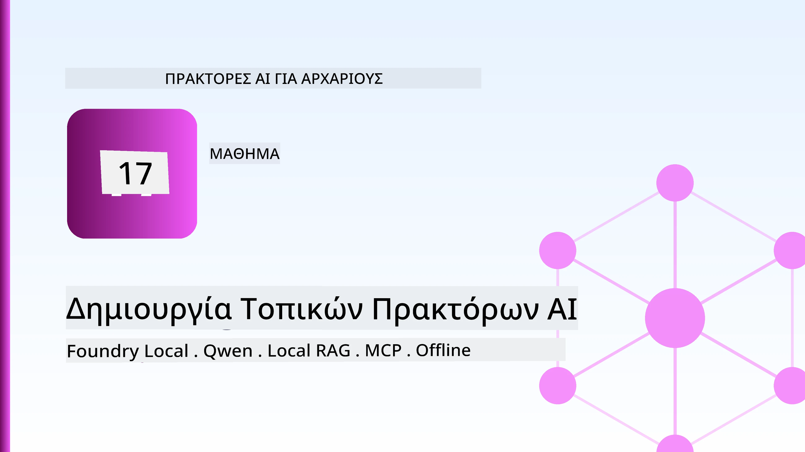
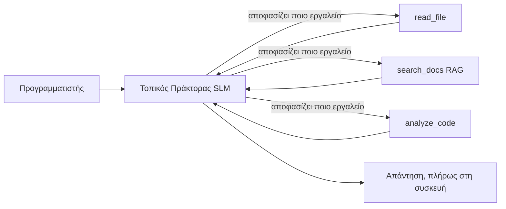
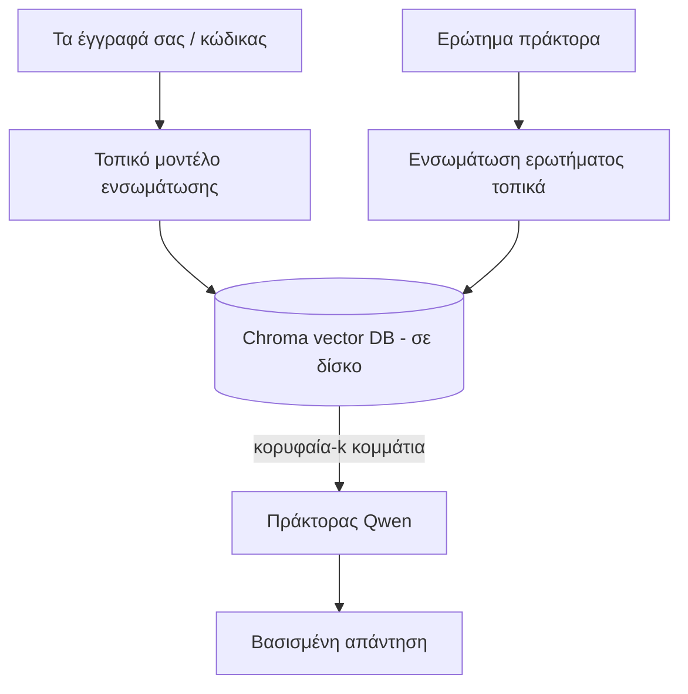
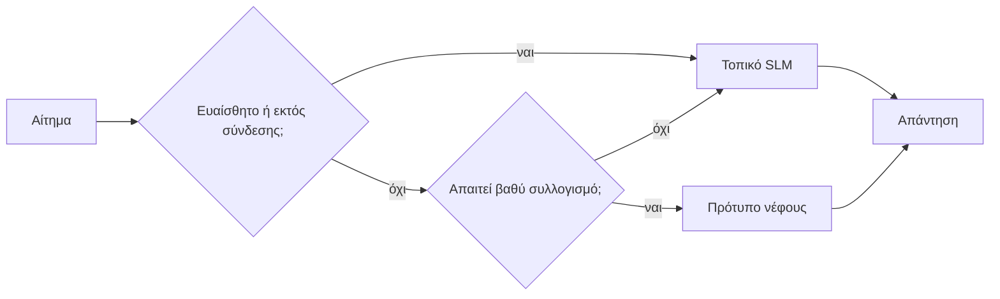

# Δημιουργία Τοπικών Πρακτόρων AI Χρησιμοποιώντας το Microsoft Foundry Local και το Qwen



Το προηγούμενο μάθημα κλιμάκωσε τους πράκτορες *πάνω* στο cloud. Αυτό τους φέρνει *κάτω* σε μια μόνο μηχανή. Στο τέλος θα έχετε έναν λειτουργικό βοηθό μηχανικής που λογικοποιεί, καλεί εργαλεία, διαβάζει τα αρχεία σας και αναζητά την τεκμηρίωσή σας — **χωρίς κανέναν κλήση inference στο cloud.**

Γιατί να το θέλετε αυτό; Τρεις λόγοι που προκύπτουν συνεχώς στην πραγματική μηχανική εργασία:

- **Απόρρητο.** Ο κώδικας και τα έγγραφα δεν αφήνουν ποτέ τη μηχανή. Καμία προτροπή, κανένα απόσπασμα, κανένα δεδομένο πελάτη δεν διασχίζει τα όρια του δικτύου.
- **Κόστος.** Η τοπική εκτίμηση δεν έχει χρέωση ανά τοκέν. Μπορείτε να επαναλαμβάνετε όλη μέρα με κόστος μόνο το ρεύμα.
- **Εκτός σύνδεσης.** Σε αεροπλάνο, σε ασφαλή εγκατάσταση ή κατά τη διάρκεια διακοπής, ο πράκτορας εξακολουθεί να λειτουργεί.

Το μειονέκτημα είναι ότι ανταλλάσσετε ένα κορυφαίο cloud μοντέλο με ένα **Μικρό Γλωσσικό Μοντέλο (SLM)** που τρέχει στον επεξεργαστή σας, την κάρτα γραφικών ή το NPU σας. Αυτό το μάθημα αφορά τη δημιουργία πρακτόρων που είναι *καλοί* μέσα σε αυτόν τον περιορισμό αντί να προσποιούνται ότι ο περιορισμός δεν υπάρχει.

## Εισαγωγή

Αυτό το μάθημα θα καλύψει:

- **Μικρά Γλωσσικά Μοντέλα (SLMs)** — τι είναι, πού διαπρέπουν και πού όχι.
- **Microsoft Foundry Local** — ένα runtime που κατεβάζει και εξυπηρετεί μοντέλα στην συσκευή μέσω ενός **OpenAI-συμβατού API**.
- **Μοντέλα Qwen με κλήση λειτουργιών** — SLMs που παράγουν αξιόπιστες κλήσεις εργαλείων, που κάνουν δυνατούς τους τοπικούς *πράκτορες* (όχι μόνο την τοπική συνομιλία).
- **Τοπικά εργαλεία, τοπικό RAG, και τοπικό MCP** — δίνοντας στον πράκτορα δυνατότητες χωρίς cloud.
- **Υβριδικά πρότυπα** — πότε να κρατάμε τα πράγματα τοπικά και πότε να καταφεύγουμε στο cloud.

## Στόχοι Μάθησης

Μετά την ολοκλήρωση αυτού του μαθήματος, θα γνωρίζετε πώς να:

- Εξηγείτε τις ανταλλαγές των SLMs και να επιλέγετε κατάλληλες περιπτώσεις χρήσης τοπικού πράκτορα.
- Εξυπηρετείτε ένα μοντέλο Qwen τοπικά με το Foundry Local και να συνδέεστε σε αυτό μέσω του OpenAI-συμβατού endpoint.
- Δημιουργείτε έναν πράκτορα κλήσης εργαλείων που τρέχει ολοκληρωτικά στον σταθμό εργασίας σας.
- Προσθέτετε τοπικό RAG πάνω στα δικά σας έγγραφα χρησιμοποιώντας μια τοπική βάση δεδομένων διανυσμάτων (Chroma).
- Συνδέετε τον πράκτορα σε έναν τοπικό MCP server και λογικοποιείτε υβριδικές σχεδιάσεις τοπικού/cloud.

## Προαπαιτούμενα

Αυτό το μάθημα προϋποθέτει ότι έχετε ολοκληρώσει τα προηγούμενα μαθήματα και είστε εξοικειωμένοι με:

- [Χρήση Εργαλείων](../04-tool-use/README.md) (Μάθημα 4) και [Agentic RAG](../05-agentic-rag/README.md) (Μάθημα 5).
- [Agentic Protocols / MCP](../11-agentic-protocols/README.md) (Μάθημα 11).
- Το [Microsoft Agent Framework](../14-microsoft-agent-framework/README.md) (Μάθημα 14).

Θα χρειαστείτε επίσης:

- Ένα σταθμό εργασίας προγραμματιστή. **8 GB RAM είναι ένα ρεαλιστικό ελάχιστο**· 16 GB+ είναι άνετα. Μια GPU ή NPU βοηθά αλλά δεν είναι απαραίτητη.
- Την **εγκατάσταση Microsoft Foundry Local** (βλ. την ενότητα ρύθμισης παρακάτω).
- Python 3.12+ και τα πακέτα στο αποθετήριο [`requirements.txt`](../../../requirements.txt), συν `foundry-local-sdk`, `openai`, και `chromadb` για αυτό το μάθημα.

## Μικρά Γλωσσικά Μοντέλα: Το Κατάλληλο Εργαλείο για Τοπική Εργασία

Ένα κορυφαίο cloud μοντέλο έχει εκατοντάδες δισεκατομμύρια παραμέτρους και πίσω του βρίσκεται ένα κέντρο δεδομένων. Ένα SLM έχει μερικά δισεκατομμύρια παραμέτρους και πρέπει να χωρέσει στη μνήμη RAM του φορητού σας υπολογιστή. Αυτή η διαφορά θέτει σαφείς προσδοκίες.

**Τα SLMs είναι καλά στο:**

- Δομημένα, περιορισμένα καθήκοντα — ταξινόμηση, εξαγωγή, περίληψη γνωστού εγγράφου.
- **Κλήση εργαλείων** — να αποφασίζουν ποια λειτουργία να καλέσουν και με ποια επιχειρήματα.
- Γρήγορη, φτηνή, ιδιωτική επανάληψη με τα δικά σας δεδομένα.

**Τα SLMs είναι πιο αδύναμα στο:**

- Ανοικτό, πολύ-άλμα λογικοί συλλογισμοί σε μεγάλο πλαίσιο.
- Ευρεία γνώση κόσμου (έχουν δει λιγότερο και ξεχνούν περισσότερο).

Η επιτυχημένη στρατηγική για τοπικούς πράκτορες είναι επομένως: **αφήστε το SLM να συντονίζει, και αφήστε τα εργαλεία να κάνουν τη βαριά δουλειά.** Το μοντέλο δεν χρειάζεται να *γνωρίζει* τη βάση κώδικά σας — χρειάζεται να ξέρει πότε να καλέσει `read_file` και `search_docs`. Αυτό παίζει κατευθείαν στα δυνατά σημεία ενός SLM.



## Microsoft Foundry Local

Το **Microsoft Foundry Local** είναι ένα ελαφρύ runtime που κατεβάζει, διαχειρίζεται, και εξυπηρετεί μοντέλα αποκλειστικά στη μηχανή σας. Η πιο σημαντική λειτουργία για εμάς είναι ότι εκθέτει ένα **OpenAI-συμβατό HTTP endpoint** — που σημαίνει ότι το OpenAI SDK και ο OpenAI client του Microsoft Agent Framework λειτουργούν εναντίον του μόνο με αλλαγή του `base_url`. Όλα όσα μάθατε για την κατασκευή πρακτόρων μεταφέρονται απευθείας· μόνο το endpoint μετακινείται από το cloud στο `localhost`.

Το Foundry Local επιλέγει επίσης αυτόματα την καλύτερη έκδοση ενός μοντέλου για το υλικό σας — έκδοση CPU, CUDA/GPU ή NPU — ώστε να μην βελτιστοποιείτε χειροκίνητα ανά μηχανή.

### Ρύθμιση

Εγκαταστήστε το Foundry Local (βλέπε την [τεκμηρίωση](https://learn.microsoft.com/azure/ai-foundry/foundry-local/) για το λειτουργικό σας), και επιβεβαιώστε ότι λειτουργεί:

```bash
# Εγκατάσταση (παράδειγμα· ακολουθήστε τα έγγραφα για την πλατφόρμα σας)
winget install Microsoft.FoundryLocal      # Windows
# brew install microsoft/foundrylocal/foundrylocal   # macOS

# Κατεβάστε και εκτελέστε ένα μοντέλο Qwen, στη συνέχεια ξεκινήστε την τοπική υπηρεσία
foundry model run qwen2.5-7b-instruct
foundry service status
```

Μόλις η υπηρεσία τρέχει έχετε ένα τοπικό, OpenAI-συμβατό endpoint (συνήθως `http://localhost:PORT/v1`). Το notebook χρησιμοποιεί το `foundry-local-sdk` για να βρει το endpoint αυτόματα, ώστε να μην χρειάζεται να ορίσετε χειροκίνητα τη θύρα.

## Κλήση Λειτουργιών Qwen: Γιατί Είναι Σημαντικό

Ένας πράκτορας είναι πράκτορας μόνο αν μπορεί να καλέσει εργαλεία. Πολλά SLM μπορούν να συνομιλήσουν αλλά παράγουν μη αξιόπιστες, κακοσχηματισμένες κλήσεις εργαλείων. Τα μοντέλα **Qwen** εκπαιδεύονται για κλήση λειτουργιών και παράγουν αξιόπιστες δομές κλήσεων εργαλείων — αυτό ακριβώς μετατρέπει ένα τοπικό μοντέλο συνομιλίας σε τοπικό *πράκτορα*.

Η ροή είναι ο τυπικός βρόχος κλήσης εργαλείων που ήδη γνωρίζετε, απλώς τρέχει στη συσκευή:

```mermaid
sequenceDiagram
    participant U as Χρήστης
    participant A as Πράκτορας Qwen (τοπικός)
    participant T as Τοπικό Εργαλείο
    U->>A: "Τι κάνει το auth.py;"
    A->>A: Αποφάσισε: κάλεσε read_file
    A->>T: read_file("auth.py")
    T-->>A: περιεχόμενο αρχείου
    A->>A: Συλλογισμός πάνω στο περιεχόμενο
    A-->>U: Εξήγηση
```

## Τοπικό RAG

Η αναζήτηση τεκμηρίωσης είναι όπου οι τοπικοί πράκτορες επιβεβαιώνουν την αξία τους. Αντί να ελπίζετε ότι το SLM απομνημόνευσε την τεκμηρίωση του πλαισίου σας, ενσωματώνετε αυτά τα έγγραφα σε μια **τοπική βάση δεδομένων διανυσμάτων** και αφήνετε τον πράκτορα να ανακτά τα σχετικά αποσπάσματα κατά απαίτηση.

Χρησιμοποιούμε το **Chroma**, μια ενσωματωμένη βάση διανυσμάτων που τρέχει μέσα στη διαδικασία χωρίς διακομιστή να την διαχειρίζεται. Η αλυσίδα είναι εντελώς τοπική: τοπικό ενσωματωτικό μοντέλο → τοπικά διανύσματα → τοπική ανάκτηση → τοπικό SLM.



Αυτό είναι το ίδιο πρότυπο Agentic RAG από το Μάθημα 5 — η μόνη αλλαγή είναι ότι κάθε στοιχείο τρέχει στη μηχανή σας.

## Τοπικοί MCP Servers

Το [MCP](../11-agentic-protocols/README.md) είναι μια μεταφορά, όχι μια υπηρεσία cloud. Ένας MCP server μπορεί να τρέχει ως τοπική διαδικασία στο `stdio`, εκθέτοντας εργαλεία στον πράκτορά σας μέσω του τυπικού πρωτοκόλλου. Αυτό σας επιτρέπει να επαναχρησιμοποιήσετε το αναπτυσσόμενο οικοσύστημα MCP servers — πρόσβαση σε σύστημα αρχείων, εντολές git, ερωτήματα βάσης δεδομένων — ολικά εκτός σύνδεσης.

Η στάση ασφαλείας διαφέρει από το cloud, αλλά δεν απουσιάζει: ένας τοπικός MCP server τρέχει με τις άδειες του χρήστη σας, οπότε περιορίστε το πεδίο της πρόσβασής του (π.χ. έναν κατάλογο έργου, όχι ολόκληρο το φάκελο του σπιτιού σας) και αντιμετωπίστε τα αποτελέσματά του ως είσοδοι που πρέπει να επικυρώσετε.

## Υβριδικά Πρότυπα Cloud και Τοπικών

Τοπικό-πρώτα δεν σημαίνει μόνο τοπικό. Ωριμασμένα συστήματα δρομολογούν με βάση την ευαισθησία και τη δυσκολία:

| Κατάσταση | Πού τρέχει |
| --- | --- |
| Ευαίσθητος κώδικας / δεδομένα, ή εκτός σύνδεσης | **Τοπικό SLM** |
| Απλό, περιορισμένο έργο | **Τοπικό SLM** (φτηνό, γρήγορο) |
| Σύνθετος πολύ-άλμα συλλογισμός σε μη ευαίσθητα δεδομένα | **Cloud μοντέλο** |
| Όλα, κατά τη διάρκεια διακοπής | **Τοπικό SLM** (ήπια υποβάθμιση) |

Αυτό αντικατοπτρίζει την ιδέα **δρομολόγησης μοντέλου** από το Μάθημα 16 — εκτός από το ότι ένα από τα «μοντέλα» είναι τώρα η δική σας μηχανή. Μια στιβαρή σχεδίαση επιστρέφει στην τοπική όταν το cloud δεν είναι διαθέσιμο, ώστε ο πράκτορας να υποβαθμίζεται στην ποιότητα αντί να αποτυγχάνει εντελώς.



## Πρακτική Άσκηση: Ένας Τοπικός Βοηθός Μηχανικής

Ανοίξτε το [`code_samples/17-local-agent-foundry-local.ipynb`](./code_samples/17-local-agent-foundry-local.ipynb) και δουλέψτε πάνω του. Θα χτίσετε έναν **τοπικό βοηθό μηχανικής** που τρέχει ολοκληρωτικά στον σταθμό εργασίας σας και μπορεί:

1. **Να καλεί εργαλεία** — μέσω κλήσης λειτουργιών Qwen με το Foundry Local.
2. **Να εκτελεί τοπικές λειτουργίες αρχείων** — να απαριθμεί και να διαβάζει αρχεία σε έναν κατάλογο έργου.
3. **Να αναλύει κώδικα** — να αναφέρει βασικά μετρικά σε ένα αρχείο πηγαίου.
4. **Να αναζητά τεκμηρίωση** — τοπικό RAG πάνω σε φάκελο εγγράφων με το Chroma.
5. **Να χρησιμοποιεί MCP** — να συνδέεται σε έναν τοπικό MCP server (με ομαλή παράκαμψη αν δεν ρυθμιστεί).

Δεν χρησιμοποιείται καμία κλήση inference στο cloud σε κανένα σημείο.

### Οδηγός

Ο βοηθός συνδέεται με το Foundry Local μέσω του OpenAI-συμβατού endpoint, οπότε ο κώδικας του πράκτορα μοιάζει σχεδόν ίδιος με τα μαθήματα του cloud — μόνο ο client αλλάζει:

```python
from foundry_local import FoundryLocalManager
from openai import OpenAI

# Το Foundry Local εντοπίζει/κατεβάζει το μοντέλο και μας δίνει ένα τοπικό σημείο πρόσβασης.
manager = FoundryLocalManager(\"qwen2.5-7b-instruct\")
client = OpenAI(base_url=manager.endpoint, api_key=manager.api_key)  # το api_key είναι ένας τοπικός χώρος κράτησης
```

Τα εργαλεία είναι απλές λειτουργίες Python περιορισμένες σε έναν κατάλογο έργου:

```python
def read_file(path: str) -> str:
    \"\"\"Read a file, but only inside the sandboxed project directory.\"\"\"
    full = (PROJECT_ROOT / path).resolve()
    if PROJECT_ROOT not in full.parents and full != PROJECT_ROOT:
        return \"Access denied: path is outside the project directory.\"
    return full.read_text(encoding=\"utf-8\")
```

Σημειώστε τον έλεγχο sandbox — ακόμα και τοπικά, ένα εργαλείο που διαβάζει αυθαίρετα μονοπάτια είναι ρίσκο. Το notebook κρατά κάθε εργαλείο περιορισμένο σε μία ρίζα έργου.

## Έλεγχος Γνώσης

Δοκιμάστε την κατανόησή σας πριν προχωρήσετε στην άσκηση.

**1. Δώστε δύο συγκεκριμένους λόγους για να τρέξει ένας πράκτορας τοπικά αντί στο cloud.**

<details>
<summary>Απάντηση</summary>

Οποιοιδήποτε δύο από τα εξής: **απόρρητο** (κώδικας και δεδομένα δεν φεύγουν από τη μηχανή), **κόστος** (καμία χρέωση ανά τοκέν inference), και **δυνατότητα εκτός σύνδεσης** (λειτουργεί χωρίς δίκτυο — σε αεροπλάνο, σε ασφαλή εγκατάσταση ή κατά τη διάρκεια διακοπής). Οι ρυθμιστικοί/συμμορφωτικοί περιορισμοί που απαγορεύουν την αποστολή δεδομένων εκτός συσκευής είναι ένας συνηθισμένος λόγος απορρήτου.
</details>

**2. Ποια είναι η προτεινόμενη κατανομή εργασίας μεταξύ ενός SLM και των εργαλείων του σε έναν τοπικό πράκτορα, και γιατί;**

<details>
<summary>Απάντηση</summary>

Αφήστε το SLM να **συντονίζει** (να αποφασίζει ποιο εργαλείο να καλέσει και με ποια επιχειρήματα) και αφήστε τα **εργαλεία να κάνουν τη βαριά δουλειά** (ανάγνωση αρχείων, ανάκτηση εγγράφων, υπολογισμό αποτελεσμάτων). Τα SLM είναι δυνατά σε περιορισμένες αποφάσεις όπως η επιλογή εργαλείου, αλλά πιο αδύναμα σε ευρεία γνώση και μακροσκελείς πολύ-άλμα συλλογισμούς, οπότε η στήριξη σε εργαλεία αξιοποιεί τα δυνατά τους σημεία.
</details>

**3. Τι καθιστά δυνατή την επαναχρησιμοποίηση του κώδικα πράκτορα cloud με το Foundry Local;**

<details>
<summary>Απάντηση</summary>

Το Foundry Local εκθέτει ένα **OpenAI-συμβατό HTTP endpoint**. Το OpenAI SDK και ο OpenAI client του Agent Framework λειτουργούν εναντίον του απλώς αλλάζοντας το `base_url` (και χρησιμοποιώντας ένα τοπικό placeholder API key). Όλα τα υπόλοιπα του κώδικα του πράκτορα μένουν ίδια.
</details>

**4. Γιατί χρησιμοποιούμε συγκεκριμένα ένα μοντέλο κλήσης λειτουργιών Qwen αντί για οποιοδήποτε SLM;**

<details>
<summary>Απάντηση</summary>

Επειδή ένας πράκτορας πρέπει να παράγει αξιόπιστες, καλοσχηματισμένες **κλήσεις εργαλείων**. Πολλά SLM μπορούν να συνομιλήσουν αλλά εκπέμπουν κακοσχηματισμένες ή ασυνεπείς δομές κλήσεων εργαλείων. Τα μοντέλα Qwen εκπαιδεύονται για κλήση λειτουργιών και παράγουν συνεπείς κλήσεις εργαλείων, που είναι αυτό που μετατρέπει ένα τοπικό μοντέλο συνομιλίας σε λειτουργικό τοπικό πράκτορα.
</details>

**5. Στο τοπικό RAG pipeline, ποια συνιστώσα τρέχουν στη μηχανή;**

<details>
<summary>Απάντηση</summary>

Όλα: το ενσωματωτικό μοντέλο, η βάση δεδομένων διανυσμάτων (Chroma, στο δίσκο), το βήμα ανάκτησης, και το SLM. Τα έγγραφα ενσωματώνονται τοπικά, αποθηκεύονται τοπικά, ανακτώνται τοπικά, και λογικοποιούνται από τοπικό μοντέλο — κανένα μέρος δεν αγγίζει το cloud.
</details>

**6. Ένας τοπικός MCP server τρέχει στη μηχανή σας. Σημαίνει αυτό ότι είναι αυτόματα ασφαλής; Ποια προφύλαξη πρέπει να πάρετε ακόμα;**

<details>
<summary>Απάντηση</summary>

Όχι. Ένας τοπικός MCP server τρέχει με τις άδειες του χρήστη σας, οπότε μπορεί να αγγίζει οτιδήποτε μπορείτε εσείς. Περιορίστε τον σε ό,τι χρειάζεται (π.χ. σε έναν μεμονωμένο κατάλογο έργου και όχι ολόκληρο το φάκελο του σπιτιού σας) και αντιμετωπίστε τις εξόδους του ως είσοδοι που πρέπει να επικυρώσετε πριν ενεργήσετε.
</details>

**7. Περιγράψτε έναν λογικό υβριδικό κανόνα δρομολόγησης που περιλαμβάνει ένα τοπικό μοντέλο.**

<details>
<summary>Απάντηση</summary>

Δρομολογήστε ευαίσθητα ή εκτός σύνδεσης αιτήματα στο τοπικό SLM· δρομολογήστε απλά περιορισμένα καθήκοντα στο τοπικό SLM για ταχύτητα και κόστος· δρομολογήστε σκληρούς πολύ-άλμα συλλογισμούς σε μη ευαίσθητα δεδομένα σε μοντέλο cloud· και επιστρέψτε στο τοπικό SLM αν το cloud είναι μη διαθέσιμο ώστε ο πράκτορας να υποβαθμίζεται ομαλά αντί να αποτυγχάνει. Αυτή είναι η δρομολόγηση μοντέλου (Μάθημα 16) με τη τοπική μηχανή ως ένα από τα μοντέλα.
</details>

**8. Ποιο είναι ένα ρεαλιστικό ελάχιστο μέγεθος μνήμης RAM για το τρέξιμο του τοπικού πράκτορα σε αυτό το μάθημα, και τι κερδίζετε με περισσότερη RAM;**

<details>
<summary>Απάντηση</summary>

Περίπου **8 GB** είναι ρεαλιστικό ελάχιστο· 16 GB+ είναι άνετο. Περισσότερη RAM σας επιτρέπει να τρέχετε μεγαλύτερα, πιο ικανά μοντέλα και να κρατάτε περισσότερο πλαίσιο στη μνήμη. Μια GPU ή NPU επιταχύνει το inference αλλά δεν είναι απαραίτητη — το Foundry Local επιλέγει μια CPU έκδοση όταν δεν υπάρχει επιταχυντής διαθέσιμος.
</details>

## Άσκηση

Επεκτείνετε τον τοπικό βοηθό μηχανικής σε έναν **τοπικό κριτή τεκμηρίωσης** για ένα μικρό έργο της επιλογής σας (χρησιμοποιήστε έναν από τους φακέλους μαθημάτων αυτού του αποθετηρίου αν θέλετε).

Η υποβολή σας θα πρέπει να:

1. **Δημιουργεί ευρετήριο ενός πραγματικού φακέλου εγγράφων/κώδικα** στο Chroma (τουλάχιστον πέντε αρχεία).
2. **Προσθέτει ένα εργαλείο `find_todos`** που σαρώνει το έργο για σχόλια `TODO`/`FIXME` και τα επιστρέφει με το αρχείο και τον αριθμό γραμμής — κρατώντας τον ίδιο έλεγχο sandbox όπως στο `read_file`.

3. **Κάντε στον πράκτορα τρεις ερωτήσεις** που τον αναγκάζουν να συνδυάσει εργαλεία: μία καθαρή ερώτηση RAG, μία που απαιτεί ανάγνωση συγκεκριμένου αρχείου και μία που απαιτεί εύρεση TODOs.
4. **Μετρήστε τον**: χρονομετρήστε τις τρεις απαντήσεις και καταγράψτε τις σε κελί markdown. Σχολιάστε αν η καθυστέρηση είναι αποδεκτή για την προτεινόμενη ροή εργασίας σας.

Στη συνέχεια γράψτε μία σύντομη παράγραφο σχετικά με το **τι θα μεταφέρατε στο cloud και τι θα κρατούσατε τοπικά** για αυτόν τον αξιολογητή, και γιατί. Αξιολογείστε κατά πόσο τα τοπικά συστατικά συνδέονται σωστά και κατά πόσο η υβριδική λογική σας είναι ορθή — όχι την ποιότητα του μοντέλου.

## Περίληψη

Σε αυτό το μάθημα δημιουργήσατε έναν πράκτορα που λειτουργεί εξ ολοκλήρου στον δικό σας υπολογιστή:

- Τα **SLMs** ανταλλάσσουν ευρύτητα με ιδιωτικότητα, κόστος και λειτουργία εκτός σύνδεσης — και διαπρέπουν όταν **ορχηστρώνουν εργαλεία** αντί να φέρουν όλη τη γνώση οι ίδιοι.
- Το **Foundry Local** παρέχει μοντέλα στο σύστημα πίσω από ένα **σημείο τερματισμού συμβατό με OpenAI**, έτσι ο κώδικας του πράκτορα cloud μεταφέρεται με μία μόνο αλλαγή.
- Τα **μοντέλα κλήσης συνάρτησης Qwen** καθιστούν δυνατή την αξιόπιστη τοπική κλήση εργαλείων — και συνεπώς τοπικών *πρακτόρων*.
- Το **τοπικό RAG** (Chroma) και το **τοπικό MCP** δίνουν στον πράκτορα δυνατότητα χωρίς να αφήσει τη μηχανή.
- Τα **υβριδικά μοτίβα** σας επιτρέπουν να δρομολογείτε ανάλογα με την ευαισθησία και τη δυσκολία, με το τοπικό ως κομψή εναλλακτική.

Αυτό ολοκληρώνει την καμπύλη υλοποίησης: Το Μάθημα 16 κλιμάκωσε τους πράκτορες στο Microsoft Foundry, και αυτό το μάθημα τους κλιμάκωσε σε έναν μόνο σταθμό εργασίας. Το επόμενο μάθημα ασχολείται με τη διατήρηση των αναπτυγμένων πρακτόρων ασφαλών.

## Πρόσθετοι Πόροι

- <a href="https://learn.microsoft.com/azure/ai-foundry/foundry-local/" target="_blank">Τεκμηρίωση Microsoft Foundry Local</a>
- <a href="https://learn.microsoft.com/azure/ai-foundry/what-is-azure-ai-foundry" target="_blank">Τεκμηρίωση Microsoft Foundry</a>
- <a href="https://aka.ms/ai-agents-beginners/agent-framework" target="_blank">Πλαίσιο Εργασίας Πράκτορα Microsoft</a>
- <a href="https://qwen.readthedocs.io/en/latest/framework/function_call.html" target="_blank">Τεκμηρίωση κλήσης συνάρτησης Qwen</a>
- <a href="https://modelcontextprotocol.io/" target="_blank">Πρωτόκολλο Πλαισίου Μοντέλου (MCP)</a>
- <a href="https://docs.trychroma.com/" target="_blank">Βάση δεδομένων διανυσμάτων Chroma</a>

## Προηγούμενο Μάθημα

[Ανάπτυξη Κλιμακούμενων Πρακτόρων](../16-deploying-scalable-agents/README.md)

## Επόμενο Μάθημα

[Ασφάλεια Πρακτόρων ΤΝ](../18-securing-ai-agents/README.md)

---

<!-- CO-OP TRANSLATOR DISCLAIMER START -->
**Αποποίηση ευθυνών**:
Αυτό το έγγραφο έχει μεταφραστεί χρησιμοποιώντας την υπηρεσία μετάφρασης με τεχνητή νοημοσύνη [Co-op Translator](https://github.com/Azure/co-op-translator). Ενώ επιδιώκουμε την ακρίβεια, παρακαλούμε να έχετε υπόψη ότι οι αυτοματοποιημένες μεταφράσεις ενδέχεται να περιέχουν λάθη ή ανακρίβειες. Το πρωτότυπο έγγραφο στη μητρική του γλώσσα πρέπει να θεωρείται η αυθεντική πηγή. Για κρίσιμες πληροφορίες, συνιστάται επαγγελματική ανθρώπινη μετάφραση. Δεν φέρουμε ευθύνη για τυχόν παρεξηγήσεις ή λανθασμένες ερμηνείες που προκύπτουν από τη χρήση αυτής της μετάφρασης.
<!-- CO-OP TRANSLATOR DISCLAIMER END -->