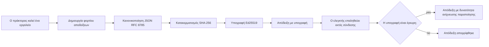
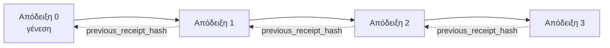

[Δείτε το βίντεο του μαθήματος: Ασφάλεια Πρακτόρων AI με Κρυπτογραφικές Αποδείξεις](https://youtu.be/PLACEHOLDER_VIDEO_ID)

> _(Το βίντεο του μαθήματος και το μικρογραφία θα προστεθούν από την ομάδα περιεχομένου της Microsoft μετά τη συγχώνευση, σύμφωνα με το πρότυπο των μαθημάτων 14 / 15.)_

# Ασφάλεια Πρακτόρων AI με Κρυπτογραφικές Αποδείξεις

## Εισαγωγή

Αυτό το μάθημα θα καλύψει:

- Γιατί οι ιχνηλασίες ελέγχου για πράκτορες AI είναι σημαντικές για συμμόρφωση, εντοπισμό σφαλμάτων και εμπιστοσύνη.
- Τι είναι μια κρυπτογραφική απόδειξη και πώς διαφέρει από μια μη υπογεγραμμένη γραμμή καταγραφής.
- Πώς να παράγετε μια υπογεγραμμένη απόδειξη για μια κλήση εργαλείου του πράκτορα σε απλό Python.
- Πώς να επαληθεύσετε μια απόδειξη εκτός σύνδεσης και να εντοπίσετε παραποίηση.
- Πώς να συνδέετε αποδείξεις έτσι ώστε η αφαίρεση ή η αναδιάταξη μιας να σπάει την αλυσίδα.
- Τι αποδεικνύουν οι αποδείξεις και τι ρητά δεν αποδεικνύουν.

## Στόχοι Μάθησης

Μετά την ολοκλήρωση αυτού του μαθήματος, θα γνωρίζετε πώς να:

- Αναγνωρίσετε τις αποτυχίες που δικαιολογούν κρυπτογραφική αυθεντικοποίηση για τις ενέργειες του πράκτορα.
- Παράγετε μια υπογεγραμμένη απόδειξη Ed25519 πάνω σε ένα κανονικοποιημένο JSON φορτίο.
- Επαληθεύσετε μια απόδειξη ανεξάρτητα χρησιμοποιώντας μόνο το δημόσιο κλειδί του υπογράφοντα.
- Εντοπίσετε παραποίηση επαναλαμβάνοντας την επαλήθευση σε μια τροποποιημένη απόδειξη.
- Δημιουργήσετε μια αλυσίδα αποδείξεων με αλυσιδωτό κατακερματισμό και να εξηγήσετε γιατί η αλυσίδα έχει σημασία.
- Αναγνωρίσετε το όριο μεταξύ των όσων αποδεικνύουν οι αποδείξεις (απόδοση, ακεραιότητα, σειρά) και όσων δεν αποδεικνύουν (σωστότητα της ενέργειας, ορθότητα της πολιτικής).

## Το Πρόβλημα: Η Ιχνηλασία Ελέγχου του Πράκτορά σας

Φανταστείτε ότι έχετε αναπτύξει έναν πράκτορα AI για την Contoso Travel. Ο πράκτορας διαβάζει αιτήματα πελατών, καλεί ένα API πτήσεων για να βρει επιλογές και κλείνει θέσεις εκ μέρους του πελάτη. Το προηγούμενο τρίμηνο, ο πράκτορας επεξεργάστηκε 50.000 κρατήσεις.

Σήμερα φτάνει ένας ελεγκτής. Κάνει μια απλή ερώτηση: "Δείξτε μου τι έκανε ο πράκτοράς σας."

Παραδίδετε τα αρχεία καταγραφής σας. Ο ελεγκτής τα εξετάζει και ρωτά την πιο δύσκολη ερώτηση: "Πώς ξέρω ότι αυτά τα αρχεία δεν έχουν τροποποιηθεί;"

Αυτό είναι το πρόβλημα της ιχνηλασίας ελέγχου. Η περισσότερη ανάπτυξη πρακτόρων σήμερα στηρίζεται σε:

- **Καταγραφές εφαρμογών**: γραμμένες από τον ίδιο τον πράκτορα, επεξεργάσιμες από οποιονδήποτε έχει πρόσβαση στο σύστημα αρχείων.
- **Υπηρεσίες καταγραφής cloud**: ανιχνεύουν παραποίηση σε επίπεδο πλατφόρμας αλλά μόνο αν ο ελεγκτής εμπιστεύεται τον πάροχο της πλατφόρμας.
- **Καταγραφές συναλλαγών βάσης δεδομένων**: κατάλληλες για αλλαγές βάσης δεδομένων αλλά όχι για αυθαίρετες κλήσεις εργαλείων.

Καμία από αυτές δεν μπορεί να απαντήσει στο ερώτημα του ελεγκτή χωρίς να απαιτείται εμπιστοσύνη σε κάποιον (εσάς, τον πάροχο του cloud, τον προμηθευτή της βάσης δεδομένων). Για εσωτερική χρήση, αυτή η εμπιστοσύνη είναι συχνά αποδεκτή. Για ρυθμιζόμενα φορτία εργασίας (χρηματοοικονομικά, υγειονομική περίθαλψη, οτιδήποτε υπόκειται στον EU AI Act), δεν είναι.

Οι κρυπτογραφικές αποδείξεις λύνουν αυτό το πρόβλημα καθιστώντας κάθε ενέργεια πράκτορα ανεξάρτητα επαληθεύσιμη. Ο ελεγκτής δεν χρειάζεται να σας εμπιστευτεί. Χρειάζεται μόνο το δημόσιο κλειδί σας και την ίδια την απόδειξη.

## Τι είναι μια Κρυπτογραφική Απόδειξη;

Μια απόδειξη είναι ένα αντικείμενο JSON που καταγράφει τι έκανε ένας πράκτορας, υπογεγραμμένο με μια ψηφιακή υπογραφή.



Μια ελάχιστη απόδειξη φαίνεται έτσι:

```json
{
  "type": "agent.tool_call.v1",
  "agent_id": "contoso-travel-bot",
  "tool_name": "lookup_flights",
  "tool_args_hash": "sha256:a3f9c1...",
  "result_hash": "sha256:7b2e1d...",
  "policy_id": "contoso-travel-policy-v3",
  "timestamp": "2026-04-25T14:30:00Z",
  "sequence": 47,
  "previous_receipt_hash": "sha256:9d4e6a...",
  "signature": {
    "alg": "EdDSA",
    "sig": "c5af83...",
    "public_key": "8f3b2c..."
  }
}
```

Τρεις ιδιότητες κάνουν τη δουλειά:

1. **Η υπογραφή**. Η απόδειξη υπογράφεται από την πύλη του πράκτορα χρησιμοποιώντας ένα ιδιωτικό κλειδί Ed25519. Οποιοσδήποτε με το αντίστοιχο δημόσιο κλειδί μπορεί να επαληθεύσει την υπογραφή εκτός σύνδεσης. Η παραποίηση οποιουδήποτε πεδίου καθιστά την υπογραφή άκυρη.

2. **Κανονικοποιημένη κωδικοποίηση**. Πριν την υπογραφή, η απόδειξη σειριοποιείται χρησιμοποιώντας το JSON Canonicalization Scheme (JCS, RFC 8785). Αυτό εξασφαλίζει ότι δύο υλοποιήσεις που παράγουν την ίδια λογική απόδειξη παράγουν ταυτόσημη έξοδο byte προς byte. Χωρίς κανονικοποίηση, διαφορετικοί σειριοποιητές JSON θα παρήγαγαν διαφορετικές υπογραφές για το ίδιο περιεχόμενο.

3. **Αλυσιδωτός κατακερματισμός**. Το πεδίο `previous_receipt_hash` συνδέει κάθε απόδειξη με την προηγούμενη. Η αφαίρεση ή αναδιάταξη μιας απόδειξης σπάει κάθε απόδειξη που ακολουθεί. Η παραποίηση γίνεται ορατή σε επίπεδο αλυσίδας ακόμα και αν οι μεμονωμένες υπογραφές παρακαμφθούν.

Μαζί αυτές οι ιδιότητες παρέχουν τρεις εγγυήσεις:

- **Απόδοση**: αυτό το κλειδί υπέγραψε αυτό το περιεχόμενο.
- **Ακεραιότητα**: το περιεχόμενο δεν έχει αλλάξει από την υπογραφή.
- **Σειρά**: αυτή η απόδειξη ήρθε μετά από εκείνη στην αλυσίδα.

## Δημιουργία Απόδειξης σε Python

Δεν χρειάζεστε κάποια ειδική βιβλιοθήκη για να δημιουργήσετε μια απόδειξη. Οι κρυπτογραφικές πρωτόγονες λειτουργίες είναι ευρέως διαθέσιμες και η λογική είναι μερικές δεκάδες γραμμές Python.

Οι πρακτικές ασκήσεις στο `code_samples/18-signed-receipts.ipynb` οδηγούν σε όλη τη ροή. Η περίληψη:

```python
import json
import hashlib
import base64
from nacl import signing
from jcs import canonicalize  # RFC 8785 κανονικό JSON

def b64url_nopad(data: bytes) -> str:
    return base64.urlsafe_b64encode(data).decode("ascii").rstrip("=")

def sha256_canonical(obj) -> str:
    """SHA-256 of a Python object's JCS-canonical JSON form."""
    return f"sha256:{hashlib.sha256(canonicalize(obj)).hexdigest()}"

# Δημιουργήστε ή φορτώστε ένα κλειδί υπογραφής (σε παραγωγή, αποθηκεύστε το σε θησαυροφυλάκιο κλειδιών)
signing_key = signing.SigningKey.generate()
verify_key = signing_key.verify_key

# Δημιουργήστε το φορτίο απόδειξης (χωρίς υπογραφή ακόμα)
tool_args = {"origin": "SYD", "destination": "LAX"}
tool_result = [{"flight": "QF11", "price": 1850, "stops": 0}]

payload = {
    "type": "agent.tool_call.v1",
    "agent_id": "contoso-travel-bot",
    "tool_name": "lookup_flights",
    "tool_args_hash": sha256_canonical(tool_args),
    "result_hash": sha256_canonical(tool_result),
    "policy_id": "contoso-travel-policy-v3",
    "timestamp": "2026-04-25T14:30:00Z",
    "sequence": 0,
    "previous_receipt_hash": None,
}

# Κανονικοποιήστε, δημιουργήστε κατακερματισμό, υπογράψτε.
canonical_bytes = canonicalize(payload)
message_hash = hashlib.sha256(canonical_bytes).digest()
signature_bytes = signing_key.sign(message_hash).signature

# Επισυνάψτε ένα δομημένο αντικείμενο υπογραφής.
receipt = {
    **payload,
    "signature": {
        "alg": "EdDSA",
        "sig": b64url_nopad(signature_bytes),
        "public_key": b64url_nopad(bytes(verify_key)),
    },
}
```

Αυτή είναι όλη η διαδικασία υπογραφής. Οι ασκήσεις στο notebook περνούν κάθε βήμα.

## Επαλήθευση Απόδειξης και Εντοπισμός Παραποίησης

Η επαλήθευση είναι η αντίστροφη λειτουργία:

```python
import base64
import hashlib
from nacl import signing
from nacl.exceptions import BadSignatureError
from jcs import canonicalize

def b64url_decode(s: str) -> bytes:
    padding = "=" * ((4 - len(s) % 4) % 4)
    return base64.urlsafe_b64decode(s + padding)

def verify_receipt(receipt: dict) -> bool:
    # Η υπογραφή είναι ένα δομημένο αντικείμενο: {"alg", "sig", "public_key"}.
    sig_obj = receipt.get("signature")
    if not sig_obj or sig_obj.get("alg") != "EdDSA":
        return False

    # Ανακατασκευάστε το φορτίο που υπογράφηκε πραγματικά (όλα εκτός από την υπογραφή).
    payload = {k: v for k, v in receipt.items() if k != "signature"}

    canonical_bytes = canonicalize(payload)
    message_hash = hashlib.sha256(canonical_bytes).digest()

    try:
        verify_key = signing.VerifyKey(b64url_decode(sig_obj["public_key"]))
        verify_key.verify(message_hash, b64url_decode(sig_obj["sig"]))
        return True
    except BadSignatureError:
        return False
```

Αυτή η συνάρτηση παίρνει μια απόδειξη και επιστρέφει `True` αν η υπογραφή είναι έγκυρη, `False` διαφορετικά. Δεν υπάρχει κλήση δικτύου, δεν υπάρχει εξάρτηση υπηρεσίας, δεν απαιτείται εμπιστοσύνη σε τρίτο μέρος.

Για να δείτε τον εντοπισμό παραποίησης σε δράση, το notebook περνάει από:

1. Δημιουργία έγκυρης απόδειξης και επιβεβαίωση ότι επαληθεύεται.
2. Τροποποίηση ενός byte στο πεδίο `tool_args_hash`.
3. Επανάληψη της επαλήθευσης και παρατήρηση της αποτυχίας.

Αυτή είναι η πρακτική επίδειξη ότι οι αποδείξεις είναι εντοπιστικές παραποίησης: οποιαδήποτε τροποποίηση, έστω και μικρή, σπάει την υπογραφή.

## Αλυσιδωτή Σύνδεση Αποδείξεων για Πράκτορες Πολλαπλών Βημάτων

Μια υπογεγραμμένη απόδειξη προστατεύει μια ενέργεια. Μια αλυσίδα αποδείξεων προστατεύει μια ακολουθία.



Κάθε απόδειξη καταγράφει το κατακερματισμό της προηγούμενης απόδειξης. Για να αφαιρεθεί η απόδειξη 2 αθόρυβα, ένας επιτιθέμενος θα χρειαστεί είτε:

- Να τροποποιήσει το πεδίο `previous_receipt_hash` της απόδειξης 3 (σπάει την υπογραφή της απόδειξης 3), Ή
- Να δημιουργήσει νέα υπογραφή σε τροποποιημένη απόδειξη 3 (απαιτεί το ιδιωτικό κλειδί του πράκτορα).

Αν το ιδιωτικό κλειδί βρίσκεται σε θωρακισμένο αποθηκευτικό χώρο υλικού και δημοσιεύετε το δημόσιο κλειδί με κάθε απόδειξη, καμία από αυτές τις επιθέσεις δεν είναι εφικτή χωρίς ανίχνευση.

Το notebook δείχνει:

1. Δημιουργία αλυσίδας τριών αποδείξεων.
2. Επαλήθευση ότι το `previous_receipt_hash` κάθε απόδειξης ταιριάζει με τον πραγματικό κατακερματισμό της προηγούμενης.
3. Παραποίηση μιας απόδειξης στη μέση και παρατήρηση του σπασίματος της αλυσίδας ακριβώς εκεί.

Έτσι παράγετε μια ιχνηλασία ελέγχου που ένας εξωτερικός ελεγκτής μπορεί να επαληθεύσει χωρίς να σας εμπιστεύεται.

## Τι Αποδεικνύουν οι Αποδείξεις (και Τι Δεν Αποδεικνύουν)

Αυτή είναι η πιο σημαντική ενότητα του μαθήματος. Οι αποδείξεις είναι ισχυρές αλλά η ισχύς τους είναι περιορισμένη.

**Οι αποδείξεις αποδεικνύουν τρία πράγματα:**

1. **Απόδοση**: ένα συγκεκριμένο κλειδί υπέγραψε ένα συγκεκριμένο φορτίο.
2. **Ακεραιότητα**: το φορτίο δεν έχει αλλάξει από την υπογραφή.
3. **Σειρά**: αυτή η απόδειξη ήρθε μετά από εκείνη στην αλυσίδα κατακερματισμού.

**Οι αποδείξεις ΔΕΝ αποδεικνύουν:**

1. **Ορθότητα**: ότι η ενέργεια του πράκτορα ήταν η σωστή ενέργεια. Μια απόδειξη μπορεί να υπογραφεί για λάθος απάντηση το ίδιο καθαρά όπως για σωστή.
2. **Συμμόρφωση με πολιτική**: ότι η πολιτική που αναφέρεται στο `policy_id` αξιολογήθηκε πραγματικά ή ότι θα επέτρεπε αυτή την ενέργεια αν είχε ελεγχθεί. Η απόδειξη καταγράφει τι ισχυρίστηκε, όχι τι επιβλήθηκε.
3. **Ταυτότητα πέρα από το κλειδί**: η απόδειξη λέει "αυτό το κλειδί υπέγραψε αυτό το περιεχόμενο." Δεν λέει "αυτός ο άνθρωπος ενέκρινε αυτό." Η σύνδεση κλειδιού με άτομο ή οργανισμό απαιτεί ξεχωριστή υποδομή ταυτότητας (ευρετήριο, μητρώο δημόσιων κλειδιών κ.λπ.).
4. **Ειλικρίνεια των εισόδων**: αν ο πράκτορας λάβει μια παραποιημένη εντολή και ενεργήσει πάνω της, η απόδειξη καταγράφει πιστά την ενέργεια. Οι αποδείξεις είναι μετά την επικύρωση εισόδου, όχι υποκατάστατο αυτής.

Αυτό το όριο έχει σημασία για δύο λόγους:

- Σας λέει για τι είναι χρήσιμες οι αποδείξεις: να κάνουν τη συμπεριφορά του πράκτορα ελέγξιμη και ανιχνεύσιμη για παραποίηση, ακόμα και πέρα από οργανωτικά όρια.
- Σας λέει ποιους επιπλέον μηχανισμούς χρειάζεστε ακόμα: επικύρωση εισόδου (Μάθημα 6), επιβολή πολιτικής (θα καλυφθεί σύντομα παρακάτω), και υποδομή ταυτότητας (εκτός του πεδίου αυτού του μαθήματος).

Ένα κοινό λάθος είναι να υποθέσετε ότι "έχουμε αποδείξεις" σημαίνει "είμαστε κυβερνημένοι." Δεν σημαίνει. Οι αποδείξεις είναι η βάση. Η διακυβέρνηση είναι το σύστημα που χτίζετε από πάνω.

## Απόδειξη ότι Ένας Άνθρωπος Επέτρεψε την Ακριβή Ενέργεια

Το στοιχείο 3 πιο πάνω αξίζει τη δική του ενότητα: μια απόδειξη ενέργειας λέει "αυτό το κλειδί υπέγραψε αυτό το περιεχόμενο," ποτέ "ένας άνθρωπος ενέκρινε αυτό." Για ενέργειες υψηλού κινδύνου (επιστροφές χρημάτων, διαγραφές, μεταφορές χρημάτων), τα πλαίσια διακυβέρνησης απαιτούν όλο και περισσότερο ακριβώς αυτή τη δηλωμένη έγκριση, και μπορεί να παραχθεί με τα ίδια πρωτόγονα που ήδη δημιουργήσατε σε αυτό το μάθημα.

Το επόμενο notebook `code_samples/human-authorization-receipts.ipynb` προσθέτει ένα δεύτερο τύπο απόδειξης, `human.approval.v1`, στην ίδια μορφή φακέλου με τις αποδείξεις του μαθήματος (ένα τυποποιημένο φορτίο υπογεγραμμένο με Ed25519 πάνω στην κανονική SHA-256 του, με το αντικείμενο `signature` έξω από τα υπογεγραμμένα bytes). Ένας προβλεπόμενος υπογράφων υπογράφει την **πλήρη κανονική ενέργεια και το αποτύπωμά της** πριν την εκτέλεση· η απόδειξη ενέργειας του πράκτορα φέρει το **ίδιο αποτύπωμα ενέργειας** και ένα `parent_approval_ref`, το `receipt_hash` της έγκρισης, την ίδια συμβατική χρήση με το `previous_receipt_hash` στην αλυσίδα που φτιάξατε παραπάνω. Μια `verify_chain` διατρέχει και τα δύο αντικείμενα υπό **ξεχωριστά μητρώα κλειδιών** (κλειδιά εγκρίνοντα εναντίον κλειδιών πράκτορα), έτσι η διαδρομή στον κώδικα είναι κοινή αλλά οι αρχές ποτέ.

Η ιδιότητα που προσφέρει αυτό, διατυπωμένη με ακρίβεια: *ο άνθρωπος ενέκρινε αυτή την ακριβή ενέργεια, και ο πράκτορας εκτέλεσε ακριβώς αυτή την εγκεκριμένη ενέργεια.* Τα fixtures απόρριψης στο notebook είναι αυτά που κάνουν την ιδιότητα πραγματική αντί για υποστηριζόμενη:

- το κλασικό σύνολο: παραποίηση, σύγχυση πληρεξουσίου, αναπαραγωγή, πλαστές υπογραφές και από τις δύο πλευρές, κακομορφωμένη είσοδος;
- **παλαιά αρχή**: υπογραφή που εξακολουθεί να επαληθεύεται, αλλά απορρίπτεται γιατί η έκδοση πολιτικής άλλαξε, το κλειδί εγκρίνοντα αφαιρέθηκε από το μητρώο, ή η έγκριση έληξε πριν την εκτέλεση;
- **υποκατάσταση αποτυπώματος**: έγκυρη υπογεγραμμένη απόδειξη δράσης που δείχνει σε *πραγματική* έγκριση που δέσμευε *διαφορετική* κανονική ενέργεια.

Κάθε αποτυχία αρνείται με διαφορετικό λόγο, έτσι ένας ελεγκτής που διαβάζει μια απόρριψη μπορεί να πει εάν η αρχή έγινε παλαιά ή αν η εκτελεσθείσα ενέργεια άλλαξε. Ο κανόνας που διδάσκει το notebook: μια υπογεγραμμένη έγκριση δεν είναι η ίδια η αρχή. Η αρχή υπάρχει μόνο αν και οι δύο αποδείξεις εξακολουθούν να δεσμεύουν την ίδια κανονική ενέργεια κατά τον χρόνο εκτέλεσης. Η διαδρομή κοινής υπογραφής στο ίδιο Internet-Draft που ακολουθεί αυτό το μάθημα (`draft-farley-acta-signed-receipts`) είναι το υπό τυποποίηση σχήμα αυτού του προτύπου.

## Αναφορές Παραγωγής

Ο κώδικας Python σε αυτό το μάθημα είναι σκόπιμα ελάχιστος ώστε να μπορείτε να διαβάσετε κάθε γραμμή και να κατανοήσετε ακριβώς τι συμβαίνει. Στη παραγωγή, έχετε δύο επιλογές:

1. **Να χτίσετε απευθείας πάνω στις κρυπτογραφικές πρωτόγονες λειτουργίες.** Οι 50 γραμμές που είδατε είναι επαρκείς για πολλές περιπτώσεις χρήσης. Οι PyNaCl (Ed25519) και το πακέτο `jcs` (κανονικό JSON) είναι καλά συντηρημένες και ελεγμένες βιβλιοθήκες.

2. **Να χρησιμοποιήσετε μια βιβλιοθήκη αποδείξεων παραγωγής.** Πολλά έργα ανοιχτού κώδικα υλοποιούν το ίδιο πρότυπο με επιπλέον χαρακτηριστικά (περιστροφή κλειδιών, παρτίδα επαλήθευσης, διανομή JWK Set, ενσωμάτωση με μηχανές πολιτικής):
   - Η μορφή απόδειξης που χρησιμοποιείται σε αυτό το μάθημα ακολουθεί ένα IETF Internet-Draft ([`draft-farley-acta-signed-receipts`](https://datatracker.ietf.org/doc/draft-farley-acta-signed-receipts/), αναθεώρηση 02) που βρίσκεται αυτή τη στιγμή στη διαδικασία τυποποίησης, με μια κοινή σουίτα συμμόρφωσης ([agent-governance-testvectors](https://github.com/ScopeBlind/agent-governance-testvectors)) που ανεξάρτητες υλοποιήσεις επαληθεύουν διασταυρωμένα για ταυτόσημη κανονική έξοδο byte.
   - Το Microsoft Agent Governance Toolkit συνθέτει αποδείξεις με αποφάσεις πολιτικής βασισμένες σε Cedar· δείτε το Tutorial 33 σε αυτό το αποθετήριο για ένα παράδειγμα από άκρο σε άκρο.
   - Τα πακέτα `protect-mcp` (npm) και `@veritasacta/verify` (npm) παρέχουν υλοποίηση υπογραφής απόδειξης και εκτός σύνδεσης επαλήθευση με βάση Node, προορίζονται για το τύλιγμα οποιουδήποτε MCP server με ιχνηλάσιο ελέγχου ανίχνευσης παραποίησης, συμπεριλαμβανομένης ροής κρατημένης για κοινή υπογραφή όπου μια παύση δράσης εκπέμπει απόδειξη έγκρισης που δεσμεύεται στο αποτύπωμα δράσης (υποστηριζόμενο από WebAuthn στη ροή desktop), το ίδιο μοτίβο απόδειξης-έγκρισης με το ανθρώπινο-εξουσιοδότηση notebook παραπάνω.
   - Το **[nobulex](https://github.com/arian-gogani/nobulex)** SDK Python (`pip install nobulex`) παρέχει το ίδιο μοτίβο υπογραφής Ed25519 + JCS σε Python με ενσωματώσεις LangChain και CrewAI, συμπεριλαμβανομένων δημοσιευμένων διανύσματος δοκιμών διασταυρούμενης επαλήθευσης και αντιστοίχισης συμμόρφωσης που συνέβαλε μέσω [OWASP PR #2210](https://github.com/OWASP/CheatSheetSeries/pull/2210).

Η απόφαση μεταξύ απευθείας υλοποίησης και χρήσης βιβλιοθήκης μοιάζει με την απόφαση μεταξύ γραφής δικής σας βιβλιοθήκης JWT και χρήσης μιας ελεγμένης: και τα δύο είναι λογικά· η βιβλιοθήκη εξοικονομεί χρόνο και μειώνει την επιφάνεια ελέγχου· η προσέγγιση από το μηδέν σας αναγκάζει να κατανοήσετε κάθε πρωτόγονο. Αυτό το μάθημα διδάσκει την προσέγγιση από μηδέν ώστε να έχετε τη βάση για οποιαδήποτε επιλογή.

## Έλεγχος Γνώσης

Ελέγξτε την κατανόησή σας πριν προχωρήσετε στην πρακτική άσκηση.

**1. Μια απόδειξη υπογράφεται με το ιδιωτικό κλειδί Ed25519 του πράκτορα. Ο ελεγκτής έχει μόνο το δημόσιο κλειδί. Μπορεί ο ελεγκτής να επαληθεύσει την απόδειξη εκτός σύνδεσης;**

<details>
<summary>Απάντηση</summary>

Ναι. Η επαλήθευση Ed25519 απαιτεί μόνο το δημόσιο κλειδί και τα υπογεγραμμένα bytes. Καμία κλήση δικτύου, καμία εξάρτηση υπηρεσίας. Αυτή είναι η ιδιότητα που καθιστά τις αποδείξεις χρήσιμες σε περιβάλλοντα αποκομμένα από το δίκτυο, πολύ-οργανωσιακά ή χαμηλής εμπιστοσύνης ελέγχου.
</details>

**2. Ένας επιτιθέμενος τροποποιεί το πεδίο `policy_id` μιας απόδειξης για να ισχυριστεί ότι κυβερνιόταν από μια πιο ελαστική πολιτική. Η υπογραφή έγινε πάνω στο αρχικό φορτίο. Τι συμβαίνει κατά την επαλήθευση;**

<details>
<summary>Απάντηση</summary>


Απέτυχε η επαλήθευση. Η υπογραφή υπολογίστηκε πάνω στα κανονικά bytes του αρχικού φορτίου· η τροποποίηση οποιουδήποτε πεδίου αλλάζει τα κανονικά bytes, τα οποία αλλάζουν τον αλγόριθμο SHA-256, καθιστώντας την υπογραφή άκυρη. Ο επιτιθέμενος θα χρειαζόταν το ιδιωτικό κλειδί για να παράγει μια φρέσκια έγκυρη υπογραφή, το οποίο δεν έχει.
</details>

**3. Γιατί η απόδειξη περιλαμβάνει `tool_args_hash` και `result_hash` αντί για τα ακατέργαστα επιχειρήματα και το αποτέλεσμα;**

<details>
<summary>Απάντηση</summary>

Δύο λόγοι. Πρώτον, η απόδειξη μπορεί να χρειαστεί να αρχειοθετηθεί ή να μεταδοθεί σε περιβάλλοντα όπου η διαρροή του ακατέργαστου περιεχομένου (PII, επιχειρηματικά δεδομένα) αποτελεί πρόβλημα. Η κατακερματισμός διατηρεί την απόδειξη μικρή και το περιεχόμενο ιδιωτικό· ο ελεγκτής επαληθεύει ότι ο κατακερματισμός ταιριάζει με ένα ξεχωριστά αποθηκευμένο αντίγραφο του πραγματικού περιεχομένου. Δεύτερον, οι κατακερματισμοί έχουν σταθερό μέγεθος· μια απόδειξη με κατακερματισμούς έχει πεπερασμένο μέγεθος ανεξάρτητα από το πόσο μεγάλα ήταν τα εισερχόμενα και τα εξερχόμενα δεδομένα.
</details>

**4. Το πεδίο `previous_receipt_hash` συνδέει κάθε απόδειξη με την προηγούμενή της. Αν ένας επιτιθέμενος διαγράψει αθόρυβα μια απόδειξη από τη μέση μιας αλυσίδας, τι καθίσταται άκυρο;**

<details>
<summary>Απάντηση</summary>

Κάθε απόδειξη που ακολουθούσε αυτή που διαγράφηκε. Τα πεδία `previous_receipt_hash` τους δεν ταιριάζουν πλέον με την πραγματική αλυσίδα (γιατί η απόδειξη που αναφερόταν δεν υπάρχει πλέον, ή η αλυσίδα δείχνει τώρα σε διαφορετική προηγούμενη απόδειξη). Για να κρύψει τη διαγραφή, ο επιτιθέμενος θα έπρεπε να ξαναυπογράψει κάθε επόμενη απόδειξη, κάτι που απαιτεί το ιδιωτικό κλειδί.
</details>

**5. Μια απόδειξη επαληθεύεται καθαρά. Αποδεικνύει αυτό ότι η ενέργεια του πράκτορα ήταν σωστή, λογική ή συμβατή με την πολιτική;**

<details>
<summary>Απάντηση</summary>

Όχι. Μια έγκυρη απόδειξη αποδεικνύει τρία πράγματα: απόδοση (αυτό το κλειδί υπέγραψε αυτό το περιεχόμενο), ακεραιότητα (το περιεχόμενο δεν έχει αλλάξει) και σειρά (αυτή η απόδειξη ήρθε μετά από εκείνη). ΔΕΝ αποδεικνύει ότι η ενέργεια ήταν σωστή, ότι η πολιτική που αναφέρεται στο `policy_id` αξιολογήθηκε πραγματικά, ή ότι ο πράκτορας ακολούθησε κάθε κανόνα. Οι αποδείξεις καθιστούν συμπεριφορά πράκτορα ελεγχόμενη, όχι αναγκαστικά σωστή. Αυτό είναι το πιο σημαντικό όριο στο μάθημα.
</details>

## Πρακτική Άσκηση

Ανοίξτε το `code_samples/18-signed-receipts.ipynb` και ολοκληρώστε και τις τέσσερις ενότητες:

1. **Ενότητα 1**: Υπογράψτε την πρώτη σας απόδειξη και επαληθεύστε την.
2. **Ενότητα 2**: Παραποιήστε την απόδειξη και παρατηρήστε την αποτυχία επαλήθευσης.
3. **Ενότητα 3**: Δημιουργήστε μια αλυσίδα τριών αποδείξεων και επαληθεύστε την ακεραιότητα της αλυσίδας.
4. **Ενότητα 4**: Εφαρμόστε το μοτίβο σε έναν πράκτορα που βασίζεται στο Microsoft Agent Framework: τυλίξτε μια κλήση εργαλείου σε υπογραφή απόδειξης, και μετά επαληθεύστε την απόδειξη ανεξάρτητα.

**Πρόκληση επιμήκυνσης 1:** επεκτείνετε το σχήμα της απόδειξης με ένα επιπλέον πεδίο της επιλογής σας (π.χ. ένα αναγνωριστικό αιτήματος για ανίχνευση), ενημερώστε τη λογική υπογραφής κανονικά ώστε να το συμπεριλάβει, και επιβεβαιώστε ότι η απόδειξη εξακολουθεί να περνάει επαλήθευση. Έπειτα τροποποιήστε το πεδίο μετά την υπογραφή και επιβεβαιώστε ότι η επαλήθευση αποτυγχάνει. Αυτό σας αναγκάζει να κατανοήσετε πώς κάθε byte της κανονικής κωδικοποίησης συμβάλλει στην υπογραφή.

**Πρόκληση επιμήκυνσης 2:** κατακερματίστε SHA-256 δύο από τις αποδείξεις σας μαζί (συνενώστε τα κανονικά bytes τους σε μια ντετερμινιστική σειρά) και ενσωματώστε το αποτέλεσμα ως νέο πεδίο σε μια τρίτη απόδειξη πριν την υπογράψετε. Επαληθεύστε ότι και οι τρεις αποδείξεις εξακολουθούν να επαληθεύονται. Μόλις δημιουργήσατε μια απόδειξη ένταξης ενός βήματος: οποιοσδήποτε έχει την τρίτη απόδειξη μπορεί να αποδείξει ότι οι δύο πρώτες υπήρχαν τη στιγμή της υπογραφής, χωρίς την ανάγκη να αποκαλύψει το περιεχόμενό τους. Αυτό είναι το μοτίβο που χρησιμοποιούν οι αποδείξεις επιλεκτικής αποκάλυψης σε κλίμακα (δεσμεύσεις Merkle, RFC 6962).

## Συμπέρασμα

Οι κρυπτογραφικές αποδείξεις δίνουν στους πράκτορες AI ένα ίχνος ελέγχου που είναι:

- **Ανεξάρτητα επαληθεύσιμο**: οποιοδήποτε μέρος με το δημόσιο κλειδί μπορεί να επαληθεύσει, χωρίς εξάρτηση από υπηρεσία.
- **Αντιληπτό ως προς παραβίαση**: οποιαδήποτε τροποποίηση καθιστά την υπογραφή άκυρη.
- **Φορητό**: μια απόδειξη είναι ένα μικρό αρχείο JSON· μπορεί να αρχειοθετηθεί, να μεταδοθεί και να επαληθευτεί οπουδήποτε.
- **Σύμφωνο με πρότυπα**: βασισμένο σε Ed25519 (RFC 8032), JCS (RFC 8785) και SHA-256, όλα ευρέως διαδεδομένες πρωτοπόρες τεχνικές.

Δεν αποτελούν υποκατάστατο για επικύρωση εισόδου, επιβολή πολιτικής ή υποδομή ταυτότητας. Είναι η βάση για αυτά τα επίπεδα. Όταν αναπτύσσετε πράκτορες σε περιβάλλοντα με κανονισμούς, ροές εργασίας πολλαπλών οργανισμών ή όπου ένας μελλοντικός ελεγκτής δεν μπορεί να εμπιστευτεί εσάς, οι αποδείξεις είναι ο τρόπος που καθιστούν το ίχνος ελέγχου ειλικρινές.

Το πιο σημαντικό συμπέρασμα: οι αποδείξεις αποδεικνύουν ποιος είπε τι και πότε. Δεν αποδεικνύουν ότι αυτά που ειπώθηκαν ήταν αληθή ή σωστά. Κρατήστε αυτή τη διάκριση σφικτά. Είναι η διαφορά μεταξύ ενός ειλικρινούς συστήματος προέλευσης και ενός παραπλανητικού.

## Λίστα Ελέγχου Παραγωγής

Όταν είστε έτοιμοι να προχωρήσετε από αυτό το μάθημα στην ανάπτυξη πρακτόρων που υπογράφουν αποδείξεις σε πραγματικό περιβάλλον:

- [ ] **Μετακινήστε το κλειδί υπογραφής εκτός του φορητού υπολογιστή του προγραμματιστή.** Χρησιμοποιήστε Azure Key Vault, AWS KMS ή υλικό μονάδα ασφάλειας. Το ιδιωτικό κλειδί που υπογράφει τις αποδείξεις σας δεν πρέπει ποτέ να υπάρχει σε διαχείριση πηγαίου κώδικα ή σε απλό κείμενο σε μηχανές εφαρμογής.
- [ ] **Δημοσιεύστε το δημόσιο κλειδί επαλήθευσης.** Οι ελεγκτές το χρειάζονται για να επαληθεύουν εκτός σύνδεσης. Το τυπικό πρότυπο είναι ένα JWK Set σε μια γνωστή URL (RFC 7517), π.χ., `https://your-org.example.com/.well-known/agent-keys.json`.
- [ ] **Αγκυρώστε την αλυσίδα εξωτερικά.** Περιοδικά γράψτε την τελευταία κεφαλή της αλυσίδας σε ένα transparency log (Sigstore Rekor, RFC 3161 χρονική αρχή, ή ένα δεύτερο εσωτερικό σύστημα) ώστε ένα εξωτερικό μέρος να μπορεί να επιβεβαιώσει "αυτή η αλυσίδα υπήρχε αυτή τη στιγμή."
- [ ] **Αποθηκεύστε τις αποδείξεις αμετάβλητα.** Append-only blob storage (Azure Storage με πολιτικές αμεταβλητότητας, AWS S3 Object Lock) αποτρέπει έναν εσωτερικό χρήστη από το να ξαναγράψει την ιστορία στο επίπεδο αποθήκευσης.
- [ ] **Αποφασίστε την διατήρηση.** Πολλοί κανονισμοί απαιτούν διατήρηση πολλών ετών. Σχεδιάστε την αύξηση των αποδείξεων (κάθε απόδειξη είναι ~500 bytes· ένας πράκτορας που κάνει 10.000 κλήσεις την ημέρα παράγει ~1,8 GB το χρόνο).
- [ ] **Τεκμηριώστε τι δεν καλύπτουν οι αποδείξεις.** Οι αποδείξεις αποδεικνύουν απόδοση, ακεραιότητα και σειρά. Το runbook σας πρέπει να απαριθμεί σαφώς ποιος επιπλέον έλεγχος (επικύρωση εισόδου, επιβολή πολιτικής, περιορισμός ρυθμού, υποδομή ταυτότητας) συνοδεύει τις αποδείξεις στη διακυβέρνησή σας.

### Έχετε Περισσότερες Ερωτήσεις για την Ασφάλεια των Πρακτόρων AI;

Ενταχθείτε στο [Microsoft Foundry Discord](https://aka.ms/ai-agents/discord) για να συναντήσετε άλλους μαθητές, να παρακολουθήσετε ώρες γραφείου και να λάβετε απαντήσεις για τους Πράκτορες AI.

## Πέρα από Αυτό το Μάθημα

Αυτό το μάθημα καλύπτει την υπογραφή μεμονωμένης απόδειξης και αλυσιδωτές ακολουθίες κατακερματισμού. Οι ίδιες πρωτοπόρες τεχνικές συνθέτουν αρκετά πιο προχωρημένα μοτίβα που μπορεί να συναντήσετε καθώς ωριμάζει η διακυβέρνησή σας:

- **Επιλεκτική αποκάλυψη.** Όταν τα πεδία μιας απόδειξης δεσμεύονται ανεξάρτητα (RFC 6962 - δέντρο Merkle), μπορείτε να αποκαλύψετε συγκεκριμένα πεδία σε συγκεκριμένους ελεγκτές και να αποδείξετε ότι τα υπόλοιπα δεν άλλαξαν χωρίς να τα εκθέσετε. Χρήσιμο όταν η ίδια απόδειξη πρέπει να ικανοποιήσει τόσο μια ολοκληρωμένη επιθεώρηση (που θέλει πληρότητα) όσο και κανονισμούς ελαχιστοποίησης δεδομένων όπως το GDPR (που θέλουν ο ελεγκτής να βλέπει όσο το δυνατόν λιγότερο).
- **Ακύρωση αποδείξεων.** Αν ένα κλειδί υπογραφής παραβιαστεί, χρειάζεστε έναν τρόπο να σηματοδοτήσετε όλες τις αποδείξεις που υπογράφηκαν με αυτό το κλειδί ως μη αξιόπιστες από ένα σημείο και μετά. Τυπικά μοτίβα: βραχύβια κλειδιά υπογραφής συν δημοσιευμένη λίστα ανάκλησης, ή transparency log με εγγραφές ανάκλησης.
- **Απόδειξη με διμερής / διαχωρισμένη υπογραφή.** Κάποιες υλοποιήσεις χωρίζουν το υπογεγραμμένο φορτίο σε προ-εκτέλεσης (`authorization_*`) και μετα-εκτέλεσης (`result_*`) μισά με ανεξάρτητες υπογραφές, χρήσιμο όταν η απόφαση εξουσιοδότησης και το παρατηρούμενο αποτέλεσμα παράγονται από διαφορετικούς φορείς ή σε διαφορετικές χρονικές στιγμές. Αυτό προστίθεται επάνω στο μορφότυπο απόδειξης που διδάσκεται σε αυτό το μάθημα.
- **Σύνθεση φορτίου.** Μια απόδειξη σφραγίζει όποια bytes βάλετε στο `result_hash`. Τα πραγματικά φορτία είναι συχνά πιο πλούσια από ένα μοναδικό αποτέλεσμα κλήσης εργαλείου: προ-αποφασιστική αιτιολόγηση (πρόβλεψη μοντέλου, επιλογές που εξετάστηκαν, αποδείξεις και η πληρότητά τους, στάση ρίσκου, αλυσίδα ευθυνών, αποτέλεσμα ελέγχου) μπορούν όλα να ζουν μέσα στο φορτίο, σφραγισμένα με μια μόνο απόδειξη. Αυτό κρατά το μορφότυπο απόδειξης ελάχιστο ενώ επιτρέπει την εξέλιξη των σχημάτων φορτίου ανά τομέα.
- **Διαλειτουργικότητα μεταξύ υλοποιήσεων.** Πολλές ανεξάρτητες υλοποιήσεις του ίδιου μορφότυπου απόδειξης (Python, TypeScript, Rust, Go) επιβεβαιώνουν διασταυρωτά με κοινά δοκιμαστικά διανύσματα. Αν δημιουργήσετε δική σας υλοποίηση, η επικύρωση με δημοσιευμένα διανύσματα επιβεβαιώνει συμβατότητα.
- **Μετάβαση σε κβαντική ανθεκτικότητα.** Το Ed25519 χρησιμοποιείται ευρέως σήμερα αλλά δεν είναι ανθεκτικό σε κβαντικούς υπολογιστές. Το μορφότυπο απόδειξης είναι αλγοριθμικά ευέλικτο: το πεδίο `signature.alg` μπορεί να έχει `ML-DSA-65` (το επίσημο κβαντικό πρότυπο υπογραφής NIST) όταν χρειαστεί να μεταβείτε. Σχεδιάστε μια μεταβατική περίοδο όπου οι αποδείξεις υπογράφονται διπλά.

## Πρόσθετοι Πόροι

- <a href="https://datatracker.ietf.org/doc/draft-farley-acta-signed-receipts/" target="_blank">IETF Internet-Draft: Υπογεγραμμένες Αποδείξεις Απόφασης για Έλεγχο Πρόσβασης μηχανής-προς-μηχανή</a>
- <a href="https://learn.microsoft.com/azure/ai-studio/responsible-use-of-ai-overview" target="_blank">Επισκόπηση Υπεύθυνης AI (Azure AI)</a>
- <a href="https://datatracker.ietf.org/doc/html/rfc8032" target="_blank">RFC 8032: Αλγόριθμος Ψηφιακής Υπογραφής Καμπύλης Edwards (EdDSA)</a>
- <a href="https://datatracker.ietf.org/doc/html/rfc8785" target="_blank">RFC 8785: Σχήμα Κανονικοποίησης JSON (JCS)</a>
- <a href="https://datatracker.ietf.org/doc/html/rfc6962" target="_blank">RFC 6962: Διαφάνεια Πιστοποιητικών</a> (κατασκευή δέντρου Merkle που χρησιμοποιούν οι αποδείξεις επιλεκτικής αποκάλυψης)
- <a href="https://github.com/microsoft/agent-governance-toolkit/blob/main/docs/tutorials/33-offline-verifiable-receipts.md" target="_blank">Microsoft Agent Governance Toolkit, Μαθήματα 33: Offline-Επαληθεύσιμες Αποδείξεις Απόφασης</a>
- <a href="https://github.com/ScopeBlind/agent-governance-testvectors" target="_blank">Διανύσματα ελέγχου διαλειτουργικότητας για το μορφότυπο απόδειξης που χρησιμοποιείται σε αυτό το μάθημα (Apache-2.0)</a>
- <a href="https://pynacl.readthedocs.io/" target="_blank">Τεκμηρίωση PyNaCl</a> (Ed25519 σε Python)

## Προηγούμενο Μάθημα

[Δημιουργία τοπικών Πρακτόρων AI](../17-creating-local-ai-agents/README.md)

---

<!-- CO-OP TRANSLATOR DISCLAIMER START -->
**Αποποίηση ευθυνών**:
Αυτό το έγγραφο έχει μεταφραστεί χρησιμοποιώντας την υπηρεσία μετάφρασης με τεχνητή νοημοσύνη [Co-op Translator](https://github.com/Azure/co-op-translator). Ενώ επιδιώκουμε την ακρίβεια, παρακαλούμε να έχετε υπόψη ότι οι αυτοματοποιημένες μεταφράσεις ενδέχεται να περιέχουν λάθη ή ανακρίβειες. Το πρωτότυπο έγγραφο στη μητρική του γλώσσα πρέπει να θεωρείται η αυθεντική πηγή. Για κρίσιμες πληροφορίες, συνιστάται επαγγελματική ανθρώπινη μετάφραση. Δεν φέρουμε ευθύνη για τυχόν παρεξηγήσεις ή λανθασμένες ερμηνείες που προκύπτουν από τη χρήση αυτής της μετάφρασης.
<!-- CO-OP TRANSLATOR DISCLAIMER END -->