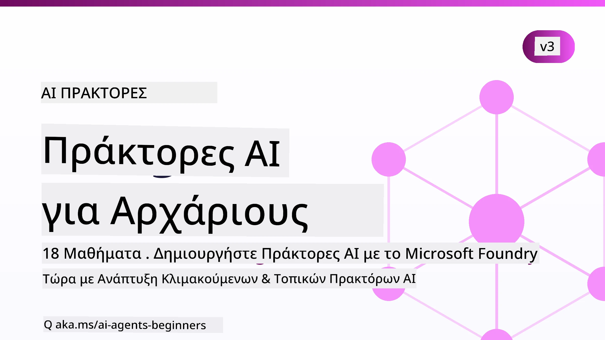

# Πράκτορες Τεχνητής Νοημοσύνης για Αρχάριους - Ένα Μάθημα



## Ένα μάθημα που διδάσκει όλα όσα χρειάζεστε για να ξεκινήσετε να δημιουργείτε Πράκτορες Τεχνητής Νοημοσύνης

[](https://github.com/microsoft/ai-agents-for-beginners/blob/master/LICENSE?WT.mc_id=academic-105485-koreyst)
[](https://GitHub.com/microsoft/ai-agents-for-beginners/graphs/contributors/?WT.mc_id=academic-105485-koreyst)
[](https://GitHub.com/microsoft/ai-agents-for-beginners/issues/?WT.mc_id=academic-105485-koreyst)
[](https://GitHub.com/microsoft/ai-agents-for-beginners/pulls/?WT.mc_id=academic-105485-koreyst)
[](http://makeapullrequest.com?WT.mc_id=academic-105485-koreyst)

### 🌐 Υποστήριξη Πολλών Γλωσσών

#### Υποστηρίζεται μέσω GitHub Action (Αυτοματοποιημένο & Πάντα Ενημερωμένο)

<!-- CO-OP TRANSLATOR LANGUAGES TABLE START -->
[Αραβικά](../ar/README.md) | [Μπενγκάλι](../bn/README.md) | [Βουλγαρικά](../bg/README.md) | [Βιρμανικά (Μιανμάρ)](../my/README.md) | [Κινέζικα (Απλοποιημένα)](../zh-CN/README.md) | [Κινέζικα (Παραδοσιακά, Χονγκ Κονγκ)](../zh-HK/README.md) | [Κινέζικα (Παραδοσιακά, Μακάο)](../zh-MO/README.md) | [Κινέζικα (Παραδοσιακά, Ταϊβάν)](../zh-TW/README.md) | [Κροατικά](../hr/README.md) | [Τσέχικα](../cs/README.md) | [Δανέζικα](../da/README.md) | [Ολλανδικά](../nl/README.md) | [Εσθονικά](../et/README.md) | [Φινλανδικά](../fi/README.md) | [Γαλλικά](../fr/README.md) | [Γερμανικά](../de/README.md) | [Ελληνικά](./README.md) | [Εβραϊκά](../he/README.md) | [Χίντι](../hi/README.md) | [Ουγγρικά](../hu/README.md) | [Ινδονησιακά](../id/README.md) | [Ιταλικά](../it/README.md) | [Ιαπωνικά](../ja/README.md) | [Κανάντα](../kn/README.md) | [Χμερ](../km/README.md) | [Κορεατικά](../ko/README.md) | [Λιθουανικά](../lt/README.md) | [Μαλάι](../ms/README.md) | [Μαλαγιαλάμ](../ml/README.md) | [Μαρακί](../mr/README.md) | [Νεπάλ](../ne/README.md) | [Νιγηριανή Πίνγκιν](../pcm/README.md) | [Νορβηγικά](../no/README.md) | [Περσικά (Φαρσί)](../fa/README.md) | [Πολωνικά](../pl/README.md) | [Πορτογαλικά (Βραζιλία)](../pt-BR/README.md) | [Πορτογαλικά (Πορτογαλία)](../pt-PT/README.md) | [Πουντζάμπι (Γκουρμούκι)](../pa/README.md) | [Ρουμανικά](../ro/README.md) | [Ρωσικά](../ru/README.md) | [Σερβικά (Κυριλλικά)](../sr/README.md) | [Σλοβακικά](../sk/README.md) | [Σλοβενικά](../sl/README.md) | [Ισπανικά](../es/README.md) | [Σουαχίλι](../sw/README.md) | [Σουηδικά](../sv/README.md) | [Ταγκάλογκ (Φιλιππινέζικα)](../tl/README.md) | [Ταμίλ](../ta/README.md) | [Τελούγκου](../te/README.md) | [Ταϊλανδικά](../th/README.md) | [Τουρκικά](../tr/README.md) | [Ουκρανικά](../uk/README.md) | [Ουρντού](../ur/README.md) | [Βιετναμικά](../vi/README.md)

> **Προτιμάτε να κάνετε κλώνο τοπικά;**
>
> Αυτό το αποθετήριο περιλαμβάνει 50+ μεταφράσεις γλωσσών που αυξάνουν σημαντικά το μέγεθος λήψης. Για να κάνετε κλώνο χωρίς μεταφράσεις, χρησιμοποιήστε sparse checkout:
>
> **Bash / macOS / Linux:**
> ```bash
> git clone --filter=blob:none --sparse https://github.com/microsoft/ai-agents-for-beginners.git
> cd ai-agents-for-beginners
> git sparse-checkout set --no-cone '/*' '!translations' '!translated_images'
> ```
>
> **CMD (Windows):**
> ```cmd
> git clone --filter=blob:none --sparse https://github.com/microsoft/ai-agents-for-beginners.git
> cd ai-agents-for-beginners
> git sparse-checkout set --no-cone "/*" "!translations" "!translated_images"
> ```
>
> Αυτό σας δίνει όλα όσα χρειάζεστε για να ολοκληρώσετε το μάθημα με πολύ πιο γρήγορη λήψη.
<!-- CO-OP TRANSLATOR LANGUAGES TABLE END -->

**Εάν θέλετε να υποστηριχθούν επιπλέον γλώσσες μετάφρασης, είναι καταγεγραμμένες [εδώ](https://github.com/Azure/co-op-translator/blob/main/getting_started/supported-languages.md).**

[](https://GitHub.com/microsoft/ai-agents-for-beginners/watchers/?WT.mc_id=academic-105485-koreyst)
[](https://GitHub.com/microsoft/ai-agents-for-beginners/network/?WT.mc_id=academic-105485-koreyst)
[](https://GitHub.com/microsoft/ai-agents-for-beginners/stargazers/?WT.mc_id=academic-105485-koreyst)

[](https://discord.com/invite/ATgtXmAS5D)


## 🌱 Ξεκινώντας

Αυτό το μάθημα περιλαμβάνει μαθήματα που καλύπτουν τα βασικά για τη δημιουργία Πρακτόρων Τεχνητής Νοημοσύνης. Κάθε μάθημα καλύπτει το δικό του θέμα, οπότε ξεκινήστε όποτε θέλετε!

Υπάρχει υποστήριξη πολλών γλωσσών για αυτό το μάθημα. Μεταβείτε στις [διαθέσιμες γλώσσες εδώ](#-multi-language-support).

Εάν αυτή είναι η πρώτη φορά που δημιουργείτε με γεννητικά μοντέλα AI, δείτε το μάθημα μας [Generative AI For Beginners](https://aka.ms/genai-beginners), το οποίο περιλαμβάνει 21 μαθήματα σχετικά με τη δημιουργία με GenAI.

Μην ξεχάσετε να [αποθηκεύσετε (🌟) αυτό το αποθετήριο με αστέρι](https://docs.github.com/en/get-started/exploring-projects-on-github/saving-repositories-with-stars?WT.mc_id=academic-105485-koreyst) και να [κάνετε fork σε αυτό το αποθετήριο](https://github.com/microsoft/ai-agents-for-beginners/fork) για να τρέξετε τον κώδικα.

### Γνωρίστε Άλλους Μαθητές, Λάβετε Απαντήσεις στις Ερωτήσεις σας

Εάν κολλήσετε ή έχετε ερωτήσεις σχετικά με τη δημιουργία Πρακτόρων Τεχνητής Νοημοσύνης, ενταχθείτε στο αφιερωμένο κανάλι Discord στο [Microsoft Foundry Discord](https://aka.ms/ai-agents/discord).

### Τι Χρειάζεστε

Κάθε μάθημα σε αυτό το μάθημα περιλαμβάνει παραδείγματα κώδικα, τα οποία μπορείτε να βρείτε στον φάκελο code_samples. Μπορείτε να [κάνετε fork αυτό το αποθετήριο](https://github.com/microsoft/ai-agents-for-beginners/fork) για να δημιουργήσετε το δικό σας αντίγραφο.  

Τα παραδείγματα κώδικα σε αυτές τις ασκήσεις χρησιμοποιούν το Microsoft Agent Framework με την υπηρεσία Microsoft Foundry Agent V2:

- [Microsoft Foundry](https://aka.ms/ai-agents-beginners/ai-foundry) - Απαιτείται Λογαριασμός Azure

Αυτό το μάθημα χρησιμοποιεί τα ακόλουθα πλαίσια και υπηρεσίες Πρακτόρων Τεχνητής Νοημοσύνης από τη Microsoft:

- [Microsoft Agent Framework (MAF)](https://aka.ms/ai-agents-beginners/agent-framework)
- [Microsoft Foundry Agent Service V2](https://aka.ms/ai-agents-beginners/ai-agent-service)

Ορισμένα δείγματα κώδικα υποστηρίζουν επίσης εναλλακτικούς παρόχους συμβατούς με OpenAI όπως το [MiniMax](https://platform.minimaxi.com/), που προσφέρει μοντέλα μεγάλης διάρκειας (έως 204K tokens). Δείτε το [Course Setup](./00-course-setup/README.md) για λεπτομέρειες διαμόρφωσης.

Για περισσότερες πληροφορίες σχετικά με την εκτέλεση του κώδικα για αυτό το μάθημα, μεταβείτε στο [Course Setup](./00-course-setup/README.md).

## 🙏 Θέλετε να βοηθήσετε;

Έχετε προτάσεις ή βρήκατε ορθογραφικά ή κώδικα λάθη; [Ανοίξτε ένα θέμα](https://github.com/microsoft/ai-agents-for-beginners/issues?WT.mc_id=academic-105485-koreyst) ή [δημιουργήστε ένα αίτημα έλξης](https://github.com/microsoft/ai-agents-for-beginners/pulls?WT.mc_id=academic-105485-koreyst)


## 📂 Κάθε μάθημα περιλαμβάνει

- Ένα γραπτό μάθημα που βρίσκεται στο README και ένα σύντομο βίντεο
- Παραδείγματα κώδικα Python που χρησιμοποιούν το Microsoft Agent Framework με Microsoft Foundry
- Συνδέσμους σε επιπλέον πόρους για να συνεχίσετε τη μάθησή σας


## 🗃️ Μαθήματα

| **Μάθημα**                                  | **Κείμενο & Κώδικας**                              | **Βίντεο**                                                | **Επιπλέον Μάθηση**                                                                    |
|----------------------------------------------|----------------------------------------------------|------------------------------------------------------------|----------------------------------------------------------------------------------------|
| Εισαγωγή στους Πράκτορες AI και Χρήσεις      | [Σύνδεσμος](./01-intro-to-ai-agents/README.md)     | [Βίντεο](https://youtu.be/3zgm60bXmQk?si=z8QygFvYQv-9WtO1) | [Σύνδεσμος](https://aka.ms/ai-agents-beginners/collection?WT.mc_id=academic-105485-koreyst) |
| Εξερεύνηση Πλαισίων Πρακτόρων AI              | [Σύνδεσμος](./02-explore-agentic-frameworks/README.md) | [Βίντεο](https://youtu.be/ODwF-EZo_O8?si=Vawth4hzVaHv-u0H) | [Σύνδεσμος](https://aka.ms/ai-agents-beginners/collection?WT.mc_id=academic-105485-koreyst) |
| Κατανόηση Σχεδιαστικών Προτύπων Πρακτόρων AI  | [Σύνδεσμος](./03-agentic-design-patterns/README.md) | [Βίντεο](https://youtu.be/m9lM8qqoOEA?si=BIzHwzstTPL8o9GF) | [Σύνδεσμος](https://aka.ms/ai-agents-beginners/collection?WT.mc_id=academic-105485-koreyst) |
| Σχεδιαστικό Πρότυπο Χρήσης Εργαλείων          | [Σύνδεσμος](./04-tool-use/README.md)               | [Βίντεο](https://youtu.be/vieRiPRx-gI?si=2z6O2Xu2cu_Jz46N) | [Σύνδεσμος](https://aka.ms/ai-agents-beginners/collection?WT.mc_id=academic-105485-koreyst) |
| Agentic RAG                                  | [Σύνδεσμος](./05-agentic-rag/README.md)             | [Βίντεο](https://youtu.be/WcjAARvdL7I?si=gKPWsQpKiIlDH9A3) | [Σύνδεσμος](https://aka.ms/ai-agents-beginners/collection?WT.mc_id=academic-105485-koreyst) |
| Δημιουργία Αξιόπιστων Πρακτόρων AI             | [Σύνδεσμος](./06-building-trustworthy-agents/README.md) | [Βίντεο](https://youtu.be/iZKkMEGBCUQ?si=jZjpiMnGFOE9L8OK ) | [Σύνδεσμος](https://aka.ms/ai-agents-beginners/collection?WT.mc_id=academic-105485-koreyst) |
| Σχεδιαστικό Πρότυπο Προγραμματισμού           | [Σύνδεσμος](./07-planning-design/README.md)        | [Βίντεο](https://youtu.be/kPfJ2BrBCMY?si=6SC_iv_E5-mzucnC) | [Σύνδεσμος](https://aka.ms/ai-agents-beginners/collection?WT.mc_id=academic-105485-koreyst) |
| Σχεδιαστικό Πρότυπο Πολλαπλών Πρακτόρων       | [Σύνδεσμος](./08-multi-agent/README.md)            | [Βίντεο](https://youtu.be/V6HpE9hZEx0?si=rMgDhEu7wXo2uo6g) | [Σύνδεσμος](https://aka.ms/ai-agents-beginners/collection?WT.mc_id=academic-105485-koreyst) |

| Σχέδιο Μεταγνωσίας                 | [Link](./09-metacognition/README.md)               | [Video](https://youtu.be/His9R6gw6Ec?si=8gck6vvdSNCt6OcF)  | [Link](https://aka.ms/ai-agents-beginners/collection?WT.mc_id=academic-105485-koreyst) |
| Πράκτορες AI στην Παραγωγή                      | [Link](./10-ai-agents-production/README.md)        | [Video](https://youtu.be/l4TP6IyJxmQ?si=31dnhexRo6yLRJDl)  | [Link](https://aka.ms/ai-agents-beginners/collection?WT.mc_id=academic-105485-koreyst) |
| Χρήση Πρωτοκόλλων Πράκτορα (MCP, A2A και NLWeb) | [Link](./11-agentic-protocols/README.md)           | [Video](https://youtu.be/X-Dh9R3Opn8)                                 | [Link](https://aka.ms/ai-agents-beginners/collection?WT.mc_id=academic-105485-koreyst) |
| Μηχανική Πλαισίου για Πράκτορες AI            | [Link](./12-context-engineering/README.md)         | [Video](https://youtu.be/F5zqRV7gEag)                                 | [Link](https://aka.ms/ai-agents-beginners/collection?WT.mc_id=academic-105485-koreyst) |
| Διαχείριση Μνήμης Πράκτορα                      | [Link](./13-agent-memory/README.md)     |      [Video](https://youtu.be/QrYbHesIxpw?si=vZkVwKrQ4ieCcIPx)                                                      |                                                                                        |
| Εξερεύνηση Microsoft Agent Framework                         | [Link](./14-microsoft-agent-framework/README.md)                            |                                                            |                                                                                        |
| Δημιουργία Πρακτόρων Χρήσης Υπολογιστή (CUA)           | [Link](./15-browser-use/README.md)     |                                                            | [Link](https://docs.browser-use.com/examples/templates/playwright-integration)         |
| Ανάπτυξη Κλιμακούμενων Πρακτόρων                    | [Link](./16-deploying-scalable-agents/README.md) |                                                    | [Link](https://learn.microsoft.com/azure/ai-foundry/agents/overview)                   |
| Δημιουργία Τοπικών Πρακτόρων AI                     | [Link](./17-creating-local-ai-agents/README.md)  |                                                    | [Link](https://learn.microsoft.com/azure/ai-foundry/foundry-local/)                    |
| Ασφάλεια των Πρακτόρων AI                           | [Link](./18-securing-ai-agents/README.md)  |                                                            | [Link](https://aka.ms/ai-agents-beginners/collection?WT.mc_id=academic-105485-koreyst) |

## 🎒 Άλλα Μαθήματα

Η ομάδα μας παράγει κι άλλα μαθήματα! Ρίξτε μια ματιά:

<!-- CO-OP TRANSLATOR OTHER COURSES START -->
### LangChain
[](https://aka.ms/langchain4j-for-beginners)
[](https://aka.ms/langchainjs-for-beginners?WT.mc_id=m365-94501-dwahlin)
[](https://github.com/microsoft/langchain-for-beginners?WT.mc_id=m365-94501-dwahlin)
---

### Azure / Edge / MCP / Πράκτορες
[](https://github.com/microsoft/AZD-for-beginners?WT.mc_id=academic-105485-koreyst)
[](https://github.com/microsoft/edgeai-for-beginners?WT.mc_id=academic-105485-koreyst)
[](https://github.com/microsoft/mcp-for-beginners?WT.mc_id=academic-105485-koreyst)
[](https://github.com/microsoft/ai-agents-for-beginners?WT.mc_id=academic-105485-koreyst)

---
 
### Σειρά Generative AI
[](https://github.com/microsoft/generative-ai-for-beginners?WT.mc_id=academic-105485-koreyst)
[-9333EA?style=for-the-badge&labelColor=E5E7EB&color=9333EA)](https://github.com/microsoft/Generative-AI-for-beginners-dotnet?WT.mc_id=academic-105485-koreyst)
[-C084FC?style=for-the-badge&labelColor=E5E7EB&color=C084FC)](https://github.com/microsoft/generative-ai-for-beginners-java?WT.mc_id=academic-105485-koreyst)
[-E879F9?style=for-the-badge&labelColor=E5E7EB&color=E879F9)](https://github.com/microsoft/generative-ai-with-javascript?WT.mc_id=academic-105485-koreyst)

---
 
### Κύρια Μάθηση
[](https://aka.ms/ml-beginners?WT.mc_id=academic-105485-koreyst)
[](https://aka.ms/datascience-beginners?WT.mc_id=academic-105485-koreyst)
[](https://aka.ms/ai-beginners?WT.mc_id=academic-105485-koreyst)
[](https://github.com/microsoft/Security-101?WT.mc_id=academic-96948-sayoung)
[](https://aka.ms/webdev-beginners?WT.mc_id=academic-105485-koreyst)
[](https://aka.ms/iot-beginners?WT.mc_id=academic-105485-koreyst)
[](https://github.com/microsoft/xr-development-for-beginners?WT.mc_id=academic-105485-koreyst)

---
 
### Σειρά Copilot
[](https://aka.ms/GitHubCopilotAI?WT.mc_id=academic-105485-koreyst)
[](https://github.com/microsoft/mastering-github-copilot-for-dotnet-csharp-developers?WT.mc_id=academic-105485-koreyst)
[](https://github.com/microsoft/CopilotAdventures?WT.mc_id=academic-105485-koreyst)
<!-- CO-OP TRANSLATOR OTHER COURSES END -->

## 🌟 Ευχαριστίες στην Κοινότητα

Ευχαριστούμε τον [Shivam Goyal](https://www.linkedin.com/in/shivam2003/) για τη συνεισφορά σημαντικών παραδειγμάτων κώδικα που δείχνουν τον Agentic RAG. 

## Συνεισφορά

Αυτό το έργο καλωσορίζει συνεισφορές και προτάσεις. Οι περισσότερες συνεισφορές απαιτούν να συμφωνήσετε με μια
Συμφωνία Άδειας Συμβολής (CLA) που δηλώνει ότι έχετε το δικαίωμα, και πράγματι παρέχετε,
τα δικαιώματα να χρησιμοποιήσουμε τη συνεισφορά σας. Για λεπτομέρειες, επισκεφθείτε το <https://cla.opensource.microsoft.com>.

Όταν υποβάλλετε ένα pull request, ένα bot CLA θα καθορίσει αυτόματα αν πρέπει να παρέχετε
μια CLA και θα διακοσμήσει το PR ανάλογα (π.χ., έλεγχος κατάστασης, σχόλιο). Απλώς ακολουθήστε τις οδηγίες
που παρέχονται από το bot. Θα χρειαστεί να το κάνετε μόνο μία φορά σε όλα τα αποθετήρια που χρησιμοποιούν την CLA μας.

Αυτό το έργο έχει υιοθετήσει τον [Κώδικα Δεοντολογίας Ανοιχτού Κώδικα της Microsoft](https://opensource.microsoft.com/codeofconduct/).
Για περισσότερες πληροφορίες δείτε τις [Συχνές Ερωτήσεις για τον Κώδικα Δεοντολογίας](https://opensource.microsoft.com/codeofconduct/faq/) ή
επικοινωνήστε με [opencode@microsoft.com](mailto:opencode@microsoft.com) για επιπλέον ερωτήσεις ή σχόλια.

## Εμπορικά Σήματα

Αυτό το έργο μπορεί να περιέχει εμπορικά σήματα ή λογότυπα για έργα, προϊόντα ή υπηρεσίες. Η εξουσιοδοτημένη χρήση
εμπορικών σημάτων ή λογότυπων της Microsoft υπόκειται και πρέπει να ακολουθεί
[Τις Οδηγίες Χρήσης Εμπορικών Σημάτων & Επωνυμιών της Microsoft](https://www.microsoft.com/legal/intellectualproperty/trademarks/usage/general).
Η χρήση εμπορικών σημάτων ή λογότυπων της Microsoft σε τροποποιημένες εκδόσεις αυτού του έργου δεν πρέπει να προκαλεί σύγχυση ή να υπονοεί χορηγία από τη Microsoft.
Κάθε χρήση εμπορικών σημάτων ή λογότυπων τρίτων υπόκειται στις πολιτικές αυτών των τρίτων.

## Λήψη Βοήθειας


Αν κολλήσετε ή έχετε απορίες σχετικά με την κατασκευή εφαρμογών AI, γίνετε μέλος:

[](https://aka.ms/foundry/discord)

Αν έχετε σχόλια για προϊόν ή σφάλματα κατά την κατασκευή επισκεφτείτε:

[](https://aka.ms/foundry/forum)

---

<!-- CO-OP TRANSLATOR DISCLAIMER START -->
**Αποποίηση ευθυνών**:
Αυτό το έγγραφο έχει μεταφραστεί χρησιμοποιώντας την υπηρεσία μετάφρασης με τεχνητή νοημοσύνη [Co-op Translator](https://github.com/Azure/co-op-translator). Ενώ επιδιώκουμε την ακρίβεια, παρακαλούμε να έχετε υπόψη ότι οι αυτοματοποιημένες μεταφράσεις ενδέχεται να περιέχουν λάθη ή ανακρίβειες. Το πρωτότυπο έγγραφο στη μητρική του γλώσσα πρέπει να θεωρείται η αυθεντική πηγή. Για κρίσιμες πληροφορίες, συνιστάται επαγγελματική ανθρώπινη μετάφραση. Δεν φέρουμε ευθύνη για τυχόν παρεξηγήσεις ή λανθασμένες ερμηνείες που προκύπτουν από τη χρήση αυτής της μετάφρασης.
<!-- CO-OP TRANSLATOR DISCLAIMER END -->